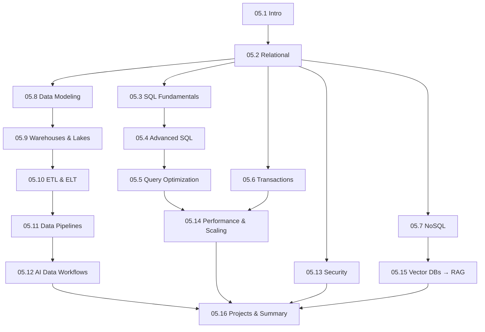

# Module 05 · Databases & Data Engineering — Lessons

[⬅ Module home](../README.md) · [🗺 Roadmap](../../../ROADMAP.md) · [📚 Curriculum](../../../CURRICULUM.md)

> This is the map of Module 05. **AI runs on data** — and data lives in databases, warehouses, lakes, and pipelines. This module teaches how data is *stored, queried, optimized, secured, and moved* in real production AI systems. It is not a SQL-syntax course; it's a data-engineering course with SQL at its core.

---

## Who this module is for

You can write Python ([Module 01](../../01-Advanced-Python/README.md)), reason about data structures and complexity ([Module 02](../../02-Computer-Science/README.md)), and operate Linux servers ([Module 03](../../03-Linux/README.md)). Now you learn the systems that *hold* the data your AI consumes and produces — from a Postgres table to a petabyte lakehouse.

> [!IMPORTANT]
> **Every AI system is a data system first.** Your model is only as good as the data pipeline feeding it, and your application needs somewhere to store users, metadata, documents, evaluations, and results. AI Engineers who can't design a schema, optimize a slow query, or build a reliable pipeline hit a hard ceiling. This module removes it — and ends by previewing **vector databases**, the bridge to RAG ([Module 13](../../13-RAG/README.md)).

---

## Lessons

| # | Lesson | Section |
|---|---|---|
| 05.1 | [Introduction to Databases](05.1-introduction.md) | §1 what/why, evolution, files vs DBs, structured vs unstructured |
| 05.2 | [Relational Databases](05.2-relational-databases.md) | §2 tables, keys, relationships, normalization/denormalization |
| 05.3 | [SQL Fundamentals](05.3-sql-fundamentals.md) | §3a SELECT/INSERT/UPDATE/DELETE, JOINs, GROUP BY/HAVING/ORDER BY |
| 05.4 | [Advanced SQL](05.4-advanced-sql.md) | §3b subqueries, CTEs, window functions, views, procedures, triggers |
| 05.5 | [Query Optimization](05.5-query-optimization.md) | §4 execution plans, indexes, B-trees, composite/covering indexes |
| 05.6 | [Transactions](05.6-transactions.md) | §5 ACID, isolation levels, locks, deadlocks, MVCC |
| 05.7 | [NoSQL Databases](05.7-nosql.md) | §6 document, key-value, wide-column, graph (Mongo/Redis/Cassandra/Neo4j) |
| 05.8 | [Data Modeling](05.8-data-modeling.md) | §7 ER diagrams, star/snowflake schema, facts & dimensions |
| 05.9 | [Data Warehouses & Lakes](05.9-warehouses-lakes.md) | §8 warehouse, lake, lakehouse; Snowflake/BigQuery/Redshift/Databricks |
| 05.10 | [ETL & ELT](05.10-etl-elt.md) | §9 ingestion, transformation, validation, batch vs streaming, Airflow |
| 05.11 | [Data Pipelines](05.11-data-pipelines.md) | §10 architecture, scheduling, retries, monitoring, lineage, quality |
| 05.12 | [AI Data Workflows](05.12-ai-data-workflows.md) | §11 raw → clean → features → train → eval → deploy → monitor |
| 05.13 | [Database Security](05.13-database-security.md) | §12 authn/authz, encryption, backups, DR, secrets |
| 05.14 | [Performance & Scaling](05.14-performance-scaling.md) | §13 caching, partitioning, sharding, replication, pooling |
| 05.15 | [Vector Database Preview](05.15-vector-databases.md) | §14 embeddings, similarity search, why SQL isn't enough |
| 05.16 | [Projects & Summary](05.16-projects-summary.md) | §15 six projects + module consolidation |

### Companion artifacts
- 🏋️ [Exercises](../exercises/) — SQL, design, optimization, modeling, debugging
- 🧠 [Flashcards](../flashcards/deck.md) — spaced-repetition deck
- 📝 [Quiz](../quizzes/quiz-01.md) — self-assessment with answers
- 📄 [Cheat sheet](../cheat-sheets/databases-cheatsheet.md) — one-page reference

---

## How the lessons connect

**Estimated time:** ~14 hours reading · ~6 hours projects · ~2 hours review (per the [Roadmap](../../../ROADMAP.md)).

> [!TIP]
> **Install PostgreSQL (or run it in Docker) and follow along with real queries.** SQL is a *doing* skill — reading about a JOIN teaches nothing; writing one against real tables teaches everything. `docker run -e POSTGRES_PASSWORD=x -p 5432:5432 postgres` gets you a database in seconds ([Module 03.16](../../03-Linux/weeks/03.16-docker-preparation.md)). All examples use PostgreSQL unless noted.
