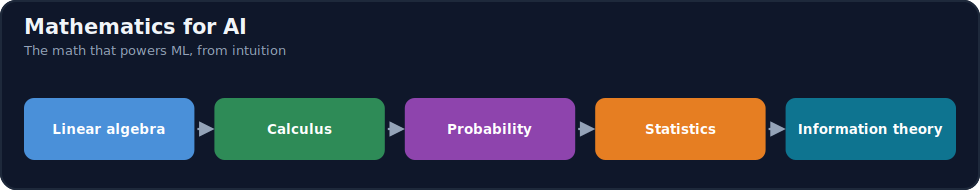
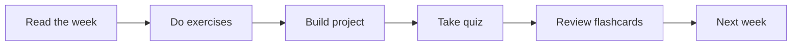

# Module 06 · Mathematics

[⬅ 05 · SQL](../05-SQL/README.md) · [🏠 docs](../README.md) · [🗺 Roadmap](../../ROADMAP.md) · [07 · Data Analysis ➡](../07-Data-Analysis/README.md)

> The math that powers ML — built from intuition, not memorization.

---

## Purpose

This module covers **Mathematics**. The math that powers ML — built from intuition, not memorization. It fits into the overall program as described in the [Roadmap](../../ROADMAP.md) and [Curriculum](../../CURRICULUM.md).

## What you'll learn

- Linear algebra for machine learning
- Calculus, gradients, and the chain rule
- Probability and statistics
- Optimization intuition

## 📖 Lessons (start here)

> ✅ **This module's content is written.** Work through the lessons in order via the [lesson index](weeks/README.md). **Run every NumPy snippet** — mathematics becomes real when you *see* the matrix rotate the vector.

| # | Lesson |
|---|---|
| 06.1 | [Mathematical Thinking](weeks/06.1-mathematical-thinking.md) |
| 06.2 | [Linear Algebra I — Vectors & Matrices](weeks/06.2-linear-algebra-vectors-matrices.md) |
| 06.3 | [Linear Algebra II — Structure & Decomposition](weeks/06.3-linear-algebra-decomposition.md) |
| 06.4 | [Calculus & Gradients](weeks/06.4-calculus.md) |
| 06.5 | [Probability](weeks/06.5-probability.md) |
| 06.6 | [Statistics](weeks/06.6-statistics.md) |
| 06.7 | [Optimization](weeks/06.7-optimization.md) |
| 06.8 | [Information Theory](weeks/06.8-information-theory.md) |
| 06.9 | [Numerical Computing](weeks/06.9-numerical-computing.md) |
| 06.10 | [Mathematics of Neural Networks](weeks/06.10-neural-network-math.md) |
| 06.11 | [Mathematics Behind Transformers](weeks/06.11-transformer-math.md) |
| 06.12 | [Reading Mathematical Notation](weeks/06.12-reading-notation.md) |
| 06.13 | [Projects & Summary](weeks/06.13-projects-summary.md) |

**Companion artifacts:** [Exercises](exercises/README.md) · [Quiz](quizzes/quiz-01.md) · [Flashcards](flashcards/deck.md) · [Cheat sheet](cheat-sheets/math-cheatsheet.md)

> [!IMPORTANT]
> **You need far less math than you fear — but you need to *understand* it, not memorize it.** Four ideas carry most of practical AI: the **dot product** (similarity), the **gradient** (direction of steepest increase), the **probability distribution** (uncertainty), and **cross-entropy** (how wrong a predicted distribution is). This module is engineered to give you exactly those, deeply — and then show you that attention, LoRA, Adam, and backprop are all built from them.

## How this module is organized

Content is delivered week by week. Each module uses the same subfolders:

| Folder | Contents |
|---|---|
| [`weeks/`](weeks/) | Weekly lesson content, one file per week (`week-01.md`, `week-02.md`, …). |
| [`diagrams/`](diagrams/) | Mermaid sources and exported diagram assets for this module. |
| [`exercises/`](exercises/) | Hands-on practice problems with solutions. |
| [`projects/`](projects/) | Buildable projects that apply this module's skills. |
| [`quizzes/`](quizzes/) | Self-assessment question banks with answer keys. |
| [`flashcards/`](flashcards/) | Spaced-repetition Q/A decks for active recall. |
| [`cheat-sheets/`](cheat-sheets/) | One-page quick references for this module. |
| [`references/`](references/) | Paper summaries and deep-dive notes. |

## Suggested study flow

## File & naming conventions

| Item | Convention | Example |
|---|---|---|
| Weekly lesson | `week-NN.md` | `weeks/week-01.md` |
| Exercise | `exercise-NN.md` (+ `solution-NN.*`) | `exercises/exercise-01.md` |
| Project | `project-NN/` folder with `README.md` | `projects/project-01/` |
| Quiz | `quiz-NN.md` (+ `answers-NN.md`) | `quizzes/quiz-01.md` |
| Flashcards | `deck.md` | `flashcards/deck.md` |
| Diagram | `topic.mmd` / `topic.png` | `diagrams/attention.mmd` |

## Markdown conventions

This file follows the repository Markdown standards — see [CONTRIBUTING.md](../../CONTRIBUTING.md): one H1 per file, tables over prose, GitHub callouts (`> [!NOTE]`), fenced code blocks with a language, Mermaid for diagrams, and relative internal links.

## Related modules

- [Machine Learning](../08-Machine-Learning/README.md)
- [Deep Learning](../09-Deep-Learning/README.md)

---

## Navigation

| Direction | Link |
|---|---|
| ⬆ Parent | [docs/](../README.md) |
| ⬅ Previous | [⬅ 05 · SQL](../05-SQL/README.md) |
| ➡ Next | [07 · Data Analysis ➡](../07-Data-Analysis/README.md) |
| 🗺 Roadmap | [ROADMAP.md](../../ROADMAP.md) |
| 📚 Curriculum | [CURRICULUM.md](../../CURRICULUM.md) |
| 🏠 Repo root | [README.md](../../README.md) |
