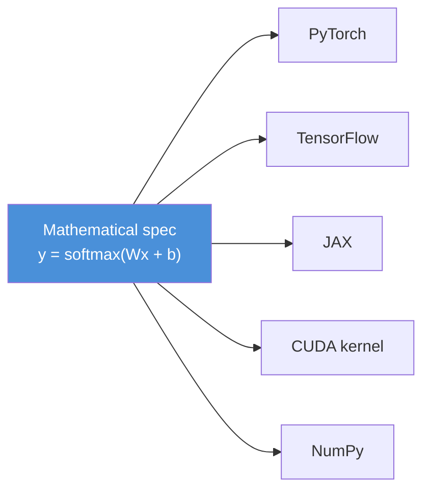
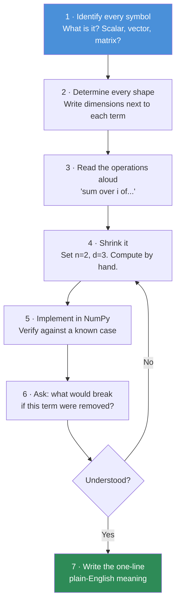
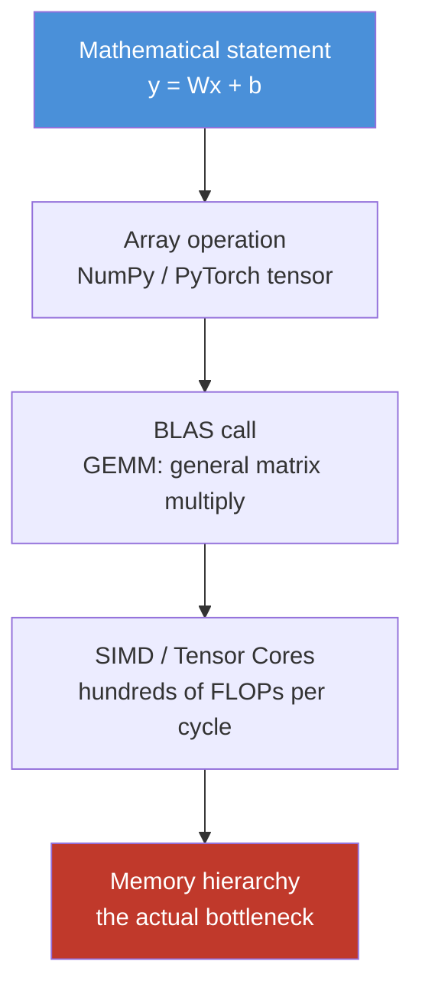

# 06.1 · Mathematical Thinking

[⬅ Lesson index](README.md) · [🏠 Module 06](../README.md) · [➡ Next: Linear Algebra I](06.2-linear-algebra-vectors-matrices.md)

> **The lesson in one line:** Mathematics is not a gate you must pass to do AI — it is the **compression format** engineers use to describe what a model computes, and you already think this way every day.

---

## 🎯 Learning objectives

By the end of this lesson you can:

1. Explain **why** mathematics — not English, not code — became the language AI is written in.
2. Approach an unfamiliar equation with a repeatable **decoding procedure** instead of anxiety.
3. Name the four mathematical ideas that carry ~80% of practical AI, and the ones you can safely defer.
4. Dismantle the five misconceptions that make engineers believe they "can't do math."
5. Adopt a learning strategy built on **intuition → code → formalism**, with active recall.

---

## 🧠 Mental model

> **An equation is a function signature.**

You already read this without fear:

```python
def attention(Q: Tensor, K: Tensor, V: Tensor) -> Tensor: ...
```

A paper writes the same thing as:

$$\text{Attention}(Q,K,V) = \text{softmax}\!\left(\frac{QK^\top}{\sqrt{d_k}}\right)V$$

Both are **dense notation for a computation**. The paper's version is *shorter*, *unambiguous about shapes and operations*, and *implementation-independent* — it says what happens without committing to PyTorch, JAX, or CUDA. That is the entire reason mathematics exists in AI: **it is the most compressed, least ambiguous way to specify a computation.**

When you feel intimidated by a formula, you are not failing at mathematics. You are **reading unfamiliar syntax** — exactly as you once felt reading your first Rust lifetime annotation or your first regex. Syntax is learnable in hours. Concepts take longer, and there are fewer of them than you think.

---

## 💡 Intuition — why math is the language of AI

### Reason 1 — Neural networks *are* mathematical objects

A trained model is not "code." It's a **pile of numbers** (weights) plus a **recipe for combining them** (the architecture). The code in PyTorch is just one *encoding* of that recipe. Change the framework and the code changes completely; the mathematics does not. If you only know the code, you know one dialect. If you know the math, you can read any framework, any paper, any year.



The math is the **source of truth**; every framework is a compilation target.

### Reason 2 — Debugging AI requires reasoning about *quantities*, not control flow

Traditional bugs announce themselves: a stack trace, a 500, a failing assertion. **AI bugs are silent.** The model trains, the loss drops, the API returns 200 — and the outputs are subtly wrong.

| Symptom you'll actually see | What you must reason about | Where it's taught |
|---|---|---|
| Loss goes to `NaN` at step 400 | Overflow in `exp`, log of zero | [06.9 Numerical Computing](06.9-numerical-computing.md) |
| Loss plateaus and never moves | Vanishing gradients, dead ReLUs | [06.10 NN Math](06.10-neural-network-math.md) |
| Training loss drops, val loss rises | Overfitting, distribution mismatch | [06.6 Statistics](06.6-statistics.md) |
| Model is confidently wrong | Miscalibration, cross-entropy behaviour | [06.8 Information Theory](06.8-information-theory.md) |
| Retrieval returns irrelevant chunks | Cosine similarity, normalization | [06.2 Linear Algebra I](06.2-linear-algebra-vectors-matrices.md) |
| Training is 10× slower than expected | Non-vectorized loops, bad memory layout | [06.9](06.9-numerical-computing.md) |

Not one of those is diagnosable by reading a stack trace. Every one is diagnosable by understanding the mathematics of what the model is computing. **This is the real, unglamorous, everyday reason AI Engineers need math.**

> [!IMPORTANT]
> You are not learning mathematics to *derive* new architectures (most engineers never will). You are learning it so that when a training run goes wrong at 3 a.m., you have a mental model of what the numbers are doing — instead of randomly changing the learning rate and praying.

### Reason 3 — Papers are the documentation

In most of software, the documentation is prose. In AI, **the paper is the documentation**, and the paper's core contribution is almost always a handful of equations. RoPE, LoRA, RLHF, flash attention, quantization — each is a page of context and one or two equations that carry the actual idea. If equations are opaque to you, you are permanently downstream of blog posts written by people who *did* read them, and you're always six months behind.

---

## 📐 How software engineers should approach mathematics

You have an enormous advantage over the average math student, and a specific handicap. Use the advantage; patch the handicap.

| Your advantage as an engineer | How to exploit it |
|---|---|
| You can **run code** | Never accept a formula on faith — implement it in NumPy and *watch* it behave |
| You think in **types & shapes** | Track every tensor's shape; shape errors reveal 90% of misunderstandings |
| You debug by **printing** | Print intermediate values of an equation the same way you'd print inside a function |
| You know **abstraction layers** | A formula is an interface; you don't need its proof to use it correctly |
| You're comfortable with **notation** | You survived regex, SQL, and YAML. Sigma notation is easier than all three |

| Your handicap | The patch |
|---|---|
| You want to *use* before you *understand* | Fine — but always circle back once. Understanding-later beats understanding-never |
| You skim | Mathematics has **zero redundancy**. One symbol carries what a paragraph of prose would. Read slowly |
| You expect instant comprehension | Confusion is the normal state, not a signal of failure. It resolves on the second and third pass |

### The decoding procedure

When you meet an equation you don't understand, do **not** stare at it. Run this loop:



**Steps 4 and 6 are the ones people skip, and they are where the understanding actually lives.** Shrinking an equation to a 2×3 example you can compute on paper converts abstraction into arithmetic. Asking what breaks if a term is removed tells you *why the term is there* — which is the only thing you'll actually remember.

#### Worked example of the procedure

Take the scaled dot-product attention formula above.

| Step | Applied |
|---|---|
| **1 · Symbols** | $Q, K, V$ are matrices. $d_k$ is a scalar (the key dimension). |
| **2 · Shapes** | $Q$: `(n, d_k)`, $K$: `(m, d_k)`, $V$: `(m, d_v)`. So $QK^\top$ is `(n, m)` and the output is `(n, d_v)`. |
| **3 · Read aloud** | "Score every query against every key, scale, turn into probabilities, use those to average the values." |
| **4 · Shrink** | Set n=2, m=2, d_k=2. Now it's four dot products and two softmaxes — arithmetic. |
| **5 · Implement** | Ten lines of NumPy ([06.11](06.11-transformer-math.md)). |
| **6 · Remove a term** | Delete $\sqrt{d_k}$ → scores grow with dimension → softmax saturates → gradients vanish. *That's why it's there.* |
| **7 · Plain English** | "A soft, differentiable dictionary lookup." |

You just read the most important equation in modern AI. It took seven steps and no proofs.

> [!TIP]
> **Shapes are your debugger.** In practice, the single highest-leverage habit is annotating every tensor with its shape — in papers, in a notebook margin, in code comments. Most confusion about an equation is actually confusion about *what is being summed over*, and shapes resolve that instantly.

---

## 🚫 Common misconceptions

**Misconception 1 — "I need to be good at math."**
You need to be good at *these specific ~15 topics*, most of which are mechanical. "Being good at math" (competition problem-solving, elegant proofs) is a different skill, and it is not what AI Engineering asks of you. Plenty of excellent AI engineers were mediocre math students.

**Misconception 2 — "I need to be able to derive backpropagation from scratch."**
You need to *understand* it — once, deeply, so you know what a vanishing gradient is and why residual connections exist. You will derive it exactly once, in [06.10](06.10-neural-network-math.md), and then never again, because `autograd` does it. That single derivation pays for itself forever.

**Misconception 3 — "Frameworks abstract the math away, so I can skip it."**
Frameworks abstract the *computation*, not the *understanding*. `nn.Linear(768, 3072)` runs without your understanding — and gives you no way to reason about why your model won't converge, why your embeddings cluster wrong, or what a paper's ablation table means. The abstraction leaks the moment something goes wrong, which in AI is constantly.

**Misconception 4 — "Math is about memorizing formulas."**
Every formula in this module is one you can look up in three seconds. What you cannot look up is the *intuition*: that a dot product measures alignment, that a gradient points uphill, that entropy measures surprise. **Memorize nothing; internalize everything.**

**Misconception 5 — "If I don't understand it immediately, I'm not smart enough."**
This is the one that ends careers before they start. Mathematical understanding is **iterative by nature**: pass one gives you vocabulary, pass two gives you mechanics, pass three gives you intuition. Everyone — including the authors of the papers you're reading — needed multiple passes. Confusion is not a verdict on your ability; it's a stage in the process.

> [!WARNING]
> **The most damaging habit is pretending to understand.** Nodding along at a formula you can't decode compounds: every later concept builds on it, and six lessons downstream you're lost with no idea where the rot started. When you don't understand something, *stop and mark it*. Ambiguity tolerated becomes confusion inherited.

---

## 📖 Formal definition — what you actually need

Here is the honest inventory. This is the whole of practical AI mathematics, ranked by return on investment.

| Tier | Topic | Why | Where in this module |
|---|---|---|---|
| **🔴 Non-negotiable** | Vectors, matrices, matmul, dot product | *Everything* a neural net does is matmul | [06.2](06.2-linear-algebra-vectors-matrices.md) |
| **🔴 Non-negotiable** | Derivatives, gradients, chain rule | Training *is* the chain rule | [06.4](06.4-calculus.md) |
| **🔴 Non-negotiable** | Probability distributions, expectation | Models output distributions | [06.5](06.5-probability.md) |
| **🔴 Non-negotiable** | Cross-entropy, softmax | The loss function of nearly every classifier and every LLM | [06.8](06.8-information-theory.md) |
| **🟠 High value** | Gradient descent & its variants | How training actually proceeds | [06.7](06.7-optimization.md) |
| **🟠 High value** | Numerical stability, floats | Where `NaN`s come from | [06.9](06.9-numerical-computing.md) |
| **🟠 High value** | Mean/variance/correlation | Evaluating models, reading benchmarks | [06.6](06.6-statistics.md) |
| **🟡 Worth knowing** | Eigenvalues, SVD, PCA | Dimensionality reduction, embeddings, LoRA | [06.3](06.3-linear-algebra-decomposition.md) |
| **🟡 Worth knowing** | Bayes' theorem | Reasoning under uncertainty; naive Bayes; priors | [06.5](06.5-probability.md) |
| **🟡 Worth knowing** | KL divergence | RLHF/DPO, VAEs, distillation | [06.8](06.8-information-theory.md) |
| **⚪ Defer** | Measure theory, real analysis | Research-level; you will not need it | — |
| **⚪ Defer** | Manual matrix calculus identities | `autograd` does it; know the *idea* only | — |
| **⚪ Defer** | Most proofs | Intuition ≫ proof for engineering | — |

> [!NOTE]
> **Four ideas carry most of the weight:** the **dot product** (similarity), the **gradient** (direction of steepest increase), the **probability distribution** (uncertainty), and **cross-entropy** (how wrong a predicted distribution is). If you deeply understand only those four, you can read most of modern deep learning. Everything else in this module is elaboration on them.

---

## 📊 Geometry — the visual habit

Almost every idea in this module has a picture, and the picture is what you'll remember five years from now.

| Concept | The picture in your head |
|---|---|
| Vector | An arrow from the origin |
| Dot product | How much two arrows point the same way |
| Matrix | A machine that stretches/rotates space |
| Eigenvector | The arrow a matrix doesn't rotate |
| Derivative | Slope of a curve at a point |
| Gradient | Steepest-uphill direction on a landscape |
| Gradient descent | A ball rolling downhill |
| Distribution | A histogram, and the curve it approaches |
| Entropy | How flat that histogram is |
| Softmax | Squashing arbitrary scores into a histogram |
| Embedding | A point in a "meaning space" |

> 🖼️ **[IMAGE PLACEHOLDER: `assets/images/06-math-visual-vocabulary.png`]**
> *A single poster-style figure with 11 mini-panels, one per row of the table above: an arrow from the origin; two arrows with the cosine angle marked; a unit square being sheared into a parallelogram; a red arrow unchanged by that shear while a blue one rotates; a curve with a tangent line; a 3-D bowl with a downhill arrow; a ball tracing a path down that bowl; a histogram with a smooth curve overlaid; two histograms (one flat = high entropy, one spiked = low entropy); raw scores becoming a bar chart summing to 1; a 2-D scatter with "king/queen/man/woman" labelled. Muted blue/orange palette on white; each panel captioned with the concept name.*

**Build this poster in your head.** When you later read a paper, you should be seeing shapes, not symbols.

---

## ⚙️ Internal implementation — how math becomes hardware

There's a chain from the equation to the silicon, and knowing it explains most performance behaviour in AI.



Two consequences you should carry forward:

1. **Everything is pushed into matrix multiplication on purpose.** GPUs are, essentially, matmul machines. An architecture that can be expressed as big matmuls runs 100× faster than a mathematically equivalent one expressed as loops. This is *why* Transformers won: attention is matmul-shaped, and RNNs are inherently sequential. Hardware shapes which mathematics wins.
2. **The bottleneck is usually memory, not arithmetic.** Modern GPUs can do far more FLOPs than they can feed with data — see [02.3 Memory](../../02-Computer-Science/weeks/02.3-memory.md). This is why FlashAttention (an *identical* mathematical result, a better memory access pattern) was a landmark result.

---

## 🐍 NumPy implementation — the translation habit

The core skill this module builds is **translating notation to code**. Practice it here in miniature.

```python
import numpy as np

# ── Equation:  s = Σᵢ xᵢ yᵢ   (the dot product)
x = np.array([1.0, 2.0, 3.0])
y = np.array([4.0, 5.0, 6.0])

# Literal transcription of the sigma (the "loop" version)
s_loop = 0.0
for i in range(len(x)):
    s_loop += x[i] * y[i]

# Vectorized: what you will always write in practice
s_vec = np.dot(x, y)          # or  x @ y

print(s_loop, s_vec)          # 32.0 32.0  → identical
```

**The lesson isn't the dot product — it's the mapping.** Internalize this table; it is the Rosetta Stone for the rest of the module:

| Notation | Means | NumPy |
|---|---|---|
| $\sum_i$ | "loop and add" | `.sum(axis=...)` |
| $\prod_i$ | "loop and multiply" | `.prod(axis=...)` |
| $x^\top y$ | dot product | `x @ y` |
| $A B$ | matrix multiply | `A @ B` |
| $A^\top$ | transpose | `A.T` |
| $\|x\|$ | length of a vector | `np.linalg.norm(x)` |
| $\hat{y}$ | *predicted* value | `y_pred` |
| $\mathbb{E}[X]$ | average | `X.mean()` |
| subscript $x_i$ | indexing | `x[i]` |

Every `for` loop you write over a sigma is one you'll later delete in favour of a vectorized call. Write the loop **first** to prove you understand it; vectorize **second** for speed. That's the whole rhythm of this module.

---

## 🤖 AI applications — where this actually lands

| The skill from this lesson | The moment it pays off |
|---|---|
| Decoding an equation | Reading the LoRA paper and realizing it's just $W + BA$ with a low-rank $BA$ |
| Shape-tracking | Fixing a `RuntimeError: mat1 and mat2 shapes cannot be multiplied` in seconds |
| "What breaks if I remove this term?" | Understanding why $\sqrt{d_k}$, layer norm, and residual connections exist |
| Intuition over memorization | Choosing cosine vs. Euclidean distance for your RAG retriever, and being right |
| Tolerating confusion | Getting through a hard paper instead of bouncing off it |

---

## ⚡ Performance notes

- **Learning performance matters too.** Spaced repetition beats cramming by a wide margin for exactly this kind of material (dense, interlinked, notation-heavy). Use the [flashcard deck](../flashcards/deck.md) daily rather than re-reading lessons — see [00.7 Learning Techniques](../../00-Orientation/weeks/00.7-learning-techniques.md).
- **Don't optimize for coverage; optimize for the four core ideas.** Ten hours on gradients and cross-entropy is worth more than forty hours skimming everything.
- **Code beats reading, and visualizing beats coding.** The ranked order of retention for this material: *implement + plot* > *implement* > *derive on paper* > *read*. Budget your time accordingly.

---

## 🐛 Common mistakes

| Mistake | Why it hurts | Fix |
|---|---|---|
| **Reading math like prose** | Zero redundancy — skimming loses everything | One symbol at a time; annotate shapes |
| **Skipping the small example** | Abstraction never becomes concrete | Always shrink to n=2, d=3 and compute by hand |
| **Memorizing formulas** | Forgotten in a week; useless under pressure | Internalize the *picture* and the *purpose* |
| **Never implementing** | You'll believe you understand when you don't | Every concept → NumPy, every time |
| **Waiting to "feel ready"** | You never will | Start reading papers now, badly, and improve |
| **Studying math in isolation** | It stays abstract and evaporates | Tie every concept to a model behaviour you've seen |
| **Bouncing off the first hard thing** | The hard thing is usually the important thing | Confusion is the process, not a verdict |

---

## 📝 Exercises

**Conceptual**
1. Explain to a non-technical friend why a neural network "is" a mathematical object rather than a program. What is the weight file, physically?
2. Which of the five misconceptions have *you* held? Write down the one that's been most expensive for you.
3. Why did the GPU's affinity for matrix multiplication shape which architectures succeeded? Give an example of a mathematically reasonable idea that lost for hardware reasons.

**Intuition**
4. For each of the 11 rows in the geometry table, close your eyes and try to *see* the picture. List the ones you can't yet — those are your priorities for this module.
5. Take the equation $\hat{y} = \sigma(Wx + b)$. Apply steps 1–3 of the decoding procedure (symbols, shapes, read aloud) without looking anything up.

**NumPy**
6. Implement $\sum_{i=1}^{n} (x_i - \bar{x})^2$ twice: once as an explicit loop, once vectorized. Confirm they agree to within floating-point tolerance (`np.allclose`).
7. Write a function `describe(a)` that prints an array's `shape`, `dtype`, `ndim`, and `nbytes`. You will use it constantly for the rest of this module.

**Equation interpretation**
8. Find any recent arXiv paper in your area of interest. Copy out its central equation. Apply all 7 decoding steps. You will not fully succeed — that is expected and is the point. Record where you got stuck; revisit after [06.11](06.11-transformer-math.md).

---

## 🛠️ Mini project — *The Notation Notebook*

Create `code/06-mathematics/notation-notebook/`, a living Jupyter notebook that grows through the whole module.

```
notation-notebook/
├── README.md
├── 01-symbols.ipynb        # symbol → meaning → NumPy, one cell each
├── 02-shape-tracker.py     # helper: assert & print tensor shapes
└── equations/
    └── attention.md        # your own 7-step decoding of one paper equation
```

**Requirements**
- Every symbol you meet in this module gets one cell: the symbol, a plain-English gloss, a tiny NumPy demo.
- `shape_tracker.py` exposes `check(name, arr, expected)` that raises a readable error on mismatch — you'll thank yourself in [06.10](06.10-neural-network-math.md).
- Decode at least one real paper equation using all seven steps, and *write down what breaks if each term is removed*.

**Why this project:** it converts passive reading into a personal reference you actually trust, and it makes the shape-tracking habit automatic before you need it under pressure.

---

## 📄 Cheat sheet

| Question | Answer |
|---|---|
| Why math for AI? | Models *are* math; bugs are silent and only diagnosable mathematically; papers are the docs |
| How to read an equation | Symbols → shapes → read aloud → shrink → implement → ablate → summarize |
| The 4 core ideas | Dot product · Gradient · Distribution · Cross-entropy |
| Safe to defer | Measure theory, most proofs, manual matrix-calculus identities |
| Best learning order | Intuition → code → formalism |
| Best retention tactic | Implement + visualize, then spaced repetition |
| The killer habit | Track every shape |
| The killer mistake | Pretending to understand |

---

## 🎴 Flashcards

- **Q:** In one sentence, why is mathematics the language of AI? → **A:** It's the most compressed, unambiguous, framework-independent way to specify what a model computes.
- **Q:** What are the 7 steps of decoding an equation? → **A:** Identify symbols → determine shapes → read aloud → shrink to a tiny case → implement → ask what breaks if a term is removed → state it in plain English.
- **Q:** Which 4 mathematical ideas carry most of practical AI? → **A:** Dot product, gradient, probability distribution, cross-entropy.
- **Q:** Why can't you debug AI with a stack trace? → **A:** AI failures are silent and numerical (NaN, vanishing gradients, drift, miscalibration) — the code "succeeds" while the numbers are wrong.
- **Q:** Why did Transformers beat RNNs partly for *hardware* reasons? → **A:** Attention is expressible as large matmuls (GPU-friendly and parallel); RNNs are inherently sequential.
- **Q:** What single habit resolves most equation confusion? → **A:** Annotating the shape of every symbol.

---

## 💼 Interview questions

1. *"How much math does an AI Engineer really need?"* — Name the tiers: matmul, gradients/chain rule, distributions, cross-entropy as non-negotiable; SVD/Bayes/KL as high-value; measure theory as unnecessary. Justify each with a concrete engineering task.
2. *"You're training a model and the loss becomes NaN. Walk me through your reasoning."* — This is secretly a math question: overflow in exp, log(0), exploding gradients, bad learning rate, division by a near-zero. (Full answer: [06.9](06.9-numerical-computing.md).)
3. *"Explain the attention equation to me."* — Demonstrate the decoding procedure out loud. Interviewers are testing whether you can reason from an equation, not whether you memorized it.
4. *"Why is the dot product everywhere in ML?"* — It's the cheapest measure of alignment/similarity, and it's the atomic operation of matrix multiplication, which is what hardware is built for.

---

## 📚 Summary

- Mathematics is AI's language because a model **is** a mathematical object; frameworks are just compilation targets for the math.
- The practical reason you need it is **debugging**: AI failures are silent and numerical, invisible to stack traces.
- Equations are **function signatures** — dense, unambiguous, framework-independent. Decode them with a **7-step procedure**, never by staring.
- Software engineers have real advantages here (you can run code, you think in shapes, you debug by printing). Use them.
- The needed surface area is **small**: dot product, gradient, distribution, cross-entropy carry most of it.
- The misconceptions to kill: *"I need to be good at math," "frameworks abstract it away," "math is memorization,"* and above all *"if I don't get it instantly, I can't."*
- Order of operations for every concept in this module: **intuition → code → formalism**.

**Next:** [06.2 Linear Algebra I — Vectors & Matrices](06.2-linear-algebra-vectors-matrices.md), where we meet the objects every AI system is made of.

---

## 🔗 References

- Deisenroth, Faisal & Ong — *Mathematics for Machine Learning* (free PDF, mml-book.github.io) — the standard reference; read it *after* intuition, not before.
- 3Blue1Brown — *Essence of Linear Algebra* and *Essence of Calculus* (YouTube) — the single best intuition-builder in existence. Watch before every lesson in this module.
- Goodfellow, Bengio & Courville — *Deep Learning*, Part I (free at deeplearningbook.org) — the math chapters are exactly the scope of this module.
- Vaswani et al. — *Attention Is All You Need* (2017) — the paper whose central equation we decoded above.
- [00.7 Learning Techniques](../../00-Orientation/weeks/00.7-learning-techniques.md) — active recall and spaced repetition, which matter more here than anywhere else in the handbook.

---

## 🧭 Navigation

| Direction | Link |
|---|---|
| ⬅ Previous | [Lesson index](README.md) |
| ➡ Next | [06.2 Linear Algebra I](06.2-linear-algebra-vectors-matrices.md) |
| 🏠 Module | [Module 06](../README.md) |
| 🗺 Roadmap | [ROADMAP.md](../../../ROADMAP.md) |
