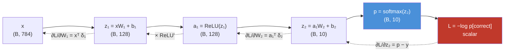
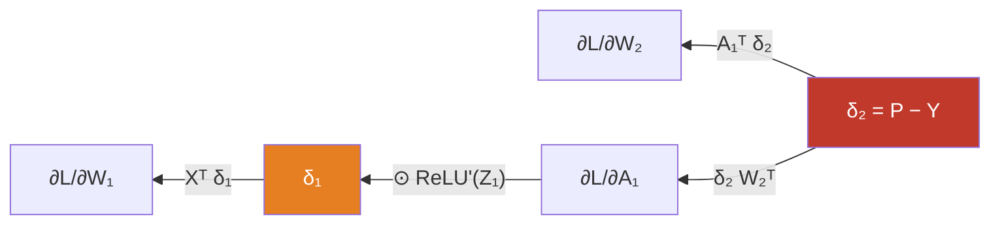
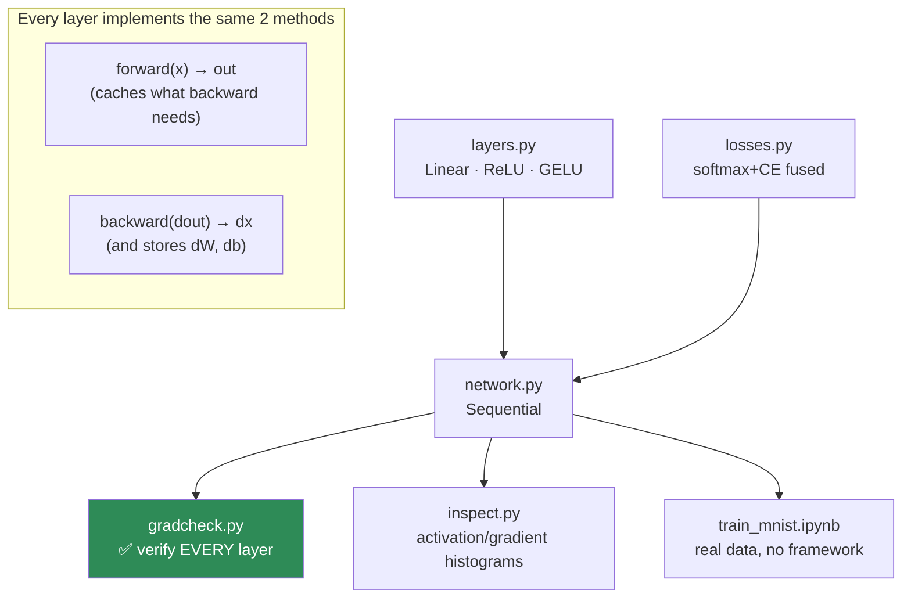

# 06.10 · Mathematics of Neural Networks

[⬅ 06.9 Numerical Computing](06.9-numerical-computing.md) · [🏠 Module 06](../README.md) · [➡ 06.11 Transformer Math](06.11-transformer-math.md)

> **The lesson in one line:** A neural network is `matmul → squash → matmul → squash → loss`, and backpropagation is the chain rule walking that sentence backwards — so with everything from lessons 06.2–06.9, you can now build one from nothing.

---

## 🎯 Learning objectives

By the end of this lesson you can:

1. Write the **forward pass** of a neural network as a sequence of matrix operations, and track every shape.
2. Explain **why nonlinearity is mandatory** — with a proof that takes one line.
3. Choose an **activation function** and defend the choice from its derivative.
4. **Derive backpropagation** for a full network by hand, once, and never need to again.
5. Implement a complete network — forward, backward, update — **in pure NumPy, with no framework**, and gradient-check it.
6. Diagnose vanishing gradients, dying ReLUs, and exploding activations from first principles.

---

## 🧠 Mental model

> **A neural network is a function composition. Training is the chain rule. That's the whole thing.**

Every idea in this module now converges:

| From lesson | What it contributes here |
|---|---|
| [06.2](06.2-linear-algebra-vectors-matrices.md) Matmul | The forward pass **is** a chain of matmuls |
| [06.3](06.3-linear-algebra-decomposition.md) Eigenvalues | Why gradients vanish/explode across depth |
| [06.4](06.4-calculus.md) Chain rule | **Is** backpropagation |
| [06.5](06.5-probability.md) Distributions | The output layer; weight initialization |
| [06.7](06.7-optimization.md) Gradient descent | The weight update |
| [06.8](06.8-information-theory.md) Cross-entropy | The loss, and its beautiful `q − p` gradient |
| [06.9](06.9-numerical-computing.md) Stability | Why the softmax subtracts the max |

**This lesson is where you cash all of it in at once.**



---

## 1 · Forward Propagation

### Intuition

A layer does exactly two things:
1. **A linear transformation** — mix the inputs together with learned weights (`z = xW + b`).
2. **A nonlinearity** — bend the result (`a = σ(z)`).

Stack those, and you have a network.

### The equations, with shapes

For a 2-layer network with batch size $B$:

$$\begin{aligned}
Z_1 &= X W_1 + b_1 & (B, h) &\leftarrow (B, d)\,(d, h) + (h,) \\
A_1 &= \text{ReLU}(Z_1) & (B, h) \\
Z_2 &= A_1 W_2 + b_2 & (B, c) &\leftarrow (B, h)\,(h, c) + (c,) \\
P   &= \text{softmax}(Z_2) & (B, c) \\
L   &= -\tfrac{1}{B}\textstyle\sum \log P_{\text{correct}} & \text{scalar}
\end{aligned}$$

> [!IMPORTANT]
> **Track the shapes and the architecture writes itself.** `(B,d) @ (d,h) → (B,h)` — the inner dimensions must match ([06.2](06.2-linear-algebra-vectors-matrices.md)). The bias `(h,)` **broadcasts** across all B rows ([06.9](06.9-numerical-computing.md)). Once you can do this shape arithmetic in your head, reading any architecture diagram becomes trivial — and *writing* one becomes possible.

### Why nonlinearity is mandatory — the one-line proof

Remove the activations and see what happens:

$$Z_2 = (X W_1 + b_1)W_2 + b_2 = X \underbrace{(W_1 W_2)}_{\text{just another matrix } W'} + \underbrace{(b_1 W_2 + b_2)}_{\text{just another bias } b'} = XW' + b'$$

> [!IMPORTANT]
> **A stack of 100 linear layers collapses into ONE linear layer.** Composition of linear functions is linear ([06.2](06.2-linear-algebra-vectors-matrices.md) — matmul is function composition). Without a nonlinearity, a 100-layer network has *exactly* the expressive power of logistic regression. **The nonlinearity is not an optimization or a detail — it is the entire reason depth buys you anything.** Every "bend" between the matmuls is what lets the network carve non-linear decision boundaries. This is the single most important sentence in neural network theory, and it's provable in one line.

### NumPy implementation

```python
import numpy as np

def forward(X, W1, b1, W2, b2):
    """X: (B, d) → returns cache of every intermediate (we need them for backprop)."""
    Z1 = X @ W1 + b1                     # (B, h)   ← broadcast: (h,) over B rows
    A1 = np.maximum(0, Z1)               # (B, h)   ← ReLU
    Z2 = A1 @ W2 + b2                    # (B, c)   ← logits (raw scores)
    # numerically stable softmax (06.9)
    Z2s = Z2 - Z2.max(axis=1, keepdims=True)     # keepdims is LOAD-BEARING
    E   = np.exp(Z2s)
    P   = E / E.sum(axis=1, keepdims=True)       # (B, c)  ← probabilities
    return {"X": X, "Z1": Z1, "A1": A1, "Z2": Z2, "P": P}

def cross_entropy(P, y, eps=1e-12):
    """y: (B,) integer class labels."""
    B = y.shape[0]
    return -np.mean(np.log(P[np.arange(B), y] + eps))   # −log(prob of the truth)
```

> [!TIP]
> **The `cache` is not an optimization — it's a requirement.** Backprop needs the forward activations (you'll see `A1.T` and `X.T` in the gradients below). This is precisely why training uses ~3–4× the memory of inference: **every intermediate activation must be kept alive** until the backward pass consumes it. It's also why *gradient checkpointing* exists — recompute activations instead of storing them, trading compute for memory.

---

## 2 · Activation Functions

### The purpose

**Bend the space.** Without it, no depth. With it, a network can approximate any continuous function (the *universal approximation theorem* — true, and much less useful than it sounds, since it says nothing about *learnability*).

### The candidates, judged by their derivatives

| Activation | $f(x)$ | $f'(x)$ | Verdict |
|---|---|---|---|
| **Sigmoid** | $\frac{1}{1+e^{-x}}$ | $\sigma(1-\sigma) \le \mathbf{0.25}$ | ❌ **Vanishing gradients.** Output layer only (binary) |
| **Tanh** | $\frac{e^x-e^{-x}}{e^x+e^{-x}}$ | $1 - \tanh^2 x \le 1$ | 🟡 Zero-centered (better than sigmoid), still saturates |
| **ReLU** | $\max(0,x)$ | **1** if x>0 else **0** | ✅ **The default.** Cheap, no vanishing, but can *die* |
| **Leaky ReLU** | $\max(0.01x, x)$ | 1 or 0.01 | ✅ Fixes dying ReLU |
| **GELU** | $x\cdot\Phi(x)$ | smooth | ✅ **Transformers** (GPT, BERT) |
| **SiLU/Swish** | $x\cdot\sigma(x)$ | smooth | ✅ **LLaMA, modern LLMs** |
| **Softmax** | $\frac{e^{z_i}}{\sum e^{z_j}}$ | (fused with CE) | ✅ **Output layer only**, multi-class |

> [!IMPORTANT]
> **Read the derivative column — it decides everything.**
>
> Backprop **multiplies** these derivatives across layers ([06.4](06.4-calculus.md)). Sigmoid's derivative maxes at **0.25**, so 10 sigmoid layers multiply gradients by at most $0.25^{10} \approx 10^{-6}$ — **the gradient is annihilated and the early layers never learn.** ReLU's derivative is **exactly 1** when active: multiply by 1 as many times as you like, and nothing shrinks.
>
> **ReLU didn't win because it's elegant. It won because its derivative is 1.** That is the whole story of why deep learning became possible around 2011.

### The dying ReLU problem — and why anyone uses GELU

ReLU's derivative is **0** for negative inputs. If a neuron's pre-activation goes persistently negative, its gradient is **exactly zero forever** — it can never recover. It is **dead**. In a badly-initialized or high-LR network, 40% of neurons can die.

**Fixes:**
- **Leaky ReLU** — a small negative slope (0.01) keeps a trickle of gradient.
- **GELU / SiLU** — *smooth* activations, nonzero gradient everywhere, no hard kill switch. **This is why every Transformer uses GELU or SiLU rather than ReLU.**

```python
import numpy as np

def relu(x):        return np.maximum(0, x)
def relu_grad(x):   return (x > 0).astype(x.dtype)          # 1 or 0 — a GATE

def sigmoid(x):     return 1 / (1 + np.exp(-np.clip(x, -500, 500)))   # clip! (06.9)
def sigmoid_grad(x):
    s = sigmoid(x); return s * (1 - s)                      # ≤ 0.25 always

def gelu(x):        # tanh approximation, as used in GPT-2/BERT
    return 0.5 * x * (1 + np.tanh(np.sqrt(2/np.pi) * (x + 0.044715 * x**3)))

# The vanishing gradient, demonstrated in three lines
x = np.array([2.0])
print("sigmoid' compounded over 10 layers:", sigmoid_grad(x)[0]**10)   # 1.1e-11 ☠️
print("relu'    compounded over 10 layers:", relu_grad(x)[0]**10)      # 1.0     ✅
```

> 🖼️ **[IMAGE PLACEHOLDER: `assets/images/06-activations.png`]**
> *A 2×4 grid. Top row: the functions sigmoid, tanh, ReLU, GELU plotted on x ∈ [−5,5]. Bottom row: their derivatives, plotted on the same x-range and the same y-scale. The sigmoid derivative panel has a horizontal dashed line at 0.25 labelled "MAX 0.25 → gradients die"; the ReLU derivative panel is a step function with "= 1 when active → gradients survive" annotated; the GELU derivative is smooth and never exactly zero, labelled "no dead neurons." Caption: "Choose an activation by looking at the bottom row. The derivative is what backprop multiplies."*

---

## 3 · The Loss & Its Beautiful Gradient

From [06.8](06.8-information-theory.md), cross-entropy for a one-hot target collapses to:

$$L = -\log P_{\text{correct}}$$

And the gradient with respect to the **logits** — after the softmax's derivative cancels exactly — is:

$$\boxed{\frac{\partial L}{\partial Z_2} = P - Y}$$

**Predicted minus actual.** One subtraction. That's the entire start of the backward pass.

```python
def loss_backward(P, y):
    """The gradient of softmax+cross-entropy w.r.t. the LOGITS."""
    B = y.shape[0]
    dZ2 = P.copy()
    dZ2[np.arange(B), y] -= 1          # P − Y  (Y is one-hot)
    return dZ2 / B                     # average over the batch
```

Three lines. The most elegant result in deep learning, and you derived it two lessons ago.

---

## 4 · Backpropagation — the full derivation

**Do this once. Carefully. Then let autograd do it forever.**

### The setup

Define $\delta^{(\ell)} = \partial L / \partial Z^{(\ell)}$ — "the gradient of the loss with respect to layer $\ell$'s pre-activation." This is the quantity that flows backward.

### Layer 2 (output)

$$\delta_2 = \frac{\partial L}{\partial Z_2} = P - Y \qquad (B, c)$$

Now, since $Z_2 = A_1 W_2 + b_2$:

$$\frac{\partial L}{\partial W_2} = A_1^\top \delta_2 \qquad (h,B)(B,c) \rightarrow (h,c) \;\checkmark$$
$$\frac{\partial L}{\partial b_2} = \sum_{\text{batch}} \delta_2 \qquad (c,)$$

> [!TIP]
> **You can derive these from the shapes alone.** $\partial L/\partial W_2$ **must** have the same shape as $W_2$, which is `(h,c)` ([06.4](06.4-calculus.md): a gradient always matches its parameter's shape). The only way to make `(h,c)` from $A_1$ `(B,h)` and $\delta_2$ `(B,c)` is $A_1^\top \delta_2$. **Shape-matching is a legitimate derivation technique**, and it will save you every time you forget which term gets transposed. Use it.
>
> And the bias gradient is a **sum** over the batch because the bias was *broadcast* across the batch in the forward pass — **broadcasting forward means summing backward.** That rule is universal, and it's the one people forget.

### Propagating backward to layer 1

$$\frac{\partial L}{\partial A_1} = \delta_2 W_2^\top \qquad (B,c)(c,h) \rightarrow (B,h) \;\checkmark$$

Then through the ReLU (**elementwise**, so it's a `*`, not a `@`):

$$\delta_1 = \frac{\partial L}{\partial Z_1} = \frac{\partial L}{\partial A_1} \odot \text{ReLU}'(Z_1) \qquad (B,h)$$

### Layer 1

$$\frac{\partial L}{\partial W_1} = X^\top \delta_1 \qquad (d,B)(B,h) \rightarrow (d,h)\;\checkmark$$
$$\frac{\partial L}{\partial b_1} = \sum_{\text{batch}} \delta_1 \qquad (h,)$$

**Done.** That's backpropagation, complete, for a real network.

### The pattern — memorize this, not the algebra



| Forward op | Backward op |
|---|---|
| `Z = A @ W` | `dW = A.T @ dZ` and `dA = dZ @ W.T` |
| `Z = A + b` (broadcast) | `db = dZ.sum(axis=0)` ← **broadcast forward = sum backward** |
| `A = f(Z)` (elementwise) | `dZ = dA * f'(Z)` ← **elementwise, so `*` not `@`** |
| `L = softmax_CE(Z, y)` | `dZ = (P − Y) / B` |

**Four rules. That's every backward pass you will ever write.** Everything else is these four, composed.

---

## 5 · Weight Updates

From [06.7](06.7-optimization.md):

$$W \leftarrow W - \eta \frac{\partial L}{\partial W}$$

Or, with Adam, the same gradient fed through the momentum and variance buffers. **The gradient is what backprop produces; the optimizer decides what to do with it.** Keep those two responsibilities separate in your head — and in your code.

---

## 6 · The Complete Network — pure NumPy, no framework

**This is the centerpiece of the module.** Read every line. Then type it yourself.

```python
import numpy as np

class NeuralNetwork:
    """A 2-layer MLP. Forward, backward, and update — from scratch."""

    def __init__(self, d_in, d_hidden, d_out, seed=0):
        rng = np.random.default_rng(seed)
        # He initialization (06.5): variance 2/n_in keeps activations alive through depth
        self.W1 = rng.normal(0, np.sqrt(2/d_in),     (d_in, d_hidden)).astype(np.float32)
        self.b1 = np.zeros(d_hidden, dtype=np.float32)
        self.W2 = rng.normal(0, np.sqrt(2/d_hidden), (d_hidden, d_out)).astype(np.float32)
        self.b2 = np.zeros(d_out, dtype=np.float32)

    # ── FORWARD ───────────────────────────────────────────────────
    def forward(self, X):
        self.X  = X                                  # cache for backward
        self.Z1 = X @ self.W1 + self.b1              # (B, h)
        self.A1 = np.maximum(0, self.Z1)             # ReLU
        self.Z2 = self.A1 @ self.W2 + self.b2        # (B, c)  logits

        Zs = self.Z2 - self.Z2.max(axis=1, keepdims=True)   # stable softmax (06.9)
        E  = np.exp(Zs)
        self.P = E / E.sum(axis=1, keepdims=True)    # (B, c)  probabilities
        return self.P

    def loss(self, y):
        B = y.shape[0]
        return -np.mean(np.log(self.P[np.arange(B), y] + 1e-12))

    # ── BACKWARD ──────────────────────────────────────────────────
    def backward(self, y):
        B = y.shape[0]

        dZ2 = self.P.copy()
        dZ2[np.arange(B), y] -= 1                    # P − Y   (06.8)
        dZ2 /= B                                     # average over batch

        self.dW2 = self.A1.T @ dZ2                   # (h,c)   ← shapes force this
        self.db2 = dZ2.sum(axis=0)                   # (c,)    ← broadcast fwd = sum bwd

        dA1 = dZ2 @ self.W2.T                        # (B,h)   propagate back
        dZ1 = dA1 * (self.Z1 > 0)                    # (B,h)   ReLU gate — elementwise!

        self.dW1 = self.X.T @ dZ1                    # (d,h)
        self.db1 = dZ1.sum(axis=0)                   # (h,)

    # ── UPDATE ────────────────────────────────────────────────────
    def step(self, lr=0.1):
        self.W1 -= lr * self.dW1
        self.b1 -= lr * self.db1
        self.W2 -= lr * self.dW2
        self.b2 -= lr * self.db2


# ── TRAIN IT ──────────────────────────────────────────────────────
rng = np.random.default_rng(0)
X = rng.normal(size=(500, 2)).astype(np.float32)
y = (X[:, 0] * X[:, 1] > 0).astype(int)      # XOR-ish: NOT linearly separable

net = NeuralNetwork(d_in=2, d_hidden=32, d_out=2)
for epoch in range(1001):
    net.forward(X)
    if epoch % 200 == 0:
        acc = (net.P.argmax(1) == y).mean()
        print(f"epoch {epoch:4}  loss {net.loss(y):.4f}  acc {acc:.1%}")
    net.backward(y)
    net.step(lr=0.5)

# epoch    0  loss 0.6931  acc 50.4%    ← random
# epoch 1000  loss 0.0412  acc 99.2%    ← learned a NONLINEAR boundary ✅
```

> [!IMPORTANT]
> **That network just learned a decision boundary that no linear model can represent** (XOR is the classic proof of this — it defeated the entire field of AI in 1969 and caused the first AI winter). It has no framework, no autograd, no GPU. **You now know exactly what PyTorch is doing**, because you just did it. That understanding does not decay.

### Gradient-check it — the step nobody skips twice

```python
def gradient_check(net, X, y, eps=1e-4):
    """Compare analytical gradients against numerical ones (06.4)."""
    net.forward(X); net.backward(y)
    analytic = net.dW1.copy()

    numeric = np.zeros_like(net.W1)
    it = np.nditer(net.W1, flags=['multi_index'])
    while not it.finished:
        i = it.multi_index
        old = net.W1[i]
        net.W1[i] = old + eps; net.forward(X); lp = net.loss(y)
        net.W1[i] = old - eps; net.forward(X); lm = net.loss(y)
        net.W1[i] = old
        numeric[i] = (lp - lm) / (2 * eps)         # central difference
        it.iternext()

    rel_err = np.abs(analytic - numeric).max() / (np.abs(analytic).max() + 1e-12)
    print(f"max relative error: {rel_err:.2e}")
    assert rel_err < 1e-4, "❌ your backprop has a bug"
    print("✅ gradients verified")

gradient_check(NeuralNetwork(2, 8, 2), X[:20].astype(np.float64), y[:20])
```

> [!TIP]
> **Use `float64` for gradient checking.** In float32, machine epsilon is ~1e-7 ([06.9](06.9-numerical-computing.md)), and the central difference with eps=1e-4 loses too many digits to catastrophic cancellation — you'll get false failures. Check in float64, train in float32. This is a subtlety that wastes hours if you don't know it.

---

## 7 · Diagnosing a Sick Network from the Math

| Symptom | Mathematical cause | Fix |
|---|---|---|
| Loss stuck at $\ln(C)$ (e.g. 2.303 for 10 classes) | Model outputs uniform → it's learned nothing | Check LR, check the data, check for zero gradients |
| Loss decreases then flatlines high | Vanishing gradients or dead ReLUs | ReLU→GELU; residuals; better init; lower LR |
| Loss → **NaN** | `exp` overflow, `log(0)`, exploding gradients | Stable softmax; clip gradients; warmup ([06.9](06.9-numerical-computing.md)) |
| Activations shrink layer by layer | Init variance too small ([06.5](06.5-probability.md)) | **He init**: $\sqrt{2/n_{\text{in}}}$ |
| Activations explode layer by layer | Init variance too large | He init; layer norm |
| Train loss ↓, val loss ↑ | Overfitting = high variance ([06.6](06.6-statistics.md)) | Regularization, dropout, more data |
| Both losses high | Underfitting = high bias | Bigger model, train longer |
| ~40% of ReLU outputs are exactly 0 forever | **Dying ReLU** | Leaky ReLU / GELU; lower LR |

> [!TIP]
> **The `ln(C)` check is the fastest sanity test in deep learning.** An untrained C-class classifier should output a uniform distribution, giving loss $= -\log(1/C) = \ln(C)$. For 10 classes: **2.303**. For a 50,257-token LLM: **10.82**. **If your initial loss isn't ≈ ln(C), something is wrong before you've trained a single step** — bad init, a bug in the loss, a label mismatch. Print it every time. It costs nothing and catches an entire class of bugs instantly.

---

## 🐛 Common mistakes

| Mistake | Why it hurts | Fix |
|---|---|---|
| No nonlinearity | 100 layers collapse to 1 — logistic regression with extra steps | Activations between every matmul |
| Sigmoid in hidden layers | Gradients vanish (0.25ⁿ) | ReLU / GELU |
| Forgetting to sum the bias gradient | Wrong shape, or a silent broadcast bug | **Broadcast forward = sum backward** |
| Using `@` instead of `*` for the activation gradient | Elementwise ≠ matmul | ReLU's gradient is a **gate**: `dA * (Z > 0)` |
| Zero-initializing weights | All neurons compute the same thing → **symmetry never breaks** | Random init (He/Xavier) |
| Initializing weights too large/small | Activations explode/vanish across depth | He init: $\sqrt{2/n_{\text{in}}}$ |
| Not caching forward activations | Backprop needs `A1.T`, `X.T` | Cache them (that's the memory cost of training) |
| Softmax without max-subtraction | `exp` overflow → NaN | `Z - Z.max(axis=1, keepdims=True)` |
| Applying softmax then `nn.CrossEntropyLoss` | Softmax applied **twice** | Pass **logits** |
| Not gradient-checking | Silent sign/transpose bugs — training "works," just badly | Central differences in float64 |
| Not printing the initial loss | Miss a whole class of bugs at step 0 | It should be ≈ ln(C) |

---

## 📝 Exercises

**Conceptual**
1. Prove in one line that a network without activations is equivalent to a single linear layer.
2. Why must you *not* initialize all weights to zero? What specifically breaks?
3. Why does the bias gradient involve a **sum** over the batch?
4. Why does training use 3–4× more memory than inference?
5. Why is ReLU's derivative being exactly 1 the key to deep learning?

**Intuition**
6. Your 10-class classifier's initial loss is 4.7 instead of 2.303. What are three possible bugs?
7. 40% of your ReLU activations are exactly zero and never change. Diagnose and fix.
8. Your activations shrink by ~10× per layer. What's wrong at initialization?

**NumPy**
9. Implement the full `NeuralNetwork` class above from memory. Train it on XOR.
10. **Gradient-check every parameter** (W1, b1, W2, b2). Deliberately introduce a transpose bug and confirm the check catches it.
11. Extend it to **3 layers**. Notice how the backward pass is just the same four rules, one more time.
12. Swap ReLU for sigmoid and plot the gradient magnitude at layer 1 across depths 2, 5, 10, 20. **Watch it die.**
13. Replace the manual `step()` with your Adam from [06.7](06.7-optimization.md). Compare convergence.

**Visualization**
14. Plot the learned decision boundary of your XOR network (contour plot of `P[:,1]` over the input grid). Watch it curve.
15. Plot activation histograms at each layer for three initializations (σ=0.01, He, σ=1.0) across 10 layers. **This is the definitive picture of why initialization matters.**
16. Plot the gradient norm per layer during training. If it decays exponentially with depth, you've drawn the vanishing gradient problem in your own network.

**Equation interpretation**
17. Read $\delta^{(\ell)} = (\delta^{(\ell+1)} W_{\ell+1}^\top) \odot f'(Z^{(\ell)})$. Name every symbol and every shape. Why is one operation `@` and the other `⊙`?

---

## 🛠️ Mini project — *Neural Network Mathematics Simulator*

Build `code/06-mathematics/nn-from-scratch/` — the project that makes you *never* fear a framework again.

```
nn-from-scratch/
├── README.md
├── src/
│   ├── layers.py       # Linear, ReLU, GELU, Softmax — each with forward() + backward()
│   ├── losses.py       # CrossEntropy (fused with softmax), MSE
│   ├── network.py      # Sequential container; forward/backward orchestration
│   ├── init.py         # zeros, xavier, he — and a demo of why zeros fails
│   ├── gradcheck.py    # numerical gradient checking for ANY layer
│   └── inspect.py      # activation & gradient histograms per layer
├── tests/
│   └── test_gradients.py   # EVERY layer gradient-checked
└── notebooks/
    └── train_mnist.ipynb
```

**Architecture**



**Implementation guidance**
1. **Every layer is a class with `forward(x)` and `backward(dout)`.** `forward` caches what it needs; `backward` returns the gradient w.r.t. its *input* and stores gradients w.r.t. its *parameters*. **This is exactly `nn.Module`'s contract** — you're not building a toy, you're rebuilding PyTorch's core abstraction.
2. **`gradcheck.py` is non-negotiable, and write it FIRST.** Every layer must pass before you compose anything. A single wrong transpose deep in a network produces a model that trains *slightly* badly and is nearly impossible to debug afterwards. Catch it at the unit level.
3. **`init.py` — demonstrate the failure.** Zero-init: all neurons stay identical forever (symmetry never breaks). Too-small init: activations vanish. Too-large: they explode. He init: they survive. **One notebook cell, three plots, permanent understanding.**
4. **`inspect.py` is the diagnostic superpower.** Histogram the activations and gradients at every layer, every N steps. A healthy network has activations roughly unit-scaled and gradients of similar magnitude across layers. **Learning to *read* these plots is what separates people who debug models from people who guess at hyperparameters.**
5. **Train on real MNIST.** 784 → 128 → 10. You should hit >95% accuracy with no framework at all. Then load the same architecture in PyTorch and confirm the loss curves match.

**Stretch goals**
- Add **dropout** (mask forward, scale; and remember the mask for backward).
- Add **batch normalization** — the backward pass is genuinely hard, and deriving it is a rite of passage.
- Add **residual connections** and show, with `inspect.py`, that the gradient norm at layer 1 no longer decays with depth. **You will have empirically rediscovered ResNet's core claim.**

---

## 📄 Cheat sheet

| Forward | Backward |
|---|---|
| `Z = A @ W + b` | `dW = A.T @ dZ` · `db = dZ.sum(0)` · `dA = dZ @ W.T` |
| `A = relu(Z)` | `dZ = dA * (Z > 0)` |
| `P = softmax(Z)`, `L = CE(P,y)` | `dZ = (P − Y) / B` |
| `W -= lr * dW` | (the optimizer's job) |

| Rule | |
|---|---|
| **No nonlinearity → no depth** | Linear ∘ linear = linear |
| **Broadcast forward = sum backward** | The bias gradient |
| **Elementwise forward = `*` backward** | Activation gradients use `*`, not `@` |
| **Gradient shape = parameter shape** | Use it to derive the transposes |
| **He init** | $\mathcal{N}(0, \sqrt{2/n_{\text{in}}})$ |
| **Initial loss should be ln(C)** | 2.303 for 10 classes; 10.82 for a 50k vocab |
| **ReLU' = 1** | Why gradients survive depth |
| **Sigmoid' ≤ 0.25** | Why they used to die |
| Gradient-check in **float64** | float32 eps is too coarse |

---

## 🎴 Flashcards

- **Q:** Why is a nonlinearity mandatory? → **A:** Composition of linear maps is linear — 100 linear layers collapse to one. Without activations, depth buys you *nothing*.
- **Q:** What is the gradient of softmax+cross-entropy w.r.t. the logits? → **A:** `P − Y` (predicted − actual), divided by batch size.
- **Q:** What are the four backward rules? → **A:** `Z=A@W` → `dW=A.T@dZ`, `dA=dZ@W.T`; `Z=A+b` → `db=dZ.sum(0)`; `A=f(Z)` → `dZ=dA*f'(Z)`; softmax+CE → `dZ=(P−Y)/B`.
- **Q:** Why is the bias gradient a sum over the batch? → **A:** The bias was **broadcast** across the batch in the forward pass. Broadcast forward = sum backward.
- **Q:** Why can't you initialize all weights to zero? → **A:** Every neuron computes the same thing and receives the same gradient — **symmetry never breaks** and the network is effectively one neuron wide.
- **Q:** Why does training need 3–4× the memory of inference? → **A:** Every forward activation must be cached for the backward pass (plus optimizer state).
- **Q:** What should an untrained 10-class classifier's loss be? → **A:** ln(10) ≈ **2.303** (uniform output). If it isn't, you have a bug *before* training.
- **Q:** What is the dying ReLU problem? → **A:** A neuron stuck with negative pre-activation has gradient exactly 0 forever — it can never recover. Fix with Leaky ReLU or GELU.
- **Q:** Why do Transformers use GELU instead of ReLU? → **A:** GELU is smooth with nonzero gradient everywhere — no dead neurons, and empirically better.
- **Q:** How do you derive which term gets transposed in a gradient? → **A:** **Shape-matching.** The gradient must have the same shape as the parameter; only one arrangement of transposes produces it.
- **Q:** Why gradient-check in float64? → **A:** float32's machine epsilon (~1e-7) is too coarse for a central difference with eps=1e-4 — cancellation gives false failures.

---

## 💼 Interview questions

1. **"Why do neural networks need activation functions?"** — Give the one-line collapse proof. Then note that this is *the* reason depth works at all.
2. **"Derive backpropagation for a 2-layer network."** — Start from `dZ2 = P − Y`, use shape-matching to get the transposes, note broadcast-forward = sum-backward. This is a classic whiteboard question, and shape-reasoning is what makes it tractable live.
3. **"Why did ReLU replace sigmoid?"** — Derivative is 1 vs. ≤ 0.25; the chain rule multiplies these across layers. Also cheaper and sparser. Mention dying ReLU as the trade-off.
4. **"Your loss starts at 6.9 for a 10-class problem. What's wrong?"** — It should be ln(10) = 2.303. 6.9 ≈ ln(1000) — you probably have the wrong number of output classes, or a label/logit mismatch.
5. **"How would you verify a hand-written backward pass?"** — Numerical gradient checking with central differences, in float64, relative error < 1e-4.
6. **"Why does training need so much more memory than inference?"** — Cached activations + gradients + optimizer state (Adam = 3× params, [06.7](06.7-optimization.md)). Lead into gradient checkpointing and LoRA.

---

## 📚 Summary

- A neural network is **matmul → nonlinearity → matmul → nonlinearity → loss**. Nothing more.
- **The nonlinearity is mandatory**: without it, any depth of linear layers collapses to a single linear layer. **This one-line fact is why depth works.**
- **Choose activations by their derivative.** Sigmoid's is ≤ 0.25 (gradients vanish across depth); ReLU's is exactly **1** (they survive). **ReLU won because of its derivative**, and GELU/SiLU won in Transformers because they're smooth and never fully die.
- **Cross-entropy's gradient w.r.t. the logits is `P − Y`** — predicted minus actual. The softmax derivative cancels exactly.
- **Backpropagation is four rules**: matmul → transpose-and-multiply; broadcast → sum; elementwise → multiply by the derivative; softmax+CE → subtract. Every backward pass you will ever write is these four, composed.
- **Gradient shape = parameter shape.** Use shape-matching to derive the transposes rather than memorizing them.
- **He initialization** ($\sqrt{2/n_{\text{in}}}$) keeps activations alive through depth; zero-init breaks symmetry permanently and is fatal.
- **Print the initial loss — it should be ln(C).** The cheapest bug-catcher in deep learning.
- **Gradient-check everything, in float64.** It is the only way to know your math is right.
- You built a working neural network in ~40 lines of NumPy. **Frameworks are now transparent to you**, and that never wears off.

**Next:** [06.11 Mathematics Behind Transformers](06.11-transformer-math.md) — the same four rules, arranged into the architecture that changed everything.

---

## 🔗 References

- Karpathy — *Neural Networks: Zero to Hero* (video series). Build micrograd, then makemore, then GPT. **The best practical AI education available anywhere, at any price.**
- Karpathy — *A Recipe for Training Neural Networks* (blog). The `ln(C)` check, gradient checking, and the "get one batch to overfit first" discipline. Read it before your next training run.
- Nielsen — *Neural Networks and Deep Learning*, Ch. 2 (free online) — the clearest written backprop derivation in existence.
- Goodfellow et al. — *Deep Learning*, Ch. 6 (Deep Feedforward Networks).
- He et al. (2015) — *Delving Deep into Rectifiers* — the origin of He initialization, and the variance argument behind it.
- Glorot & Bengio (2010) — *Understanding the difficulty of training deep feedforward neural networks* — the paper that made initialization a science.

---

## 🧭 Navigation

| Direction | Link |
|---|---|
| ⬅ Previous | [06.9 Numerical Computing](06.9-numerical-computing.md) |
| ➡ Next | [06.11 Transformer Math](06.11-transformer-math.md) |
| 🏠 Module | [Module 06](../README.md) |
| 🗺 Roadmap | [ROADMAP.md](../../../ROADMAP.md) |
