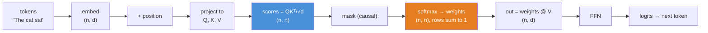
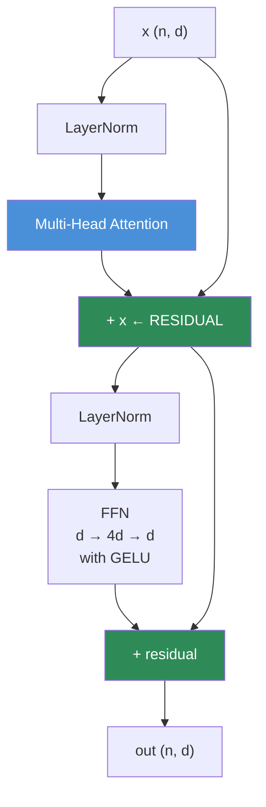
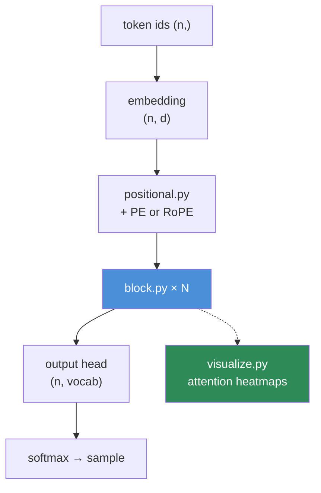

# 06.11 · Mathematics Behind Transformers

[⬅ 06.10 Neural Network Math](06.10-neural-network-math.md) · [🏠 Module 06](../README.md) · [➡ 06.12 Reading Notation](06.12-reading-notation.md)

> **The lesson in one line:** Attention is a **soft, differentiable dictionary lookup** — and once you see that, the equation that runs every LLM on Earth becomes three matmuls and a softmax.

---

## 🎯 Learning objectives

By the end of this lesson you can:

1. Explain an **embedding** as a learned point in meaning-space, and why arithmetic on it works.
2. Decode $\text{Attention}(Q,K,V) = \text{softmax}(QK^\top/\sqrt{d_k})V$ **completely** — every symbol, every shape, every reason.
3. Explain **why the $\sqrt{d_k}$ is there**, from the variance argument.
4. Explain **positional encoding** — why it's needed at all, and how RoPE works.
5. Implement multi-head attention **in NumPy from scratch**, with a causal mask.
6. Explain the **O(n²) bottleneck** and why it drives every long-context research paper.

---

## 🧠 Mental model

> **Attention answers one question, for every token, in parallel: "which other tokens should I be looking at right now, and what should I take from them?"**

The dictionary analogy is exact and worth internalizing:

| Python dict | Attention |
|---|---|
| `d[query]` — exact key match | **Soft** match: score the query against *every* key |
| Returns **one** value | Returns a **weighted average of all** values |
| Hard, discrete, not differentiable | **Soft, continuous, differentiable** ← so it can be *learned* |

**Attention is a dictionary lookup you can backpropagate through.** That's the invention. Everything else is engineering around it.



---

## 1 · Embeddings

### Intuition

**An embedding is a learned vector that positions a token in "meaning space."** Similar meanings land near each other; the *geometry* of the space encodes semantics.

The famous demonstration:

$$\text{king} - \text{man} + \text{woman} \approx \text{queen}$$

**Meaning became arithmetic.** The direction from "man" to "woman" is (roughly) a gender axis, and it's the *same* direction that separates "king" from "queen." That is a genuinely astonishing empirical fact, and it's what made everyone believe embeddings were real.

### How it works mechanically

An embedding table is just a matrix of shape `(vocab_size, d_model)` — e.g. `(50257, 768)` for GPT-2. Looking up a token is **row indexing**:

```python
import numpy as np

vocab, d_model = 50257, 768
E = np.random.randn(vocab, d_model).astype(np.float32) * 0.02   # the embedding table

token_ids = np.array([464, 3797, 3332])          # "The", " cat", " sat"
x = E[token_ids]                                  # (3, 768)  ← just indexing!
print(x.shape)
```

> [!NOTE]
> **Embedding lookup is mathematically a matmul with a one-hot vector** — `onehot @ E` — but nobody implements it that way, because multiplying a 50,257-wide one-hot vector by the table is absurd when you could just index the row. **It's a matmul optimized into an array lookup.** This is a nice example of the math and the implementation diverging for purely practical reasons ([06.2](06.2-linear-algebra-vectors-matrices.md)).

### Why it works — the distributional hypothesis

> *"You shall know a word by the company it keeps."* — J.R. Firth, 1957

Words appearing in similar contexts get similar embeddings, because the training objective (predict the next token) *pushes* them together: if "cat" and "dog" are both followed by similar words, the model minimizes loss by giving them similar vectors. **Meaning is learned from co-occurrence, and nothing else.** The 768 dimensions have no human-assigned meaning — they're whatever axes turned out to be useful for prediction.

### Similarity is cosine similarity

Straight from [06.2](06.2-linear-algebra-vectors-matrices.md):

```python
def cosine(a, b):
    return (a @ b) / (np.linalg.norm(a) * np.linalg.norm(b))
```

**Everything you built in Lesson 06.2 — the dot product as alignment, cosine as magnitude-free similarity, normalize-then-matmul — is *exactly* the machinery of RAG, semantic search, and (as you're about to see) attention itself.** It was never a toy example.

---

## 2 · Attention — the equation, decoded

$$\boxed{\text{Attention}(Q,K,V) = \text{softmax}\!\left(\frac{QK^\top}{\sqrt{d_k}}\right)V}$$

Let's run the 7-step decoding procedure from [06.1](06.1-mathematical-thinking.md), for real.

### Step 1–2: Symbols and shapes

| Symbol | Shape | Role |
|---|---|---|
| $Q$ (queries) | `(n, d_k)` | *"What am I looking for?"* — one per token |
| $K$ (keys) | `(n, d_k)` | *"What do I offer?"* — one per token |
| $V$ (values) | `(n, d_v)` | *"What do I actually contribute?"* — one per token |
| $QK^\top$ | **`(n, n)`** | Every query scored against every key |
| softmax(·) | `(n, n)` | Attention weights — **each row sums to 1** |
| output | `(n, d_v)` | A weighted average of values, per token |

**Q, K, V all come from the same input** via learned projections:

$$Q = XW_Q, \quad K = XW_K, \quad V = XW_V$$

This is **self**-attention: the sequence attends to *itself*. (In cross-attention — used in encoder-decoder models — Q comes from one sequence and K, V from another.)

### Step 3: Read it aloud

> *"Score every token against every other token. Turn the scores into probabilities. Use those probabilities to take a weighted average of the values."*

### Step 4: Shrink it

Three tokens, $d_k = 4$. Then $QK^\top$ is a 3×3 grid of dot products:

```
        key:  The    cat    sat
query The  [  8.2    1.1    0.4  ]
      cat  [  1.3    9.5    2.1  ]
      sat  [  0.9    6.8    7.7  ]   ← "sat" attends strongly to "cat" (its subject!)
```

**That grid is the model's syntax and semantics, made visible.** Row *i* is: "how much does token *i* care about each other token?" After softmax, each row becomes a probability distribution.

### Step 5: The three matmuls, in NumPy

```python
import numpy as np

def softmax(x, axis=-1):
    x = x - x.max(axis=axis, keepdims=True)     # stability (06.9)
    e = np.exp(x)
    return e / e.sum(axis=axis, keepdims=True)

def attention(Q, K, V, mask=None):
    d_k = Q.shape[-1]
    scores = Q @ K.T / np.sqrt(d_k)             # (n, n)  ← every query · every key
    if mask is not None:
        scores = np.where(mask, scores, -1e9)   # -inf before softmax → weight ≈ 0
    weights = softmax(scores, axis=-1)          # (n, n)  ← rows sum to 1
    return weights @ V, weights                 # (n, d_v)

n, d_k, d_v = 3, 4, 4
rng = np.random.default_rng(0)
Q, K, V = rng.normal(size=(n, d_k)), rng.normal(size=(n, d_k)), rng.normal(size=(n, d_v))

out, w = attention(Q, K, V)
print("weights (rows sum to 1):\n", np.round(w, 3))
print("row sums:", w.sum(axis=1))     # [1. 1. 1.] ✅
print("output shape:", out.shape)     # (3, 4)
```

**That's it. That's the Transformer's core.** Two matmuls, a scale, and a softmax.

### Step 6: What breaks if you remove a term? — **why $\sqrt{d_k}$?**

This is the question that separates people who *understand* attention from people who've *seen* it.

**The dot product of two random vectors has variance proportional to $d_k$.** If each component of $q$ and $k$ is independent with mean 0 and variance 1, then:

$$q \cdot k = \sum_{i=1}^{d_k} q_i k_i \quad\Rightarrow\quad \text{Var}(q\cdot k) = d_k$$

so its standard deviation is $\sqrt{d_k}$. With $d_k = 64$, scores routinely reach ±8. With $d_k = 128$, ±11.

**Now feed those into a softmax.** Large scores mean `exp` of large numbers, so the softmax **saturates** — one weight goes to ~1.0, everything else to ~0. And a saturated softmax has **near-zero gradient** ([06.4](06.4-calculus.md)). **Training stalls.**

**Dividing by $\sqrt{d_k}$ normalizes the variance back to 1**, keeping the scores in a range where the softmax is soft and its gradient is healthy.

```python
import numpy as np
rng = np.random.default_rng(0)

for d_k in (4, 64, 512):
    q, k = rng.normal(size=(1000, d_k)), rng.normal(size=(1000, d_k))
    raw    = np.sum(q * k, axis=1)
    scaled = raw / np.sqrt(d_k)
    print(f"d_k={d_k:4}  raw std={raw.std():7.2f}   scaled std={scaled.std():5.2f}")
# d_k=   4  raw std=   2.02   scaled std= 1.01
# d_k=  64  raw std=   8.03   scaled std= 1.00   ← without scaling: softmax saturates
# d_k= 512  raw std=  22.7    scaled std= 1.00   ← without scaling: gradients DEAD
```

> [!IMPORTANT]
> **The $\sqrt{d_k}$ is a *variance* fix — pure [06.5](06.5-probability.md) probability, protecting a *gradient* — pure [06.4](06.4-calculus.md) calculus, from a *numerical* saturation — pure [06.9](06.9-numerical-computing.md).** Three lessons converging on one square root in one equation. **This is what it looks like when mathematics is actually load-bearing**, and it's why "just read the code" is never enough: the code shows you `/ math.sqrt(d_k)` but never tells you that removing it kills your model.

### Step 7: Plain English

**"A soft, differentiable dictionary lookup."**

> 🖼️ **[IMAGE PLACEHOLDER: `assets/images/06-attention-heatmap.png`]**
> *Left: an n×n heatmap of attention weights for the sentence "The cat sat on the mat because it was tired," with tokens on both axes. The row for "it" shows a bright cell at "cat" — the model resolving the pronoun. Bright diagonal and near-diagonal cells elsewhere. A colour bar from 0 to 1. Right: the same matrix with the upper triangle blacked out, labelled "CAUSAL MASK — a token can only attend to itself and the past. This is what makes GPT autoregressive." Caption: "Attention weights are an n×n probability matrix. Every row sums to 1."*

---

## 3 · Multi-Head Attention

### Intuition

**One attention head learns one kind of relationship.** But language has many simultaneous relationships: syntactic (subject↔verb), coreference (pronoun↔antecedent), positional (adjacent words), semantic (topic).

**So run *h* attention operations in parallel, each in a lower-dimensional subspace, then concatenate.**

$$\text{MultiHead}(X) = \text{Concat}(\text{head}_1, \dots, \text{head}_h)\,W_O$$
$$\text{where } \text{head}_i = \text{Attention}(XW_Q^i, XW_K^i, XW_V^i)$$

**Crucially, the cost is *free*:** with $d_{\text{model}} = 512$ and $h = 8$ heads, each head works in $d_k = 512/8 = 64$ dimensions. **Total compute is the same as one 512-dim head** — you've split the dimensions, not multiplied the work. **You get 8 different relationship-detectors for the price of one.** That's an extraordinarily good deal, and it's why every Transformer is multi-head.

```python
import numpy as np

def multi_head_attention(X, Wq, Wk, Wv, Wo, n_heads, mask=None):
    n, d_model = X.shape
    d_k = d_model // n_heads

    Q = (X @ Wq).reshape(n, n_heads, d_k).transpose(1, 0, 2)   # (h, n, d_k)
    K = (X @ Wk).reshape(n, n_heads, d_k).transpose(1, 0, 2)
    V = (X @ Wv).reshape(n, n_heads, d_k).transpose(1, 0, 2)

    scores = Q @ K.transpose(0, 2, 1) / np.sqrt(d_k)           # (h, n, n)  ← batched!
    if mask is not None:
        scores = np.where(mask, scores, -1e9)
    weights = softmax(scores, axis=-1)                         # (h, n, n)
    heads   = weights @ V                                      # (h, n, d_k)

    concat = heads.transpose(1, 0, 2).reshape(n, d_model)      # (n, d_model)
    return concat @ Wo, weights

n, d_model, h = 6, 64, 8
rng = np.random.default_rng(0)
X = rng.normal(size=(n, d_model)).astype(np.float32)
Wq, Wk, Wv, Wo = (rng.normal(size=(d_model, d_model)).astype(np.float32) * 0.1
                  for _ in range(4))

out, w = multi_head_attention(X, Wq, Wk, Wv, Wo, n_heads=h)
print(out.shape, w.shape)      # (6, 64)  (8, 6, 6)  ← 8 heads, each a 6×6 attention map
```

> [!TIP]
> **The `reshape` + `transpose` dance is where everyone gets lost.** The trick: `(n, d_model)` → `(n, h, d_k)` → `(h, n, d_k)`. You're *splitting the feature dimension into heads*, then moving the head axis to the front so the matmul batches over it. **Print the shape after every line the first time you write this.** ([06.1](06.1-mathematical-thinking.md)'s shape-tracking habit, earning its keep exactly where promised.)

### The causal mask — what makes GPT autoregressive

A language model must not see the future. The mask sets all "future" scores to $-\infty$ **before** the softmax, so their weights become exactly 0:

```python
n = 5
causal = np.tril(np.ones((n, n), dtype=bool))    # lower triangular
print(causal.astype(int))
# [[1 0 0 0 0]     token 0 sees only itself
#  [1 1 0 0 0]     token 1 sees tokens 0-1
#  [1 1 1 0 0]
#  [1 1 1 1 0]
#  [1 1 1 1 1]]    token 4 sees everything before it
```

> [!IMPORTANT]
> **One triangular boolean matrix is the entire difference between BERT and GPT.**
> - **No mask** → every token sees every other token → **bidirectional** → BERT → great for *understanding*, useless for *generation*.
> - **Causal mask** → every token sees only the past → **autoregressive** → GPT → can generate.
>
> The mask is *why* $P(w_t \mid w_{<t})$ ([06.5](06.5-probability.md)) is well-defined: without it, the model would trivially "predict" the next token by looking at it. **The chain rule of probability requires the triangle.**

---

## 4 · Positional Encoding

### The problem

**Attention has no notion of order.** Look at the equation again: $QK^\top$ scores every token against every other, and a softmax-weighted sum is **permutation-invariant**. Shuffle the input tokens and — apart from a corresponding shuffle of the output rows — *nothing changes*.

**"The cat sat" and "sat cat The" produce identical attention.** That's a catastrophe for language.

> [!IMPORTANT]
> **This is the price of parallelism.** RNNs got order for free — they *had* to process tokens sequentially, so position was implicit. Transformers threw away sequential processing to gain massive GPU parallelism ([06.2](06.2-linear-algebra-vectors-matrices.md): attention is matmul-shaped, RNNs are not), and **positional encoding is the bill for that trade.** Understanding *why* positional encoding exists means understanding the central architectural bargain of modern AI.

### Solution 1 — Sinusoidal (the original, 2017)

Add a fixed vector to each embedding, built from sines and cosines at different frequencies:

$$PE_{(pos, 2i)} = \sin\!\left(\frac{pos}{10000^{2i/d}}\right) \qquad PE_{(pos, 2i+1)} = \cos\!\left(\frac{pos}{10000^{2i/d}}\right)$$

**Why sinusoids?** Two genuinely clever reasons:
1. **Every position gets a unique signature** — like a binary counter, but continuous. Low dimensions oscillate fast, high dimensions oscillate slowly.
2. **Relative position is linearly recoverable.** $PE_{pos+k}$ is a *linear function* of $PE_{pos}$ (rotation by a fixed angle). So the model can learn to attend by *relative* offset — "three tokens back" — using a linear projection, which is exactly what attention can express.

```python
import numpy as np

def sinusoidal_pe(seq_len, d_model):
    pos = np.arange(seq_len)[:, None]                       # (n, 1)
    i   = np.arange(d_model)[None, :]                       # (1, d)
    angle = pos / np.power(10000, (2 * (i // 2)) / d_model)  # (n, d)
    pe = np.zeros((seq_len, d_model), dtype=np.float32)
    pe[:, 0::2] = np.sin(angle[:, 0::2])                    # even dims → sin
    pe[:, 1::2] = np.cos(angle[:, 1::2])                    # odd  dims → cos
    return pe

pe = sinusoidal_pe(100, 64)
X_with_position = embeddings + pe[:len(embeddings)]         # just ADD it
```

> 🖼️ **[IMAGE PLACEHOLDER: `assets/images/06-positional-encoding.png`]**
> *Left: a heatmap of the sinusoidal PE matrix, position (0–100) on the y-axis, dimension (0–128) on the x-axis, in a diverging blue–red colormap. The characteristic pattern is visible: rapid oscillation in low dimensions on the left fading to near-constant stripes in high dimensions on the right. Right: line plots of dimensions 0, 4, 16, and 60 versus position, showing wavelengths growing from very short to longer than the whole sequence. Caption: "Each position gets a unique multi-frequency signature — like a continuous binary counter."*

### Solution 2 — RoPE (what modern LLMs actually use)

**Rotary Position Embedding** doesn't *add* position — it **rotates** the query and key vectors by an angle proportional to their position.

The insight is beautiful. If you rotate $q$ (at position $m$) by angle $m\theta$ and $k$ (at position $n$) by $n\theta$, then their dot product depends **only on $(m - n)$** — the *relative* distance:

$$\langle R_m q,\; R_n k \rangle = f(q, k, m-n)$$

> [!IMPORTANT]
> **RoPE makes attention scores depend on *relative* position by construction**, using nothing but a rotation matrix ([06.2](06.2-linear-algebra-vectors-matrices.md) — a matrix is a transformation of space, and rotation is the one that preserves length). It generalizes to longer sequences far better than absolute encodings, requires no extra parameters, and is used by **LLaMA, Mistral, Qwen, GPT-NeoX, and nearly every modern open LLM.**
>
> And "context length extension" tricks (NTK-aware scaling, YaRN, position interpolation) are all just **adjusting RoPE's $\theta$ frequencies** so the rotations still make sense past the training length. **When you read that a model's context was extended from 4k to 128k, this is the knob that was turned.** Understanding one rotation matrix demystifies an entire subfield.

| Method | Used by | Key property |
|---|---|---|
| **Sinusoidal** | Original Transformer | Fixed, no params, relative-recoverable |
| **Learned absolute** | BERT, GPT-2 | Simple; **doesn't extrapolate** past training length |
| **RoPE** | ✅ LLaMA, Mistral, Qwen | **Relative by construction**; extends well |
| **ALiBi** | BLOOM | A linear distance penalty on scores; extrapolates well |

---

## 5 · The Full Transformer Block



$$x \leftarrow x + \text{MHA}(\text{LN}(x))$$
$$x \leftarrow x + \text{FFN}(\text{LN}(x))$$

**Two lines. Repeat 32–80 times. That is a large language model.**

| Component | What it does | Where you learned the math |
|---|---|---|
| **LayerNorm** | Normalize each token's features to mean 0, std 1 | [06.6](06.6-statistics.md) mean/variance, [06.9](06.9-numerical-computing.md) `keepdims` + `eps` |
| **Attention** | Mix information *across tokens* | This lesson |
| **Residual `+ x`** | The gradient highway | [06.4](06.4-calculus.md): $\partial(x+f(x))/\partial x = 1 + f'(x)$ |
| **FFN** | Process each token *independently*; 2/3 of all parameters | [06.10](06.10-neural-network-math.md) — it's just an MLP |

> [!IMPORTANT]
> **The clean division of labour:** **attention mixes information *between* tokens; the FFN processes each token *individually*.** Attention decides *what to look at*; the FFN decides *what to think about it*. Alternate them 80 times and you get GPT-4.
>
> And note that the **FFN holds roughly two-thirds of a Transformer's parameters** (it expands `d → 4d → d`), even though attention gets all the attention. Interpretability research increasingly suggests **the FFN layers are where factual knowledge is stored** — the attention layers route, the FFN layers *know*. That's a live research area you can now read into.

**The residual connections are why this can be 80 layers deep.** Straight from [06.4](06.4-calculus.md): the `+ x` guarantees a gradient path of factor 1 back to every earlier layer, so nothing vanishes no matter the depth. **Without residuals, a 12-layer Transformer will not train.** It's not an optimization — it's load-bearing.

---

## 6 · The O(n²) Problem

### The bottleneck, from the shapes

$QK^\top$ is `(n, d) @ (d, n) → (n, n)`.

**The attention matrix is n × n.** Compute and memory both scale as **O(n² · d)**.

| Context length | Attention matrix entries | Memory (fp16, 32 heads) |
|---|---|---|
| 512 | 262,144 | ~16 MB |
| 2,048 | 4.2 M | ~268 MB |
| 8,192 | **67 M** | ~4.3 GB |
| 32,768 | **1.07 B** | ~69 GB ☠️ |
| 128,000 | **16.4 B** | ~1 TB ☠️☠️ |

> [!IMPORTANT]
> **This single quadratic is the reason "long context" is a research field.** Doubling the context **quadruples** the cost. Every long-context paper you'll ever read is an attack on this one term:
>
> | Approach | The idea |
> |---|---|
> | **FlashAttention** | *Identical math*, better memory access — never materialize the n×n matrix; tile it in SRAM. **A pure [02.3 memory-hierarchy](../../02-Computer-Science/weeks/02.3-memory.md) win, not a math change** |
> | **Sparse / sliding-window attention** | Don't attend to everything — only a local window (Mistral) |
> | **Linear attention** | Reorder the matmuls to get O(n) — approximates the softmax |
> | **Multi-Query / Grouped-Query Attention** | Share K,V across heads → shrinks the **KV cache**, the real inference bottleneck |
> | **State-space models (Mamba)** | Abandon attention; use a recurrence that's O(n) |
>
> **FlashAttention deserves special notice**: it changed *nothing* mathematically and made attention 2–4× faster and dramatically more memory-efficient — purely by respecting the memory hierarchy. **The bottleneck was never the FLOPs; it was the memory traffic.** That's a lesson from [06.2](06.2-linear-algebra-vectors-matrices.md)'s performance notes, playing out at the frontier of the field.

---

## 🐛 Common mistakes

| Mistake | Why it hurts | Fix |
|---|---|---|
| Forgetting $\sqrt{d_k}$ | Softmax saturates → gradients vanish → won't train | Divide by `np.sqrt(d_k)` |
| Masking **after** the softmax | Weights no longer sum to 1 | Mask the **scores** with −1e9 **before** the softmax |
| Using `-np.inf` in the mask | `0 * inf = NaN` in some paths | Use a large finite negative (−1e9) |
| Softmax on the wrong axis | Meaningless weights | `axis=-1` — normalize **over keys**, per query row |
| Forgetting positional encoding | The model is permutation-invariant — word order vanishes | Add PE / use RoPE |
| Confusing the head reshape | Silent wrong results | `(n,d) → (n,h,d_k) → (h,n,d_k)`. **Print shapes** |
| Omitting residual connections | A deep Transformer will not train | `x + sublayer(LN(x))` |
| Ignoring the KV cache at inference | Recomputing all keys/values every token → O(n²) per token | Cache K and V |
| Assuming attention is O(n) | It's **O(n²)** | This is why context is expensive |

---

## 📝 Exercises

**Conceptual**
1. Explain attention as a dictionary lookup. What makes it "soft," and why does that matter?
2. Why is $\sqrt{d_k}$ there? Give the variance argument and say what breaks without it.
3. Why do Transformers need positional encoding when RNNs don't? What did we trade to get here?
4. What is the *only* difference between BERT and GPT's attention? Why does it matter so much?
5. Why is multi-head attention "free"?
6. Why does context length cost scale quadratically, and name three attacks on it.

**Intuition**
7. Attention weights for the token "it" put 0.7 on "cat". What has the model learned to do?
8. You remove the causal mask from GPT during training. It gets *amazing* validation loss. What happened?
9. Your Transformer won't train past 12 layers. What's the most likely missing ingredient?

**NumPy**
10. Implement `attention(Q, K, V, mask)` from scratch. Verify each row of the weights sums to 1.
11. Implement `multi_head_attention`. Verify that h heads with `d_k = d_model/h` cost the same FLOPs as one head with `d_k = d_model`.
12. Empirically verify the $\sqrt{d_k}$ argument: for d_k ∈ {4, 64, 512}, measure the std of random dot products. Show it equals $\sqrt{d_k}$.
13. Build a causal mask and show that with it, token 0's output is *independent* of tokens 1..n.
14. Implement `sinusoidal_pe` and verify that $PE_{pos+k}$ can be obtained from $PE_{pos}$ by a fixed linear map (rotation).
15. Implement a full Transformer block: LN → MHA → residual → LN → FFN → residual. Check the output shape equals the input shape (it must, for stacking).

**Visualization**
16. Plot the attention weight matrix as a heatmap for a real sentence using a small HuggingFace model. **Find a head that does coreference.** (`bertviz` makes this easy, but do it manually once.)
17. Plot the sinusoidal PE matrix as a heatmap. Then plot dimensions 0, 4, 16, 60 vs position.
18. Plot softmax output entropy ([06.8](06.8-information-theory.md)) as $d_k$ increases, with and without the $\sqrt{d_k}$ scaling. **You will see the saturation happen.**
19. Plot attention memory (n²) vs sequence length for n up to 128k. Log scale. This is the wall.

**Equation interpretation**
20. Decode $\text{MultiHead}(Q,K,V) = \text{Concat}(\text{head}_1,\dots,\text{head}_h)W^O$ using all 7 steps from [06.1](06.1-mathematical-thinking.md). State every shape.
21. Read the RoPE claim $\langle R_m q, R_n k\rangle = f(q,k,m-n)$. Why is this desirable? Verify it numerically for 2-D rotations.

---

## 🛠️ Mini project — *Attention From Scratch*

Build `code/06-mathematics/attention-from-scratch/` — implement, visualize, and *understand* the architecture that runs the world.

```
attention-from-scratch/
├── README.md
├── src/
│   ├── attention.py     # scaled dot-product; causal mask
│   ├── multihead.py     # the reshape/transpose dance
│   ├── positional.py    # sinusoidal, learned, RoPE
│   ├── block.py         # LN → MHA → residual → LN → FFN → residual
│   ├── model.py         # embedding + N blocks + output head
│   └── visualize.py     # attention heatmaps, PE heatmaps
├── tests/
│   └── test_attention.py    # rows sum to 1; causal mask blocks the future;
│                            # √d_k normalizes variance; block preserves shape
└── notebooks/
    └── attention_maps.ipynb
```

**Architecture**



**Implementation guidance**
1. **`attention.py` first, and test it hard.** Assert rows sum to 1. Assert that with a causal mask, changing token *j* does **not** change the output of token *i < j*. **That assertion *is* autoregression, expressed as a unit test** — and it's a genuinely satisfying thing to see pass.
2. **`multihead.py` — print shapes after every line.** The reshape/transpose dance is where everyone gets lost. Write it once, carefully, and it's yours forever.
3. **Verify the $\sqrt{d_k}$ claim numerically** before you accept it. Measure the std of `q·k` for growing d_k. Watching it match $\sqrt{d_k}$ *exactly* is the moment the design decision becomes obvious rather than arbitrary.
4. **`positional.py`** — implement all three (sinusoidal, learned, RoPE). For RoPE, verify the relative-position property numerically with 2-D rotations. **This is the single most valuable 30 lines in the project** — RoPE is in nearly every LLM you'll deploy, and almost nobody who uses it understands it.
5. **`visualize.py` is the payoff.** Load GPT-2 via HuggingFace, extract real attention weights, and plot them. **You will find heads that track syntax, heads that resolve pronouns, and heads that just attend to the first token (a "null" sink).** Seeing your from-scratch equation produce the same matrices a real model produces is the moment the Transformer stops being a black box.

**Stretch goals**
- Add a **KV cache** for generation and measure the speedup (it converts O(n²) per token into O(n)).
- Implement **Grouped-Query Attention** and measure the KV-cache memory saving.
- Train your from-scratch model on a tiny corpus (Shakespeare, ~1 MB) and generate text. **It will work.** This is Karpathy's nanoGPT, and reaching it under your own power is the single best portfolio artifact in this entire module.

---

## 📄 Cheat sheet

| Concept | Formula / Shape |
|---|---|
| **Attention** | $\text{softmax}(QK^\top/\sqrt{d_k})V$ |
| Q, K, V | `(n, d_k)`, `(n, d_k)`, `(n, d_v)` — all `= XW` |
| Scores | $QK^\top$ → **`(n, n)`** ← the O(n²) term |
| Weights | softmax over **keys** (`axis=-1`); **rows sum to 1** |
| Output | `(n, d_v)` — a weighted average of values |
| **Why √d_k** | Var(q·k) = d_k → softmax saturates → gradients vanish |
| **Causal mask** | `np.tril` — scores → −1e9 **before** softmax. **GPT vs BERT** |
| Multi-head | h heads at `d_k = d_model/h` → **same total FLOPs** |
| **Positional encoding** | Attention is permutation-invariant without it |
| RoPE | Rotate q,k by position → scores depend on **(m − n)** |
| **Transformer block** | `x + MHA(LN(x))`; `x + FFN(LN(x))` |
| Residual | The gradient highway — **required** past ~12 layers |
| FFN | `d → 4d → d`, GELU. **~2/3 of all parameters** |
| **Complexity** | **O(n²·d)** — why long context is hard |
| FlashAttention | Same math, better memory access. 2–4× faster |

---

## 🎴 Flashcards

- **Q:** Explain attention in one phrase. → **A:** A soft, differentiable dictionary lookup — score the query against every key, softmax, take a weighted average of the values.
- **Q:** What are Q, K, V and where do they come from? → **A:** Query ("what I want"), Key ("what I offer"), Value ("what I contribute") — all learned linear projections of the *same* input in self-attention.
- **Q:** Why divide by √d_k? → **A:** The dot product of random d_k-dim vectors has std √d_k. Unscaled, large scores saturate the softmax, whose gradient then vanishes. Scaling restores unit variance.
- **Q:** What is the shape of the attention score matrix, and why does it matter? → **A:** `(n, n)` — this is the O(n²) term that makes long context expensive.
- **Q:** What's the only difference between BERT and GPT's attention? → **A:** The **causal mask**. GPT masks the future (autoregressive); BERT doesn't (bidirectional).
- **Q:** Why must masking happen *before* the softmax? → **A:** So the masked weights become exactly 0 *and* the remaining weights still sum to 1. Masking after softmax breaks normalization.
- **Q:** Why do Transformers need positional encoding? → **A:** Attention is **permutation-invariant** — without position, "the cat sat" and "sat cat the" are identical. It's the price of giving up sequential processing for parallelism.
- **Q:** What is RoPE and why did it win? → **A:** Rotate q and k by an angle proportional to position, so the score depends only on **relative** distance (m−n). No extra params, extrapolates well. Used by LLaMA/Mistral/Qwen.
- **Q:** Why is multi-head attention free? → **A:** Each head uses `d_k = d_model/h` dimensions, so h heads cost the same total FLOPs as one full-width head.
- **Q:** What are the two operations in a Transformer block? → **A:** `x + MHA(LN(x))` then `x + FFN(LN(x))`. Attention mixes *across* tokens; the FFN processes each token *independently*.
- **Q:** Why are residual connections essential in a Transformer? → **A:** ∂(x+f(x))/∂x = 1 + f′(x) — a gradient highway. Without it, a deep Transformer won't train.
- **Q:** What does FlashAttention change mathematically? → **A:** **Nothing.** It's the identical result computed with a better memory access pattern (tiling in SRAM, never materializing the n×n matrix). The bottleneck was memory traffic, not FLOPs.

---

## 💼 Interview questions

1. **"Explain the attention mechanism."** — Soft dictionary lookup; Q/K/V; the three matmuls; the softmax; then **volunteer the √d_k variance argument** unprompted. That last part is what distinguishes someone who understands it from someone who's read about it.
2. **"Why is the scaling factor √d_k?"** — Var(q·k) = d_k; unscaled scores saturate the softmax; saturated softmax has ~0 gradient; training stalls.
3. **"What's the computational complexity of self-attention?"** — O(n²·d) in sequence length. Then discuss FlashAttention (memory, not math), sliding-window, GQA, and state-space models.
4. **"Why do Transformers need positional encoding?"** — Attention is permutation-invariant. It's the cost of trading sequential processing for parallelism. Then compare sinusoidal vs learned vs RoPE.
5. **"How does GPT differ from BERT architecturally?"** — The causal mask. One triangular boolean matrix; everything else follows (generation vs understanding).
6. **"What is the KV cache and why does it matter?"** — At generation time, keys and values for past tokens don't change — cache them instead of recomputing. It's the dominant *memory* cost of LLM inference, and the motivation for MQA/GQA.
7. **"Where does a Transformer store its knowledge?"** — Increasingly believed to be the **FFN layers** (~2/3 of parameters); attention routes information, FFN stores it. A great question to have an opinion on.

---

## 📚 Summary

- **An embedding is a learned point in meaning-space.** Similar meanings land nearby; similarity is **cosine similarity** — the exact machinery from [06.2](06.2-linear-algebra-vectors-matrices.md).
- **Attention is a soft, differentiable dictionary lookup.** Score every query against every key ($QK^\top$), softmax the scores into weights, take a weighted average of the values. **Three matmuls and a softmax.**
- **The $\sqrt{d_k}$ is a variance fix.** Var(q·k) = d_k, so unscaled scores saturate the softmax and kill its gradient. **Probability + calculus + numerical stability, converging on one square root.**
- **Multi-head attention is free** — split the dimensions across heads and you get many relationship-detectors for the FLOPs of one.
- **The causal mask is the only difference between GPT and BERT**, and it's what makes $P(w_t \mid w_{<t})$ well-defined.
- **Attention is permutation-invariant**, so **positional encoding is mandatory** — the bill for trading RNN sequentiality for GPU parallelism. **RoPE** rotates q and k by position so scores depend only on *relative* distance, which is why every modern LLM uses it (and why context-extension tricks are all RoPE-frequency adjustments).
- **A Transformer block is two lines:** `x + MHA(LN(x))`, `x + FFN(LN(x))`. **Attention mixes between tokens; the FFN thinks about each one.** The residuals are the gradient highways that let you stack 80 of them.
- **Attention is O(n²)** — the single quadratic behind every long-context paper. **FlashAttention changed nothing mathematically** and won big by respecting the memory hierarchy.

**Next:** [06.12 Reading Mathematical Notation](06.12-reading-notation.md) — you've now decoded the most important equation in AI. Let's make sure you can decode the *next* one, whatever it turns out to be.

---

## 🔗 References

- Vaswani et al. (2017) — *Attention Is All You Need*. **Go read it now.** You understand every equation in it. That's the whole point of this module.
- Karpathy — *Let's build GPT: from scratch, in code, spelled out* (YouTube). Then *nanoGPT*. If you do one thing after this lesson, do this.
- Alammar — *The Illustrated Transformer* — the best visual explanation ever written.
- Su et al. (2021) — *RoFormer: Enhanced Transformer with Rotary Position Embedding* (**RoPE**).
- Dao et al. (2022) — *FlashAttention* — same math, better memory. A masterclass in why the hardware matters.
- Elhage et al. (2021) — *A Mathematical Framework for Transformer Circuits* (Anthropic) — hard, and worth it. Attention heads as composable circuits.
- Bloem — *Transformers from Scratch* — an excellent written complement.

---

## 🧭 Navigation

| Direction | Link |
|---|---|
| ⬅ Previous | [06.10 Neural Network Math](06.10-neural-network-math.md) |
| ➡ Next | [06.12 Reading Notation](06.12-reading-notation.md) |
| 🏠 Module | [Module 06](../README.md) |
| 🗺 Roadmap | [ROADMAP.md](../../../ROADMAP.md) |
