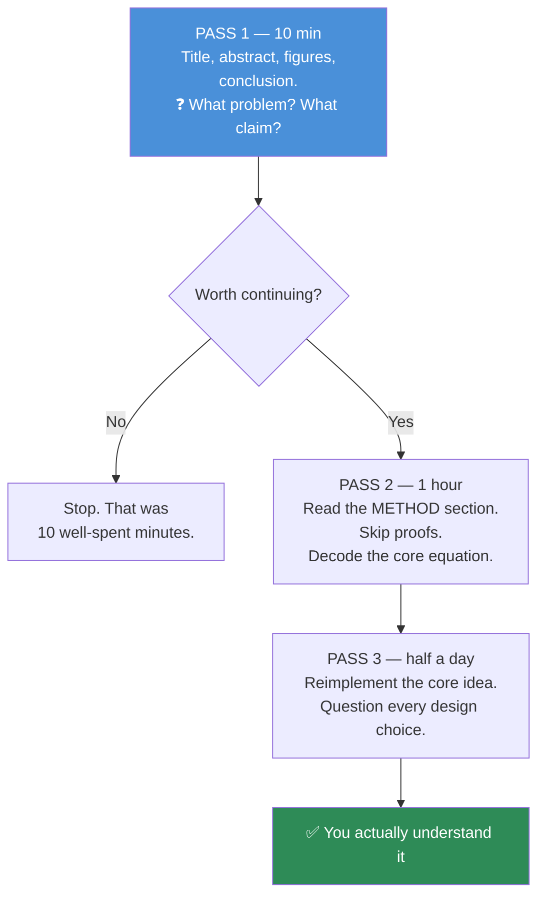

# 06.12 · Reading Mathematical Notation

[⬅ 06.11 Transformer Math](06.11-transformer-math.md) · [🏠 Module 06](../README.md) · [➡ 06.13 Projects & Summary](06.13-projects-summary.md)

> **The lesson in one line:** Mathematical notation is a *syntax*, not a talent — and once you have the symbol table and a decoding procedure, a research paper becomes a document you read rather than a wall you bounce off.

---

## 🎯 Learning objectives

By the end of this lesson you can:

1. Read **sigma** and **product** notation instantly, and translate both to NumPy on sight.
2. Recognize every symbol you'll actually meet in an ML paper.
3. Distinguish **scalar / vector / matrix / set / function** from typography alone.
4. Apply a repeatable **paper-reading procedure** instead of reading top-to-bottom and giving up.
5. Decode any unfamiliar equation with the 7-step method — and know what to do when you get stuck.

---

## 🧠 Mental model

> **Notation is a compression format. Your job is not to *appreciate* it — it's to *decompress* it into code.**

Every symbol maps to a NumPy operation, an index, or a shape. **There is no third thing.** Once you accept that, the intimidation dissolves: you are reading a very terse programming language whose only unfamiliar feature is that it uses Greek letters for variable names.

---

## 1 · Sigma Notation (Σ) — "loop and add"

$$\sum_{i=1}^{n} x_i$$

**Read it as a for-loop.** Three parts:

| Part | Means | In code |
|---|---|---|
| $i = 1$ (bottom) | Start here | `for i in range(...)` |
| $n$ (top) | Stop here | `...range(n)` |
| $x_i$ (right) | Add this each time | `total += x[i]` |

```python
import numpy as np
x = np.array([1., 2., 3., 4.])

# Σᵢ xᵢ
total = 0.0
for i in range(len(x)):
    total += x[i]           # 10.0
print(x.sum())              # 10.0  ← always write this version
```

### The variations you'll actually see

| Notation | Means | NumPy |
|---|---|---|
| $\sum_i x_i$ | Sum over all i | `x.sum()` |
| $\sum_{i=1}^{n} x_i y_i$ | Dot product | `x @ y` |
| $\sum_{i,j} A_{ij}$ | Sum over **both** indices | `A.sum()` |
| $\sum_j A_{ij}$ | Sum over j, **keep i** → a vector | `A.sum(axis=1)` |
| $\sum_i A_{ij}$ | Sum over i, keep j | `A.sum(axis=0)` |
| $\sum_{x \in X}$ | Sum over the elements of a set | `sum(f(x) for x in X)` |
| $\sum_{i \ne j}$ | Skip the diagonal | mask it out |

> [!IMPORTANT]
> **The single most useful reading skill: identify which index is being summed over, and which survives.** The surviving indices are the shape of your output.
>
> - $\sum_j A_{ij}$ — j is consumed, **i survives** → the result is a vector indexed by i → `A.sum(axis=1)`.
> - $C_{ij} = \sum_p A_{ip}B_{pj}$ — p is consumed, **i and j survive** → the result is a matrix → `A @ B`. **That's matrix multiplication, and now you can *read it out of the notation*.**
>
> **Summed index = the axis that disappears.** That one rule decodes most of the sigma notation you'll ever meet.

---

## 2 · Product Notation (Π) — "loop and multiply"

$$\prod_{i=1}^{n} x_i$$

Same structure as Σ, but multiplying.

**Where you'll see it:** likelihoods. The probability of a sequence of independent events is the product of their probabilities:

$$P(w_1,\dots,w_T) = \prod_{t=1}^{T} P(w_t \mid w_{<t}) \qquad \text{← the definition of an autoregressive LLM}$$

> [!TIP]
> **When you see Π, immediately think "take the log."** Products of many probabilities **underflow to zero** in floating point ([06.9](06.9-numerical-computing.md)), and $\log\prod = \sum\log$. **Every Π in a real ML paper becomes a Σ in the actual implementation.** This is why the loss you compute is *log*-likelihood and never plain likelihood — spotting that translation instantly is a mark of fluency.

```python
probs = np.array([0.9, 0.8, 0.7, 0.6])
print(np.prod(probs))          # 0.3024   ← fine here, but underflows for 100 tokens
print(np.log(probs).sum())     # -1.196   ← always do this in practice
```

---

## 3 · Typography — the type system

**In a well-written paper, the *font* tells you the type.** This is the most underrated reading skill there is.

| Typography | Type | Example | NumPy shape |
|---|---|---|---|
| $x$, $\alpha$ — lowercase italic | **Scalar** | learning rate $\eta$ | `()` |
| $\mathbf{x}$, $\vec{x}$ — **bold** lowercase | **Vector** | an embedding | `(n,)` |
| $\mathbf{X}$, $W$ — **bold/capital** | **Matrix** | a weight layer | `(m, n)` |
| $\mathcal{X}$, $\mathcal{D}$ — script | **Set** or distribution | the dataset $\mathcal{D}$ | — |
| $\mathbb{R}$, $\mathbb{E}$ — blackboard | Number set / **Expectation** | $\mathbb{R}^{768}$ | — |
| $f$, $\sigma$, $\phi$ | **Function** | an activation | callable |
| $\theta$, $\phi$ | **Parameters** (learned) | model weights | — |
| $\hat{y}$ — **hat** | **Predicted** / estimated | model output | — |
| $\bar{x}$ — **bar** | **Mean** | sample average | — |
| $x^*$ — **star** | **Optimal** | the best solution | — |
| $x'$, $\tilde{x}$ | Modified / perturbed | augmented data | — |

> [!TIP]
> **Read the shape declaration.** $x \in \mathbb{R}^{768}$ means "x is a real vector of length 768." $W \in \mathbb{R}^{d \times k}$ means "W is a d×k real matrix." **Papers hand you the shapes for free, and almost nobody reads them.** Circle every one on your first pass — you will save yourself hours of confusion.

---

## 4 · The ML Symbol Table

**Print this. Pin it up. It is 90% of what you'll meet.**

### Core

| Symbol | Meaning |
|---|---|
| $x$, $X$ | Input / input batch |
| $y$ | True label |
| $\hat{y}$ | **Predicted** label |
| $\theta$, $\phi$, $w$ | Model **parameters** |
| $\eta$, $\alpha$, $\text{lr}$ | **Learning rate** |
| $L$, $\mathcal{L}$, $J$ | **Loss** / objective |
| $\nabla$ | **Gradient** ("nabla" / "del") |
| $\nabla_\theta L$ | Gradient of L **with respect to θ** |
| $\partial$ | Partial derivative |
| $\mathbb{E}[\cdot]$ | **Expectation** → `.mean()` |
| $\mathbb{E}_{x\sim p}[f(x)]$ | Average of f over x drawn from p |
| $\sim$ | "is distributed as" / "sampled from" |
| $\propto$ | "proportional to" (constants dropped) |
| $\approx$ | approximately |
| $\triangleq$, $:=$ | "is **defined** as" |
| $\in$ | "is an element of" |
| $\forall$ / $\exists$ | for all / there exists |
| $\arg\max_x f(x)$ | **The x that maximizes f** (not the max value!) |
| $\mathbb{1}[\cdot]$ | Indicator: 1 if true, else 0 |

### Linear algebra

| Symbol | Meaning |
|---|---|
| $A^\top$ | **Transpose** |
| $A^{-1}$ | Inverse |
| $\|x\|$, $\|x\|_2$ | **L2 norm** (length) |
| $\|x\|_1$ | L1 norm (sum of \|values\|) |
| $\langle x, y\rangle$ or $x^\top y$ | **Dot product** |
| $\odot$ | **Element-wise** (Hadamard) product → `*` |
| $\otimes$ | Outer / tensor product |
| $I$ | Identity matrix |
| $\text{tr}(A)$ | Trace (sum of the diagonal) |
| $\text{diag}(x)$ | Diagonal matrix from a vector |

### Probability & information

| Symbol | Meaning |
|---|---|
| $P(A)$, $p(x)$ | Probability / density |
| $P(A \mid B)$ | **Conditional** — "A **given** B" |
| $\mathcal{N}(\mu, \sigma^2)$ | **Normal** distribution |
| $\mathcal{U}(a,b)$ | Uniform |
| $H(p)$ | **Entropy** |
| $H(p,q)$ | Cross-entropy |
| $D_{KL}(p \| q)$ | **KL divergence** |
| $I(X;Y)$ | Mutual information |
| $\sigma(\cdot)$ | Sigmoid (or std dev — **context decides!**) |
| $\text{softmax}(\cdot)$ | Logits → probabilities |

> [!WARNING]
> **Overloaded symbols are the #1 source of confusion, and papers rarely warn you.**
> - **$\sigma$** is *sigmoid* in a neural network context and *standard deviation* in a statistics context. Both appear in the same paper.
> - **$\alpha$** is a learning rate, a Dirichlet parameter, a significance level, or a LoRA scaling factor — depending on the field.
> - **$p$** is a probability, a p-value, or the top-p sampling parameter.
> - **$\lambda$** is a regularization strength, an eigenvalue, or a Poisson rate.
>
> **Always let the surrounding sentence disambiguate.** If you're unsure, look at what the symbol is *multiplied by* and what shape that implies. Notation is contextual, and treating it as globally consistent will mislead you.

---

## 5 · How to Read a Research Paper

**Do not read a paper front to back.** That's how you bounce off. Use three passes.



### Pass 1 — Triage (10 minutes)

Read the **title, abstract, all figures and their captions, and the conclusion.** Skip everything else.

Answer three questions:
1. What **problem** is this solving?
2. What is the **claim** (usually one sentence in the abstract)?
3. Is this **relevant to me**?

**Most papers should stop here.** That is not failure — it's triage, and it's the skill that lets you keep up with a field publishing 200 papers a day.

### Pass 2 — The method (1 hour)

Go to the **Method** section. **Find the core equation** — there's almost always exactly one, and the paper's entire contribution is usually contained in it.

**Now run the 7-step decoding procedure from [06.1](06.1-mathematical-thinking.md):**

1. **Identify every symbol.** Scalar, vector, matrix?
2. **Determine every shape.** Write them in the margin. (The paper often *gives* them: "$W \in \mathbb{R}^{d\times k}$".)
3. **Read the operations aloud.** *"Sum over i of…"*
4. **Shrink it.** Set n=2, d=3. Compute by hand.
5. **Implement it in NumPy.** Ten lines.
6. **Ablate it.** *"What breaks if I delete this term?"* ← **This is where the understanding is.**
7. **Write the one-line plain-English meaning.**

**Skip the proofs.** Read the **ablation table** instead — it tells you empirically which parts of the method actually matter, which is usually more informative than the theory.

### Pass 3 — Reimplement (half a day)

**You do not understand a method until you have implemented it.** Reading creates the *illusion* of understanding with remarkable reliability; implementation destroys that illusion instantly.

Ask, for every design choice: *why this and not the obvious alternative?* The answer is usually in the ablation table, and sometimes it's "we tried it and it worked" — which is worth knowing too.

---

## 6 · Worked Example — decoding LoRA, live

From the LoRA paper (Hu et al., 2021):

$$h = W_0 x + \Delta W x = W_0 x + BAx$$
$$\text{where } B \in \mathbb{R}^{d\times r},\; A \in \mathbb{R}^{r\times k},\; r \ll \min(d,k)$$

**Step 1–2 — Symbols and shapes.**

| Symbol | Type | Shape |
|---|---|---|
| $x$ | vector (input) | `(k,)` |
| $W_0$ | matrix (**frozen** pretrained weights) | `(d, k)` |
| $\Delta W$ | matrix (the update) | `(d, k)` |
| $B$ | matrix (**trainable**) | `(d, r)` |
| $A$ | matrix (**trainable**) | `(r, k)` |
| $r$ | scalar | tiny — 8, 16, 64 |
| $h$ | vector (output) | `(d,)` |

**Step 3 — Read aloud.** *"The output is the frozen layer's output, plus a correction produced by squeezing the input down to r dimensions and back up."*

**Step 4 — Shrink.** d=4, k=4, r=1. Then $B$ is `(4,1)`, $A$ is `(1,4)`, and $BA$ is a `(4,4)` matrix of **rank 1**.

**Step 5 — Implement.**

```python
import numpy as np
d, k, r = 4096, 4096, 8

W0 = np.random.randn(d, k).astype(np.float32)     # FROZEN — 16.7M params
B  = np.zeros((d, r), dtype=np.float32)           # trainable
A  = np.random.randn(r, k).astype(np.float32) * 0.01

x = np.random.randn(k).astype(np.float32)
h = W0 @ x + B @ (A @ x)                          # ← note the parenthesization!

print(f"frozen   : {W0.size:>12,}")     # 16,777,216
print(f"trainable: {B.size + A.size:>12,}")   #     65,536  → 256× fewer
```

**Step 6 — Ablate. *This is where you actually learn something.***

| Question | Answer |
|---|---|
| **What if $r = d$?** | $BA$ becomes full-rank → you're training the whole matrix → no saving. **The whole method is the bet that $r$ can be small.** |
| **Why is B initialized to zero?** | So $BA = 0$ at step 0 → the adapted model **starts identical to the base model**. If both were random, you'd inject noise into a working model before training began. |
| **Why `B @ (A @ x)` and not `(B @ A) @ x`?** | **Shapes!** `(A @ x)` is `(r,)` — an 8-element vector. `(B @ A)` would materialize a full `(4096, 4096)` matrix. Same answer, **wildly** different cost. *This is [06.2](06.2-linear-algebra-vectors-matrices.md) associativity, doing real work.* |
| **Why does this work at all?** | The claim that fine-tuning updates are **low-rank** — that everything a new task needs lives in an 8-dimensional subspace. ([06.3](06.3-linear-algebra-decomposition.md)) |

**Step 7 — Plain English.** *"Freeze the big matrix; learn a skinny low-rank correction to it."*

> [!IMPORTANT]
> **You just read a landmark paper in ten minutes.** Not because you're clever, but because you had a **procedure**, a **symbol table**, and — crucially — the **prior lessons** ([06.2](06.2-linear-algebra-vectors-matrices.md) matmul, [06.3](06.3-linear-algebra-decomposition.md) rank) that made the idea *land* instead of just parse.
>
> **That is the entire return on this module.** Papers stop being walls. And notice which step produced the real insight: **step 6, the ablation.** Not reading, not implementing — *asking what breaks*.

---

## 7 · When You Get Stuck

**You will get stuck. Here's the escalation ladder, in order.**

| Stuck on | Do this |
|---|---|
| **A symbol you don't recognize** | Search the paper for its first use — it's usually defined once, in passing. Check the notation table if there is one |
| **A shape that doesn't work out** | You've probably missed a transpose or a broadcast. Write out every shape explicitly |
| **A step in a derivation** | **Skip it.** You need the *result*, not the proof. Come back only if the result surprises you |
| **The whole equation** | **Shrink it.** n=2, d=2. Compute by hand. Abstraction becomes arithmetic |
| **Why a term is there** | **Delete it and think about what breaks.** (This is how you'd discover the √d_k argument yourself) |
| **Everything** | Find a blog post or a video first. Come back to the paper *after*. **There is no prize for suffering through the primary source first** |

> [!IMPORTANT]
> **Confusion is the normal state, not a verdict on your ability.** The authors of the paper you're reading were confused too — for months, probably — before they wrote it. **A paper is a *cleaned-up* account of a messy process**; it is *designed* to look inevitable, and that design is precisely what makes it feel like you're the only one who finds it hard.
>
> The people who become good at this are not the ones who never got confused. **They're the ones who kept going while confused.** That's the entire trick, and nobody tells you.

---

## 🐛 Common mistakes

| Mistake | Fix |
|---|---|
| Reading a paper top to bottom | **Three passes.** Triage first |
| Trying to follow every proof | Skip them. Read the **ablation table** instead |
| Ignoring the shape declarations ($x \in \mathbb{R}^{768}$) | **Circle every one.** They're free information |
| Assuming a symbol means the same thing across papers | σ, α, λ, p are all overloaded. **Context decides** |
| Reading Π and not thinking "log" | Products underflow. Papers write Π; code writes Σ log |
| Believing you understand without implementing | Reading creates a *reliable illusion* of understanding |
| Skipping the ablation question | **"What breaks if I remove this?"** is where the insight is |
| Feeling stupid when confused | **Confusion is the process.** Everyone, always |

---

## 📝 Exercises

**Conceptual**
1. In $\sum_j A_{ij}$, which index survives? What's the output shape? What's the NumPy?
2. Why does every Π in a paper become a Σ in the code?
3. Name four overloaded symbols and give two meanings for each.
4. Why should you read the ablation table before the proofs?

**Notation drills — translate to NumPy**
5. $\sum_{i=1}^{n} (x_i - \bar{x})^2$
6. $\prod_{t=1}^{T} p(w_t \mid w_{<t})$ — and then write the version you'd actually implement
7. $C_{ij} = \sum_{p} A_{ip} B_{pj}$
8. $\hat{y} = \arg\max_c \; \text{softmax}(z)_c$
9. $\mathbb{E}_{x \sim \mathcal{D}}[\mathcal{L}(f_\theta(x), y)]$
10. $\|W\|_F^2 = \sum_{i,j} W_{ij}^2$ (the Frobenius norm)
11. $\theta^* = \arg\min_\theta \; \frac{1}{n}\sum_{i=1}^{n} L(f_\theta(x_i), y_i) + \lambda\|\theta\|_2^2$

**Equation interpretation — decode all 7 steps**
12. $\text{Attention}(Q,K,V) = \text{softmax}\!\left(\frac{QK^\top}{\sqrt{d_k}}\right)V$ (you should now do this in under two minutes)
13. $\mathcal{L}_{\text{DPO}} = -\mathbb{E}\left[\log\sigma\left(\beta\log\frac{\pi_\theta(y_w|x)}{\pi_{\text{ref}}(y_w|x)} - \beta\log\frac{\pi_\theta(y_l|x)}{\pi_{\text{ref}}(y_l|x)}\right)\right]$ — **hard.** Hint: $y_w$ = preferred ("win"), $y_l$ = rejected ("lose"). What is β doing? What is $\pi_{\text{ref}}$ for? ([06.8](06.8-information-theory.md))
14. $\text{ELBO} = \mathbb{E}_{q(z|x)}[\log p(x|z)] - D_{KL}(q(z|x)\,\|\,p(z))$ — which term is reconstruction, which is regularization?

**Practice**
15. **Pick any recent arXiv paper in your area.** Do Pass 1 (10 min). Write down the problem, the claim, and whether it's relevant. Time yourself.
16. Do Pass 2 on the same paper. Find the core equation. Run all 7 decoding steps. **Write down what breaks if each term is removed.**
17. Do Pass 3: reimplement the core idea in NumPy. It will be harder than you expect. That gap *is* the value.

---

## 🛠️ Mini project — *The Paper Decoder*

Build `code/06-mathematics/paper-decoder/` — a personal system for reading papers, and proof that you can.

```
paper-decoder/
├── README.md
├── SYMBOLS.md            # your own symbol table, grown as you read
├── template.md           # the 7-step decoding worksheet
└── papers/
    ├── attention-2017.md      # decoded
    ├── lora-2021.md           # decoded
    ├── adam-2014.md           # decoded
    └── <your-choice>.md       # a paper NOBODY handed you
```

**The `template.md` worksheet:**

```markdown
# <Paper Title> (<Year>)
**Link:** · **Read on:** · **Time spent:**

## Pass 1 — Triage (10 min)
- **Problem:**
- **Claim (one sentence):**
- **Relevant to me?**

## Pass 2 — The core equation
> <paste the equation>

| Symbol | Type | Shape | Meaning |
|---|---|---|---|

**Read aloud:**
**Shrunk to n=2, d=3:**
**NumPy implementation:** (link to code)

### Ablation — the important part
| If I remove… | What breaks | Therefore it's there because… |
|---|---|---|

**Plain English (one line):**

## Pass 3 — Reimplementation
- **What surprised me:**
- **What I still don't understand:**
```

**Implementation guidance**
1. **Decode the three papers whose math you *already* know** — Attention, LoRA, Adam. **You'll get them right, and that builds the confidence you need for the fourth.** This is deliberate: you are calibrating the procedure on ground you've already covered.
2. **Then pick a paper nobody handed you.** Something from this month, in an area you care about. **This is the real test, and it's the one that matters** — because in your job, nobody will hand you a curated list.
3. **`SYMBOLS.md` grows forever.** Every unfamiliar symbol goes in it, with the paper you found it in. **In six months it will be the most valuable file in this repository**, because it will be *yours* — indexed by what confused *you*.
4. **Be honest in the "what I still don't understand" section.** It's the most useful part of the whole worksheet. Ambiguity you *record* becomes a to-do; ambiguity you *hide* becomes a permanent hole.

---

## 📄 Cheat sheet

| Notation | Means | NumPy |
|---|---|---|
| $\sum_i$ | loop and add | `.sum(axis=...)` |
| $\prod_i$ | loop and multiply | `.prod()` — **but use `log().sum()`** |
| $\sum_j A_{ij}$ | sum j, **keep i** | `A.sum(axis=1)` |
| $x^\top y$, $\langle x,y\rangle$ | dot product | `x @ y` |
| $A^\top$ | transpose | `A.T` |
| $\odot$ | **element-wise** | `*` |
| $\|x\|$ | L2 norm | `np.linalg.norm(x)` |
| $\mathbb{E}[\cdot]$ | expectation | `.mean()` |
| $\nabla_\theta L$ | gradient w.r.t. θ | `loss.backward()` |
| $\arg\max_x$ | **the x that maximizes** | `np.argmax` |
| $\hat{y}$ | predicted | `y_pred` |
| $\bar{x}$ | mean | `x.mean()` |
| $x \sim p$ | sampled from p | `rng.choice(..., p=p)` |
| $x \in \mathbb{R}^{d}$ | **shape declaration** | `shape == (d,)` |
| **Summed index** | **the axis that disappears** | — |
| **Overloaded** | σ, α, λ, p — **context decides** | — |

**The 3 passes:** triage (10 min) → method (1 h) → reimplement (½ day)
**The 7 steps:** symbols → shapes → read aloud → shrink → implement → **ablate** → plain English

---

## 🎴 Flashcards

- **Q:** How do you read $\sum_j A_{ij}$? → **A:** "Sum over j, keeping i" → the j axis disappears → `A.sum(axis=1)`. **The summed index is the axis that vanishes.**
- **Q:** What should you think when you see Π in a paper? → **A:** "Take the log." Products of probabilities underflow; every Π becomes a Σ of logs in the implementation.
- **Q:** What does typography tell you? → **A:** The type. Lowercase italic = scalar; bold lowercase = vector; capital/bold = matrix; script = set; $\mathbb{E}$ = expectation; hat = predicted; bar = mean.
- **Q:** What does $x \in \mathbb{R}^{768}$ tell you? → **A:** The shape — `(768,)`. Papers give you shapes for free and almost nobody reads them.
- **Q:** Name four overloaded symbols. → **A:** σ (sigmoid *or* std dev), α (learning rate / Dirichlet / significance / LoRA scale), λ (regularization / eigenvalue / rate), p (probability / p-value / top-p).
- **Q:** What are the three passes for reading a paper? → **A:** Triage (10 min: abstract, figures, conclusion) → Method (1 h: decode the core equation, skip proofs) → Reimplement (½ day).
- **Q:** What are the 7 decoding steps? → **A:** Symbols → shapes → read aloud → shrink to a tiny case → implement → **ablate ("what breaks if I remove this?")** → plain English.
- **Q:** Which decoding step produces the real insight? → **A:** **The ablation.** Asking what breaks if a term is removed tells you *why it exists* — which is the only thing you'll actually remember.
- **Q:** What's $\arg\max_x f(x)$? → **A:** The **x** that maximizes f — **not** the maximum value of f. (`np.argmax`, not `np.max`.)
- **Q:** What should you do when you're stuck on a derivation? → **A:** **Skip it.** You need the result, not the proof. Come back only if the result surprises you.
- **Q:** What does it mean if you're confused by a paper? → **A:** That you're reading a paper. **Confusion is the process, not a verdict.** The people who get good are the ones who keep going while confused.

---

## 💼 Interview questions

1. **"Walk me through this equation."** *(An interviewer writes one on a whiteboard.)* — Don't panic; **run the procedure out loud**: name the symbols, state the shapes, read the operations, shrink it to a tiny case. **They are testing whether you have a *process*, not whether you've memorized the formula.** Narrating the process is the answer.
2. **"How do you keep up with the literature?"** — Three passes; triage aggressively; most papers stop at pass 1. Mention that you reimplement the ones that matter, because reading creates a false sense of understanding.
3. **"Explain a recent paper you've read."** — Have one ready. Give: the problem, the core equation, **what breaks without its key term**, and what you'd change. That last part is what separates a reader from an engineer.
4. **"What's the difference between $\arg\max$ and $\max$?"** — A small question that catches a surprising number of people. One returns the location, the other the value.

---

## 📚 Summary

- **Notation is a compression format, not a talent.** Every symbol maps to a NumPy operation, an index, or a shape. There is no third thing.
- **Σ is a for-loop that adds; Π is a for-loop that multiplies.** The **summed index is the axis that disappears** — that one rule decodes most sigma notation you'll ever see.
- **Every Π becomes a Σ of logs** in real code, because products of probabilities underflow.
- **Typography is a type system.** Bold lowercase = vector, capital = matrix, script = set, hat = predicted. **Shape declarations ($x \in \mathbb{R}^d$) are free information** — read them.
- **Symbols are overloaded** (σ, α, λ, p). Context decides. Assuming global consistency will mislead you.
- **Read papers in three passes**: triage (10 min) → method (1 h) → reimplement (½ day). **Most papers should stop at pass 1** — that's triage, not failure.
- **Skip the proofs. Read the ablation table.**
- **The 7-step decoding procedure ends with the step that matters: "what breaks if I remove this term?"** That question is where understanding lives — and it's how you'd have discovered the √d_k argument yourself.
- **Confusion is the normal state.** A paper is a cleaned-up account of a messy process, *designed* to look inevitable. The people who get good are the ones who keep going while confused.

**Next:** [06.13 Projects & Summary](06.13-projects-summary.md) — five projects that turn all of this into something you can point at.

---

## 🔗 References

- Keshav — *How to Read a Paper* (one page). The three-pass method originates here. **Read it today; it takes five minutes and will pay you back for the rest of your career.**
- Karpathy — on Twitter/X, frequently: the "reimplement it or you don't understand it" discipline.
- Hu et al. (2021) — *LoRA* — the paper we decoded above. Go read the real thing and check your worksheet against it.
- Vaswani et al. (2017) — *Attention Is All You Need*.
- *Mathematics for Machine Learning* (mml-book.github.io) — has a notation table at the front. Most good books do; use them.
- arXiv Sanity / Papers with Code / Hugging Face Papers — for finding what to triage.

---

## 🧭 Navigation

| Direction | Link |
|---|---|
| ⬅ Previous | [06.11 Transformer Math](06.11-transformer-math.md) |
| ➡ Next | [06.13 Projects & Summary](06.13-projects-summary.md) |
| 🏠 Module | [Module 06](../README.md) |
| 🗺 Roadmap | [ROADMAP.md](../../../ROADMAP.md) |
