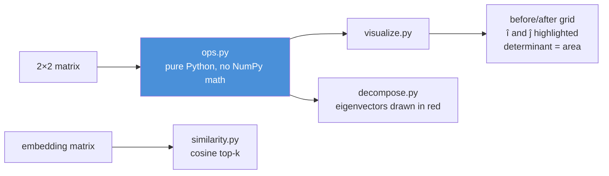
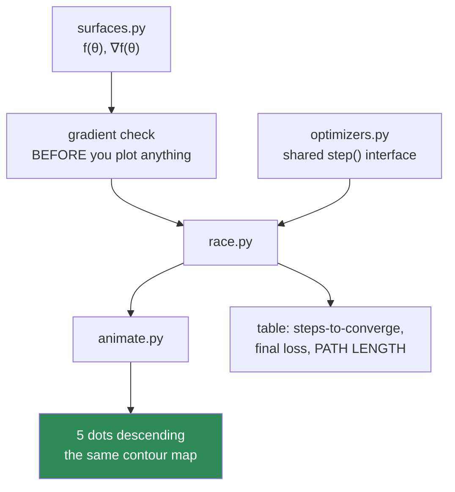
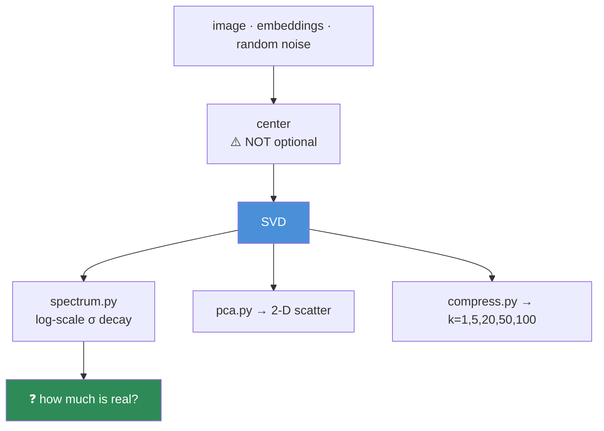
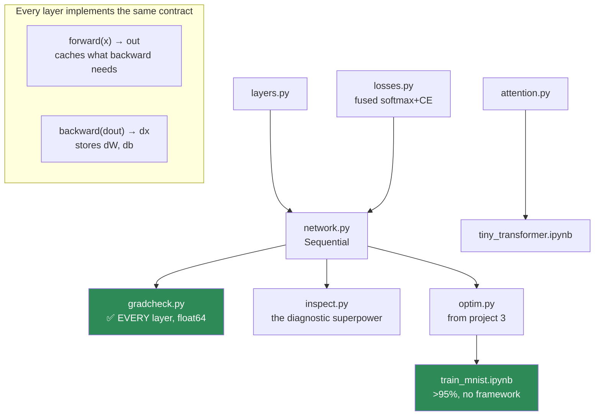
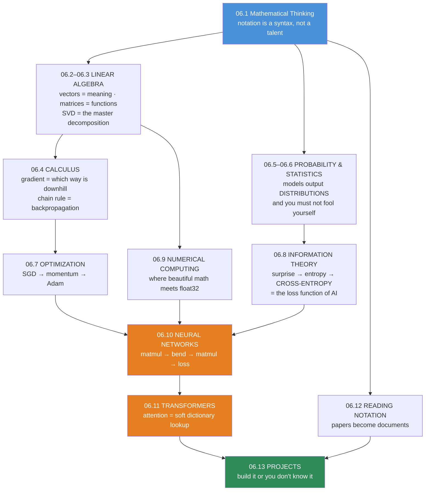

# 06.13 · Projects & Module Summary

[⬅ 06.12 Reading Notation](06.12-reading-notation.md) · [🏠 Module 06](../README.md) · [➡ Module 07 · Data Analysis](../../07-Data-Analysis/README.md)

> **The lesson in one line:** You've read the mathematics; now build the five things that prove you own it — because the difference between "I've seen this" and "I know this" is a repository you can point at.

---

## 🎯 Learning objectives

By the end of this lesson you can:

1. Build **five portfolio projects** that each demonstrate a core mathematical capability.
2. Structure numerical code the way production ML code is structured.
3. Prove your mathematics is *correct* — with gradient checks, not with hope.
4. Consolidate all twelve lessons into a single coherent mental model.
5. Self-assess honestly, and know exactly what to revisit.

---

## The five projects

Each project is buildable in a day, and each one produces an artifact you can show someone.

| # | Project | Proves you can | Core lessons |
|---|---|---|---|
| 1 | **Matrix Calculator & Visualizer** | See linear algebra geometrically | [06.2](06.2-linear-algebra-vectors-matrices.md), [06.3](06.3-linear-algebra-decomposition.md) |
| 2 | **Linear Regression From Scratch** | Connect math → code → learning | [06.2](06.2-linear-algebra-vectors-matrices.md), [06.4](06.4-calculus.md), [06.7](06.7-optimization.md) |
| 3 | **Gradient Descent Visualizer** | Understand optimization physically | [06.4](06.4-calculus.md), [06.7](06.7-optimization.md) |
| 4 | **PCA Implementation** | Use decomposition to compress reality | [06.3](06.3-linear-algebra-decomposition.md), [06.6](06.6-statistics.md) |
| 5 | **Neural Network Math Simulator** | Build deep learning from nothing | [06.10](06.10-neural-network-math.md), [06.11](06.11-transformer-math.md) |

```
code/06-mathematics/
├── README.md                   # index of all five
├── requirements.txt            # numpy, matplotlib, scipy, pytest
├── matrix-calculator/          # project 1
├── linear-regression/          # project 2
├── gradient-descent-viz/       # project 3
├── pca-lab/                    # project 4
└── nn-from-scratch/            # project 5  ← the flagship
```

> [!IMPORTANT]
> **One rule governs all five: no `sklearn`, no `torch`, no `autograd`.** NumPy for arrays, matplotlib for plots, pytest for correctness — nothing else. **The moment you import a framework, the learning stops**, because the framework does the exact thing you're trying to understand. Use them *afterwards*, to check your answers.

---

## Project 1 — Matrix Calculator & Transformation Visualizer

**Goal:** make linear algebra *visible*. Type a 2×2 matrix; watch space bend.

```
matrix-calculator/
├── README.md
├── src/
│   ├── ops.py            # from-scratch: dot, matmul, transpose, norm, det
│   ├── visualize.py      # draw a matrix's effect on the unit grid
│   ├── decompose.py      # eigenvectors, SVD — and where î, ĵ land
│   └── similarity.py     # normalize → matmul → top-k (the RAG pattern)
├── tests/test_ops.py     # every op asserted against NumPy
└── notebooks/explore.ipynb
```



**Build order**
1. `ops.py` in **pure Python lists** — no `np.dot`. This is the part that teaches.
2. `tests/` against NumPy with `np.allclose`. If yours disagrees, you learned something.
3. `visualize.py` — apply the matrix to every point of a grid and redraw. **Watch a singular matrix collapse the plane onto a line.** You will never forget what rank 1 means.
4. Overlay the eigenvectors in red and confirm they don't rotate.

**The moment it clicks:** when the determinant readout hits **0** at the exact instant the grid flattens into a line.

---

## Project 2 — Linear Regression From Scratch

**Goal:** the complete math→code→learning pipeline, in its simplest possible form. **This is the "hello world" of machine learning, and it contains every idea in the field in miniature.**

```
linear-regression/
├── README.md
├── src/
│   ├── data.py           # generate y = 3x + 2 + noise
│   ├── closed_form.py    # normal equations (and WHY not to use them)
│   ├── gradient.py       # analytical gradient + gradient check
│   ├── train.py          # gradient descent loop
│   └── evaluate.py       # R², residual plots, bootstrap CI (06.6)
├── tests/test_gradient.py
└── notebooks/report.ipynb
```

**The three solutions — and the point is that they agree**

| Method | Equation | Verdict |
|---|---|---|
| **Closed form** | $\hat{\beta} = (X^\top X)^{-1}X^\top y$ | ✅ Exact — but O(d³) and numerically fragile |
| **`np.linalg.solve`** | Solve $(X^\top X)\beta = X^\top y$ | ✅ Same answer, stable ([06.3](06.3-linear-algebra-decomposition.md)) |
| **Gradient descent** | $\beta \leftarrow \beta - \eta\nabla L$ | ✅ Scales to billions of params — **this is why deep learning works** |

```python
import numpy as np

def mse(X, y, beta):
    return np.mean((X @ beta - y) ** 2)

def grad_mse(X, y, beta):
    n = len(y)
    return (2/n) * X.T @ (X @ beta - y)      # derive this by hand first!
```

> [!IMPORTANT]
> **Derive `grad_mse` on paper before you write it, then gradient-check it.** $L = \frac{1}{n}\|X\beta - y\|^2$, so $\nabla_\beta L = \frac{2}{n}X^\top(X\beta - y)$. **Confirm the shape:** `(d,n) @ (n,) → (d,)` — same shape as β ✓ ([06.4](06.4-calculus.md)). This single derivation is the template for *every* gradient you will ever compute.

**Then compare all three.** They converge to the same β. **Seeing gradient descent arrive at the exact answer the closed form gives you — but by a route that scales to GPT — is the moment optimization stops being abstract.**

**Deliverable:** a report notebook with the fit plotted, residuals checked, R² reported **with a bootstrap confidence interval** ([06.6](06.6-statistics.md) — because you don't report a bare number anymore).

---

## Project 3 — Gradient Descent Visualizer

**Goal:** turn optimization into a physical intuition you own permanently.

```
gradient-descent-viz/
├── README.md
├── src/
│   ├── surfaces.py       # bowl, ravine (x²+10y²), saddle, Rosenbrock
│   ├── optimizers.py     # SGD, Momentum, AdaGrad, RMSProp, Adam, AdamW
│   ├── schedules.py      # constant, cosine, warmup+cosine
│   ├── race.py           # every optimizer × every surface
│   └── animate.py        # side-by-side GIFs
├── tests/test_gradients.py   # gradient-check every surface
└── outputs/*.gif
```



**Build order**
1. **Gradient-check every surface first.** A wrong gradient produces a beautiful, convincing, entirely meaningless animation. This is the most important step and the easiest to skip.
2. All optimizers share one interface: `step(theta, grad) -> theta`. **This is exactly how `torch.optim` is built** — you're reimplementing, not simplifying.
3. Race them on the **ravine** ($x^2 + 10y^2$). SGD zig-zags; momentum cuts the diagonal; **Adam glides almost straight down.**
4. Report **path length** — the underrated metric. It *quantifies* the zig-zagging.
5. Add the **LR finder**: sweep η from 1e-6 to 1, plot loss vs η on a log axis. You'll reuse this tool in real jobs.

**The moment it clicks:** when you compute $2/\lambda_{\max}(H) = 0.1$ from the Hessian, and the animation **diverges at exactly η = 0.11**. You *predicted your own divergence from an eigenvalue* ([06.3](06.3-linear-algebra-decomposition.md) + [06.4](06.4-calculus.md) + [06.7](06.7-optimization.md), fusing into one subject).

---

## Project 4 — PCA & Compression Lab

**Goal:** use decomposition to answer one real question — *"how much of this data is signal, and how much is noise?"*

```
pca-lab/
├── README.md
├── src/
│   ├── pca.py            # center → SVD → truncate → project
│   ├── compress.py       # rank-k image reconstruction
│   ├── spectrum.py       # singular-value decay: real data vs random
│   └── lora_demo.py      # W + BA; parameter counting; rank verification
├── data/embeddings.npy
├── tests/test_pca.py     # vs sklearn (up to sign flips — explain why!)
└── notebooks/report.ipynb
```



**Build order**
1. `pca.py` — **center, SVD, truncate, project.** No sklearn. Test against sklearn allowing sign flips (eigenvectors are only defined up to sign — be able to *explain* that).
2. `compress.py` — take a photo, reconstruct at k = 1, 5, 20, 50, 100. **Watching a recognizable face emerge at k=20 out of 512 is the moment SVD becomes real.**
3. `spectrum.py` — **this is the punchline.** Plot singular values (log y) for random data vs. real embeddings. Random is flat; real decays *fast*. **That decay is the entire reason PCA, compression, and LoRA all work.** Make this plot. Frame it.
4. `lora_demo.py` — build `W + BA`, verify `matrix_rank(BA) <= r`, count parameters, confirm the 256× reduction.

**Deliverable:** a report that answers *"how much of this data is real?"* with evidence, not vibes.

---

## Project 5 — Neural Network Mathematics Simulator ⭐

**The flagship.** A working deep learning framework, built from nothing.

```
nn-from-scratch/
├── README.md
├── src/
│   ├── layers.py         # Linear, ReLU, GELU, Dropout, LayerNorm
│   ├── losses.py         # softmax+CrossEntropy (fused), MSE
│   ├── network.py        # Sequential container
│   ├── optim.py          # SGD, Momentum, Adam  ← reuse project 3!
│   ├── init.py           # zeros (fails!), xavier, he
│   ├── gradcheck.py      # numerical gradient checking for ANY layer
│   ├── inspect.py        # activation & gradient histograms per layer
│   └── attention.py      # scaled dot-product + multi-head + causal mask
├── tests/test_gradients.py   # EVERY layer gradient-checked
└── notebooks/
    ├── train_mnist.ipynb     # >95% accuracy, zero frameworks
    └── tiny_transformer.ipynb
```



**Build order**
1. **`gradcheck.py` FIRST.** Before any layer exists. Every layer must pass before you compose anything — a wrong transpose deep in a network produces a model that trains *slightly* badly, which is nearly impossible to debug afterwards. Check in **float64** ([06.9](06.9-numerical-computing.md)).
2. **`layers.py`** — each layer is a class with `forward(x)` and `backward(dout)`. **This is `nn.Module`'s exact contract.**
3. **`init.py`** — *demonstrate the failures.* Zero-init: symmetry never breaks. Too-small: activations vanish. Too-large: they explode. He: they survive. Three plots, permanent understanding.
4. **`inspect.py`** — histogram activations and gradients per layer, every N steps. **Learning to *read* these plots is what separates people who debug models from people who guess at hyperparameters.**
5. **Train on real MNIST.** 784 → 128 → 10. **>95% accuracy, no framework.**
6. **`attention.py`** — then build a tiny Transformer and train it on Shakespeare. **It will generate text.**

> [!IMPORTANT]
> **When this works, you will have built — from scratch, with only NumPy — the full stack: autodiff-style layer contracts, He initialization, a fused numerically-stable softmax+cross-entropy, Adam, multi-head causal attention, and a generating language model.**
>
> **Almost nobody who works in AI has done this.** It is the single most valuable artifact in this module, it takes a weekend, and it permanently changes your relationship to every framework you will ever touch. Frameworks become *conveniences* rather than *magic* — and that shift never reverses.

---

## 📊 Module Summary — everything, connected

### The twelve lessons as one idea



### The ideas that did the most work

| Idea | Where it kept reappearing |
|---|---|
| **The dot product = alignment** | Cosine similarity → RAG → attention scores → a single neuron → logits |
| **A matrix = a function** | Layers, composition, why depth needs nonlinearity |
| **The gradient points uphill** | Every training step ever taken |
| **The chain rule multiplies** | Backprop; vanishing/exploding gradients; **why residual connections exist** |
| **Eigenvalues raised to the n-th power** | Why deep RNNs failed; why ResNets work; your max stable learning rate |
| **Rank is usually low** | PCA, compression, **LoRA**, embeddings |
| **Variance must be controlled** | He init, layer norm, **the √d_k in attention** |
| **Cross-entropy = surprise** | Every classifier, every LLM; and `log(0)` = the NaN that kills your run |
| **Products underflow; take the log** | Every language model, every likelihood |
| **Uncertainty shrinks as 1/√n** | Why your eval set is too small to prove what you think it proves |

> [!IMPORTANT]
> **Notice how few ideas that actually is.** Ten sentences carry most of the mathematics of modern AI. That was the promise in [06.1](06.1-mathematical-thinking.md) — *"you need far less math than you fear, but you need to understand it"* — and this table is the receipt.

### The moments where lessons fused

The best evidence you've learned something is when separate topics stop being separate:

- **The ravine $x^2 + 10y^2$** appeared in [06.4](06.4-calculus.md) (gradient descent zig-zags), [06.3](06.3-linear-algebra-decomposition.md) (its Hessian's condition number of 10 *predicts* that zig-zag), and [06.7](06.7-optimization.md) (momentum fixes it). **Three lessons, one picture.**
- **The $\sqrt{d_k}$ in attention** is a *variance* fix ([06.5](06.5-probability.md)), protecting a *gradient* ([06.4](06.4-calculus.md)), from a *numerical* saturation ([06.9](06.9-numerical-computing.md)). **Three lessons, one square root.**
- **Residual connections** exist because $\partial(x+f(x))/\partial x = 1 + f'(x)$ ([06.4](06.4-calculus.md)) counteracts eigenvalues compounding across depth ([06.3](06.3-linear-algebra-decomposition.md)) — and they are why a Transformer can be 80 layers deep ([06.11](06.11-transformer-math.md)).
- **LoRA** is rank ([06.3](06.3-linear-algebra-decomposition.md)) solving Adam's 3× memory cost ([06.7](06.7-optimization.md)).

**When you can trace a design decision back through three lessons, you're not learning math anymore — you're doing engineering.**

---

## ✅ Self-assessment

Be honest. Anything you can't do is a lesson to revisit, not a verdict.

**Linear algebra**
- [ ] I can predict the output shape of any matmul instantly
- [ ] I can explain what a matrix does to space, geometrically
- [ ] I can explain why LoRA works, using the word "rank"
- [ ] I can implement PCA from scratch with SVD, and say why centering matters

**Calculus**
- [ ] I can explain backpropagation as the chain rule, and say why it's *reverse* mode
- [ ] I can explain vanishing gradients numerically (not hand-wavily)
- [ ] I can explain why residual connections work, with the derivative
- [ ] I can gradient-check a hand-written backward pass

**Probability & statistics**
- [ ] I can state what an LLM computes, as an equation
- [ ] I can explain why "99% accurate" can be a terrible result
- [ ] I put a **confidence interval** on every metric I report
- [ ] I know why random-splitting time-series data destroys a model

**Optimization & information theory**
- [ ] I can implement Adam in twelve lines and explain each one
- [ ] I can explain why Adam needs 3× the parameter memory
- [ ] I can derive cross-entropy from "information is surprise"
- [ ] I can explain why the softmax+CE gradient is `predicted − actual`

**Numerical & architectures**
- [ ] I can debug a `NaN` systematically instead of guessing
- [ ] I can explain why LLMs train in bfloat16 and not float16
- [ ] I can implement multi-head attention in NumPy
- [ ] I can explain the $\sqrt{d_k}$ from the variance argument
- [ ] I have built a neural network with **no framework** and it worked

**Reading**
- [ ] I can decode an unfamiliar equation with a *procedure* rather than by staring
- [ ] I have read a real paper and reimplemented its core idea

> [!TIP]
> **If you tick fewer than half of these, that's completely fine — and it's information, not failure.** Go back to the specific lessons. Mathematics is *iterative by nature*: pass one gives you vocabulary, pass two gives you mechanics, pass three gives you intuition. **Nobody gets it on pass one, including the people who wrote the papers.**

---

## 🎯 What this module bought you

**Before:** equations in papers were a wall. Frameworks were magic. "The loss went to NaN" meant randomly lowering the learning rate and hoping.

**Now:**

- You can read $\text{softmax}(QK^\top/\sqrt{d_k})V$ and **know why every symbol is there** — including what breaks without the square root.
- You know that **backprop is the chain rule**, that **cross-entropy is surprise**, that **LoRA is rank**, and that **NaN comes from `exp` and `log`.**
- You have a **procedure** for any equation you've never seen: symbols → shapes → shrink → implement → **ablate** → plain English.
- You've built a neural network, an optimizer, and an attention mechanism **from nothing**.

**You will not be intimidated by a paper again.** That's the deliverable — and it doesn't expire.

---

## 🧭 Where this leads

| Next | What Module 06 gives you there |
|---|---|
| [**07 · Data Analysis**](../../07-Data-Analysis/README.md) | Statistics, distributions, correlation, confidence intervals |
| [**08 · Machine Learning**](../../08-Machine-Learning/README.md) | Gradient descent, loss functions, bias–variance, cross-entropy |
| [**09 · Deep Learning**](../../09-Deep-Learning/README.md) | **Everything.** Backprop, initialization, optimizers, numerical stability |
| [**10 · NLP**](../../10-NLP/README.md) | Embeddings, cosine similarity, language modelling as conditional probability |
| [**11 · LLMs**](../../11-LLMs/README.md) | Temperature, top-p, perplexity, entropy, attention, the KV cache |
| [**13 · RAG**](../../13-RAG/README.md) | Cosine similarity, normalize-then-matmul, ANN search |
| [**15 · Fine-Tuning**](../../15-Fine-Tuning/README.md) | **LoRA is rank.** You already understand it |

> [!IMPORTANT]
> **Module 06 is the module the rest of the handbook stands on.** Every lesson from here forward will reference something you learned here — and because you *built* it rather than read it, those references will land. **The investment compounds from this point on.**

---

## 📄 Module cheat sheet

Everything, on one page. See also the full [math cheat sheet](../cheat-sheets/math-cheatsheet.md).

| Domain | The one thing to remember |
|---|---|
| **Thinking** | Notation is a syntax. Decode: symbols → shapes → shrink → implement → **ablate** |
| **Linear algebra** | Dot product = alignment. Matrix = function. `(m,k)@(k,n)→(m,n)` |
| **Decomposition** | Every matrix is rotate→stretch→rotate. Real matrices are **low-rank** (∴ LoRA) |
| **Calculus** | Gradient points **uphill**. **Chain rule = backprop.** Products compound → vanish/explode |
| **Probability** | Models output **distributions**. An LLM computes $P(w_t \mid w_{<t})$. Beware base rates |
| **Statistics** | Report **value ± CI, with n and seeds**. Uncertainty shrinks as **1/√n** |
| **Optimization** | Adam = momentum + RMSProp. **LR is the #1 hyperparameter.** Adam costs 3× memory |
| **Information theory** | Cross-entropy = surprise. Its gradient is **predicted − actual** |
| **Numerical** | Subtract the max. Work in log space. **bf16 > fp16** (range beats precision) |
| **Neural networks** | matmul → bend → matmul → loss. **No nonlinearity = no depth** |
| **Transformers** | Attention = soft dictionary lookup. **√d_k is a variance fix.** O(n²) |
| **Reading papers** | Three passes. Skip proofs. **Read the ablation table** |

---

## 📚 References — the short list

If you keep five things from this module's bibliography:

1. **3Blue1Brown** — *Essence of Linear Algebra* + *Essence of Calculus*. The visual intuition in this module is largely his, and it is the correct intuition.
2. **Karpathy** — *Neural Networks: Zero to Hero*. Build micrograd, then makemore, then GPT. **The best practical AI education that exists, at any price.**
3. **Deisenroth, Faisal & Ong** — *Mathematics for Machine Learning* (free PDF). The reference to keep open.
4. **Goodfellow, Bengio & Courville** — *Deep Learning*, Part I (free online). Chapters 2–4 are exactly this module's scope.
5. **Vaswani et al. (2017)** — *Attention Is All You Need*. **Go read it. You understand every equation in it now — and that was the whole point.**

---

## 🧭 Navigation

| Direction | Link |
|---|---|
| ⬅ Previous | [06.12 Reading Notation](06.12-reading-notation.md) |
| ➡ Next module | [07 · Data Analysis](../../07-Data-Analysis/README.md) |
| 🏠 Module | [Module 06](../README.md) |
| 📖 All lessons | [Lesson index](README.md) |
| 🗺 Roadmap | [ROADMAP.md](../../../ROADMAP.md) |
