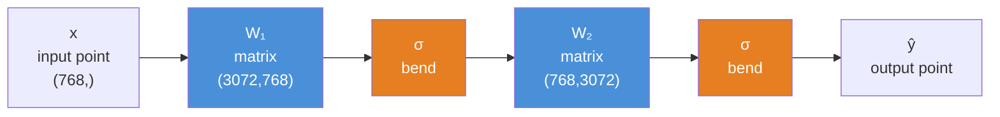
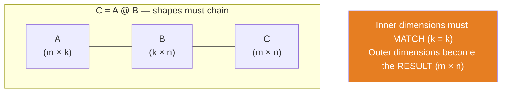
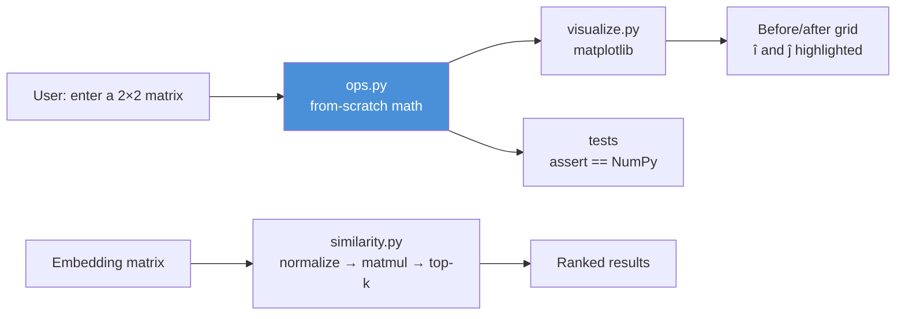

# 06.2 · Linear Algebra I — Vectors, Matrices & Multiplication

[⬅ 06.1 Mathematical Thinking](06.1-mathematical-thinking.md) · [🏠 Module 06](../README.md) · [➡ 06.3 Decomposition](06.3-linear-algebra-decomposition.md)

> **The lesson in one line:** A neural network is a stack of matrix multiplications with a squiggle between them — so if you understand matmul geometrically, you understand the *shape* of everything that follows.

---

## 🎯 Learning objectives

By the end of this lesson you can:

1. Distinguish **scalar / vector / matrix / tensor** and know the shape of every object in a model.
2. Explain the **dot product** as alignment — and derive cosine similarity, the backbone of RAG.
3. See a **matrix as a function**: a linear transformation of space, not a grid of numbers.
4. Compute and reason about **matrix multiplication** in three complementary ways, and predict output shapes instantly.
5. Explain why the **cross product** exists, and why AI barely uses it.
6. Implement all of it in NumPy, and know the **performance** consequences of each choice.

---

## 🧠 Mental model

> **A vector is a point in meaning-space. A matrix is a machine that moves points.**

That's the whole subject. Deep learning is:

```
take a point  →  move it with a matrix  →  bend it with a nonlinearity  →  repeat
```

The matrices are the *learned* part. Training is the search for matrices that move points into positions where the answer becomes easy to read off. When you hear "the model has 7 billion parameters," those parameters are **the numbers inside these matrices**.



---

## 1 · Scalars, Vectors, Matrices, Tensors

### Intuition

They're the same idea at different **ranks** — how many indices you need to pinpoint one number.

| Object | Rank | Indices needed | Notation | Concretely |
|---|---|---|---|---|
| **Scalar** | 0 | `x` | $x$ (lowercase italic) | a learning rate, a loss value, a temperature |
| **Vector** | 1 | `x[i]` | $\mathbf{x}$ (bold lowercase) | one embedding, one row of features |
| **Matrix** | 2 | `X[i,j]` | $\mathbf{X}$ (bold uppercase) | a weight layer, a batch of embeddings |
| **Tensor** | 3+ | `X[i,j,k,…]` | $\mathcal{X}$ (script) | a batch of token sequences of embeddings |

> [!NOTE]
> **"Tensor" in deep learning ≠ "tensor" in physics/math.** In PyTorch/TensorFlow, a tensor is simply *an n-dimensional array*. The rich mathematical object (with covariance/contravariance and transformation laws) is not what the frameworks mean. Don't let a physicist confuse you.

### Geometry

A vector is **an arrow from the origin**, or equivalently **a point**. `[3, 4]` is an arrow that goes 3 right and 4 up. Its **length** (norm) is $\sqrt{3^2+4^2} = 5$ — just Pythagoras.

In AI, vectors live in **768, 1536, or 4096 dimensions**, and you cannot visualize that. That's fine: *reason in 2-D, compute in n-D*. Every geometric fact you learn in 2-D (angles, lengths, projections, distances) holds verbatim in 4096-D. That transfer is the single most useful gift geometry gives you.

> 🖼️ **[IMAGE PLACEHOLDER: `assets/images/06-vector-anatomy.png`]**
> *Left panel: a 2-D grid with an arrow from origin to (3,4), its components 3 and 4 drawn as dashed legs, and the hypotenuse labelled ‖x‖ = 5. Right panel: the same arrow shown as a bar chart of its two components, then beside it a 768-bar chart labelled "a real embedding — same object, more bars." Caption: "A vector is an arrow you can't draw past 3-D — so think in 2-D and compute in n-D."*

### The shapes you'll actually meet

| Thing | Typical shape | Meaning of each axis |
|---|---|---|
| One text embedding | `(768,)` | 768 learned features |
| A batch of embeddings | `(32, 768)` | 32 items × 768 features |
| A tokenized batch for an LLM | `(8, 2048)` | 8 sequences × 2048 token IDs |
| That batch, embedded | `(8, 2048, 4096)` | batch × sequence × model dim |
| Attention scores | `(8, 32, 2048, 2048)` | batch × heads × query × key |
| An RGB image batch | `(64, 3, 224, 224)` | batch × channels × H × W |
| A Linear layer's weight | `(out, in)` | e.g. `(3072, 768)` |

> [!IMPORTANT]
> **Memorize the last row's convention.** PyTorch stores `nn.Linear(in, out).weight` with shape `(out, in)` and computes `y = x @ W.T + b`. Half of all shape errors in real code come from forgetting this. Write the shape next to every layer.

### NumPy implementation

```python
import numpy as np

scalar = np.array(3.14)                       # shape ()      ndim 0
vector = np.array([1.0, 2.0, 3.0])            # shape (3,)    ndim 1
matrix = np.array([[1., 2., 3.],
                   [4., 5., 6.]])             # shape (2, 3)  ndim 2
tensor = np.random.randn(8, 2048, 4096)       # shape (8,2048,4096)  ndim 3

for name, a in [("scalar", scalar), ("vector", vector),
                ("matrix", matrix), ("tensor", tensor)]:
    print(f"{name:7} shape={str(a.shape):20} ndim={a.ndim}  "
          f"bytes={a.nbytes:,}")
# tensor  shape=(8, 2048, 4096)  ndim=3  bytes=536,870,912   ← half a gigabyte!
```

That last line is your first performance lesson: **a single activation tensor in a modest LLM forward pass is 512 MB in float64.** In float32 it's 256 MB; in bfloat16, 128 MB. This is *why* mixed precision exists ([06.9](06.9-numerical-computing.md)).

> [!WARNING]
> **`(3,)` and `(3,1)` and `(1,3)` are three different objects.** A 1-D array of 3 elements, a column vector, and a row vector. NumPy's broadcasting will happily combine them in ways you didn't intend — `a - b` where `a` is `(3,)` and `b` is `(3,1)` silently gives you a `(3,3)` matrix instead of an error. This is the #1 silent bug in numerical Python. Always print shapes.

### AI applications

- **Embeddings are vectors.** Every RAG system, recommender, and semantic search is vectors and distances between them.
- **Weights are matrices.** "70B parameters" = 70 billion numbers arranged in matrices.
- **Batches add a dimension.** The reason everything in deep learning has a leading batch axis is throughput: one big matmul beats 32 small ones by an order of magnitude ([06.9](06.9-numerical-computing.md)).

### Performance considerations

- **`dtype` is a 2–4× memory decision.** `float64` (NumPy's default!) → `float32` → `bfloat16` halves memory each step. Deep learning almost never needs float64. Always create arrays with `dtype=np.float32` unless you have a reason not to.
- **Memory layout matters.** NumPy is row-major (C-order): `A[i, :]` is contiguous, `A[:, j]` is strided. Iterating down columns thrashes the cache — see [02.3 Memory](../../02-Computer-Science/weeks/02.3-memory.md). This is why a transpose can silently cost you 3× on a hot path.

---

## 2 · The Dot Product — the most important operation in AI

### Intuition

$$\mathbf{x} \cdot \mathbf{y} = \sum_{i=1}^{n} x_i y_i$$

Multiply element-wise, then add everything up. One number out.

**What that number means: how much the two vectors point in the same direction.**

| Dot product | Meaning |
|---|---|
| Large positive | Pointing the same way — *similar* |
| Zero | Perpendicular — *unrelated* |
| Large negative | Pointing opposite ways — *anti-similar* |

That single sentence is the intuition behind **semantic search, attention, recommendation, and every similarity score you will ever compute.** Everything else in this lesson is scaffolding around it.

### Geometry

The geometric identity that connects algebra to angles:

$$\mathbf{x} \cdot \mathbf{y} = \|\mathbf{x}\|\,\|\mathbf{y}\|\cos\theta$$

Rearrange it and you get **cosine similarity** — the workhorse of RAG:

$$\cos\theta = \frac{\mathbf{x} \cdot \mathbf{y}}{\|\mathbf{x}\|\,\|\mathbf{y}\|} \in [-1, 1]$$

The dot product mixes *direction* and *magnitude*. Cosine similarity **divides the magnitude out**, leaving pure direction. That's exactly what you want for text: the document that says the same thing twice as emphatically shouldn't win just for being longer.

> 🖼️ **[IMAGE PLACEHOLDER: `assets/images/06-dot-product-geometry.png`]**
> *Three side-by-side 2-D panels, each with two arrows from the origin. Panel A: arrows nearly aligned, θ≈15°, annotated "x·y large positive → similar." Panel B: arrows perpendicular, θ=90°, "x·y = 0 → unrelated." Panel C: arrows opposed, θ≈165°, "x·y large negative → opposite." Below each, the projection of x onto y drawn as a dashed drop-line, with the caption "the dot product is the length of this shadow, times ‖y‖."*

### Internal implementation

```python
def dot(x, y):
    total = 0.0
    for i in range(len(x)):     # one multiply + one add per element
        total += x[i] * y[i]
    return total
```

That's it. On hardware this becomes a **fused multiply-add (FMA)** instruction, and a CPU's SIMD unit does 8–16 of them per cycle; a GPU does thousands. The dot product is the atomic unit of AI compute — **a matmul is nothing but a grid of dot products**, and a modern GPU is essentially a machine for doing enormous numbers of them at once.

### NumPy implementation

```python
import numpy as np

x = np.array([1., 2., 3.])
y = np.array([4., 5., 6.])

print(np.dot(x, y))     # 32.0
print(x @ y)            # 32.0   ← preferred, matches the math
print((x * y).sum())    # 32.0   ← same thing, spelled out

# ── Cosine similarity, the RAG primitive ──────────────────────────
def cosine(a, b):
    return (a @ b) / (np.linalg.norm(a) * np.linalg.norm(b))

query  = np.array([0.9, 0.1, 0.0])
doc_a  = np.array([0.8, 0.2, 0.0])   # similar direction
doc_b  = np.array([0.0, 0.1, 0.9])   # different direction
doc_c  = np.array([9.0, 1.0, 0.0])   # same direction as doc_a, 10× longer

print(f"query·doc_a = {cosine(query, doc_a):.3f}")   # 0.985  ✅ relevant
print(f"query·doc_b = {cosine(query, doc_b):.3f}")   # 0.121  ❌ irrelevant
print(f"query·doc_c = {cosine(query, doc_c):.3f}")   # 0.985  ✅ magnitude ignored
```

**Look at `doc_c`.** Ten times longer, identical cosine score. That's the whole point: cosine sees *meaning* (direction), not *loudness* (magnitude).

#### The production trick: pre-normalize, then dot

```python
def normalize(M):
    """Scale every row to unit length. Then dot product == cosine similarity."""
    return M / np.linalg.norm(M, axis=1, keepdims=True)

docs = normalize(np.random.randn(100_000, 768).astype(np.float32))  # done ONCE, offline
q    = normalize(np.random.randn(1, 768).astype(np.float32))

scores = docs @ q.T          # (100000, 1)  — one matmul, no divisions
top5   = np.argsort(-scores.ravel())[:5]
```

Because every vector already has length 1, the denominator of cosine is 1, so **cosine similarity collapses into a plain dot product** — which is a single matmul, the fastest operation your hardware knows. Every real vector database does exactly this. It's also why OpenAI's embedding API returns pre-normalized vectors.

> [!TIP]
> **`keepdims=True` is not optional.** Without it, `np.linalg.norm(M, axis=1)` returns shape `(100000,)`, and dividing `(100000, 768)` by that broadcasts wrong — or worse, *doesn't error* and silently produces garbage. This one flag has cost more engineer-hours than it has any right to.

### AI applications

| Where | What the dot product is doing |
|---|---|
| **RAG / semantic search** | Scoring query against every chunk |
| **Attention** | $QK^\top$ — every query dot-producted with every key ([06.11](06.11-transformer-math.md)) |
| **A neuron** | $w \cdot x + b$ — "how much does this input match what I look for?" |
| **Logits / classification** | Final layer dot-products the hidden state against each class vector |
| **Recommenders** | user-vector · item-vector |
| **Word analogies** | `king - man + woman ≈ queen`, found by nearest cosine |

### Performance considerations

- Cost: **O(n)** — n multiplies, n adds. For 768-d embeddings, ~1500 FLOPs. Trivial *individually*; searching 100M vectors is 150 GFLOPs, which is why ANN indexes exist ([05.15](../../05-SQL/weeks/05.15-vector-databases.md)).
- **Never loop.** A Python loop over 100k dot products is ~1000× slower than one `docs @ q`. Batch it into a matmul; let BLAS use SIMD.
- **Normalize once, offline.** Renormalizing at query time wastes a `sqrt` and a divide per vector per query.

---

## 3 · The Cross Product — and why AI ignores it

### Intuition

The cross product $\mathbf{a} \times \mathbf{b}$ takes two 3-D vectors and returns **a third vector perpendicular to both**, with length equal to the area of the parallelogram they span.

$$\mathbf{a} \times \mathbf{b} = \begin{bmatrix} a_2b_3 - a_3b_2 \\ a_3b_1 - a_1b_3 \\ a_1b_2 - a_2b_1 \end{bmatrix}$$

### Why it exists

Physics and 3-D graphics. Torque, angular momentum, magnetic force, and — most usefully — **surface normals** in rendering: given two edges of a triangle, the cross product tells you which way the surface faces, which is how lighting is computed.

### Why AI barely uses it

**It only exists in 3 dimensions** (there's a 7-D exception nobody cares about). AI lives in 768, 1536, 4096 dimensions, where "perpendicular to both" isn't even a unique direction — in 768-D, the space perpendicular to two vectors is 766-dimensional. There's nothing to return.

```python
import numpy as np
a = np.array([1., 0., 0.])
b = np.array([0., 1., 0.])
print(np.cross(a, b))          # [0. 0. 1.]  → the z-axis, perpendicular to both
```

| | Dot product | Cross product |
|---|---|---|
| Output | **Scalar** | Vector |
| Works in | **Any dimension** | Only 3-D |
| Measures | **Alignment** | Perpendicularity / area |
| Used in AI | **Everywhere** | Almost nowhere |
| Used in | ML, search, attention | Graphics, physics, robotics |

> [!NOTE]
> **Why it's still in this module:** you'll meet it in robotics, 3-D vision, point clouds, and simulation-adjacent AI (and in interviews, as a check that you know *why* it's absent). Know what it is, know it's 3-D-only, and move on. **The dot product is the one that matters.**

---

## 4 · Matrix Multiplication — the operation AI is built on

This is the most important section in the module. Read it three times.

### Intuition — a matrix is a function

Stop seeing a matrix as a grid of numbers. **A matrix is a linear transformation: a machine that takes a vector in and gives a different vector out.**

$$\mathbf{y} = A\mathbf{x}$$

reads exactly like `y = f(x)`. The matrix $A$ *is* the function. Matrix multiplication $AB$ is **function composition**: "apply B, then apply A." (Yes — right to left, like $f(g(x))$. That's why the order looks backwards, and why $AB \ne BA$.)

> [!IMPORTANT]
> **A deep neural network is function composition.** `y = W₃σ(W₂σ(W₁x))` is *literally* "transform, bend, transform, bend, transform." The whole architecture is a chain of matrices. If matrices are functions to you, deep learning stops being mysterious and becomes obvious.

### Geometry — what a matrix does to space

A matrix takes the grid of space and **stretches, rotates, shears, reflects, or flattens** it. Straight lines stay straight and the origin stays put — that's what "linear" means.

The clearest way to see it: **the columns of a matrix are where the basis vectors land.**

$$A = \begin{bmatrix} 2 & 1 \\ 0 & 3 \end{bmatrix}$$

sends $\hat{i} = [1,0]$ to $[2,0]$ (first column) and $\hat{j} = [0,1]$ to $[1,3]$ (second column). Every other vector follows along, because $A[x, y]^\top = x \cdot \text{col}_1 + y \cdot \text{col}_2$.

> 🖼️ **[IMAGE PLACEHOLDER: `assets/images/06-matrix-as-transformation.png`]**
> *A 2×3 grid of panels. Top row: the standard unit grid with î (red) and ĵ (blue) marked, then the same grid after applying each of: a scaling matrix [[2,0],[0,2]], a rotation [[0,-1],[1,0]]. Bottom row: a shear [[1,1],[0,1]], a reflection [[-1,0],[0,1]], and a singular matrix [[1,2],[2,4]] which collapses the whole plane onto a single line. Each panel shows where î and ĵ land, and a faint deformed grid. Caption: "The columns of A are where the basis vectors land. The last one is singular — space is flattened, information is destroyed, and it cannot be inverted."*

That last panel is worth pausing on. A **singular** matrix squashes 2-D space onto a line: two different inputs now map to the same output, so the transformation **cannot be undone**. That is the geometric meaning of "not invertible," "determinant = 0," and "rank-deficient" — three phrases for one picture, which we'll formalize in [06.3](06.3-linear-algebra-decomposition.md).

### The three ways to read $C = AB$

You need all three. Different situations make different views obvious.

Given $A$ of shape `(m, k)` and $B$ of shape `(k, n)`, the result $C$ is `(m, n)`:

$$C_{ij} = \sum_{p=1}^{k} A_{ip} B_{pj}$$

**View 1 — Dot products (the computational view).**
$C_{ij}$ = (row *i* of A) · (column *j* of B). The output matrix is a **grid of dot products**: every row of A scored against every column of B. This is the view that makes $QK^\top$ in attention click — it's "every query scored against every key."

**View 2 — Column combinations (the conceptual view).**
Each column of $C$ is a **weighted sum of A's columns**, with the weights taken from the corresponding column of B. This is the view that explains rank: *the outputs can only ever live in the space spanned by A's columns.*

**View 3 — Transformation of many points (the practical view).**
If $X$ is `(batch, features)` and $W$ is `(features, out)`, then $XW$ applies the same transformation to **every row of X simultaneously**. This is what a `nn.Linear` layer does to a batch, and it's why deep learning batches: one big matmul, one trip through memory.



> [!TIP]
> **The shape rule, once and forever:** `(m, k) @ (k, n) → (m, n)`. **The inner dimensions must match and they vanish; the outer dimensions survive.** Say it out loud. This single rule prevents the most common runtime error in all of deep learning.

### Internal implementation

The naive algorithm — and why nobody uses it:

```python
def matmul_naive(A, B):
    m, k = A.shape
    k2, n = B.shape
    assert k == k2, f"inner dims must match: {k} vs {k2}"
    C = np.zeros((m, n))
    for i in range(m):            # ─┐
        for j in range(n):        #  ├─ O(m·n·k)  ← the cost of everything in AI
            for p in range(k):    # ─┘
                C[i, j] += A[i, p] * B[p, j]
    return C
```

**O(m·n·k)** — cubic for square matrices. This is *the* fundamental cost of deep learning, and it's why:

- GPUs exist (thousands of cores doing these multiply-adds in parallel).
- Tensor Cores exist (hardware that does a whole small matmul in one instruction).
- FLOPs are the currency of AI. A forward pass through a 7B model is ~14 GFLOPs *per token* — that number is just this triple loop, counted.

Real implementations (BLAS: OpenBLAS, MKL, cuBLAS) compute the identical mathematics but are **100–1000× faster** through cache blocking, SIMD, multithreading, and prefetching. They restructure the loops so that data loaded into cache gets reused before eviction — the memory hierarchy from [02.3](../../02-Computer-Science/weeks/02.3-memory.md) is the whole ballgame.

> [!WARNING]
> **Never write the triple loop in production.** The demonstration below is not a micro-optimization anecdote — it's the difference between a model that trains in an hour and one that trains in a year.

### NumPy implementation

```python
import numpy as np, time

A = np.random.randn(200, 300).astype(np.float32)
B = np.random.randn(300, 400).astype(np.float32)

t0 = time.perf_counter(); C_naive = matmul_naive(A, B); t1 = time.perf_counter()
t2 = time.perf_counter(); C_fast  = A @ B;              t3 = time.perf_counter()

print("identical:", np.allclose(C_naive, C_fast, atol=1e-4))
print(f"naive : {t1-t0:8.4f}s")     # ~4.5 s
print(f"NumPy : {t3-t2:8.4f}s")     # ~0.0008 s
print(f"speedup: {(t1-t0)/(t3-t2):,.0f}×")   # ~5,000×
```

Same math. Same answer. **Thousands of times faster.** Nothing else you learn about performance in AI will matter as much as this one habit.

```python
# ── The three views, verified ─────────────────────────────────────
A = np.array([[1., 2.],
              [3., 4.]])
B = np.array([[5., 6.],
              [7., 8.]])

# View 1 — C[i,j] is a dot product of row i and column j
assert (A @ B)[0, 1] == A[0, :] @ B[:, 1]        # 1*6 + 2*8 = 22 ✓

# View 2 — column j of C is a weighted sum of A's columns
col0 = B[0, 0] * A[:, 0] + B[1, 0] * A[:, 1]     # 5*[1,3] + 7*[2,4]
assert np.allclose((A @ B)[:, 0], col0)          # ✓

# View 3 — a linear layer applied to a whole batch at once
X = np.random.randn(32, 768).astype(np.float32)  # 32 embeddings
W = np.random.randn(768, 3072).astype(np.float32)
b = np.zeros(3072, dtype=np.float32)
H = X @ W + b                                    # (32, 3072)  ← one op, whole batch
print(H.shape)
```

> [!CAUTION]
> **`*` is not matrix multiplication.** In NumPy, `A * B` is **element-wise** (Hadamard) multiplication; `A @ B` is matrix multiplication. They require different shapes and mean completely different things — and thanks to broadcasting, `A * B` will often *succeed* when you meant `@`, producing a silently wrong result of the wrong shape. Use `@` for matmul. Always.

### AI applications — matmul is 90%+ of the FLOPs

| Component | The matmul |
|---|---|
| Linear / Dense layer | `X @ W + b` |
| Attention scores | `Q @ K.T` |
| Attention output | `weights @ V` |
| Embedding lookup | technically a matmul with a one-hot vector (implemented as indexing) |
| Convolution | lowered to a matmul (`im2col`) or a specialized kernel |
| LLM output head | `hidden @ vocab_embeddings.T` → logits over 50k+ tokens |
| LoRA fine-tuning | `W + BA`, where `B @ A` is a *cheap* low-rank matmul ([06.3](06.3-linear-algebra-decomposition.md)) |

**Over 90% of the floating-point operations in training a Transformer are matrix multiplications.** This is not an exaggeration — it's why an entire industry builds chips for one operation, and why "how many FLOPs" and "how many matmuls" are nearly the same question.

### Performance considerations

| Fact | Consequence |
|---|---|
| Cost is **O(m·n·k)** | Doubling a layer's width **quadruples** its cost |
| **Bigger matmuls are more efficient** | 1 matmul of `(1024,1024)` ≫ 1024 matmuls of `(1,1024)` — hence batching |
| **Memory-bound, not compute-bound** | GPUs can multiply faster than they can fetch operands; fusing ops (FlashAttention) wins by avoiding memory round-trips |
| **`float32` vs `bfloat16`** | Halves memory *and* roughly doubles throughput on tensor cores |
| **Layout matters** | `A @ B.T` may be faster or slower than `A @ C` depending on contiguity; NumPy/torch may silently copy |
| **`@` dispatches to BLAS** | Multi-threaded, SIMD, cache-blocked — you cannot beat it in Python |

---

## 🐛 Common mistakes

| Mistake | Symptom | Fix |
|---|---|---|
| Using `*` instead of `@` | Silently wrong values, or a weird shape | `@` for matmul, `*` for element-wise. Assert shapes |
| Forgetting `(m,k)@(k,n)` | `ValueError: shapes not aligned` | Write shapes above every line |
| Confusing `(n,)`, `(n,1)`, `(1,n)` | Broadcasting produces an `(n,n)` matrix from a subtraction | Print `.shape`. Use `keepdims=True` |
| Cosine without normalizing | Long documents win regardless of relevance | Normalize rows, then dot |
| `np.linalg.norm(M, axis=1)` without `keepdims` | Broadcasting divides the wrong axis | Always `keepdims=True` |
| Looping over vectors in Python | 1000× slowdown | Stack into a matrix, do one matmul |
| Assuming `AB = BA` | Wrong results; wrong intuition | Matmul is **not** commutative (it's composition — order is the whole meaning) |
| Leaving arrays as `float64` | 2× memory, slower, no accuracy benefit for DL | `dtype=np.float32` |
| Not transposing for `nn.Linear` | Shape error at layer boundaries | Remember: PyTorch stores weights as `(out, in)` |

---

## 📝 Exercises

**Conceptual**
1. Why is the dot product used for similarity in AI but the cross product isn't? Give two independent reasons.
2. Explain why $AB \ne BA$ using the "matrix as function" view. Give a 2×2 example where the two products differ.
3. A matmul is `(m,k) @ (k,n)`. If you double `k`, what happens to cost? To the output shape? Why is that asymmetry interesting?
4. Why does a `nn.Linear(768, 3072)` layer have a weight of shape `(3072, 768)` and not `(768, 3072)`?

**Intuition**
5. Sketch, without computing, what these do to the unit square: `[[3,0],[0,1]]`, `[[0,1],[1,0]]`, `[[1,0],[0,0]]`. Which one destroys information, and how can you tell by looking?
6. Two embeddings have cosine similarity 0.0. What does that mean *semantically*? What about −0.9? (Careful — think about whether real embedding models actually produce negative similarities, and why.)

**NumPy**
7. Implement `matmul_naive` and time it against `@` for `(500,500)` matrices. Report the speedup. Then explain *where* the speedup comes from (name three mechanisms).
8. Write `top_k(query, docs, k)` returning the indices of the `k` most cosine-similar rows of `docs`. Make it a **single matmul** with no Python loops. Test it on `(50_000, 768)`.
9. Verify all three views of matmul on random matrices with `np.allclose`.
10. Take `M = np.random.randn(1000, 768)`. Time `M @ M.T` vs `M.T @ M`. Explain the difference in output shape *and* runtime.

**Visualization**
11. Plot the unit square before and after applying five different 2×2 matrices (scale, rotate, shear, reflect, singular). Use `matplotlib`. Mark where î and ĵ land.
12. Generate 200 random 768-d vectors and histogram their pairwise cosine similarities. You'll find they cluster tightly near 0 — **random high-dimensional vectors are nearly always orthogonal.** Explain why this is *good news* for embeddings.

**Equation interpretation**
13. Decode $\text{score}(q, k) = \frac{q^\top k}{\sqrt{d}}$ using the 7-step procedure from [06.1](06.1-mathematical-thinking.md). What is the shape of $q^\top k$ if $q$ and $k$ are both `(64,)`?

---

## 🛠️ Mini project — *Matrix Calculator & Transformation Visualizer*

Build `code/06-mathematics/matrix-calculator/` — a tool that makes linear algebra **visible**.

```
matrix-calculator/
├── README.md
├── requirements.txt          # numpy, matplotlib
├── src/
│   ├── ops.py                # from-scratch: dot, matmul, transpose, norm
│   ├── visualize.py          # draw a 2×2 matrix's effect on the unit grid
│   └── similarity.py         # cosine search over an embedding matrix
├── tests/
│   └── test_ops.py           # every from-scratch op vs its NumPy equivalent
└── notebooks/
    └── explore.ipynb
```

**Architecture**



**Implementation guidance**
1. **`ops.py` first, with no NumPy math.** Pure Python lists. Implement `dot`, `matmul`, `transpose`, `norm`, `cosine`. This is the part that builds understanding.
2. **`tests/` proves you're right.** Every op asserted against NumPy with `np.allclose`. If your `matmul` disagrees, you've learned something.
3. **`visualize.py` is where it clicks.** Draw the unit grid, apply the matrix to every gridpoint, redraw. Watch a shear shear. Watch a singular matrix collapse the plane to a line — you will never forget what "rank 1" means afterwards.
4. **`similarity.py` is the production pattern.** Normalize once, matmul, `argpartition` for top-k (faster than a full `argsort`). This is, in miniature, exactly what a vector database does.

**Stretch goals**
- Animate the transformation (interpolate from I to A) — this is the 3Blue1Brown effect, and building it teaches more than watching it.
- Add a determinant readout showing the area scale factor; watch it hit 0 for the singular matrix (preview of [06.3](06.3-linear-algebra-decomposition.md)).

---

## 📄 Cheat sheet

| Concept | Formula | NumPy | Meaning |
|---|---|---|---|
| Vector length | $\|x\| = \sqrt{\sum x_i^2}$ | `np.linalg.norm(x)` | how long the arrow is |
| Dot product | $x \cdot y = \sum x_i y_i$ | `x @ y` | **alignment** |
| Cosine similarity | $\frac{x \cdot y}{\|x\|\|y\|}$ | `x@y / (norm(x)*norm(y))` | alignment, magnitude-free |
| Matrix-vector | $y = Ax$ | `A @ x` | transform a point |
| Matmul | $C_{ij} = \sum_p A_{ip}B_{pj}$ | `A @ B` | compose transformations |
| Element-wise | $C_{ij} = A_{ij}B_{ij}$ | `A * B` | **not** matmul! |
| Transpose | $A^\top_{ij} = A_{ji}$ | `A.T` | flip rows/columns |
| Cross product | 3-D only | `np.cross(a, b)` | perpendicular vector (rare in AI) |
| **Shape rule** | `(m,k) @ (k,n) → (m,n)` | — | **inner must match; outer survives** |
| Matmul cost | O(m·n·k) | — | doubling width → 4× cost |

---

## 🎴 Flashcards

- **Q:** What does the dot product *measure*? → **A:** Alignment — how much two vectors point in the same direction. Positive = similar, 0 = unrelated/orthogonal, negative = opposite.
- **Q:** Why normalize embeddings before storing them? → **A:** With unit-length vectors, cosine similarity **is** the dot product, so search becomes a single matmul with no divisions.
- **Q:** State the matmul shape rule. → **A:** `(m,k) @ (k,n) → (m,n)` — inner dimensions must match and disappear; outer dimensions survive.
- **Q:** What is a matrix, conceptually? → **A:** A linear transformation — a function that moves vectors. Its columns are where the basis vectors land.
- **Q:** What does matrix multiplication represent? → **A:** Function composition: `AB` means "apply B, then A." Hence `AB ≠ BA`.
- **Q:** Difference between `A * B` and `A @ B` in NumPy? → **A:** `*` is element-wise (Hadamard); `@` is matrix multiplication.
- **Q:** Why doesn't AI use the cross product? → **A:** It's defined only in 3-D; AI works in hundreds/thousands of dimensions, where "perpendicular to both" isn't a unique vector.
- **Q:** What's the computational complexity of matmul, and why does it dominate AI? → **A:** O(m·n·k). Over 90% of a Transformer's FLOPs are matmuls — it's why GPUs and tensor cores exist.
- **Q:** Three ways to read `C = AB`? → **A:** (1) grid of dot products, (2) columns of C are weighted sums of A's columns, (3) apply one transformation to a whole batch of points.
- **Q:** Why is a Python triple-loop matmul unacceptable? → **A:** ~1000–5000× slower than BLAS, which uses cache blocking, SIMD, and multithreading for the identical math.

---

## 💼 Interview questions

1. **"Explain the dot product to a non-technical person, then tell me why it's central to AI."** — Alignment/shadow analogy, then: similarity search, attention scores, and a single neuron are all dot products.
2. **"Why is cosine similarity preferred over Euclidean distance for text embeddings?"** — Cosine ignores magnitude, which in text tracks length/verbosity rather than meaning. (Note: for *normalized* vectors, the two produce identical rankings — a great follow-up to raise unprompted.)
3. **"Your model throws `mat1 and mat2 shapes cannot be multiplied (32x768 and 3072x768)`. What happened?"** — Inner dimensions don't match: 768 ≠ 3072. The weight needs transposing, or the layer's `in_features` is wrong.
4. **"Why do we batch inputs in deep learning?"** — One big matmul beats many small ones: better hardware utilization, amortized memory traffic, more parallelism. It's a *hardware* answer, not a math one.
5. **"How would you find the 10 most similar documents among 10 million embeddings?"** — Normalize offline → one matmul → `argpartition`. Then acknowledge it doesn't scale, and reach for ANN/HNSW ([05.15](../../05-SQL/weeks/05.15-vector-databases.md)).
6. **"What's the computational complexity of self-attention in sequence length?"** — O(n²·d), because $QK^\top$ is `(n,d)@(d,n)`. This is the entire motivation for long-context research.

---

## 📚 Summary

- **Scalars, vectors, matrices, tensors** are one idea at increasing rank. In deep learning, a "tensor" just means an n-dimensional array.
- The **dot product** measures **alignment**, and it is the most important operation in AI: similarity search, attention, neurons, and logits are all dot products.
- **Cosine similarity** is the dot product with magnitude divided out. Normalize your vectors once, and cosine search collapses into a single matmul — exactly what vector databases do.
- The **cross product** is 3-D-only and geometrically about perpendicularity. Know it exists; AI doesn't use it.
- **A matrix is a function** — a linear transformation of space. Its columns tell you where the basis vectors land. **Matmul is function composition**, which is why order matters and why a deep network is literally a chain of matrices.
- The **shape rule** — `(m,k) @ (k,n) → (m,n)` — prevents the most common error in deep learning.
- Matmul is **O(m·n·k)** and constitutes **>90% of a Transformer's FLOPs**. Everything about GPU design, batching, and mixed precision follows from that one fact.
- **Never write the loop.** Vectorize; let BLAS win by 1000×.

**Next:** [06.3 Linear Algebra II](06.3-linear-algebra-decomposition.md) — transpose, inverse, rank, determinant, eigenvectors, and SVD: the tools that let you *look inside* a matrix and see what it's really doing.

---

## 🔗 References

- 3Blue1Brown — *Essence of Linear Algebra*, episodes 1–4. **If you watch nothing else in this module, watch these.** The "matrix as transformation" picture in this lesson is theirs, and it is the correct one.
- Deisenroth et al. — *Mathematics for Machine Learning*, Ch. 2 (Linear Algebra).
- Goodfellow et al. — *Deep Learning*, Ch. 2.
- NumPy docs — [Linear algebra](https://numpy.org/doc/stable/reference/routines.linalg.html) and [Broadcasting](https://numpy.org/doc/stable/user/basics.broadcasting.html).
- Vaswani et al. (2017) — *Attention Is All You Need*. Read §3.2 now; you already understand $QK^\top$ as "a grid of dot products."
- [05.15 Vector Databases](../../05-SQL/weeks/05.15-vector-databases.md) — where cosine similarity meets production scale.

---

## 🧭 Navigation

| Direction | Link |
|---|---|
| ⬅ Previous | [06.1 Mathematical Thinking](06.1-mathematical-thinking.md) |
| ➡ Next | [06.3 Linear Algebra II](06.3-linear-algebra-decomposition.md) |
| 🏠 Module | [Module 06](../README.md) |
| 🗺 Roadmap | [ROADMAP.md](../../../ROADMAP.md) |
