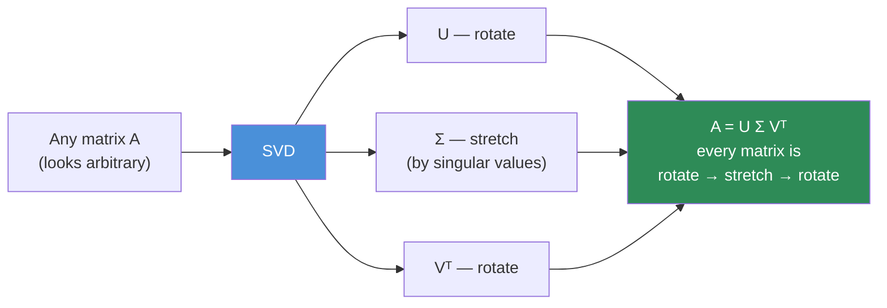
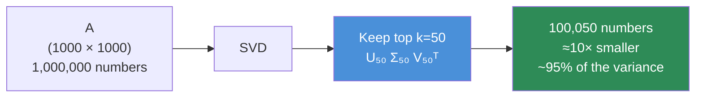
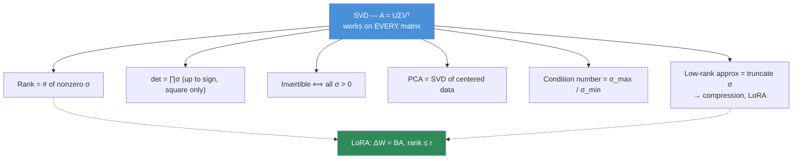
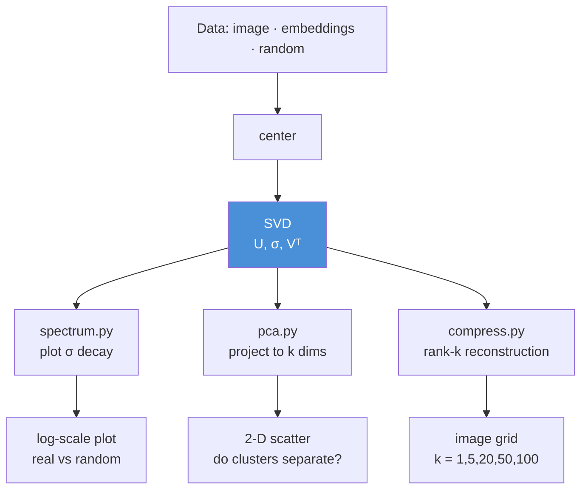

# 06.3 · Linear Algebra II — Structure & Decomposition

[⬅ 06.2 Vectors & Matrices](06.2-linear-algebra-vectors-matrices.md) · [🏠 Module 06](../README.md) · [➡ 06.4 Calculus](06.4-calculus.md)

> **The lesson in one line:** Every matrix, no matter how ugly, is secretly *rotate → stretch → rotate* — and once you can see that, PCA, embeddings, LoRA, and compression all turn out to be the same trick.

---

## 🎯 Learning objectives

By the end of this lesson you can:

1. Use **transpose** fluently, and explain why $X^\top X$ appears everywhere.
2. Explain what an **inverse** does — and why you should almost never compute one.
3. Define **rank** as "how much real information is in here," and connect it to LoRA.
4. Read a **determinant** as a volume scale factor, and know when it's zero and why that matters.
5. Explain **eigenvectors** as the directions a matrix doesn't rotate, and where they show up in AI.
6. Understand **SVD** as the master decomposition, and use it to implement **PCA**, compress data, and understand **low-rank adaptation**.

---

## 🧠 Mental model

> **A matrix has hidden structure. Decomposition is how you look inside it.**

Lesson [06.2](06.2-linear-algebra-vectors-matrices.md) told you a matrix is a machine that moves points. This lesson asks a sharper question: **what is that machine actually doing?** Is it stretching more in one direction than another? Is it destroying information? Is it *really* a 4096-dimensional transformation, or is it secretly only using 8 dimensions and padding the rest with noise?

The answers — rank, eigenvalues, singular values — are what let you compress models, reduce dimensions, fine-tune cheaply, and understand why embeddings work at all.



---

## 1 · Transpose

### Intuition

Flip the matrix across its diagonal: rows become columns.

$$(A^\top)_{ij} = A_{ji}$$

A `(3, 5)` matrix becomes `(5, 3)`. That's it — the *operation* is trivial. What matters is **why you keep needing it**.

### Why it exists

The dot product $x^\top y$ is defined as (row vector) × (column vector). Transpose is the bookkeeping that makes shapes line up so a matmul means what you want it to mean. In practice you transpose for exactly three reasons:

| Reason | Example | Meaning |
|---|---|---|
| **Make shapes chain** | `X @ W.T` in `nn.Linear` | Weights are stored `(out, in)` |
| **Score everything against everything** | `Q @ K.T` in attention | `(n,d) @ (d,m) → (n,m)` — a full similarity grid |
| **Build a Gram / covariance matrix** | `X.T @ X` | `(d,n) @ (n,d) → (d,d)` — feature-vs-feature relationships |

That third one deserves a moment.

> [!IMPORTANT]
> **$X^\top X$ is one of the most important expressions in ML.** If `X` is `(n_samples, n_features)`, then `X.T @ X` is `(n_features, n_features)` and entry `(i,j)` is the dot product of feature *i* with feature *j* — i.e. **how much features i and j move together**. Divide by *n* and you have the **covariance matrix** ([06.6](06.6-statistics.md)). It's the heart of PCA, linear regression's normal equations, and the Gram matrices in style transfer. When you see $X^\top X$, read it as *"how the features relate to each other."*

### Useful identities

$$(A^\top)^\top = A \qquad (A+B)^\top = A^\top + B^\top \qquad \boxed{(AB)^\top = B^\top A^\top}$$

**The order reverses.** This is not a curiosity — it shows up constantly in backpropagation derivations ([06.10](06.10-neural-network-math.md)), and getting it backwards is a classic bug.

### NumPy implementation

```python
import numpy as np

A = np.arange(6).reshape(2, 3)      # (2, 3)
print(A.T.shape)                    # (3, 2)

# ── Transpose is a VIEW, not a copy — it's free ───────────────────
print(A.T.base is A)                # True  → no data was moved
print(A.flags['C_CONTIGUOUS'], A.T.flags['C_CONTIGUOUS'])   # True False

# ── The three reasons, in code ────────────────────────────────────
X = np.random.randn(1000, 20).astype(np.float32)   # 1000 samples, 20 features
W = np.random.randn(64, 20).astype(np.float32)     # PyTorch-style (out, in)

h    = X @ W.T          # (1000, 64)   ← reason 1: a linear layer
gram = X.T @ X          # (20, 20)     ← reason 3: feature covariance (unscaled)

Q = np.random.randn(8, 64).astype(np.float32)      # 8 queries
K = np.random.randn(12, 64).astype(np.float32)     # 12 keys
scores = Q @ K.T        # (8, 12)      ← reason 2: every query vs every key
```

### Performance considerations

`A.T` is **free** — NumPy just swaps the strides and returns a view; no memory is touched. But the *consequences* aren't free: a transposed array is no longer C-contiguous, so an operation that walks it may thrash the cache, and BLAS may insert a hidden copy. If a transpose sits in your hottest loop and profiling implicates it, `np.ascontiguousarray()` makes the copy explicit and lets it be reused.

---

## 2 · Matrix Inverse

### Intuition

$A^{-1}$ **undoes** what $A$ does. If $A$ rotates space 30° and doubles it, $A^{-1}$ halves it and rotates back 30°.

$$A A^{-1} = A^{-1} A = I$$

where $I$ is the identity — the matrix that does nothing.

### Geometry — and when it's impossible

Some transformations **cannot be undone**, because they destroy information. Recall the singular matrix from [06.2](06.2-linear-algebra-vectors-matrices.md) that flattened the plane onto a line: once two different points have been mapped to the same output point, no function can send them back to where they came from.

$$\begin{bmatrix} 1 & 2 \\ 2 & 4 \end{bmatrix} \quad \text{— column 2 is just } 2\times \text{column 1. Space collapses. No inverse.}$$

**A matrix is invertible ⟺ it doesn't collapse space ⟺ determinant ≠ 0 ⟺ full rank.** Four ways of saying the identical thing, which is why those concepts always appear together.

### Why AI Engineers should care — mostly as a warning

The classic linear-regression solution ("normal equations") is:

$$\hat{\beta} = (X^\top X)^{-1} X^\top y$$

You will see this in every statistics textbook. **And you should almost never implement it that way.**

> [!WARNING]
> **Never compute an explicit inverse to solve a linear system.** `np.linalg.inv(A) @ b` is slower *and* numerically worse than `np.linalg.solve(A, b)`. The inverse amplifies floating-point error, especially when the matrix is **ill-conditioned** (nearly singular) — and real feature matrices, full of correlated columns, are ill-conditioned all the time. `solve` uses LU decomposition and never forms the inverse.

```python
import numpy as np

A = np.array([[3., 1.],
              [1., 2.]])
b = np.array([9., 8.])

x_bad  = np.linalg.inv(A) @ b     # ❌ works, but slower & less stable
x_good = np.linalg.solve(A, b)    # ✅ always do this
print(x_bad, x_good)              # [2. 3.] [2. 3.]

# ── An ill-conditioned matrix: near-collapse, huge error amplification ──
M = np.array([[1., 1.],
              [1., 1.0000001]])
print(f"condition number: {np.linalg.cond(M):.2e}")   # ~4e+07 → dangerous
```

The **condition number** tells you how much the matrix amplifies input error. A condition number of $10^7$ in float32 (≈7 decimal digits of precision) means **you can lose all your accuracy**. This is the concrete link between linear algebra and the numerical stability problems in [06.9](06.9-numerical-computing.md).

### Where inverses actually appear in AI

| Where | Note |
|---|---|
| Closed-form linear regression | Textbooks only; production uses `solve`, QR, or gradient descent |
| Newton's method / second-order optimization | Needs the **inverse Hessian** — usually too expensive, hence approximations like L-BFGS ([06.7](06.7-optimization.md)) |
| Gaussian / multivariate normal density | Requires $\Sigma^{-1}$ (the *precision* matrix) |
| Kalman filters, Gaussian processes | Inverses everywhere — and the main source of their O(n³) cost |
| **Deep learning** | **Essentially never.** Gradient descent avoids inversion entirely — that's a large part of why it scales |

> [!NOTE]
> **Why deep learning skips inverses:** inverting a matrix is O(n³) and numerically fragile. Gradient descent replaces "solve exactly, once" with "improve a little, many times" — O(n²) per step, robust, and parallelizable. Scaling to billions of parameters is only possible because we gave up on exact solutions. That trade is one of the defining engineering decisions in modern AI.

---

## 3 · Rank

### Intuition

**Rank = the number of dimensions the matrix's output actually uses.** It's a measure of *how much genuine information* the matrix contains, as opposed to how big it looks.

Formally: the number of linearly independent rows (equivalently, columns).

$$\begin{bmatrix} 1 & 2 \\ 2 & 4 \end{bmatrix} \text{ has rank } \mathbf{1} \text{— row 2 is just } 2 \times \text{row 1. It's a 2×2 matrix pretending to be 2-D.}$$

### Geometry

| Rank of a 3×3 matrix | What it does to 3-D space |
|---|---|
| 3 (**full rank**) | Maps 3-D space onto 3-D space — invertible, nothing lost |
| 2 | **Flattens space onto a plane** — information destroyed |
| 1 | Collapses space onto a **line** |
| 0 | Everything → the origin (the zero matrix) |

> 🖼️ **[IMAGE PLACEHOLDER: `assets/images/06-rank-collapse.png`]**
> *Four 3-D panels showing a cube of points transformed by matrices of rank 3, 2, 1, and 0. Rank 3: a sheared cube (volume preserved-ish). Rank 2: the cube squashed flat into a tilted plane (a pancake). Rank 1: everything collapsed onto a single line. Rank 0: all points at the origin. Below, an annotation: "rank = the dimension of the output space. Each drop in rank destroys a dimension of information — permanently."*

### Why AI Engineers should care — this is the LoRA lesson

**Real-world matrices are almost never as high-rank as their shape suggests.** A `(1000, 1000)` user–movie ratings matrix might have effective rank ~20, because tastes are driven by a small number of underlying factors (genre preference, era, pacing). The other 980 dimensions are noise.

This is the **low-rank hypothesis**, and it is the single most commercially important idea in this lesson:

| Application | The low-rank insight |
|---|---|
| **LoRA fine-tuning** | The *update* to a weight matrix during fine-tuning is low-rank. So instead of training $\Delta W$ `(4096×4096)` = 16.7M params, train $B$ `(4096×8)` and $A$ `(8×4096)` = 65k params. **256× fewer.** Same effect. |
| **PCA / dimensionality reduction** | Keep the top-k directions; discard the rest as noise |
| **Recommender systems** | Matrix factorization = "assume the ratings matrix is low-rank" |
| **Model compression** | Approximate big weight matrices with low-rank products |
| **Embeddings themselves** | A 50k-word vocabulary compressed into 768 dims — a low-rank bet that meaning has few real degrees of freedom |

> [!IMPORTANT]
> **LoRA in one line of linear algebra:** $W_{\text{new}} = W + BA$, where $B$ is `(d, r)`, $A$ is `(r, d)`, and $r \ll d$ (typically 8–64). $BA$ is a `(d,d)` matrix of **rank at most r**. You are asserting that everything fine-tuning needs to change lives in an *r*-dimensional subspace — and empirically, it does. That's why you can fine-tune a 7B model on one consumer GPU. **Understand rank and you understand LoRA.** ([Module 15](../../15-Fine-Tuning/README.md))

### NumPy implementation

```python
import numpy as np

full  = np.array([[1., 2.], [3., 4.]])
rank1 = np.array([[1., 2.], [2., 4.]])          # row2 = 2 × row1

print(np.linalg.matrix_rank(full))              # 2  ← full rank
print(np.linalg.matrix_rank(rank1))             # 1  ← degenerate

# ── LoRA, in five lines ───────────────────────────────────────────
d, r = 4096, 8
W = np.random.randn(d, d).astype(np.float32)    # 16,777,216 frozen params
B = np.zeros((d, r), dtype=np.float32)          # init to zero → ΔW starts at 0
A = np.random.randn(r, d).astype(np.float32) * 0.01

W_adapted = W + B @ A                           # (d,d), but ΔW has rank ≤ 8
print(f"full params:  {W.size:>12,}")           # 16,777,216
print(f"LoRA params:  {B.size + A.size:>12,}")  #     65,536
print(f"reduction:    {W.size / (B.size+A.size):.0f}×")   # 256×
print(f"rank of ΔW:   {np.linalg.matrix_rank(B @ A)}")    # 0 at init, ≤8 after training
```

> [!TIP]
> **Why is `B` initialized to zeros?** So that $BA = 0$ at step 0, meaning the adapted model **starts out identical to the base model** and fine-tuning perturbs it gently from there. If both were random, you'd inject noise into a working model before training even began. A tiny detail with an entirely mathematical justification — the kind of thing you can only *understand*, never memorize.

### Performance considerations

`matrix_rank` is computed via SVD — **O(min(m,n)² · max(m,n))**, i.e. genuinely expensive for large matrices. It also uses a **numerical tolerance** (singular values below a threshold count as zero), because in floating-point arithmetic nothing is ever exactly rank-deficient. Real matrices don't have a rank; they have a *spectrum*, and the "rank" is where you decide to draw the line.

---

## 4 · Determinant

### Intuition

**The determinant is the factor by which a matrix scales volume.**

- $\det(A) = 3$ → shapes come out 3× bigger.
- $\det(A) = 1$ → volume preserved (a pure rotation).
- $\det(A) = -2$ → 2× bigger **and flipped** (orientation reversed, like a mirror).
- $\det(A) = 0$ → **volume destroyed.** Space collapsed to a lower dimension. **Not invertible.**

That last bullet is the one that matters, and it ties the whole lesson together:

$$\boxed{\det(A) = 0 \iff \text{not full rank} \iff \text{not invertible} \iff \text{information destroyed}}$$

### Geometry

For a 2×2 matrix, $|\det(A)|$ is exactly the **area of the parallelogram** that the unit square becomes.

$$\det\begin{bmatrix} a & b \\ c & d \end{bmatrix} = ad - bc$$

> 🖼️ **[IMAGE PLACEHOLDER: `assets/images/06-determinant-area.png`]**
> *Three panels. Left: the unit square (area 1) with î, ĵ. Middle: after applying [[3,1],[0,2]], a parallelogram with its area shaded and labelled "det = 6 → area ×6." Right: after applying the singular [[1,2],[2,4]], the square has collapsed to a line segment with zero area, labelled "det = 0 → volume destroyed, no inverse." Caption: "The determinant is a volume scale factor. Zero means a dimension died."*

### Where it appears in AI

Honestly? **Rarely, and mostly in one place.** But that place is worth knowing:

| Where | Why |
|---|---|
| **Normalizing flows** (generative models) | The change-of-variables formula requires $\log\lvert\det J\rvert$ — the entire architecture of RealNVP/Glow is designed to make that determinant *cheap* to compute (triangular Jacobians) |
| Multivariate Gaussian density | The normalizing constant contains $\det(\Sigma)$ |
| Checking invertibility | Though `np.linalg.cond` is the better tool in practice |
| Understanding *why* singular matrices break things | The conceptual payoff — this is the real reason it's here |

```python
import numpy as np

print(np.linalg.det(np.array([[3., 1.], [0., 2.]])))   # 6.0  → area ×6
print(np.linalg.det(np.array([[1., 2.], [2., 4.]])))   # 0.0  → collapsed

# ⚠️ In practice, use log-determinant: dets underflow/overflow catastrophically
sign, logdet = np.linalg.slogdet(np.random.randn(200, 200))
print(sign, logdet)     # a det of e^500 would be inf; logdet is fine
```

> [!WARNING]
> **A determinant is a product of n numbers, so it explodes or vanishes exponentially with size.** For a 200×200 matrix, `det` routinely returns `0.0` or `inf` — not because the matrix is singular, but because floats ran out of room. Always use `slogdet` (which returns the sign and the *log* of the magnitude) when n is large. This is a pure [06.9](06.9-numerical-computing.md) lesson hiding in a linear algebra topic.

---

## 5 · Eigenvalues & Eigenvectors

### Intuition

Most vectors get **rotated** when a matrix hits them. A few special ones don't — they just get **stretched**, staying on their own line.

$$A\mathbf{v} = \lambda \mathbf{v}$$

- $\mathbf{v}$ is an **eigenvector**: a direction the matrix doesn't rotate.
- $\lambda$ is its **eigenvalue**: how much it gets stretched along that direction.

**Eigenvectors are the matrix's "natural axes."** They tell you what the transformation *fundamentally does*, stripped of the coordinate system you happened to write it in. A shear looks complicated in standard coordinates; in its eigenbasis, it's just "stretch by these amounts along these axes."

> 🖼️ **[IMAGE PLACEHOLDER: `assets/images/06-eigenvectors.png`]**
> *A 2-D plane with a dozen faint grey arrows from the origin, each shown before (dashed) and after (solid) applying a matrix — most visibly rotate. Two arrows are highlighted (red and blue): they point in exactly the same direction before and after, only longer/shorter, annotated "λ₁ = 3" and "λ₂ = 0.5." Caption: "Eigenvectors are the directions the matrix does not rotate — the axes the transformation is 'really' built from."*

### Geometry

| Eigenvalue | What happens along that eigenvector |
|---|---|
| $\lambda > 1$ | Stretched |
| $\lambda = 1$ | Unchanged |
| $0 < \lambda < 1$ | Squashed toward the origin |
| $\lambda = 0$ | **Collapsed to zero** — this direction is annihilated (matrix is singular) |
| $\lambda < 0$ | Flipped *and* scaled |
| Complex $\lambda$ | Rotation (no real direction is preserved) |

### Why AI Engineers should care

| Where | The role of eigen-analysis |
|---|---|
| **PCA** | The principal components **are** the eigenvectors of the covariance matrix; the eigenvalues are how much variance each explains |
| **Optimization landscape** | Eigenvalues of the **Hessian** describe the curvature. A huge ratio λ_max/λ_min = an ill-conditioned, "ravine-shaped" loss surface — the exact problem that momentum and Adam fix ([06.7](06.7-optimization.md)) |
| **Vanishing/exploding gradients** | Repeated multiplication by a matrix with λ > 1 explodes; λ < 1 vanishes. This is *the* mathematical reason deep RNNs failed and residual connections work |
| **Spectral norm & stability** | The largest singular value bounds how much a layer can amplify its input; it's why spectral normalization stabilizes GANs |
| **PageRank, graph ML** | The stationary distribution is the dominant eigenvector of the transition matrix |

> [!IMPORTANT]
> **The vanishing-gradient story in one equation.** Backprop through *n* layers multiplies by a Jacobian *n* times: $J^n$. Diagonalize it and you get $J^n = V\Lambda^n V^{-1}$ — the eigenvalues get raised to the *n*-th power. If $\lambda = 0.9$ and $n = 50$, then $0.9^{50} \approx 0.005$: **the gradient has essentially vanished.** If $\lambda = 1.1$, then $1.1^{50} \approx 117$: **it explodes.** Only $\lambda \approx 1$ survives depth. Residual connections (`x + f(x)`) work because they add an identity — pushing eigenvalues toward 1 — which is why they made 100-layer networks trainable. *This is eigenvalues doing real work in production.* ([06.10](06.10-neural-network-math.md))

### NumPy implementation

```python
import numpy as np

A = np.array([[2., 1.],
              [1., 2.]])

vals, vecs = np.linalg.eig(A)
print("eigenvalues :", vals)          # [3. 1.]
print("eigenvectors:\n", vecs)        # columns! [0.707, 0.707] and [-0.707, 0.707]

# Verify the defining equation A v = λ v
v0, l0 = vecs[:, 0], vals[0]
assert np.allclose(A @ v0, l0 * v0)   # ✓  the direction is unchanged

# ── The vanishing/exploding gradient demo ─────────────────────────
J = np.array([[0.9, 0.0],
              [0.0, 1.1]])
for n in (1, 10, 50, 100):
    print(f"n={n:3}  J^n diag = {np.diag(np.linalg.matrix_power(J, n))}")
# n=100 → [2.65e-05, 1.38e+04]   ← one direction vanished, the other exploded
```

> [!TIP]
> **Eigenvectors are the *columns* of `vecs`, not the rows.** `vecs[:, i]` pairs with `vals[i]`. Getting this backwards is a rite of passage — and NumPy won't warn you, because the wrong slice is still a valid vector. Also: use `np.linalg.eigh` for **symmetric** matrices (covariance, Gram, Hessian). It's faster, and it guarantees real eigenvalues sorted ascending. Almost every matrix you eigendecompose in ML is symmetric.

---

## 6 · Singular Value Decomposition (SVD)

**The most useful decomposition in applied mathematics.** If you learn one thing from this lesson, learn this.

### Intuition

**Every matrix — any shape, any rank, invertible or not — can be written as: rotate, then stretch, then rotate.**

$$A = U \Sigma V^\top$$

| Factor | Shape | What it does |
|---|---|---|
| $V^\top$ | `(k, n)` | **Rotate** (an orthonormal basis for the input space) |
| $\Sigma$ | `(k, k)` diagonal | **Stretch** along each axis by a **singular value** $\sigma_i \geq 0$ |
| $U$ | `(m, k)` | **Rotate** into the output space |

The singular values $\sigma_1 \geq \sigma_2 \geq \dots \geq 0$ are sorted, and they tell you **how important each direction is.** That sorting is the source of all of SVD's power.

Eigendecomposition only works for square (and well-behaved) matrices. **SVD works for absolutely everything.** That's why it's the master tool.

### Geometry

SVD says: *any* linear transformation, however complicated it looks, is just a rotation, an axis-aligned stretch, and another rotation. A matrix that seems to be doing something intricate is really doing something simple in the right coordinate system — SVD finds that coordinate system.

> 🖼️ **[IMAGE PLACEHOLDER: `assets/images/06-svd-geometry.png`]**
> *A left-to-right sequence of four panels showing a unit circle of points (with a few coloured markers) being transformed: (1) the circle, (2) after Vᵀ — the circle rotated (still a circle, markers moved), (3) after Σ — stretched into an axis-aligned ellipse with semi-axes labelled σ₁ and σ₂, (4) after U — the ellipse rotated into its final orientation. Above the whole strip: "A = U Σ Vᵀ." Caption: "Every matrix maps the unit circle to an ellipse. The singular values are the ellipse's semi-axis lengths."*

### The killer property — low-rank approximation

Because the singular values are sorted by importance, you can **truncate**:

$$A \approx A_k = U_k \Sigma_k V_k^\top \quad \text{(keep only the top } k \text{ singular values)}$$

The **Eckart–Young theorem** says this is not merely *a* good approximation — it is **the provably best possible rank-k approximation** of $A$. No other rank-k matrix gets closer.

**That one theorem is the mathematical foundation of PCA, data compression, recommender systems, topic modelling (LSA), model compression, and the intuition behind LoRA.** They are all "throw away the small singular values."



### NumPy implementation

```python
import numpy as np

A = np.random.randn(100, 50).astype(np.float32)

U, s, Vt = np.linalg.svd(A, full_matrices=False)
print(U.shape, s.shape, Vt.shape)        # (100, 50) (50,) (50, 50)
print("singular values sorted?", np.all(np.diff(s) <= 0))    # True

# Reconstruct exactly
A_rebuilt = U @ np.diag(s) @ Vt
assert np.allclose(A, A_rebuilt, atol=1e-4)

# ── Rank-k truncation: the best possible rank-k approximation ─────
def low_rank(A, k):
    U, s, Vt = np.linalg.svd(A, full_matrices=False)
    return U[:, :k] @ np.diag(s[:k]) @ Vt[:k, :]

for k in (1, 5, 10, 25, 50):
    err = np.linalg.norm(A - low_rank(A, k)) / np.linalg.norm(A)
    kept = (s[:k]**2).sum() / (s**2).sum()
    print(f"k={k:3}  relative error {err:5.2%}   variance retained {kept:6.2%}")
```

### PCA — SVD's most famous application

**PCA is: center the data, take the SVD, keep the top components.** Nothing more.

```python
import numpy as np

def pca(X, k):
    """X: (n_samples, n_features). Returns projected data and explained variance."""
    X_centered = X - X.mean(axis=0)                 # ① center — this step is NOT optional
    U, s, Vt = np.linalg.svd(X_centered, full_matrices=False)
    components = Vt[:k]                             # ② top-k directions: (k, n_features)
    projected  = X_centered @ components.T          # ③ project: (n_samples, k)
    explained  = (s[:k]**2) / (s**2).sum()
    return projected, components, explained

# 768-d embeddings → 2-D, so you can actually plot them
emb = np.random.randn(500, 768).astype(np.float32)
emb[:250] += 3.0                                    # two clusters, planted
proj, comps, expl = pca(emb, k=2)

print(proj.shape)                                   # (500, 2)  ← plottable!
print(f"variance explained: {expl.sum():.1%}")
# plt.scatter(proj[:, 0], proj[:, 1])  → the two clusters separate visibly
```

> [!IMPORTANT]
> **Centering is step ① for a reason.** PCA finds directions of maximum *variance*, and variance is measured around the mean. Skip the centering and the first "principal component" simply points at your data's mean — a direction that carries no information about how the data *varies*. It's the most common PCA bug, it fails silently, and it produces plots that look almost right. (Note: `sklearn.decomposition.PCA` centers for you; your own implementation must not forget.)

**Why the SVD of the centered data gives you PCA:** the principal components are the eigenvectors of the covariance matrix $\frac{1}{n}X^\top X$, and the right singular vectors of $X$ *are* exactly those eigenvectors — with $\sigma_i^2/n = \lambda_i$. SVD gets you there without ever forming the covariance matrix, which is both faster and numerically far safer. (Forming $X^\top X$ squares the condition number — a real hazard from [06.9](06.9-numerical-computing.md).)

### AI applications of SVD

| Application | How SVD is used |
|---|---|
| **PCA / dimensionality reduction** | Top-k singular vectors of centered data |
| **Embedding visualization** | 768-d → 2-D for scatter plots (though t-SNE/UMAP are better for *visual* clustering) |
| **Latent Semantic Analysis** | SVD of the term–document matrix — the 1990s ancestor of embeddings |
| **Recommender systems** | Matrix factorization of the ratings matrix (the Netflix Prize) |
| **Model compression** | Replace a `(4096,4096)` weight with a rank-k factorization |
| **LoRA** | The *justification*: fine-tuning updates are empirically low-rank, so parameterize them that way from the start |
| **Whitening / preconditioning** | Decorrelate features before training |
| **Noise reduction** | Small singular values are usually noise — drop them |
| **Pseudo-inverse** | $A^+ = V\Sigma^+U^\top$ — the "best possible" inverse for non-invertible matrices, and how least-squares is really solved |

### Performance considerations

- **Full SVD is O(min(m,n)² · max(m,n))** — expensive. For a `(1M, 768)` embedding matrix, don't.
- **Use truncated/randomized SVD** when you only want the top-k: `sklearn.utils.extmath.randomized_svd` or `scipy.sparse.linalg.svds`. Orders of magnitude faster, and you were going to throw the rest away anyway.
- **Never form $X^\top X$ to do PCA.** It squares the condition number, doubling your loss of precision. Take the SVD of $X$ directly.
- SVD is **not** the tool for exploratory visualization of embeddings — it's linear, so it can't unfold curved manifolds. Use UMAP or t-SNE for that, and SVD when you want *linear* structure, provable optimality, or a compression guarantee.

---

## 🔗 How it all connects

These six concepts are not six ideas. They're **one idea seen from six angles**:

| Statement | Equivalent to |
|---|---|
| $\det(A) = 0$ | Not invertible |
| Not full rank | Not invertible |
| Has a zero eigenvalue | Not invertible |
| Has a zero singular value | Not invertible |
| Collapses space to a lower dimension | Not invertible |
| Some direction is annihilated | Not invertible |

**All six sentences describe the same picture: the plane got squashed onto a line, and you can't un-squash it.** If you hold that one image, you hold this entire lesson.



**SVD sits underneath everything else in this lesson.** Rank, determinant, invertibility, conditioning, PCA, and compression are all readings of the singular values.

---

## 🐛 Common mistakes

| Mistake | Why it hurts | Fix |
|---|---|---|
| `inv(A) @ b` instead of `solve(A, b)` | Slower, numerically worse, error-amplifying | `np.linalg.solve` |
| Forgetting to center before PCA | First component points at the mean; results are silently wrong | `X - X.mean(axis=0)` |
| Taking eigenvectors as **rows** of `np.linalg.eig` output | Wrong vectors, no error raised | They're **columns**: `vecs[:, i]` |
| Using `eig` on a symmetric matrix | Slower; may return tiny imaginary parts | Use `eigh` |
| `det()` on a large matrix | Overflows to `inf` or underflows to `0` | `slogdet()` |
| Computing full SVD when you need 10 components | Wildly wasteful | `randomized_svd` / `svds` |
| Forming $X^\top X$ for PCA | Squares the condition number | SVD of `X` directly |
| Thinking rank is a crisp integer for real data | Floating-point noise means nothing is exactly zero | Look at the **spectrum**; choose a threshold consciously |
| Ignoring the condition number | Silent catastrophic precision loss in float32 | `np.linalg.cond` before trusting a solve |

---

## 📝 Exercises

**Conceptual**
1. State six equivalent ways to say "this matrix is not invertible." Explain why they're the same statement.
2. Why does deep learning avoid matrix inversion almost entirely? What did we trade away, and what did we gain?
3. Explain LoRA to a colleague using only the word "rank" and one equation.
4. Why must PCA center the data first? What exactly does the first component become if you forget?

**Intuition**
5. A matrix has eigenvalues `[1.05, 0.98, 0.3]`. You apply it 100 times. Describe the result qualitatively. Now connect this to why deep RNNs failed to train.
6. Your embedding matrix's singular values are `[50, 45, 40, 2, 1.8, 1.5, ...]`. What does this tell you about the data, and what would you do with it?
7. Why is SVD more broadly useful than eigendecomposition?

**NumPy**
8. Implement `pca(X, k)` from scratch with SVD. Compare against `sklearn.decomposition.PCA` — they should match up to sign flips (**and explain why the signs can flip**).
9. Take a grayscale image as a matrix. Reconstruct it with k = 1, 5, 20, 50, 100 singular values. Plot the results and the compression ratio. (This is the single most memorable SVD demo there is.)
10. Build the LoRA snippet: compute `W + B@A` and verify `matrix_rank(B @ A) <= r`. Then count parameters and confirm the reduction factor.
11. Compute `np.linalg.cond` for a well-conditioned and an ill-conditioned matrix. Solve `Ax = b` with both `inv()@b` and `solve()`, perturb `b` by 1e-6, and measure how much the answer changes in each case.

**Visualization**
12. Plot the singular-value spectrum (log scale) of a random matrix vs. a real dataset (e.g., MNIST, or 1000 sentence embeddings). The real data's spectrum will decay sharply — **that decay is why compression works.** Explain the difference.
13. Animate SVD: show the unit circle → after Vᵀ → after Σ → after U. Confirm you get an ellipse.

**Equation interpretation**
14. Read $\hat{\beta} = (X^\top X)^{-1}X^\top y$. Identify every shape. Explain why a practitioner would refuse to implement it literally, and what they'd do instead.

---

## 🛠️ Mini project — *PCA & Compression Lab*

Build `code/06-mathematics/pca-lab/`.

```
pca-lab/
├── README.md
├── src/
│   ├── pca.py                # from-scratch PCA via SVD
│   ├── compress.py           # rank-k image compression
│   ├── lora_demo.py          # low-rank weight adaptation, parameter counting
│   └── spectrum.py           # plot singular-value spectra
├── data/
│   └── embeddings.npy        # 1000 real sentence embeddings (generate once)
├── tests/
│   └── test_pca.py           # vs sklearn, up to sign
└── notebooks/
    └── report.ipynb
```

**Architecture**



**Implementation guidance**
1. **`pca.py` — no sklearn.** Center, SVD, truncate, project. Return explained-variance ratios. Test against sklearn (allowing sign flips — eigenvectors are only defined up to sign).
2. **`compress.py` — the image demo.** Load a photo, take its SVD, reconstruct at increasing k, and plot reconstruction quality against storage cost. Seeing a recognizable face emerge at k=20 out of 512 is the moment SVD becomes real.
3. **`spectrum.py` — the punchline.** Plot singular values (log y-axis) for random data vs. real embeddings. Random data has a flat spectrum; real data decays fast. **That decay is the entire reason dimensionality reduction, compression, and LoRA all work.** Make this plot; frame it; remember it.
4. **`lora_demo.py`** — build `W + BA`, count parameters, verify the rank bound, and show that with `B = 0` the adapted model is initially identical to the base.

**Deliverable:** a `report.ipynb` that answers one question with evidence — *"how much of this data is real, and how much is noise?"*

---

## 📄 Cheat sheet

| Concept | Formula | NumPy | Meaning |
|---|---|---|---|
| Transpose | $(A^\top)_{ij} = A_{ji}$ | `A.T` | flip; free (a view) |
| Gram / covariance | $X^\top X$ | `X.T @ X` | how features relate |
| Inverse | $AA^{-1} = I$ | `np.linalg.inv` ⚠️ | undo — **prefer `solve`** |
| Solve | $Ax = b$ | `np.linalg.solve(A,b)` | ✅ the right way |
| Rank | # independent rows | `np.linalg.matrix_rank` | real information content |
| Determinant | $ad - bc$ (2×2) | `np.linalg.slogdet` | volume scale factor |
| Eigen | $Av = \lambda v$ | `np.linalg.eigh` (symmetric) | unrotated directions |
| SVD | $A = U\Sigma V^\top$ | `np.linalg.svd` | rotate → stretch → rotate |
| Condition number | $\sigma_\max / \sigma_\min$ | `np.linalg.cond` | error amplification |
| PCA | SVD of centered X | — | top-k variance directions |
| LoRA | $W + BA$, rank $\le r$ | — | fine-tune 256× fewer params |
| **The big equivalence** | det=0 ⟺ rank-deficient ⟺ λ=0 ⟺ σ=0 ⟺ singular | — | **space collapsed** |

---

## 🎴 Flashcards

- **Q:** What does the determinant mean geometrically? → **A:** The factor by which the matrix scales volume. Zero means space was collapsed to a lower dimension (not invertible).
- **Q:** What is an eigenvector? → **A:** A direction the matrix doesn't rotate — it only scales it, by the eigenvalue: `Av = λv`.
- **Q:** Why do gradients vanish or explode in deep networks? → **A:** Backprop multiplies by a Jacobian n times, raising its eigenvalues to the n-th power. λ<1 vanishes, λ>1 explodes; only λ≈1 survives depth — which is why residual connections help.
- **Q:** State the SVD in words. → **A:** Every matrix is rotate (Vᵀ) → stretch by singular values (Σ) → rotate (U).
- **Q:** What does Eckart–Young guarantee? → **A:** Truncating the SVD to the top-k singular values gives the *provably best* rank-k approximation of the matrix.
- **Q:** What is PCA, in one sentence? → **A:** Center the data, take the SVD, keep the top-k right singular vectors as the new axes.
- **Q:** Why does LoRA work? → **A:** The fine-tuning update ΔW is empirically low-rank, so it can be parameterized as `BA` with rank r≪d — hundreds of times fewer trainable parameters.
- **Q:** Why never compute an explicit matrix inverse? → **A:** It's slower and numerically unstable (amplifies error, especially when ill-conditioned). Use `solve`.
- **Q:** Six equivalent ways to say "singular"? → **A:** det = 0, rank-deficient, has a zero eigenvalue, has a zero singular value, not invertible, collapses space.
- **Q:** What does a fast-decaying singular-value spectrum tell you? → **A:** The data has low intrinsic dimensionality — most of it is redundant or noise, so compression/PCA/low-rank methods will work well.

---

## 💼 Interview questions

1. **"Explain PCA and when you'd use it."** — Center → SVD → keep top-k. Use for dimensionality reduction, decorrelation, denoising, visualization. Mention it's *linear*, so it can't unfold curved manifolds — reach for UMAP/t-SNE there.
2. **"What is LoRA and why does it work?"** — $W + BA$ with rank $r \ll d$. It works because fine-tuning updates empirically live in a low-dimensional subspace. Cite the parameter reduction and the `B=0` initialization.
3. **"Your training loss is NaN after 500 steps. Could linear algebra explain it?"** — Yes: exploding gradients from Jacobian eigenvalues > 1 compounding across layers. Fix with gradient clipping, better init, residual connections, layer norm.
4. **"When is a matrix not invertible, and why should I care?"** — det = 0 / rank-deficient / a zero singular value: information was destroyed. In ML it means perfectly collinear features, and it's why regularization ($X^\top X + \lambda I$) exists — it *forces* invertibility.
5. **"Why is SVD preferred over eigendecomposition?"** — It exists for every matrix (any shape, any rank); eigendecomposition needs square and well-behaved. And singular values are real, non-negative, and sorted.
6. **"How would you compress a model's weight matrices?"** — SVD each weight, truncate to rank k, store U_k, σ_k, V_k. Trade accuracy for size; measure the singular-value spectrum first to see whether it's even worth it.

---

## 📚 Summary

- **Transpose** flips a matrix (free — it's a view). $X^\top X$ means *"how features relate to each other"* and is everywhere in ML.
- **Inverse** undoes a transformation — but **never compute it**: use `solve`. Deep learning avoids inversion entirely, trading exact solutions for cheap iterative ones. That trade is why it scales.
- **Rank** is how many dimensions a matrix actually uses. Real matrices are usually **low-rank**, and that fact powers PCA, recommenders, compression, and **LoRA**.
- **Determinant** is a volume scale factor; zero means space collapsed. Use `slogdet` to avoid overflow.
- **Eigenvectors** are the directions a matrix doesn't rotate. Their eigenvalues, raised to the *n*-th power, explain **vanishing and exploding gradients** — and therefore why residual connections exist.
- **SVD** decomposes *any* matrix into rotate → stretch → rotate. Truncating it gives the **provably optimal** low-rank approximation (Eckart–Young), which is the foundation of PCA, compression, LSA, and the intuition behind LoRA.
- Singular / det=0 / rank-deficient / zero eigenvalue / zero singular value / non-invertible are **six names for one picture**: space got squashed.

**Next:** [06.4 Calculus & Gradients](06.4-calculus.md) — where matrices stop being static and start *learning*.

---

## 🔗 References

- 3Blue1Brown — *Essence of Linear Algebra*, episodes 5–7 (determinant, inverse/rank) and 13–14 (eigenvectors). The visual intuition in this lesson is theirs.
- Strang — *Linear Algebra and Its Applications* / MIT 18.06 lectures. Strang on SVD is a career highlight; watch Lecture 29.
- Hu et al. (2021) — *LoRA: Low-Rank Adaptation of Large Language Models*. **You can now read this paper.** Its core claim is one equation you've just implemented.
- Deisenroth et al. — *Mathematics for Machine Learning*, Ch. 4 (Matrix Decompositions).
- Trefethen & Bau — *Numerical Linear Algebra* — for when conditioning and stability become production problems.
- [15 · Fine-Tuning](../../15-Fine-Tuning/README.md) — where LoRA becomes something you actually run.

---

## 🧭 Navigation

| Direction | Link |
|---|---|
| ⬅ Previous | [06.2 Vectors & Matrices](06.2-linear-algebra-vectors-matrices.md) |
| ➡ Next | [06.4 Calculus & Gradients](06.4-calculus.md) |
| 🏠 Module | [Module 06](../README.md) |
| 🗺 Roadmap | [ROADMAP.md](../../../ROADMAP.md) |
