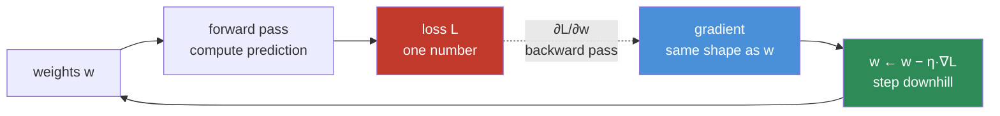
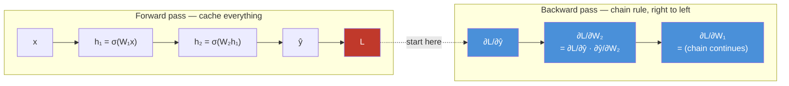
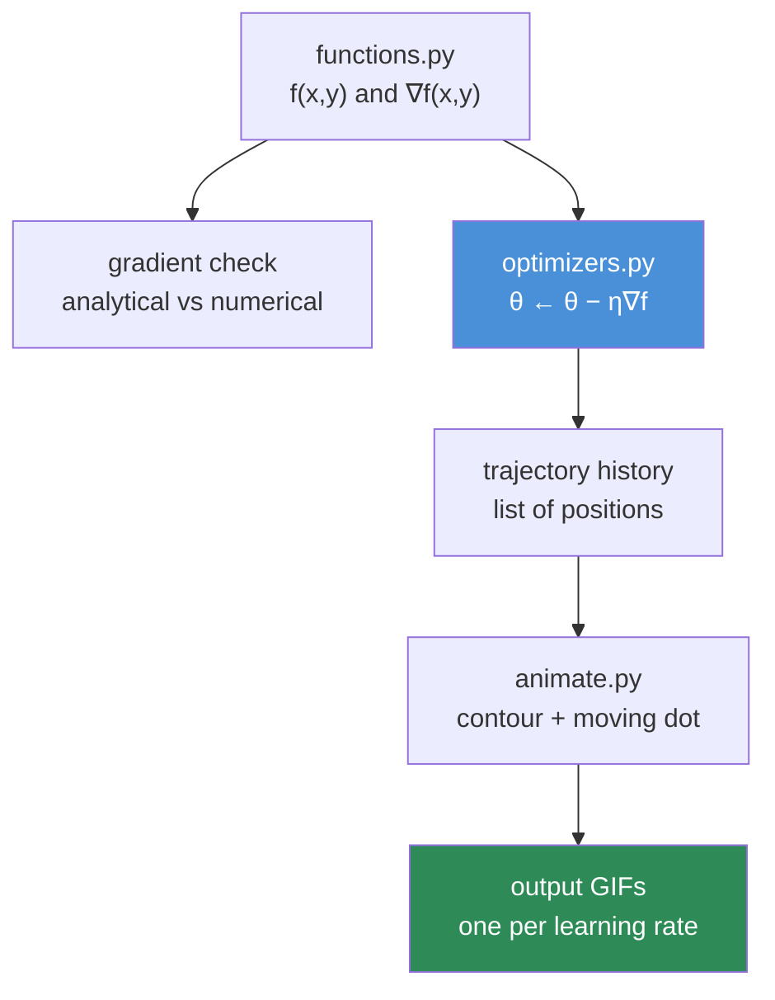

# 06.4 · Calculus & Gradients

[⬅ 06.3 Decomposition](06.3-linear-algebra-decomposition.md) · [🏠 Module 06](../README.md) · [➡ 06.5 Probability](06.5-probability.md)

> **The lesson in one line:** Training a neural network is one idea repeated a trillion times — *"if I nudge this number, does the error go up or down?"* — and that question is what a derivative answers.

---

## 🎯 Learning objectives

By the end of this lesson you can:

1. Explain a **derivative** as sensitivity, not as a limit-of-difference-quotients ritual.
2. Read **partial derivatives** and assemble them into a **gradient**, and say what the gradient points at.
3. Apply the **chain rule** — and recognize that **backpropagation is nothing but the chain rule**, run in reverse.
4. Distinguish **gradient / Jacobian / Hessian** by shape and by what each tells you.
5. Implement gradient descent and a full backward pass in NumPy, **without autograd**.
6. Diagnose vanishing gradients, exploding gradients, and dead neurons *from the calculus*.

---

## 🧠 Mental model

> **A derivative is a sensitivity: "if I change the input a little, how much does the output change?"**

That's the whole of calculus for AI, in one sentence. Everything else is bookkeeping for asking that question about millions of inputs at once.

Consider what training actually is. You have a loss $L$ (a single number: how wrong the model is) and 7 billion weights. For each weight $w_i$, you want to know:

$$\frac{\partial L}{\partial w_i} = \text{"if I increase } w_i \text{ slightly, does the loss go up or down, and by how much?"}$$

Get that number for every weight, take a small step in the *opposite* direction for each, and you've made the model slightly better. Repeat a few hundred thousand times. **That is deep learning.** No part of it is more sophisticated than the sentence you just read.



---

## 1 · Limits — the idea, in ninety seconds

### Intuition

A limit asks: **what value is this expression approaching?** — without necessarily reaching it.

$$\lim_{h \to 0} \frac{f(x+h) - f(x)}{h}$$

That fraction is "rise over run" — the slope of a line through two points on the curve. As $h$ shrinks, the two points slide together, and the line through them becomes the **tangent** at $x$. The limit is what that slope approaches.

### Why should an AI Engineer care?

**Almost never, directly.** You will not compute limits. But limits are why derivatives are *well-defined*, and — much more usefully — the limit *concept* explains two things you will absolutely meet:

| Thing you'll meet | The limit idea behind it |
|---|---|
| **ReLU has no derivative at 0** | The limit from the left (0) ≠ the limit from the right (1). Frameworks just pick one (usually 0) and move on — it works because you land exactly on 0 with probability ~0 |
| **Numerical gradient checking** | Take `h = 1e-5` instead of `h → 0`. This is *the* way to verify your hand-written backprop |

> [!NOTE]
> This is the whole limits section. A university course spends six weeks here; an AI Engineer needs the idea and the two consequences above. **Move on.**

---

## 2 · Derivatives

### Intuition

$$f'(x) = \frac{df}{dx} = \text{slope of } f \text{ at } x = \text{how fast } f \text{ changes when } x \text{ changes}$$

| $f'(x)$ | Meaning | What to do if minimizing |
|---|---|---|
| Large positive | Steeply increasing | Move **left** (decrease x) — a lot |
| Small positive | Gently increasing | Move left — a little |
| **Zero** | Flat — a minimum, maximum, or saddle | **Stop** (you're at a critical point) |
| Negative | Decreasing | Move **right** (increase x) |

**The sign tells you which way to go; the magnitude tells you how far.** That's gradient descent, already, in one dimension.

### Geometry

> 🖼️ **[IMAGE PLACEHOLDER: `assets/images/06-derivative-tangent.png`]**
> *A smooth curve f(x) = x² − 4x + 5 plotted on axes. Three points marked with their tangent lines drawn: at x=0 (steep negative slope, arrow pointing right, "f'= −4, go right"), at x=2 (horizontal tangent, "f'=0, minimum — stop"), at x=4 (steep positive slope, arrow pointing left, "f'=+4, go left"). A secant line through two nearby points is also shown fading into the tangent, illustrating h→0. Caption: "The derivative is the slope of the tangent. Its sign points away from the minimum — so step against it."*

### The derivatives you actually need

You need about eight. Memorize these; look up anything else.

| $f(x)$ | $f'(x)$ | Where it shows up in AI |
|---|---|---|
| $c$ | $0$ | constants vanish |
| $x^n$ | $nx^{n-1}$ | MSE loss ($n=2$) |
| $e^x$ | $e^x$ | **softmax, sigmoid** — its own derivative! |
| $\ln x$ | $1/x$ | **cross-entropy loss** |
| $\sin x$ | $\cos x$ | positional encodings |
| $\sigma(x) = \frac{1}{1+e^{-x}}$ | $\sigma(x)(1-\sigma(x))$ | sigmoid — **note the elegance** |
| $\tanh x$ | $1 - \tanh^2 x$ | old RNNs |
| $\max(0, x)$ | $1$ if $x>0$ else $0$ | **ReLU** — the most important derivative in deep learning |

> [!IMPORTANT]
> **Look at the sigmoid's derivative: $\sigma'(x) = \sigma(x)(1-\sigma(x))$.** Its maximum value is 0.25 (at x=0), and it approaches **zero** for large |x|. Now stack 10 sigmoid layers: backprop multiplies these together, and $0.25^{10} \approx 10^{-6}$. **The gradient is annihilated.** *This is the vanishing gradient problem, and it is why sigmoid activations were abandoned in hidden layers and ReLU took over.* ReLU's derivative is exactly **1** for positive inputs — multiply by 1 as many times as you like and nothing vanishes. **One derivative changed the trajectory of deep learning.**

### Internal implementation — numerical vs analytical

```python
import numpy as np

def numerical_derivative(f, x, h=1e-5):
    """Central difference — more accurate than the forward difference."""
    return (f(x + h) - f(x - h)) / (2 * h)

f      = lambda x: x**2 - 4*x + 5
f_true = lambda x: 2*x - 4          # analytical, by the power rule

for x in (0.0, 2.0, 4.0):
    print(f"x={x}  numerical={numerical_derivative(f, x):+.6f}  "
          f"analytical={f_true(x):+.6f}")
# x=0.0  numerical=-4.000000  analytical=-4.000000   → go right
# x=2.0  numerical=+0.000000  analytical=+0.000000   → minimum!
# x=4.0  numerical=+4.000000  analytical=+4.000000   → go left
```

> [!TIP]
> **`numerical_derivative` is your backprop unit test.** When you hand-write a gradient (as you will in [06.10](06.10-neural-network-math.md)), compare it against the numerical version. If they agree to ~1e-7, your math is right. This technique — **gradient checking** — has saved more from-scratch neural networks than any other debugging tool. But never use it for *training*: it costs two forward passes **per parameter**, which for a 7B model means 14 billion forward passes per step.

---

## 3 · Partial Derivatives

### Intuition

Real functions have many inputs. A **partial derivative** asks the sensitivity question about **one variable, holding all others fixed**.

$$f(x, y) = x^2 + 3xy + y^2$$

$$\frac{\partial f}{\partial x} = 2x + 3y \qquad \text{(treat } y \text{ as a constant)}$$
$$\frac{\partial f}{\partial y} = 3x + 2y \qquad \text{(treat } x \text{ as a constant)}$$

The curly $\partial$ instead of $d$ just signals "there are other variables; I'm ignoring them for now."

**In AI, "one variable" is one weight, and there are billions of them.** $\partial L/\partial w_{4096,317}$ is a real, meaningful, computed quantity: *"how does the loss change if I nudge the weight in row 4096, column 317?"*

### Geometry

If $f(x,y)$ is a landscape (a surface), then:
- $\partial f/\partial x$ = the slope if you walk **due east**.
- $\partial f/\partial y$ = the slope if you walk **due north**.

Neither is the steepest direction. To get *that*, you need the gradient.

---

## 4 · The Gradient — the most important object in this lesson

### Intuition

Stack all the partial derivatives into a vector:

$$\nabla f = \begin{bmatrix} \partial f/\partial x_1 \\ \partial f/\partial x_2 \\ \vdots \\ \partial f/\partial x_n \end{bmatrix}$$

> [!IMPORTANT]
> **The gradient points in the direction of steepest *increase*, and its magnitude is how steep that is.** So to *minimize* a loss, you step in the **negative** gradient direction. That single sentence is the foundation of all of deep learning. Everything in [06.7 Optimization](06.7-optimization.md) is a refinement of it.

**Critical shape fact:** the gradient of a scalar with respect to a vector **has the same shape as that vector**. $\nabla_w L$ has exactly the same shape as $w$. That's why `w -= lr * grad` works elementwise — and why in PyTorch, `param.grad.shape == param.shape` always.

### Geometry — the landscape

Picture the loss as a landscape: your position is the weights, the altitude is the loss. You are blindfolded in fog and want to reach the valley.

- The gradient is the direction **uphill** — the steepest ascent.
- You walk the **opposite** way.
- The **learning rate** is your step size.
- When the ground is flat ($\nabla L = 0$), you've arrived — or you're stuck on a saddle.

> 🖼️ **[IMAGE PLACEHOLDER: `assets/images/06-gradient-descent-landscape.png`]**
> *Two panels. Left: a 3-D surface plot of a bowl-shaped loss function with a red ball partway up the side, a black arrow labelled "∇L (uphill)" and a green arrow labelled "−∇L (the way we step)". Right: the same function as a 2-D contour map with concentric ellipses, showing a trajectory of dots stepping from the outer edge to the center, each step perpendicular to the contour lines. Annotations for three learning rates: a tiny-step path ("η too small — slow"), a smooth path ("η just right"), and a zig-zagging diverging path ("η too large — overshoots and explodes"). Caption: "The gradient is always perpendicular to the contour lines. Step against it."*

That right-hand panel is the single most useful picture in machine learning. **The gradient is always perpendicular to the contour lines** — which is exactly why a "ravine-shaped" loss surface (long, narrow valley) causes the zig-zagging that momentum was invented to fix ([06.7](06.7-optimization.md)).

### NumPy implementation — gradient descent, complete

```python
import numpy as np

# Minimize f(x, y) = x² + 10y²  — a "ravine": 10× steeper in y than x
def f(p):
    x, y = p
    return x**2 + 10*y**2

def grad_f(p):
    x, y = p
    return np.array([2*x, 20*y])          # ∇f = [∂f/∂x, ∂f/∂y]

p  = np.array([5.0, 5.0])                 # start far from the minimum
lr = 0.05
history = [p.copy()]

for step in range(50):
    g = grad_f(p)
    p = p - lr * g                        # ← THE UPDATE RULE. All of DL is this line.
    history.append(p.copy())
    if step % 10 == 0:
        print(f"step {step:3}  p={p}  f={f(p):8.4f}  ‖∇f‖={np.linalg.norm(g):8.4f}")

print(f"\nfinal: {p}  (true minimum: [0, 0])")
# The x-coordinate creeps down slowly; y oscillates and converges fast.
# THAT ASYMMETRY IS THE ILL-CONDITIONING PROBLEM — see 06.7.
```

Run it and watch the two coordinates behave completely differently. **A single learning rate cannot suit both directions.** You have just discovered, empirically, the problem that Adam and momentum exist to solve.

> [!TIP]
> Try `lr = 0.11`. The `y` coordinate **diverges to infinity** while `x` is still converging happily. The stability threshold is $\eta < 2/\lambda_{\max}$, where $\lambda_{\max}$ is the largest eigenvalue of the Hessian (here: 20, so $\eta < 0.1$). **That's [06.3](06.3-linear-algebra-decomposition.md)'s eigenvalues predicting your training run's stability** — a genuinely satisfying moment where two lessons snap together.

### AI applications

Every single training step of every model you will ever build:

```python
for batch in dataloader:
    loss = model(batch).loss    # forward:  compute how wrong we are
    loss.backward()             # backward: compute ∂L/∂w for EVERY w  ← the gradient
    optimizer.step()            # update:   w ← w − η·∇L
    optimizer.zero_grad()       # reset the accumulator
```

Those four lines are the entire ritual, and now you know what each one computes.

---

## 5 · The Chain Rule — this *is* backpropagation

### Intuition

If $z$ depends on $y$, and $y$ depends on $x$, then:

$$\frac{dz}{dx} = \frac{dz}{dy} \cdot \frac{dy}{dx}$$

**Sensitivities multiply along a chain.** If a 1-unit change in $x$ moves $y$ by 3, and a 1-unit change in $y$ moves $z$ by 2, then a 1-unit change in $x$ moves $z$ by 6.

Analogy: gears. Turn the first gear once, the second turns 3×, the third turns 2× that = 6× total. The chain rule is gear ratios multiplying.

### Why this is the whole ballgame

A neural network is a **composition of functions**:

$$L = \text{loss}(\,\sigma_3(W_3 \,\sigma_2(W_2\, \sigma_1(W_1 x)))\,)$$

You need $\partial L / \partial W_1$ — but $W_1$ is buried five layers deep. The chain rule multiplies the sensitivities backward through every layer:

$$\frac{\partial L}{\partial W_1} = \frac{\partial L}{\partial \hat{y}} \cdot \frac{\partial \hat{y}}{\partial h_3} \cdot \frac{\partial h_3}{\partial h_2} \cdot \frac{\partial h_2}{\partial h_1} \cdot \frac{\partial h_1}{\partial W_1}$$

> [!IMPORTANT]
> **Backpropagation is the chain rule, applied right-to-left, with intermediate results cached.** That's it. It is not a separate algorithm; it is not deep magic; it was not invented for neural networks. The *only* clever part is the **ordering**: computing right-to-left (reverse mode) costs **one pass** for *all* parameters, whereas left-to-right (forward mode) would cost one pass **per parameter** — 7 billion passes for a 7B model. Reverse-mode automatic differentiation is why training is feasible at all. **That is the entire insight, and it's a computational one, not a mathematical one.**



### Worked example — do this by hand, once

$$z = (3x + 2)^2$$

Let $u = 3x + 2$, so $z = u^2$.

$$\frac{dz}{dx} = \frac{dz}{du}\cdot\frac{du}{dx} = 2u \cdot 3 = 6(3x+2)$$

At $x = 1$: $u = 5$, so $dz/dx = 30$.

```python
import numpy as np

f = lambda x: (3*x + 2)**2
x = 1.0

analytical = 6 * (3*x + 2)                          # 30.0
numerical  = (f(x + 1e-6) - f(x - 1e-6)) / 2e-6     # 30.000000...
print(analytical, numerical)     # 30.0  29.999999999...  ✓ gradient check passed
```

### Internal implementation — a micro-autograd

Here is `autograd`, stripped to its skeleton. Fifty lines. Read it slowly — **this is what PyTorch is**.

```python
import numpy as np

class Value:
    """A scalar that remembers how it was computed, so it can be differentiated."""
    def __init__(self, data, _children=(), _op=''):
        self.data = data
        self.grad = 0.0                 # ∂L/∂self — filled in by backward()
        self._backward = lambda: None   # how to push gradient to my children
        self._prev = set(_children)
        self._op = _op

    def __add__(self, other):
        other = other if isinstance(other, Value) else Value(other)
        out = Value(self.data + other.data, (self, other), '+')
        def _backward():
            # d(a+b)/da = 1 → the gradient flows through ADDITION unchanged
            self.grad  += 1.0 * out.grad
            other.grad += 1.0 * out.grad
        out._backward = _backward
        return out

    def __mul__(self, other):
        other = other if isinstance(other, Value) else Value(other)
        out = Value(self.data * other.data, (self, other), '*')
        def _backward():
            # d(a*b)/da = b → MULTIPLICATION swaps the operands into the gradient
            self.grad  += other.data * out.grad
            other.grad += self.data  * out.grad
        out._backward = _backward
        return out

    def relu(self):
        out = Value(max(0.0, self.data), (self,), 'relu')
        def _backward():
            # ReLU's gradient is a GATE: 1 if it was on, 0 if it was off
            self.grad += (out.data > 0) * out.grad
        out._backward = _backward
        return out

    def backward(self):
        # Topologically sort the computation graph, then walk it in reverse
        topo, visited = [], set()
        def build(v):
            if v not in visited:
                visited.add(v)
                for child in v._prev:
                    build(child)
                topo.append(v)
        build(self)

        self.grad = 1.0                 # ∂L/∂L = 1 — the seed of the whole backward pass
        for v in reversed(topo):        # ← "reverse mode": right to left
            v._backward()

# ── Use it ────────────────────────────────────────────────────────
x = Value(3.0)
w = Value(2.0)
b = Value(1.0)
y = (x * w + b).relu()      # a single neuron: relu(wx + b) = relu(7) = 7
y.backward()

print(f"y     = {y.data}")   # 7.0
print(f"∂y/∂w = {w.grad}")   # 3.0  ← equals x, because d(wx)/dw = x
print(f"∂y/∂x = {x.grad}")   # 2.0  ← equals w
print(f"∂y/∂b = {b.grad}")   # 1.0  ← addition passes gradient straight through
```

> [!NOTE]
> **This is Karpathy's `micrograd`, and it is genuinely all PyTorch does** — plus tensors instead of scalars, GPU kernels, and a decade of engineering. Every `+`, `*`, and `relu` knows how to send gradient backward to its inputs; `backward()` topologically sorts the graph and walks it in reverse. **If you understand these 50 lines, autograd will never be magic to you again.** Read the three `_backward` closures until each one is obvious: `+` passes gradient through unchanged, `*` swaps in the other operand, `relu` gates it.

### Why gradients vanish and explode — the calculus explanation

The chain rule **multiplies** — and repeated multiplication is exponential.

| Per-layer gradient factor | After 50 layers | Result |
|---|---|---|
| 0.9 | $0.9^{50} \approx 0.005$ | 🟡 shrinking |
| **0.25** (sigmoid's max!) | $0.25^{50} \approx 10^{-30}$ | 🔴 **vanished — early layers never learn** |
| **1.0** (ReLU, when active) | $1.0^{50} = 1$ | ✅ **preserved** |
| 1.1 | $1.1^{50} \approx 117$ | 🟡 growing |
| 1.5 | $1.5^{50} \approx 6 \times 10^8$ | 🔴 **exploded — NaN** |

**Every architectural innovation that made deep networks trainable is an attack on this table:**

| Innovation | What it does to the multiplication chain |
|---|---|
| **ReLU** | Gradient factor is exactly 1 when active — no shrinkage |
| **Residual connections** (`x + f(x)`) | Adds an identity path: gradient factor ≈ 1 + something. **Gradient always has a highway straight to the early layers** |
| **Layer normalization** | Keeps activations (and thus gradient factors) in a sane range |
| **Careful initialization** (He/Xavier) | Sets initial factors ≈ 1 by construction |
| **Gradient clipping** | Brute-force cap on the magnitude — the last line of defence against explosion |

> [!IMPORTANT]
> **The residual connection is the single most important architectural idea in deep learning, and it is pure chain rule.** $\frac{\partial}{\partial x}(x + f(x)) = 1 + f'(x)$. That leading **1** guarantees the gradient can never be fully annihilated, no matter how many layers you stack. That's why ResNets went to 152 layers, and why every Transformer block has `x + attn(x)` and `x + mlp(x)`. **You now understand why.**

---

## 6 · Jacobian & Hessian

You've been doing scalar-output functions. Two generalizations, distinguished purely by **what's a vector and what's a scalar**.

### The shape table — the only thing you need to remember

| Object | Function | Contains | Shape | Meaning |
|---|---|---|---|---|
| **Derivative** | $\mathbb{R} \to \mathbb{R}$ | one number | scalar | slope |
| **Gradient** | $\mathbb{R}^n \to \mathbb{R}$ | first derivatives | `(n,)` | steepest ascent |
| **Jacobian** | $\mathbb{R}^n \to \mathbb{R}^m$ | first derivatives | `(m, n)` | how every output responds to every input |
| **Hessian** | $\mathbb{R}^n \to \mathbb{R}$ | **second** derivatives | `(n, n)` | **curvature** |

**A gradient is a Jacobian with one output row. A Hessian is the Jacobian of the gradient.** Everything is the same idea; only the shapes differ.

### Jacobian

$$J_{ij} = \frac{\partial f_i}{\partial x_j}$$

Row *i* is the gradient of output *i*. It's the **linear approximation** of a vector-valued function at a point.

**Where AI Engineers meet it:**
- **Backprop is a chain of Jacobians** — every layer contributes one, and reverse-mode AD multiplies them right-to-left. (Crucially, autograd never *materializes* them: it computes **vector-Jacobian products** ($v^\top J$) directly, because an actual Jacobian for a 4096→4096 layer would be 16.7M entries **per example**.)
- **Normalizing flows** need $\log\lvert\det J\rvert$ — the [06.3](06.3-linear-algebra-decomposition.md) determinant, doing real work.
- **Adversarial examples** — the Jacobian of the output w.r.t. the *input* tells you which pixel to perturb.

```python
import numpy as np

# f(x, y) = [x² + y,  3x + sin(y)]     ℝ² → ℝ²
def f(p):
    x, y = p
    return np.array([x**2 + y, 3*x + np.sin(y)])

def jacobian(p):
    x, y = p
    return np.array([[2*x,     1.0      ],     # ∂f₁/∂x, ∂f₁/∂y
                     [3.0, np.cos(y)]])         # ∂f₂/∂x, ∂f₂/∂y

def numerical_jacobian(f, p, h=1e-6):
    n_out = len(f(p))
    J = np.zeros((n_out, len(p)))
    for j in range(len(p)):
        dp = np.zeros_like(p); dp[j] = h
        J[:, j] = (f(p + dp) - f(p - dp)) / (2 * h)   # column j = ∂f/∂xⱼ
    return J

p = np.array([1.0, 2.0])
print(jacobian(p))
print(numerical_jacobian(f, p))     # ✓ matches — gradient check for vector functions
```

### Hessian

$$H_{ij} = \frac{\partial^2 f}{\partial x_i \, \partial x_j}$$

The matrix of **second** derivatives: not the slope, but **how the slope is changing** — the *curvature* of the loss landscape.

**What the Hessian's eigenvalues tell you** (and here [06.3](06.3-linear-algebra-decomposition.md) pays off completely):

| Hessian eigenvalues at a critical point | You are at a... |
|---|---|
| All **positive** | **Minimum** — a bowl, curving up in every direction ✅ |
| All **negative** | Maximum — a dome |
| **Mixed signs** | **Saddle point** — up in some directions, down in others |
| Some **zero** | A flat direction — a plateau |

> [!IMPORTANT]
> **In high dimensions, saddle points — not local minima — are the real obstacle.** For a critical point to be a local minimum, *all* 7 billion eigenvalues must be positive. That's astronomically unlikely; overwhelmingly, a random critical point has mixed signs and is a **saddle**. This overturned decades of folk wisdom: deep networks aren't plagued by bad local minima, they're plagued by **plateaus and saddles**, which is exactly what momentum ([06.7](06.7-optimization.md)) is good at escaping.

**The condition number of the Hessian, $\kappa = \lambda_{\max}/\lambda_{\min}$, is your training difficulty score.** Large κ = a long narrow ravine = zig-zagging = slow convergence with any single learning rate. That's precisely what you saw in the gradient-descent code above (κ = 20/2 = 10), and precisely what Adam's per-parameter learning rates fix.

```python
import numpy as np

# f(x,y) = x² + 10y²   → the ravine from earlier
H = np.array([[2.0,  0.0],
              [0.0, 20.0]])

eigs = np.linalg.eigvalsh(H)
print("eigenvalues:", eigs)                       # [2. 20.]  → all positive = minimum ✓
print("condition number:", eigs.max()/eigs.min()) # 10.0      → ravine, will zig-zag
print("max stable lr:", 2/eigs.max())             # 0.1       → matches what we found!
```

**Why nobody computes the Hessian in deep learning:** it is `(n, n)`. For a 7B-parameter model that's $4.9 \times 10^{19}$ entries — more numbers than there are grains of sand on Earth. Newton's method (which needs $H^{-1}$) is mathematically superior and computationally impossible. Everything in modern optimization — momentum, RMSProp, Adam, L-BFGS — is a **cheap approximation of curvature information** that never forms the Hessian. That's the story of [06.7](06.7-optimization.md) in one sentence.

---

## 🐛 Common mistakes

| Mistake | Why it hurts | Fix |
|---|---|---|
| Stepping **along** the gradient when minimizing | Loss goes *up*; model diverges | The gradient points **uphill** — use `w -= lr * grad` |
| Forgetting `optimizer.zero_grad()` | PyTorch **accumulates** gradients; yours are the sum of all past batches | Zero them every step |
| Learning rate too large | Overshoot, oscillate, NaN | Stability needs $\eta < 2/\lambda_{\max}$ — or just use a LR finder |
| Sigmoid/tanh in deep hidden layers | Gradients vanish (0.25^n) | ReLU/GELU |
| No residual connections in a deep net | Early layers get no gradient signal | `x + f(x)` |
| Believing the gradient is the *steepest descent* direction | It's steepest **ascent**; descent is its negative | Sign matters more than anything else here |
| Trusting hand-written backprop | Subtle sign/transpose errors are invisible — training "works," just badly | **Gradient-check it** numerically |
| Computing the full Jacobian/Hessian | Memory explosion | Use vector-Jacobian products (autograd already does) |
| Ignoring `∂L/∂w.shape != w.shape` | A transpose bug | The gradient always has the **same shape** as the parameter |

---

## 📝 Exercises

**Conceptual**
1. Explain the derivative *without* using the words "limit," "slope," or "tangent."
2. Why is backpropagation reverse-mode rather than forward-mode? Answer in terms of cost, using a 7B-parameter model as the example.
3. Why did ReLU replace sigmoid in hidden layers? Give the *numerical* argument, not the hand-wavy one.
4. Why are saddle points, not local minima, the main obstacle in high-dimensional optimization?
5. Why is the residual connection `x + f(x)` a *calculus* innovation, not just an architectural one?

**Intuition**
6. A weight has $\partial L/\partial w = -0.003$. Should you increase or decrease $w$? By roughly how much, with lr=0.01?
7. Your loss plateaus at a high value and the gradient norm is ~1e-9. Diagnose it. Now the gradient norm is `inf`. Diagnose *that*.
8. The Hessian at your current point has eigenvalues `[100, 0.1]`. What's the condition number? What will vanilla gradient descent do? What's the maximum stable learning rate?

**NumPy**
9. Implement gradient descent for $f(x,y) = x^2 + 10y^2$ from `[5,5]`. Plot the trajectory on a contour map. Try lr = 0.01, 0.05, 0.09, 0.11. Explain each behaviour using $2/\lambda_{\max}$.
10. Implement `gradient_check(f, grad_f, x)` that compares an analytical gradient against a central-difference numerical one and returns the relative error. **Keep this function — you will need it in [06.10](06.10-neural-network-math.md).**
11. Extend the `Value` micro-autograd above with `__pow__`, `tanh`, and `exp`. Verify each with gradient checking.
12. Build a tiny 2-layer network with `Value` objects and train it on XOR. It will work — and you'll have trained a neural net with no framework at all.

**Visualization**
13. Plot $\sigma(x)$ and $\sigma'(x)$ on the same axes. Mark the maximum of the derivative (0.25). Then plot $0.25^n$ for n = 1…20 on a log scale. **You have just drawn the vanishing gradient problem.**
14. Plot the loss surface of $f(x,y)=x^2+10y^2$ as a 3-D surface and as contours. Overlay the gradient-descent path. Watch it zig-zag.
15. Plot $f(x,y) = x^2 - y^2$ (a saddle). Start gradient descent slightly off the origin and watch it *escape* — but slowly. That slowness is what momentum fixes.

**Equation interpretation**
16. Read $\theta_{t+1} = \theta_t - \eta \nabla_\theta L(\theta_t)$. Name every symbol, state every shape, and say what one iteration physically does.
17. Read $\frac{\partial L}{\partial W_1} = \frac{\partial L}{\partial h_2}\frac{\partial h_2}{\partial h_1}\frac{\partial h_1}{\partial W_1}$ and explain, in words, why this is computed right-to-left.

---

## 🛠️ Mini project — *Gradient Descent Visualizer*

Build `code/06-mathematics/gradient-descent-viz/` — the project that turns optimization from an equation into an intuition.

```
gradient-descent-viz/
├── README.md
├── src/
│   ├── functions.py      # test surfaces: bowl, ravine, saddle, Rosenbrock
│   ├── optimizers.py     # vanilla GD (+ momentum in 06.7)
│   ├── autodiff.py       # the Value class — your own micro-autograd
│   └── animate.py        # matplotlib contour + trajectory animation
├── tests/
│   └── test_gradients.py # gradient checking for every function
└── outputs/
    └── *.gif
```

**Architecture**



**Implementation guidance**
1. **`functions.py`** — each surface exposes `f(p)` and `grad(p)`. Include a **bowl** (easy), a **ravine** `x² + 10y²` (ill-conditioned), a **saddle** `x² − y²`, and **Rosenbrock** (the classic torture test, a curved banana-shaped valley).
2. **`test_gradients.py` first.** Gradient-check every analytical gradient before you plot anything. A wrong gradient produces a beautiful, convincing, entirely meaningless animation.
3. **`animate.py` is the payoff.** Contour plot + a dot tracing the path. Generate one GIF per learning rate: too small (crawls), just right (smooth), too large (zig-zags then diverges).
4. **Record the ratio.** For the ravine, print $2/\lambda_{\max}$ and show that the GIF diverges exactly when lr crosses it. **Predicting your own divergence from the Hessian's eigenvalues is the moment linear algebra and calculus fuse into one subject.**

**Stretch goals**
- Overlay multiple learning rates on one plot.
- Add the `Value` class and train XOR — a neural network with zero frameworks.
- Come back after [06.7](06.7-optimization.md) and add momentum, RMSProp, and Adam. Watching Adam glide down the ravine that vanilla GD zig-zags across is the best possible advertisement for the next lesson.

---

## 📄 Cheat sheet

| Concept | Formula | Meaning |
|---|---|---|
| Derivative | $f'(x)$ | slope / sensitivity |
| Partial | $\partial f / \partial x_i$ | slope in one direction, others fixed |
| **Gradient** | $\nabla f = [\partial f/\partial x_1, \dots]$ | **steepest ascent**; same shape as the parameter |
| **Chain rule** | $\frac{dz}{dx} = \frac{dz}{dy}\frac{dy}{dx}$ | **= backpropagation** |
| Jacobian | $J_{ij} = \partial f_i/\partial x_j$, shape `(m,n)` | vector-in, vector-out sensitivities |
| Hessian | $H_{ij} = \partial^2 f/\partial x_i \partial x_j$, `(n,n)` | **curvature** |
| **GD update** | $\theta \leftarrow \theta - \eta\nabla L$ | **all of deep learning** |
| Stability bound | $\eta < 2/\lambda_{\max}(H)$ | max safe learning rate |
| Condition number | $\kappa = \lambda_{\max}/\lambda_{\min}$ | how ravine-like the loss is |
| ReLU derivative | 1 if x>0 else 0 | **why gradients survive depth** |
| Sigmoid derivative | $\sigma(1-\sigma) \le 0.25$ | **why they used to vanish** |
| Residual derivative | $\partial(x + f(x))/\partial x = 1 + f'(x)$ | **the gradient highway** |

---

## 🎴 Flashcards

- **Q:** What does a derivative *mean*, in one word? → **A:** Sensitivity — how much the output changes when you nudge the input.
- **Q:** Which direction does the gradient point? → **A:** Steepest **ascent**. To minimize, step in the **negative** gradient direction.
- **Q:** What is backpropagation? → **A:** The chain rule applied right-to-left through the network, with forward activations cached. Reverse mode gets *all* gradients in one pass.
- **Q:** Why reverse mode and not forward mode? → **A:** One output (the loss), many inputs (billions of weights). Reverse mode costs one pass total; forward mode costs one pass *per parameter*.
- **Q:** Why do gradients vanish? → **A:** The chain rule multiplies per-layer factors. Sigmoid's derivative maxes at 0.25, so 0.25ⁿ → 0 across depth.
- **Q:** Why do residual connections fix that? → **A:** ∂(x + f(x))/∂x = 1 + f′(x). The leading 1 is a gradient highway that can never be multiplied away.
- **Q:** Shapes: gradient vs Jacobian vs Hessian? → **A:** Gradient `(n,)` (scalar out); Jacobian `(m,n)` (vector out); Hessian `(n,n)` (second derivatives of a scalar).
- **Q:** What do the Hessian's eigenvalues tell you? → **A:** All positive = minimum; mixed signs = saddle. The condition number λmax/λmin predicts zig-zagging.
- **Q:** Why isn't Newton's method used in deep learning? → **A:** It needs the inverse Hessian — `(n,n)` for n=7B is ~5×10¹⁹ entries. Impossible. Adam approximates curvature cheaply instead.
- **Q:** What is gradient checking? → **A:** Comparing an analytical gradient against a central-difference numerical one — the standard unit test for hand-written backprop.
- **Q:** In high dimensions, is the enemy local minima or saddle points? → **A:** **Saddles.** A local minimum needs *all* eigenvalues positive, which is vanishingly unlikely with billions of them.

---

## 💼 Interview questions

1. **"Explain backpropagation."** — The chain rule, computed right-to-left, caching forward activations. Emphasize *why* reverse mode: one loss, many parameters. If you can also say "it's just reverse-mode automatic differentiation," you're ahead of most candidates.
2. **"Why did ReLU replace sigmoid?"** — σ′ ≤ 0.25, so gradients die exponentially with depth; ReLU′ = 1 when active. Add: ReLU is cheaper, and introduces sparsity. Mention dying ReLUs as the trade-off.
3. **"Your loss is NaN. Walk me through it."** — Exploding gradients (chain-rule products > 1 compounding), learning rate too high, log(0) or exp(overflow) in the loss, bad initialization. Fixes: clip gradients, lower LR, check for numerical instability ([06.9](06.9-numerical-computing.md)).
4. **"What's the difference between a gradient and a Jacobian?"** — A gradient is the special case where the output is a scalar; a Jacobian generalizes it to vector outputs. And note that autograd never materializes Jacobians — it computes vector-Jacobian products.
5. **"Why don't we use second-order optimization?"** — The Hessian is O(n²) to store and O(n³) to invert. For billions of parameters that's impossible; Adam is a cheap diagonal approximation of curvature.
6. **"How would you verify a hand-written gradient?"** — Gradient checking with central differences, relative-error tolerance ~1e-7. Explain why you'd never use it during training.

---

## 📚 Summary

- **A derivative is a sensitivity.** Everything in this lesson is that question, asked at scale.
- **The gradient** stacks partial derivatives and points **uphill**; training steps against it. It has the **same shape as the parameter**, always.
- **The chain rule multiplies sensitivities** — and **backpropagation is exactly the chain rule** run right-to-left with cached activations. Reverse mode is what makes training a 7B model cost one backward pass instead of 7 billion.
- Because the chain rule *multiplies*, per-layer factors compound exponentially. That single fact explains **vanishing gradients** (sigmoid: 0.25ⁿ → 0), **exploding gradients** (1.5ⁿ → ∞), and why **ReLU, residual connections, layer norm, and careful init** all exist. The residual's `1 + f'(x)` is a gradient highway.
- **Jacobian** = first derivatives, vector output, `(m,n)`. **Hessian** = second derivatives, `(n,n)`, and it measures **curvature**. Its eigenvalues tell you minimum vs saddle, and predict your maximum stable learning rate ($\eta < 2/\lambda_{\max}$).
- In high dimensions the enemy is **saddle points**, not local minima.
- Nobody computes the Hessian for large models — every modern optimizer is a **cheap approximation of curvature**. That's the subject of [06.7](06.7-optimization.md).
- **Gradient checking** is how you know your math is right.

**Next:** [06.5 Probability](06.5-probability.md) — because a model doesn't output an answer; it outputs a *distribution over* answers.

---

## 🔗 References

- 3Blue1Brown — *Essence of Calculus* (whole series) and *Neural Networks*, ch. 3–4 (backpropagation). The best backprop explanation ever made.
- Karpathy — *The spelled-out intro to neural networks and backpropagation: building micrograd* (YouTube, 2.5 h). **Watch this. Then build it.** The `Value` class in this lesson is his; the video is the single highest-value 150 minutes in AI education.
- Karpathy — *Yes you should understand backprop* (blog) — on why leaky abstractions bite people who skip this.
- Goodfellow et al. — *Deep Learning*, Ch. 4 (Numerical Computation) and 6.5 (Back-Propagation).
- Baydin et al. (2018) — *Automatic Differentiation in Machine Learning: a Survey* — for when you want the full picture of forward vs reverse mode.
- He et al. (2015) — *Deep Residual Learning* — the paper whose entire contribution is that leading `1`.

---

## 🧭 Navigation

| Direction | Link |
|---|---|
| ⬅ Previous | [06.3 Decomposition](06.3-linear-algebra-decomposition.md) |
| ➡ Next | [06.5 Probability](06.5-probability.md) |
| 🏠 Module | [Module 06](../README.md) |
| 🗺 Roadmap | [ROADMAP.md](../../../ROADMAP.md) |
