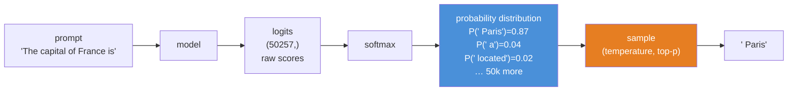
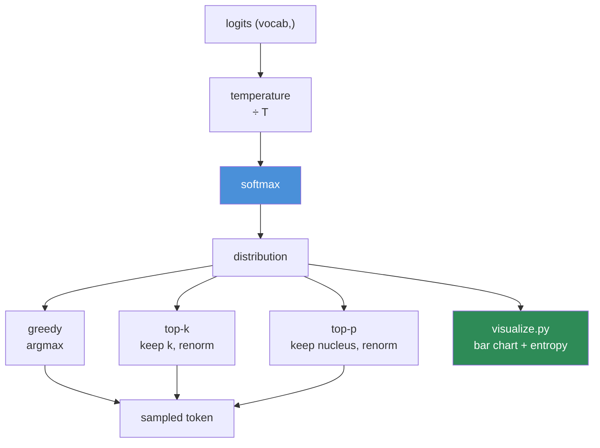

# 06.5 · Probability

[⬅ 06.4 Calculus](06.4-calculus.md) · [🏠 Module 06](../README.md) · [➡ 06.6 Statistics](06.6-statistics.md)

> **The lesson in one line:** A model never outputs an answer — it outputs a *distribution over* answers, and probability is how you read, sample from, and score that distribution.

---

## 🎯 Learning objectives

By the end of this lesson you can:

1. Explain why every modern AI system is **probabilistic**, and what an LLM is *actually* predicting.
2. Work with **random variables** and the distributions that appear in ML.
3. Use **conditional probability** and **Bayes' theorem** — and see that an LLM is a giant conditional probability machine.
4. Explain **independence**, why the "naive" in naive Bayes is a lie that works, and where independence assumptions break.
5. Connect **joint / marginal / conditional** probability, and read the notation in papers without hesitation.
6. Implement sampling, temperature, top-k, and top-p in NumPy — and know exactly what each knob does to the distribution.

---

## 🧠 Mental model

> **A neural network's output layer is a probability distribution. Everything downstream — the loss, the sampling, the confidence score — is a probability operation on it.**

This is the single most clarifying idea in this lesson. When ChatGPT writes a word, here is what physically happens:



**An LLM is a function that maps a prefix to a probability distribution over the next token.** That's the entire definition. Training makes that distribution match reality; generation samples from it. If you internalize only that, this lesson has done its job.

> [!IMPORTANT]
> **This reframes everything.** "Hallucination" is the model sampling from a distribution that is confidently wrong. "Temperature" is a scalar that flattens or sharpens that distribution. "Perplexity" is a measure of how spread out it is. "Fine-tuning" is reshaping it. Every LLM behaviour you'll ever debug is a fact about a probability distribution.

---

## 1 · Random Variables

### Intuition

A **random variable** is a quantity whose value depends on chance. Not a variable in the programming sense — think of it as *a label for an uncertain outcome*.

| Type | Values | Described by | Example in AI |
|---|---|---|---|
| **Discrete** | Countable | **PMF** — probability *mass* function $P(X = x)$ | Next token (50k options); class label; will this user click? |
| **Continuous** | Uncountable | **PDF** — probability *density* function $p(x)$ | An embedding coordinate; a weight; a latent in a VAE |

> [!WARNING]
> **For a continuous variable, $P(X = 3.7) = 0$.** Exactly zero. There are infinitely many real numbers, so no single one has positive probability. Only *intervals* do: $P(3.6 < X < 3.8) = \int_{3.6}^{3.8} p(x)\,dx$. This is why a PDF can exceed 1 (it's a *density*, not a probability) — a fact that trips up nearly everyone the first time they see a normal distribution with tiny variance spike above 1.

### Expectation and variance — the two numbers you'll actually use

$$\mathbb{E}[X] = \sum_x x \cdot P(x) \qquad \text{(the average, weighted by probability)}$$

$$\text{Var}(X) = \mathbb{E}[(X - \mathbb{E}[X])^2] \qquad \text{(the average squared distance from the mean — the spread)}$$

**Read $\mathbb{E}[\cdot]$ as "the average of."** That's it. When a paper writes $\mathbb{E}_{x \sim D}[L(x)]$, it means *"the average loss over data drawn from distribution D"* — and in code, that's `losses.mean()`. Papers are drowning in $\mathbb{E}$; it almost always compiles to `.mean()`.

```python
import numpy as np

# A loaded die
outcomes = np.array([1, 2, 3, 4, 5, 6])
probs    = np.array([0.1, 0.1, 0.1, 0.1, 0.1, 0.5])   # 6 is loaded
assert np.isclose(probs.sum(), 1.0)                    # ← ALWAYS check this

expectation = (outcomes * probs).sum()                 # 4.5
variance    = (probs * (outcomes - expectation)**2).sum()
print(f"E[X] = {expectation:.2f}   Var(X) = {variance:.2f}   σ = {np.sqrt(variance):.2f}")

# Verify empirically — the Law of Large Numbers, in one line
samples = np.random.choice(outcomes, size=1_000_000, p=probs)
print(f"empirical mean = {samples.mean():.3f}")        # → 4.5  ✓
```

---

## 2 · Probability Distributions

You need to recognize about seven. Here they are, ranked by how often they'll actually matter to you.

| Distribution | Shape | Parameters | Where it shows up in AI |
|---|---|---|---|
| **Categorical** | k discrete outcomes | $p_1 \dots p_k$ | **Every LLM's next-token output.** Every classifier. The most important one, by far |
| **Bernoulli** | {0, 1} | $p$ | Binary classification; **dropout**; a single coin flip |
| **Normal (Gaussian)** | bell curve | $\mu, \sigma^2$ | **Weight initialization**; noise in diffusion models; VAE latents; the CLT's payoff |
| **Uniform** | flat | $a, b$ | Random init; sampling; ε-greedy exploration |
| **Binomial** | # successes in n trials | $n, p$ | A/B tests; "how many of 1000 requests failed?" |
| **Exponential / Poisson** | waiting times / counts | $\lambda$ | Request arrivals; queue modelling ([05.14](../../05-SQL/weeks/05.14-performance-scaling.md)) |
| **Beta / Dirichlet** | distributions *over* probabilities | $\alpha, \beta$ | Bayesian priors; Thompson sampling; topic models |

> 🖼️ **[IMAGE PLACEHOLDER: `assets/images/06-distributions-gallery.png`]**
> *A 2×4 grid of small charts, each labelled with its name and formula. (1) Categorical: a bar chart over 6 tokens with unequal heights, one dominant — annotated "an LLM's output." (2) Bernoulli: two bars at 0 and 1. (3) Normal: the classic bell curve with μ marked and ±1σ, ±2σ shaded (68% / 95%). (4) Uniform: a flat rectangle. (5) Binomial: a discrete bell-ish histogram. (6) Exponential: a decaying curve. (7) Beta: three overlaid curves showing different α,β shapes. (8) A comparison panel showing the same categorical distribution at temperature 0.5, 1.0, and 2.0 — sharp, normal, flat. Consistent blue palette.*

### The Normal distribution — and why it's everywhere

$$p(x) = \frac{1}{\sigma\sqrt{2\pi}} \exp\left(-\frac{(x-\mu)^2}{2\sigma^2}\right)$$

Don't memorize it. **Do** memorize what it means: *most values cluster near the mean; extremes are exponentially rare.*

| Range | Contains |
|---|---|
| $\mu \pm 1\sigma$ | **68%** of the mass |
| $\mu \pm 2\sigma$ | **95%** |
| $\mu \pm 3\sigma$ | **99.7%** |

The **Central Limit Theorem** is why it dominates: *the sum of many independent random effects is approximately normal, whatever the individual effects look like.* Heights, measurement errors, and — critically — the **pre-activation sums inside a neural network** ($\sum w_i x_i$, a sum of many terms) are all approximately normal. That's not a coincidence; it's the CLT, and it's precisely why weight initialization schemes are stated in terms of variance.

> [!IMPORTANT]
> **Weight initialization is a probability decision, and it's the same problem as [06.4](06.4-calculus.md)'s vanishing gradients.** He initialization draws weights from $\mathcal{N}(0, \sqrt{2/n_{\text{in}}})$ — chosen precisely so that the *variance* of activations stays ≈ 1 as signals propagate through layers. Too small a variance: activations shrink to zero across depth. Too large: they explode. The scaling factor $\sqrt{2/n_{\text{in}}}$ is the answer to "what variance keeps the signal alive?" **Initialization is applied probability, and it is the difference between a network that trains and one that doesn't.**

```python
import numpy as np

n_in, n_out = 512, 512
x = np.random.randn(1000, n_in).astype(np.float32)     # unit-variance input

for name, W in [
    ("too small (σ=0.01)", np.random.randn(n_in, n_out) * 0.01),
    ("He init  (√(2/n))",  np.random.randn(n_in, n_out) * np.sqrt(2/n_in)),
    ("too large (σ=1.0)",  np.random.randn(n_in, n_out) * 1.0),
]:
    h = x.astype(np.float32)
    for layer in range(10):                 # 10 layers of  relu(hW)
        h = np.maximum(0, h @ W.astype(np.float32))
    print(f"{name:22}  activation std after 10 layers: {h.std():.3e}")

# too small (σ=0.01)      → 0.000e+00   ← signal DEAD, gradients vanish
# He init  (√(2/n))       → 8.7e-01     ← signal PRESERVED  ✅
# too large (σ=1.0)       → 1.4e+05     ← signal EXPLODED, NaN incoming
```

**Run this.** It is a two-line proof of why initialization papers exist, and it makes the abstract concrete in a way no formula can.

---

## 3 · Conditional Probability — the heart of it

### Intuition

$$P(A \mid B) = \frac{P(A \cap B)}{P(B)}$$

Read the vertical bar as **"given that."** $P(A \mid B)$ = "the probability of A, **given that** B happened."

Conditioning **shrinks the world**. Before you knew B, the whole sample space was in play. Now you only consider the slice where B is true, and you renormalize within it.

### Why this is the most important section in the lesson

> [!IMPORTANT]
> **An LLM computes exactly one thing: $P(\text{next token} \mid \text{all previous tokens})$.**
>
> $$P(\text{sentence}) = \prod_{t=1}^{T} P(w_t \mid w_1, w_2, \dots, w_{t-1})$$
>
> That product — the **chain rule of probability** — *is* the definition of an autoregressive language model. GPT is a very, very good estimator of one conditional distribution. **"Prompt engineering" is the act of choosing the conditioning variables** to steer that distribution. When you write a better prompt, you are literally changing what comes after the `|`.

Everything you know about LLMs re-reads through this lens:

| LLM concept | The conditional probability underneath |
|---|---|
| **Prompting** | Choosing $B$ in $P(A \mid B)$ |
| **Few-shot examples** | Adding to the conditioning set to shift the distribution |
| **RAG** | Injecting retrieved facts into $B$ so the distribution concentrates on grounded answers |
| **System prompts** | Persistent conditioning on every token |
| **Context window** | The maximum size of $B$ |
| **Hallucination** | The model is confident, and the conditional distribution it learned is wrong |
| **Chain-of-thought** | Conditioning on its *own* intermediate tokens — each step narrows the distribution for the next |

### Geometry

> 🖼️ **[IMAGE PLACEHOLDER: `assets/images/06-conditional-probability.png`]**
> *Left: a Venn-style rectangle (the full sample space) with two overlapping circles A and B, the intersection shaded. Right: the same picture with everything outside B greyed out and B redrawn as the *entire* new sample space, with A∩B now occupying a larger fraction of it. Annotation: "P(A|B) = the intersection, renormalized by B. Conditioning shrinks the world." Below, a probability tree: root splits into B (0.3) and not-B (0.7); B splits into A|B (0.8) and not-A|B (0.2); leaf values shown as products.*

### NumPy implementation — the sampling knobs, explained

Here's where conditional probability becomes something you tune in a config file.

```python
import numpy as np

def softmax(logits, temperature=1.0):
    """Turn raw scores into a probability distribution."""
    z = logits / temperature
    z = z - z.max()                      # numerical stability — see 06.9
    e = np.exp(z)
    return e / e.sum()

vocab  = np.array([" Paris", " a", " located", " the", " beautiful"])
logits = np.array([8.0, 3.5, 3.0, 2.5, 1.0])     # model's raw output

for T in (0.1, 0.7, 1.0, 2.0):
    p = softmax(logits, T)
    print(f"T={T:<4} " + "  ".join(f"{v.strip()}:{prob:.3f}" for v, prob in zip(vocab, p)))

# T=0.1  Paris:1.000  a:0.000  ...      ← nearly deterministic ("greedy")
# T=0.7  Paris:0.981  a:0.001  ...      ← confident
# T=1.0  Paris:0.977  a:0.011  ...      ← the model's true beliefs
# T=2.0  Paris:0.760  a:0.080  ...      ← flattened; creative; more errors
```

**Temperature divides the logits before the softmax.** Low T → the gaps between logits get amplified → the distribution **sharpens** toward the argmax (deterministic, safe, repetitive). High T → gaps shrink → the distribution **flattens** (creative, diverse, more likely to be wrong). It is a *single scalar that reshapes the conditional distribution*, and now you know exactly why it behaves as it does.

```python
def top_p_sample(probs, p=0.9, rng=None):
    """Nucleus sampling: keep the smallest set of tokens whose mass ≥ p."""
    rng = rng or np.random.default_rng(0)
    order  = np.argsort(-probs)                 # descending
    sorted_p = probs[order]
    cum    = np.cumsum(sorted_p)
    cutoff = np.searchsorted(cum, p) + 1        # how many to keep
    keep   = order[:cutoff]
    renorm = probs[keep] / probs[keep].sum()    # ← renormalize: it must sum to 1
    return rng.choice(keep, p=renorm)

def top_k_sample(probs, k=5, rng=None):
    """Keep only the k most likely tokens, renormalize, sample."""
    rng = rng or np.random.default_rng(0)
    keep   = np.argpartition(-probs, k)[:k]
    renorm = probs[keep] / probs[keep].sum()
    return rng.choice(keep, p=renorm)
```

> [!TIP]
> **Top-p (nucleus) beats top-k because it adapts.** When the model is *certain* ("The capital of France is ___"), the nucleus contains one token and sampling is effectively greedy. When it's *uncertain* ("Once upon a ___"), the nucleus is wide and you get diversity. Top-k always keeps exactly k, regardless of confidence — cutting off good options when the model is unsure, and admitting garbage when it's sure. **The adaptive one wins because it responds to the *shape* of the distribution**, which is a probability insight, not an engineering one.

---

## 4 · Bayes' Theorem

### Intuition

$$P(A \mid B) = \frac{P(B \mid A) \, P(A)}{P(B)}$$

**Bayes' theorem lets you flip a conditional.** You know $P(\text{symptom} \mid \text{disease})$ (from medical studies); you want $P(\text{disease} \mid \text{symptom})$ (what the patient asks). Bayes converts one to the other.

The names matter, because papers use them constantly:

$$\underbrace{P(A \mid B)}_{\textbf{posterior}} = \frac{\overbrace{P(B \mid A)}^{\textbf{likelihood}} \cdot \overbrace{P(A)}^{\textbf{prior}}}{\underbrace{P(B)}_{\textbf{evidence}}}$$

| Term | Means |
|---|---|
| **Prior** $P(A)$ | What you believed **before** seeing the data |
| **Likelihood** $P(B \mid A)$ | How well the hypothesis explains the data |
| **Posterior** $P(A \mid B)$ | What you believe **after** seeing the data |
| **Evidence** $P(B)$ | A normalizing constant (makes it sum to 1) |

**Bayes is a belief-update rule: prior × evidence → posterior.** That's the intuition to carry.

### The example that changes how you think

> **A test for a disease is 99% accurate. The disease affects 1 in 10,000 people. You test positive. What's the probability you have it?**

Most people say ~99%. **The correct answer is under 1%.**

```python
p_disease = 1 / 10_000            # prior: it's RARE — this is the key fact
p_pos_given_disease = 0.99        # true positive rate
p_pos_given_healthy = 0.01        # false positive rate (1% of the healthy)

p_positive = (p_pos_given_disease * p_disease +
              p_pos_given_healthy * (1 - p_disease))

posterior = p_pos_given_disease * p_disease / p_positive
print(f"P(disease | positive) = {posterior:.2%}")     # 0.98%  ← under 1%!
```

**Why?** Out of 10,000 people: ~1 has the disease and tests positive. But ~100 healthy people *also* test positive (1% of 9,999). So of the ~101 positives, only 1 is real — about 1%. **The prior dominates when the base rate is extreme.**

> [!IMPORTANT]
> **This is the single most important applied lesson in this module, and it is an ML deployment lesson, not a math one.** Your fraud detector with "99% accuracy" on a fraud rate of 0.1% will produce **overwhelmingly false alarms**. Your rare-disease classifier, your anomaly detector, your content moderation flagger — all of them. **Accuracy is a lie on imbalanced data; base rates dominate.** This is why you report **precision and recall**, not accuracy ([06.6](06.6-statistics.md)), and why "my model is 99% accurate" should always be met with "what's the class balance?"

### Where Bayes shows up in AI

| Application | Bayes' role |
|---|---|
| **Naive Bayes classifier** | Literally the theorem, with an independence assumption |
| **Spam filtering** | The original killer app: $P(\text{spam} \mid \text{words})$ |
| **Reasoning about test results / metrics** | The base-rate lesson above |
| **Bayesian optimization** | Hyperparameter search that updates beliefs about the objective |
| **Bayesian neural networks** | Distributions over *weights*, not point estimates → calibrated uncertainty |
| **Diffusion models** | The reverse process is a learned posterior $p(x_{t-1} \mid x_t)$ |
| **Kalman filters** | Continuous Bayesian belief updating |
| **RLHF** | The KL-to-reference term is a prior pulling you toward the base model ([06.8](06.8-information-theory.md)) |

---

## 5 · Independence

### Intuition

$A$ and $B$ are **independent** if knowing one tells you nothing about the other:

$$P(A \mid B) = P(A) \qquad \Longleftrightarrow \qquad P(A \cap B) = P(A) \cdot P(B)$$

**Independence is what lets you multiply probabilities.** That's why it's so beloved — and so often assumed when it isn't true.

### The lie at the heart of naive Bayes

Naive Bayes classifies text by assuming **every word is independent of every other word given the class**:

$$P(\text{spam} \mid w_1, \dots, w_n) \propto P(\text{spam}) \prod_{i=1}^{n} P(w_i \mid \text{spam})$$

This is **obviously, laughably false**. "New" and "York" are not independent. "Free" and "money" co-occur. The assumption is wrong in every document ever written.

**And yet naive Bayes works remarkably well**, and dominated spam filtering for a decade.

> [!NOTE]
> **Why does a false assumption produce a good classifier?** Because for *classification*, you only need the **ranking** of the classes to be right, not the probabilities themselves. Naive Bayes produces wildly miscalibrated probabilities (often 0.9999 or 0.0001 — the products of many terms) while still putting the *correct class on top*. **This is a deep and recurring lesson in ML: a model can be badly wrong about the world and still be useful for the decision you actually need.** Hold on to that; it applies far beyond naive Bayes.

### Where independence assumptions break — and it matters

| Assumption | Reality | Consequence |
|---|---|---|
| Data points are i.i.d. | Time series are **correlated**; user data is **clustered** | A random train/test split **leaks the future** → inflated metrics ([05.12](../../05-SQL/weeks/05.12-ai-data-workflows.md)) |
| Words are independent | Language is deeply structured | Naive Bayes is miscalibrated (works anyway) |
| Features are independent | Features are collinear | Regression coefficients become unstable (and $X^\top X$ becomes ill-conditioned — [06.3](06.3-linear-algebra-decomposition.md)) |
| Dropout masks are independent | They are — by construction | ✅ This one's genuinely true and it's why dropout works |

> [!WARNING]
> **The i.i.d. assumption is the most consequential and most frequently violated assumption in applied ML.** Random-splitting time-series data is the single most common cause of a model that scores 0.95 in the notebook and fails in production. If your data has *any* temporal structure, **split by time, not at random.** This is a probability error with a business cost.

---

## 6 · Joint Probability, Marginals & the Notation Map

### The three quantities

| Quantity | Notation | Means | How to get it |
|---|---|---|---|
| **Joint** | $P(A, B)$ | Both happen | The full table |
| **Marginal** | $P(A)$ | A happens, don't care about B | **Sum out** B: $P(A) = \sum_B P(A, B)$ |
| **Conditional** | $P(A \mid B)$ | A happens, given B | $P(A,B) / P(B)$ |

**"Marginalizing" just means summing over the axis you don't care about.** The word comes from literally writing the row/column sums in the *margins* of a table — a lovely piece of etymology that makes the concept unforgettable.

```python
import numpy as np

# Joint distribution P(weather, mood) — rows: sunny/rainy, cols: happy/sad
joint = np.array([[0.40, 0.10],     # sunny
                  [0.15, 0.35]])    # rainy
assert np.isclose(joint.sum(), 1.0)

p_weather = joint.sum(axis=1)       # marginalize OUT mood    → [0.50, 0.50]
p_mood    = joint.sum(axis=0)       # marginalize OUT weather → [0.55, 0.45]

# P(happy | rainy) = P(rainy, happy) / P(rainy)
p_happy_given_rainy = joint[1, 0] / p_weather[1]
print(f"P(happy | rainy) = {p_happy_given_rainy:.2f}")   # 0.30

# Independent? P(A,B) == P(A)P(B)?
independent = np.outer(p_weather, p_mood)
print("independent?", np.allclose(joint, independent))   # False — weather affects mood ✓
```

> [!TIP]
> **`.sum(axis=k)` *is* marginalization.** Every time you see $\sum_z p(x, z)$ in a paper — in a VAE's ELBO, in a mixture model, in an HMM — it compiles to `p.sum(axis=z_axis)`. This is the [06.1](06.1-mathematical-thinking.md) translation habit paying rent: intimidating notation, one-line implementation.

### The chain rule of probability

$$P(A, B, C) = P(A) \cdot P(B \mid A) \cdot P(C \mid A, B)$$

Any joint distribution factorizes into a chain of conditionals. **This is the mathematical definition of an autoregressive model**, and it's why LLMs generate left-to-right one token at a time:

$$P(w_1, \dots, w_T) = \prod_{t=1}^{T} P(w_t \mid w_{<t})$$

> [!IMPORTANT]
> **The chain rule of probability is why GPT works the way it does.** Modelling the joint distribution over all 2048-token sequences directly is impossible (50257^2048 outcomes). But factorize it into a product of conditionals, and each factor is just *"predict one token given the ones before"* — a single 50k-way classification, which a neural network can absolutely learn. **The entire architecture of autoregressive language modelling is an application of this one identity.** In log space, the product becomes a sum, and that sum is exactly the cross-entropy loss ([06.8](06.8-information-theory.md)).

---

## 🐛 Common mistakes

| Mistake | Why it hurts | Fix |
|---|---|---|
| **Ignoring base rates** | "99% accurate" on a rare event is nearly all false positives | Compute the posterior. Report precision/recall |
| Confusing $P(A\mid B)$ with $P(B\mid A)$ | The **prosecutor's fallacy** — a real, serious error | They're related by Bayes, not equal |
| Random-splitting time-series data | Leaks the future → fake metrics | **Split by time** |
| Assuming a PDF value is a probability | PDFs can exceed 1 | Only *areas* are probabilities |
| Forgetting to renormalize after top-k/top-p | Probabilities don't sum to 1 → sampler errors or bias | Divide by the kept mass |
| Reporting **accuracy** on imbalanced data | 99.9% accuracy by always predicting "not fraud" | Precision, recall, F1, PR-AUC |
| Naive softmax without subtracting the max | `exp(1000)` = `inf` → NaN | Subtract the max ([06.9](06.9-numerical-computing.md)) |
| Treating model confidence as true probability | Neural nets are **overconfident** by default | Calibrate (temperature scaling, reliability diagrams) |
| Assuming independence when features are correlated | Ill-conditioning, unstable coefficients | Check correlations ([06.6](06.6-statistics.md)) |

---

## 📝 Exercises

**Conceptual**
1. In one sentence, what does an LLM compute? Write the equation and name every symbol.
2. Explain why "my fraud model is 99.5% accurate" might be a *terrible* result. Give the arithmetic.
3. Why does naive Bayes work despite an assumption that's obviously false? What does that teach you about models generally?
4. Explain temperature to a product manager without using the word "logit."
5. Why is top-p sampling better than top-k? Frame the answer in terms of the *shape* of the distribution.

**Intuition**
6. A spam filter flags 1% of legitimate email and catches 95% of spam. 20% of email is spam. If a message is flagged, what's the probability it's actually spam? (Compute it — don't guess.)
7. Your model outputs `[0.9, 0.05, 0.05]` for a 3-class problem. At T=2.0, roughly what happens? At T=0.1?
8. You split your time-series data randomly and get 0.97 AUC. In production it's 0.61. Explain precisely what went wrong, in probability terms.

**NumPy**
9. Implement `softmax(logits, temperature)`. Plot the output distribution for T ∈ {0.1, 0.5, 1, 2, 5} on the same axes. **This plot explains temperature better than any paragraph can.**
10. Implement `top_k_sample` and `top_p_sample`. Generate 10,000 samples from each on a peaked distribution and on a flat one. Show that top-p adapts and top-k doesn't.
11. Reproduce the initialization experiment: propagate through 20 layers with σ = 0.01, He init, and σ = 1.0. Plot the activation std per layer on a **log** axis.
12. Build the 2×2 joint table above. Compute both marginals, all four conditionals, and verify $P(A,B) = P(A\mid B)P(B)$.

**Visualization**
13. Draw the disease-test problem as a probability tree with 10,000 people at the root. Label every branch and leaf. **This single diagram makes the base-rate fallacy impossible to forget.**
14. Sample 10,000 points from `np.random.randn(10000)`, histogram them, and overlay the analytical PDF. Shade ±1σ, ±2σ, ±3σ and verify 68/95/99.7.
15. Demonstrate the CLT: sample from a *uniform* distribution, take the mean of n=1, 2, 5, 30 samples, repeat 10,000 times, and histogram each. Watch a flat distribution become a bell curve.

**Equation interpretation**
16. Read $P(w_1, \dots, w_T) = \prod_{t=1}^{T} P(w_t \mid w_{<t})$. What does $w_{<t}$ mean? Why is this a *product*? What happens when you take its log?
17. Read $\mathbb{E}_{x \sim p(x)}[f(x)]$. Translate to NumPy.

---

## 🛠️ Mini project — *The Sampler*

Build `code/06-mathematics/sampler/` — a tool that makes LLM sampling parameters **visible**.

```
sampler/
├── README.md
├── src/
│   ├── distributions.py   # softmax, temperature, entropy
│   ├── sampling.py        # greedy, temperature, top-k, top-p, min-p
│   ├── bayes.py           # the base-rate calculator
│   └── visualize.py       # distribution bar charts
├── tests/
│   └── test_sampling.py   # probabilities sum to 1; top-p ⊆ top-k when peaked
└── notebooks/
    └── temperature_study.ipynb
```

**Architecture**



**Implementation guidance**
1. **`distributions.py`** — a numerically stable softmax (subtract the max!) and an `entropy()` function that measures how "spread out" the distribution is. Entropy is the bridge to [06.8](06.8-information-theory.md), and printing it beside each distribution makes temperature's effect quantitative rather than vibes-based.
2. **`sampling.py`** — implement all four strategies against a shared interface. **Assert that probabilities sum to 1 after every renormalization.**
3. **`visualize.py`** — bar charts of the top 15 tokens, side by side, across temperatures. Annotate each with its entropy.
4. **`bayes.py`** — a calculator that takes sensitivity, specificity, and prevalence, and returns the posterior. Then run it over a *range* of prevalences and plot the result. **Watching the posterior collapse as the base rate drops is a lesson you'll carry into every model-evaluation meeting for the rest of your career.**

**Stretch goals**
- Add **min-p** sampling (keep tokens with `p > min_p * p_max`) and argue about whether it beats top-p.
- Feed in *real* logits from a small HuggingFace model and see actual next-token distributions.
- Plot entropy over a generated sequence — you'll see it spike at genuinely uncertain moments (a name, a number) and collapse in boilerplate.

---

## 📄 Cheat sheet

| Concept | Formula | Meaning |
|---|---|---|
| Expectation | $\mathbb{E}[X] = \sum x\,P(x)$ | the average → `.mean()` |
| Variance | $\mathbb{E}[(X-\mu)^2]$ | spread |
| **Conditional** | $P(A\mid B) = \frac{P(A,B)}{P(B)}$ | **"given that"** |
| **Bayes** | $P(A\mid B) = \frac{P(B\mid A)P(A)}{P(B)}$ | **flip the conditional; prior × likelihood** |
| Independence | $P(A,B) = P(A)P(B)$ | knowing one tells you nothing |
| Marginal | $P(A) = \sum_B P(A,B)$ | **`.sum(axis=...)`** |
| **Chain rule** | $P(w_{1:T}) = \prod_t P(w_t \mid w_{<t})$ | **= autoregressive LLM** |
| Softmax | $\frac{e^{z_i/T}}{\sum_j e^{z_j/T}}$ | logits → distribution |
| Temperature | low = sharp, high = flat | reshapes the distribution |
| Normal | 68/95/99.7 within 1/2/3σ | the CLT's attractor |
| He init | $\mathcal{N}(0, \sqrt{2/n_{\text{in}}})$ | keeps activation variance ≈ 1 |
| **Base rate trap** | rare event + good test = mostly false positives | **compute the posterior** |

---

## 🎴 Flashcards

- **Q:** What does an LLM actually compute? → **A:** P(next token | all previous tokens) — a categorical distribution over the vocabulary.
- **Q:** State Bayes' theorem and name the four terms. → **A:** P(A|B) = P(B|A)P(A)/P(B); posterior = likelihood × prior / evidence.
- **Q:** A test is 99% accurate for a disease affecting 1 in 10,000. You test positive. Probability you have it? → **A:** Under 1% — false positives from the huge healthy population overwhelm the rare true positives. **Base rates dominate.**
- **Q:** Why is accuracy a bad metric on imbalanced data? → **A:** Predicting the majority class always gives high accuracy while catching nothing. Use precision/recall/PR-AUC.
- **Q:** What does temperature do, mechanically? → **A:** Divides logits before the softmax. T<1 sharpens the distribution (deterministic); T>1 flattens it (creative).
- **Q:** Why is top-p better than top-k? → **A:** It adapts to the model's confidence — a narrow nucleus when certain, a wide one when uncertain. Top-k always keeps exactly k.
- **Q:** What is marginalization? → **A:** Summing a joint distribution over the variable you don't care about — literally `.sum(axis=k)`.
- **Q:** State the chain rule of probability and its significance. → **A:** P(A,B,C) = P(A)P(B|A)P(C|A,B). It's the definition of an autoregressive model — why LLMs generate one token at a time.
- **Q:** Why does naive Bayes work despite a false independence assumption? → **A:** Classification only needs the correct *ranking*, not calibrated probabilities.
- **Q:** Why does He initialization use √(2/n_in)? → **A:** It keeps the *variance* of activations ≈ 1 as signal propagates, so activations neither vanish nor explode with depth.
- **Q:** What's the most consequential violated assumption in applied ML? → **A:** i.i.d. — random-splitting correlated (esp. time-series) data leaks the future and inflates metrics.

---

## 💼 Interview questions

1. **"What is a language model, mathematically?"** — An estimator of P(w_t | w_<t); the chain rule of probability factorizes the joint over sequences into a product of conditionals.
2. **"Your classifier has 99% accuracy. Is it good?"** — *"What's the class balance?"* Then walk through the base-rate arithmetic and pivot to precision/recall/PR-AUC.
3. **"Explain temperature and top-p to a non-ML engineer."** — Temperature reshapes the distribution (sharp vs. flat); top-p keeps the smallest set of tokens covering p of the mass, so it adapts to confidence.
4. **"When does the i.i.d. assumption break, and what breaks with it?"** — Time series, grouped/clustered data, user sessions. It breaks your train/test split, causing leakage and metrics that don't survive production.
5. **"What's the difference between P(A|B) and P(B|A)?"** — The prosecutor's fallacy. Give the disease-test example; they differ enormously when base rates are skewed.
6. **"Why do neural networks produce overconfident probabilities?"** — Trained with cross-entropy to push toward one-hot targets; nothing rewards calibration. Fix with temperature scaling; verify with a reliability diagram.

---

## 📚 Summary

- **Everything in modern AI is probabilistic.** A model outputs a *distribution*, not an answer. Once you see that, hallucination, temperature, perplexity, and calibration all become facts about one distribution.
- **Random variables** are discrete (PMF) or continuous (PDF). $\mathbb{E}[\cdot]$ means "average" and compiles to `.mean()`.
- The **categorical** distribution (every LLM's output) and the **normal** distribution (initialization, noise, the CLT) are the two you'll meet most.
- **Weight initialization is applied probability**: He init picks a variance that keeps activations alive through depth — the same battle as vanishing gradients, fought at step 0.
- **Conditional probability is the core.** An LLM computes $P(w_t \mid w_{<t})$; **prompting is choosing what goes after the bar**. RAG, few-shot, system prompts, and chain-of-thought are all conditioning strategies.
- **Bayes' theorem** flips conditionals — and its most important practical lesson is the **base-rate fallacy**: a 99%-accurate test for a rare condition produces overwhelmingly false positives. This is why accuracy is a lie on imbalanced data.
- **Independence** lets you multiply probabilities. Naive Bayes assumes it falsely and works anyway, because classification only needs the right *ranking*. But **violating i.i.d.** (random-splitting time-series data) will silently destroy your model's real-world performance.
- **Marginalizing = `.sum(axis=k)`.** The **chain rule of probability** is the mathematical definition of an autoregressive LLM.
- **Temperature, top-k, and top-p** are all just operations that reshape a distribution before sampling.

**Next:** [06.6 Statistics](06.6-statistics.md) — probability describes a known distribution; statistics *infers* one from data, which is what you do every time you evaluate a model.

---

## 🔗 References

- 3Blue1Brown — *Bayes' theorem* and *The medical test paradox*. Watch both; the second is the base-rate lesson made visual.
- Deisenroth et al. — *Mathematics for Machine Learning*, Ch. 6 (Probability and Distributions).
- Goodfellow et al. — *Deep Learning*, Ch. 3 (Probability and Information Theory).
- Holtzman et al. (2019) — *The Curious Case of Neural Text Degeneration* — the paper that introduced **nucleus (top-p) sampling** and explained why pure likelihood maximization produces bland, repetitive text. **You can read this now.**
- Guo et al. (2017) — *On Calibration of Modern Neural Networks* — why your model's confidence isn't a probability, and how to fix it.
- Kahneman — *Thinking, Fast and Slow*, on base rates — the psychology of why the disease-test answer feels wrong.

---

## 🧭 Navigation

| Direction | Link |
|---|---|
| ⬅ Previous | [06.4 Calculus](06.4-calculus.md) |
| ➡ Next | [06.6 Statistics](06.6-statistics.md) |
| 🏠 Module | [Module 06](../README.md) |
| 🗺 Roadmap | [ROADMAP.md](../../../ROADMAP.md) |
