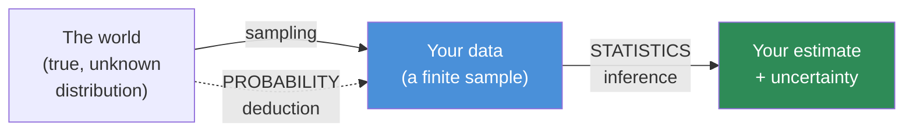
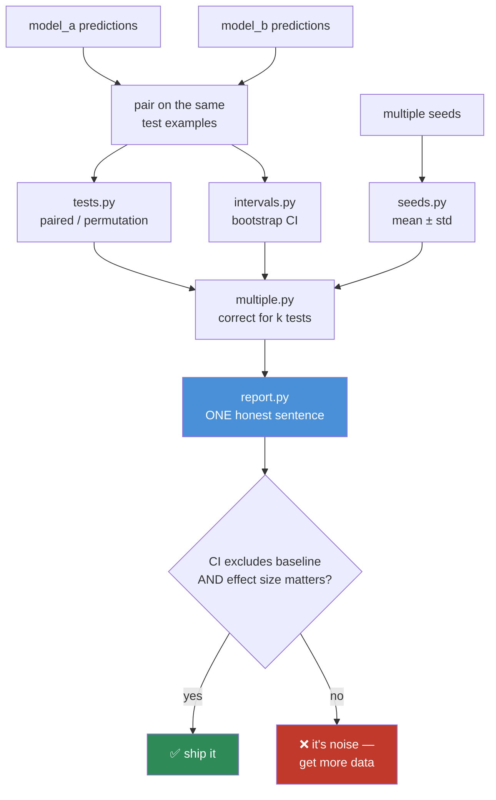

# 06.6 · Statistics

[⬅ 06.5 Probability](06.5-probability.md) · [🏠 Module 06](../README.md) · [➡ 06.7 Optimization](06.7-optimization.md)

> **The lesson in one line:** Probability reasons *from* a known distribution *to* data; statistics reasons *from* data *back to* the distribution — which is exactly what you're doing every time you claim "model B is better than model A."

---

## 🎯 Learning objectives

By the end of this lesson you can:

1. Choose between **mean, median, and mode** — and know when the mean lies to you.
2. Read **variance and standard deviation** as "how much do I trust this number?"
3. Distinguish **covariance** from **correlation**, and know why correlation ≠ causation matters *in your pipeline*, not just in philosophy.
4. Compute and interpret a **confidence interval**, and put one on every benchmark number you ever report.
5. Run a **hypothesis test**, understand the **p-value** (correctly), and know its failure modes — including p-hacking, which is endemic in ML.
6. Explain why "**model B beat model A by 0.3%**" is usually **noise**, and how to prove it either way.

---

## 🧠 Mental model

> **Statistics is the discipline of not fooling yourself with numbers.**

You will spend a large fraction of your AI career staring at a table like this:

| Model | Accuracy |
|---|---|
| Baseline | 87.2% |
| **Your new idea** | **87.9%** |

And you will have to answer one question: **is that real, or is it noise?** Ship the wrong answer and you've added complexity, cost, and latency for nothing — or you've discarded a genuine improvement. **Statistics is the toolkit for answering that question honestly**, and it is the difference between an engineer who *measures* and one who *hopes*.



**Probability goes down the arrow; statistics goes back up it.** Statistics is harder, because going back up is always uncertain — and quantifying that uncertainty *is the job*.

---

## 1 · Mean, Median, Mode

### Intuition

Three different answers to "what's a typical value?" — and choosing wrong will mislead you.

| Statistic | Definition | Robust to outliers? | Use when |
|---|---|---|---|
| **Mean** | $\bar{x} = \frac{1}{n}\sum x_i$ | ❌ **No** — one outlier drags it | Data is roughly symmetric |
| **Median** | The middle value when sorted | ✅ **Yes** | Data is **skewed** or has outliers |
| **Mode** | The most frequent value | ✅ Yes | Categorical data |

### The mistake that will bite you in production

> **"Our average API latency is 180 ms."**

This is one of the most misleading sentences in engineering, and you will hear it constantly.

```python
import numpy as np

# Realistic latency: most requests fast, a few catastrophically slow
latencies = np.concatenate([
    np.random.normal(100, 20, 950),        # 950 healthy requests, ~100 ms
    np.random.normal(2000, 300, 50),       #  50 timeouts / cold starts
])

print(f"mean   : {latencies.mean():7.1f} ms")     # ~195 ms  ← nobody experiences this
print(f"median : {np.median(latencies):7.1f} ms") # ~100 ms  ← the typical user
print(f"p95    : {np.percentile(latencies, 95):7.1f} ms")   # ~1900 ms
print(f"p99    : {np.percentile(latencies, 99):7.1f} ms")   # ~2400 ms  ← the angry user
```

**The mean is a number that no single user experiences.** The median tells you the typical case; **p95 and p99 tell you the bad case, which is the one that generates support tickets and churn.**

> [!IMPORTANT]
> **Always report percentiles for latency, never the mean.** This applies with special force to LLM serving, where the distribution is *brutally* right-skewed: long prompts, long generations, and cold starts create a heavy tail. Your p99 is where your SLA lives and dies. Every SRE knows this; surprisingly few ML engineers do — and LLM inference is precisely where it matters most. (See [05.14](../../05-SQL/weeks/05.14-performance-scaling.md).)

> 🖼️ **[IMAGE PLACEHOLDER: `assets/images/06-skewed-distribution.png`]**
> *A right-skewed latency histogram: a tall cluster around 100 ms and a long thin tail stretching to 2500 ms. Four vertical lines drawn and labelled: median (~100 ms, in the peak), mean (~195 ms, pulled right into the empty space between the peak and the tail), p95 (~1900 ms), p99 (~2400 ms). Annotation on the mean line: "no user experiences this." Annotation on p99: "this user is filing a ticket." Caption: "In a skewed distribution the mean describes nobody. Report percentiles."*

---

## 2 · Variance & Standard Deviation

### Intuition

$$\text{Var}(X) = \frac{1}{n}\sum (x_i - \bar{x})^2 \qquad\qquad \sigma = \sqrt{\text{Var}(X)}$$

**Variance is the average squared distance from the mean — how spread out the data is.** Standard deviation is its square root, which puts it back in the *original units* (so you can actually interpret it).

Why square? Two reasons: it makes deviations positive (so they don't cancel), and it's **differentiable** — which is why MSE, not mean absolute error, became the default regression loss ([06.7](06.7-optimization.md)).

### Why an AI Engineer cares — variance is the "do I trust this?" number

| Where variance shows up | What it tells you |
|---|---|
| **Across random seeds** | Run training 5×. High variance in the final metric = your "improvement" may be luck |
| **Weight initialization** | He/Xavier init are *variance* prescriptions ([06.5](06.5-probability.md)) |
| **Batch/layer normalization** | Literally: subtract the mean, divide by the std |
| **Feature scaling** | Standardization = $(x - \mu)/\sigma$ — required before PCA, k-NN, or any distance-based method |
| **The bias–variance tradeoff** | The central conceptual framework of ML |
| **Gradient noise** | SGD's gradients have variance; that's *why* it's stochastic ([06.7](06.7-optimization.md)) |

### The bias–variance tradeoff

The most important conceptual decomposition in machine learning:

$$\text{Expected Error} = \underbrace{\text{Bias}^2}_{\text{too simple}} + \underbrace{\text{Variance}}_{\text{too sensitive}} + \underbrace{\text{Irreducible noise}}_{\text{can't fix}}$$

| | High **bias** | High **variance** |
|---|---|---|
| Also called | **Underfitting** | **Overfitting** |
| Symptom | Train error **high**, val error high | Train error **low**, val error **high** |
| The model is | Too simple to capture the pattern | Memorizing noise in the training set |
| Fix | Bigger model, more features, train longer | More data, regularization, dropout, early stopping, simpler model |

> [!TIP]
> **This is the fastest diagnostic in all of ML.** Look at the gap between train and validation loss. **Both high → bias problem (underfitting). Train low, val high → variance problem (overfitting).** You now know which lever to pull, and you got there in five seconds by comparing two numbers. Do this before you touch anything else.

```python
import numpy as np

# Same model architecture, 5 different random seeds
runs = np.array([0.871, 0.869, 0.882, 0.865, 0.878])

print(f"mean accuracy : {runs.mean():.4f}")
print(f"std deviation : {runs.std(ddof=1):.4f}")     # ddof=1 → SAMPLE std
print(f"range         : {runs.min():.3f} – {runs.max():.3f}")

# Your "new idea" scored 0.879. Is it better than the 0.871 baseline?
# Seed variation alone spans 0.865–0.882.  ⚠️  0.879 IS INSIDE THE NOISE.
```

> [!WARNING]
> **`np.std()` defaults to `ddof=0`** (population std). For a *sample* — which is what your 5 runs are — you want **`ddof=1`** (Bessel's correction), which divides by n−1 instead of n. With small n the difference is substantial: with 5 runs, `ddof=0` **understates** your uncertainty by about 12%. Understating uncertainty is exactly the failure mode statistics exists to prevent, so get this right.

---

## 3 · Covariance & Correlation

### Intuition

**Covariance** measures whether two variables move together:

$$\text{Cov}(X, Y) = \mathbb{E}[(X - \mu_X)(Y - \mu_Y)]$$

But its **units are meaningless** (kg·dollars?) and its magnitude depends on scale, so you can't compare covariances. **Correlation** fixes that by normalizing:

$$\rho = \frac{\text{Cov}(X,Y)}{\sigma_X \sigma_Y} \in [-1, 1]$$

| ρ | Meaning |
|---|---|
| +1 | Perfect positive **linear** relationship |
| 0 | No **linear** relationship |
| −1 | Perfect negative linear relationship |

**Correlation is a normalized covariance** — the exact same move as [06.2](06.2-linear-algebra-vectors-matrices.md)'s cosine similarity, which normalizes the dot product. In fact, **correlation *is* the cosine similarity of the mean-centered variables.** Same idea, different field, different name.

> [!IMPORTANT]
> **Correlation only detects *linear* relationships.** A variable can be perfectly, deterministically predictable from another and still have ρ = 0. Watch:
> ```python
> x = np.linspace(-1, 1, 100)
> y = x**2                     # y is PERFECTLY determined by x
> print(np.corrcoef(x, y)[0,1])    # ≈ 0.0  ← correlation sees nothing!
> ```
> **Always plot your data.** Anscombe's quartet and the Datasaurus Dozen are four (and thirteen) datasets with *identical* means, variances, and correlations — and wildly different shapes, including a dinosaur. Summary statistics can hide anything.

### Where it matters in AI

| Application | Role of correlation |
|---|---|
| **Feature selection** | Drop features highly correlated with each other (redundant); keep those correlated with the target |
| **Multicollinearity** | Correlated features make $X^\top X$ ill-conditioned → unstable regression coefficients ([06.3](06.3-linear-algebra-decomposition.md)) |
| **PCA** | Finds the eigenvectors of the **covariance matrix** — it's *built* on this |
| **Data leakage detection** | A feature with ρ = 0.99 to the target is almost always a **leak**, not a miracle |
| **Embedding analysis** | Correlated embedding dimensions = wasted capacity |
| **Evaluation** | Is your automated metric correlated with human judgment? (If not, you're optimizing the wrong thing.) |

```python
import numpy as np

X = np.random.randn(1000, 4)
X[:, 1] = X[:, 0] * 0.95 + np.random.randn(1000) * 0.1   # feature 1 ≈ feature 0
X[:, 3] = np.random.randn(1000)                           # independent

C = np.corrcoef(X, rowvar=False)          # ← rowvar=False: columns are variables!
print(np.round(C, 2))
# [[ 1.    0.99  0.03 -0.01]     ← features 0 and 1 are 0.99 correlated:
#  [ 0.99  1.    0.02 -0.01]        REDUNDANT. Drop one.
#  [ 0.03  0.02  1.    0.04]
#  [-0.01 -0.01  0.04  1.  ]]
```

> [!CAUTION]
> **`np.corrcoef` treats *rows* as variables by default.** If your data is the usual `(n_samples, n_features)`, you **must** pass `rowvar=False` — or you'll compute a 1000×1000 correlation matrix between your *samples*, which is meaningless and will happily run without error.

### Correlation ≠ causation — the version that costs you money

Everyone knows the slogan. Here's why it's an *engineering* problem:

> A model predicting hospital readmission finds that **"patient has a scheduled follow-up appointment"** strongly predicts *lower* readmission. So the hospital cancels follow-up appointments to improve their metric.

The correlation was real. The causal direction was backwards (healthier patients get routine follow-ups; sick ones get readmitted before the appointment). **Every predictive model learns correlations, and every *intervention* based on it assumes causation.** The moment a model's output changes a decision, you have left prediction and entered causal inference — and correlations do not survive the trip.

**The AI-specific version of this trap is data leakage.** A feature that correlates suspiciously well with your target is almost never a brilliant discovery; it's usually a column that was computed *after* the outcome. Check it before you celebrate ([05.12](../../05-SQL/weeks/05.12-ai-data-workflows.md)).

---

## 4 · Confidence Intervals

### Intuition

**A point estimate without an interval is an opinion.** "Accuracy = 87.9%" is incomplete. "Accuracy = 87.9% ± 1.4%" is a *result*.

$$\text{CI}_{95\%} = \bar{x} \pm 1.96 \cdot \underbrace{\frac{\sigma}{\sqrt{n}}}_{\text{standard error}}$$

The **standard error** — $\sigma/\sqrt{n}$ — is the star of this formula, and it contains the deepest practical lesson in statistics:

> [!IMPORTANT]
> **Uncertainty shrinks like $1/\sqrt{n}$, not $1/n$.** To **halve** your error bar, you need **4× the data.** To shrink it 10×, you need **100×** the data. This is why:
> - Tiny test sets produce meaningless benchmark numbers.
> - A 500-example eval set can't distinguish an 87% model from an 89% one.
> - "We evaluated on 50 examples" is not an evaluation, it's an anecdote.
> - Doubling your annotation budget buys you only a 30% tighter interval.
>
> **The square root is the tax you pay on all empirical knowledge**, and budgeting for it is a genuine engineering skill.

### Interpreting it correctly

> A 95% CI means: **if you repeated this whole experiment many times, 95% of the intervals you construct would contain the true value.**

It does **not** mean "there's a 95% probability the true value is in *this* interval." (The true value is fixed; it's the interval that's random.) This distinction is pedantic in casual use and *career-defining* in an interview — and the frequentist/Bayesian argument behind it is genuinely deep.

### NumPy implementation — put an interval on every metric

```python
import numpy as np
from scipy import stats

correct = np.array([1]*879 + [0]*121)     # 879/1000 correct → 87.9% accuracy

# ── Method 1: analytic (normal approximation) ─────────────────────
mean = correct.mean()
se   = correct.std(ddof=1) / np.sqrt(len(correct))
lo, hi = mean - 1.96*se, mean + 1.96*se
print(f"accuracy: {mean:.1%}  95% CI: [{lo:.1%}, {hi:.1%}]")
# accuracy: 87.9%  95% CI: [85.9%, 89.9%]   ← ±2 percentage points!

# ── Method 2: BOOTSTRAP (works for ANY metric — this is the one to use) ──
def bootstrap_ci(data, statistic=np.mean, n_boot=10_000, alpha=0.05, seed=0):
    rng = np.random.default_rng(seed)
    n = len(data)
    boots = np.array([statistic(rng.choice(data, size=n, replace=True))
                      for _ in range(n_boot)])
    return np.percentile(boots, [100*alpha/2, 100*(1-alpha/2)])

lo, hi = bootstrap_ci(correct)
print(f"bootstrap 95% CI: [{lo:.1%}, {hi:.1%}]")   # ≈ same
```

**Look at that interval: [85.9%, 89.9%].** Your baseline was 87.2%. **It sits comfortably inside your new model's confidence interval.** You have not demonstrated an improvement — you have demonstrated that your test set is too small to tell.

> [!TIP]
> **Learn the bootstrap and use it for everything.** Resample your data with replacement, recompute the metric, repeat 10,000 times, take the 2.5th and 97.5th percentiles. **It works for *any* statistic** — F1, BLEU, ROUGE, nDCG, win-rate, median latency — including the ones with no analytic formula. It requires no distributional assumptions. It is fifteen lines of code, and it will make you the most credible person in the room during eval reviews. **This is the single highest-ROI technique in this lesson.**

---

## 5 · Hypothesis Testing

### Intuition

You want to claim "Model B is better than Model A." Hypothesis testing asks the skeptic's question:

> **"If there were actually no difference at all, how surprising would this result be?"**

| Term | Means |
|---|---|
| **Null hypothesis** $H_0$ | "There is no effect" (models are equally good) |
| **Alternative** $H_1$ | "There is an effect" |
| **p-value** | **P(seeing data this extreme \| $H_0$ is true)** |
| **Significance level** $\alpha$ | Your threshold for "surprising enough" (conventionally 0.05) |

**Small p-value → the data would be surprising if there were no effect → reject $H_0$.**

> [!WARNING]
> **The p-value is NOT the probability that your hypothesis is true.** It is $P(\text{data} \mid H_0)$, not $P(H_0 \mid \text{data})$. Those two are related by **Bayes' theorem** ([06.5](06.5-probability.md)) and are wildly different quantities — confusing them is the exact same error as the disease-test fallacy. This is the most misunderstood number in all of science, and getting it right in an interview is a genuine signal.

### Which test to use

| Situation | Test | SciPy |
|---|---|---|
| Compare two means (independent groups) | Two-sample t-test | `stats.ttest_ind` |
| Compare two models **on the same test set** | **Paired** t-test ✅ | `stats.ttest_rel` |
| Compare two proportions (accuracy, click rate) | Two-proportion z-test / chi-square | `stats.chi2_contingency` |
| Compare two classifiers' errors on the same data | **McNemar's test** ✅ | `statsmodels` |
| No distributional assumptions | **Permutation test** ✅ | roll your own |
| Multiple groups | ANOVA | `stats.f_oneway` |

> [!IMPORTANT]
> **Use a *paired* test when both models see the same test examples.** Pairing removes the "some examples are just hard" variance and is **dramatically** more powerful — often the difference between detecting a real effect and missing it entirely. Since you almost always evaluate both models on the same test set, **paired is almost always correct**, and using an unpaired test throws away the strongest evidence you have.

### NumPy/SciPy implementation — settling the argument

```python
import numpy as np
from scipy import stats

rng = np.random.default_rng(42)

# Per-example correctness on the SAME 1000 test examples
model_a = rng.binomial(1, 0.872, 1000)
model_b = rng.binomial(1, 0.879, 1000)

print(f"A: {model_a.mean():.3f}   B: {model_b.mean():.3f}")

# ── Paired t-test: same examples, so pair them ────────────────────
t, p = stats.ttest_rel(model_b, model_a)
print(f"paired t-test    t={t:6.3f}   p={p:.4f}")

# ── Permutation test: no assumptions at all (the honest one) ──────
def permutation_test(a, b, n_perm=10_000, seed=0):
    rng = np.random.default_rng(seed)
    observed = b.mean() - a.mean()
    combined = np.concatenate([a, b])
    n = len(a)
    count = 0
    for _ in range(n_perm):
        rng.shuffle(combined)
        if abs(combined[:n].mean() - combined[n:].mean()) >= abs(observed):
            count += 1
    return observed, count / n_perm

diff, p_perm = permutation_test(model_a, model_b)
print(f"observed diff = {diff:+.4f}   permutation p = {p_perm:.4f}")

if p_perm > 0.05:
    print("\n⚠️  NOT SIGNIFICANT — this difference is consistent with noise.")
    print("    Do NOT ship the complexity. Get more test data or a bigger effect.")
```

**A 0.7 percentage-point difference on 1000 examples is not significant.** You'd need roughly **10,000+ examples** to detect an effect that small — a direct consequence of the $1/\sqrt{n}$ rule. This is the moment statistics saves you from shipping a more complex, more expensive model that isn't actually better.

### The failure modes — and ML is riddled with them

| Failure | What it is | Why ML is especially vulnerable |
|---|---|---|
| **p-hacking** | Trying variations until one hits p < 0.05 | You ran 40 hyperparameter configs and reported the best. **At α=0.05, ~2 of 40 will "win" by pure chance** |
| **Multiple comparisons** | Testing many hypotheses inflates false positives | Every ablation table is a pile of simultaneous tests. Correct with Bonferroni ($\alpha/m$) or Benjamini–Hochberg |
| **Test-set overfitting** | Repeatedly evaluating on the same test set | The whole field does this to ImageNet/MMLU. Your "test" set became a *validation* set 200 experiments ago |
| **Ignoring effect size** | p < 0.05 says "real," not "big" | With 10M examples, a 0.01% improvement is *significant* and *worthless*. **Always report the effect size** |
| **HARKing** | Hypothesizing After Results are Known | Rationalizing a lucky number into a "principled insight" |

> [!CAUTION]
> **The most common statistical crime in machine learning is this:** run 50 experiments, pick the best number, report it without an interval, and never mention the other 49. That's not research — that's **selecting the maximum of 50 noisy samples**, which is *guaranteed* to be an overestimate. The honest fix is cheap: **hold out a final test set you touch exactly once, report confidence intervals, and state how many configurations you tried.** Doing this will occasionally cost you a paper. It will never cost you a production incident.

---

## 6 · Statistics in Model Evaluation

Everything above collapses into one practical checklist. **This is the section you'll come back to.**

| Question | The statistical tool |
|---|---|
| Is my model better than baseline? | Paired test + confidence interval + **effect size** |
| How much do I trust this number? | Bootstrap CI |
| Is my improvement real or seed luck? | **Run ≥5 seeds; report mean ± std** |
| Is my test set big enough? | Power analysis; or just: is the CI narrower than the effect I care about? |
| Which metric should I report? | Not accuracy on imbalanced data — precision/recall/F1/PR-AUC ([06.5](06.5-probability.md)) |
| Is my latency acceptable? | **p95/p99**, never the mean |
| Are my features redundant? | Correlation matrix |
| Is this feature a leak? | Suspiciously high correlation with the target → investigate |
| Did my A/B test win? | Two-proportion test + a **pre-registered** sample size |

> [!IMPORTANT]
> **The single most valuable habit in this entire module:** whenever you report a metric, report it as **mean ± std across seeds, with a confidence interval, and state the test-set size.** Not "87.9%," but **"87.9% ± 1.4% (95% CI, n=1000, 5 seeds)."** It takes ten extra minutes. It permanently changes how much people trust you, and — far more importantly — it stops *you* from believing your own noise. Most ML engineers never do this. Being the one who does is a career advantage that compounds.

---

## 🐛 Common mistakes

| Mistake | Why it hurts | Fix |
|---|---|---|
| Reporting **mean latency** | Hides the tail; misrepresents user experience | p50/p95/p99 |
| Point estimate with no interval | You can't tell signal from noise | Bootstrap CI, always |
| Single seed | Your "improvement" may be luck | ≥5 seeds, report mean ± std |
| Using an unpaired test on the same test set | Throws away power; misses real effects | **Paired** t-test / McNemar |
| p-hacking across hyperparameters | Guaranteed false positives | Pre-register; correct for multiple comparisons; hold out a final test set |
| Confusing p-value with P(hypothesis) | The prosecutor's fallacy again | p = P(data \| H₀) |
| Significance without **effect size** | "Real but worthless" | Report the magnitude and its practical meaning |
| `np.std()` with default `ddof=0` | Understates sample uncertainty | `ddof=1` for samples |
| `np.corrcoef` without `rowvar=False` | Correlates *samples*, not features — silently | Pass `rowvar=False` |
| Trusting correlation without plotting | ρ=0 for y=x²; Anscombe's quartet | **Plot the data** |
| Acting on correlation as if causal | Cancelling follow-ups to reduce readmissions | Intervention needs causal inference |

---

## 📝 Exercises

**Conceptual**
1. Your team reports "average latency 180 ms." What's wrong, and what should they report instead?
2. Explain the p-value in one sentence, correctly. Then explain what it is *not*.
3. Why does uncertainty shrink like 1/√n and not 1/n? What does that mean for your annotation budget?
4. You ran 40 hyperparameter configs and the best got p = 0.03. Are you convinced? Justify.
5. Why is a *paired* test more powerful when comparing two models on one test set?

**Intuition**
6. Model A: 87.2%. Model B: 87.9%. Test set: 1000 examples. Should you ship B? Show your reasoning.
7. Train loss 0.05, val loss 0.62. Diagnose it and name three fixes. Now: train loss 0.61, val loss 0.63.
8. A feature correlates 0.97 with your target. React.

**NumPy**
9. Implement `bootstrap_ci(data, statistic, n_boot)`. Use it to put a 95% CI on the **F1 score** of a classifier — a metric with no easy analytic interval. **This is the exercise that will follow you into your job.**
10. Simulate the latency example. Compute mean, median, p95, p99. Plot the histogram with all four marked.
11. Implement a permutation test from scratch. Verify it agrees with `scipy.stats.ttest_rel` on normal data — and then show it still works on data where the t-test's assumptions fail.
12. Generate `y = x**2` and compute `np.corrcoef(x, y)`. Explain the ≈0 result. Then plot it.
13. Simulate p-hacking: generate 40 random "models" with *identical* true accuracy, test each against the baseline, and count how many hit p < 0.05. (You'll get ~2. **That's the whole point.**)

**Visualization**
14. Plot Anscombe's quartet (built into seaborn). Show that all four have the same mean, variance, and correlation. Never trust a summary statistic again.
15. Simulate 5 training runs per configuration for 3 configurations. Plot mean ± std as error bars. Show whether the differences overlap.
16. Plot how a confidence interval narrows as n goes from 10 → 10,000. Overlay the $1/\sqrt{n}$ curve.

**Equation interpretation**
17. Read $\text{SE} = \sigma/\sqrt{n}$. Explain each symbol and the practical consequence of that square root.
18. Read $\rho = \frac{\text{Cov}(X,Y)}{\sigma_X\sigma_Y}$ and explain why it's the same normalization idea as cosine similarity.

---

## 🛠️ Mini project — *The Honest Evaluator*

Build `code/06-mathematics/honest-evaluator/` — a library that makes it **impossible to report a metric dishonestly**.

```
honest-evaluator/
├── README.md
├── src/
│   ├── intervals.py      # bootstrap CI for ANY metric
│   ├── tests.py          # paired t-test, McNemar, permutation test
│   ├── seeds.py          # run N seeds, aggregate mean ± std
│   ├── multiple.py       # Bonferroni / Benjamini–Hochberg correction
│   └── report.py         # formats: "87.9% ± 1.4% (95% CI, n=1000, 5 seeds)"
├── tests/
│   └── test_intervals.py # bootstrap CI ≈ analytic CI on normal data
└── notebooks/
    └── is_my_model_better.ipynb
```

**Architecture**



**Implementation guidance**
1. **`intervals.py` is the core.** A generic bootstrap that takes *any* callable metric. `bootstrap_ci(y_true, y_pred, metric=f1_score)` must just work. This one function is worth more than everything else in the project.
2. **`report.py` enforces honesty.** Make it *impossible* to emit a bare number: the formatter requires a CI and an `n`. **Constraining your own future self is legitimate engineering.**
3. **`multiple.py`** — take a list of p-values from k experiments and apply Benjamini–Hochberg. Print how many "significant" results survive. **Running this on your own past experiments is a humbling and extremely valuable experience.**
4. **The notebook is the deliverable.** Feed it two real model outputs and let it answer one question: *"is B actually better than A?"* — with an interval, a test, an effect size, and a recommendation.

**Stretch goals**
- Add a **power analysis**: "to detect a 0.5% improvement at 80% power, you need N test examples." Use it *before* you build the eval set, not after.
- Add a `SeedTracker` that refuses to report a result from fewer than 3 seeds.
- Add a `TestSetGuard` that logs every evaluation against the test set — and warns you loudly the tenth time.

---

## 📄 Cheat sheet

| Concept | Formula | Use |
|---|---|---|
| Mean | $\frac{1}{n}\sum x_i$ | symmetric data |
| **Median / percentiles** | middle / p95 / p99 | **skewed data — always for latency** |
| Variance | $\frac{1}{n}\sum(x_i-\bar{x})^2$ | spread |
| Std (sample) | $\sqrt{\text{Var}}$, **`ddof=1`** | spread, in original units |
| Covariance | $\mathbb{E}[(X-\mu_X)(Y-\mu_Y)]$ | do they move together? (unitless-ness: no) |
| **Correlation** | $\rho = \text{Cov}/(\sigma_X\sigma_Y) \in [-1,1]$ | **linear** relationship only |
| **Standard error** | $\sigma/\sqrt{n}$ | **uncertainty shrinks as 1/√n** |
| **95% CI** | $\bar{x} \pm 1.96\,\text{SE}$ | put one on **every** metric |
| **Bootstrap** | resample → recompute → percentile | **CI for any metric, no assumptions** |
| p-value | $P(\text{data} \mid H_0)$ | **not** P(hypothesis) |
| Paired test | `ttest_rel` | same test set → **always pair** |
| Bias vs variance | train↑val↑ vs train↓val↑ | underfit vs overfit |
| Bonferroni | $\alpha / m$ | correcting for m tests |
| **The habit** | "87.9% ± 1.4% (95% CI, n=1000, 5 seeds)" | **report this, always** |

---

## 🎴 Flashcards

- **Q:** Why never report mean latency? → **A:** Latency is right-skewed; the mean describes no real user. Report p50/p95/p99 — the tail is where the SLA breaks.
- **Q:** How does uncertainty scale with sample size? → **A:** As 1/√n. To halve the error bar, you need **4×** the data.
- **Q:** What is a p-value? → **A:** P(data this extreme | null hypothesis is true). **Not** the probability the hypothesis is true.
- **Q:** What is the bootstrap and why is it so useful? → **A:** Resample with replacement, recompute the metric, take percentiles. It gives a CI for **any** metric with no distributional assumptions.
- **Q:** Bias vs variance — how do you diagnose in 5 seconds? → **A:** Train and val both high → bias (underfitting). Train low, val high → variance (overfitting).
- **Q:** Why use a *paired* test to compare two models? → **A:** They see the same test examples, so pairing removes example-difficulty variance — far more statistical power.
- **Q:** What is p-hacking, and why is ML full of it? → **A:** Trying many variants and reporting the winner. With 40 configs at α=0.05, ~2 "win" by pure chance.
- **Q:** Can correlation be 0 for perfectly related variables? → **A:** Yes — ρ only detects **linear** relationships. y = x² has ρ ≈ 0. Always plot.
- **Q:** What's wrong with "significant at p<0.05"? → **A:** Significance ≠ importance. With huge n, a worthless 0.01% effect is significant. **Report effect size.**
- **Q:** How should you report every metric? → **A:** "87.9% ± 1.4% (95% CI, n=1000, 5 seeds)" — value, interval, sample size, seeds.
- **Q:** `np.std()` default and why it's wrong for you? → **A:** `ddof=0` (population). For a sample use `ddof=1`, or you'll understate your uncertainty.

---

## 💼 Interview questions

1. **"Model B beats model A by 0.5% on our benchmark. Do we ship?"** — *The* question. Ask: test set size? Confidence interval? How many seeds? Was it a paired test? How many configs did you try? Effect size vs. added cost/latency?
2. **"Explain the p-value."** — P(data | H₀). Then volunteer what it *isn't*, and mention p-hacking and multiple comparisons unprompted. This separates the top 10% of candidates instantly.
3. **"Your API's average latency is 200 ms but users complain. Why?"** — Skewed distribution; the mean hides a heavy tail. Show them p99.
4. **"How would you put a confidence interval on an F1 score?"** — **Bootstrap.** No analytic formula needed, no assumptions.
5. **"When does correlation mislead you?"** — Non-linear relationships (ρ=0 for y=x²), Anscombe's quartet, and — the expensive one — treating correlation as causal when you *intervene*.
6. **"How do you know your model didn't just get lucky?"** — Multiple seeds, held-out test set touched once, confidence intervals, paired significance test, and honesty about how many configurations were tried.

---

## 📚 Summary

- **Statistics is the discipline of not fooling yourself.** In AI, the thing you'll fool yourself about is whether your model is actually better.
- **Mean vs median matters enormously.** For latency — always right-skewed, and brutally so in LLM serving — **report p50/p95/p99, never the mean.**
- **Variance is the "do I trust this?" number.** The **bias–variance** gap between train and val loss is the fastest diagnostic in ML.
- **Correlation is normalized covariance** (the same trick as cosine similarity) and detects **only linear** relationships. Always plot. A suspiciously high correlation with your target is usually **leakage**, not luck.
- **Standard error is $\sigma/\sqrt{n}$**: uncertainty shrinks as **1/√n**, so 4× the data halves your error bar. Small eval sets cannot resolve small improvements — and no amount of cleverness changes that.
- **The bootstrap gives you a confidence interval for any metric** in fifteen lines with no assumptions. Learn it; use it on everything.
- **A p-value is P(data | H₀)** — not the probability your hypothesis is true. Use **paired** tests when comparing models on the same test set.
- **ML is structurally prone to p-hacking**: 40 configs at α=0.05 will hand you ~2 false winners. Pre-register, correct for multiple comparisons, hold out a final test set, and **always report the effect size**.
- **The one habit to build:** report every metric as **value ± CI, with n and seed count.**

**Next:** [06.7 Optimization](06.7-optimization.md) — now that you can *measure* whether a model is good, let's look at how it actually gets better.

---

## 🔗 References

- Efron & Tibshirani — *An Introduction to the Bootstrap* — the technique that will do the most work for you in practice.
- Wasserstein & Lazar (2016) — *The ASA Statement on p-Values* — the professional statistics community explaining, officially, what everyone gets wrong.
- Ioannidis (2005) — *Why Most Published Research Findings Are False* — the paper that launched the replication crisis. Read it and then look at your own ablation tables.
- Dietterich (1998) — *Approximate Statistical Tests for Comparing Supervised Classification Learning Algorithms* — the canonical reference for comparing ML models properly.
- Matejka & Fitzmaurice (2017) — *Same Stats, Different Graphs* (the Datasaurus Dozen) — thirteen datasets with identical summary statistics, one of which is a dinosaur. **Look at your data.**
- Recht et al. (2019) — *Do ImageNet Classifiers Generalize to ImageNet?* — what a decade of test-set reuse actually cost the field.

---

## 🧭 Navigation

| Direction | Link |
|---|---|
| ⬅ Previous | [06.5 Probability](06.5-probability.md) |
| ➡ Next | [06.7 Optimization](06.7-optimization.md) |
| 🏠 Module | [Module 06](../README.md) |
| 🗺 Roadmap | [ROADMAP.md](../../../ROADMAP.md) |
