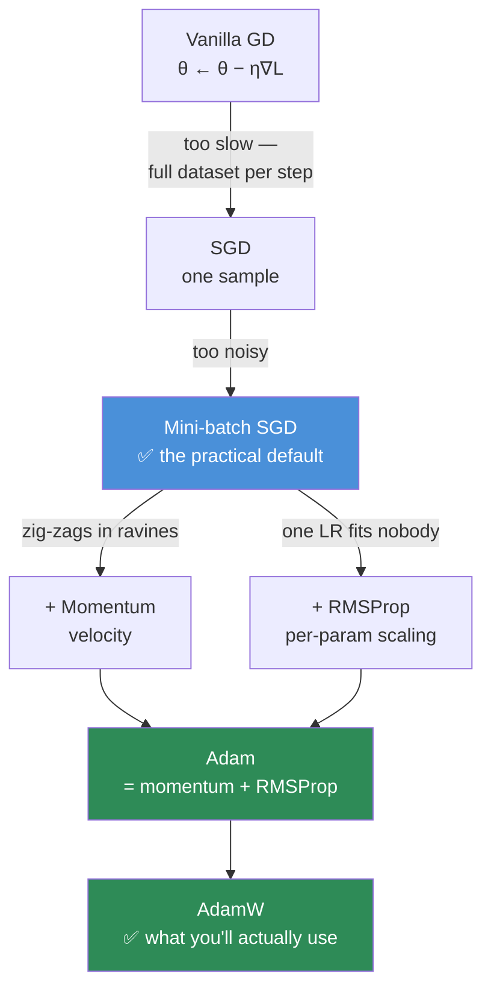
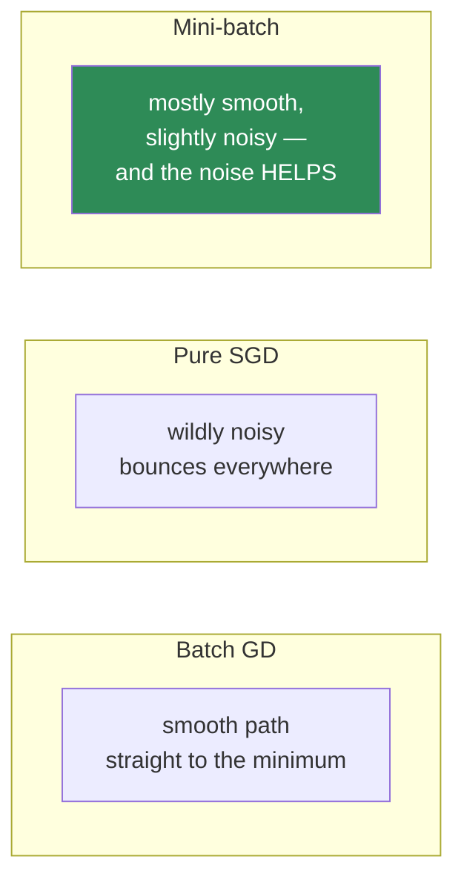
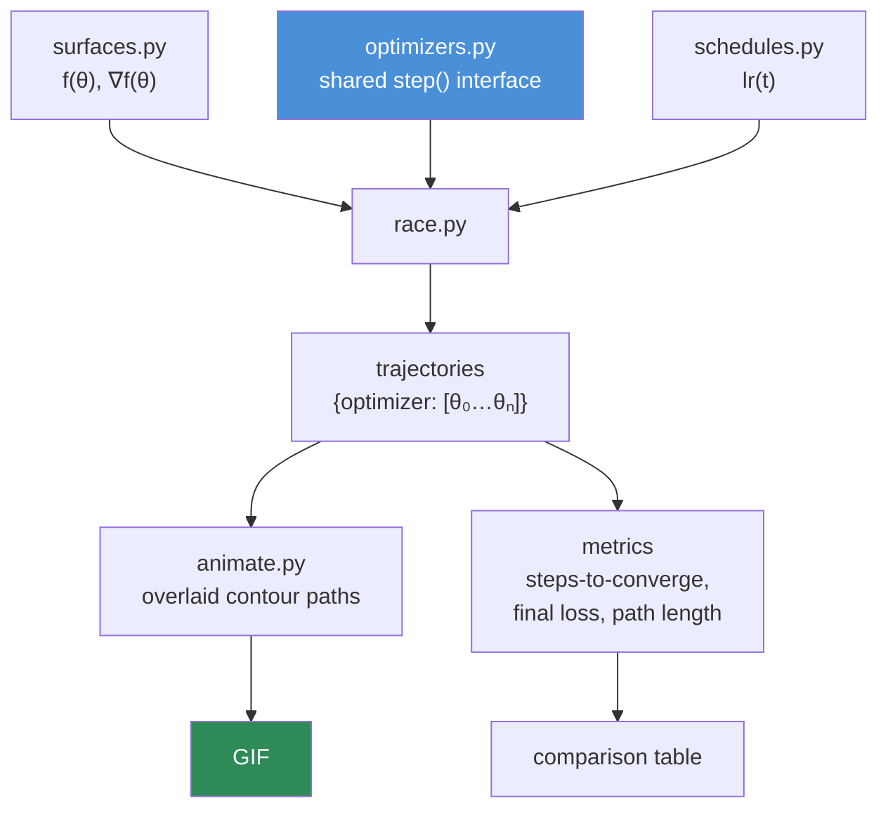

# 06.7 · Optimization

[⬅ 06.6 Statistics](06.6-statistics.md) · [🏠 Module 06](../README.md) · [➡ 06.8 Information Theory](06.8-information-theory.md)

> **The lesson in one line:** Training is a blindfolded walk downhill through a billion-dimensional fog — and every optimizer from SGD to Adam is a different strategy for taking that next step.

---

## 🎯 Learning objectives

By the end of this lesson you can:

1. Distinguish a **cost function** from a **loss function**, and choose the right loss for a task.
2. Explain why **convexity** matters — and why deep learning abandoned it anyway.
3. Explain the **batch / stochastic / mini-batch** trade-off in terms of *gradient noise* and *hardware*.
4. Derive **momentum**, **RMSProp**, and **Adam** as three fixes to three specific failures of vanilla SGD.
5. Implement every optimizer in this lesson in NumPy, in under 10 lines each.
6. Choose a learning rate, a schedule, and an optimizer — and defend the choice.

---

## 🧠 Mental model

> **Every optimizer is answering one question: given the gradient, how big a step should I take, and in exactly which direction?**

Vanilla gradient descent gives the naive answer: *"step opposite the gradient, scaled by a fixed learning rate."* Every improvement since is a response to a specific way that answer fails:

| Failure of vanilla SGD | The fix | The optimizer |
|---|---|---|
| Zig-zags across ravines; stalls on plateaus | **Remember past gradients** | **Momentum** |
| One learning rate can't suit all parameters | **Per-parameter learning rates** | **RMSProp / AdaGrad** |
| Want both | **Do both** | **Adam** |

**That table is the entire lesson.** Everything below is the detail. Adam is not a monolith to memorize; it's momentum + RMSProp, and both of *those* are one-line ideas.



---

## 1 · Cost Functions & Loss Functions

### The distinction (which papers routinely blur)

| Term | Scope |
|---|---|
| **Loss function** | Error on **one example**: $L(\hat{y}_i, y_i)$ |
| **Cost function** | Average loss over the **whole dataset/batch**: $J(\theta) = \frac{1}{n}\sum_i L(\hat{y}_i, y_i)$ |
| **Objective** | Whatever you're optimizing, including regularization: $J(\theta) + \lambda\|\theta\|^2$ |

In practice everyone says "loss" for all three. Know the distinction; don't be pedantic about it.

### The losses you'll actually use

| Task | Loss | Formula | Why this one |
|---|---|---|---|
| Regression | **MSE** | $\frac{1}{n}\sum(\hat{y}-y)^2$ | Smooth, differentiable; **punishes big errors quadratically** |
| Regression, outlier-heavy | **MAE / Huber** | $\lvert\hat{y}-y\rvert$ / hybrid | Robust — doesn't let one outlier dominate |
| Binary classification | **Binary cross-entropy** | $-[y\log\hat{p} + (1-y)\log(1-\hat{p})]$ | Probabilistic; steep gradient when confidently wrong |
| Multi-class | **Cross-entropy** | $-\sum_c y_c \log \hat{p}_c$ | **The loss of every classifier and every LLM** ([06.8](06.8-information-theory.md)) |
| Embeddings / retrieval | **Contrastive / InfoNCE** | pull positives close, push negatives apart | Learns a *geometry*, not a label |
| Ranking | **Pairwise hinge** | $\max(0, m - s^+ + s^-)$ | Only relative order matters |
| RLHF | **PPO / DPO objective** | reward − β·KL | Improve, but don't drift from the reference model |

> [!IMPORTANT]
> **Choosing a loss is choosing what the model is *allowed to be wrong about*.** MSE says "a 10-unit error is 100× worse than a 1-unit error" — so a single outlier will dominate training. MAE says it's only 10× worse. Cross-entropy says "being confidently wrong is nearly infinitely bad" (because $-\log(0) = \infty$). **The loss function is where you encode what you actually care about**, and it is the most under-considered design decision in most ML projects. If the model is optimizing the wrong thing, no optimizer will save you.

### Why MSE uses a square

Three reasons, and the third is the real one:
1. It makes errors positive (so they don't cancel).
2. It punishes large errors disproportionately.
3. **It's smoothly differentiable everywhere.** MAE has a kink at zero (its derivative jumps from −1 to +1), which makes gradient descent bounce around the minimum. Differentiability is a *requirement*, not a nicety — and it quietly dictates a lot of ML design.

```python
import numpy as np

y_true = np.array([3.0, -0.5, 2.0, 7.0])
y_pred = np.array([2.5,  0.0, 2.0, 8.0])

mse = np.mean((y_pred - y_true)**2)
mae = np.mean(np.abs(y_pred - y_true))
print(f"MSE={mse:.3f}  MAE={mae:.3f}")

# Now add ONE outlier and watch what happens
y_true_out = np.append(y_true, 5.0)
y_pred_out = np.append(y_pred, 50.0)       # a catastrophic single prediction
print(f"MSE={np.mean((y_pred_out-y_true_out)**2):8.2f}  "   # 405.31  ← DOMINATED
      f"MAE={np.mean(np.abs(y_pred_out-y_true_out)):8.2f}")  #   9.40  ← absorbed
```

**One bad label just multiplied your MSE by 900×.** The model will now spend most of its capacity trying to fit that single corrupted point. **If your data has outliers or noisy labels, MSE is a trap** — reach for Huber loss, which is quadratic near zero (smooth gradients) and linear far away (outlier-resistant).

---

## 2 · Convex Optimization — and why deep learning gave up on it

### Intuition

A function is **convex** if it's bowl-shaped: any line drawn between two points on the curve lies *above* the curve. Formally, it has exactly one minimum, and no local traps.

**Convexity is a beautiful guarantee:**
- Any local minimum is the **global** minimum.
- Gradient descent **provably converges**.
- You can prove convergence rates and stop worrying.

| Convex | Non-convex |
|---|---|
| Linear regression | **Every neural network** |
| Logistic regression | Anything with a hidden layer |
| SVMs, LASSO/Ridge | Transformers, CNNs, everything you care about |

### The uncomfortable truth

**Neural network loss surfaces are wildly non-convex.** There are no guarantees. Gradient descent could get stuck. The theory says you're in trouble.

**And yet it works spectacularly.** Why?

> [!IMPORTANT]
> **Three empirical findings explain the paradox — and none of them were obvious in advance:**
> 1. **In high dimensions, local minima are rare; saddle points dominate** ([06.4](06.4-calculus.md)). For a critical point to be a *bad* local minimum, all ~7 billion Hessian eigenvalues must be positive — astronomically unlikely. Most critical points are saddles, and **momentum escapes saddles.**
> 2. **Most local minima are about equally good.** In an overparameterized network, the many minima that exist have similar loss values. You don't need *the* global minimum — you need *a* good one, and almost all of them are.
> 3. **Overparameterization smooths the landscape.** Bigger models are, counterintuitively, *easier* to optimize. This is one of deep learning's genuinely surprising empirical facts, and it's part of why "just make it bigger" kept working.
>
> **Deep learning traded mathematical guarantees for empirical performance — and won.** That trade is worth sitting with. It is the defining epistemic character of the field: the theory came *after* the results, and in many places it still hasn't arrived.

> 🖼️ **[IMAGE PLACEHOLDER: `assets/images/06-convex-vs-nonconvex.png`]**
> *Two 3-D surface plots side by side. Left: a clean parabolic bowl, single minimum marked with a green dot, labelled "CONVEX — linear/logistic regression. One minimum. Guaranteed convergence." Right: a rugged, mountainous landscape with several valleys of similar depth, a prominent saddle point in the middle (marked with an orange dot), and several green dots of near-equal height, labelled "NON-CONVEX — every neural network. Many minima, mostly of similar quality. Saddles are the real obstacle." A dashed red path shows an optimizer escaping the saddle and settling into one of the valleys.*

---

## 3 · Gradient Descent Variants — Batch, Stochastic, Mini-batch

All three use the identical update rule:

$$\theta \leftarrow \theta - \eta \nabla_\theta J(\theta)$$

They differ **only in how much data they use to estimate that gradient** — and that choice is a trade between *noise* and *hardware*.

| Variant | Data per step | Gradient quality | Speed | Verdict |
|---|---|---|---|---|
| **Batch GD** | **All** n examples | Exact, smooth | 1 update per epoch — glacial | ❌ Impossible at scale (can't fit the dataset in memory) |
| **SGD** (true) | **1** example | Very noisy | Fast updates, terrible hardware use | ❌ Wastes the GPU entirely |
| **Mini-batch** | **32–1024** | Good estimate | **Fast + parallel** | ✅ **The universal choice** |

### Why mini-batch wins — and the noise is a *feature*



> [!IMPORTANT]
> **Gradient noise is not a bug you tolerate — it's a regularizer you want.** The noisy gradient from a mini-batch lets the optimizer **jump out of sharp minima and saddle points**, and it biases training toward **flat minima**, which generalize better. A perfectly computed full-batch gradient would descend into the nearest sharp hole and stay there. **The stochasticity in SGD is part of why deep learning generalizes at all** — and that is a genuinely counterintuitive result: the *sloppiness* is doing useful work.

**And the hardware argument seals it:** a GPU processing 1 example uses ~1% of its cores. Processing 256 examples uses them all, for barely more wall-clock time. Mini-batch isn't a compromise — **it's the only choice that's both statistically sound and hardware-sane.**

### Batch size — the trade-offs

| Batch size | Effect |
|---|---|
| **Small (8–32)** | Noisier gradients → more regularization, better generalization; poor GPU utilization |
| **Large (1024+)** | Smoother gradients, faster epochs, better hardware use; **generalizes worse**, needs LR warmup |
| **Rule of thumb** | Largest that fits in memory *and* still generalizes. Then tune the LR to match |

> [!TIP]
> **The linear scaling rule:** if you multiply the batch size by k, multiply the learning rate by k too (with a warmup period). A bigger batch gives a *less noisy* gradient, so you can safely take a *bigger* step. This is how large-batch training on hundreds of GPUs stays stable — and it follows directly from the standard error rule in [06.6](06.6-statistics.md): gradient noise falls as $1/\sqrt{B}$.

---

## 4 · Momentum

### The problem it solves

Recall the ravine from [06.4](06.4-calculus.md): $f(x,y) = x^2 + 10y^2$. Gradient descent **zig-zags** — bouncing across the steep y-direction while creeping along the shallow x-direction toward the actual minimum. The condition number ($\lambda_{\max}/\lambda_{\min} = 10$) is precisely how bad the zig-zag is.

**And most loss landscapes are ravines**, with condition numbers in the thousands.

### The idea: give the ball mass

Instead of stepping purely on the *current* gradient, accumulate a **velocity** — an exponentially-decayed running average of past gradients:

$$v_t = \beta v_{t-1} + \nabla L(\theta_t)$$
$$\theta_{t+1} = \theta_t - \eta \, v_t$$

with $\beta = 0.9$ typically.

**Physical intuition: you've turned a sliding point into a rolling ball with momentum.**

| Situation | What momentum does |
|---|---|
| Gradients keep pointing the same way (the ravine's long axis) | They **accumulate** → the ball accelerates → faster progress ✅ |
| Gradients keep flipping sign (the zig-zag axis) | They **cancel out** → oscillation is damped ✅ |
| Gradient is ~0 (plateau or saddle) | Existing velocity **carries you through** ✅ |

**Three problems, one fix.** With $\beta = 0.9$, momentum effectively averages the last ~10 gradients ($1/(1-\beta)$), and gives you an effective learning rate up to 10× larger along consistent directions.

```python
import numpy as np

def sgd(grad_fn, theta, lr=0.05, steps=50):
    path = [theta.copy()]
    for _ in range(steps):
        theta = theta - lr * grad_fn(theta)
        path.append(theta.copy())
    return np.array(path)

def momentum(grad_fn, theta, lr=0.05, beta=0.9, steps=50):
    v = np.zeros_like(theta)
    path = [theta.copy()]
    for _ in range(steps):
        v = beta * v + grad_fn(theta)      # ← accumulate velocity
        theta = theta - lr * v             # ← step along velocity, not the raw gradient
        path.append(theta.copy())
    return np.array(path)

# The ravine: f(x,y) = x² + 10y²
grad = lambda p: np.array([2*p[0], 20*p[1]])
start = np.array([5.0, 5.0])

print("SGD      final:", sgd(grad, start.copy()))      # still far from [0,0]
print("Momentum final:", momentum(grad, start.copy())) # much closer, much faster
```

**Plot both paths on a contour map.** SGD zig-zags visibly; momentum cuts a smooth diagonal. It is the most convincing 20 lines of code in this module.

> [!NOTE]
> **Nesterov momentum** is a refinement: compute the gradient at the position where the velocity is *about to take you*, rather than where you currently are. It's a "look-ahead" that lets the ball start braking before it overshoots. Slightly better in theory and practice; `nesterov=True` in most frameworks. Worth knowing, not worth agonizing over.

---

## 5 · RMSProp & AdaGrad

### The problem it solves

**One global learning rate cannot suit every parameter.** In a real network:
- Some parameters get **huge** gradients (they need small steps).
- Some get **tiny** gradients (rare features, sparse embeddings — they need big steps).

With a single η, you must pick a rate small enough not to blow up the loud parameters — which means the quiet ones barely move at all. In an embedding table with 50,000 tokens, most rows are touched rarely; a global learning rate leaves them permanently undertrained.

### The idea: normalize by recent gradient magnitude

**AdaGrad** divides each parameter's step by the square root of its accumulated squared gradients:

$$s_t = s_{t-1} + (\nabla L)^2 \qquad \theta \leftarrow \theta - \frac{\eta}{\sqrt{s_t} + \epsilon}\nabla L$$

Parameters with historically large gradients get **smaller** steps; those with small gradients get **larger** ones. Every parameter gets its own effective learning rate, for free.

**AdaGrad's fatal flaw:** $s_t$ only ever *grows* (it's a sum of squares). So the learning rate monotonically decays to zero, and **training grinds to a halt** before convergence.

**RMSProp's fix — one character:** replace the sum with an **exponential moving average**, so old gradients are forgotten:

$$s_t = \beta s_{t-1} + (1-\beta)(\nabla L)^2 \qquad \theta \leftarrow \theta - \frac{\eta}{\sqrt{s_t}+\epsilon}\nabla L$$

Now $s_t$ tracks *recent* gradient magnitude and can shrink again. The learning rate stops dying.

```python
def rmsprop(grad_fn, theta, lr=0.01, beta=0.9, eps=1e-8, steps=50):
    s = np.zeros_like(theta)
    for _ in range(steps):
        g = grad_fn(theta)
        s = beta * s + (1 - beta) * g**2         # EMA of squared gradients
        theta = theta - lr * g / (np.sqrt(s) + eps)   # per-parameter scaling
    return theta
```

> [!TIP]
> **The `eps` (usually 1e-8) is not decoration.** Without it, a parameter whose gradient has been ~0 gets divided by ~0, producing an infinite step and an instant `NaN`. It's a **numerical stability guard** ([06.9](06.9-numerical-computing.md)) — one of many places where a tiny constant is the only thing standing between you and a corrupted training run.

---

## 6 · Adam — the default, and why

### The idea

**Adam = Momentum + RMSProp.** That's genuinely all it is. Two running averages instead of one:

$$m_t = \beta_1 m_{t-1} + (1-\beta_1)\nabla L \qquad \text{← momentum (1st moment: the mean)}$$
$$v_t = \beta_2 v_{t-1} + (1-\beta_2)(\nabla L)^2 \qquad \text{← RMSProp (2nd moment: the variance)}$$

$$\hat{m}_t = \frac{m_t}{1-\beta_1^t} \qquad \hat{v}_t = \frac{v_t}{1-\beta_2^t} \qquad \text{← bias correction}$$

$$\theta \leftarrow \theta - \frac{\eta}{\sqrt{\hat{v}_t}+\epsilon}\hat{m}_t$$

**Defaults that work almost everywhere:** $\beta_1 = 0.9$, $\beta_2 = 0.999$, $\epsilon = 10^{-8}$, $\eta = 10^{-3}$ (or $10^{-4}$–$10^{-5}$ for fine-tuning LLMs).

### What is bias correction, and why does it matter?

Both $m$ and $v$ start at **zero**. So at step 1, $m_1 = 0.1 \times \nabla L$ — the estimate is biased *toward zero* by a factor of 10, and the first steps are far too small. Dividing by $(1 - \beta_1^t)$ exactly undoes this. As $t$ grows, $\beta_1^t \to 0$ and the correction fades to 1.

> [!NOTE]
> **The bias-correction term matters most in the first ~100 steps** — precisely when your model is most fragile. Without it, Adam takes tiny, hesitant early steps. It's a small mathematical detail with a real training effect, and it's a lovely example of *taking a formula seriously*: someone noticed the estimator was biased and just... fixed it.

### Full implementation — 12 lines

```python
import numpy as np

def adam(grad_fn, theta, lr=0.01, b1=0.9, b2=0.999, eps=1e-8, steps=100):
    m = np.zeros_like(theta)      # 1st moment — momentum
    v = np.zeros_like(theta)      # 2nd moment — RMSProp
    path = [theta.copy()]
    for t in range(1, steps + 1):
        g  = grad_fn(theta)
        m  = b1 * m + (1 - b1) * g          # momentum
        v  = b2 * v + (1 - b2) * g**2       # per-parameter scale
        m_hat = m / (1 - b1**t)             # bias correction
        v_hat = v / (1 - b2**t)             # bias correction
        theta = theta - lr * m_hat / (np.sqrt(v_hat) + eps)
        path.append(theta.copy())
    return np.array(path)

# The ravine again
grad  = lambda p: np.array([2*p[0], 20*p[1]])
print("Adam final:", adam(grad, np.array([5.0, 5.0]))[-1])   # → very close to [0,0]
```

**That's the optimizer that trained GPT.** Twelve lines. You just wrote it.

### AdamW — the one you'll actually use

Standard Adam implements **L2 regularization** by adding $\lambda\theta$ to the gradient. But then that penalty gets divided by $\sqrt{\hat{v}}$ along with everything else — so **parameters with large gradients get *less* regularization**, which is exactly backwards from what you want.

**AdamW** ("decoupled weight decay") applies the decay **directly to the weights**, outside the adaptive scaling:

$$\theta \leftarrow \theta - \eta\left(\frac{\hat{m}_t}{\sqrt{\hat{v}_t}+\epsilon} + \lambda\theta\right)$$

> [!IMPORTANT]
> **Use AdamW, not Adam.** Every serious LLM — GPT, LLaMA, Mistral — is trained with AdamW. The fix is one line of code and it measurably improves generalization. This is a case where a small mathematical observation (*"the decay shouldn't be scaled by the second moment"*) became the field-wide default within two years. **Reading and understanding the Loshchilov & Hutter paper is a two-hour investment that will make you better at your job.**

### The optimizer comparison table

| Optimizer | Memory | Converges | Generalizes | Use when |
|---|---|---|---|---|
| **SGD** | 1× params | Slow | ✅ Often **best** | You have time to tune; vision (ResNets, with momentum) |
| **SGD + Momentum** | 2× | Good | ✅ Excellent | The classic vision default |
| **AdaGrad** | 2× | Fast then **stalls** | OK | Sparse features (historical) |
| **RMSProp** | 2× | Good | OK | RNNs (historical) |
| **Adam** | **3×** | ✅ **Fast, robust** | Good | The safe default for anything new |
| **AdamW** | 3× | ✅ Fast, robust | ✅ **Better** | **✅ LLMs, Transformers — the modern default** |

> [!WARNING]
> **Adam costs 3× the parameter memory.** For a 7B model in fp32: 28 GB of weights + **56 GB of optimizer state** (m and v). This is why full fine-tuning a 7B model needs ~80 GB of VRAM while *inference* needs only 14 GB — **the optimizer state, not the model, is what doesn't fit.** It is the single biggest reason LoRA exists ([06.3](06.3-linear-algebra-decomposition.md)): with LoRA you only keep optimizer state for the tiny adapter matrices. **A linear algebra insight and a memory-accounting insight, combining to make consumer-GPU fine-tuning possible.**

### Why SGD sometimes still beats Adam

Adam converges *faster*, but SGD+momentum often **generalizes better** — especially in computer vision. The leading explanation: Adam's per-parameter scaling drives it toward **sharp** minima, while SGD's uniform noise favours **flat** ones, which generalize better. Many SOTA vision results still use plain SGD+momentum with a good schedule.

**For Transformers and LLMs, AdamW dominates unambiguously** — the gradient scales across a Transformer's parameters vary so wildly (embeddings vs. layer norms vs. attention projections) that adaptive per-parameter rates are essentially mandatory.

---

## 7 · Learning Rate — the hyperparameter that matters most

> [!IMPORTANT]
> **If you can tune exactly one hyperparameter, tune the learning rate.** It matters more than architecture, more than batch size, more than the optimizer choice. A well-tuned SGD beats a badly-tuned Adam every time.

| LR | Symptom |
|---|---|
| **Too small** | Loss decreases painfully slowly; you waste days of compute |
| **Just right** | Loss drops steadily then plateaus |
| **Too large** | Loss oscillates, or spikes, or goes to **NaN** |

Recall from [06.4](06.4-calculus.md): the stability threshold is $\eta < 2/\lambda_{\max}(H)$. You now know *why* too-large a learning rate diverges — it's an eigenvalue fact, not a mystery.

### Learning rate schedules

Nobody uses a constant LR. **Start big (explore), end small (settle).**

| Schedule | Shape | Used by |
|---|---|---|
| **Step decay** | Drop 10× at fixed epochs | Classic vision |
| **Cosine annealing** | Smooth decay following a half-cosine | ✅ **The modern default** |
| **Linear warmup + cosine decay** | Ramp up, then cosine down | ✅ **Every LLM** |
| **One-cycle** | Up then down, aggressively | fast.ai; very effective |
| **ReduceLROnPlateau** | Cut when val loss stalls | Reactive; a safe fallback |

> [!TIP]
> **Why do LLMs need warmup?** In the first few steps, Adam's second-moment estimate $v$ is based on almost no data and is unreliable — so the adaptive step sizes are erratic and can blow up an untrained model instantly. Warmup (linearly ramping the LR from 0 over ~2000 steps) gives $v$ time to become a sensible estimate before you take full-size steps. **Warmup is a statistics fix for an optimizer's cold-start problem** — and it is not optional for Transformers.

```python
import numpy as np

def cosine_schedule(step, total, base_lr=1e-3, warmup=1000, min_lr=0.0):
    if step < warmup:
        return base_lr * step / warmup                       # linear warmup
    progress = (step - warmup) / max(1, total - warmup)
    return min_lr + 0.5 * (base_lr - min_lr) * (1 + np.cos(np.pi * progress))

# Plot it — you'll see the ramp-up, then the graceful cosine decay to ~0.
lrs = [cosine_schedule(s, 10_000) for s in range(10_000)]
```

**Plot `lrs`.** That curve trained every LLM you've ever used.

---

## 🐛 Common mistakes

| Mistake | Symptom | Fix |
|---|---|---|
| Learning rate too high | Loss → NaN or oscillates | Lower it 10×; use an LR finder; add warmup |
| Learning rate too low | Loss barely moves | Raise it; check gradients aren't zero |
| No warmup with Adam on a Transformer | Early instability, divergence | Linear warmup over ~2k steps |
| Using **Adam** instead of **AdamW** | Weight decay is silently scaled wrongly | `torch.optim.AdamW` |
| Forgetting `zero_grad()` | Gradients accumulate across batches | Zero every step |
| MSE on data with outliers | One bad label dominates the loss | Huber loss; clean the data |
| Batch size ↑ without LR ↑ | Slower convergence than expected | Linear scaling rule + warmup |
| Ignoring optimizer memory | OOM when fine-tuning | Adam = 3× params. Use LoRA / 8-bit Adam / gradient checkpointing |
| No LR schedule | Loss plateaus early and stays there | Cosine decay |
| `eps=0` in Adam/RMSProp | Division by ~0 → NaN | Keep `eps=1e-8` |
| Assuming Adam always wins | Sometimes SGD+momentum generalizes better | Try both on vision tasks |

---

## 📝 Exercises

**Conceptual**
1. Explain, in terms of the *gradient*, exactly what momentum does in a ravine and on a plateau.
2. Why is Adam = momentum + RMSProp? Name what each half contributes.
3. Why is gradient noise from mini-batching *good*?
4. Why does full fine-tuning a 7B model need ~5× more memory than inference? Do the arithmetic.
5. Deep learning is non-convex, so there are no guarantees. Why does it work anyway? Give three reasons.
6. What is bias correction in Adam, and when does it matter most?

**Intuition**
7. Your loss goes to NaN at step 300. List five candidate causes, ranked by likelihood.
8. Your loss decreases for 1000 steps and then flatlines at a high value. Diagnose.
9. You increase batch size from 32 to 512. What should you do to the learning rate, and why?
10. Why do Transformers need LR warmup but ResNets often don't?

**NumPy**
11. Implement **all five** optimizers (SGD, momentum, AdaGrad, RMSProp, Adam) with a shared interface. ~10 lines each.
12. Run all five on the ravine $f(x,y) = x^2 + 10y^2$ from `[5,5]`. **Plot all five trajectories on one contour map.** This single figure teaches more about optimization than any explanation.
13. Run all five on the **Rosenbrock** function (the classic curved-valley torture test). Watch which ones survive.
14. Implement `cosine_schedule` with warmup and plot it.
15. Demonstrate AdaGrad's death: plot its effective learning rate over 1000 steps and watch it decay to zero.

**Visualization**
16. Animate SGD vs Momentum vs Adam descending the ravine, side by side. Export as a GIF. **This is the artifact to put in your portfolio.**
17. Plot loss curves for LR ∈ {1e-1, 1e-2, 1e-3, 1e-4, 1e-5} on the same axes. You'll see divergence, the sweet spot, and glacial crawling — the classic "LR finder" plot.
18. Plot the loss landscape of a tiny 2-parameter network and overlay the optimizer's path.

**Equation interpretation**
19. Read the full Adam update. Name every symbol, state every shape, and say what each of the four lines does.
20. Read $\theta \leftarrow \theta - \eta(\frac{\hat{m}}{\sqrt{\hat{v}}+\epsilon} + \lambda\theta)$ and explain precisely how AdamW differs from Adam.

---

## 🛠️ Mini project — *The Optimizer Zoo*

Build `code/06-mathematics/optimizer-zoo/` — implement every optimizer, race them, and *see* why Adam won.

```
optimizer-zoo/
├── README.md
├── src/
│   ├── optimizers.py      # SGD, Momentum, Nesterov, AdaGrad, RMSProp, Adam, AdamW
│   ├── surfaces.py        # bowl, ravine, saddle, Rosenbrock, Beale
│   ├── schedules.py       # constant, step, cosine, warmup+cosine, one-cycle
│   ├── race.py            # run all optimizers on all surfaces
│   └── animate.py         # side-by-side GIF
├── tests/
│   └── test_optimizers.py # each must converge on the convex bowl
└── outputs/
    ├── race_ravine.gif
    └── lr_finder.png
```

**Architecture**



**Implementation guidance**
1. **One interface for all optimizers:**
   ```python
   class Optimizer:
       def step(self, theta, grad):  # returns the new theta
           raise NotImplementedError
   ```
   Each optimizer holds its own state (`v`, `m`, `s`, `t`). This is *exactly* how `torch.optim` is structured — you're not simplifying, you're reimplementing.
2. **`surfaces.py`** — the **ravine** ($x^2 + 10y^2$) is the essential one; it's where momentum and Adam visibly earn their keep. Add **Rosenbrock** for a real challenge and a **saddle** ($x^2 - y^2$) to demonstrate momentum escaping it.
3. **`race.py` produces a table:** steps-to-converge, final loss, and total path length per (optimizer, surface). **Path length is the underrated metric** — it quantifies the zig-zagging that momentum eliminates.
4. **`animate.py` is the payoff.** Five dots descending the same contour map. SGD visibly zig-zagging; momentum overshooting slightly then correcting; Adam gliding almost straight down. **When you watch this, optimization stops being a list of formulas and becomes a physical intuition you own permanently.**
5. **The LR finder:** sweep the learning rate exponentially from 1e-6 to 1, plot loss vs. LR on a log axis, and find the steepest-descent region. This is a genuinely useful production tool — you'll reuse it.

**Stretch goals**
- Add **8-bit Adam** (quantized optimizer state) and measure the memory saving.
- Add gradient clipping and show it rescuing a run that would otherwise NaN.
- Train a small MLP on MNIST with each optimizer; compare wall-clock time to 95% accuracy. Reality is messier than the toy surfaces, and that's instructive.

---

## 📄 Cheat sheet

| Optimizer | Update | Key idea |
|---|---|---|
| **SGD** | $\theta \mathrel{-}= \eta g$ | step downhill |
| **Momentum** | $v = \beta v + g;\ \theta \mathrel{-}= \eta v$ | **remember past gradients** |
| **AdaGrad** | $s \mathrel{+}= g^2;\ \theta \mathrel{-}= \frac{\eta g}{\sqrt{s}+\epsilon}$ | per-param LR — **but it dies** |
| **RMSProp** | $s = \beta s + (1{-}\beta)g^2$ | **EMA** so it doesn't die |
| **Adam** | momentum + RMSProp + bias correction | ✅ robust default |
| **AdamW** | Adam, decay applied outside the scaling | ✅ **the LLM default** |

| Concept | Rule |
|---|---|
| Loss for regression | MSE (clean data) / **Huber** (outliers) |
| Loss for classification | **Cross-entropy** |
| Batch size | Largest that fits and still generalizes |
| **Linear scaling rule** | batch ×k → LR ×k (+ warmup) |
| **LR is the #1 hyperparameter** | Tune it first, tune it most |
| Stability bound | $\eta < 2/\lambda_{\max}(H)$ |
| Schedule | **warmup + cosine decay** |
| Adam memory | **3× params** (weights + m + v) |
| Warmup exists because | Adam's `v` estimate is unreliable at step 0 |
| Gradient noise | A **feature** — finds flat minima |
| Deep learning is non-convex | Works anyway: saddles ≫ minima; most minima are fine |

---

## 🎴 Flashcards

- **Q:** What problem does momentum solve? → **A:** Zig-zagging in ravines and stalling on plateaus/saddles — it accumulates a velocity so consistent gradients build up and oscillating ones cancel.
- **Q:** What problem does RMSProp solve? → **A:** One global learning rate can't suit all parameters. It divides each step by an EMA of that parameter's recent squared gradients.
- **Q:** What is Adam? → **A:** Momentum (1st moment) + RMSProp (2nd moment) + bias correction. Three ideas, twelve lines.
- **Q:** Why AdamW over Adam? → **A:** Adam's L2 penalty gets divided by √v along with the gradient, so heavily-updated params get less decay. AdamW decouples it. Standard for all LLMs.
- **Q:** How much memory does Adam add? → **A:** 2 extra copies of the parameters (m and v) → **3× total**. It's why fine-tuning needs far more VRAM than inference, and a core motivation for LoRA.
- **Q:** Why is mini-batch better than both full-batch and single-sample? → **A:** Full batch is too slow and too smooth; single-sample wastes the GPU. Mini-batch gets a good gradient estimate, uses the hardware, and its **noise acts as a regularizer**.
- **Q:** Why does gradient noise help? → **A:** It escapes sharp minima and saddles, biasing training toward **flat** minima, which generalize better.
- **Q:** Why do Transformers need LR warmup? → **A:** Adam's second-moment estimate is unreliable in the first steps, so full-size adaptive steps can destabilize an untrained model.
- **Q:** Deep nets are non-convex — why does GD work? → **A:** In high dimensions saddles vastly outnumber local minima (momentum escapes saddles), most minima are of similar quality, and overparameterization smooths the landscape.
- **Q:** What's the most important hyperparameter? → **A:** The **learning rate**, by a wide margin.
- **Q:** Linear scaling rule? → **A:** Multiply batch size by k → multiply LR by k (with warmup). Larger batches give less noisy gradients, so bigger steps are safe.
- **Q:** Why does MSE fail with outliers? → **A:** Errors are squared, so one 10× outlier contributes 100× the loss and dominates training. Use Huber.

---

## 💼 Interview questions

1. **"Explain Adam."** — Momentum + RMSProp + bias correction. Then say *why each part exists* (ravines; per-parameter scales; zero-initialized estimates). Then volunteer AdamW and the memory cost. That answer is complete.
2. **"Your loss is NaN. Debug it."** — LR too high; exploding gradients; log(0)/exp(overflow) in the loss; bad init; `eps=0`; a corrupted batch. Fixes: lower LR, warmup, clip gradients, check the data.
3. **"Why does full fine-tuning need so much more memory than inference?"** — Weights + gradients + **Adam's two moment buffers** ≈ 4× the weights, plus activations for backprop. Lead into LoRA/QLoRA.
4. **"When would you use SGD over Adam?"** — Vision, where SGD+momentum often generalizes better (flatter minima), and when you have the budget to tune the schedule properly.
5. **"Why do we use mini-batches?"** — Hardware utilization *and* the regularizing effect of gradient noise. Both halves matter — most candidates give only the first.
6. **"Deep learning is non-convex. Why doesn't it get stuck?"** — Saddles dominate over local minima in high dimensions; momentum escapes them; most minima are of comparable quality; overparameterization smooths the landscape.
7. **"How do you choose a learning rate?"** — LR range test (exponential sweep, plot loss vs LR), pick the steepest-descent region, then apply warmup + cosine decay.

---

## 📚 Summary

- **The loss function encodes what you care about.** MSE punishes outliers quadratically (a trap on noisy data); cross-entropy punishes confident wrongness nearly infinitely. Choosing it is a design decision, not a default.
- **Deep learning is non-convex** and has no guarantees — yet works, because **saddles outnumber local minima**, most minima are equally good, and overparameterization smooths the landscape. Theory came *after* the results.
- **Mini-batch is the universal choice**: it estimates the gradient well, saturates the GPU, and its **noise is a regularizer** that finds flat, generalizing minima.
- **Momentum** accumulates a velocity → kills ravine zig-zag, powers through plateaus and saddles.
- **RMSProp** gives each parameter its own learning rate via an EMA of squared gradients (AdaGrad had the idea but its LR decays to zero).
- **Adam = momentum + RMSProp + bias correction.** Twelve lines. **AdamW** decouples weight decay and is the modern default for every Transformer.
- **Adam costs 3× parameter memory** — the reason full fine-tuning doesn't fit on your GPU, and a core motivation for **LoRA**.
- **The learning rate is the single most important hyperparameter.** Use **warmup + cosine decay**; warmup exists because Adam's variance estimate is unreliable at step 0.

**Next:** [06.8 Information Theory](06.8-information-theory.md) — where we finally derive *why* cross-entropy is the loss function of every classifier and every LLM.

---

## 🔗 References

- Kingma & Ba (2014) — *Adam: A Method for Stochastic Optimization*. **You can read this paper now** — you've implemented its central algorithm.
- Loshchilov & Hutter (2019) — *Decoupled Weight Decay Regularization* (**AdamW**). A short paper, a one-line fix, a field-wide default.
- Ruder (2016) — *An overview of gradient descent optimization algorithms* (blog). The best single survey; read it after this lesson and it'll all be familiar.
- Goodfellow et al. — *Deep Learning*, Ch. 8 (Optimization for Training Deep Models).
- Dauphin et al. (2014) — *Identifying and attacking the saddle point problem* — the paper that established saddles, not local minima, as the real obstacle.
- Keskar et al. (2017) — *On Large-Batch Training* — the sharp-vs-flat minima argument, and why batch size affects generalization.
- Smith (2018) — *A disciplined approach to neural network hyper-parameters* — the LR range test and one-cycle.
- distill.pub — *Why Momentum Really Works* — a genuinely beautiful interactive explanation.

---

## 🧭 Navigation

| Direction | Link |
|---|---|
| ⬅ Previous | [06.6 Statistics](06.6-statistics.md) |
| ➡ Next | [06.8 Information Theory](06.8-information-theory.md) |
| 🏠 Module | [Module 06](../README.md) |
| 🗺 Roadmap | [ROADMAP.md](../../../ROADMAP.md) |
