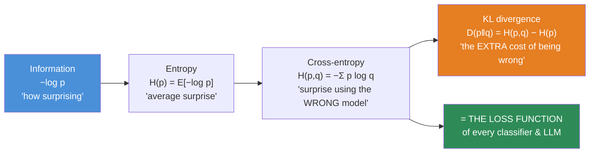
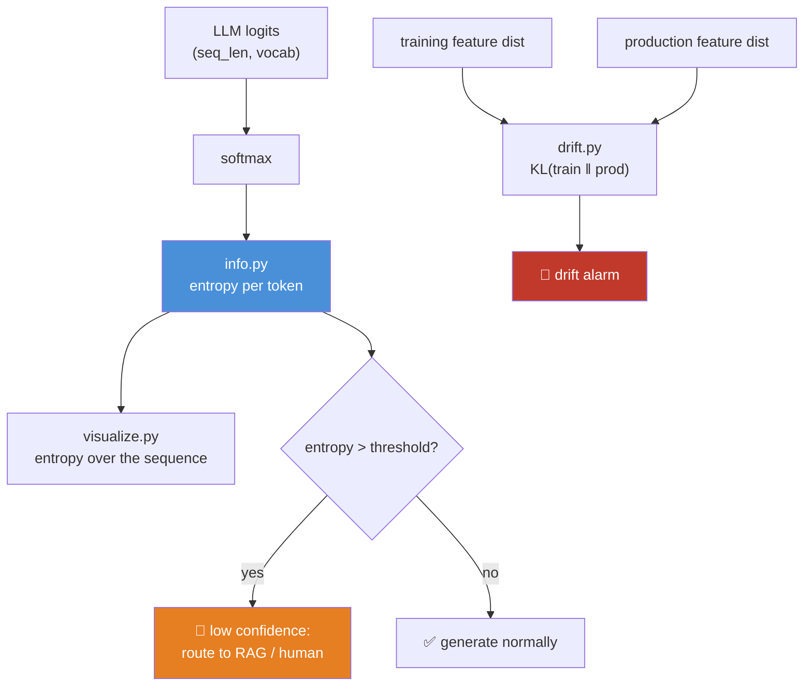

# 06.8 · Information Theory

[⬅ 06.7 Optimization](06.7-optimization.md) · [🏠 Module 06](../README.md) · [➡ 06.9 Numerical Computing](06.9-numerical-computing.md)

> **The lesson in one line:** Information is *surprise* — and once you can measure surprise, you have derived the loss function of every classifier and every large language model ever trained.

---

## 🎯 Learning objectives

By the end of this lesson you can:

1. Explain **information** as surprise, and why it's measured in $-\log p$.
2. Define **entropy** as average surprise, and read it as "how uncertain is this model?"
3. **Derive cross-entropy** and explain why it — and not accuracy, not MSE — is the loss of every classifier.
4. Explain **KL divergence** as "the extra cost of being wrong," and where it appears in RLHF, VAEs, and distillation.
5. Connect entropy to **perplexity**, and read an LLM benchmark correctly.
6. Use **mutual information** to reason about feature selection and representation learning.

---

## 🧠 Mental model

> **Information = surprise. Entropy = average surprise. Cross-entropy = your average surprise when you use the wrong model. KL divergence = how much extra surprise your wrongness costs you.**

Those four sentences are the whole lesson, and they build on each other exactly in that order. If you hold them, everything else — perplexity, RLHF's KL penalty, distillation, the softmax+cross-entropy pairing — follows without memorization.



---

## 1 · Information — why $-\log p$?

### Intuition

**Which of these tells you more?**

| Message | Probability | Surprise |
|---|---|---|
| "The sun rose today." | ~1.0 | **None.** You already knew. Zero information |
| "It rained in Seattle." | 0.5 | Some |
| "You won the lottery." | 0.000001 | **Enormous.** This changes everything |

**Information is inversely related to probability.** A certain event carries no information. An impossible-seeming event, when it happens, carries a great deal.

### Why the logarithm, specifically?

Shannon needed a function $I(p)$ satisfying three requirements, and only one function does:

| Requirement | Why |
|---|---|
| $I(p) = 0$ when $p = 1$ | Certainty carries no information |
| $I(p)$ **decreases** as $p$ increases | Rarer = more informative |
| $I(p_1 \cdot p_2) = I(p_1) + I(p_2)$ | **Information from independent events should ADD** |

That third requirement is the decisive one. If you learn two independent facts, your total information should be the *sum*. But the probability of both is the *product*. **The only function that turns products into sums is the logarithm.**

$$\boxed{I(x) = -\log p(x)}$$

The minus sign flips it positive (since $\log p \le 0$ for $p \le 1$).

> [!NOTE]
> **Units.** Base 2 → **bits**. Base *e* → **nats** (what all ML code uses, since `np.log` is natural log). One bit = the information in one fair coin flip. When a paper says "2.3 bits per character," it means: a perfect model would be as surprised as it would be by 2.3 coin flips per character.

```python
import numpy as np

def information(p, base=2):
    return -np.log(p) / np.log(base)          # bits

for event, p in [("sun rises", 0.9999), ("fair coin", 0.5),
                 ("die shows 6", 1/6), ("lottery", 1e-6)]:
    print(f"{event:14} p={p:<9.6f}  information = {information(p):6.2f} bits")
# sun rises      p=0.999900   information =   0.00 bits   ← tells you nothing
# fair coin      p=0.500000   information =   1.00 bits   ← exactly one bit, by definition
# die shows 6    p=0.166667   information =   2.58 bits
# lottery        p=0.000001   information =  19.93 bits   ← enormous
```

---

## 2 · Entropy — average surprise

### Intuition

**Entropy is the *expected* information — how surprised you are *on average* by samples from a distribution.**

$$H(p) = -\sum_x p(x) \log p(x) = \mathbb{E}_{x \sim p}[-\log p(x)]$$

**Read it as: "how uncertain is this distribution?"**

| Distribution | Entropy | Meaning |
|---|---|---|
| One outcome has p=1 | **0** | Perfectly certain. No surprise possible |
| Fair coin | **1 bit** | Maximum uncertainty for 2 outcomes |
| Loaded coin (0.9/0.1) | 0.47 bits | Mostly predictable |
| Uniform over 50,257 tokens | **15.6 bits** | Maximum possible confusion for an LLM |

**Entropy is maximized by the uniform distribution** (you know nothing) and **minimized (zero) by a point mass** (you know everything). It is, precisely, a measure of ignorance.

> 🖼️ **[IMAGE PLACEHOLDER: `assets/images/06-entropy-curve.png`]**
> *Left panel: a plot of H(p) = −p log p − (1−p) log(1−p) for a binary variable, p from 0 to 1 — an inverted arch peaking at exactly 1.0 bit at p=0.5, dropping to 0 at both ends. Annotated: "p=0 or 1 → certain → zero entropy" and "p=0.5 → maximally uncertain → 1 bit." Right panel: three token-probability bar charts side by side with their entropies — a spike on one token ("H = 0.1 bits: the model is sure"), a moderate spread ("H = 2.4 bits"), and a nearly flat bar chart ("H = 9.8 bits: the model has no idea"). Caption: "Entropy measures how spread out a distribution is — i.e., how confused the model is."*

```python
import numpy as np

def entropy(p, base=2, eps=1e-12):
    p = np.asarray(p, dtype=np.float64)
    p = p[p > eps]                             # 0·log0 = 0 by convention
    return -np.sum(p * np.log(p)) / np.log(base)

print(f"certain      {entropy([1.0, 0.0]):.3f} bits")     # 0.000 — no surprise possible
print(f"fair coin    {entropy([0.5, 0.5]):.3f} bits")     # 1.000 — max for 2 outcomes
print(f"loaded coin  {entropy([0.9, 0.1]):.3f} bits")     # 0.469
print(f"uniform 50k  {entropy(np.ones(50257)/50257):.3f} bits")  # 15.617 — max confusion
```

### Why an AI Engineer cares

| Application | Entropy's role |
|---|---|
| **Model confidence** | Low entropy in the output = the model is sure. **A live, per-token confidence signal** |
| **Perplexity** | $\text{PPL} = e^{H}$ — the standard LLM metric (below) |
| **Decision trees** | Split on the feature that reduces entropy most (**information gain**) |
| **Active learning** | Label the examples the model is *most uncertain* about — highest entropy = most informative |
| **Hallucination detection** | Spikes in token entropy often flag where a model is confabulating |
| **Temperature** | Directly controls output entropy ([06.5](06.5-probability.md)) |

> [!TIP]
> **Entropy is a free, per-token confidence signal, and it's dramatically underused in production.** Compute the entropy of your LLM's output distribution at each step. When it spikes — on a name, a date, a citation — the model genuinely doesn't know, and that's exactly where hallucinations live. **Routing high-entropy generations to a RAG lookup or a human is a cheap, effective, and shamefully rare guardrail.** You can build it this afternoon.

---

## 3 · Cross-Entropy — the loss function of AI

**This is the most important section in the module.** Every classifier you train and every LLM in existence minimizes this quantity.

### Intuition

Entropy assumes you *know* the true distribution $p$. But you don't — you have a **model** $q$. **Cross-entropy is your average surprise when reality is $p$ but you're predicting with $q$:**

$$H(p, q) = -\sum_x p(x) \log q(x)$$

- If $q = p$ (your model is perfect), cross-entropy equals the entropy $H(p)$ — the irreducible minimum.
- If $q \ne p$, cross-entropy is **strictly larger**. The worse your model, the more surprised you are.

$$\boxed{H(p,q) \ge H(p), \quad \text{with equality iff } q = p}$$

> [!IMPORTANT]
> **Read that boxed inequality again — it *is* the justification for the loss function.** Cross-entropy is minimized *exactly* when your model matches reality. So **"minimize cross-entropy" and "make your model match the true distribution" are the same instruction.** That's not a heuristic or a convenient choice; it's a theorem. **This is why cross-entropy is the loss function of machine learning**, and now you can derive it rather than accept it.

### The simplification that makes it click

In classification, the true distribution $p$ is **one-hot**: the correct class has probability 1, everything else 0. So the sum collapses:

$$H(p,q) = -\sum_c p_c \log q_c = -\log q_{\text{correct class}}$$

$$\boxed{\text{Cross-entropy loss} = -\log(\text{probability your model assigned to the right answer})}$$

**That's it.** The intimidating formula becomes one line of code — and one line of meaning: *"how much probability did you put on the truth? Take its negative log."*

| Model's probability on the correct class | Loss $-\log q$ | Verdict |
|---|---|---|
| 0.99 | **0.01** | Confident and right → almost no penalty ✅ |
| 0.50 | 0.69 | Uncertain |
| 0.10 | 2.30 | Wrong-ish |
| 0.01 | **4.61** | Confidently wrong → heavily punished |
| 0.001 | 6.91 | Very confidently wrong |
| **0.0** | **∞** | **Certain and wrong → infinite loss** ☠️ |

> [!IMPORTANT]
> **This is the crucial behavioural property, and it's why cross-entropy beats every alternative.** The loss doesn't just care whether you're *right* — it cares **how confident you were when you were wrong**. Being 99% sure of a wrong answer is punished *far* more than being 50/50. **This is exactly the incentive you want**, and it's why cross-entropy trains calibrated-ish models while accuracy (which is flat, non-differentiable, and indifferent to confidence) cannot train anything at all.
>
> It also explains why $-\log(0) = \infty$ and why `log(0)` → `NaN` is the single most common numerical crash in deep learning ([06.9](06.9-numerical-computing.md)). **The infinity is not a bug in the math — it's the math telling you that being certain of a falsehood is infinitely bad.**

### NumPy implementation

```python
import numpy as np

def cross_entropy(y_true_onehot, y_pred_probs, eps=1e-12):
    """Standard multi-class cross-entropy. eps prevents log(0) → -inf."""
    y_pred_probs = np.clip(y_pred_probs, eps, 1.0)
    return -np.sum(y_true_onehot * np.log(y_pred_probs), axis=-1)

y_true = np.array([0, 1, 0])              # the true class is index 1

for name, pred in [("confident & right ", [0.02, 0.95, 0.03]),
                   ("uncertain         ", [0.30, 0.40, 0.30]),
                   ("confident & WRONG ", [0.95, 0.02, 0.03])]:
    print(f"{name} loss = {cross_entropy(y_true, np.array(pred)):.4f}")
# confident & right   loss = 0.0513
# uncertain           loss = 0.9163
# confident & WRONG   loss = 3.9120     ← 76× the penalty of being right
```

### Why softmax + cross-entropy are always paired

This is one of the most elegant results in deep learning, and it explains a piece of code you've seen a hundred times.

When you combine softmax with cross-entropy, the gradient with respect to the **logits** simplifies to something almost absurdly clean:

$$\frac{\partial L}{\partial z_i} = q_i - p_i = \boxed{\text{predicted} - \text{actual}}$$

**The gradient is just the error.** No messy chain rule, no derivative of the softmax to carry around — the ugly $\sigma'$ terms cancel *exactly*.

```python
import numpy as np

def softmax(z):
    z = z - z.max()                       # numerical stability (06.9)
    e = np.exp(z)
    return e / e.sum()

logits = np.array([2.0, 1.0, 0.1])
y_true = np.array([1.0, 0.0, 0.0])        # class 0 is correct

probs = softmax(logits)
loss  = -np.sum(y_true * np.log(probs))
grad  = probs - y_true                    # ← THE ENTIRE BACKWARD PASS. One subtraction.

print(f"probs = {np.round(probs, 4)}")    # [0.6590 0.2424 0.0986]
print(f"loss  = {loss:.4f}")              # 0.4170
print(f"grad  = {np.round(grad, 4)}")     # [-0.3410  0.2424  0.0986]
#                                            ↑ negative → push this logit UP (it's the right class)
#                                                    ↑ positive → push these DOWN
```

> [!IMPORTANT]
> **This is why `nn.CrossEntropyLoss` takes *logits*, not probabilities.** PyTorch fuses the softmax and the cross-entropy into one operation precisely so it can use this simplified gradient — and so it can compute $\log(\text{softmax})$ in a numerically stable way (the log-sum-exp trick, [06.9](06.9-numerical-computing.md)). **Applying softmax yourself and then calling `CrossEntropyLoss` applies softmax twice**, silently flattening your distribution and quietly wrecking training. It is one of the most common bugs in beginner PyTorch code, it throws no error, and now you know exactly why the API is shaped the way it is.

### Perplexity — cross-entropy in the clothes LLM papers wear

$$\text{Perplexity} = e^{H(p,q)} = e^{\text{cross-entropy loss}}$$

**Perplexity is "how many options is the model effectively choosing between?"**

| Perplexity | Interpretation |
|---|---|
| 1 | The model is perfectly certain, always right |
| **10** | The model is as confused as if picking uniformly among **10 tokens** |
| 50,257 | The model has learned nothing (uniform over the vocabulary) |
| GPT-2 on WebText | ~20 |
| Modern LLMs | ~3–10 on their training distribution |

```python
import numpy as np
loss = 2.3                                # nats per token
print(f"perplexity = {np.exp(loss):.1f}") # 9.97 → "effectively choosing among ~10 tokens"
```

> [!TIP]
> **Perplexity is just an exponentiated loss** — it exists because "the model is choosing among ~10 words" is far more interpretable to humans than "the loss is 2.3." When you see a perplexity in a paper, mentally take its log to recover the cross-entropy, and you're back on familiar ground. **Lower is better. And beware: perplexity is only comparable across models with the same tokenizer** — a model with a bigger vocabulary faces a harder prediction problem per token, so cross-model perplexity comparisons are frequently meaningless. That caveat is worth raising in interviews.

---

## 4 · KL Divergence — the cost of being wrong

### Intuition

Cross-entropy $H(p,q)$ mixes two things: the **irreducible** uncertainty of reality ($H(p)$), and the **extra** cost of your model being wrong. KL divergence isolates the second part:

$$D_{KL}(p \parallel q) = H(p,q) - H(p) = \sum_x p(x)\log\frac{p(x)}{q(x)}$$

$$\boxed{\text{Cross-entropy} = \text{Entropy} + \text{KL divergence}}$$
$$\boxed{\text{your total surprise} = \text{unavoidable surprise} + \text{the cost of your wrongness}}$$

**KL divergence measures how far your distribution $q$ is from the true distribution $p$.**

| Property | |
|---|---|
| $D_{KL} \ge 0$ **always** | You can never do better than the truth |
| $D_{KL} = 0$ **iff** $p = q$ | Zero only when your model is exactly right |
| **NOT symmetric** | $D_{KL}(p\|q) \ne D_{KL}(q\|p)$ — **it is not a distance** |

> [!WARNING]
> **KL is not a distance, and the asymmetry is load-bearing, not a technicality.**
> - **Forward KL** $D_{KL}(p \| q)$ — "**mean-seeking**." The $p(x)$ weight means $q$ is heavily penalized wherever $p$ has mass but $q$ doesn't. So $q$ spreads out to *cover* all of $p$'s modes, even if that means putting mass where $p$ has none. **This is what maximum-likelihood training does** — and it's why generative models trained this way produce blurry/hedged outputs.
> - **Reverse KL** $D_{KL}(q \| p)$ — "**mode-seeking**." $q$ is penalized for putting mass where $p$ has none, so it safely collapses onto **one mode** of $p$ and ignores the rest. **This is what variational inference and RLHF do** — and it's part of why RLHF'd models are less diverse and more "samey" than base models.
>
> **The direction you choose changes the behaviour of your model.** Getting this backwards in a paper is a real error, and being able to explain the mean-seeking/mode-seeking distinction is a strong signal in any interview.

### Where KL shows up — and it's everywhere

| Application | What KL is doing |
|---|---|
| **RLHF / PPO** | The objective is `reward − β·KL(policy ‖ reference)`. **The KL term is a leash** that stops the model drifting into reward-hacked gibberish while chasing the reward |
| **DPO** | Direct Preference Optimization derives a closed form of that same KL-regularized objective — no separate reward model needed |
| **VAEs** | The ELBO is `reconstruction − KL(encoder ‖ prior)`. The KL term forces the latent space to stay well-shaped (near a Gaussian) so you can sample from it |
| **Knowledge distillation** | Train a small student to match a big teacher's *full distribution* by minimizing `KL(teacher ‖ student)`. The teacher's "dark knowledge" (that a 7 looks a bit like a 1) is in the soft probabilities, and KL transfers it |
| **Model drift detection** | KL between the training feature distribution and today's production distribution → **an alarm when the world changes** ([05.12](../../05-SQL/weeks/05.12-ai-data-workflows.md)) |
| **Variational inference** | Approximating an intractable posterior with a tractable one |

> [!IMPORTANT]
> **RLHF's KL penalty is the most consequential KL term in modern AI.** Without it, the policy optimizes the reward model into oblivion — discovering adversarial nonsense that scores 10/10 on the reward and reads as gibberish to a human ("reward hacking"). The KL leash says: *"improve, but stay recognizably close to the model we started with."* **β is the leash length, and tuning it is one of the central engineering problems in aligning LLMs.** When you read about "KL budget" or "the model drifted," this is the term being discussed.

```python
import numpy as np

def kl_divergence(p, q, eps=1e-12):
    p = np.clip(np.asarray(p, dtype=np.float64), eps, 1)
    q = np.clip(np.asarray(q, dtype=np.float64), eps, 1)
    return np.sum(p * np.log(p / q))

p = np.array([0.7, 0.2, 0.1])       # the "true" / reference distribution
q = np.array([0.5, 0.3, 0.2])       # the model's distribution

print(f"KL(p||q) = {kl_divergence(p, q):.4f}")     # 0.0508
print(f"KL(q||p) = {kl_divergence(q, p):.4f}")     # 0.0532  ← DIFFERENT! not symmetric

# The identity: cross-entropy = entropy + KL
H_p    = -np.sum(p * np.log(p))
H_pq   = -np.sum(p * np.log(q))
print(f"H(p)={H_p:.4f} + KL={kl_divergence(p,q):.4f} = {H_p + kl_divergence(p,q):.4f}")
print(f"H(p,q) = {H_pq:.4f}   ✓ they match")
```

> [!NOTE]
> **Why do we minimize cross-entropy instead of KL, if KL is the "real" measure of wrongness?** Because $H(p,q) = H(p) + D_{KL}(p\|q)$, and $H(p)$ — the entropy of the *data* — **is a constant that doesn't depend on your model.** Minimizing cross-entropy and minimizing KL are therefore *the same optimization problem*, and cross-entropy is cheaper to compute. **A lovely, practical piece of reasoning: we optimize the easier quantity because it differs from the meaningful one only by a constant.**

---

## 5 · Mutual Information

### Intuition

$$I(X; Y) = H(X) - H(X \mid Y) = \sum_{x,y} p(x,y)\log\frac{p(x,y)}{p(x)p(y)}$$

**Mutual information is: how much does knowing Y reduce your uncertainty about X?**

- $I(X;Y) = 0$ ⟺ X and Y are **independent** (Y tells you nothing about X).
- Large $I$ ⟺ they're strongly related.

**Crucially, it captures *any* dependence, not just linear.** Recall from [06.6](06.6-statistics.md) that correlation is blind to $y = x^2$ (ρ ≈ 0). **Mutual information sees it perfectly.** That's its superpower.

| | Correlation | Mutual Information |
|---|---|---|
| Detects | **Linear** only | **Any** dependence |
| Range | [−1, 1] | [0, ∞) |
| Direction | Yes (+/−) | No |
| Easy to estimate | ✅ Yes | ❌ Hard in high dimensions |

### Where it shows up in AI

| Application | Role |
|---|---|
| **Feature selection** | Rank features by MI with the target — catches non-linear relationships correlation misses (`sklearn.feature_selection.mutual_info_classif`) |
| **Decision trees** | **Information gain** *is* mutual information — it's the splitting criterion in ID3/C4.5 |
| **InfoNCE / contrastive learning** | SimCLR, CLIP, and most self-supervised learning maximize a *lower bound* on the MI between two views of the same thing. **This is the theoretical basis of modern representation learning** |
| **Information bottleneck** | A theory of what deep networks do: compress the input while preserving information about the label |

> [!IMPORTANT]
> **CLIP, SimCLR, and every contrastive method are, at heart, mutual-information maximizers.** The InfoNCE loss maximizes a lower bound on $I(\text{image}; \text{text})$ — "make the representation of an image tell me as much as possible about its caption." **Modern multimodal AI rests on this idea**, and it's a direct descendant of Shannon. When you read about "contrastive pretraining," this is the objective underneath it ([Module 10 · NLP](../../10-NLP/README.md), [Module 13 · RAG](../../13-RAG/README.md)).

```python
import numpy as np

def mutual_information(joint, eps=1e-12):
    joint = np.asarray(joint, dtype=np.float64)
    px = joint.sum(axis=1, keepdims=True)      # marginalize (06.5)
    py = joint.sum(axis=0, keepdims=True)
    outer = px @ py                            # what the joint WOULD be if independent
    mask = joint > eps
    return np.sum(joint[mask] * np.log(joint[mask] / outer[mask]))

independent = np.array([[0.25, 0.25],
                        [0.25, 0.25]])
dependent   = np.array([[0.45, 0.05],
                        [0.05, 0.45]])

print(f"independent: I = {mutual_information(independent):.4f}")  # 0.0000 ← no info
print(f"dependent  : I = {mutual_information(dependent):.4f}")    # 0.3681 ← Y informs X
```

**Notice the structure:** MI compares the actual joint against `px @ py` — *what the joint would be if the variables were independent*. **Mutual information is literally the KL divergence between the joint and the product of the marginals.** It measures how far from independent they are. Everything in this lesson is the same machinery, reused.

---

## 🐛 Common mistakes

| Mistake | Why it hurts | Fix |
|---|---|---|
| **Applying softmax before `nn.CrossEntropyLoss`** | Softmax applied **twice** → flattened distribution → training silently degrades | Pass **raw logits**. PyTorch fuses it |
| `log(0)` → `-inf` → `NaN` | The model assigned probability 0 to the truth | Clip probabilities, or use `log_softmax` (fused & stable) |
| Treating KL as a **distance** | It's asymmetric and violates the triangle inequality | It's a **divergence**. Direction matters enormously |
| Getting the KL direction backwards | Mean-seeking vs mode-seeking = different model behaviour | Know which one your objective needs |
| Comparing perplexity across tokenizers | Different vocab sizes → incomparable | Only compare with identical tokenization |
| Using **accuracy** as a loss | Non-differentiable, ignores confidence | Cross-entropy. Accuracy is a *metric*, not a *loss* |
| Ignoring output entropy | You're throwing away a free confidence signal | Log it. Spikes flag hallucination |
| Using correlation to find non-linear features | ρ ≈ 0 for `y = x²` | **Mutual information** |
| Forgetting `0 log 0 = 0` | `nan` from an empty bin | Mask zeros before the log |

---

## 📝 Exercises

**Conceptual**
1. Why is information $-\log p$ and not, say, $1 - p$? Give the additivity argument.
2. Derive cross-entropy loss from $H(p,q)$ for a one-hot target. Show it collapses to $-\log q_{\text{correct}}$.
3. Why is cross-entropy a *better loss* than accuracy? Give two independent reasons.
4. Explain the difference between forward and reverse KL, and name one algorithm that uses each.
5. Why is the KL penalty essential in RLHF? What happens without it?
6. Why do we minimize cross-entropy rather than KL, given that KL is the "true" measure of model wrongness?

**Intuition**
7. Your LLM's output entropy spikes from 0.8 to 6.2 bits mid-sentence. What is likely happening, and what would you do about it in production?
8. Model A: perplexity 12. Model B: perplexity 8. Which is better, and what caveat must you check first?
9. Your model assigns 0.001 to the correct class. What's the loss? What if it assigns exactly 0?

**NumPy**
10. Implement `entropy`, `cross_entropy`, `kl_divergence`, and `mutual_information`. Verify the identity $H(p,q) = H(p) + D_{KL}(p\|q)$ numerically.
11. Implement the fused softmax+cross-entropy forward and backward pass. **Verify with gradient checking** ([06.4](06.4-calculus.md)) that the gradient really is `probs - onehot`. This is the most satisfying gradient check in the module.
12. Show empirically that $D_{KL}(p\|q) \ne D_{KL}(q\|p)$, and construct a pair where the difference is dramatic.
13. Compute mutual information between `x` and `y = x**2` (binned), and compare against `np.corrcoef`. **MI will see the relationship; correlation won't.**
14. Compute the entropy of a real LLM's output distribution at each token of a generated sentence. Plot it. Find the spikes.

**Visualization**
15. Plot binary entropy $H(p)$ for p ∈ [0,1]. Confirm the peak of 1 bit at p=0.5.
16. Plot cross-entropy loss $-\log q$ as $q$ goes from 1 → 0. **Watch it explode toward infinity.** This plot is the whole reason `log(0)` crashes your training.
17. Plot the effect of temperature on output entropy: for T ∈ [0.1, 5], plot the entropy of the softmax'd distribution. This unifies [06.5](06.5-probability.md) and this lesson in one figure.

**Equation interpretation**
18. Read the PPO/RLHF objective: $\mathbb{E}[r(x,y)] - \beta\, D_{KL}(\pi_\theta \| \pi_{\text{ref}})$. Name every symbol. What does β control? What happens as β → 0? As β → ∞?
19. Read the VAE ELBO: $\mathbb{E}_{q}[\log p(x|z)] - D_{KL}(q(z|x) \| p(z))$. Which term is reconstruction and which is regularization?

---

## 🛠️ Mini project — *The Entropy Meter*

Build `code/06-mathematics/entropy-meter/` — a tool that measures an LLM's uncertainty **live**, and uses it.

```
entropy-meter/
├── README.md
├── src/
│   ├── info.py            # entropy, cross-entropy, KL, MI, perplexity
│   ├── loss.py            # fused softmax+CE forward & backward (from scratch)
│   ├── monitor.py         # per-token entropy of a real LLM's output
│   ├── drift.py           # KL between train and production distributions
│   └── visualize.py       # entropy-over-tokens plot
├── tests/
│   └── test_info.py       # H(p,q) == H(p) + KL(p||q); gradient check on loss.py
└── notebooks/
    └── hallucination_signal.ipynb
```

**Architecture**



**Implementation guidance**
1. **`info.py`** — all four quantities, with an assertion that verifies the identity `H(p,q) = H(p) + KL(p||q)` on random distributions. Handle `0 log 0 = 0` correctly (mask, don't clip, where you can).
2. **`loss.py`** — implement softmax + cross-entropy as a **fused** operation with a from-scratch backward pass. **Gradient-check it.** When you confirm the gradient is exactly `probs - onehot`, you'll have proved to yourself the most elegant result in deep learning.
3. **`monitor.py` is the interesting part.** Take a small HuggingFace model, generate text, and record the **entropy at every token**. Plot it. **You will see entropy collapse on boilerplate ("the", "of", "is") and spike on facts, names, and numbers — exactly where hallucinations live.** This is a real, publishable-quality observation you can make in an afternoon.
4. **`drift.py`** — bin a feature's distribution at training time and in production, compute the KL, and alarm above a threshold. This is a **genuinely useful production monitor** and a direct application of [05.12](../../05-SQL/weeks/05.12-ai-data-workflows.md).

**Stretch goals**
- Implement a **confidence-gated RAG**: only retrieve when token entropy exceeds a threshold. You save latency and cost on the 90% of tokens the model is certain about.
- Implement **knowledge distillation**: train a tiny model to match a bigger one's soft distribution via KL, and compare it to training on hard labels. The KL-trained student wins — that's "dark knowledge," and seeing it work is remarkable.
- Add temperature to the distillation and observe how it changes what transfers.

---

## 📄 Cheat sheet

| Concept | Formula | Meaning |
|---|---|---|
| **Information** | $-\log p(x)$ | **surprise** |
| **Entropy** | $H(p) = -\sum p\log p$ | **average surprise** = uncertainty |
| **Cross-entropy** | $H(p,q) = -\sum p \log q$ | surprise using the **wrong** model |
| **CE loss (one-hot)** | $-\log q_{\text{correct}}$ | **the loss of every classifier & LLM** |
| **KL divergence** | $D(p\|q) = H(p,q) - H(p)$ | the **extra cost** of being wrong |
| **The identity** | CE = Entropy + KL | why minimizing CE ≡ minimizing KL |
| **Perplexity** | $e^{H}$ | "effectively choosing among N tokens" |
| **Mutual information** | $I(X;Y) = H(X) - H(X\|Y)$ | how much Y tells you about X (**any** dependence) |
| **Softmax+CE gradient** | $q - p$ | **predicted − actual.** Just the error |
| KL is | ≥ 0, **asymmetric**, not a distance | direction matters (mean- vs mode-seeking) |
| Max entropy | uniform distribution | maximum ignorance |
| Zero entropy | point mass | perfect certainty |

---

## 🎴 Flashcards

- **Q:** Why is information $-\log p$? → **A:** Independent events' information must **add** while their probabilities **multiply** — and only the logarithm turns products into sums.
- **Q:** What is entropy, in one phrase? → **A:** Average surprise — i.e. how uncertain/spread-out a distribution is. Max for uniform, zero for a point mass.
- **Q:** What is cross-entropy loss for a one-hot target? → **A:** $-\log(\text{probability assigned to the correct class})$.
- **Q:** Why is cross-entropy the right loss? → **A:** $H(p,q) \ge H(p)$ with equality iff q = p — so minimizing it *is* making your model match reality. It's a theorem, not a heuristic.
- **Q:** Why does cross-entropy punish confident wrongness so hard? → **A:** $-\log q \to \infty$ as $q \to 0$. Being certain of a falsehood is infinitely bad — and that's exactly the incentive you want.
- **Q:** What is the gradient of softmax + cross-entropy w.r.t. the logits? → **A:** `probs − onehot`. **Predicted minus actual.** The softmax derivative cancels exactly.
- **Q:** Why does `nn.CrossEntropyLoss` take logits, not probabilities? → **A:** It fuses softmax+CE for the simplified gradient and numerical stability (log-sum-exp). Applying softmax yourself applies it **twice**.
- **Q:** State the relationship between cross-entropy, entropy, and KL. → **A:** CE(p,q) = H(p) + KL(p‖q). Since H(p) is constant w.r.t. the model, minimizing CE ≡ minimizing KL.
- **Q:** Is KL divergence a distance? → **A:** **No** — it's asymmetric. Forward KL is mean-seeking (covers all modes); reverse KL is mode-seeking (collapses onto one).
- **Q:** What is perplexity? → **A:** $e^{\text{cross-entropy}}$ — "the model is effectively choosing among this many tokens." Only comparable across identical tokenizers.
- **Q:** What role does KL play in RLHF? → **A:** A leash: `reward − β·KL(policy‖reference)` stops the model from reward-hacking into gibberish while chasing the reward.
- **Q:** Why use mutual information over correlation? → **A:** MI detects **any** dependence, not just linear. Correlation is ≈0 for y = x²; MI sees it.
- **Q:** What do CLIP and SimCLR maximize? → **A:** A lower bound on the **mutual information** between two views (image/text, or two augmentations). InfoNCE.

---

## 💼 Interview questions

1. **"Why do we use cross-entropy loss instead of MSE for classification?"** — Cross-entropy is the negative log-likelihood; it punishes confident wrongness unboundedly and produces the clean `q − p` gradient. MSE's gradient *vanishes* when the sigmoid saturates, so a confidently-wrong model barely learns. This is a great answer — most candidates only give half of it.
2. **"Explain KL divergence and why it's not a distance."** — Extra surprise from using q instead of p; asymmetric; forward = mean-seeking, reverse = mode-seeking. Name RLHF and VAEs.
3. **"What is perplexity and what does a perplexity of 20 mean?"** — $e^{\text{loss}}$; the model is effectively choosing uniformly among ~20 tokens. Then volunteer the tokenizer caveat.
4. **"Why does RLHF need a KL penalty?"** — Without it, the policy reward-hacks the reward model into gibberish. β controls the leash length.
5. **"Derive the gradient of softmax + cross-entropy."** — Show it's `q − p`. Then explain why frameworks fuse the two ops.
6. **"How would you detect that your model is hallucinating?"** — Output entropy is a free per-token confidence signal; spikes correlate with facts/names/numbers where the model is guessing. Gate on it and route to retrieval.
7. **"How do you detect data drift in production?"** — KL divergence (or PSI) between the training and current feature distributions, monitored and alarmed.

---

## 📚 Summary

- **Information is surprise: $-\log p$.** The logarithm is forced on us because independent information must *add* while probabilities *multiply*.
- **Entropy is average surprise** — a measure of a distribution's uncertainty. It's a **free confidence signal** from any model, and it's badly underused in production.
- **Cross-entropy is your average surprise when reality is p but you predict with q.** Because $H(p,q) \ge H(p)$ with equality *only* when $q = p$, **minimizing cross-entropy is provably identical to making your model match reality.** That is the derivation of machine learning's default loss function.
- For a one-hot target it collapses to **$-\log(\text{probability on the correct class})$** — punishing confident wrongness toward infinity, which is precisely the incentive you want and precisely why `log(0)` crashes training.
- **The softmax + cross-entropy gradient is just `predicted − actual`.** The ugly terms cancel exactly. This is why the two are always fused, and why `CrossEntropyLoss` demands logits.
- **KL divergence = cross-entropy − entropy** = the *extra* cost of your model being wrong. It's **asymmetric**, and the direction changes model behaviour (mean-seeking vs mode-seeking). It's the leash in **RLHF**, the regularizer in **VAEs**, the objective in **distillation**, and the alarm for **drift**.
- **Perplexity is just $e^{\text{loss}}$**, dressed for a paper.
- **Mutual information** captures *any* dependence (unlike correlation). It's information gain in decision trees, and it's what **CLIP and every contrastive method maximize** — the foundation of modern representation learning.

**Next:** [06.9 Numerical Computing](06.9-numerical-computing.md) — because every beautiful formula in this lesson can be destroyed by a floating-point number, and `log(0)` is waiting for you.

---

## 🔗 References

- Shannon (1948) — *A Mathematical Theory of Communication*. The founding document of the information age, and startlingly readable. **Read §6 on entropy.**
- Goodfellow et al. — *Deep Learning*, §3.13 (Information Theory).
- Cover & Thomas — *Elements of Information Theory* — the standard text, if you want depth.
- Hinton et al. (2015) — *Distilling the Knowledge in a Neural Network* — KL divergence as a teaching signal; the origin of "dark knowledge."
- Ouyang et al. (2022) — *Training language models to follow instructions with human feedback* (**InstructGPT**) — read the objective; you now understand the KL term in it.
- Rafailov et al. (2023) — *Direct Preference Optimization* — a closed-form solution to that same KL-regularized objective.
- van den Oord et al. (2018) — *Representation Learning with Contrastive Predictive Coding* (**InfoNCE**) — mutual information as the basis of self-supervised learning.
- Kingma & Welling (2013) — *Auto-Encoding Variational Bayes* (**VAE**) — the ELBO, with its KL term.

---

## 🧭 Navigation

| Direction | Link |
|---|---|
| ⬅ Previous | [06.7 Optimization](06.7-optimization.md) |
| ➡ Next | [06.9 Numerical Computing](06.9-numerical-computing.md) |
| 🏠 Module | [Module 06](../README.md) |
| 🗺 Roadmap | [ROADMAP.md](../../../ROADMAP.md) |
