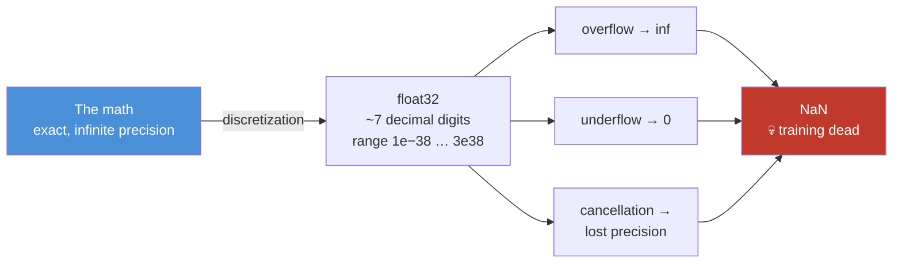
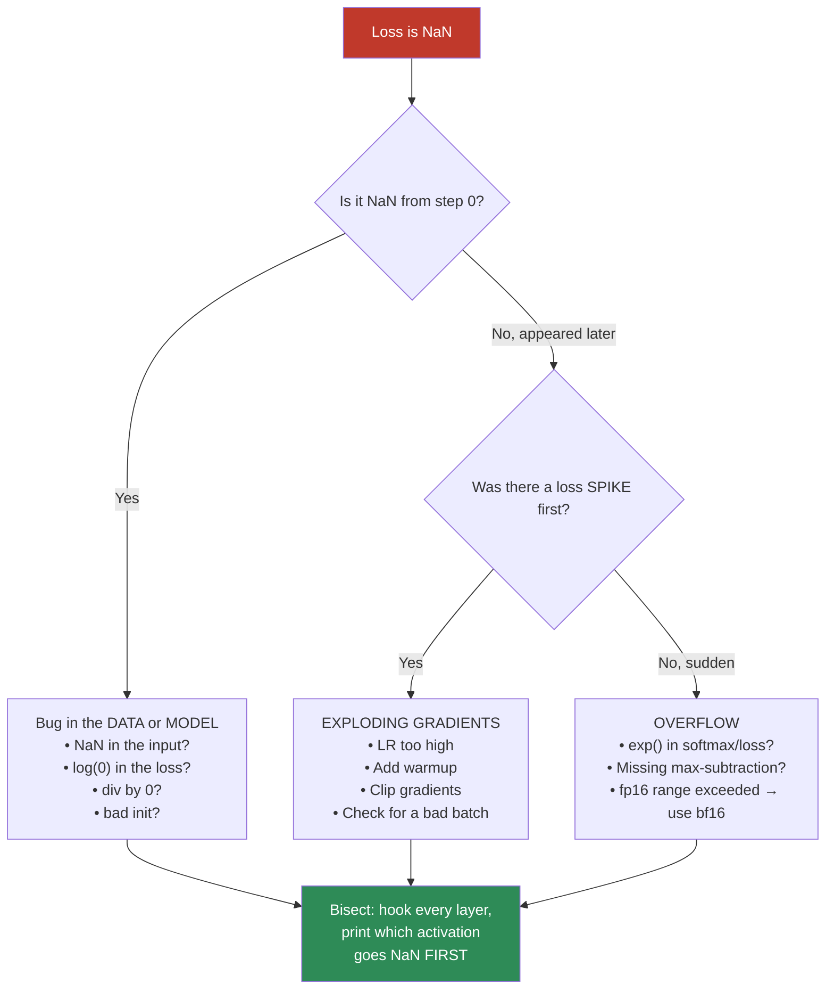
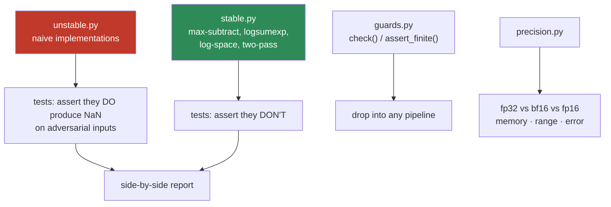

# 06.9 · Numerical Computing

[⬅ 06.8 Information Theory](06.8-information-theory.md) · [🏠 Module 06](../README.md) · [➡ 06.10 Neural Network Math](06.10-neural-network-math.md)

> **The lesson in one line:** Every equation in this module is exact; every computer that runs it is not — and the gap between those two facts is where `NaN` lives.

---

## 🎯 Learning objectives

By the end of this lesson you can:

1. Explain how a **float** is actually stored, and why `0.1 + 0.2 != 0.3`.
2. Choose between **float64 / float32 / bfloat16 / float16** and justify it with memory *and* range arguments.
3. Diagnose **overflow**, **underflow**, and **catastrophic cancellation** from the symptoms.
4. Apply the three stability tricks that prevent ~90% of real `NaN`s: **max-subtraction**, **log-sum-exp**, and **log-space arithmetic**.
5. **Vectorize** and use **broadcasting** correctly — including the silent-bug traps.
6. Debug a `NaN` in a training run systematically instead of by guessing.

---

## 🧠 Mental model

> **A float is a *sample* of the real number line, not a point on it. Every operation you perform moves you to the nearest available sample — and those errors accumulate.**

Every previous lesson in this module assumed exact arithmetic. Your hardware does not provide it. `exp`, `log`, division, and summation each have a specific way of betraying you, and **an AI Engineer who can't diagnose a `NaN` is an AI Engineer who can't ship**.



---

## 1 · Floating-Point Representation

### How a float is actually stored

IEEE 754 stores a number in three parts — the same idea as scientific notation, in binary:

$$\text{value} = (-1)^{\text{sign}} \times 1.\text{mantissa} \times 2^{\text{exponent}}$$

| Type | Bits | Sign | **Exponent** (range) | **Mantissa** (precision) | Decimal digits | Range |
|---|---|---|---|---|---|---|
| `float64` (double) | 64 | 1 | 11 | 52 | ~16 | 1e±308 |
| `float32` (single) | 32 | 1 | **8** | **23** | ~7 | 1e±38 |
| `float16` (half) | 16 | 1 | **5** | 10 | ~3 | **6e−5 … 65504** ⚠️ |
| **`bfloat16`** | 16 | 1 | **8** ✅ | **7** | ~2 | **1e±38** ✅ |

> [!IMPORTANT]
> **Look carefully at `float16` vs `bfloat16` — this table explains modern AI hardware.**
>
> Both are 16 bits. But they spend those bits differently:
> - **float16** gives more bits to the mantissa (**precision**) and fewer to the exponent (**range**). Its max value is **65,504** — and gradients or activations routinely exceed that, so **float16 training overflows constantly** and needs "loss scaling" hacks to survive.
> - **bfloat16** keeps float32's **full 8-bit exponent** — the *same range* as float32 — and sacrifices precision instead (only ~2–3 decimal digits).
>
> **And it turns out deep learning needs range far more than it needs precision.** Gradients span many orders of magnitude; nobody cares whether a weight is 0.13 or 0.131. **That single insight is why bfloat16 was invented at Google, why it's baked into TPUs and modern GPUs, and why nearly every LLM today is trained in bf16.** It is a pure numerical-representation decision that reshaped the hardware industry.

### Why `0.1 + 0.2 != 0.3`

```python
print(0.1 + 0.2)              # 0.30000000000000004
print(0.1 + 0.2 == 0.3)       # False  😱
print(f"{0.1:.20f}")          # 0.10000000000000000555
```

**0.1 is not representable in binary.** Just as 1/3 = 0.333... never terminates in decimal, 1/10 never terminates in *binary*. The computer stores the nearest float, and the tiny error surfaces when you add.

> [!CAUTION]
> **NEVER use `==` to compare floats.** Use `np.isclose(a, b)` or `np.allclose(A, B)` with a tolerance. Every equality check in this module's exercises uses `allclose` for exactly this reason. Comparing computed floats with `==` is a bug that will pass your tests on one machine and fail on another.

```python
import numpy as np

print(np.isclose(0.1 + 0.2, 0.3))                 # True  ✅
print(np.allclose(A @ B, expected, atol=1e-6))    # the right way for arrays
```

### Machine epsilon — the granularity of your number system

```python
import numpy as np

for dtype in (np.float64, np.float32, np.float16):
    info = np.finfo(dtype)
    print(f"{str(dtype.__name__):9} eps={info.eps:<12.3e} "
          f"max={info.max:<12.3e} min_normal={info.tiny:.3e}")
# float64   eps=2.220e-16   max=1.798e+308  min_normal=2.225e-308
# float32   eps=1.192e-07   max=3.403e+38   min_normal=1.175e-38
# float16   eps=9.766e-04   max=6.550e+04   min_normal=6.104e-05   ← tiny range!

# The consequence: adding a small number to a big one does NOTHING
print(np.float32(1.0) + np.float32(1e-8) == np.float32(1.0))   # True 😱
```

**Machine epsilon is the smallest number you can add to 1.0 and see a change.** For float32 it's ~1e-7. **So adding 1e-8 to 1.0 in float32 is a complete no-op** — a fact that silently destroys naive summation over long sequences, and which is why frameworks use pairwise/Kahan summation internally.

---

## 2 · Overflow & Underflow

### Overflow — the number is too big

```python
import numpy as np

x = np.float32(100.0)
print(np.exp(x))            # inf   ← e^100 ≈ 2.7e43 > float32's max of 3.4e38
                            #        RuntimeWarning: overflow encountered
print(np.exp(x) / np.exp(x))  # nan  ← inf/inf = NaN. Training is now dead.
```

**This is the #1 source of `NaN` in deep learning**, and it hides inside the softmax.

### Underflow — the number is too small

```python
p = np.float32(1e-30)
print(p * p)                # 0.0   ← underflow: 1e-60 is below float32's min
print(np.log(p * p))        # -inf  ← log(0). NaN incoming.
```

**Underflow is more insidious than overflow** because it doesn't warn you — it just quietly becomes zero. Then you take a log of it, and *now* you have `-inf`, and the next multiplication gives `NaN`, and you have no idea where it started.

> [!WARNING]
> **The multiply-many-probabilities trap.** Computing $P(\text{sentence}) = \prod_t P(w_t)$ for a 100-token sentence multiplies 100 numbers each < 1. Even at p = 0.1 each, the product is 1e-100 — **which underflows to exactly 0 in float32.** Your probability is now zero, its log is `-inf`, and your loss is `NaN`.
>
> **The fix is universal and non-negotiable: work in log space.** $\log \prod p_i = \sum \log p_i$. Products become sums; underflow becomes impossible. **This is why every NLP system, every HMM, every language model, and every graphical model computes in log space.** It is the single most important numerical habit in all of ML.

```python
import numpy as np

probs = np.full(100, 0.1, dtype=np.float32)

naive     = np.prod(probs)                      # 0.0        ☠️ underflowed
log_space = np.sum(np.log(probs))               # -230.26    ✅ perfectly fine
print(naive, log_space)
```

---

## 3 · Numerical Stability — the three tricks that save you

### Trick 1: The max-subtraction in softmax

The naive softmax is a trap:

$$\text{softmax}(z)_i = \frac{e^{z_i}}{\sum_j e^{z_j}}$$

If any logit is large (and in a trained LLM, they routinely reach 20–100), `exp` overflows.

**The fix — subtract the maximum:**

$$\text{softmax}(z)_i = \frac{e^{z_i - \max(z)}}{\sum_j e^{z_j - \max(z)}}$$

**This is mathematically identical** (the $e^{-\max}$ cancels top and bottom) but now the largest exponent is $e^0 = 1$, so **overflow is impossible**. The smallest may underflow to 0 — which is harmless, because it *should* be ~0 anyway.

```python
import numpy as np

def softmax_naive(z):
    e = np.exp(z)
    return e / e.sum()

def softmax_stable(z):
    z = z - z.max()          # ← the entire fix. One line.
    e = np.exp(z)
    return e / e.sum()

logits = np.array([1000.0, 1001.0, 1002.0], dtype=np.float32)

print(softmax_naive(logits))    # [nan nan nan]   ☠️  exp(1000) = inf, inf/inf = nan
print(softmax_stable(logits))   # [0.09 0.24 0.67] ✅  correct
```

> [!IMPORTANT]
> **That one line — `z = z - z.max()` — is present in every production softmax implementation on Earth.** PyTorch, TensorFlow, JAX, cuDNN. It is the most important single line of numerical code in machine learning, and it costs nothing. **If you write a softmax without it, you have written a bug.**

### Trick 2: Log-sum-exp

You often need $\log \sum_i e^{x_i}$ (in cross-entropy, in log-likelihoods, in mixture models). The naive version overflows for the same reason.

$$\log\sum_i e^{x_i} = \max(x) + \log\sum_i e^{x_i - \max(x)}$$

```python
import numpy as np
from scipy.special import logsumexp

def logsumexp_manual(x):
    m = x.max()
    return m + np.log(np.sum(np.exp(x - m)))

x = np.array([1000.0, 1001.0, 1002.0])
print(np.log(np.sum(np.exp(x))))    # inf  ☠️
print(logsumexp_manual(x))          # 1002.407  ✅
print(logsumexp(x))                 # 1002.407  ✅ (use SciPy's; it's tested)
```

### Trick 3: Fuse `log` and `softmax`

Never compute `log(softmax(x))` as two separate operations. If a probability underflows to 0, `log(0)` = `-inf`. Instead:

$$\log\text{softmax}(z)_i = z_i - \text{logsumexp}(z)$$

```python
def log_softmax(z):
    return z - logsumexp(z)          # ← never materializes a probability that can be 0
```

> [!IMPORTANT]
> **This is why PyTorch has `F.log_softmax` and why `nn.CrossEntropyLoss` takes *logits*.** The framework fuses softmax + log + cross-entropy into one numerically stable kernel. **When you apply softmax yourself and then take a log, you have bypassed the safety mechanism.** ([06.8](06.8-information-theory.md) explained the *mathematical* reason for the fusion; this is the *numerical* one. Both point the same way.)

### Catastrophic cancellation — the subtle one

Subtracting two nearly-equal numbers destroys precision, because the leading digits cancel and only the noise is left.

```python
import numpy as np

a = np.float32(1.0000001)
b = np.float32(1.0000000)
print(a - b)                    # 1.1920929e-07  ← only ~1 significant digit survives!

# Real example: the naive variance formula. E[X²] − E[X]² is a CANCELLATION BOMB.
x = np.array([1e8, 1e8 + 1, 1e8 + 2], dtype=np.float32)

naive = (x**2).mean() - x.mean()**2      # catastrophic cancellation
good  = ((x - x.mean())**2).mean()       # two-pass: stable

print(f"naive variance : {naive:.6f}")   # 0.000000  or even NEGATIVE ☠️
print(f"stable variance: {good:.6f}")    # 0.666667  ✅
print(f"numpy  variance: {x.var():.6f}") # 0.666667  ✅ (NumPy uses the stable form)
```

**A variance that comes out negative is impossible mathematically and routine numerically.** This is why NumPy, and every serious library, uses the two-pass (or Welford's online) algorithm. **Textbook formulas are not always implementable formulas** — that gap is what this lesson is about.

---

## 4 · Vectorization

### The one habit that matters most for performance

**Python loops are ~100–1000× slower than NumPy operations on arrays.** Not 10% slower. Orders of magnitude.

```python
import numpy as np, time

N = 1_000_000
a = np.random.randn(N).astype(np.float32)
b = np.random.randn(N).astype(np.float32)

t0 = time.perf_counter()
result_loop = [a[i] * b[i] for i in range(N)]       # pure Python
t1 = time.perf_counter()

t2 = time.perf_counter()
result_vec = a * b                                   # NumPy
t3 = time.perf_counter()

print(f"loop      : {t1-t0:.4f}s")     # ~0.35 s
print(f"vectorized: {t3-t2:.6f}s")     # ~0.0008 s
print(f"speedup   : {(t1-t0)/(t3-t2):,.0f}×")   # ~400×
```

### Why it's so much faster

| Python loop | NumPy vectorized |
|---|---|
| Every element is a boxed `PyObject` (type check, refcount, ~28 bytes each) | Raw contiguous C array of `float32` |
| Interpreter dispatch per iteration | One C call for the whole array |
| One element per instruction | **SIMD**: 8–16 elements per instruction |
| Scattered memory, cache misses | Contiguous — the prefetcher is happy |
| Single-threaded | BLAS ops are **multi-threaded** |

This is [02.3 Memory](../../02-Computer-Science/weeks/02.3-memory.md) and [02.9 Concurrency](../../02-Computer-Science/weeks/02.9-concurrency.md) cashing in. Vectorization isn't a NumPy trick — it's how you speak to the hardware in its own language.

> [!TIP]
> **The rule: if you're writing a `for` loop over array elements, you're doing it wrong.** There is nearly always a vectorized equivalent. The exceptions (genuinely sequential recurrences, irregular control flow) are rare — and *that's* what `numba`, `cython`, or a custom kernel is for.

### The vectorization translation table

| Loop | Vectorized |
|---|---|
| `for i: c[i] = a[i] + b[i]` | `c = a + b` |
| `for i: s += a[i]` | `s = a.sum()` |
| `for i: c[i] = a[i] if a[i] > 0 else 0` | `c = np.maximum(a, 0)` |
| `for i: if a[i] > 5: ...` | `mask = a > 5; a[mask]` |
| `for i,j: C[i,j] = sum(A[i,:]*B[:,j])` | `C = A @ B` |
| `for i: c[i] = a[i] * 2 + 1` | `c = a * 2 + 1` |
| Accumulating a running total | `np.cumsum(a)` |
| Conditional assignment | `np.where(cond, x, y)` |

---

## 5 · Broadcasting

### Intuition

**Broadcasting lets NumPy operate on arrays of different shapes by *virtually* stretching the smaller one — without copying memory.**

```python
import numpy as np

X = np.random.randn(32, 768)     # a batch of 32 embeddings
b = np.random.randn(768)         # one bias vector

Y = X + b        # (32, 768) + (768,) → b is virtually repeated across all 32 rows
                 # NO 32× copy of b is made. Zero extra memory.
```

### The rules

Compare shapes **from the right**. Two dimensions are compatible if they are **equal** or one of them is **1**.

```
  (32, 768)      (5, 1, 3)       (32, 768)        (3,)
+ (    768)    + (   4, 3)     + ( 32,   1)     + (4,)
-----------    -----------     -----------      ------
  (32, 768) ✅   (5, 4, 3) ✅    (32, 768) ✅     ERROR ❌
```

| Shapes | Result | Why |
|---|---|---|
| `(32,768)` + `(768,)` | `(32,768)` | Right-aligned; 768 matches; 32 broadcasts |
| `(32,768)` + `(32,1)` | `(32,768)` | 1 stretches to 768 |
| `(32,768)` + `(32,)` | **ERROR** | Right-align: 768 vs 32 → incompatible |
| `(3,)` + `(4,)` | **ERROR** | 3 ≠ 4, neither is 1 |
| `(3,1)` + `(1,4)` | `(3,4)` | **Both stretch → outer product!** |

> 🖼️ **[IMAGE PLACEHOLDER: `assets/images/06-broadcasting.png`]**
> *Three illustrated examples using coloured grids. (1) A (3,4) grid plus a (4,) row vector shown being virtually copied down all 3 rows (copies drawn as faded/ghosted to indicate no real memory use), result (3,4). (2) A (3,1) column plus a (1,4) row, both ghosted-stretched into a full (3,4) grid — labelled "⚠️ THE SILENT BUG: this produces an outer product, not an elementwise op." (3) A (3,) and a (4,) shown right-aligned and misaligned with a red X — "ERROR: 3 ≠ 4." Caption: "Compare shapes from the right. Equal, or one is 1. Ghosting = no memory copied."*

### The silent bug that will cost you a day

> [!CAUTION]
> **The `(n,)` vs `(n,1)` catastrophe.** This is the most dangerous behaviour in all of NumPy, because it **does not raise an error**:
>
> ```python
> a = np.array([1., 2., 3.])           # shape (3,)
> b = np.array([[1.], [2.], [3.]])     # shape (3, 1)
>
> print((a - b).shape)                 # (3, 3)  😱😱😱
> # You wanted a (3,) vector of zeros. You got a 3×3 OUTER DIFFERENCE MATRIX.
> ```
>
> No exception. No warning. Your code runs, your loss decreases (badly), and you spend a day wondering why the model is stupid. **This exact bug is why `keepdims=True` exists**, and why [06.2](06.2-linear-algebra-vectors-matrices.md) insisted you always print shapes.

### The `keepdims` habit

```python
import numpy as np

X = np.random.randn(32, 768)

# ❌ WRONG — the shape collapses and broadcasting misfires
mean_bad = X.mean(axis=1)                       # (32,)
# X - mean_bad  →  ERROR (or worse, a silent (32,32) if dims happened to align)

# ✅ RIGHT — keepdims preserves the axis so broadcasting aligns correctly
mean_good = X.mean(axis=1, keepdims=True)       # (32, 1)
X_centered = X - mean_good                      # (32,768) - (32,1) → (32,768) ✅

# The same trick powers layer normalization:
def layer_norm(x, eps=1e-5):
    mu    = x.mean(axis=-1, keepdims=True)      # keepdims is LOAD-BEARING
    sigma = x.std(axis=-1, keepdims=True)
    return (x - mu) / (sigma + eps)             # ← eps prevents ÷0
```

**You just wrote layer normalization.** It's four lines, and two of them are numerical-stability guards (`keepdims`, `eps`). That ratio is not unusual.

> [!TIP]
> **Broadcasting is not free — it can silently allocate enormous arrays.** `A[:, None] - B[None, :]` with two 10,000-element vectors creates a **100,000,000-element** matrix (400 MB in float32). This is exactly how people accidentally OOM while computing pairwise distances. When you broadcast, do the shape arithmetic in your head *first*. `(n,1)` and `(1,m)` gives you `(n,m)` — and that's a big number when n and m are big.

---

## 6 · Debugging a `NaN` — the systematic procedure

You *will* face this. Here's the checklist that actually works, in order of likelihood.



### The debugging toolkit

```python
import numpy as np

def check(name, arr):
    """Drop this into any pipeline. It will save you hours."""
    a = np.asarray(arr)
    issues = []
    if np.isnan(a).any(): issues.append(f"{np.isnan(a).sum()} NaN")
    if np.isinf(a).any(): issues.append(f"{np.isinf(a).sum()} Inf")
    if np.abs(a).max() > 1e4: issues.append(f"large max={np.abs(a).max():.2e}")
    flag = "🚨 " + ", ".join(issues) if issues else "✅"
    print(f"{name:20} shape={str(a.shape):16} "
          f"min={a.min():+.3e} max={a.max():+.3e} "
          f"mean={a.mean():+.3e} {flag}")

# In PyTorch, the equivalent one-liner that finds it for you:
#   torch.autograd.set_detect_anomaly(True)   ← points at the exact op. Use it.
```

### The `NaN` causes, ranked by how often they actually happen

| Cause | Where | Fix |
|---|---|---|
| **`exp()` overflow** | Softmax, attention scores | **Subtract the max** |
| **`log(0)`** | Cross-entropy on a 0 probability | `log_softmax`, or clip with `eps` |
| **Division by ~0** | Layer norm, RMSProp/Adam, cosine similarity | Add `eps` (1e-8) |
| **Exploding gradients** | Deep nets, high LR, no warmup | Clip gradients; lower LR; warmup |
| **fp16 overflow** | Any large activation | **bfloat16**, or loss scaling |
| **`sqrt` of a negative** | Cancellation in a variance | Use the stable two-pass formula |
| **NaN in the input data** | A corrupted row in your dataset | **Validate the data.** `assert not np.isnan(X).any()` |
| **`0/0` or `inf−inf`** | Masked attention, empty groups | Guard the denominator |

> [!IMPORTANT]
> **The single highest-value habit: assert your data is clean before training.** A `NaN` in one row of a 10-million-row dataset will poison your entire model — the gradient becomes NaN, it propagates to every weight, and *the whole network dies in one step*. One `assert not np.isnan(X).any()` at data-load time is worth more than any amount of downstream debugging. NaN is *contagious*: it takes exactly one to kill everything.

---

## 🐛 Common mistakes

| Mistake | Why it hurts | Fix |
|---|---|---|
| `==` on floats | `0.1+0.2 != 0.3` | `np.isclose` / `np.allclose` |
| Softmax without max-subtraction | `exp` overflows → NaN | `z = z - z.max()` |
| `log(softmax(x))` | `log(0)` = −inf | `log_softmax` (fused) |
| Multiplying many probabilities | Underflows to 0 | **Work in log space** |
| Naive variance `E[X²]−E[X]²` | Catastrophic cancellation; can go negative | Two-pass or Welford |
| `float64` everywhere | 2× memory, no accuracy benefit for DL | `float32` (or `bf16`) |
| **`float16` for training** | Range is only 65504 → constant overflow | **`bfloat16`** |
| Missing `keepdims=True` | `(n,)` vs `(n,1)` → silent `(n,n)` outer op | Always `keepdims=True` after a reduction |
| Broadcasting without checking shapes | Silent 400 MB allocation, or wrong math | Do the shape arithmetic first |
| Python loops over arrays | 100–1000× slower | Vectorize |
| `eps=0` in a denominator | Division by ~0 → inf → NaN | `eps=1e-8` |
| Not validating input data | One NaN row kills the whole model | `assert not np.isnan(X).any()` |

---

## 📝 Exercises

**Conceptual**
1. Why is `bfloat16` better than `float16` for deep learning, despite having *less* precision? Answer using the exponent bits.
2. Explain why the softmax max-subtraction is mathematically a no-op but numerically essential.
3. Why must language models work in log space? Give the arithmetic.
4. Why can the naive variance formula return a *negative* number?
5. Why is `NaN` "contagious," and why does that make data validation so high-leverage?

**Intuition**
6. Your loss is fine for 800 steps, then spikes, then goes to NaN. Diagnose it and give three fixes.
7. Your loss is NaN at step 0. Diagnose it. (Different list!)
8. You switch from fp32 to fp16 and immediately get `inf`. What happened, and what's the one-word fix?

**NumPy**
9. Implement `softmax_naive` and `softmax_stable`. Show the first returns `nan` for `[1000, 1001, 1002]` and the second doesn't.
10. Implement `logsumexp` from scratch. Verify against `scipy.special.logsumexp`.
11. Demonstrate catastrophic cancellation with the variance formula on `[1e8, 1e8+1, 1e8+2]` in float32. Get a negative variance out of it. Then fix it.
12. Implement `layer_norm` with `keepdims` and `eps`. Break it by removing each, and observe what happens.
13. Time a Python loop vs vectorized NumPy on 1M elements. Report the speedup.
14. Reproduce the `(3,)` − `(3,1)` outer-difference bug. Then write an assertion that would have caught it.
15. Write `check(name, arr)` from this lesson and add it to your **Notation Notebook** from [06.1](06.1-mathematical-thinking.md). **You will use it for the rest of your career.**

**Visualization**
16. Plot `np.exp(x)` for x ∈ [0, 100] in float32 on a log axis. Mark where it hits `inf` (~x=88).
17. Plot the representable float32 values between 0 and 1 (log-spaced density). Observe that floats are **dense near zero and sparse far from it** — a fact with real consequences for how gradients near zero behave.
18. Plot machine epsilon for fp64/fp32/bf16/fp16 on a log scale beside their max values. **This one chart explains the entire mixed-precision story.**

**Equation interpretation**
19. Read $\text{softmax}(z)_i = \frac{e^{z_i - \max z}}{\sum_j e^{z_j - \max z}}$. Prove the max-subtraction changes nothing mathematically.
20. Read $\log\sum_i e^{x_i} = \max(x) + \log\sum_i e^{x_i - \max(x)}$ and derive it.

---

## 🛠️ Mini project — *The NaN Hunter*

Build `code/06-mathematics/nan-hunter/` — a numerical-stability toolkit and a set of *deliberately broken* implementations you then fix.

```
nan-hunter/
├── README.md
├── src/
│   ├── unstable.py     # DELIBERATELY BROKEN: naive softmax, naive variance,
│   │                   #   product-of-probabilities, log(softmax(x))
│   ├── stable.py       # the fixed versions
│   ├── guards.py       # check(), assert_finite(), shape_check()
│   ├── precision.py    # fp64/fp32/bf16/fp16 comparison harness
│   └── benchmark.py    # loop vs vectorized timings
├── tests/
│   └── test_stability.py   # each unstable fn NaNs; each stable one doesn't
└── notebooks/
    └── precision_study.ipynb
```

**Architecture**



**Implementation guidance**
1. **`unstable.py` first — and write tests that *assert the failure*.** `assert np.isnan(softmax_naive([1000,1001,1002])).any()`. Testing that your broken code is *reliably* broken is what makes the fix meaningful rather than superstitious.
2. **`stable.py`** — implement max-subtraction, logsumexp, fused log-softmax, log-space products, two-pass variance. Each fixed function must pass on inputs where its unstable twin dies.
3. **`guards.py`** — this is the part you'll actually reuse. `check()` prints shape/min/max/mean and flags NaN/Inf/large values. `assert_finite()` raises immediately with the offending array's name. **Import this into every project you ever write.**
4. **`precision.py`** — take a real computation (a matmul chain, or 10 layers of `relu(xW)`) and run it in fp64/fp32/bf16/fp16. Report memory used, relative error vs. fp64, and whether it overflowed. **Watching fp16 die while bf16 sails through is the moment the exponent-bits table stops being trivia and becomes knowledge.**

**Stretch goals**
- Implement **loss scaling** (multiply the loss by 1024 before backward, divide the gradients after) and show it rescuing an fp16 run that would otherwise underflow to zero gradients.
- Implement **Welford's online variance** algorithm and show it's stable *and* single-pass.
- Add a NaN "bisector": given a forward pass, binary-search the layers to find which one produces the first non-finite value.

---

## 📄 Cheat sheet

| Problem | Fix |
|---|---|
| `exp()` overflow in softmax | **`z = z - z.max()`** |
| `log(0)` = −inf | `log_softmax`, or clip with `eps` |
| Product of many probabilities → 0 | **Work in log space** ($\log\prod = \sum\log$) |
| $\log\sum e^{x}$ overflows | **log-sum-exp**: $\max(x) + \log\sum e^{x-\max}$ |
| Division by ~0 | Add `eps = 1e-8` |
| Naive variance is negative | Two-pass: $\text{mean}((x-\bar{x})^2)$ |
| Comparing floats with `==` | `np.allclose` |
| `(n,)` vs `(n,1)` silent outer op | **`keepdims=True`** |
| Python loop is slow | **Vectorize** — 100–1000× |
| fp16 overflows | **bfloat16** (same exponent range as fp32) |
| Loss is NaN | Check: data → exp → log → div → gradients |

| dtype | Bits | Range | Use for |
|---|---|---|---|
| float64 | 64 | 1e±308 | Scientific computing. **Not DL** |
| **float32** | 32 | 1e±38 | The safe DL default |
| **bfloat16** | 16 | **1e±38** | ✅ **Modern LLM training** |
| float16 | 16 | **6e−5 … 65504** ⚠️ | Inference; training needs loss scaling |

---

## 🎴 Flashcards

- **Q:** Why does `0.1 + 0.2 != 0.3`? → **A:** 0.1 and 0.2 aren't exactly representable in binary; the stored values are approximations and the error surfaces on addition. Never compare floats with `==`.
- **Q:** Why is bfloat16 better than float16 for training? → **A:** It keeps float32's **8-bit exponent** (same range, up to 1e38) and sacrifices mantissa bits instead. Deep learning needs **range** far more than precision — float16 maxes at 65,504 and overflows constantly.
- **Q:** What is the softmax max-subtraction trick? → **A:** `z = z - z.max()` before `exp`. Mathematically identical (the factor cancels), but it makes the largest exponent e⁰=1, so overflow is impossible.
- **Q:** Why do language models work in log space? → **A:** Multiplying 100 probabilities < 1 underflows to exactly 0. `log(∏p) = Σlog(p)` turns products into sums — no underflow.
- **Q:** What is log-sum-exp? → **A:** `max(x) + log(Σ exp(x − max(x)))` — a stable way to compute `log(Σ exp(x))`.
- **Q:** Why does `nn.CrossEntropyLoss` take logits? → **A:** So it can fuse softmax+log+CE into one numerically stable kernel (log_softmax) and use the simplified `q−p` gradient. Applying softmax yourself applies it twice *and* bypasses the stability.
- **Q:** What is catastrophic cancellation? → **A:** Subtracting nearly-equal numbers destroys the significant digits. The naive variance formula `E[X²]−E[X]²` can even return a **negative** number.
- **Q:** Why is `keepdims=True` important? → **A:** Without it, a reduction collapses `(n,1)` to `(n,)`, and the subsequent broadcast silently produces an `(n,n)` outer operation instead of an elementwise one — **with no error raised**.
- **Q:** How much faster is vectorized NumPy than a Python loop? → **A:** 100–1000×. Contiguous memory, no per-element boxing, SIMD, multithreaded BLAS.
- **Q:** Broadcasting rules? → **A:** Compare shapes **from the right**; dimensions must be equal or one must be 1.
- **Q:** Loss is NaN — what do you check first? → **A:** Whether it was NaN from step 0 (data/model bug: NaN input, log(0), div by 0) or appeared later (exploding gradients / overflow). Then bisect by hooking each layer.
- **Q:** Why is one NaN in your dataset catastrophic? → **A:** NaN is contagious — it propagates through the gradient to **every** weight in one step, killing the whole model. Assert your data is finite before training.

---

## 💼 Interview questions

1. **"Your training loss becomes NaN. Walk me through debugging it."** — The full procedure: was it NaN at step 0 or later? Was there a spike first? Check exp/log/div; check the data; hook layers to find the first non-finite activation; then clip/warmup/lower LR. **This is one of the most common senior-level ML interview questions**, and a structured answer stands out enormously.
2. **"Why does everyone train in bfloat16 rather than float16?"** — Exponent bits. Range (1e38) matters more than precision for gradients; fp16's 65,504 ceiling causes constant overflow.
3. **"Implement a numerically stable softmax."** — Subtract the max. Explain *why* it's a mathematical no-op.
4. **"Why does `nn.CrossEntropyLoss` take logits instead of probabilities?"** — Fusion for stability (log_softmax) and the simplified gradient. Note that pre-softmaxing is a silent, common bug.
5. **"Explain broadcasting, and a bug it causes."** — Right-aligned shape rules; then the `(n,)` vs `(n,1)` outer-operation trap that raises no error.
6. **"How do you make a Python numerical routine 100× faster?"** — Vectorize: contiguous arrays, no per-element Python objects, SIMD, BLAS threading.

---

## 📚 Summary

- **A float is a sample of the number line**, not a point on it. `0.1 + 0.2 != 0.3`, and you must **never** compare floats with `==`.
- **The exponent/mantissa split explains modern AI hardware.** `bfloat16` keeps float32's full 8-bit exponent (range 1e±38) and sacrifices precision — because **deep learning needs range far more than precision.** That single insight is why bf16 is in every TPU and every modern LLM training run, while fp16 needs loss-scaling hacks to survive.
- **Overflow** (`exp(1000)` = inf) and **underflow** (a product of 100 probabilities = 0) are the two roads to `NaN`.
- **Three tricks prevent nearly all of it:** (1) **subtract the max** before softmax; (2) **log-sum-exp**; (3) **work in log space**, turning products into sums. Every production framework does all three.
- **Catastrophic cancellation** can make a variance come out *negative*. Textbook formulas are not always implementable formulas.
- **Vectorize.** Python loops are 100–1000× slower — contiguous memory, SIMD, and threaded BLAS are why.
- **Broadcasting** compares shapes from the right. Its most dangerous behaviour is the silent `(n,)` vs `(n,1)` outer operation — which is why **`keepdims=True`** is a habit, not an option.
- **`NaN` is contagious.** One bad value poisons every weight in a single step. **Validate your data before training** — it's the highest-leverage assertion you will ever write.

**Next:** [06.10 Mathematics of Neural Networks](06.10-neural-network-math.md) — where linear algebra, calculus, probability, information theory, and numerical stability all combine into one working network, built from nothing.

---

## 🔗 References

- Goldberg (1991) — *What Every Computer Scientist Should Know About Floating-Point Arithmetic*. The canonical reference; dense but definitive.
- Goodfellow et al. — *Deep Learning*, Ch. 4.1 (Overflow and Underflow) — short, and exactly this lesson's core.
- Micikevicius et al. (2018) — *Mixed Precision Training* — the paper that introduced loss scaling and made fp16 training viable.
- Kalamkar et al. (2019) — *A Study of BFLOAT16 for Deep Learning Training* — the case for the exponent bits.
- NumPy docs — [Broadcasting](https://numpy.org/doc/stable/user/basics.broadcasting.html). Read it once, properly. It will save you a day.
- [02.3 Memory](../../02-Computer-Science/weeks/02.3-memory.md) — why contiguous arrays are fast; the hardware reason vectorization wins.

---

## 🧭 Navigation

| Direction | Link |
|---|---|
| ⬅ Previous | [06.8 Information Theory](06.8-information-theory.md) |
| ➡ Next | [06.10 Neural Network Math](06.10-neural-network-math.md) |
| 🏠 Module | [Module 06](../README.md) |
| 🗺 Roadmap | [ROADMAP.md](../../../ROADMAP.md) |
