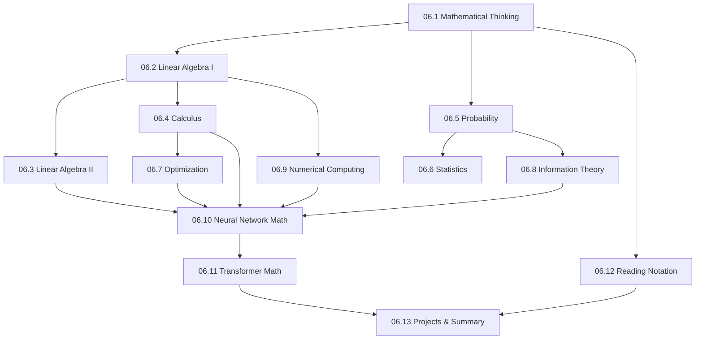

# Module 06 · Mathematics for AI Engineers — Lessons

[⬅ Module home](../README.md) · [🗺 Roadmap](../../../ROADMAP.md) · [📚 Curriculum](../../../CURRICULUM.md)

> This is the map of Module 06. Mathematics is the **language** AI is written in — not a hurdle to clear, but a set of tools you'll use to understand what models actually do. This module teaches it **from the perspective of building AI systems**: intuition first, NumPy second, formalism third.

---

## The promise of this module

You will not be taught mathematics like a university course. Every concept must earn its place by answering: **why does it exist, why should an AI Engineer care, where is it used, how do I implement it, and how does it show up in ML, deep learning, and Transformers?**

> [!IMPORTANT]
> **You need far less math than you fear — but you need to *understand* it, not memorize it.** Most AI Engineering requires fluency with a surprisingly small set of ideas: matrix multiplication, gradients and the chain rule, probability distributions, and cross-entropy. Master those *deeply* — with geometric intuition and working NumPy code — and you can read papers, debug models, and reason about architectures. This module is engineered to get you exactly that, and no more.

---

## Lessons

| # | Lesson | Section |
|---|---|---|
| 06.1 | [Mathematical Thinking](06.1-mathematical-thinking.md) | §1 why math is AI's language; how engineers should approach it |
| 06.2 | [Linear Algebra I — Vectors & Matrices](06.2-linear-algebra-vectors-matrices.md) | §2a scalars, vectors, matrices, tensors, dot product, matmul |
| 06.3 | [Linear Algebra II — Structure & Decomposition](06.3-linear-algebra-decomposition.md) | §2b transpose, inverse, rank, determinant, eigen, SVD |
| 06.4 | [Calculus & Gradients](06.4-calculus.md) | §3 limits, derivatives, partials, gradients, chain rule, Jacobian, Hessian |
| 06.5 | [Probability](06.5-probability.md) | §4 random variables, distributions, conditional, Bayes, independence |
| 06.6 | [Statistics](06.6-statistics.md) | §5 mean/variance, correlation, confidence intervals, hypothesis testing |
| 06.7 | [Optimization](06.7-optimization.md) | §6 loss functions, convexity, GD/SGD/mini-batch, momentum, RMSProp, Adam |
| 06.8 | [Information Theory](06.8-information-theory.md) | §7 entropy, cross-entropy, KL divergence, mutual information |
| 06.9 | [Numerical Computing](06.9-numerical-computing.md) | §8 floats, precision, overflow/underflow, stability, vectorization, broadcasting |
| 06.10 | [Mathematics of Neural Networks](06.10-neural-network-math.md) | §9 forward pass, activations, backprop, weight updates — from scratch |
| 06.11 | [Mathematics Behind Transformers](06.11-transformer-math.md) | §10 embeddings, attention, softmax, positional encoding |
| 06.12 | [Reading Mathematical Notation](06.12-reading-notation.md) | §11 sigma/product notation, ML symbols, how to read a paper's equations |
| 06.13 | [Projects & Summary](06.13-projects-summary.md) | §12 five projects + module consolidation |

### Companion artifacts
- 🏋️ [Exercises](../exercises/) — conceptual, intuition, NumPy, visualization, equation-reading
- 🧠 [Flashcards](../flashcards/deck.md) — spaced-repetition deck
- 📝 [Quiz](../quizzes/quiz-01.md) — self-assessment with answers
- 📄 [Cheat sheet](../cheat-sheets/math-cheatsheet.md) — one-page formula & notation reference

---

## How the lessons build

**Estimated time:** ~20 hours reading · ~6 hours projects · ~4 hours review (per the [Roadmap](../../../ROADMAP.md)).

> [!TIP]
> **Run every NumPy snippet.** Mathematics becomes real when you *see* a matrix rotate a vector, watch gradient descent roll downhill, or print the attention weights. Keep a notebook open ([Module 00.5](../../00-Orientation/weeks/00.5-development-environment.md)) — this module is designed so that every equation has code beside it, and you should type all of it.
