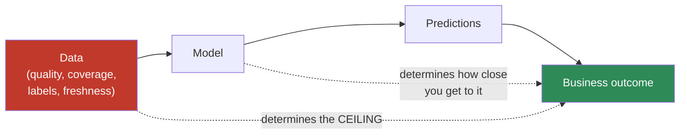
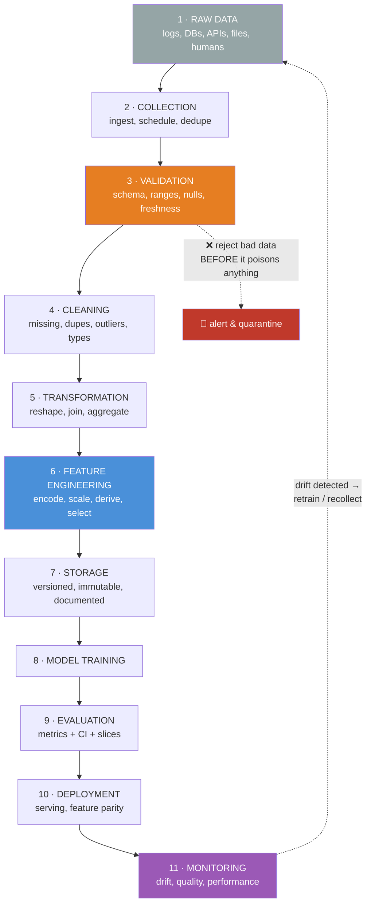
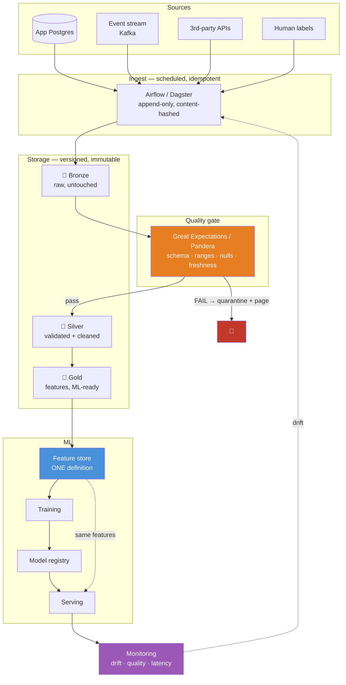
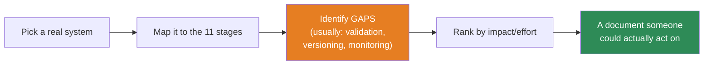

# 07.1 · The AI Data Lifecycle

[⬅ Lesson index](README.md) · [🏠 Module 07](../README.md) · [➡ 07.2 NumPy](07.2-numpy.md)

> **The lesson in one line:** A model is a *function of its data* — so every failure mode of an AI system is, on inspection, a failure somewhere in the eleven stages this lesson maps.

---

## 🎯 Learning objectives

By the end of this lesson you can:

1. Name all **eleven stages** of the AI data lifecycle and what can go wrong at each.
2. Explain why **data problems are silent** and model problems are loud — and why that asymmetry is dangerous.
3. Distinguish **model-centric** from **data-centric** AI, and know why the industry moved.
4. Draw the architecture of a real production data pipeline.
5. Explain **why the lifecycle is a loop, not a line**, and what closes it.
6. Locate every remaining lesson in this module on the lifecycle map.

---

## 🧠 Mental model

> **A model is a lossy compression of its training data. It cannot be better than what it compressed.**

Everything downstream of the data — architecture, hyperparameters, compute, the model's clever name — is *secondary*. If the labels are wrong, the model learns wrong. If the features leak, the model looks brilliant and is worthless. If the distribution shifts, the model silently decays while the dashboards stay green.



**Data sets the ceiling. The model determines how close you get to it.** Most teams spend 90% of their effort on the second half of that sentence.

---

## 📖 Core theory — the eleven stages



> [!IMPORTANT]
> **The dotted line from stage 11 back to stage 1 is the most important arrow in this diagram.** The lifecycle is a **loop**, not a pipeline. A model that ships is not finished — the world keeps changing, and a static model is a decaying model. Teams that draw this as a straight line ship once, then spend a year confused about why the numbers keep getting worse.

### Stage by stage — what it is and what kills you

| # | Stage | What it does | The failure that will bite you |
|---|---|---|---|
| **1** | **Raw data** | Logs, DB tables, APIs, files, human labels | Data you *don't have* is invisible. **Selection bias is baked in here and can never be fixed later.** |
| **2** | **Collection** | Ingest on a schedule; land it immutably | Duplicates from retries; partial loads treated as complete; silent API changes |
| **3** | **Validation** | Schema, types, ranges, nulls, freshness, volume | **Skipping this stage.** Bad data that passes silently poisons everything downstream |
| **4** | **Cleaning** | Missing values, dupes, invalid values, outliers | Dropping rows that aren't missing *at random* → you just introduced bias |
| **5** | **Transformation** | Reshape, join, aggregate, derive | **Joining on the wrong grain** → row explosion, duplicated facts, wrong aggregates |
| **6** | **Feature engineering** | Encode, scale, derive, select | **Data leakage.** The #1 killer. Looks like brilliance; is a bug |
| **7** | **Storage** | Versioned, immutable, documented datasets | Overwriting `data.csv`. Now nothing is reproducible, ever |
| **8** | **Training** | Fit the model | Training on data you can't reproduce; leaking the test set |
| **9** | **Evaluation** | Metrics, confidence intervals, **slices** | Reporting one aggregate number. It hides catastrophic failure on a subgroup |
| **10** | **Deployment** | Serve predictions | **Training/serving skew** — features computed differently in prod than in training |
| **11** | **Monitoring** | Drift, quality, latency, business metrics | **Not doing it.** The model decays silently and nobody notices for months |

---

## 💡 Why data problems are *silent* — the central asymmetry

This is the idea the whole module rests on.

| A **code** bug | A **data** bug |
|---|---|
| Stack trace | **Nothing** |
| Tests fail | Tests pass |
| Pager goes off | Dashboards stay green |
| Found in minutes | Found in months — or never |
| Obviously broken | **Plausibly correct** |

```python
# A code bug — LOUD
users[999999]          # IndexError. You know in 3 milliseconds.

# A data bug — SILENT
df['age'].mean()       # 43.7
# ...and 8,000 rows have age = -1 as a "missing" sentinel,
# and 200 rows have age = 999,
# and the model trains fine, and the loss goes down,
# and it's live, and it's wrong.
```

> [!WARNING]
> **AI amplifies silent data bugs into confident, systematic errors.** A traditional program with bad data returns a wrong answer for that one input. **A model trained on bad data internalizes the badness and applies it to every input forever** — with high confidence, because [cross-entropy](../../06-Mathematics/weeks/06.8-information-theory.md) trained it to be confident. This is why validation ([07.9](07.9-data-quality.md)) is not bureaucracy; it is the only thing standing between you and a model that is *reliably* wrong.

---

## 🔄 Model-centric vs. data-centric AI

The field's centre of gravity moved, and it's worth understanding why.

| | **Model-centric** (2012–2020) | **Data-centric** (2021–) |
|---|---|---|
| Hold fixed | The **data** | The **model** |
| Iterate on | Architecture, hyperparameters | **Data quality, labels, coverage** |
| Question asked | "What model gets a better score?" | "What's wrong with my data?" |
| Where the wins are | Was: enormous. Now: marginal | **Now: enormous** |

**Why the shift?** Because model architectures **commoditized**. You can download a state-of-the-art model in one line. **Nobody can download your data.** In a world where everyone has the same architectures, **your data is the only durable advantage you have.**

> [!IMPORTANT]
> **Andrew Ng's demonstration is worth internalizing:** on a steel-defect detection task, a *model-centric* team improved accuracy from 76.2% to **76.9%** (+0.7). A *data-centric* team — same model, better labels — got to **93.1%** (+16.9). **The data was worth 24× more than the model.**
>
> This is the reason Module 07 exists, and it is why this module is longer and more practical than the one on neural network architectures.

---

## 🏗️ A real production architecture

Here's what the lifecycle actually looks like when built:



Three things in that diagram are non-obvious and load-bearing:

**1 · Bronze/Silver/Gold (the medallion pattern).** **Never modify raw data.** Bronze is append-only and immutable. If your cleaning logic has a bug — and it will — you fix the code and *re-run*, rather than discovering that you destroyed the original three months ago. **Storage is cheap; irreplaceable data is not.** (You met this in [05.11](../../05-SQL/weeks/05.11-data-pipelines.md).)

**2 · The quality gate is *before* Silver, not after.** Bad data must be **rejected and quarantined**, not cleaned into plausibility. A failing check should **page someone**, not silently impute.

**3 · The feature store exists to kill training/serving skew.** If features are computed by a training script *and* re-implemented in the serving API, the two implementations **will** diverge — and your model will see inputs at inference time that it never saw in training. **One definition, used by both.** ([05.12](../../05-SQL/weeks/05.12-ai-data-workflows.md))

---

## 🐛 The three failures that account for most broken ML systems

Memorize these three. They are not exotic; they are what actually goes wrong.

### 1 · Data leakage — *"my model is amazing!"*

**Information available at training time but NOT at prediction time.**

```python
# Predicting whether a customer will churn
features = ['tenure', 'monthly_charges', 'support_tickets',
            'cancellation_reason']     # 💀💀💀
```

`cancellation_reason` is only populated **after** the customer churns. Your model achieves 0.99 AUC. It is useless, because at prediction time that column is always null.

**The diagnostic question, and it works every time:** *"At the moment I need to make this prediction, would this value actually be available — with this value?"*

> [!CAUTION]
> **Leakage is dangerous precisely because it looks like success.** Nobody investigates a model that's performing brilliantly. **A suspiciously good result is a bug report, not a celebration.** If your AUC jumps from 0.72 to 0.98 after adding a feature, your first assumption should be leakage — not genius.

### 2 · Training/serving skew — *"it worked in the notebook"*

The model sees different feature *distributions* in production than in training, because two different code paths compute them.

```python
# training.py            → df['amount'].fillna(df['amount'].mean())   # mean = 47.3
# serving.py             → amount if amount else 0                     # ← different!
```

The model was trained believing missing = 47.3. Production tells it missing = 0. **It has never seen this input distribution.** Predictions degrade, no error is raised.

**Fix:** one function, imported by both. Or a feature store. **Never two implementations of one definition.**

### 3 · Drift — *"it used to work"*

The world changed. Your model didn't.

| Type | What changed | Example |
|---|---|---|
| **Data drift** | P(X) — the input distribution | A new marketing campaign brings a different demographic |
| **Concept drift** | P(y\|X) — the relationship itself | COVID: "travel spending" stopped meaning what it meant |
| **Label drift** | P(y) — the target distribution | Fraud rate triples after a new attack vector |

**No code changed. No test failed. The model just quietly got worse.** Only **monitoring** (stage 11) catches this, which is why the loop closes.

---

## 🔒 Security & privacy considerations

**This module is where you touch real user data.** That comes with obligations that are legal, ethical, and — increasingly — expensive to get wrong.

| Concern | What to do |
|---|---|
| **PII in training data** | Names, emails, phone numbers, addresses, IPs, device IDs. **Identify them at ingestion**, before they spread through fifty derived tables |
| **Models memorize** | LLMs and even small models **can and do regurgitate training data verbatim**. If PII goes in, it can come out |
| **Minimize** | Don't collect what you don't need. The safest PII is the PII you never stored |
| **Pseudonymize early** | Hash user IDs at the Bronze→Silver boundary; keep the mapping in a separately-controlled table |
| **Aggregate where possible** | "Average spend by segment" is often as useful as row-level data, and vastly less risky |
| **Right to deletion** (GDPR/CCPA) | If a user requests deletion, can you find *every* copy — including in feature stores, caches, and training snapshots? **Design for this on day one; retrofitting it is agony** |
| **Notebooks leak** | A `.ipynb` with `df.head()` output committed to git has now published real customer records into your repository history, permanently |
| **Sensitive attributes** | Race, gender, health, religion. Even if you *exclude* them, **proxies** (zip code, name, browsing history) reconstruct them — which is how models become discriminatory without anyone intending it |

> [!WARNING]
> **`df.head()` in a committed notebook is a data breach.** It is the most common privacy incident in ML teams, it's trivially avoidable, and git makes it permanent. **Clear outputs before committing** — add `nbstripout` as a [pre-commit hook](../../04-Git/weeks/04.10-hooks.md). Do this today, before you have a real dataset to leak.

---

## ⚡ Performance considerations

Where the time actually goes in a real project:

| Stage | Typical share of engineer time | Typical share of *discussion* |
|---|---|---|
| Collection & validation | ~15% | ~0% |
| **Cleaning & transformation** | **~40%** | ~5% |
| Feature engineering | ~20% | ~10% |
| **Model training** | **~10%** | **~70%** |
| Evaluation & monitoring | ~15% | ~15% |

**The inversion is the point.** The stages that consume your time get almost none of the attention — which is exactly why most teams are bad at them, and exactly why being good at them is a competitive advantage.

**Where the compute goes:** for most tabular problems, **data processing is more expensive than training**. A gradient-boosted model trains in 30 seconds; the joins and aggregations that produced its features took 40 minutes. That's why [07.10](07.10-performance.md) exists.

---

## ✅ Best practices

| Practice | Why |
|---|---|
| **Never modify raw data** | Bronze is immutable. Fix the *code*, re-run the pipeline |
| **Validate at the boundary** | Reject bad data before it enters, don't clean it into plausibility later |
| **Fail loudly** | A silent `fillna(0)` on a corrupted column is worse than a crash |
| **Version everything** | Data, code, and model. **All three, or nothing is reproducible** |
| **One feature definition** | Shared by training and serving. No exceptions |
| **Assume leakage** | For any suspiciously good result, hunt the leak first |
| **Slice your metrics** | An aggregate number hides catastrophic failure on a subgroup |
| **Monitor the inputs, not just the outputs** | Drift shows up in the features long before it shows up in the business metric |
| **Document the data, not just the code** | A dataset without a data dictionary is a liability someone else will inherit |

---

## 🐛 Common mistakes

| Mistake | Consequence |
|---|---|
| Treating the lifecycle as a **line** | You ship once, then decay silently forever |
| **Skipping validation** | Bad data poisons every downstream stage |
| Cleaning data **in place** | Irreproducible. Nobody can ever recreate your result |
| Celebrating a suspiciously good score | It's **leakage**, and you're about to ship a useless model |
| Two implementations of one feature | Training/serving skew |
| No monitoring | Drift eats your model and nobody notices for a quarter |
| Optimizing the model before fixing the data | Polishing the wrong thing. 0.7pp vs 16.9pp |
| Committing notebook outputs | You just published customer data to git, permanently |
| One aggregate metric | Hides that the model fails completely for one segment |

---

## 📝 Exercises

**Conceptual**
1. Draw the eleven-stage lifecycle from memory. For each stage, name one thing that can go wrong.
2. Why is a data bug more dangerous than a code bug? Give the asymmetry in one sentence.
3. Explain model-centric vs data-centric AI. Why did the field move?
4. Why is the lifecycle a loop? What closes it, and what happens if you don't?
5. Explain the medallion (bronze/silver/gold) pattern. Why must bronze be immutable?

**Analysis**
6. Here are features for predicting loan default: `income`, `credit_score`, `loan_amount`, `days_since_last_payment`, `collections_agency_assigned`. **Find the leak.** Explain how you'd have caught it.
7. Your fraud model had 0.94 AUC in January and 0.71 in June. No code changed. List three hypotheses and how you'd test each.
8. Your model's overall accuracy is 91%. What is the *first* thing you should check before celebrating?

**Design**
9. Sketch the architecture for an AI system that predicts customer churn. Include every lifecycle stage, the quality gate, and the monitoring loop.
10. Your company must comply with GDPR's right-to-deletion. A user asks to be deleted. **List every place their data might exist** in the architecture above.

---

## 🛠️ Mini project — *The Lifecycle Audit*

Before you write a line of Pandas, audit a real system.

**Requirements**
- Pick a real ML system: one at your company, an open-source project, or a Kaggle competition's data pipeline.
- Map it onto the eleven stages. **Find the missing ones.**

```
lifecycle-audit/
├── README.md
├── architecture.md        # your Mermaid diagram of the ACTUAL system
├── gaps.md                # which stages are missing or weak
├── risks.md               # leakage / skew / drift exposure
└── recommendations.md     # ranked by (impact ÷ effort)
```

**Architecture**



**Testing strategy:** for each gap you find, write the **specific check** that would have caught the failure. *"We had no freshness check, so a stale table went undetected for 11 days"* → `assert (now - table.max_updated_at) < timedelta(hours=6)`.

**Future improvements:** turn the recommendations into tickets. **If you do this at your job, it will be the most valuable document your team reads this quarter** — because everyone knows something is wrong, and nobody has written down *what*.

**Why start here?** Because you can't fix a pipeline you can't see. **Every remaining lesson in this module fixes one stage of this diagram**, and you should know which stage is broken in *your* system before you start.

---

## 📄 Cheat sheet

| Stage | Guard against |
|---|---|
| 1 Raw | Selection bias (invisible, permanent) |
| 2 Collection | Duplicates, partial loads, silent API changes |
| **3 Validation** | **Skipping it** |
| 4 Cleaning | Non-random missingness → bias |
| 5 Transformation | Wrong join grain → row explosion |
| **6 Features** | **LEAKAGE** |
| 7 Storage | Overwriting. **Version everything** |
| 8 Training | Irreproducible runs |
| 9 Evaluation | One aggregate number hiding a broken slice |
| **10 Deployment** | **Training/serving skew** |
| **11 Monitoring** | **Not doing it** → silent drift |

**The three killers:** **Leakage** (looks like success) · **Skew** (worked in the notebook) · **Drift** (used to work).
**The loop:** monitoring → drift detected → recollect → retrain. **It never ends.**
**The ratio:** 76.2 → 76.9 (better model) vs 76.2 → 93.1 (better data). **24×.**

---

## 🎴 Flashcards

- **Q:** Why is a data bug more dangerous than a code bug? → **A:** Code bugs are **loud** (stack trace, failing test). Data bugs are **silent** — the model trains fine, the loss drops, and it's confidently wrong in production for months.
- **Q:** What are the eleven stages of the AI data lifecycle? → **A:** Raw → Collection → Validation → Cleaning → Transformation → Feature Engineering → Storage → Training → Evaluation → Deployment → Monitoring → *(back to Raw)*.
- **Q:** What is data leakage, and why is it so dangerous? → **A:** Information available at training but not at prediction time. Dangerous because **it looks like success** — nobody investigates a model that's performing brilliantly.
- **Q:** The one-line diagnostic for leakage? → **A:** *"At prediction time, would this value actually be available — with this value?"*
- **Q:** What is training/serving skew? → **A:** Features computed differently in training vs production (two code paths that diverge). Fix: **one definition**, used by both.
- **Q:** Data drift vs concept drift? → **A:** Data drift = P(X) changes (the inputs look different). Concept drift = P(y|X) changes (the *relationship* changed — e.g. COVID).
- **Q:** What is the medallion pattern? → **A:** Bronze (raw, **immutable**) → Silver (validated, cleaned) → Gold (features, ML-ready). Never modify raw data; fix the code and re-run.
- **Q:** Model-centric vs data-centric AI, and why the shift? → **A:** Architectures commoditized — you can download SOTA in one line. **Nobody can download your data.** It's the only durable advantage.
- **Q:** Why must a quality gate *reject* bad data rather than clean it? → **A:** Silently cleaning corrupted data into plausibility hides the problem and poisons everything downstream. **Fail loudly; quarantine.**
- **Q:** Why is `df.head()` in a committed notebook a problem? → **A:** It publishes real customer records into your git history, permanently. Strip outputs with a pre-commit hook.

---

## 💼 Interview questions

1. **"Walk me through what happens to data in an ML system, end to end."** — The eleven stages. **Emphasize that it's a loop**, and that validation comes *before* cleaning. Most candidates describe a straight line.
2. **"Your model had 0.94 AUC offline and 0.71 in production. What happened?"** — The classic. Candidates: leakage (the offline number was fake), training/serving skew (features differ), drift (the world moved), or a broken train/test split. **Say how you'd distinguish them.**
3. **"How do you detect data leakage?"** — The availability question; suspiciously-high feature importance; a suspiciously-high score; time-aware validation. Note that **a suspiciously good result is a bug report.**
4. **"Would you rather have a better model or better data?"** — Better data, and cite the numbers (+0.7 vs +16.9). Explain *why*: models commoditized, data didn't.
5. **"How would you handle a GDPR deletion request in an ML system?"** — Raw store, silver/gold tables, feature store, caches, training snapshots, **and the model itself if it memorized**. Note that this must be designed in on day one.

---

## 📚 Summary

- **A model is a lossy compression of its data.** Data sets the **ceiling**; the model determines how close you get to it.
- The lifecycle has **eleven stages** and it is a **loop** — closed by monitoring, which detects drift and triggers recollection. Teams that draw it as a line ship once and decay silently.
- **Data bugs are silent.** No stack trace, no failing test, green dashboards — and a model that is *confidently* and *systematically* wrong. This asymmetry is why validation is not bureaucracy.
- **The field went data-centric** because architectures commoditized. Same task: better model = +0.7pp; better data = **+16.9pp**. **Nobody can download your data.**
- **Three failures cause most broken ML systems:** **leakage** (looks like success), **training/serving skew** (worked in the notebook), and **drift** (used to work).
- **Never modify raw data.** Bronze is immutable; fix the code and re-run. Version data, code, *and* model — all three, or nothing is reproducible.
- **Privacy is a design decision made on day one.** Minimize, pseudonymize early, plan for deletion — and never commit a notebook with `df.head()` output.

**Next:** [07.2 NumPy](07.2-numpy.md) — the foundation everything else in scientific Python is built on.

---

## 🔗 References

- Ng — *A Chat with Andrew on MLOps: From Model-centric to Data-centric AI* (DeepLearning.AI). The talk that named the shift; the 76.2→93.1 numbers are from here.
- Sculley et al. (2015) — *Hidden Technical Debt in Machine Learning Systems* (Google/NeurIPS). **The most important ML engineering paper ever written.** The "ML code is a tiny box in the middle of a huge diagram" figure will change how you see this field.
- Huyen — *Designing Machine Learning Systems* (O'Reilly). The best book on this material, full stop.
- Kapoor & Narayanan (2022) — *Leakage and the Reproducibility Crisis in ML-based Science* — leakage found in **hundreds** of published papers across 17 fields. Sobering, and clarifying.
- [05.11 Data Pipelines](../../05-SQL/weeks/05.11-data-pipelines.md) and [05.12 AI Data Workflows](../../05-SQL/weeks/05.12-ai-data-workflows.md) — the database-side view of this same lifecycle.

---

## 🧭 Navigation

| Direction | Link |
|---|---|
| ⬅ Previous | [Lesson index](README.md) |
| ➡ Next | [07.2 NumPy](07.2-numpy.md) |
| 🏠 Module | [Module 07](../README.md) |
| 🗺 Roadmap | [ROADMAP.md](../../../ROADMAP.md) |
