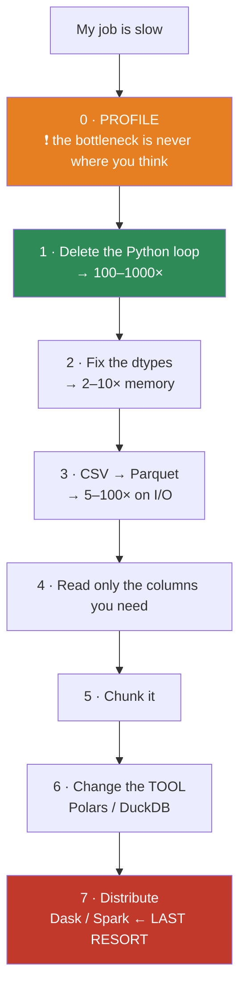
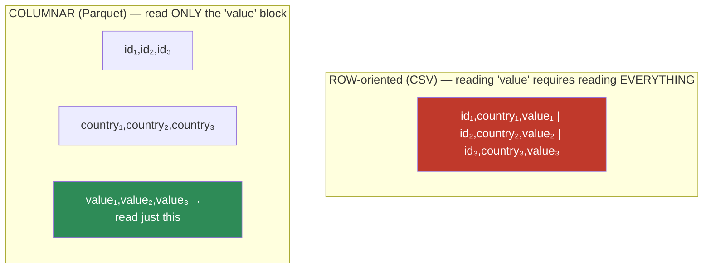
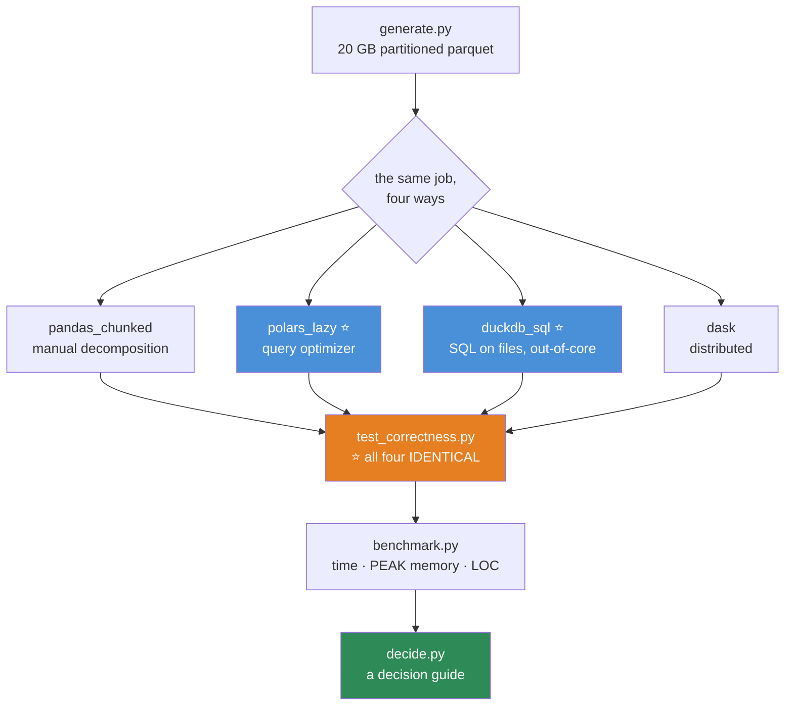

# 07.10 · Performance & Scale

[⬅ 07.9 Data Quality](07.9-data-quality.md) · [🏠 Module 07](../README.md) · [➡ 07.11 Pipelines](07.11-pipelines.md)

> **The lesson in one line:** Before you reach for Spark, switch from CSV to Parquet, fix your dtypes, and delete the loop — those three changes routinely turn a 4-hour job into a 4-minute one on the laptop you already have.

---

## 🎯 Learning objectives

By the end of this lesson you can:

1. Apply the **optimization ladder** in order, and stop climbing it as soon as the job is fast enough.
2. Cut a DataFrame's memory by **10× with dtypes alone**.
3. Explain **columnar storage** and why Parquet is 5–100× faster than CSV.
4. Process a dataset **larger than RAM** using chunking, and know when that stops working.
5. Choose between **Pandas, Polars, DuckDB, Dask, and Spark** — and know that the honest answer is usually "you don't need Spark."
6. **Profile before optimizing**, because the bottleneck is never where you think.

---

## 🧠 Mental model

> **The bottleneck is almost never CPU. It's memory bandwidth and I/O.**

Modern CPUs can do far more arithmetic than they can be fed with data ([02.3](../../02-Computer-Science/weeks/02.3-memory.md)). So the wins come from **moving less data**, not from computing faster:

- Read fewer columns (**Parquet**).
- Store each value in fewer bytes (**dtypes**).
- Touch memory once, contiguously (**vectorization**).
- Don't load what you don't need (**predicate pushdown**).



> [!IMPORTANT]
> **Climb this ladder in order, and stop the moment the job is fast enough.** The overwhelming majority of "we need Spark" conversations are actually "we're reading a 40 GB CSV with `object` dtypes inside a `for` loop." **Steps 1–4 are free, take an afternoon, and usually make the problem disappear.** Distributed computing adds a cluster, a scheduler, a serialization boundary, a debugging nightmare, and a bill — and should be the thing you do when you've genuinely exhausted a single machine.

---

## 1 · Vectorization — the 100–1000× win

Covered in [07.2](07.2-numpy.md) and [07.3](07.3-pandas-fundamentals.md), but it's rung 1 for a reason. **This is almost always the whole problem.**

```python
import pandas as pd, numpy as np, time
df = pd.DataFrame({'a': np.random.rand(200_000), 'b': np.random.rand(200_000)})

# ❌ 10.4 s   — constructs a Series PER ROW
r = [row['a'] * row['b'] for _, row in df.iterrows()]

# ❌  2.4 s   — a Python call per row
r = df.apply(lambda x: x['a'] * x['b'], axis=1)

# ✅  0.001 s — one C-level operation
r = df['a'] * df['b']
```

**`iterrows` → vectorized is 10,000×.** If you find yourself optimizing anything else before deleting your loops, you're on the wrong rung.

---

## 2 · Memory Optimization — the 10× win

```python
import pandas as pd, numpy as np

def optimize(df, verbose=True):
    """Downcast every column to the smallest type that fits its actual values."""
    before = df.memory_usage(deep=True).sum()

    for col in df.columns:
        c = df[col]
        if pd.api.types.is_integer_dtype(c):
            df[col] = pd.to_numeric(c, downcast='integer')
        elif pd.api.types.is_float_dtype(c):
            df[col] = pd.to_numeric(c, downcast='float')
        elif pd.api.types.is_object_dtype(c):
            # ⭐ THE BIG ONE: low-cardinality strings → category
            if c.nunique() / max(len(c), 1) < 0.5:
                df[col] = c.astype('category')

    after = df.memory_usage(deep=True).sum()
    if verbose:
        print(f"{before/1e6:.1f} MB → {after/1e6:.1f} MB  ({(1-after/before):.0%} saved)")
    return df
```

| Change | Saving |
|---|---|
| `float64` → `float32` | **50%** |
| `int64` → `int32` / `int16` / `int8` | 50% / 75% / **87%** |
| **`object` → `category`** (low cardinality) | **90–98%** ⭐ |
| Drop unused columns at read time | 100% of those columns |

> [!IMPORTANT]
> **`category` is the single biggest memory win available to you, and almost nobody uses it.** An `object` column stores a **pointer to a separate Python string object for every row** — a million rows of `"US"` stores a million pointers to a million (well, interned — but still heavyweight) objects. A `category` stores the unique values *once* plus a compact `int8` code array.
>
> **A 70 MB DataFrame routinely becomes 8 MB.** And groupby on a categorical is dramatically faster too, because it groups on integers.

> [!WARNING]
> **Downcast integers with care.** `int8` holds −128 to 127. If your `user_id` values exceed that, `downcast='integer'` won't shrink it (Pandas checks the range) — but if you cast manually with `.astype('int8')`, **it will silently overflow and wrap around**. Use `pd.to_numeric(downcast=...)`, which checks; never a bare `.astype()` on data you haven't range-checked.

---

## 3 · File Formats — the I/O win

**This is the rung people skip, and it's often the biggest single change.**

| Format | Size | Read | Typed? | Columnar? | Splittable? | Use for |
|---|---|---|---|---|---|---|
| **CSV** | **1×** | **1×** | ❌ | ❌ | ✅ | Humans, Excel, interop |
| **Parquet** | **~0.2×** | **~10×** | ✅ | ✅ | ✅ | ✅ **Your default** |
| **Feather/Arrow** | ~0.3× | **~30×** | ✅ | ✅ | ❌ | Fast local cache, IPC |
| **ORC** | ~0.2× | ~10× | ✅ | ✅ | ✅ | Hive/Spark ecosystems |
| **HDF5** | ~0.5× | fast | ✅ | ~ | ❌ | Scientific arrays |
| **Pickle** | ~0.5× | fast | ✅ | ❌ | ❌ | ⚠️ **Insecure, version-fragile. Avoid** |
| **JSON** | **2×** | **slow** | partial | ❌ | ✅ | APIs, nested data |

```python
import pandas as pd, time

df = pd.DataFrame({'id': range(5_000_000),
                   'country': ['US','UK','DE','FR'] * 1_250_000,
                   'value': np.random.rand(5_000_000)})

df.to_csv('d.csv', index=False)                              # 180 MB, 12 s
df.to_parquet('d.parquet', compression='snappy')             #  35 MB,  1.1 s

t = time.perf_counter(); pd.read_csv('d.csv');     print(f"csv     {time.perf_counter()-t:.2f}s")   # 4.2 s
t = time.perf_counter(); pd.read_parquet('d.parquet'); print(f"parquet {time.perf_counter()-t:.2f}s") # 0.4 s

# ⭐ Column pruning — read 1 column out of 3
t = time.perf_counter()
pd.read_parquet('d.parquet', columns=['value'])
print(f"parquet, 1 col: {time.perf_counter()-t:.3f}s")       # 0.08 s — 50× faster than the CSV
```

### Why columnar wins



**Three compounding advantages:**
1. **Column pruning** — a query touching 3 of 200 columns reads 1.5% of the file. On a wide table this alone is 50×.
2. **Compression** — similar values sit adjacent, so they compress far better (a column of `"US"` repeated a million times compresses to nearly nothing). **Dictionary encoding, run-length encoding, delta encoding** all become possible.
3. **Predicate pushdown** — Parquet stores min/max statistics per row-group, so a filter like `year == 2024` can **skip entire blocks without decompressing them**.

> [!IMPORTANT]
> **This is the same argument as columnar databases from [05.9](../../05-SQL/weeks/05.9-warehouses-lakes.md).** It's the same insight, applied to files instead of tables — and it's why the entire modern data stack (Parquet, Arrow, DuckDB, Iceberg, Delta) is columnar. **If you take one practical action from this lesson, stop writing CSVs.**

### Partitioning

```python
df.to_parquet('data/', partition_cols=['year', 'month'])
# data/year=2024/month=01/part-0.parquet
# data/year=2024/month=02/part-0.parquet

# Reading only 2024-03 touches ONE file. The rest are never opened.
pd.read_parquet('data/', filters=[('year','==',2024), ('month','==',3)])
```

**Partitioning turns a filter into a directory lookup.** Choose partition columns you filter on constantly (usually date). **Don't over-partition** — 10,000 tiny files is slower than one big one (the "small files problem": per-file overhead dominates).

---

## 4 · Chunked Processing — beating RAM

```python
import pandas as pd

# Process a 50 GB CSV in 100k-row chunks
totals = {}
for chunk in pd.read_csv('huge.csv', chunksize=100_000,
                         usecols=['country','revenue'],       # ← read less
                         dtype={'country':'category'}):        # ← store less
    partial = chunk.groupby('country', observed=True)['revenue'].sum()
    for k, v in partial.items():
        totals[k] = totals.get(k, 0) + v

result = pd.Series(totals).sort_values(ascending=False)
```

> [!CAUTION]
> **Chunking only works for operations that *decompose*.**
>
> | Operation | Chunkable? |
> |---|---|
> | `sum`, `count`, `min`, `max` | ✅ Trivially — combine the partials |
> | `mean` | ✅ Track sum and count separately, divide at the end |
> | **`median`, exact `nunique`, quantiles** | ❌ **They need all the data at once** |
> | **A join / merge** | ❌ Not in general (one side must fit, or you need a different algorithm) |
> | **Sort** | ❌ Needs an external merge sort |
>
> **When your operation doesn't decompose, chunking stops being an option — and *that* is the real signal to change tools.** Not "the file is big." Big files chunk fine. It's the *operation* that forces your hand.

**Memory-mapping** — for arrays that live on disk but are indexed like RAM:

```python
import numpy as np
arr = np.memmap('big.dat', dtype='float32', mode='r', shape=(100_000_000, 10))
print(arr[5_000_000:5_000_100].mean())   # only these pages are read from disk
```

---

## 5 · Choosing the Tool

| Tool | Sweet spot | Why |
|---|---|---|
| **Pandas** | **< 5 GB** | Ubiquitous, mature. Single-threaded, memory-hungry |
| **Polars** ⭐ | **1–100 GB** | Rust, **multi-threaded**, lazy, Arrow-backed. **5–30× faster than Pandas** |
| **DuckDB** ⭐ | **1–500 GB** | **SQL on Parquet files.** Zero setup, out-of-core, blazing fast |
| **Dask** | 100 GB – 10 TB | Pandas API, distributed. **Debugging is genuinely painful** |
| **Spark** | > 1 TB, a cluster you already have | The industry standard at real scale. Heavy, slow to start, expensive |

```python
# ── Polars: lazy evaluation, multi-threaded, query-optimized ──────
import polars as pl

result = (pl.scan_parquet('data/*.parquet')     # LAZY — nothing is read yet
            .filter(pl.col('year') == 2024)     # pushed down into the scan
            .group_by('country')
            .agg(pl.col('revenue').sum())
            .sort('revenue', descending=True)
            .collect())                          # NOW it runs, optimized end-to-end

# ── DuckDB: SQL directly on files, no import, out-of-core ─────────
import duckdb
duckdb.sql("""
    SELECT country, SUM(revenue) AS total
    FROM 'data/*.parquet'
    WHERE year = 2024
    GROUP BY country
    ORDER BY total DESC
""").df()      # → a Pandas DataFrame
```

> [!IMPORTANT]
> **DuckDB is the most underrated tool in data engineering, and it deserves your attention before Spark does.**
>
> It queries **Parquet files directly** with SQL, needs **no server and no setup** (`pip install duckdb`), is **out-of-core** (it handles data bigger than RAM automatically), **multi-threaded**, and it will comfortably process 100 GB on a laptop. You already know SQL ([Module 05](../../05-SQL/README.md)).
>
> **A very large fraction of "we need a Spark cluster" is actually "we need DuckDB and a Parquet file."** Try it before you provision anything.

> [!TIP]
> **Polars' lazy API is the other big idea here.** `scan_parquet` builds a *query plan* rather than reading data; `collect()` then optimizes the whole plan before executing — pushing filters down into the file scan, pruning columns automatically, and fusing operations. **It's a query optimizer, for DataFrames.** That's why it wins: not because Rust is fast, but because it **does less work**.

---

## 6 · Profiling — do this first

> [!IMPORTANT]
> **The bottleneck is never where you think it is.** Every experienced engineer has spent a day optimizing a function that turned out to be 2% of the runtime while an innocent-looking `merge` was 90%. **Measure. Then optimize. Never the reverse.**

```python
# ── Quick and dirty ───────────────────────────────────────────────
%timeit df.groupby('a').sum()          # in a notebook
%%time                                  # a whole cell

# ── Line by line — where the time ACTUALLY goes ───────────────────
# pip install line_profiler
%load_ext line_profiler
%lprun -f my_function my_function(df)

# ── Memory ────────────────────────────────────────────────────────
# pip install memory_profiler
%load_ext memory_profiler
%memit df.groupby('a').sum()           # PEAK memory, not just the result's size

# ── Function-level ────────────────────────────────────────────────
import cProfile
cProfile.run('build_features(df)', sort='cumtime')
```

> [!TIP]
> **`%memit` measures *peak* memory, and peak is what OOM-kills you.** A chained expression like `(a + b) * c - d` allocates several full-size temporaries that exist simultaneously. The *result* is 800 MB; the *peak* was 3.2 GB. **Only peak memory matters for whether your job survives.**

---

## ⚡ The performance table

| Problem | Fix | Typical gain |
|---|---|---|
| Python loop / `iterrows` | **Vectorize** | **100–10,000×** |
| `apply(axis=1)` | Vectorize or `np.where` | 100× |
| `object` string columns | **`category`** | **10–50× memory** |
| `float64` / `int64` | Downcast | 2–8× memory |
| Reading CSV | **Parquet** | **5–100×** |
| Reading all columns | `columns=[...]` / `usecols=` | 10–100× on wide tables |
| No partitioning | `partition_cols=['date']` | Skip files entirely |
| `pd.concat` in a loop | Build a list, concat once | **O(n²) → O(n)** |
| `groupby().apply(lambda)` | Built-in aggregation (Cython) | 10–100× |
| Categorical groupby | `observed=True` | Avoids a cartesian explosion |
| Chained expressions | `out=` / in-place ops | Halves peak memory |
| Data > RAM | Chunk → DuckDB → Polars → Dask | — |
| Genuinely > 1 TB | Spark | — |

---

## 🔒 Security & privacy considerations

| Concern | Note |
|---|---|
| **Parquet files have no access control** | A `.parquet` on shared storage is readable by anyone who can reach the path. **The file *is* the permission boundary** |
| **Column pruning is a privacy tool** | Reading only non-PII columns means PII **never enters your process's memory**. Use this deliberately |
| **Partition names leak** | `data/country=IR/` in a directory listing reveals the segments in your data — and sometimes that's sensitive |
| **Chunked temp files** | Intermediate spills to `/tmp` outlive the process and escape access controls |
| **Memory-mapped files** | The OS caches pages; another process on the same host may read them |
| **Pickle** | 💀 **Arbitrary code execution** on load. Never for untrusted data, and never as a durable format |
| **Distributed = wider blast radius** | Spark/Dask ship your data (and its PII) to every worker node, over the network, into every executor's memory and logs |

> [!WARNING]
> **Distributing your computation distributes your PII.** A Spark job spreads sensitive data across every executor's memory, its shuffle spills on local disk, and its logs. **Before you scale out, ask whether you can scale *down* the data instead** — aggregate, pseudonymize, or column-prune first. **The cheapest way to secure data is not to move it.**

---

## ✅ Best practices

| Practice | Why |
|---|---|
| **Profile first** | The bottleneck is never where you think |
| **Climb the ladder in order** | Vectorize → dtypes → Parquet → columns → chunk → tool → distribute |
| **Stop as soon as it's fast enough** | Optimization has a cost too |
| **Parquet by default** | Typed, columnar, compressed, 5–100× faster |
| **Read only the columns you need** | The cheapest optimization there is — and a privacy control |
| **`category` on low-cardinality strings** | The biggest memory win, and nobody uses it |
| **Set dtypes at read time**, not after | Otherwise you pay the memory cost anyway |
| **Partition by what you filter on** | Turns a scan into a directory lookup |
| **Don't over-partition** | 10,000 tiny files is slower than one big one |
| **Measure PEAK memory** | Peak is what kills you, not the result size |
| **Try DuckDB before Spark** | It handles 100 GB on a laptop, with SQL, and no setup |
| **Distributed computing is a last resort** | A cluster, a scheduler, a debugging nightmare, and a bill |

---

## 🐛 Common mistakes

| Mistake | Consequence |
|---|---|
| **Optimizing before profiling** | A day spent on 2% of the runtime |
| **Reaching for Spark first** | A cluster and a bill for a problem DuckDB solves on a laptop |
| Storing everything as CSV | 5× the size, 10× the read time, no types, no pruning |
| `object` dtype on strings | 10–50× memory waste |
| Leaving `float64` everywhere | 2× memory for precision you don't need |
| Reading all 200 columns to use 3 | 60× more I/O than necessary |
| `pd.concat` / `np.append` in a loop | O(n²) |
| Chunking a median or a join | **It doesn't decompose.** You'll get a wrong answer or an OOM |
| Over-partitioning | The small-files problem — per-file overhead dominates |
| Measuring result size instead of **peak** | You OOM anyway |
| Distributing PII without thinking | Sensitive data now lives in every executor's memory and logs |
| **Pickle as a storage format** | Insecure, and it breaks between library versions |

---

## 📝 Exercises

**Conceptual**
1. Why is the bottleneck usually memory bandwidth rather than CPU?
2. Explain the three compounding advantages of columnar storage.
3. Which operations chunk cleanly, and which don't? **Why is that the real signal to change tools** — rather than file size?
4. Why should you try DuckDB before Spark?
5. Why does distributing a computation widen your privacy blast radius?

**Performance tasks**
6. Build a 5M-row DataFrame. Write it as CSV and Parquet. **Compare: file size, write time, read time, and read-one-column time.** Report all four.
7. Write `optimize(df)` that downcasts every column. Run it on a real dataset. **Target: 5–10× reduction.** Report before/after by column.
8. Process a file larger than your RAM with `chunksize`. Compute a `groupby` sum. **Then try to compute a median the same way and explain exactly why you can't.**
9. Time the same groupby in Pandas, Polars, and DuckDB on 10M rows. **Report the ratios.** Explain Polars' lazy advantage.
10. Take a slow function. Profile it with `line_profiler`. **Was the bottleneck where you expected?** (It won't be.)
11. Measure peak memory of `(a + b) * c - d` on 50M-element arrays with `%memit`. Then rewrite it with in-place ops and measure again.
12. Partition a Parquet dataset by date. Query one day. Verify (by timing, and by checking file access) that only one file was read.

---

## 🛠️ Mini project — *The Big Data Processor*

Build `code/07-data-analysis/big-data/` — process a dataset **much larger than your RAM**, correctly and fast, on one machine.

**Requirements**
- Process a ≥ 20 GB dataset (generate one) on a laptop with 8–16 GB RAM.
- Implement the **same job four ways**: Pandas chunked, Polars lazy, DuckDB SQL, and Dask.
- **Benchmark all four**: wall time, peak memory, lines of code.
- Produce a **decision guide**: given a dataset size and an operation, which tool?

```
big-data/
├── README.md
├── requirements.txt          # pandas, polars, duckdb, dask, pyarrow, memory_profiler
├── src/
│   ├── generate.py       # create a 20 GB dataset (partitioned parquet)
│   ├── convert.py        # CSV → Parquet; report the size/time win
│   ├── optimize.py       # dtype downcasting
│   ├── jobs/
│   │   ├── pandas_chunked.py
│   │   ├── polars_lazy.py     # ⭐ scan → filter → group → collect
│   │   ├── duckdb_sql.py      # ⭐ SQL directly on the parquet files
│   │   └── dask_dist.py
│   ├── benchmark.py      # ⭐ time + PEAK memory + LOC for each
│   └── decide.py         # size × operation → recommended tool
├── tests/
│   ├── test_correctness.py   # ⭐ ALL FOUR must produce IDENTICAL results
│   └── test_memory.py        # ⭐ peak memory must stay under the limit
└── results/
    └── benchmark.md
```

**Architecture**



**Implementation guidance**
1. **`generate.py`** — make it *realistically* messy: a high-cardinality ID column, a low-cardinality category (so `category` dtype shines), a skewed numeric, a date column for partitioning, and some nulls.
2. **The job should be non-trivial:** a filter, a groupby with multiple aggregations, and a join against a dimension table. **A pure `sum` is too easy** and won't reveal the differences between the tools.
3. **`benchmark.py` must measure PEAK memory, not just wall time.** Use `memory_profiler`. **The peak is the number that decides whether the job runs at all** — and it's the axis on which Pandas loses hardest.
4. **`test_correctness.py` is the most important file.** All four implementations must produce **byte-identical results**. When they don't — and they won't, on the first try — the debugging is where you learn. (Common culprits: null handling differs, float summation order changes the last decimal, category ordering.) **Use `pd.testing.assert_frame_equal` with an explicit tolerance and sort both sides first.**
5. **`decide.py` is the deliverable.** A table: given (data size, operation type, available RAM), which tool and why. **Write it from your own measurements, not from blog posts.** The honest conclusion will probably surprise you — DuckDB will likely win on most of your benchmarks, and Spark will be nowhere.

**Testing strategy**
- **`test_correctness.py` ⭐** — all four produce identical output. Non-negotiable. **A faster wrong answer is worthless.**
- **`test_memory.py` ⭐** — assert peak memory stays under a hard cap (e.g. 4 GB) for each implementation. **This is the test that proves the chunking actually works** rather than just appearing to.
- `test_chunk_decomposition.py` — assert that the chunked mean equals the full-data mean, and **assert that a chunked median does NOT** (document the failure explicitly, so the limitation is captured in code rather than in a comment nobody reads).
- Run on: an empty dataset, a single-partition dataset, and one with a null-heavy column. **Edge cases break big-data code far more than volume does.**

**Future improvements**
- Add a **streaming** version (process as data arrives, never materialize).
- Add **predicate pushdown verification** — prove that filtering on a partitioned column reads fewer files (count the file opens).
- Add a **cost model**: at what data size does a cloud Spark cluster become cheaper than a bigger single machine? (**The answer is much, much further out than most teams assume**, and computing it is a genuinely useful thing to be able to do in a planning meeting.)

---

## 📄 Cheat sheet

| Ladder rung | Action | Gain |
|---|---|---|
| **0** | **Profile** (`%lprun`, `%memit`) | — |
| **1** | **Vectorize** — kill `iterrows`/`apply` | **100–10,000×** |
| **2** | **Dtypes** — `category`, downcast | **2–50× memory** |
| **3** | **Parquet** instead of CSV | **5–100×** |
| **4** | **Read only what you need** (`columns=`) | 10–100× |
| **5** | **Chunk** (`chunksize=`) | Beats RAM |
| **6** | **Change tool** — Polars, **DuckDB** | 5–30× |
| **7** | **Distribute** — Dask, Spark | ⚠️ Last resort |

| Tool | Sweet spot |
|---|---|
| Pandas | < 5 GB |
| **Polars** | 1–100 GB — lazy, multi-threaded |
| **DuckDB** ⭐ | 1–500 GB — **SQL on Parquet, no setup, out-of-core** |
| Dask | 100 GB – 10 TB |
| Spark | > 1 TB |

| Chunkable? | |
|---|---|
| ✅ | sum, count, min, max, mean (track sum+count) |
| ❌ | **median, exact nunique, quantiles, joins, sort** |

**Peak memory is what OOMs you.** · **Parquet by default.** · **Try DuckDB before Spark.**

---

## 🎴 Flashcards

- **Q:** What's the real bottleneck in data processing? → **A:** **Memory bandwidth and I/O**, not CPU. Wins come from **moving less data**, not computing faster.
- **Q:** State the optimization ladder in order. → **A:** Profile → vectorize → dtypes → Parquet → column pruning → chunk → change tool → distribute. **Stop as soon as it's fast enough.**
- **Q:** Why is Parquet 5–100× faster than CSV? → **A:** **Columnar**: (1) read only the columns you need, (2) similar adjacent values compress far better, (3) **predicate pushdown** skips whole row-groups using min/max statistics.
- **Q:** What's the biggest memory win in Pandas? → **A:** **`category`** on low-cardinality strings — 10–50× reduction. An `object` column stores a pointer per row; a category stores each unique value once plus an int8 code array.
- **Q:** Which operations chunk cleanly, and which don't? → **A:** ✅ sum, count, min, max, mean. ❌ **median, exact nunique, quantiles, joins, sort** — they need all the data at once. **That's the real signal to change tools**, not file size.
- **Q:** Why is DuckDB underrated? → **A:** SQL **directly on Parquet files**, no server, no setup, **out-of-core**, multi-threaded. It handles 100 GB on a laptop. **Most "we need Spark" is actually "we need DuckDB."**
- **Q:** What makes Polars fast? → **A:** Not just Rust — its **lazy API builds a query plan** that gets optimized end-to-end (filter pushdown, column pruning, operation fusion) before executing. **It does less work.**
- **Q:** Why measure *peak* memory rather than result size? → **A:** Peak is what OOM-kills you. `(a+b)*c-d` allocates several full-size temporaries simultaneously — the result is 800 MB but the peak was 3.2 GB.
- **Q:** Why is over-partitioning bad? → **A:** The **small-files problem** — 10,000 tiny files means per-file overhead dominates, and it's slower than one big file.
- **Q:** Why does distributing computation widen your privacy risk? → **A:** Spark/Dask ship your data (and PII) to **every executor's memory, shuffle spills, and logs**. **The cheapest way to secure data is not to move it.**
- **Q:** Why is Pickle a bad storage format? → **A:** **Arbitrary code execution** on load, and it breaks between library versions.

---

## 💼 Interview questions

1. **"Your Pandas job takes 4 hours. Walk me through optimizing it."** — **Profile first.** Then: kill the loops (100–1000×), fix the dtypes (10× memory), switch to Parquet (10× I/O), read fewer columns, chunk, and only *then* consider a different tool. **Mention you'd stop as soon as it's fast enough.**
2. **"You have a 100 GB dataset and 16 GB of RAM. What do you do?"** — **DuckDB** (SQL on Parquet, out-of-core, no setup) or **Polars lazy**. Chunking if the operation decomposes. **Spark only if you genuinely have a cluster and > 1 TB.** The candidate who reaches for Spark first has failed the question.
3. **"Why is Parquet faster than CSV?"** — Columnar: column pruning, better compression (adjacent similar values), predicate pushdown via row-group statistics. Plus it's **typed**, so no parsing and no guessing.
4. **"How do you process data larger than memory?"** — Chunking (**if the operation decomposes** — say this), memory-mapping, out-of-core engines (DuckDB/Polars), or aggregating in the database first. **Name what doesn't chunk: median, joins, sort.**
5. **"When would you actually use Spark?"** — Genuinely > 1 TB, an existing cluster, an existing team that knows it, or a job that must integrate with a Hadoop/Databricks ecosystem. **Not for 50 GB.** Being willing to say "you probably don't need it" is the correct answer and a good signal.
6. **"Your job OOMs but the result is only 500 MB. Why?"** — **Peak memory ≠ result size.** Chained expressions allocate multiple full-size temporaries simultaneously. Use in-place operations and `out=`.

---

## 📚 Summary

- **The bottleneck is memory bandwidth and I/O, not CPU.** Wins come from **moving less data**.
- **Climb the ladder in order and stop when it's fast enough:** profile → vectorize (100–10,000×) → dtypes (10× memory) → **Parquet** (5–100×) → column pruning → chunk → change tool → distribute.
- **`category` is the biggest memory win in Pandas** and almost nobody uses it. A 70 MB DataFrame becomes 8 MB.
- **Parquet wins three ways:** column pruning, better compression, and predicate pushdown. **Stop writing CSVs.** Same argument as columnar databases — that's why the whole modern data stack is columnar.
- **Chunking only works for operations that decompose.** Sum, count, min, max, mean: yes. **Median, exact nunique, joins, sort: no.** *That* — not file size — is the real signal to change tools.
- **Try DuckDB before Spark.** SQL directly on Parquet, no server, out-of-core, 100 GB on a laptop. **A very large fraction of "we need a cluster" is "we need DuckDB."** Polars wins by having a **query optimizer**, not just by being Rust.
- **Measure peak memory**, not result size — peak is what OOMs you.
- **Distributed computing is a last resort:** a cluster, a scheduler, a debugging nightmare, a bill — **and a much wider privacy blast radius**, because your PII now lives in every executor's memory and logs.

**Next:** [07.11 Reusable Data Pipelines](07.11-pipelines.md) — turning everything in this module into code that runs the same way twice.

---

## 🔗 References

- Apache Parquet — [format documentation](https://parquet.apache.org/docs/). Read the section on encodings; it explains *why* the compression is so good.
- Polars — [User guide, Lazy API](https://docs.pola.rs/user-guide/lazy/). The query-optimizer idea is the whole thing.
- DuckDB — [Why DuckDB](https://duckdb.org/why_duckdb). **Read this, then try it on your biggest file.** It will change what you reach for.
- Abadi et al. (2013) — *The Design and Implementation of Modern Column-Oriented Database Systems* — the rigorous case for columnar.
- McKinney — *Apache Arrow and the "10 Things I Hate About pandas"* (blog). Pandas' creator on Pandas' limits; it's why Arrow and Polars exist.
- [02.3 Memory](../../02-Computer-Science/weeks/02.3-memory.md) — the cache hierarchy that makes all of this true.
- [05.9 Warehouses & Lakes](../../05-SQL/weeks/05.9-warehouses-lakes.md) — the same columnar argument, at database scale.

---

## 🧭 Navigation

| Direction | Link |
|---|---|
| ⬅ Previous | [07.9 Data Quality](07.9-data-quality.md) |
| ➡ Next | [07.11 Reusable Data Pipelines](07.11-pipelines.md) |
| 🏠 Module | [Module 07](../README.md) |
| 🗺 Roadmap | [ROADMAP.md](../../../ROADMAP.md) |
