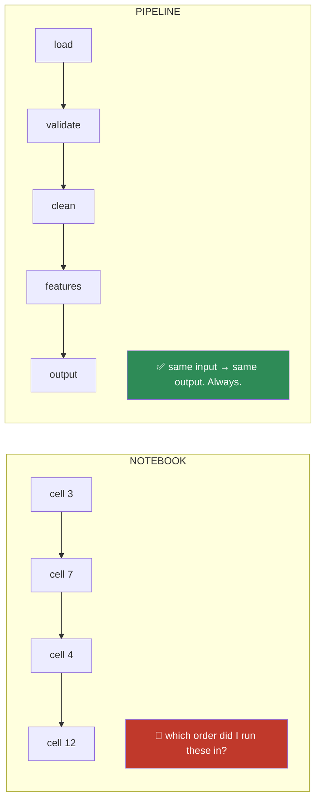
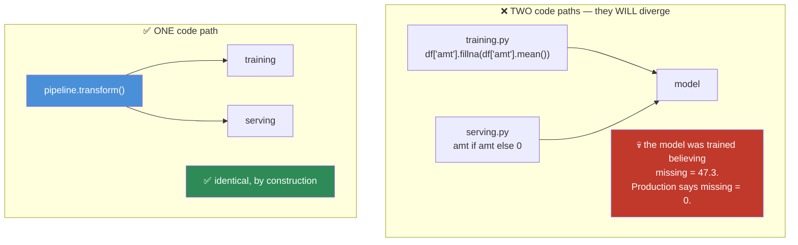
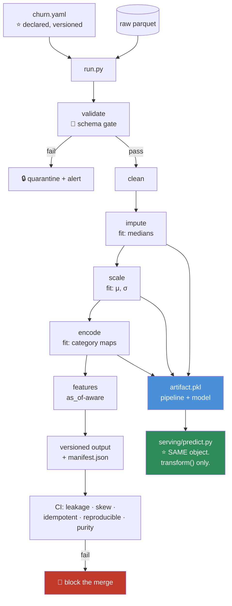

# 07.11 · Reusable Data Pipelines

[⬅ 07.10 Performance](07.10-performance.md) · [🏠 Module 07](../README.md) · [➡ 07.12 Case Studies](07.12-case-studies.md)

> **The lesson in one line:** A notebook is a record of what you did once; a pipeline is a guarantee that it will happen the same way every time — and only one of those two things can go to production.

---

## 🎯 Learning objectives

By the end of this lesson you can:

1. Explain why a notebook is **not** a pipeline, and what specifically breaks.
2. Design a pipeline from **pure, composable, testable** steps.
3. Enforce the **fit/transform** contract so leakage is *structurally impossible*.
4. Make a pipeline **reproducible** — same input, same code, same output, forever.
5. **Version datasets** and know why "version the code" is not enough.
6. Kill **training/serving skew** by construction, not by discipline.

---

## 🧠 Mental model

> **A pipeline is a pure function: `f(raw_data, config) → features`. It has no memory, no hidden state, and no dependence on the order you ran the cells.**



---

## 📖 Why a notebook is not a pipeline

| | Notebook | Pipeline |
|---|---|---|
| **Execution order** | Whatever you clicked | Deterministic, declared |
| **Hidden state** | ✅ Yes — variables from cells you deleted | ❌ None |
| **Reproducible** | ❌ Almost never | ✅ Guaranteed |
| **Testable** | ❌ | ✅ |
| **Reviewable in a PR** | ❌ (JSON diffs are unreadable) | ✅ |
| **Runs in production** | ❌ | ✅ |
| **Great for exploration** | ✅ **Yes — genuinely** | ❌ Too rigid |

> [!IMPORTANT]
> **Notebooks are excellent for exploration and disqualifying for production**, and both halves of that sentence are true. The failure mode isn't using notebooks — it's *shipping* them.
>
> The killer is **hidden state**: you define `df` in cell 3, modify it in cell 8, delete cell 8, and cell 12 still works — because `df` is still in memory. **The notebook now produces a result that its own code cannot reproduce.** Restart the kernel and run all, and it breaks. This is not hypothetical; it is the single most common way analysis results become irreproducible.
>
> **The rule: explore in a notebook, then extract the logic into functions the notebook imports.** The notebook becomes a thin presentation layer over tested code. **You keep the interactivity and lose the hidden state.**

---

## 1 · Pipeline Design — pure, composable steps

```python
from dataclasses import dataclass
from typing import Protocol
import pandas as pd

class Step(Protocol):
    """Every step: fit learns parameters from TRAIN; transform applies them."""
    def fit(self, df: pd.DataFrame) -> "Step": ...
    def transform(self, df: pd.DataFrame) -> pd.DataFrame: ...


@dataclass
class Pipeline:
    steps: list[tuple[str, Step]]

    def fit(self, df):
        for name, step in self.steps:
            step.fit(df)
            df = step.transform(df)     # each step sees the OUTPUT of the previous
        return self

    def transform(self, df):
        for name, step in self.steps:
            df = step.transform(df)     # ⭐ NO fitting. Ever.
        return df

    def fit_transform(self, df):
        return self.fit(df).transform(df)
```

```python
pipeline = Pipeline([
    ('validate',  SchemaValidator(schema)),        # 07.9
    ('clean',     Cleaner(rules)),                 # 07.5
    ('impute',    Imputer(strategy='median')),     # learns the medians
    ('scale',     StandardScaler()),               # learns μ, σ
    ('encode',    CategoryEncoder()),              # learns the category maps
    ('features',  FeatureBuilder(config)),         # 07.7
])

X_train = pipeline.fit_transform(train_df)   # LEARNS from train
X_test  = pipeline.transform(test_df)        # APPLIES only. Cannot leak.
X_prod  = pipeline.transform(one_row)        # SAME code path in production ⭐
```

> [!IMPORTANT]
> **The fit/transform split is not a convention — it is a structural leakage guard.**
>
> `transform()` **has no code path that learns anything.** It physically cannot compute a mean from the test set, because there is no code in it that computes means. **You could not leak the test set into training if you tried.**
>
> This is the difference between *"we're careful about leakage"* (a promise, which people break) and *"leakage is impossible here"* (a property of the design). **Always prefer structural guarantees to discipline.** Discipline fails at 2 a.m. under deadline; structure doesn't.

### Every step should be pure

```python
# ❌ Impure — mutates the input, depends on globals, non-deterministic
def clean(df):
    df['x'] = df['x'].fillna(GLOBAL_MEAN)     # hidden dependency
    df.drop(columns=['y'], inplace=True)      # mutates the caller's data!
    return df

# ✅ Pure — same input always gives the same output; the input is untouched
def clean(df: pd.DataFrame, fill_value: float) -> pd.DataFrame:
    out = df.copy()                            # never mutate the input
    out['x'] = out['x'].fillna(fill_value)     # parameter, not a global
    return out.drop(columns=['y'])
```

**Pure steps are testable, cacheable, parallelizable, and debuggable.** Impure ones are none of those things, and they produce the class of bug where re-running a cell gives a different answer.

---

## 2 · Reproducibility

> **"It worked on my machine three months ago" is not a result.**

**Five things must be pinned. Miss any one, and reproducibility fails.**

| Pin | How | What breaks without it |
|---|---|---|
| **1 · Code** | Git commit SHA | You can't tell which version produced the result |
| **2 · Data** | Dataset version / content hash | The source table changed underneath you |
| **3 · Config** | A versioned config file | Someone changed a threshold and didn't tell you |
| **4 · Environment** | Locked deps (`uv.lock`, `poetry.lock`), Docker | Pandas 2.1 changed a default and your output moved |
| **5 · Randomness** | A seed, passed explicitly | Different split, different answer |

```python
import hashlib, json, subprocess
from datetime import datetime, timezone

def run_pipeline(raw_path: str, config: dict, seed: int = 42) -> tuple[pd.DataFrame, dict]:
    rng = np.random.default_rng(seed)                       # ⭐ explicit, local RNG

    raw = pd.read_parquet(raw_path)

    manifest = {
        'run_at':       datetime.now(timezone.utc).isoformat(),
        'git_sha':      subprocess.check_output(
                            ['git','rev-parse','HEAD']).decode().strip(),
        'git_dirty':    bool(subprocess.check_output(['git','status','--porcelain'])),
        'input_path':   raw_path,
        'input_hash':   hashlib.sha256(open(raw_path,'rb').read()).hexdigest()[:16],
        'input_rows':   len(raw),
        'config_hash':  hashlib.sha256(
                            json.dumps(config, sort_keys=True).encode()).hexdigest()[:16],
        'config':       config,
        'seed':         seed,
        'pandas':       pd.__version__,
        'numpy':        np.__version__,
    }

    features = pipeline.fit_transform(raw)
    manifest['output_rows'] = len(features)
    manifest['output_cols'] = list(features.columns)
    return features, manifest
```

> [!CAUTION]
> **`git_dirty` is the field everyone forgets, and it's the one that catches you.** A result produced from uncommitted changes **cannot be reproduced** — the code that made it doesn't exist anywhere but on your laptop, and you'll overwrite it tomorrow. **A dirty run should be loudly flagged, and for anything that matters, it should be refused outright.**

> [!WARNING]
> **`np.random.seed(42)` sets *global* state** — which means any library you call can consume from and perturb the same stream, and your "reproducible" run silently isn't. **Use `rng = np.random.default_rng(seed)` and pass `rng` explicitly.** Same for `random.seed`, `torch.manual_seed`, and the `random_state=` argument of every sklearn function. **Seed locally, pass explicitly.**

---

## 3 · Dataset Versioning

> **You version your code. Why don't you version your data?**

**Because "the model got worse" has two possible causes, and without data versioning you cannot tell them apart.**

| Approach | How | Trade-off |
|---|---|---|
| **Immutable, dated paths** ⭐ | `s3://data/2024-07-14/train.parquet` | ✅ Dead simple, works everywhere. Storage grows |
| **Content-addressed** | Filename = hash of contents | ✅ Perfect dedup, self-verifying |
| **DVC** | Git-like, stores pointers in git, blobs in S3 | ✅ Git-native workflow. Another tool |
| **Delta Lake / Iceberg** | ACID + time travel on a lake | ✅ `SELECT ... VERSION AS OF 3`. Heavier |
| **Snapshot tables** | `features_v3` in the warehouse | Simple; table sprawl |

```python
# The simplest thing that works — and it works surprisingly well
version = f"{datetime.now(timezone.utc):%Y%m%d_%H%M%S}_{manifest['git_sha'][:7]}"
out = f"s3://features/{version}/"
features.to_parquet(f"{out}/features.parquet")
json.dump(manifest, open(f"{out}/manifest.json", 'w'), indent=2)

# NEVER overwrite. Append a new version.  ← the entire discipline, in one line
```

> [!IMPORTANT]
> **The single most important rule: never overwrite a dataset.** Write a new version.
>
> Storage is **cheap** (a few cents per GB per month). **A model you cannot reproduce is worthless** — you cannot debug it, you cannot audit it, you cannot roll it back, and you cannot explain it to a regulator. The asymmetry is enormous, and it is the same rule as the immutable Bronze layer from [07.1](07.1-data-lifecycle.md).
>
> **And you must be able to answer: "the model got worse — did the code change, or did the data change?"** Without data versioning, that question is unanswerable, and you will spend a week finding out what a diff could have told you in ten seconds.

---

## 4 · Killing Training/Serving Skew

**The most expensive bug in production ML, and it's a *design* problem, not a coding problem.**



**Three defences, in increasing strength:**

**1 · One code path.** The pipeline object is serialized alongside the model and **imported by the serving code**. Not reimplemented — *imported*.

```python
import joblib

# Training
pipeline.fit(train_df)
joblib.dump({'pipeline': pipeline, 'model': model,
             'manifest': manifest}, 'artifact_v3.pkl')

# Serving — the SAME pipeline object, not a reimplementation
art = joblib.load('artifact_v3.pkl')
X = art['pipeline'].transform(request_df)     # ⭐ identical transform. By construction.
pred = art['model'].predict(X)
```

**2 · A feature store.** One definition, computed once, read by both training (offline) and serving (online). ([05.12](../../05-SQL/weeks/05.12-ai-data-workflows.md))

**3 · The skew test — write this one.**

```python
def test_no_skew(pipeline, sample_df):
    """Batch-transforming N rows must equal transforming them one at a time."""
    batch = pipeline.transform(sample_df)
    single = pd.concat([pipeline.transform(sample_df.iloc[[i]])
                        for i in range(len(sample_df))], ignore_index=True)
    pd.testing.assert_frame_equal(batch.reset_index(drop=True), single, check_dtype=True)
```

> [!CAUTION]
> **This test catches a whole class of production disaster.** In training you have 100,000 rows; in production you have **one**. Any step that computes something **across rows** — a mean, a rank, a frequency count, a groupby, a scaler that refits — will behave **completely differently on a single row** and pass every unit test you have.
>
> A `StandardScaler` that refits on the incoming batch will, on a single row, produce **exactly zero** for every feature (a single value's deviation from its own mean is 0). **Your model receives all-zeros in production and you will not know why.** This test finds it in ten seconds.

---

## 5 · Orchestration

For anything scheduled, you eventually need an orchestrator.

| Tool | Model | Use when |
|---|---|---|
| **Cron + a script** | Nothing fancy | ✅ **Genuinely fine for a while.** Don't over-engineer |
| **Airflow** | Task DAG | The industry standard. Heavy, dated, everywhere |
| **Dagster** | ⭐ **Asset**-based | Models *data assets*, not tasks. Better fit for ML |
| **Prefect** | Pythonic | Lighter than Airflow |
| **dbt** | SQL transforms | ✅ In-warehouse transformation + lineage + tests, free |

> [!TIP]
> **Dagster's insight is worth understanding even if you never use it.** Airflow orchestrates **tasks** ("run this script"). Dagster orchestrates **assets** ("this table should exist and be fresh"). **For data work, the asset model is the right abstraction** — because what you actually care about is *"is `customer_features` up to date?"*, not *"did task 47 exit zero?"* Those are different questions, and the second one can be "yes" while the first is "no."

**What every orchestrated pipeline needs, regardless of tool:**

| Requirement | Why |
|---|---|
| **Idempotency** ⭐ | Retries are guaranteed. Running twice must equal running once ([05.10](../../05-SQL/weeks/05.10-etl-elt.md)) |
| **Atomicity** | Write to a temp path, then move. Never leave a half-written table |
| **Backfill** | You *will* need to re-run last month. Parameterize by date |
| **Alerting** | A silent failure is worse than a loud one |
| **Retries with backoff** | Transient failures are the common case |

```python
# ✅ Idempotent + atomic write
def write_partition(df, date):
    tmp = f"/tmp/{date}.parquet"
    final = f"s3://data/date={date}/data.parquet"
    df.to_parquet(tmp)
    fs.move(tmp, final)     # atomic — readers see the old file or the new one, never half
```

---

## ⚡ Performance considerations

| Concern | Approach |
|---|---|
| Re-running expensive steps | **Cache by input hash.** If the inputs didn't change, skip |
| Slow full rebuilds | **Incremental** processing — only new partitions |
| Serial steps | Parallelize independent branches |
| Sharing intermediates | Materialize to Parquet between stages |
| Pipeline startup cost | Load the artifact **once**, not per request |

```python
from functools import lru_cache
import hashlib

def cache_key(step_name, input_hash, config_hash):
    return f"{step_name}_{input_hash}_{config_hash}"

# If the cache key exists, skip the step entirely.
# ⭐ This is why steps must be PURE — you can only cache a function
#    whose output depends solely on its inputs.
```

> [!IMPORTANT]
> **Purity buys you caching, and caching is what makes iteration fast.** An impure step (one that reads a global, mutates its input, or depends on the clock) **cannot be safely cached**, because you don't know when its output is stale. **The design property and the performance property are the same property.**

---

## 🔒 Security & privacy considerations

| Concern | Note |
|---|---|
| **Serialized pipelines contain data** | A fitted `StandardScaler` holds the **training means** — a summary of real people. A fitted encoder holds the **category vocabulary**. A `.pkl` artifact is a data artifact |
| **`joblib.load` / pickle** | 💀 **Arbitrary code execution.** Only load artifacts **you** produced, from storage **you** control |
| **Manifests can leak** | Don't log data *values* in a manifest — log hashes, counts, and schema |
| **Cached intermediates** | Cache files in `/tmp` or S3 outlive the run and often escape access controls. **Set a TTL and encrypt** |
| **Secrets in config** | Never commit DB passwords or API keys in a config file. Environment variables or a secret manager |
| **Every version retained forever** | Data versioning conflicts directly with **GDPR right-to-deletion** — a deleted user still exists in 40 historical snapshots |

> [!WARNING]
> **Dataset versioning and the right to deletion are in direct tension, and you must design for it on day one.**
>
> If a user requests deletion, they exist in: the raw store, every silver/gold table, **every historical dataset version**, the feature store, caches, training snapshots, and possibly **inside the model's weights**. Retrofitting deletion into a system with 200 immutable snapshots is close to impossible.
>
> **The design that works: pseudonymize at ingestion.** Keep a separate, access-controlled `user_id → pseudonym` mapping table. **Deleting the mapping row severs the link** — the historical snapshots keep their pseudonymous rows, which are no longer attributable to a person. **This is a decision you make once, at the start, and cannot easily make later.**

---

## ✅ Best practices

| Practice | Why |
|---|---|
| **Explore in a notebook; ship functions** | Notebooks have hidden state; production doesn't tolerate it |
| **Pure steps** | Testable, cacheable, parallelizable, debuggable |
| **`fit` on train; `transform` everywhere** | **Structural** leakage prevention, not discipline |
| **Never mutate the input** | `df.copy()` — impurity is the source of the weirdest bugs |
| **Pin all five: code, data, config, environment, seed** | Miss any one and reproducibility fails |
| **`rng = default_rng(seed)`, passed explicitly** | Global seeds are shared state and silently break |
| **Flag/refuse dirty git runs** | An unreproducible result is not a result |
| **Never overwrite a dataset** | Storage is cheap; an unreproducible model is worthless |
| **Emit a manifest for every run** | git SHA, input hash, config hash, row counts, library versions |
| **Serialize the pipeline WITH the model** | One artifact, one code path, no skew |
| **Write the skew test** | Batch-transform must equal single-row transform |
| **Idempotent + atomic writes** | Retries are guaranteed |
| **Pseudonymize at ingestion** | The only design that survives a deletion request |

---

## 🐛 Common mistakes

| Mistake | Consequence |
|---|---|
| **Shipping a notebook** | Hidden state; the result cannot be reproduced by its own code |
| Impure steps (globals, mutation) | Uncacheable, untestable, non-deterministic |
| **Refitting a transformer at inference** | **Training/serving skew.** A scaler on one row outputs all zeros |
| **Reimplementing features in the serving code** | The two implementations **will** diverge |
| Not pinning the environment | A library update silently changes your output |
| **`np.random.seed()` (global)** | Shared state; another library perturbs your stream |
| **Overwriting `data.csv`** | Nothing is ever reproducible again |
| Not versioning data | *"Did the code change or the data change?"* is unanswerable |
| Not emitting a manifest | You cannot audit or reproduce any past run |
| Non-idempotent steps | A retry duplicates your data |
| Non-atomic writes | A crash leaves a half-written table that downstream reads as complete |
| **Retaining every version with no deletion plan** | GDPR request → 200 immutable snapshots → an impossible afternoon |

---

## 📝 Exercises

**Conceptual**
1. Why is a notebook not a pipeline? Name the specific mechanism that makes results irreproducible.
2. Why does the `fit`/`transform` split make leakage **structurally impossible** rather than merely unlikely?
3. Name the five things that must be pinned for reproducibility. What breaks if you miss each?
4. Why is `np.random.seed(42)` worse than `rng = np.random.default_rng(42)`?
5. Why do dataset versioning and GDPR deletion conflict, and what design resolves it?

**Pipeline tasks**
6. Build a `Pipeline` class with the `fit`/`transform` contract. Add four steps. **Assert that `transform` never modifies any fitted parameter.**
7. Write the **skew test**: batch-transform N rows must equal transforming them one at a time. **Then deliberately add a step that refits on the input and watch the test catch it.**
8. Write `run_pipeline` that emits a full manifest (git SHA, dirty flag, input hash, config hash, seed, library versions). Run it twice with an unchanged input; assert the output hashes match.
9. Make a pipeline step **impure** (mutate the input). Show how it breaks when you run the pipeline twice on the same DataFrame.
10. Implement content-addressed dataset versioning: the filename is the hash of the contents. Show that writing identical data twice produces one file.
11. Implement caching by input hash. Time a full run and a cached re-run. **Then make one step impure and explain why it can no longer be safely cached.**

**Design**
12. Design a pipeline for a churn model that must run daily, backfill on demand, be idempotent, and serve single-row inference. **Draw the diagram.** Mark where each leakage guard lives.
13. Your company gets a GDPR deletion request. **List every place the user's data exists** in your pipeline. Then redesign so the answer is "one row in one table."

---

## 🛠️ Mini project — *The Production Pipeline*

Build `code/07-data-analysis/pipeline/` — the artifact that ties the whole module together. **This is the capstone.**

**Requirements**
- Raw data → validated → cleaned → features → versioned output, with a **manifest**.
- **Fit on train only**; the same object serves training and single-row inference.
- **Idempotent, atomic, reproducible, cached.**
- **Leakage and skew tests run in CI and block the merge.**

```
pipeline/
├── README.md
├── requirements.txt
├── configs/
│   └── churn.yaml            # ⭐ the pipeline is DECLARED, not hardcoded
├── src/
│   ├── base.py           # Step protocol; Pipeline; fit/transform contract
│   ├── steps/
│   │   ├── validate.py   # 07.9 — schema gate
│   │   ├── clean.py      # 07.5
│   │   ├── impute.py     # learns medians on fit
│   │   ├── scale.py      # learns μ, σ on fit
│   │   ├── encode.py     # learns category maps on fit
│   │   └── features.py   # 07.7 — as_of-aware
│   ├── manifest.py       # ⭐ git SHA + dirty + hashes + versions + seed
│   ├── versioning.py     # ⭐ never overwrite; content-addressed
│   ├── cache.py          # skip steps whose inputs are unchanged
│   ├── artifact.py       # serialize pipeline + model + manifest together
│   └── run.py            # CLI: --config --as-of --seed
├── tests/
│   ├── test_no_leakage.py     # ⭐ perturb the future → nothing changes
│   ├── test_no_skew.py        # ⭐ batch == single-row
│   ├── test_idempotent.py     # ⭐ run twice → identical output
│   ├── test_reproducible.py   # ⭐ same inputs → same output hash
│   └── test_purity.py         # ⭐ no step mutates its input
└── serving/
    └── predict.py        # loads the SAME artifact. No reimplementation.
```

**Architecture**



**Implementation guidance**
1. **`base.py` is the whole design.** `transform()` must have **no code that learns anything**. Enforce it: raise if `fit()` hasn't been called; make the fitted attributes read-only after fitting. **You want it to be *impossible* to leak, not merely inadvisable.**
2. **`configs/churn.yaml` — declare the pipeline, don't hardcode it.** Steps, their parameters, feature definitions, thresholds. **Why?** Because a config file is diffable in a PR, versionable in git, and reviewable by a human. **A pipeline defined in code is a pipeline nobody reviews.** When someone asks *"when did we change the imputation strategy?"*, `git log configs/churn.yaml` answers instantly.
3. **`manifest.py` — emit everything, every run.** Especially the **git dirty flag**. A run from uncommitted code should print a loud warning, and in CI it should **fail**.
4. **`artifact.py` — one file holds the pipeline, the model, and the manifest.** `serving/predict.py` **loads that file and calls `transform()`**. It contains **zero feature logic.** This is the structural fix for skew: there is nothing to diverge, because there's only one implementation.

**Testing strategy** — the five tests are the deliverable. Put every one in CI.
- **`test_no_leakage.py` ⭐** — perturb a value *after* `as_of_date` by ×1000, rebuild features, assert **nothing changed**. Over 20 random as-of dates.
- **`test_no_skew.py` ⭐** — `transform(df)` must equal `concat([transform(df.iloc[[i]]) for i in range(len(df))])`. **This catches the all-zeros scaler disaster.**
- **`test_idempotent.py`** — running the pipeline twice on the same input produces byte-identical output. (Catches non-deterministic ordering, unseeded randomness, and timestamp contamination.)
- **`test_reproducible.py`** — same code + same data + same config + same seed ⟹ same output **hash**. Run it in a clean container.
- **`test_purity.py` ⭐** — for every step, snapshot the input DataFrame, call `transform`, and assert the **input is unchanged**. Mutation is the source of the strangest, hardest-to-find bugs in data code, and this test eliminates the entire class in fifteen lines.

**Future improvements**
- Add **caching by input hash** — skip unchanged steps. (**Note that this only works because the steps are pure** — the design property and the performance property are the same one.)
- Add **incremental processing** — only new partitions.
- Wire it into Dagster as software-defined assets.
- Add **pseudonymization at ingestion** with a separate mapping table, so a deletion request is one row, not 200 snapshots.

---

## 📄 Cheat sheet

| Principle | |
|---|---|
| **Notebook ≠ pipeline** | Hidden state. Explore in one; ship functions |
| **Pure steps** | No globals, no mutation, deterministic. `df.copy()` |
| **`fit` on train; `transform` everywhere** | **Structural** leakage prevention |
| **One code path** | Serialize the pipeline **with** the model; serving imports it |
| **Pin five things** | code (git SHA) · data (hash) · config · environment · seed |
| **`rng = default_rng(seed)`** | Local, explicit. **Never** global `np.random.seed()` |
| **Never overwrite** | New version, always. Storage is cheap |
| **Emit a manifest** | git SHA + **dirty flag** + input hash + config hash + versions |
| **Idempotent + atomic** | Retries are guaranteed. Write temp, then move |
| **Pseudonymize at ingestion** | The only design that survives GDPR deletion |

**The five tests that must be in CI:**
`no_leakage` (perturb the future) · `no_skew` (batch == single row) · `idempotent` · `reproducible` · `purity`

---

## 🎴 Flashcards

- **Q:** Why is a notebook not a pipeline? → **A:** **Hidden state.** You can delete the cell that created a variable and the notebook still works — so it produces a result **its own code cannot reproduce**. Restart-and-run-all breaks it.
- **Q:** Why does `fit`/`transform` make leakage structurally impossible? → **A:** `transform()` **has no code path that learns anything** — it physically cannot compute a statistic from the test set. **Prefer structural guarantees to discipline.**
- **Q:** What five things must be pinned for reproducibility? → **A:** **Code** (git SHA), **data** (hash/version), **config**, **environment** (locked deps), **seed**. Miss any one and it fails.
- **Q:** Why is `np.random.seed(42)` worse than `default_rng(42)`? → **A:** It sets **global** state — any library can consume from and perturb the same stream. Seed **locally** and pass the `rng` explicitly.
- **Q:** What is the skew test and what does it catch? → **A:** Batch-transforming N rows must equal transforming them **one at a time**. It catches any step that computes across rows — e.g. **a scaler that refits on a single row outputs exactly zero for every feature**, and your model silently receives all-zeros in production.
- **Q:** Why must you never overwrite a dataset? → **A:** Storage is cheap; an **unreproducible model is worthless**. And without data versioning, *"did the code change or the data change?"* is unanswerable.
- **Q:** What's the `git_dirty` flag for? → **A:** A result produced from **uncommitted code cannot be reproduced** — that code exists nowhere but your laptop. Flag it loudly; refuse it in CI.
- **Q:** How do you kill training/serving skew? → **A:** **One code path.** Serialize the pipeline *with* the model; serving **imports and calls `transform()`** rather than reimplementing the features. Nothing can diverge because there's only one implementation.
- **Q:** Why must steps be pure? → **A:** Testable, **cacheable**, parallelizable, debuggable. **You cannot safely cache an impure function** — the design property and the performance property are the same one.
- **Q:** Why do dataset versioning and GDPR conflict, and what resolves it? → **A:** A deleted user still exists in every historical snapshot. **Pseudonymize at ingestion** with a separate mapping table — deleting the mapping row severs the link, and the snapshots keep unattributable rows.
- **Q:** Airflow vs Dagster, conceptually? → **A:** Airflow orchestrates **tasks** ("did the script exit 0?"). Dagster orchestrates **assets** ("is this table fresh?"). For data work, **the asset model asks the question you actually care about.**

---

## 💼 Interview questions

1. **"Why can't you just put your notebook in production?"** — Hidden state (results irreproducible by their own code), no tests, unreviewable diffs, no error handling, no idempotency. **Say that notebooks are *good* for exploration** — the failure is shipping them, not using them.
2. **"How do you prevent training/serving skew?"** — **One code path**: serialize the pipeline with the model and have serving import it. Or a feature store. **And write the skew test** — batch must equal single-row. Explain the all-zeros scaler failure; it's the concrete example that shows you've hit this in real life.
3. **"How do you make an ML pipeline reproducible?"** — Pin all five: code, data, config, environment, seed. Emit a manifest with the git SHA **and dirty flag**. Never overwrite a dataset.
4. **"Your model's performance dropped. How do you find out why?"** — **Compare manifests.** Did the git SHA change? The input hash? The config hash? The library versions? **Without data versioning this question is unanswerable**, and that's the whole argument for it.
5. **"Why must pipeline steps be pure?"** — Testable, cacheable, parallelizable, deterministic. **Impure steps can't be cached safely** — you can't know when the output is stale.
6. **"A user invokes their right to deletion. Walk me through it."** — Raw store, every derived table, **every historical dataset version**, feature store, caches, training snapshots, and possibly the model weights. **Then explain why you'd have pseudonymized at ingestion** so the answer is one row in one mapping table.

---

## 📚 Summary

- **A notebook is a record of what you did once; a pipeline is a guarantee it happens the same way every time.** The killer is **hidden state** — a notebook can produce a result its own code cannot reproduce. **Explore in notebooks; ship functions the notebook imports.**
- **Pipelines are made of pure, composable steps.** No globals, no mutation, deterministic. **Purity buys you testability *and* caching — the same property.**
- **The `fit`/`transform` split makes leakage structurally impossible**, because `transform()` contains no code that learns. **Always prefer a structural guarantee to a promise of discipline** — discipline fails under deadline.
- **Reproducibility requires pinning five things**: code, data, config, environment, and seed. Emit a **manifest** every run — including the **git dirty flag**, because a result from uncommitted code cannot be reproduced. Use `default_rng(seed)`, never the global `np.random.seed`.
- **Never overwrite a dataset.** Storage is cheap; an unreproducible model is worthless. And without data versioning, *"did the code change or the data change?"* has no answer.
- **Kill training/serving skew by construction:** serialize the pipeline **with** the model, and have serving **import** it rather than reimplement it. **Write the skew test** — a scaler that refits on a single row outputs all zeros, silently.
- **Pipelines must be idempotent and atomic**, because retries are guaranteed.
- **Pseudonymize at ingestion.** It is the only design that survives a deletion request in a world of immutable snapshots — and it is a decision you can only make at the start.

**Next:** [07.12 Real AI Case Studies](07.12-case-studies.md) — five complete, end-to-end preprocessing walkthroughs, with every decision explained.

---

## 🔗 References

- Sculley et al. (2015) — *Hidden Technical Debt in Machine Learning Systems*. The pipeline-jungle and glue-code sections are this lesson, written a decade earlier.
- Huyen — *Designing Machine Learning Systems*, Ch. 5–7. The best treatment of skew, feature stores, and pipeline design.
- scikit-learn — [Pipeline docs](https://scikit-learn.org/stable/modules/compose.html). **Note that the API *forces* fit-on-train.** That's not a convenience; it's a safety mechanism, and it's why it looks the way it does.
- DVC — [Data versioning](https://dvc.org/doc/use-cases/versioning-data-and-models). The git-native approach.
- Dagster — [Software-defined assets](https://docs.dagster.io/concepts/assets/software-defined-assets). The asset-vs-task idea, worth reading even if you use Airflow.
- [05.10 ETL & ELT](../../05-SQL/weeks/05.10-etl-elt.md) — idempotency and atomicity, from the data-engineering side.

---

## 🧭 Navigation

| Direction | Link |
|---|---|
| ⬅ Previous | [07.10 Performance & Scale](07.10-performance.md) |
| ➡ Next | [07.12 Real AI Case Studies](07.12-case-studies.md) |
| 🏠 Module | [Module 07](../README.md) |
| 🗺 Roadmap | [ROADMAP.md](../../../ROADMAP.md) |
