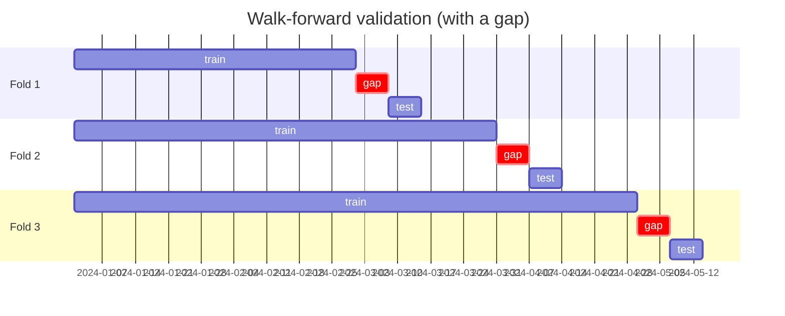
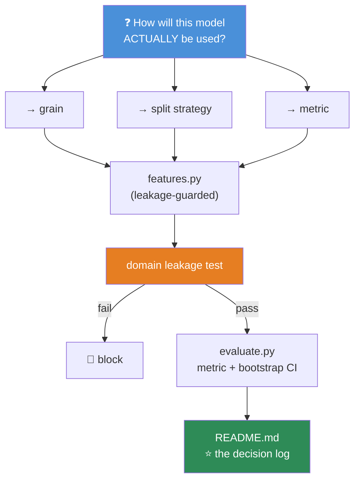

# 07.12 · Real AI Case Studies

[⬅ 07.11 Pipelines](07.11-pipelines.md) · [🏠 Module 07](../README.md) · [➡ 07.13 Projects & Summary](07.13-projects-summary.md)

> **The lesson in one line:** Five real preprocessing problems, worked end to end — because the difference between knowing the techniques and knowing *when to apply which one* is the entire job.

---

## 🎯 Learning objectives

By the end of this lesson you can:

1. Take a real problem from raw data to an ML-ready dataset, and **justify every decision**.
2. Recognize that **the same technique is right in one case study and wrong in the next**.
3. Spot the **domain-specific leakage trap** in each of five different problem types.
4. Choose a **validation split** that reflects how the model will actually be used.
5. Explain what makes each problem type *hard* — before you touch the data.

---

## 🧠 Mental model

> **There is no universal recipe. The right preprocessing is a function of how the model will be *used*.**

Watch how the same decision flips across these five:

| Decision | Churn | House prices | Sentiment | Image metadata | Forecasting |
|---|---|---|---|---|---|
| **Split** | **By time** | Random (usually) | Random (stratified) | **By group** (photographer) | **By time, with a gap** |
| **Outliers** | Investigate | **Cap** — mansions are real | Keep — they're signal | Filter — corrupt files | **Keep** — spikes matter |
| **Missing** | **Flag it** — MNAR | Impute by neighborhood | Drop empty text | Flag missing EXIF | **`ffill` only** |
| **Target** | Imbalanced (~5%) | Skewed → **log** | Balanced-ish | Multi-label | Continuous, seasonal |
| **The trap** | Post-churn columns | Sale-date leakage | **Duplicate reviews** | **Same photographer in both splits** | **The un-shifted window** |

**Same toolbox. Five different answers.** That's the lesson.

---

## 📕 Case Study 1 — Customer Churn

**Predict: will this customer cancel in the next 30 days?**

### What makes it hard


The data is **event-level** (one row per login, ticket, payment) but the prediction is **customer-level**. Every feature is an aggregation — **and every aggregation is a leakage opportunity.**

### The decisions

| Decision | Choice | Why |
|---|---|---|
| **Grain** | One row per (customer, as_of_date) | The model predicts *for a customer at a moment*. The label depends on the moment |
| **Label window** | Churned within 30 days *after* as_of | Must be **after**, or you're predicting the past |
| **Features** | **Strictly `t < as_of_date`** | The structural leakage guard ([07.4](07.4-pandas-advanced.md)) |
| **Missing `last_login`** | **Flag it, don't impute** | MNAR — a customer with no login *ever* is a different animal ([07.5](07.5-data-cleaning.md)) |
| **Imbalance** (~5% churn) | PR-AUC, stratify, class weights, **tune the threshold** | Accuracy would be 95% for predicting "nobody churns" ([07.6](07.6-eda.md)) |
| **Split** | **By time** | Random splitting trains on July and tests on April |

```python
def build_churn_features(events: pd.DataFrame, as_of: pd.Timestamp) -> pd.DataFrame:
    past = events[events.ts < as_of]                  # ⭐ THE GUARD. First line. Always.

    f = past.groupby('customer_id').agg(
        n_logins       = ('event_type', lambda s: (s == 'login').sum()),
        n_tickets      = ('event_type', lambda s: (s == 'ticket').sum()),
        total_spend    = ('amount', 'sum'),
        first_seen     = ('ts', 'min'),
        last_seen      = ('ts', 'max'),
    )
    f['tenure_days']       = (as_of - f['first_seen']).dt.days
    f['days_since_active'] = (as_of - f['last_seen']).dt.days          # ⭐ usually the #1 feature
    f['spend_per_month']   = f['total_spend'] / (f['tenure_days'] / 30).clip(lower=1)
    f['tickets_per_month'] = f['n_tickets']  / (f['tenure_days'] / 30).clip(lower=1)

    # Trend: recent 30 days vs the 30 before that — ⭐ the strongest churn signal there is
    r30 = past[past.ts >= as_of - pd.Timedelta('30D')].groupby('customer_id').size()
    p30 = past[(past.ts >= as_of - pd.Timedelta('60D')) &
               (past.ts <  as_of - pd.Timedelta('30D'))].groupby('customer_id').size()
    f['activity_trend'] = (r30.reindex(f.index).fillna(0) /
                           p30.reindex(f.index).fillna(0).clip(lower=1))
    return f.reset_index()
```

### 🚨 The traps

> [!CAUTION]
> **Trap 1 — The post-churn column.** `cancellation_reason`, `exit_survey_score`, `final_invoice_date`, `account_status='closed'`. **These only exist *because* the customer churned.** Your model hits 0.99 AUC and is worthless. Ask: *"at prediction time, would this be populated?"*
>
> **Trap 2 — Survivorship bias.** If you build your training set from *current* customers, **everyone who already churned is missing.** You've trained on the survivors. This is invisible, catastrophic, and it happens whenever someone runs `SELECT * FROM active_customers`.
>
> **Trap 3 — The random split.** Churn is temporal. Random-splitting means training on customers whose churn you *already saw* and testing on an earlier period. **Excellent, fictional metrics.**
>
> **Trap 4 — Sudden feature availability.** A feature launched in March is `NULL` for everyone before March. The model learns *"NULL on this feature ⟹ old customer ⟹ less likely to churn"* — which is a fact about your **product roadmap**, not your customers.

**Validation: multiple as-of dates.**

```python
# Train on customers as of Jan/Feb/Mar; validate on Apr; test on May.
# This mirrors EXACTLY how the model will be used: predict forward from today.
train = pd.concat([make_dataset(as_of=d) for d in ['2024-01-01','2024-02-01','2024-03-01']])
val   = make_dataset(as_of='2024-04-01')
test  = make_dataset(as_of='2024-05-01')
```

---

## 🏠 Case Study 2 — House Prices

**Predict: the sale price of a house.**

### What makes it hard

Wildly heterogeneous features (numeric, ordinal, nominal, geographic), a **badly skewed target**, meaningful missingness, and **outliers that are completely real**.

### The decisions

| Decision | Choice | Why |
|---|---|---|
| **Target** | **`log1p(price)`** | Skew ~4. MSE on raw price optimizes for mansions and ignores ordinary houses ([06.7](../../06-Mathematics/weeks/06.7-optimization.md)) |
| **Metric** | RMSE **on the log** | Equivalent to relative error — a $50k miss on a $200k house matters more than on a $2M one |
| **Missing `pool_quality`** | **Fill with `"None"`** | ⭐ **NaN here means "there is no pool"** — it's not missing, it's *absent* |
| **Missing `lot_frontage`** | Impute by **neighborhood median** | MAR — it depends on an observed column ([07.5](07.5-data-cleaning.md)) |
| **Outliers** (a $10M mansion) | **Cap / winsorize; don't delete** | It's a real house. But don't let it dominate the loss |
| **Ordinal features** (`Ex > Gd > TA > Fa > Po`) | **Ordinal encode** | There *is* a real order — one-hot throws it away |
| **`Neighborhood`** (25 categories) | Target encode (**out-of-fold**) or one-hot | High-ish cardinality, and hugely predictive |
| **Split** | Random — **unless there's a sale date** | If prices trend over time, **split by time** |

```python
# ⭐ The single most important distinction in this dataset:
STRUCTURAL_NONE = ['pool_qc', 'fence', 'alley', 'garage_type', 'bsmt_qual']
for c in STRUCTURAL_NONE:
    df[c] = df[c].fillna('None')        # "no pool" — NOT a missing value

TRULY_MISSING = ['lot_frontage', 'mas_vnr_area']
for c in TRULY_MISSING:
    df[c] = df[c].fillna(df.groupby('neighborhood')[c].transform('median'))
    df[f'{c}_was_missing'] = df[c].isna().astype(int)     # keep the signal

# ⭐ Ratios — where the real signal lives
df['total_sf']       = df['1st_flr_sf'] + df['2nd_flr_sf'] + df['total_bsmt_sf']
df['price_per_sf']   = df['sale_price'] / df['total_sf']       # ⚠️ EDA ONLY — leaks!
df['total_baths']    = df['full_bath'] + 0.5*df['half_bath']
df['age_at_sale']    = df['yr_sold'] - df['year_built']
df['since_remodel']  = df['yr_sold'] - df['year_remod_add']
df['is_remodeled']   = (df['year_remod_add'] > df['year_built']).astype(int)

y = np.log1p(df['sale_price'])        # ⭐ the target transform
```

> [!IMPORTANT]
> **`pool_quality = NaN` does not mean "we don't know the pool quality." It means there is no pool.**
>
> This distinction — **structurally absent vs. genuinely unknown** — is the difference between a good and a bad model on this dataset, and it is invisible in `df.isna().sum()`. **Both look like nulls.** The only way to know is to **read the data dictionary**, and this is the case study that proves why you must.
>
> Imputing `pool_quality` with the mode ("Good") tells the model that **every house without a pool has a good pool.** It is a lie, it is confidently learned, and no amount of hyperparameter tuning will undo it.

> [!CAUTION]
> **`price_per_sqft` is a brilliant EDA feature and a fatal model feature.** It contains `sale_price` — the target. Compute it to *understand* the data; **never** feed it to the model. This is one of the most seductive leaks there is, because the feature is so obviously *useful*.

---

## 💬 Case Study 3 — Sentiment Analysis (data prep only)

**Prepare: product reviews → labeled text ready for a classifier.**

### What makes it hard

Text is unstructured, **labels are noisy**, and there's a duplicate problem that will silently inflate every metric you compute.

### The decisions

| Decision | Choice | Why |
|---|---|---|
| **Label source** | Star rating → sentiment | 1–2★ = negative, 4–5★ = positive. **Drop 3★** — it's genuinely ambiguous |
| **Duplicates** | **Dedupe on normalized text** ⭐ | **The trap.** See below |
| **Language** | Detect; keep one, or model separately | A mixed-language corpus makes an unlearnable mess |
| **Very short reviews** | Drop < 3 words | *"Good."* carries almost no learnable signal |
| **Very long reviews** | Truncate (or chunk) | Transformers have a token limit |
| **Emoji/punctuation** | **KEEP** ⭐ | `!!!` and 😡 are **strong signal**. Stripping them destroys information |
| **Lowercasing** | Depends on the model | ✅ For TF-IDF. ❌ For a cased Transformer — **`TERRIBLE` ≠ `terrible`** |
| **Class balance** | Usually skewed positive (~80%) | Stratify; consider class weights |
| **Split** | **Stratified, and grouped by product** | See below |

```python
import re

# ── 1 · Label from the star rating ────────────────────────────────
df = df[df['rating'] != 3].copy()                    # drop the ambiguous middle
df['label'] = (df['rating'] >= 4).astype(int)

# ── 2 · ⭐ DEDUPLICATE — the step that decides whether your metrics are real ──
df['text_key'] = (df['text'].str.lower()
                            .str.replace(r'\s+', ' ', regex=True)
                            .str.strip())
before = len(df)
df = df.drop_duplicates(subset=['text_key'])
print(f"removed {before - len(df):,} duplicates ({1 - len(df)/before:.1%})")

# ── 3 · Basic hygiene ─────────────────────────────────────────────
df = df[df['text'].str.split().str.len() >= 3]       # too short to learn from
df['text'] = df['text'].str.slice(0, 5000)           # cap absurd lengths

# ── 4 · Cheap features that are shockingly strong (07.7) ──────────
df['n_words']     = df['text'].str.split().str.len()
df['n_exclaim']   = df['text'].str.count('!')
df['caps_ratio']  = df['text'].str.count(r'[A-Z]') / df['text'].str.len().clip(lower=1)
df['has_emoji']   = df['text'].str.contains(r'[\U0001F600-\U0001F64F]', regex=True)
```

> [!CAUTION]
> **Duplicate reviews are the leakage trap in every text dataset, and almost nobody checks.**
>
> The same review text appears under multiple product listings, or gets reposted, or a bot submits it 40 times. **A random split puts the identical text in both train and test.** Your model *memorizes* it and scores 0.97. On genuinely new text, it collapses.
>
> **Real review corpora are routinely 5–15% duplicates.** Deduplicate on **normalized** text — before splitting. This one `drop_duplicates` is often worth more than any modelling decision you'll make on this dataset.

> [!WARNING]
> **Do NOT strip punctuation, emoji, or capitalization by reflex.** The classic NLP preprocessing pipeline (lowercase → strip punctuation → remove stopwords → stem) was designed for **bag-of-words in 2005** and it **actively destroys signal** for sentiment.
>
> `!!!`, `ALL CAPS`, and 😡 are among the **strongest** sentiment features that exist. And modern Transformers have subword tokenizers that handle raw text natively — **preprocessing for them is usually actively harmful.**
>
> **Match your preprocessing to your model.** TF-IDF wants normalized text. BERT wants raw text. There is no universal "clean text" step.

**Group split:** if reviews of the same *product* land in both train and test, the model can learn *"this product is good"* rather than *"this text expresses positivity."* **For an honest generalization estimate, split by product** (`GroupShuffleSplit`).

---

## 🖼️ Case Study 4 — Image Metadata

**Prepare: an image dataset (metadata, not pixels) for a classifier.**

### What makes it hard

The metadata is more revealing than you expect — and it's where **the most famous leakage failures in ML history** come from.

### The decisions

| Decision | Choice | Why |
|---|---|---|
| **Corrupt files** | Verify every image opens; drop failures | A corrupt JPEG crashes training at epoch 3, hours in |
| **Duplicates** | **Perceptual hash**, not file hash ⭐ | A resized/re-encoded copy has a different file hash and identical content |
| **EXIF** | Extract: camera, timestamp, GPS, dimensions | Useful — **and dangerous** |
| **Missing EXIF** | **Flag it** | Often MNAR: stripped EXIF correlates with source (social media vs. camera) |
| **Class imbalance** | Usually severe | Stratify; class weights |
| **Split** | **GROUP split** ⭐⭐ | **The trap.** See below |
| **GPS coordinates** | ⚠️ **Strip, or bucket coarsely** | Privacy — and leakage |

```python
from PIL import Image
import imagehash

records = []
for path in image_paths:
    try:
        img = Image.open(path)
        img.verify()                              # ⭐ catches corrupt files NOW, not at epoch 3
        img = Image.open(path)                    # verify() closes it
        exif = img._getexif() or {}
        records.append({
            'path':    path,
            'width':   img.width,
            'height':  img.height,
            'aspect':  img.width / img.height,
            'mode':    img.mode,                  # RGB / L / CMYK — a real source of bugs
            'bytes':   os.path.getsize(path),
            'phash':   str(imagehash.phash(img)),  # ⭐ PERCEPTUAL hash
            'camera':  exif.get(272),
            'taken':   exif.get(36867),
        })
    except Exception as e:
        records.append({'path': path, 'error': str(e)})

meta = pd.DataFrame(records)
print(f"corrupt: {meta['error'].notna().sum()}")

# ⭐ Near-duplicate detection — a file hash would MISS these entirely
dupes = meta[meta.duplicated(subset=['phash'], keep=False)]
print(f"near-duplicate images: {len(dupes)} — these MUST NOT straddle the split")
```

> [!CAUTION]
> **Trap 1 — Group leakage.** If 30 photos come from the **same photographer / camera / patient / session**, a random split puts some in train and some in test. The model learns the **camera's sensor noise**, the studio lighting, the specific patient's anatomy — and reports fantastic accuracy that evaporates on a new source.
>
> **This is the single most common failure in medical imaging ML**, and it has invalidated a genuinely alarming number of published papers. **Split by patient. Split by photographer. Split by session.** Never randomly. Use `GroupShuffleSplit`.
>
> **Trap 2 — Metadata leakage.** The most famous example in ML: a pneumonia detector that learned to read the **portable X-ray marker** — because portable machines are used on the sickest patients, who are more likely to have pneumonia. **It never looked at the lungs.** Image *size*, aspect ratio, and file *format* frequently correlate with the class simply because different classes were collected from different sources.
>
> **Diagnostic:** train a model on **metadata alone** (no pixels). **If it performs well, you have leakage** — the metadata knows the answer, and your "image model" will learn to read the metadata instead of the image.

> [!WARNING]
> **EXIF GPS is a privacy incident waiting to happen.** Photos routinely contain **the exact coordinates where they were taken** — often someone's home. Publishing a dataset with intact EXIF has repeatedly exposed people's addresses. **Strip GPS, or bucket to a coarse grid (city-level), and document that you did.**

---

## 📈 Case Study 5 — Time-Series Forecasting

**Predict: sales for the next 7 days.**

### What makes it hard

**Everything about it violates i.i.d.** ([06.5](../../06-Mathematics/weeks/06.5-probability.md)). Every standard ML instinct is wrong here.

### The decisions

| Decision | Choice | Why |
|---|---|---|
| **Split** | **Time-based, with a GAP** ⭐ | Random splitting is catastrophic |
| **Missing days** | `resample('D').asfreq()` → **`ffill`** or `interpolate` | Expose the gaps; **never `bfill`** |
| **Features** | Lags, rolling stats — **all `.shift(1)`'d** | The window must end *yesterday* ([07.4](07.4-pandas-advanced.md)) |
| **Seasonality** | **Cyclical** day-of-week, month; holiday flags | Hour 23 and hour 0 are adjacent ([07.7](07.7-feature-engineering.md)) |
| **Outliers** | ⚠️ **KEEP THEM** | Black Friday is not an error. It's the most important day of the year |
| **Trend** | Difference, or add a time index | Non-stationarity breaks many models |
| **Target** | `log1p` if multiplicative | Sales usually grow multiplicatively |
| **Validation** | **Rolling-origin / walk-forward** | Mirrors how it'll actually be used |

```python
df = df.set_index('date').resample('D').asfreq()      # expose missing days as NaN
df['sales'] = df['sales'].interpolate(method='time')  # ✅ forward-only. NEVER bfill.

# ── ⭐ Lag & rolling features — EVERY ONE shifted ─────────────────
for lag in [1, 7, 14, 28, 364]:                       # 364 = same weekday, last year
    df[f'lag_{lag}'] = df['sales'].shift(lag)

for w in [7, 28]:
    s = df['sales'].shift(1)                          # ⭐⭐ THE GUARD
    df[f'roll_{w}_mean'] = s.rolling(w, min_periods=1).mean()
    df[f'roll_{w}_std']  = s.rolling(w, min_periods=1).std()
    df[f'roll_{w}_max']  = s.rolling(w, min_periods=1).max()

df['trend_7_28'] = df['roll_7_mean'] / df['roll_28_mean'].clip(lower=1e-6)

# ── Calendar features ─────────────────────────────────────────────
df['dow_sin']    = np.sin(2*np.pi*df.index.dayofweek/7)
df['dow_cos']    = np.cos(2*np.pi*df.index.dayofweek/7)
df['month_sin']  = np.sin(2*np.pi*df.index.month/12)
df['month_cos']  = np.cos(2*np.pi*df.index.month/12)
df['is_weekend'] = (df.index.dayofweek >= 5).astype(int)
df['is_holiday'] = df.index.isin(HOLIDAYS).astype(int)
df['days_to_holiday'] = ...                            # ⭐ often stronger than the flag itself
```

### ⭐ The split — and the gap nobody adds



> [!CAUTION]
> **The gap is the part everyone forgets, and it is not optional.**
>
> You're forecasting **7 days ahead**. If your training data ends on March 7th and your test starts on March 8th, then a feature like `roll_7_mean` computed for the March 8th test row uses data from **March 1–7 — which is in your training set.** The model has effectively seen the recent past of its test period.
>
> **Insert a gap equal to your forecast horizon.** Train through March 1st, gap through March 7th, test March 8th onward. **Without the gap, your validation is optimistic and you will not find out until production.**

> [!WARNING]
> **Do NOT remove outliers from a time series.** Black Friday, a product launch, a viral moment, an outage — these are **the events the business most needs predicted.** An IQR filter will helpfully delete every one of them, and your model will be beautifully accurate on boring Tuesdays and blind on the days that matter.
>
> **Add them as *features* instead** — a holiday flag, a promotion flag, a `days_to_event` countdown. **Explain the spike; don't erase it.**

---

## 🔄 The comparison — what changed, and why

| | Churn | Houses | Sentiment | Images | Forecast |
|---|---|---|---|---|---|
| **Grain** | customer × as_of | one house | one review | one image | one day |
| **Split** | **time** | random / time | stratified + **group** | **GROUP** ⭐ | **time + GAP** ⭐ |
| **Missing** | flag (MNAR) | **"None" ≠ NaN** ⭐ | drop | flag | **`ffill` only** |
| **Outliers** | investigate | **cap** | keep | drop corrupt | **KEEP** ⭐ |
| **Target** | imbalanced | **`log1p`** | ~balanced | multi-label | seasonal |
| **Metric** | **PR-AUC** | RMSE(log) | F1 | mAP | MAPE / RMSE |
| **The killer trap** | post-churn cols | `price_per_sqft` | **duplicates** ⭐ | **group leakage** ⭐ | **un-shifted window** ⭐ |

> [!IMPORTANT]
> **Look at the "Outliers" row. Cap them, keep them, drop them, keep them, KEEP THEM.**
>
> There is no rule. **The rule is: understand what the outlier *is*.** A $10M mansion is real (cap it so it doesn't dominate MSE). A corrupt JPEG is an error (drop it). **Black Friday is the entire point** (keep it, and give the model a feature that explains it).
>
> **Anyone who tells you "always remove outliers" has not thought about it.** This table is the proof.

---

## 🔒 Security & privacy considerations

| Case study | Risk |
|---|---|
| **Churn** | Customer behavioural profiles are highly identifying. A "days since last login" + tenure + spend triple often uniquely identifies one person |
| **Houses** | **Address is PII**, and a house sale price + street is public-record-adjacent but *combined* is revealing. Bucket to neighborhood |
| **Sentiment** | Reviews contain names, order numbers, emails. **Scrub PII before storing**, not after |
| **Images** | **EXIF GPS = someone's home address.** Faces are biometric data (GDPR special category). Strip and blur |
| **Forecasting** | Aggregate sales are usually safe — **unless a "store" has one customer** ([07.4](07.4-pandas-advanced.md) k-anonymity) |

> [!WARNING]
> **The two highest-risk items across all five: EXIF GPS in images, and free-text fields.** People write their phone number, their order ID, and occasionally their credit card into a review box. **Run a PII scrubber over every free-text field at ingestion** — before it lands in Bronze, before it's in fifty derived tables, and long before it's in a training set that a model might memorize and regurgitate.

---

## ✅ Best practices

| Practice | Why |
|---|---|
| **Ask "how will this model be used?" first** | It determines the grain, the split, and the metric |
| **Choose the split to mirror deployment** | Time for temporal; **group** for clustered; stratified for imbalanced |
| **Read the data dictionary** | The `"None" ≠ NaN` distinction is invisible in the data |
| **Deduplicate before splitting** | Text, images, everything. Duplicates straddling the split = memorization |
| **Understand each outlier before acting** | Cap / keep / drop — it flips per problem |
| **Add a gap in time-series validation** | Equal to your forecast horizon |
| **Train on metadata alone as a leak test** | If it works, your "image model" will read the metadata |
| **Scrub PII from free text at ingestion** | Before it spreads. Models memorize |
| **Every feature: "would I have this at prediction time?"** | The one question that catches most leakage |

---

## 🐛 Common mistakes

| Mistake | Which case study |
|---|---|
| Random-splitting temporal data | Churn, Forecasting |
| **No gap in time-series validation** | Forecasting |
| Random-splitting grouped data | **Images (patients!), Sentiment (products)** |
| Not deduplicating text/images | Sentiment, Images |
| Imputing structurally-absent values | **Houses** (`pool_qc`) |
| **Removing outliers reflexively** | **Forecasting** (you deleted Black Friday) |
| Using a target-derived feature | Houses (`price_per_sqft`) |
| Keeping post-event columns | Churn (`cancellation_reason`) |
| **Survivorship bias** | Churn (`SELECT * FROM active_customers`) |
| Stripping emoji/caps/punctuation | Sentiment (you deleted the signal) |
| Not stripping EXIF GPS | **Images** (you published home addresses) |
| Not checking metadata-only performance | Images |

---

## 📝 Exercises

**Conceptual**
1. For each case study, name the **one** trap that would most inflate your offline metrics.
2. Why does the correct outlier treatment flip across the five? Give the reasoning for each.
3. Why must time-series validation include a **gap**? What's the right gap size?
4. Why does group-splitting matter more in medical imaging than anywhere else?
5. Why is `pool_quality = NaN` fundamentally different from `lot_frontage = NaN`?

**End-to-end assignments** — pick two and do them fully
6. **Churn:** build the full feature pipeline with an `as_of_date`. **Write the leakage test.** Split by time. Report PR-AUC with a bootstrap CI ([06.6](../../06-Mathematics/weeks/06.6-statistics.md)).
7. **Houses:** get the Ames dataset. **Read the data dictionary** (this is the point). Correctly distinguish structural-None from truly-missing. Log-transform the target. Report RMSE on the log scale.
8. **Sentiment:** take a review dataset. **Measure the duplicate rate.** Train once with duplicates and once deduplicated. **Report both scores.** The gap is your lesson.
9. **Images:** take an image dataset with grouped structure. Train with a random split and with a group split. **Report both.** The gap is the leakage.
10. **Forecasting:** build lag/rolling features. Validate with walk-forward **with** and **without** a gap. **Report both.** The gap is the optimism.

**Analysis**
11. **The metadata-only leak test:** on any image dataset, train a model on metadata alone (dimensions, file size, format, EXIF). Report its accuracy. **What does a high score mean?**
12. Take each of the five and write the **one-paragraph "how will this model be used?"** brief. Then derive the grain, split, and metric from it.

---

## 🛠️ Mini project — *The Case Study Portfolio*

Build `code/07-data-analysis/case-studies/` — implement **two** of the five end to end, with the leakage tests that prove they're honest.

**Requirements**
- Two complete pipelines using the [07.11](07.11-pipelines.md) `fit`/`transform` architecture.
- **Every preprocessing decision documented with its justification.**
- **The domain-specific leakage test for each**, running in CI.
- An honest evaluation: correct split, correct metric, **with confidence intervals**.

```
case-studies/
├── README.md                 # ⭐ the DECISION LOG — why, not what
├── churn/
│   ├── config.yaml
│   ├── features.py       # as_of-aware
│   ├── split.py          # time-based
│   └── tests/test_temporal_leakage.py   # ⭐ perturb the future
├── forecasting/
│   ├── config.yaml
│   ├── features.py       # every window .shift(1)'d
│   ├── split.py          # ⭐ walk-forward WITH GAP
│   └── tests/test_gap.py                # ⭐ assert train.max() + gap < test.min()
└── shared/
    ├── evaluate.py       # metric + bootstrap CI (06.6)
    └── leakage.py        # the generic perturb-the-future harness
```

**Architecture**



**Implementation guidance**
1. **Start from the question `"how will this model be used?"`** — write that paragraph *first*, in the README. **Everything else derives from it.** If the model runs every Monday to predict the coming week, then your validation must look exactly like that: train on the past, gap, predict forward. **A pipeline that doesn't mirror deployment is a pipeline that lies to you.**
2. **`README.md` is the decision log, and it is the real deliverable.** For each decision: *what* you did, *why*, and *what you rejected*. **"Imputed `lot_frontage` with the neighborhood median (MAR — it depends on neighborhood, which we observe). Rejected the global median, which would erase real geographic variation. Rejected dropping the rows — 17% of the data, and non-randomly distributed."** **This document is what a senior engineer reads to decide whether to trust you**, and it takes twenty minutes to write.
3. **`shared/leakage.py`** — one generic harness: perturb data after the prediction moment, rebuild features, assert nothing changed. Reuse it across both case studies. **It's the same test every time, which is exactly the point.**
4. **`forecasting/tests/test_gap.py`** — a beautifully simple, high-value test: `assert train.index.max() + pd.Timedelta(days=HORIZON) < test.index.min()`. **One line. Catches the most common forecasting bug there is.**

**Testing strategy**
- **Domain leakage tests** as above — they must **block the merge**.
- **The honest-vs-dishonest comparison:** for each case study, deliberately build the *leaky* version too, and **report both scores in the README.** *"With the naive random split: 0.94 AUC. With the correct time-based split: 0.71."* **That 23-point gap is the single most persuasive number you will ever put in a portfolio**, because it proves you understand something most people don't.
- Confidence intervals on every reported metric ([06.6](../../06-Mathematics/weeks/06.6-statistics.md)). *"0.71 ± 0.03"*, never a bare number.

**Future improvements**
- Add the other three case studies.
- Add a **slice evaluation**: report the metric by segment (region, tenure bucket, product category) — **an aggregate metric hides catastrophic failure on a subgroup** ([07.1](07.1-data-lifecycle.md)).
- Add drift monitoring between as-of dates ([07.9](07.9-data-quality.md)).

---

## 📄 Cheat sheet

| Problem type | Split | Outliers | Missing | The trap |
|---|---|---|---|---|
| **Churn** | **Time** | Investigate | **Flag (MNAR)** | Post-event columns; survivorship |
| **Prices** | Random / time | **Cap** | **"None" ≠ NaN** | Target-derived features |
| **Text** | Stratified + **group** | Keep | Drop empty | **Duplicates** |
| **Images** | **GROUP** ⭐ | Drop corrupt | Flag | **Group + metadata leakage** |
| **Forecast** | **Time + GAP** ⭐ | **KEEP** | **`ffill` only** | **Un-shifted window** |

**The universal questions:**
1. *"How will this model actually be used?"* → determines grain, split, metric.
2. *"At prediction time, would I have this value?"* → catches most leakage.
3. *"Is this outlier an error, a rare event, or the entire point?"* → the answer flips per problem.

**The universal test:** perturb the future → rebuild → assert nothing changed.

---

## 🎴 Flashcards

- **Q:** What determines your preprocessing choices? → **A:** **How the model will be used.** It determines the grain, the split, and the metric — and everything else follows.
- **Q:** Why must churn use a time-based split? → **A:** Churn is temporal. A random split trains on July and tests on April — **leaking the future**. Also beware **survivorship bias** (`SELECT * FROM active_customers` excludes everyone who already churned).
- **Q:** In a house dataset, why is `pool_quality = NaN` different from `lot_frontage = NaN`? → **A:** `pool_quality` NaN means **there is no pool** (structurally absent → fill with `"None"`). `lot_frontage` NaN means **unknown** (impute). **Both look identical in `isna()`** — only the data dictionary tells you.
- **Q:** Why is `price_per_sqft` a fatal feature in a price model? → **A:** It contains `sale_price` — **the target**. Brilliant for EDA, catastrophic as a feature.
- **Q:** What's the leakage trap in text datasets? → **A:** **Duplicate reviews** (5–15% is typical). A random split puts identical text in train *and* test; the model memorizes it. **Deduplicate on normalized text before splitting.**
- **Q:** Why shouldn't you strip punctuation and caps for sentiment? → **A:** `!!!`, `ALL CAPS`, and 😡 are among the **strongest sentiment signals that exist**. The classic NLP cleaning pipeline was built for 2005 bag-of-words and **destroys signal** for modern models.
- **Q:** What's the #1 failure in medical imaging ML? → **A:** **Group leakage** — images from the same patient in both train and test. The model learns the patient, not the disease. **Split by patient**, always.
- **Q:** What is metadata leakage, and how do you test for it? → **A:** Image size/format/EXIF correlating with the class because different classes came from different sources (the portable X-ray marker → pneumonia). **Test: train on metadata alone. If it works, you have leakage.**
- **Q:** Why does time-series validation need a **gap**? → **A:** If you forecast 7 days ahead, a test row's rolling features use the previous 7 days — **which are in your training set**. Insert a gap **equal to your forecast horizon**.
- **Q:** Should you remove outliers from a sales time series? → **A:** **NO.** Black Friday is not an error — it's the day the business most needs predicted. **Add a feature that explains the spike; never erase it.**
- **Q:** What's the one privacy item that recurs everywhere? → **A:** **EXIF GPS** (someone's home address) and **free-text fields** (people write phone numbers and card numbers into review boxes). **Scrub at ingestion** — models memorize and regurgitate.

---

## 💼 Interview questions

1. **"How would you build a churn model? Start with the data."** — Grain (customer × as_of), features strictly before as_of, label in the window *after*, **time-based split**, PR-AUC. **Volunteer the post-churn-column and survivorship traps** unprompted — that's what separates a senior answer.
2. **"You're forecasting demand. Walk me through validation."** — Walk-forward / rolling-origin, **with a gap equal to the forecast horizon**. Explain why the gap matters. Most candidates omit it entirely.
3. **"Your image classifier gets 98% accuracy. What do you check?"** — **Group leakage** (same patient/photographer in both splits), **near-duplicates** (perceptual hash, not file hash), and **metadata leakage** (train on metadata alone — if it works, the model will read it instead of the image).
4. **"Should you always remove outliers?"** — **No**, and give the table: cap a mansion, drop a corrupt file, **keep Black Friday**. *"It depends on whether it's an error, a rare event, or the target"* is the answer.
5. **"What's the first thing you'd check in a review-sentiment dataset?"** — **The duplicate rate.** 5–15% is typical, and duplicates straddling a random split make your metrics fiction.
6. **"Your model scores 0.94 offline and 0.71 in production. Debug it."** — Leakage (wrong split, target-derived feature, un-shifted window), training/serving skew, or drift. **Say how you'd distinguish them.** This is the question the whole module has been preparing you for.

---

## 📚 Summary

- **There is no universal recipe. The right preprocessing is a function of how the model will be used** — that question determines the grain, the split, and the metric, and everything else follows from those three.
- **The same decision flips across problems.** Outliers: cap a mansion, drop a corrupt file, **keep Black Friday**. Missing values: impute, flag, or recognize it means *"there is no pool."* Anyone who offers you a universal rule hasn't thought about it.
- **Each problem type has a signature leakage trap:**
  - **Churn** → post-event columns (`cancellation_reason`) and **survivorship bias**.
  - **Houses** → target-derived features (`price_per_sqft`) and imputing structurally-absent values.
  - **Sentiment** → **duplicate reviews** (5–15% is normal) straddling a random split.
  - **Images** → **group leakage** (same patient in both splits) and **metadata leakage** (the portable X-ray marker).
  - **Forecasting** → the **un-shifted rolling window**, and **no gap** in the validation split.
- **The split must mirror deployment.** Time for temporal, **group** for clustered, stratified for imbalanced — and **a gap equal to your forecast horizon** for forecasting.
- **Read the data dictionary.** The `"None" ≠ NaN` distinction is invisible in the data and decisive for the model.
- **The metadata-only leak test** is a beautiful diagnostic: train on metadata alone; if it works, your image model will read the metadata instead of the image.
- **Two universal questions:** *"How will this be used?"* and *"At prediction time, would I have this value?"* **One universal test:** perturb the future, rebuild, assert nothing changed.

**Next:** [07.13 Projects & Summary](07.13-projects-summary.md) — seven projects and the module consolidation.

---

## 🔗 References

- Kapoor & Narayanan (2022) — *Leakage and the Reproducibility Crisis in ML-based Science*. **Leakage found in 294 papers across 17 fields.** Read the taxonomy — every trap in this lesson is in it.
- Zech et al. (2018) — *Variable generalization performance of a deep learning model to detect pneumonia in chest radiographs* — **the portable X-ray marker paper.** The canonical metadata-leakage failure, and a genuinely humbling read.
- Roberts et al. (2021) — *Common pitfalls in machine learning for COVID-19 diagnosis* (Nature MI) — **none of 2,212 reviewed models were clinically usable.** Almost all failed on the traps in this lesson.
- Holtzman et al. (2019) — *The Curious Case of Neural Text Degeneration* — for the sentiment/text side.
- Hyndman & Athanasopoulos — *Forecasting: Principles and Practice* (free at otexts.com/fpp3). **Chapter 5 on time-series cross-validation** is the definitive treatment of the gap.
- Ames Housing dataset documentation — **read the data dictionary.** It's the case study that proves why.

---

## 🧭 Navigation

| Direction | Link |
|---|---|
| ⬅ Previous | [07.11 Reusable Data Pipelines](07.11-pipelines.md) |
| ➡ Next | [07.13 Projects & Summary](07.13-projects-summary.md) |
| 🏠 Module | [Module 07](../README.md) |
| 🗺 Roadmap | [ROADMAP.md](../../../ROADMAP.md) |
