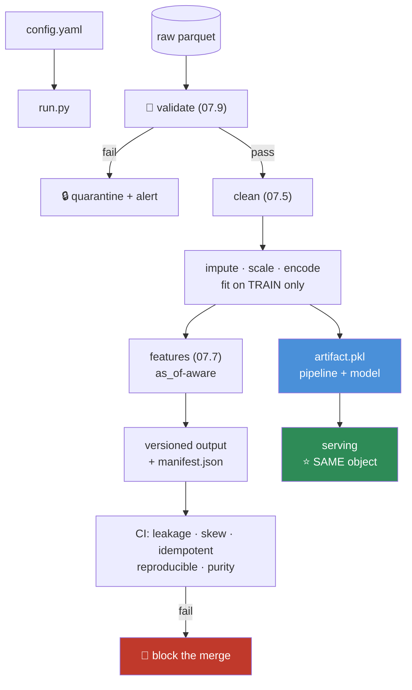
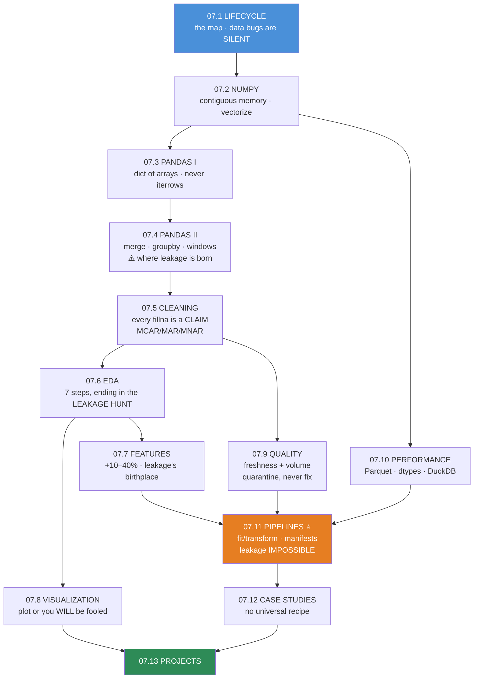

# 07.13 · Projects & Module Summary

[⬅ 07.12 Case Studies](07.12-case-studies.md) · [🏠 Module 07](../README.md) · [➡ Module 08 · Machine Learning](../../08-Machine-Learning/README.md)

> **The lesson in one line:** Seven projects, each solving a real problem you will actually face — and together they form the toolkit that makes you the person on the team who can be trusted with the data.

---

## 🎯 Learning objectives

By the end of this lesson you can:

1. Build **seven portfolio projects** that each demonstrate a distinct professional capability.
2. Structure data code the way production data code is structured.
3. **Prove** your pipeline is honest — with leakage, skew, and purity tests.
4. Consolidate all twelve lessons into one coherent mental model.
5. Self-assess honestly, and know exactly what to revisit.

---

## The seven projects

Each is buildable in a day or two. Together they're a portfolio that says *"I can be trusted with your data."*

| # | Project | Proves you can | Lessons |
|---|---|---|---|
| 1 | **CSV Profiler** | Know what's in a dataset before you touch it | [07.3](07.3-pandas-fundamentals.md), [07.5](07.5-data-cleaning.md) |
| 2 | **Data Cleaning Toolkit** | Clean reproducibly, not in a notebook | [07.5](07.5-data-cleaning.md) |
| 3 | **Automated EDA Report** | Turn findings into *decisions* | [07.6](07.6-eda.md) |
| 4 | **Feature Engineering Library** | Build features where leakage is *impossible* | [07.7](07.7-feature-engineering.md) |
| 5 | **Sales Dashboard** | Communicate to humans, safely | [07.8](07.8-visualization.md) |
| 6 | **Data Quality System** | Stop bad data at the door | [07.9](07.9-data-quality.md) |
| 7 | **Production Pipeline** ⭐ | Ship it | [07.11](07.11-pipelines.md) |

```
code/07-data-analysis/
├── README.md                 # index
├── requirements.txt          # pandas, numpy, pyarrow, matplotlib, plotly,
│                             # pandera, polars, duckdb, pytest
├── csv-profiler/             # 1
├── cleaning-toolkit/         # 2
├── eda-report/               # 3
├── feature-lib/              # 4
├── sales-dashboard/          # 5
├── data-quality/             # 6
├── pipeline/                 # 7  ← the flagship
├── customer-analytics/       # bonus: 07.4
├── array-profiler/           # bonus: 07.2
├── big-data/                 # bonus: 07.10
└── case-studies/             # bonus: 07.12
```

> [!IMPORTANT]
> **One rule governs all seven: every project must work on a dataset that fights back.** Not Iris. Not the cleaned Titanic. **Find data with real problems** — a Kaggle competition, a government open-data CSV, your company's actual export. **Clean data teaches you nothing**, because the entire skill is what you do when the data is wrong.

---

## Project 1 — CSV Profiler

**Point it at any CSV; get back everything you need to know before you touch it.**

Full spec in [07.3](07.3-pandas-fundamentals.md#️-mini-project--the-csv-profiler).

**The core value:** **sentinel detection.** A spike at exactly `-1`, `999`, or `"N/A"` in an otherwise smooth distribution is a **missing value in disguise** — and it silently poisons every statistic you compute. `df['age'].mean()` returns 43.7 and it is a lie, and nothing anywhere will tell you.

**The moment it clicks:** the first time you point it at a "clean" dataset you've been using for weeks and it finds three sentinels.

---

## Project 2 — Data Cleaning Toolkit

**Reusable, tested, idempotent cleaning. Not a notebook.**

Full spec in [07.5](07.5-data-cleaning.md#️-mini-project--the-data-cleaning-toolkit).

**The three tests that make it real:**
- `clean(clean(df)) == clean(df)` — **idempotence.** A non-idempotent step corrupts your data on a pipeline retry, and retries are guaranteed.
- The scaler is fit on **train only** — leakage prevention, structurally.
- **Outlier removal doesn't erase a demographic subgroup** — a fairness test almost nobody writes, that takes ten minutes and prevents a category of harm that's nearly undetectable afterwards.

---

## Project 3 — Automated EDA Report

**Findings → decisions, not findings → charts.**

Full spec in [07.6](07.6-eda.md#️-mini-project--the-automated-eda-report).

**What makes it more than `ydata-profiling`:** every finding maps to a **modelling decision**. *"`income` has skew 4.8 → **apply `log1p`** (mandatory for linear models, irrelevant for trees)."* *"Target is 0.7% positive → **PR-AUC, stratify, tune the threshold; do not report accuracy**."*

**And the headline section is the leakage hunt.** A report that finds a 0.97 correlation with the target and says nothing has failed.

---

## Project 4 — Feature Engineering Library

**Features where leakage is structurally impossible.**

Full spec in [07.7](07.7-feature-engineering.md#️-mini-project--the-feature-engineering-library).

**Two design decisions carry it:**
1. **`fit(X_train)` / `transform(X)`** — `transform` has **no code that learns**. You could not leak the test set if you tried.
2. **Features declared in YAML**, not hardcoded. Diffable in a PR, versionable in git, answerable when someone asks *"when did `usage_trend` change meaning?"*

**The test that matters:** perturb a value in the future by ×1000, rebuild, **assert nothing changed.** In CI. Blocking merges.

---

## Project 5 — Sales Dashboard

**Communicate to humans — safely.**

Full spec in [07.8](07.8-visualization.md#️-mini-project--the-sales-dashboard).

**Two things make it professional rather than a toy:**
- **`privacy.py`** — k-anonymity guard (suppress groups with n < 10) and a hover-data whitelist. Because **a shared Plotly HTML embeds the underlying data**, and *"we aggregated it"* is not anonymization when a group has one member.
- **Confidence intervals on every KPI.** *"Revenue up 3%"* is meaningless without knowing whether 3% is inside the noise. **Almost every dashboard in existence shows point estimates with no uncertainty and thereby actively encourages bad decisions.** Yours won't.

---

## Project 6 — Data Quality System

**Stop bad data at the door.**

Full spec in [07.9](07.9-data-quality.md#️-mini-project--the-automated-data-quality-report).

**The idea that makes it usable:** **auto-generate the schema** from a trusted baseline, then have a human review it once. **Nobody hand-writes 60 validation rules — which is why most teams write zero.** This turns "we should have data tests" from a six-week project into a twenty-minute one.

**And build `freshness.py` and `volume.py` first.** They're twenty lines each and they catch most real production incidents. **A stale table looks perfectly healthy.**

---

## Project 7 — The Production Pipeline ⭐

**The flagship. Everything, tied together.**

Full spec in [07.11](07.11-pipelines.md#️-mini-project--the-production-pipeline).



**The five CI tests are the deliverable:**

| Test | Catches |
|---|---|
| **`test_no_leakage`** | Perturb the future → assert nothing changed |
| **`test_no_skew`** | Batch-transform must equal single-row transform (**catches the all-zeros scaler**) |
| **`test_idempotent`** | Running twice equals running once |
| **`test_reproducible`** | Same code + data + config + seed → same output hash |
| **`test_purity`** | No step mutates its input |

> [!IMPORTANT]
> **When this works, you will have built something that most working data scientists have never built: a pipeline where leakage is structurally impossible, training and serving share one code path, every run is reproducible from its manifest, and the tests block a merge if any of that stops being true.**
>
> **This is the artifact that makes you senior.** Anyone can write `df.groupby('x').mean()`. Very few people build the system that makes the result *trustworthy*.

---

## 📊 Module Summary — everything, connected

### The twelve lessons as one workflow



### The ideas that did the most work

| Idea | Where it kept reappearing |
|---|---|
| **Data bugs are SILENT** | Every lesson. No stack trace, no failing test, confidently wrong for months |
| **Leakage looks like success** | 07.1, 07.4, 07.5, 07.6, 07.7, 07.11, 07.12 — **seven lessons, because it's born in seven places** |
| **Vectorize; never loop** | 07.2, 07.3, 07.10 — 100–10,000× |
| **Fit on TRAIN only** | 07.5, 07.7, 07.11 — and make it **structural**, not disciplinary |
| **`.shift(1)` before every window** | 07.4, 07.7, 07.12 — one missing method call = a useless model |
| **Plot it, or be fooled** | 07.5, 07.6, 07.8 — the sentinel spike is invisible in `describe()` |
| **Aggregation ≠ anonymization** | 07.4, 07.8, 07.9 — a group of size 1 **is** that person |
| **Never overwrite** | 07.1, 07.11 — immutable bronze; versioned datasets |
| **Understand the outlier before acting** | 07.5, 07.12 — cap / keep / drop, and it **flips per problem** |
| **"How will this be used?"** | 07.12 — determines the grain, the split, and the metric |

> [!IMPORTANT]
> **Notice how much of this module is one idea:** *the thing that will destroy your model does not raise an exception.*
>
> Leakage, skew, drift, sentinels, silent row explosion, a stale table, a fit-on-all-data scaler, a duplicate review straddling the split — **none of them crash. All of them produce a model that looks excellent and is worthless.**
>
> **Everything you learned here is a technique for making the silent things loud.** That's the module.

### The moments where lessons fused

- **Leakage** is introduced as a concept in [07.1](07.1-data-lifecycle.md), *born* in [07.4](07.4-pandas-advanced.md)'s windows, *hunted* in [07.6](07.6-eda.md)'s EDA, *guarded against* in [07.7](07.7-feature-engineering.md), made **structurally impossible** in [07.11](07.11-pipelines.md), and shown to have **five different faces** in [07.12](07.12-case-studies.md). Six lessons, one enemy.
- **The `-1` sentinel** appears as a hypothetical in [07.1](07.1-data-lifecycle.md), is detected in [07.3](07.3-pandas-fundamentals.md)'s profiler, diagnosed in [07.5](07.5-data-cleaning.md), and finally **made visible** by a histogram in [07.8](07.8-visualization.md).
- **`keepdims=True`** comes from [06.9](../../06-Mathematics/weeks/06.9-numerical-computing.md), matters in [07.2](07.2-numpy.md)'s broadcasting, and quietly powers [07.5](07.5-data-cleaning.md)'s standardization.
- **PSI** in [07.9](07.9-data-quality.md) is just the **KL divergence** from [06.8](../../06-Mathematics/weeks/06.8-information-theory.md). The information theory became a production alert.

---

## ✅ Self-assessment

Be honest. Anything you can't do is a lesson to revisit, not a verdict.

**Foundations**
- [ ] I can explain the eleven-stage data lifecycle and why it's a **loop**
- [ ] I can explain why a data bug is more dangerous than a code bug
- [ ] I never write a Python loop over array or DataFrame rows
- [ ] I know whether an operation returns a **view or a copy**, and why it matters

**Pandas**
- [ ] I never write `df[mask]['col'] = x`
- [ ] I pass `validate=` to every merge
- [ ] I know when to use `transform` vs `agg`
- [ ] I `.shift(1)` before every rolling window, reflexively

**Cleaning & EDA**
- [ ] I diagnose **MCAR/MAR/MNAR** before imputing anything
- [ ] I hunt for **sentinels** (`-1`, `999`, `"N/A"`) in every new dataset
- [ ] I investigate outliers before deleting them — and I know the answer **flips per problem**
- [ ] I run the **leakage hunt before training anything**
- [ ] I check for a **date column**, and if there is one, I don't random-split

**Features & pipelines**
- [ ] I fit every transformer on **train only**, and save the parameters as artifacts
- [ ] I use **out-of-fold** target encoding
- [ ] I encode cyclical time with **sin and cos**
- [ ] I've written the test that **perturbs the future and asserts nothing changed**
- [ ] My pipeline serves training and inference from **one code path**

**Quality, scale & communication**
- [ ] I have **freshness and volume** checks on anything that matters
- [ ] I **quarantine** bad data — I never silently fix it
- [ ] I use **Parquet**, not CSV
- [ ] I'd try **DuckDB** before Spark
- [ ] I **plot** before I conclude
- [ ] I report every metric with a **confidence interval and an `n`**

> [!TIP]
> **If you tick fewer than half of these, that's information, not failure.** Go back to the specific lessons. **And the single fastest way to make them stick is to point Project 1 at a real dataset today** — the moment a profiler you wrote finds a sentinel in data you trusted, this module stops being reading and starts being instinct.

---

## 🎯 What this module bought you

**Before:** you loaded a CSV, called `fillna(0)`, trained a model, got 0.94 AUC, and shipped it. It failed in production and you didn't know why.

**Now:**

- You know that **0.94 was probably leakage**, and you have five tests that would have caught it.
- You know **`fillna(0)` is a claim about the world** — and usually a false one.
- You know that a **`-1` in an age column** makes every statistic you compute a lie, and that a histogram finds it in three seconds.
- You know **a stale table looks perfectly healthy**, and you have a freshness check.
- You know **the outlier might be Black Friday**, and deleting it is the worst thing you could do.
- You can build a pipeline where **leakage is structurally impossible** and **training and serving cannot diverge**.

**You have become the person on the team who can be trusted with the data.** That is a rarer and more valuable thing than knowing another model architecture — and it does not go out of date.

---

## 🧭 Where this leads

| Next | What Module 07 gives you there |
|---|---|
| [**08 · Machine Learning**](../../08-Machine-Learning/README.md) | **Everything.** Clean data, honest splits, real features, and metrics you can trust |
| [**09 · Deep Learning**](../../09-Deep-Learning/README.md) | Data loading, batching, normalization, augmentation pipelines |
| [**10 · NLP**](../../10-NLP/README.md) | Text preprocessing, deduplication, TF-IDF as the baseline you must beat |
| [**13 · RAG**](../../13-RAG/README.md) | Document chunking, metadata, embedding pipelines |
| [**16 · MLOps**](../../16-MLOps/README.md) | Pipelines, versioning, drift monitoring, feature stores — **you've already built miniatures of all four** |
| [**19 · Production AI**](../../19-Production-AI/README.md) | Data quality gates, skew prevention, monitoring |

> [!IMPORTANT]
> **Module 08 starts with `model.fit(X, y)`.** Everything before that `fit` call — every column in `X`, every value in `y`, and the honesty of the split you made — is **this module**. **A perfect model on a leaked split is worth exactly zero.** You now know how to make sure that never happens to you.

---

## 📄 Module cheat sheet

| Domain | The one thing to remember |
|---|---|
| **Lifecycle** | It's a **loop**. Data bugs are **silent**. Never modify raw data |
| **NumPy** | Contiguous memory → **vectorize**. Slices are **views**; fancy indexing copies |
| **Pandas I** | Dict of arrays. **Never `iterrows`.** One `.loc[rows, cols] = v`. `category` = 10× memory |
| **Pandas II** | **`validate=` on every merge.** `transform` for group features. **`.shift(1)` before rolling** |
| **Cleaning** | Every `fillna` is a **claim**. Diagnose **MCAR/MAR/MNAR**. Hunt sentinels. **Fit on train only** |
| **EDA** | 7 steps, ending in the **leakage hunt**. ρ > 0.9 with the target = a **bug report** |
| **Features** | **+10–40%** — more than any model. Cyclical time needs **sin AND cos** |
| **Visualization** | **Plot or be fooled.** No pie charts. Diverging colormap for correlation |
| **Quality** | **Freshness + volume** first. **Quarantine, never fix.** Monitor **inputs**, not just performance |
| **Performance** | Profile → vectorize → dtypes → **Parquet** → chunk → **DuckDB** → (Spark, reluctantly) |
| **Pipelines** | **`fit`/`transform`** makes leakage impossible. **One code path.** Version everything |
| **Case studies** | **No universal recipe.** *"How will this model be used?"* determines everything |

**The universal question:** *"At prediction time, would I actually have this value?"*
**The universal test:** perturb the future → rebuild → **assert nothing changed.**

---

## 📚 References — the short list

If you keep five things from this module's bibliography:

1. **Sculley et al. (2015)** — *Hidden Technical Debt in Machine Learning Systems*. **The most important ML engineering paper ever written.** The figure showing "ML code" as a tiny box surrounded by data infrastructure will reframe your career.
2. **Huyen** — *Designing Machine Learning Systems* (O'Reilly). The best book on everything in this module.
3. **Kapoor & Narayanan (2022)** — *Leakage and the Reproducibility Crisis in ML-based Science*. Leakage in **294 papers across 17 fields**. Read the taxonomy; you'll recognize every trap.
4. **McKinney** — *Python for Data Analysis*, 3rd ed. (free online). By Pandas' creator; still the reference.
5. **Wilke** — *Fundamentals of Data Visualization* (free at clauswilke.com/dataviz). Chapter by chapter: which chart, and why.

---

## 🧭 Navigation

| Direction | Link |
|---|---|
| ⬅ Previous | [07.12 Real AI Case Studies](07.12-case-studies.md) |
| ➡ Next module | [08 · Machine Learning](../../08-Machine-Learning/README.md) |
| 🏠 Module | [Module 07](../README.md) |
| 📖 All lessons | [Lesson index](README.md) |
| 🗺 Roadmap | [ROADMAP.md](../../../ROADMAP.md) |
