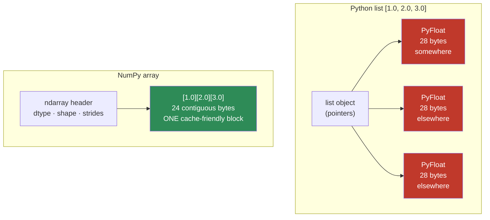
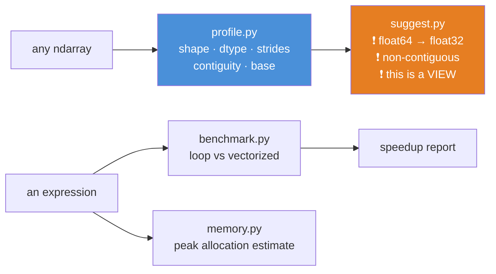

# 07.2 · NumPy — Internals & Performance

[⬅ 07.1 Data Lifecycle](07.1-data-lifecycle.md) · [🏠 Module 07](../README.md) · [➡ 07.3 Pandas I](07.3-pandas-fundamentals.md)

> **The lesson in one line:** NumPy is a thin Python skin over a contiguous C array — and every performance rule, every gotcha, and every reason it's 100× faster than a list follows from that one sentence.

---

## 🎯 Learning objectives

By the end of this lesson you can:

1. Explain the **ndarray's internal structure** — data pointer, dtype, shape, strides — and derive its behaviour from it.
2. Predict whether an operation returns a **view or a copy**, and why getting this wrong causes silent bugs.
3. Use **broadcasting** deliberately, including its memory traps.
4. Choose between **basic and fancy indexing**, and know which one copies.
5. Write vectorized code that is **100–1000× faster** than the loop, and explain *why* to an interviewer.
6. Optimize an array workload for **memory**, not just speed.

---

## 🧠 Mental model

> **A Python list is a box of pointers to boxes. A NumPy array is one box of numbers.**

That single difference explains everything.



**The list scatters its data across the heap, wraps every number in a 28-byte Python object, and forces the interpreter to dereference a pointer and type-check on every access.** The array puts the raw bytes side by side and lets the CPU's SIMD units chew through 8 of them per instruction.

**That's the whole lesson. Everything below is a consequence.**

---

## 📖 Core theory — the ndarray's four fields

An ndarray is a small header describing a block of memory:

| Field | What it is | Example |
|---|---|---|
| **`data`** | A pointer to one contiguous C buffer | `0x7f8a...` |
| **`dtype`** | How to interpret each element | `float32` (4 bytes each) |
| **`shape`** | The logical dimensions | `(3, 4)` |
| **`strides`** | **Bytes to step to move one index in each dimension** | `(16, 4)` |

**Strides are the magic**, and they're the field nobody learns.

```python
import numpy as np

a = np.arange(12, dtype=np.int32).reshape(3, 4)
print(a.shape)      # (3, 4)
print(a.strides)    # (16, 4)   ← move 16 bytes for the next ROW, 4 for the next COLUMN
print(a.itemsize)   # 4         (int32)
print(a.flags['C_CONTIGUOUS'])   # True
```

To find `a[i, j]`, NumPy computes: `data + i*16 + j*4`. **One multiplication and an add.** No pointer chasing, no type checks.

### Why strides explain everything

```python
b = a.T                          # transpose
print(b.shape)      # (4, 3)
print(b.strides)    # (4, 16)    ← THE STRIDES SWAPPED. No data moved!
print(b.base is a)  # True       ← it's a VIEW
```

> [!IMPORTANT]
> **`a.T` doesn't move a single byte.** It returns a new *header* with the strides swapped, pointing at the same buffer. That's why transpose is **O(1)** and free.
>
> But it's no longer **C-contiguous** — walking it row-by-row now jumps 4 bytes at a time through a buffer laid out in 16-byte rows, which **thrashes the cache** ([02.3 Memory](../../02-Computer-Science/weeks/02.3-memory.md)). **The transpose is free; using it might not be.** That's the kind of thing you can only understand from the strides.

> 🖼️ **[IMAGE PLACEHOLDER: `assets/images/07-ndarray-strides.png`]**
> *Left: a linear strip of 12 memory cells labelled 0–11 (the actual buffer). Above it, a 3×4 grid showing the logical view, with arrows mapping grid cell (1,2) down to buffer position 6, annotated "offset = 1×16 + 2×4 = 24 bytes = element 6." Right: the same buffer strip, but with a 4×3 grid above it (the transpose) and strides labelled (4, 16), with a caption: "SAME BUFFER. Different strides. Zero bytes copied." Below both, a note: "C-contiguous rows are adjacent in memory → cache-friendly. The transposed view is not."*

### Memory layout — C order vs Fortran order

| Order | Meaning | Contiguous along |
|---|---|---|
| **C (row-major)** | NumPy's default. Last axis varies fastest | **rows** — `a[i, :]` is fast |
| **F (column-major)** | MATLAB/Fortran/R style | **columns** — `a[:, j]` is fast |

```python
import numpy as np, time

A = np.random.rand(5000, 5000)      # C-order by default

t = time.perf_counter(); A.sum(axis=1); r = time.perf_counter() - t   # sum ROWS
t = time.perf_counter(); A.sum(axis=0); c = time.perf_counter() - t   # sum COLS

print(f"sum(axis=1) rows: {r*1000:.1f} ms")     # ~12 ms  ← contiguous
print(f"sum(axis=0) cols: {c*1000:.1f} ms")     # ~35 ms  ← strided, cache misses
```

**Same amount of arithmetic. ~3× different runtime.** The only difference is whether the CPU's prefetcher can predict your memory access. This is [02.3](../../02-Computer-Science/weeks/02.3-memory.md) showing up in your data code.

---

## ⚙️ Internal implementation — why vectorization wins

```python
import numpy as np, time

N = 5_000_000
a = np.random.rand(N)
b = np.random.rand(N)

t = time.perf_counter()
c_loop = [a[i] * b[i] for i in range(N)]          # pure Python
t_loop = time.perf_counter() - t

t = time.perf_counter()
c_vec = a * b                                      # NumPy
t_vec = time.perf_counter() - t

print(f"loop      : {t_loop:8.4f} s")     # ~1.9 s
print(f"vectorized: {t_vec:8.4f} s")      # ~0.008 s
print(f"speedup   : {t_loop/t_vec:,.0f}×")   # ~240×
```

**Five reasons for the gap** — you should be able to name all five in an interview:

| # | Mechanism | Effect |
|---|---|---|
| 1 | **No Python object overhead** | No `PyFloat` boxing/unboxing per element (28 bytes → 8) |
| 2 | **No interpreter dispatch** | One C call instead of 5 million bytecode iterations |
| 3 | **SIMD** | AVX processes 4–8 doubles **per instruction** |
| 4 | **Cache locality** | Contiguous memory; the prefetcher works |
| 5 | **Threaded BLAS** | Matmul and linear algebra go multi-core for free |

> [!IMPORTANT]
> **This is the single highest-leverage habit in all of data work.** If you're writing a `for` loop over array elements, you're leaving a 100–1000× speedup on the table. The exceptions — genuinely sequential recurrences, irregular control flow — are rare, and that's what `numba` is for.

---

## 🔍 Views vs Copies — the silent bug

**This is the NumPy behaviour that will actually bite you.**

| Operation | Returns | Modifying it affects the original? |
|---|---|---|
| **Basic slicing** `a[1:5]` | **VIEW** | ✅ **YES** |
| `a.T`, `a.reshape()`, `a.ravel()` | **VIEW** (usually) | ✅ **YES** |
| **Fancy indexing** `a[[1,3,5]]` | **COPY** | ❌ No |
| **Boolean indexing** `a[a > 5]` | **COPY** | ❌ No |
| `a.copy()`, `a.flatten()` | **COPY** | ❌ No |
| Arithmetic `a + 1` | **COPY** (new array) | ❌ No |

```python
import numpy as np

original = np.arange(10)

view = original[2:5]        # a VIEW
view[0] = 999
print(original)             # [  0   1 999   3   4   5   6   7   8   9]  😱 MUTATED

original = np.arange(10)
copy = original[[2, 3, 4]]  # fancy indexing → a COPY
copy[0] = 999
print(original)             # [0 1 2 3 4 5 6 7 8 9]   ✅ untouched

# How to check
print(view.base is original)   # True  → it's a view
print(copy.base is original)   # False → it's a copy
```

> [!CAUTION]
> **This is the #1 source of "why did my data change?" bugs in NumPy.** You slice a training set, normalize the slice in place, and silently corrupt the original array — including your test set. **No error is raised.**
>
> **The rule: if you intend to modify, be explicit.** `subset = data[:100].copy()`. The `.copy()` costs microseconds and saves hours.

---

## 🔢 Universal functions (ufuncs)

A **ufunc** is a function that operates element-wise on arrays, in compiled C, with broadcasting built in.

```python
import numpy as np
a = np.array([1.0, 4.0, 9.0])

np.sqrt(a)          # [1. 2. 3.]
np.exp(a)
np.log(a)
np.maximum(a, 2)    # [2. 4. 9.]   ← elementwise max, this is ReLU
a + 1               # ufunc under the hood (np.add)
```

**The performance trick nobody uses — `out=` and in-place ops:**

```python
big = np.random.rand(10_000_000)

c = big * 2 + 1          # allocates TWO temporary arrays (80 MB each!)

big *= 2                 # in-place: zero allocation
big += 1                 # in-place: zero allocation

np.multiply(big, 2, out=big)   # explicit form
```

> [!TIP]
> **Every intermediate expression allocates.** `(a + b) * c - d` on 100M-element arrays allocates three 800 MB temporaries you never asked for. In a memory-constrained pipeline, **`out=` and in-place operators (`+=`, `*=`) are the difference between running and OOM-ing.** This is where `numexpr` earns its keep for complex expressions.

---

## 📡 Broadcasting

**Operate on different-shaped arrays by virtually stretching the smaller one — with no memory copy.**

### The rules

Compare shapes **from the right**. Dimensions are compatible if **equal**, or one is **1**.

```
  (32, 768)      (5, 1, 3)       (100, 3)        (3,)
+ (    768)    + (   4, 3)     + (100, 1)      + (4,)
-----------    -----------     ----------      ------
  (32, 768) ✅   (5, 4, 3) ✅    (100, 3) ✅     ERROR ❌
```

```python
import numpy as np

X = np.random.rand(1000, 5)          # 1000 samples, 5 features

# Standardize every column — (06.6 statistics, meet 07.2 broadcasting)
mu    = X.mean(axis=0, keepdims=True)    # (1, 5)
sigma = X.std(axis=0, keepdims=True)     # (1, 5)
Z = (X - mu) / sigma                      # (1000,5) - (1,5) → broadcasts ✅
print(Z.mean(axis=0).round(6))            # ~[0 0 0 0 0]
print(Z.std(axis=0).round(6))             # ~[1 1 1 1 1]
```

> [!CAUTION]
> **The broadcasting memory bomb.** Broadcasting is free in *concept* but the **result** is real:
> ```python
> a = np.random.rand(50_000)
> b = np.random.rand(50_000)
> d = a[:, None] - b[None, :]      # 💥 (50000, 50000) = 2.5 BILLION floats = 20 GB
> ```
> This is exactly how people OOM while computing pairwise distances. **Do the shape arithmetic in your head before you type it:** `(n,1)` op `(1,m)` → `(n,m)`. If n and m are both large, that's a bomb. Chunk it, or use `scipy.spatial.distance.cdist`.

> [!WARNING]
> **The `(n,)` vs `(n,1)` silent bug** — the most dangerous behaviour in NumPy, because **it raises no error**:
> ```python
> a = np.array([1., 2., 3.])           # (3,)
> b = np.array([[1.], [2.], [3.]])     # (3, 1)
> (a - b).shape                        # (3, 3)  😱 an outer difference, not elementwise
> ```
> **This is why `keepdims=True` exists.** Use it after every reduction that feeds a broadcast.

---

## 🎯 Indexing — the four kinds

```python
import numpy as np
a = np.arange(20).reshape(4, 5)

# 1 · BASIC SLICING → view
a[1:3, 2:4]

# 2 · INTEGER (fancy) INDEXING → copy
a[[0, 2, 3]]                     # rows 0, 2, 3
a[[0, 1], [2, 3]]                # elements (0,2) and (1,3) — pairs!

# 3 · BOOLEAN INDEXING → copy  ← the one you'll use constantly
mask = a > 10
a[mask]                          # 1-D array of matching elements
a[a > 10] = 0                    # assignment through a mask ✅

# 4 · np.where — vectorized if/else
np.where(a > 10, a, 0)           # keep if >10, else 0
np.where(a > 10, 'high', 'low')  # element-wise conditional
```

**Boolean indexing is the workhorse of data cleaning.** Every "filter these rows" operation is a mask.

```python
# Combining masks — NOTE THE PARENTHESES
X = np.random.rand(1000, 3) * 100
mask = (X[:, 0] > 50) & (X[:, 1] < 20)      # & not `and`;  parentheses REQUIRED
clean = X[mask]
```

> [!WARNING]
> **Use `&`, `|`, `~` — never `and`, `or`, `not`.** Python's `and` calls `__bool__` on the whole array and raises *"The truth value of an array with more than one element is ambiguous."* And **`&` binds tighter than `>`**, so the parentheses in `(a > 5) & (b < 3)` are **mandatory** — without them you get a bitwise-and of `5 & b`, which is nonsense that may not even error.

---

## 🗂️ Structured arrays

Arrays with **named, heterogeneous fields** — a C `struct`, essentially.

```python
import numpy as np

dt = np.dtype([('name', 'U20'), ('age', 'i4'), ('score', 'f8')])
people = np.array([('Ada', 36, 99.5), ('Alan', 41, 97.2)], dtype=dt)

print(people['age'])        # [36 41]
print(people[people['age'] > 38]['name'])    # ['Alan']
print(people.itemsize)      # 92 bytes per record
```

> [!NOTE]
> **When should you use structured arrays? Almost never — use Pandas.** They exist for (a) reading binary formats with a fixed C layout, (b) interfacing with C/Fortran code, and (c) memory-mapped scientific files. For tabular data analysis, a DataFrame gives you everything structured arrays give you plus joins, groupby, missing-value handling, and a usable API. **Know they exist; reach for Pandas.**

---

## ⚡ Performance considerations

### The optimization ladder — in order

| Rung | Technique | Typical gain |
|---|---|---|
| 1 | **Vectorize** — kill the Python loop | **100–1000×** |
| 2 | **Right dtype** — `float32` not `float64`, `int8` for small ints | 2–8× memory |
| 3 | **In-place ops** (`+=`, `out=`) — kill temporaries | Avoids OOM |
| 4 | **Respect memory order** — sum along the contiguous axis | 2–3× |
| 5 | **Preallocate** — `np.empty` then fill; never `np.append` in a loop | O(n²) → O(n) |
| 6 | **`np.einsum` / BLAS** for complex tensor contractions | 2–10× |
| 7 | **`numba` / `Cython`** when it's genuinely sequential | 10–100× |

### The dtype decision

```python
import numpy as np

n = 10_000_000
for dt in (np.float64, np.float32, np.int64, np.int32, np.int8):
    a = np.ones(n, dtype=dt)
    print(f"{np.dtype(dt).name:9} {a.nbytes/1e6:7.1f} MB")
# float64      80.0 MB   ← NumPy's DEFAULT
# float32      40.0 MB   ← half. Deep learning uses this.
# int64        80.0 MB
# int32        40.0 MB
# int8         10.0 MB   ← 8× smaller
```

> [!IMPORTANT]
> **NumPy defaults to `float64` and you almost never need it.** Deep learning trains in `float32` or `bfloat16` ([06.9](../../06-Mathematics/weeks/06.9-numerical-computing.md)); a `float32` array is **half the memory, half the bandwidth, and roughly twice as fast** through the memory hierarchy. On a 50 GB dataset, that's the difference between fitting in RAM and not. **Set your dtype explicitly, always.**

### The `np.append` trap

```python
# ❌ O(n²) — reallocates and COPIES the entire array on every call
result = np.array([])
for i in range(10_000):
    result = np.append(result, i)      # ~1.5 seconds, and it gets worse

# ✅ Preallocate — O(n)
result = np.empty(10_000)
for i in range(10_000):
    result[i] = i                       # ~0.003 s

# ✅✅ Or just don't loop
result = np.arange(10_000)              # ~0.00001 s
```

**`np.append` is not `list.append`.** Arrays are fixed-size; every "append" allocates a new buffer and copies everything. **In a loop, it's quadratic.** If you must accumulate, append to a Python **list** and call `np.array(lst)` once at the end.

---

## 🔒 Security & privacy considerations

| Concern | Note |
|---|---|
| **`np.load` with `allow_pickle=True`** | ⚠️ **Arbitrary code execution.** A malicious `.npy` file can run anything. It defaults to `False` for exactly this reason — **never flip it on for untrusted files** |
| **Memory isn't zeroed** | `np.empty()` returns whatever was in that memory — potentially another process's data. Use `np.zeros()` when the values matter |
| **Views alias sensitive data** | A view of a PII column shares the same buffer. Deleting the view frees nothing; the original still holds it |
| **`.npy` / `.npz` files** | Contain raw data with no access control. Don't commit them; don't email them |
| **Reproducible randomness ≠ secure randomness** | `np.random` is a **PRNG**, not cryptographic. Never use it for tokens, keys, or salts — use `secrets` |

```python
import numpy as np
np.load('untrusted.npy')                        # safe (allow_pickle=False by default)
np.load('untrusted.npy', allow_pickle=True)     # 💀 remote code execution
```

---

## ✅ Best practices

| Practice | Why |
|---|---|
| **Set `dtype` explicitly** | float64 default wastes 2× memory for no benefit |
| **`.copy()` when you intend to mutate** | Views silently corrupt the original |
| **`keepdims=True` after reductions** | Prevents the `(n,)` vs `(n,1)` silent outer-op bug |
| **`&` `\|` `~` with parentheses** | `and`/`or` raise; missing parens produce nonsense |
| **Preallocate, never `np.append` in a loop** | O(n²) → O(n) |
| **Use a seeded `default_rng()`** | `np.random.seed()` is legacy global state; `rng = np.random.default_rng(42)` is reproducible and local |
| **Do the shape arithmetic before broadcasting** | `(n,1)` op `(1,m)` → `(n,m)`. That's a bomb if n,m are big |
| **Profile before optimizing** | `%timeit`, `line_profiler`. The bottleneck is rarely where you think |

---

## 🐛 Common mistakes

| Mistake | Symptom | Fix |
|---|---|---|
| Python loop over elements | 100–1000× too slow | Vectorize |
| Modifying a **view** unintentionally | The original array silently changes | `.copy()` |
| `and` / `or` on arrays | `ValueError: truth value... ambiguous` | `&`, `\|`, `~` |
| Missing parens: `a > 5 & b < 3` | Wrong result or a confusing error | `(a > 5) & (b < 3)` |
| Forgetting `keepdims=True` | Silent `(n,n)` outer operation | `keepdims=True` |
| `np.append` in a loop | O(n²) | Preallocate, or build a list |
| Leaving arrays as `float64` | 2× memory, slower | `dtype=np.float32` |
| Broadcasting without checking shapes | 20 GB allocation → OOM | Compute the output shape first |
| `np.empty` when you meant `np.zeros` | Garbage values from stale memory | `np.zeros` |
| `np.load(..., allow_pickle=True)` | **RCE** on a malicious file | Never, for untrusted input |

---

## 📝 Exercises

**Conceptual**
1. Explain, in terms of memory layout, why a NumPy array is faster than a Python list. **Name all five mechanisms.**
2. What are strides? Explain why `a.T` is O(1) and why that can still slow down your next operation.
3. Which operations return views and which return copies? Why does the distinction cause silent bugs?
4. Why does `np.append` in a loop take O(n²)?

**NumPy exercises**
5. Create a `(1000, 5)` array. Standardize each column to mean 0, std 1 using broadcasting. Verify with `.mean(axis=0)` and `.std(axis=0)`.
6. Given `a = np.arange(20).reshape(4,5)`, extract: rows 1 and 3; all elements > 10; elements at positions (0,1) and (2,3); every element replaced with 0 if it's odd.
7. Demonstrate the view/copy bug: slice an array, modify the slice, show the original changed. Then fix it.
8. Time `A.sum(axis=0)` vs `A.sum(axis=1)` on a `(5000,5000)` C-order array. Explain the difference. **Then make the slow one fast** (hint: `np.asfortranarray`).
9. Write `pairwise_distances(X)` for a `(1000, 3)` array using broadcasting. Then explain why the same code with `(50000, 3)` would kill your machine, and fix it with chunking.
10. Replace this loop with vectorized code and time both:
    ```python
    out = []
    for i in range(len(x)):
        out.append(x[i]**2 if x[i] > 0 else 0)
    ```

**Performance**
11. Take a `(10_000_000,)` float64 array. Convert to float32. Measure memory and the time of `arr * 2 + 1`. Then do it in-place. Report all three.
12. Build a 10,000-element array three ways: `np.append` in a loop, preallocated `np.empty`, and `np.arange`. Time all three. **The spread will surprise you.**

---

## 🛠️ Mini project — *The Array Profiler*

Build `code/07-data-analysis/array-profiler/` — a tool that tells you what an array is *actually* doing in memory.

**Requirements**
- Report shape, dtype, nbytes, strides, contiguity, and **whether it's a view of something else**.
- Detect the common performance sins (float64 when float32 would do; non-contiguous arrays in a hot path).
- Benchmark a loop vs a vectorized version of the same operation and report the speedup.

```
array-profiler/
├── README.md
├── requirements.txt          # numpy, pytest
├── src/
│   ├── profile.py            # describe(arr) → the full memory story
│   ├── benchmark.py          # loop vs vectorized timing harness
│   ├── suggest.py            # "this array is float64 — float32 halves it"
│   └── memory.py             # estimate the peak memory of an expression
├── tests/
│   └── test_profile.py       # view detection; nbytes math; contiguity
└── notebooks/
    └── demo.ipynb
```

**Architecture**



**Testing strategy**
- `test_view_detection`: assert `describe(a[1:3])['is_view'] is True` and `describe(a[[1,2]])['is_view'] is False`.
- `test_nbytes`: assert the reported bytes equal `np.prod(shape) * itemsize`.
- `test_broadcast_bomb`: assert `memory.estimate('a[:,None] - b[None,:]', a=50000, b=50000)` **warns** — it should refuse to let you allocate 20 GB by accident.
- Property test: for random arrays, `describe(arr.T)['strides'] == reversed(describe(arr)['strides'])`.

**Future improvements**
- Add a `@profile_memory` decorator that reports the peak allocation of a function.
- Detect accidental `float64` upcasting (a `float32` array `+ 1.0` silently becomes float64 — a real and common bug).
- Emit a warning when an operation is about to allocate more than X% of available RAM.

**Why this project:** because **you cannot optimize what you cannot see.** Most NumPy performance problems are invisible until you print the strides and the dtype — and after building this, you'll print them reflexively.

---

## 📄 Cheat sheet

| Task | Code |
|---|---|
| Create | `np.zeros(n)` · `np.ones` · `np.arange` · `np.linspace` · `np.empty` (⚠️ garbage) |
| Random (modern) | `rng = np.random.default_rng(42)` then `rng.normal(size=n)` |
| Shape info | `.shape` `.dtype` `.ndim` `.nbytes` `.strides` `.flags` |
| **Is it a view?** | `arr.base is other` |
| Reshape (view) | `.reshape(a,b)` · `.T` · `.ravel()` |
| Copy | `.copy()` · `.flatten()` |
| **Boolean mask** | `a[a > 5]` · `a[(a>5) & (b<3)]` ← **parens + `&`** |
| Fancy index (copy) | `a[[1,3,5]]` |
| Conditional | `np.where(cond, x, y)` |
| Reductions | `.sum(axis=0, keepdims=True)` · `.mean` · `.std` · `.min` · `.argmax` |
| Standardize | `(X - X.mean(0, keepdims=True)) / X.std(0, keepdims=True)` |
| Stack | `np.concatenate` · `np.vstack` · `np.hstack` · `np.stack` |
| In-place | `a += 1` · `np.multiply(a, 2, out=a)` |
| Missing | `np.nan` · `np.isnan(a)` · `np.nanmean(a)` |

**The rules:**
`(m,k) @ (k,n) → (m,n)` · **broadcasting compares shapes from the RIGHT** · **basic slice = view, fancy/boolean = copy** · **`keepdims=True`** · **never loop** · **set your dtype**

---

## 🎴 Flashcards

- **Q:** Why is a NumPy array faster than a Python list? → **A:** Contiguous raw bytes (not scattered 28-byte `PyFloat` objects) → no boxing, no interpreter dispatch, **SIMD**, cache locality, and threaded BLAS. Five mechanisms.
- **Q:** What are strides? → **A:** The number of **bytes** to step to advance one index along each axis. They're why `a.T` moves zero data — it just swaps the strides.
- **Q:** Which operations return a **view**? → **A:** Basic slicing (`a[1:5]`), `.T`, `.reshape()`, `.ravel()`. **Fancy and boolean indexing return copies.**
- **Q:** Why is the view/copy distinction dangerous? → **A:** Modifying a view **silently mutates the original** — no error. Classic cause of "why did my test set change?" Use `.copy()` when you intend to mutate.
- **Q:** Why is `keepdims=True` important? → **A:** Without it, a reduction collapses `(n,1)` → `(n,)`, and the next broadcast silently produces an `(n,n)` **outer** operation instead of an elementwise one.
- **Q:** Why `&` and not `and` for array conditions? → **A:** `and` calls `__bool__` on the whole array → *"truth value is ambiguous."* And `&` binds tighter than `>`, so **parentheses are mandatory**.
- **Q:** Why is `np.append` in a loop O(n²)? → **A:** Arrays are fixed-size — every append allocates a new buffer and **copies everything**. Preallocate, or build a Python list and convert once.
- **Q:** Why set dtype explicitly? → **A:** NumPy defaults to **float64**; float32 is **half the memory** and roughly twice as fast through the memory hierarchy — and deep learning doesn't need the precision.
- **Q:** Why does `A.sum(axis=0)` differ in speed from `A.sum(axis=1)`? → **A:** C-order arrays store rows contiguously. Summing along the non-contiguous axis strides through memory and **thrashes the cache** — ~3× slower for identical arithmetic.
- **Q:** What's the broadcasting memory bomb? → **A:** `a[:,None] - b[None,:]` with two 50k arrays allocates a **(50000, 50000)** result = 20 GB. Broadcasting is free; the **result** is not.
- **Q:** Why is `np.load(..., allow_pickle=True)` dangerous? → **A:** **Arbitrary code execution** from a malicious file. It defaults to `False` for that reason.

---

## 💼 Interview questions

1. **"Why is NumPy faster than pure Python?"** — Name all five: no object boxing, no interpreter dispatch, SIMD, cache locality, threaded BLAS. **Most candidates say "it's written in C" and stop.** The five-part answer is a clear signal.
2. **"What's the difference between a view and a copy? Why does it matter?"** — Slicing gives a view (shares the buffer); fancy/boolean indexing gives a copy. It matters because modifying a view **silently corrupts the original** with no error.
3. **"Explain broadcasting, and a bug it causes."** — Right-aligned shape rules. Then the `(n,)` vs `(n,1)` silent outer-op, and the memory bomb.
4. **"You have a 50 GB dataset and 32 GB of RAM. What do you do?"** — dtype reduction (float64 → float32 halves it), chunked processing, Parquet with column pruning, memory-mapping (`np.memmap`), or out-of-core (Dask/Polars). ([07.10](07.10-performance.md))
5. **"Why is `A.sum(axis=0)` slower than `A.sum(axis=1)`?"** — Memory layout. C-order stores rows contiguously; summing columns strides through memory and misses cache. A great question because it tests whether you understand *why*, not just *what*.

---

## 📚 Summary

- **An ndarray is a header (dtype, shape, strides) over one contiguous C buffer.** Every behaviour follows from that.
- **Strides explain everything**: `a.T` is O(1) because it just swaps them — but the resulting non-contiguous view can be 3× slower to walk.
- **Vectorization is 100–1000×** faster for five reasons: no object boxing, no interpreter dispatch, SIMD, cache locality, threaded BLAS. **If you're writing a loop over elements, stop.**
- **Basic slicing returns a VIEW; fancy and boolean indexing return COPIES.** Modifying a view silently mutates the original — the #1 NumPy bug. `.copy()` when you intend to mutate.
- **Broadcasting** compares shapes from the right and is free in concept — but `(n,1)` op `(1,m)` produces an `(n,m)` **result**, which is how people accidentally allocate 20 GB.
- **`keepdims=True`** prevents the silent `(n,)` vs `(n,1)` outer-operation bug.
- **Set your dtype.** float64 is the default and is usually 2× more memory than you need.
- **Never `np.append` in a loop** — it's O(n²).
- **`np.load(allow_pickle=True)` on untrusted data is remote code execution.**

**Next:** [07.3 Pandas I](07.3-pandas-fundamentals.md) — NumPy with labels, and the tool you'll actually spend your days in.

---

## 🔗 References

- NumPy docs — [Broadcasting](https://numpy.org/doc/stable/user/basics.broadcasting.html) and [Indexing](https://numpy.org/doc/stable/user/basics.indexing.html). Read both once, properly.
- VanderPlas — *Python Data Science Handbook*, Ch. 2 (free online). The best NumPy chapter written.
- Harris et al. (2020) — *Array programming with NumPy* (Nature). The reference paper, and a good read.
- [02.3 Memory](../../02-Computer-Science/weeks/02.3-memory.md) — the cache hierarchy that makes contiguity matter.
- [06.9 Numerical Computing](../../06-Mathematics/weeks/06.9-numerical-computing.md) — floats, precision, and the stability tricks.

---

## 🧭 Navigation

| Direction | Link |
|---|---|
| ⬅ Previous | [07.1 Data Lifecycle](07.1-data-lifecycle.md) |
| ➡ Next | [07.3 Pandas I](07.3-pandas-fundamentals.md) |
| 🏠 Module | [Module 07](../README.md) |
| 🗺 Roadmap | [ROADMAP.md](../../../ROADMAP.md) |
