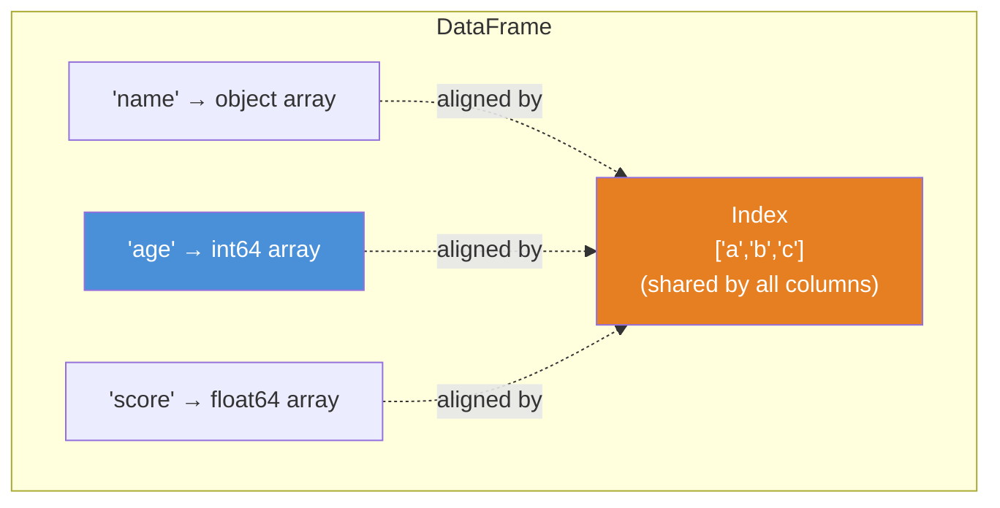
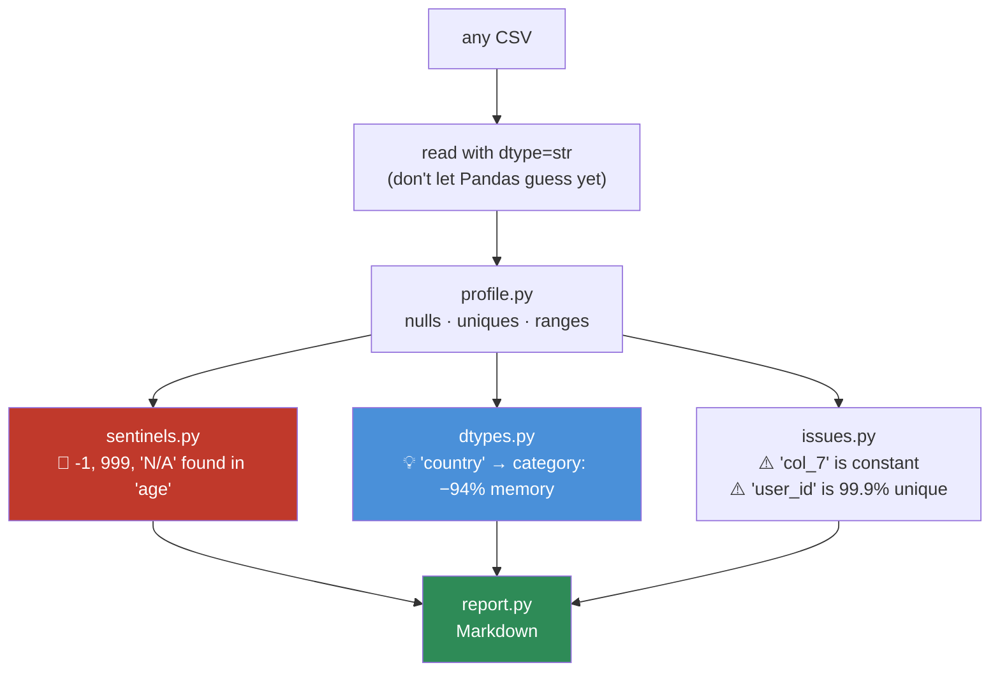

# 07.3 · Pandas I — Series, DataFrames & Indexing

[⬅ 07.2 NumPy](07.2-numpy.md) · [🏠 Module 07](../README.md) · [➡ 07.4 Pandas II](07.4-pandas-advanced.md)

> **The lesson in one line:** A DataFrame is a dict of NumPy arrays with a shared index — and the single most expensive thing you can do to one is loop over its rows.

---

## 🎯 Learning objectives

By the end of this lesson you can:

1. Explain what a **Series**, **DataFrame**, and **Index** actually *are* internally.
2. Use `.loc` and `.iloc` correctly, and never write `df[a][b] = x` again.
3. Diagnose and fix the **SettingWithCopyWarning** — and understand why it exists.
4. Choose the right **dtype**, and cut a DataFrame's memory by 10× with `category`.
5. Read and write data efficiently, and know why **CSV is the wrong default**.
6. Handle a **MultiIndex** without fear.

---

## 🧠 Mental model

> **A DataFrame is a dict of columns. Each column is a NumPy array. They share one Index.**



**Three consequences you must internalize:**

1. **Columns are fast; rows are slow.** A column is one contiguous NumPy array. A *row* cuts across every column — different dtypes, different arrays. **This is why `df.iterrows()` is 100× slower than a vectorized operation**, and why the entire Pandas idiom is column-oriented.
2. **The Index is not decoration — it's an alignment key.** Every operation between two Pandas objects **aligns on the index first**. This is Pandas' superpower and its most confusing behaviour.
3. **A `float64` column and an `object` column behave completely differently.** Dtype is not cosmetic; it determines speed, memory, and whether your `.mean()` even works.

---

## 📖 Core theory

### Series — a labeled 1-D array

```python
import pandas as pd
import numpy as np

s = pd.Series([10, 20, 30], index=['a', 'b', 'c'], name='score')
print(s.values)     # [10 20 30]   ← it's a NumPy array underneath
print(s.index)      # Index(['a','b','c'])
print(s.dtype)      # int64
```

**Automatic alignment — the behaviour that surprises everyone:**

```python
a = pd.Series([1, 2, 3], index=['x', 'y', 'z'])
b = pd.Series([10, 20, 30], index=['z', 'y', 'x'])    # REVERSED order

print(a + b)
# x    31    ← 1 + 30   (aligned on the LABEL, not the position!)
# y    22
# z    13
```

> [!IMPORTANT]
> **Pandas aligns on the index, not on position.** This is a feature — it prevents you from accidentally adding January's revenue to February's costs. But it means a mismatched index produces `NaN` instead of an error:
> ```python
> a = pd.Series([1,2,3], index=['x','y','z'])
> c = pd.Series([1,2,3], index=[0,1,2])
> print(a + c)     # x NaN, y NaN, z NaN, 0 NaN, 1 NaN, 2 NaN  😱 six NaNs, no error
> ```
> **If your arithmetic suddenly produces all-NaN, check that your indexes match.** This is one of the top three Pandas confusions, and it costs everyone an afternoon exactly once.

### DataFrame — a dict of Series

```python
df = pd.DataFrame({
    'user_id':  [1, 2, 3, 4],
    'name':     ['Ada', 'Alan', 'Grace', 'Edsger'],
    'age':      [36, 41, 45, 72],
    'score':    [99.5, 97.2, 98.8, np.nan],
    'country':  ['UK', 'UK', 'US', 'NL'],
})

df.info()          # dtypes + memory — RUN THIS FIRST, ALWAYS
df.describe()      # numeric summary
df.head()
df.shape           # (4, 5)
```

> [!TIP]
> **`df.info()` is the first thing you run on any dataset, every time.** It tells you the row count, the dtypes (is `age` accidentally an object?), the non-null counts (where are the missing values?), and the memory usage — **four of the five things that will go wrong, in one command.** Make it a reflex.

---

## 🏷️ The Index

The Index is a **hash table** (for label lookup) plus an array. That's why:

| Index type | Lookup | Use for |
|---|---|---|
| **RangeIndex** (default) | O(1) | Just row numbers. Costs nothing |
| **Int64/Object Index** | O(1) hash lookup | Meaningful keys (user_id) |
| **DatetimeIndex** | O(1), + time-slicing superpowers | **Time series — always** |
| **MultiIndex** | Hierarchical | Grouped/panel data |

```python
df = df.set_index('user_id')       # promote a column to the index
df.loc[3]                          # O(1) lookup by label
df = df.reset_index()              # demote it back to a column
```

> [!NOTE]
> **When should you set an index?** When you'll look up by that key repeatedly (it becomes a hash lookup), when it's a **DatetimeIndex** (unlocks resampling and time-slicing, [07.4](07.4-pandas-advanced.md)), or when you're aligning two frames on it. Otherwise the default RangeIndex is fine — **don't set an index just because it looks tidy.**

---

## 🎯 `.loc` vs `.iloc` — get this right once

| | `.loc` | `.iloc` |
|---|---|---|
| Indexes by | **Label** | **Integer position** |
| Slice endpoint | **INCLUSIVE** ⚠️ | exclusive (like Python) |
| Boolean mask | ✅ | ❌ (needs `.values`) |

```python
df = pd.DataFrame({'a': [1,2,3,4]}, index=['w','x','y','z'])

df.loc['x']            # by label
df.loc['x':'z']        # ⚠️ INCLUSIVE — returns x, y, AND z (3 rows)
df.iloc[1]             # by position
df.iloc[1:3]           # exclusive — returns x, y (2 rows)

df.loc[df['a'] > 2]                # boolean mask ✅
df.loc[df['a'] > 2, 'a'] = 0       # ✅ mask + column, in ONE call — the correct way
```

> [!CAUTION]
> **`.loc` slicing is INCLUSIVE of the endpoint.** `df.loc['2024-01-01':'2024-01-31']` includes January 31st. `df.iloc[0:31]` does not include row 31. This asymmetry is deliberate (label slicing is more natural when inclusive) and it catches everyone at least once.

---

## 🚨 SettingWithCopyWarning — the Pandas rite of passage

**This is the most misunderstood warning in Python, and it's a real bug, not noise.**

```python
# ❌ CHAINED INDEXING — this may or may not work. You cannot tell.
df[df['age'] > 40]['score'] = 100
# SettingWithCopyWarning: A value is trying to be set on a copy of a slice...
# ...and the original df is UNCHANGED. Your code did nothing.

# ✅ ONE .loc call — always works
df.loc[df['age'] > 40, 'score'] = 100
```

**Why does it happen?** `df[mask]` returns a **new object**, which may be a view or a copy of the underlying NumPy buffer ([07.2](07.2-numpy.md)) — **Pandas cannot always tell which.** So `df[mask]['col'] = x` assigns to a temporary that may be immediately discarded. **Sometimes it works, sometimes it silently doesn't.** That non-determinism is exactly why it warns.

> [!IMPORTANT]
> **The rule: never chain a `[...]` with an assignment. Use exactly one `.loc[rows, cols] = value`.**
>
> And when you want an independent subset, **say so**: `subset = df[df.age > 40].copy()`. The `.copy()` is not paranoia; it's the difference between code that works and code that works *on Tuesdays*.
>
> (Pandas 3.0's Copy-on-Write makes this deterministic — subsets always behave as copies. But the `.loc` habit is correct in every version, so build it now.)

---

## 💾 Dtypes — the 10× memory win nobody uses

```python
import pandas as pd, numpy as np

n = 1_000_000
df = pd.DataFrame({
    'id':      np.arange(n),                                  # int64  → 8 MB
    'country': np.random.choice(['US','UK','DE','FR'], n),    # object → 60+ MB!
    'active':  np.random.choice([True, False], n),            # bool   → 1 MB
    'score':   np.random.rand(n),                             # float64→ 8 MB
})
print(f"before: {df.memory_usage(deep=True).sum()/1e6:.1f} MB")   # ~70 MB

df['country'] = df['country'].astype('category')   # ← THE BIG ONE
df['id']      = df['id'].astype('int32')
df['score']   = df['score'].astype('float32')
print(f"after : {df.memory_usage(deep=True).sum()/1e6:.1f} MB")   # ~8 MB → 9× smaller
```

> [!IMPORTANT]
> **`category` is the single biggest memory win in Pandas, and almost nobody uses it.** An `object` column stores a **pointer to a separate Python string object for every row** — a million rows with the value `"US"` stores a million pointers. A `category` stores the four unique values *once* plus a compact integer code array. **On low-cardinality string columns (country, status, product_type, gender), it routinely cuts memory by 10–50× and makes groupby dramatically faster.**
>
> **The rule of thumb: if a string column has fewer than ~50% unique values, make it a category.**

| Dtype | Bytes/row | Use for |
|---|---|---|
| `int8` / `int16` / `int32` | 1 / 2 / 4 | **Check your actual range** — ages fit in int8 |
| `float32` | 4 | Almost everything numeric. float64 is overkill |
| `bool` | 1 | Flags |
| **`category`** | ~1 + a small dict | **Low-cardinality strings** ← the big win |
| `object` | 8 (ptr) + ~50 (str) | Genuinely free text only |
| `datetime64[ns]` | 8 | Always parse dates — never leave them as strings |
| `Int64` (capital I) | 8 + mask | Integers **with missing values** (nullable) |

> [!NOTE]
> **Why is `int64` with a NaN silently upcast to `float64`?** Because NumPy's `int64` has **no representation for missing**. `NaN` is a float concept. So the moment one value is missing, the whole column becomes float — and your IDs become `1.0, 2.0, 3.0`. **Pandas' nullable `Int64` (capital I) fixes this** with a separate boolean mask. Use it when integer columns can be null.

---

## 📥 Reading & writing data

```python
import pandas as pd

# ── CSV — universal, and the wrong default ────────────────────────
df = pd.read_csv(
    'data.csv',
    dtype={'user_id': 'int32', 'country': 'category'},   # ← set dtypes AT READ TIME
    parse_dates=['created_at'],                          # ← parse dates AT READ TIME
    usecols=['user_id', 'country', 'created_at', 'amount'],  # ← read only what you need
    na_values=['', 'NULL', 'N/A', '-1', 'unknown'],      # ← declare your sentinels!
)

# ── Parquet — what you should actually use ────────────────────────
df.to_parquet('data.parquet', compression='snappy')
df = pd.read_parquet('data.parquet', columns=['user_id', 'amount'])  # column pruning!
```

| Format | Size | Read speed | Types preserved? | Use when |
|---|---|---|---|---|
| **CSV** | 1× | 1× | ❌ **No** — everything is a string | Interop with humans/Excel |
| **Parquet** | **~0.2×** | **~10×** | ✅ Yes | ✅ **Your default for anything internal** |
| Feather/Arrow | ~0.3× | **~30×** | ✅ Yes | Fast local cache, IPC |
| Pickle | ~0.5× | fast | ✅ Yes | ⚠️ **Insecure + version-fragile.** Avoid |
| JSON | 2× | slow | partial | APIs, nested data |

> [!IMPORTANT]
> **CSV has no schema.** Every read is a *guess*: is `007` a string or the number 7? Is `2024-01-02` a date or text? Is the empty string a missing value or a legitimate empty? Pandas guesses — and it guesses differently depending on what's in the first few thousand rows, which means **the same code can behave differently on different files.**
>
> **Parquet is columnar, compressed, typed, and ~10× faster** — and column pruning means reading 3 columns out of 200 costs almost nothing. **Use CSV to talk to humans; use Parquet for everything else.** ([07.10](07.10-performance.md))

> [!CAUTION]
> **`na_values` is the one you'll forget.** Real data encodes missing as `-1`, `999`, `"N/A"`, `"unknown"`, `"NULL"`, or an empty string. **If you don't declare them, `-1` becomes a legitimate age and poisons every statistic you compute.** This is exactly the silent data bug from [07.1](07.1-data-lifecycle.md): `df['age'].mean()` returns 43.7 and it's a lie.

---

## 🗂️ MultiIndex

A hierarchical index — multiple levels per row.

```python
import pandas as pd, numpy as np

df = pd.DataFrame({
    'country': ['US','US','UK','UK'],
    'year':    [2023, 2024, 2023, 2024],
    'revenue': [100, 120, 80, 95],
}).set_index(['country', 'year'])       # ← two levels

print(df.loc['US'])                     # all US rows
print(df.loc[('US', 2024)])             # one specific cell — a TUPLE
print(df.xs(2024, level='year'))        # cross-section: all countries, 2024
print(df.unstack('year'))               # pivot year into columns
```

> [!TIP]
> **MultiIndexes arrive whether you want them or not** — `groupby(['a','b']).sum()` produces one automatically. Two survival commands: **`.reset_index()`** flattens it back to plain columns (usually what you want), and **`.unstack()`** pivots a level into columns. If a MultiIndex is confusing you, `reset_index()` and move on. **Elegance is not worth an hour of confusion.**

---

## ⚡ Performance considerations

### The iteration ladder — memorize this ranking

```python
import pandas as pd, numpy as np, time
df = pd.DataFrame({'a': np.random.rand(100_000), 'b': np.random.rand(100_000)})

# ❌❌❌ WORST — iterrows: ~5.0 s. Creates a Series per row.
result = [row['a'] * row['b'] for _, row in df.iterrows()]

# ❌❌ BAD — apply with axis=1: ~1.2 s. Still a Python call per row.
result = df.apply(lambda r: r['a'] * r['b'], axis=1)

# ❌ MEH — itertuples: ~0.08 s. Better, but still Python-level.
result = [r.a * r.b for r in df.itertuples()]

# ✅ GOOD — vectorized: ~0.0005 s
result = df['a'] * df['b']
```

**`iterrows` → vectorized is a 10,000× speedup.** Not a typo.

| Method | Relative time | Why |
|---|---|---|
| `.iterrows()` | **10,000×** | Constructs a **new Series object for every row** |
| `.apply(axis=1)` | 2,400× | A Python function call per row |
| `.itertuples()` | 160× | Namedtuples — lighter, still Python |
| `.apply()` on a **column** | ~50× | Python call per element |
| **Vectorized** | **1×** | ✅ One C-level operation on the whole array |
| `.map()` with a dict | ~2× | Fine for lookups |

> [!WARNING]
> **`df.iterrows()` is the single most damaging habit in Pandas.** It appears in every tutorial and it is almost always wrong. It's slow because it **constructs a brand-new Series object for every single row** — which also means it *loses dtypes* (a row with mixed types becomes all-object).
>
> **If you find yourself reaching for `iterrows`, stop and ask: what is the column-wise version of this?** There nearly always is one — `np.where`, `.map`, a merge, a groupby, or plain arithmetic.

### Vectorized string operations

```python
df['email'].str.lower().str.strip()
df['name'].str.contains('smith', case=False, na=False)   # ← na=False matters!
df['phone'].str.replace(r'\D', '', regex=True)
df['full'] = df['first'] + ' ' + df['last']
```

`.str` is vectorized — still Python-level under the hood (strings are objects), but ~10× faster than `apply`, and infinitely more readable.

### Other performance rules

```python
# ❌ O(n²) — every concat COPIES the whole frame
result = pd.DataFrame()
for f in files:
    result = pd.concat([result, pd.read_csv(f)])     # quadratic!

# ✅ O(n) — collect, concat once
result = pd.concat([pd.read_csv(f) for f in files], ignore_index=True)
```

**Same lesson as `np.append`** ([07.2](07.2-numpy.md)): growing an immutable structure in a loop is quadratic. Build a list; concatenate once.

---

## 🔒 Security & privacy considerations

| Concern | Note |
|---|---|
| **`pd.read_pickle` on untrusted data** | 💀 **Arbitrary code execution.** Pickle can execute anything on load. **Never** unpickle a file you didn't create |
| **`df.head()` in a committed notebook** | Publishes **real customer records** into git history, permanently. Use `nbstripout` as a [pre-commit hook](../../04-Git/weeks/04.10-hooks.md) |
| **`df.to_csv()` writes everything** | Including PII columns you forgot were there. **Whitelist columns explicitly** on export, never blacklist |
| **`read_csv` from a URL** | Fetches and parses arbitrary remote content. Validate the source and the schema |
| **PII in the index** | Easy to forget it's there — it survives `df.drop(columns=[...])` |
| **`df.query()` / `eval()`** | Uses `eval` semantics. **Never** interpolate user input into a query string |
| **Memory dumps / cached parquet** | Intermediate files in `/tmp` or `data/` outlive your process and often escape access controls |

```python
# ❌ blacklist — you WILL forget a column
df.drop(columns=['email', 'ssn']).to_csv('export.csv')

# ✅ whitelist — safe by construction
SAFE = ['user_id_hashed', 'country', 'signup_month', 'plan_tier']
df[SAFE].to_csv('export.csv', index=False)
```

**Whitelist, never blacklist.** A new PII column added upstream silently appears in a blacklisted export. It cannot appear in a whitelisted one.

---

## ✅ Best practices

| Practice | Why |
|---|---|
| **`df.info()` first, always** | Rows, dtypes, nulls, memory — four bugs in one command |
| **Set dtypes at read time** | Not after. Saves memory *and* prevents wrong inference |
| **Declare `na_values`** | `-1`, `999`, `"N/A"` are missing values pretending to be data |
| **`category` for low-cardinality strings** | 10–50× memory reduction |
| **`parse_dates` at read time** | A date left as a string is a bug waiting to happen |
| **One `.loc[rows, cols] = val`** | Never chain `[...]` with assignment |
| **`.copy()` for independent subsets** | Explicit beats "works on Tuesdays" |
| **Parquet, not CSV** | Typed, columnar, 5× smaller, 10× faster |
| **Never `iterrows`** | Vectorize. It's 10,000× |
| **`ignore_index=True`** on concat | Otherwise you get duplicate index values, which break `.loc` |

---

## 🐛 Common mistakes

| Mistake | Symptom | Fix |
|---|---|---|
| **`df[mask]['col'] = x`** | `SettingWithCopyWarning`; the assignment **silently does nothing** | `df.loc[mask, 'col'] = x` |
| **`df.iterrows()`** | 10,000× too slow; loses dtypes | Vectorize |
| Not declaring `na_values` | `-1` becomes a valid age; every stat is wrong | `na_values=[-1, 'N/A', ...]` |
| Leaving strings as `object` | 10–50× memory waste | `.astype('category')` |
| Mismatched indexes in arithmetic | **All NaN**, no error | Check `.index`; `reset_index()` |
| Forgetting `.loc` slicing is **inclusive** | Off-by-one on date ranges | It's deliberate. Remember it |
| `pd.concat` in a loop | O(n²) | Build a list, concat once |
| `int64` column silently becomes `float64` | IDs become `1.0, 2.0` | A NaN appeared. Use nullable `Int64` |
| `.str.contains()` with NaN | `ValueError` | `na=False` |
| `pd.read_pickle` on untrusted data | **RCE** | Never |
| `inplace=True` | Doesn't save memory (a myth), hurts chaining, being deprecated | Just reassign: `df = df.drop(...)` |

---

## 📝 Exercises

**Conceptual**
1. What *is* a DataFrame, internally? Why are columns fast and rows slow?
2. Explain `SettingWithCopyWarning`. Why does Pandas warn instead of just working?
3. Why does an `int64` column become `float64` when one value goes missing?
4. Why is `category` dramatically more memory-efficient than `object` for a country column?
5. Name three reasons CSV is a bad default and Parquet is better.

**Pandas exercises**
6. Build a DataFrame with 1M rows and columns `id` (int), `country` (4 unique strings), `score` (float). Report `memory_usage(deep=True)`. Now optimize the dtypes and report again. **Target: 8× reduction.**
7. Demonstrate the SettingWithCopyWarning bug: show that `df[df.a > 2]['b'] = 0` leaves `df` **unchanged**. Then fix it with `.loc`.
8. Two Series with reversed indexes. Add them. Explain the result. Then add two Series with *disjoint* indexes and explain the all-NaN.
9. Read a CSV where missing values are encoded as `-1`, `"N/A"`, and `""`. Show that without `na_values` the mean is wrong, and with it, correct.
10. Take a `(100_000, 2)` DataFrame. Compute `a * b` four ways (`iterrows`, `apply(axis=1)`, `itertuples`, vectorized). **Time all four.** Report the ratios.

**Data cleaning**
11. Given a DataFrame with a `created_at` column of strings in three different formats, parse them all into a `datetime64` column. Report how many failed and what you'd do about them.
12. Given a DataFrame with 200 columns, write an export that includes **only** a safe whitelist. Explain why whitelisting beats blacklisting.

---

## 🛠️ Mini project — *The CSV Profiler*

Build `code/07-data-analysis/csv-profiler/` — point it at any CSV and get back everything you need to know before you touch it.

**Requirements**
- Report per column: dtype, null count and %, unique count, sample values, min/max/mean for numerics.
- **Suggest optimal dtypes** and report the memory that would save.
- **Detect missing-value sentinels** (`-1`, `999`, `"N/A"`, `"unknown"`, `""`) — the silent killers.
- Flag likely issues: constant columns, near-unique columns (probably IDs), high-cardinality strings, mixed types, suspicious dates.
- Output a Markdown report.

```
csv-profiler/
├── README.md
├── requirements.txt          # pandas, pyarrow, pytest
├── src/
│   ├── profile.py            # per-column statistics
│   ├── dtypes.py             # suggest optimal dtypes + memory saving
│   ├── sentinels.py          # detect disguised missing values
│   ├── issues.py             # flag constant/near-unique/mixed-type columns
│   └── report.py             # render Markdown
├── tests/
│   └── test_profiler.py
└── examples/
    └── messy.csv             # a deliberately awful CSV you construct
```

**Architecture**



**Implementation guidance**
1. **Read with `dtype=str` first.** Let *your* code decide the types, not Pandas' guesswork — that's the whole point of a profiler.
2. **`sentinels.py` is the valuable part.** Look for suspicious values: negative ages, `999`/`-999`, string forms of null, and **values that are far more frequent than their neighbours** (a spike at exactly `-1` in an otherwise smooth distribution is a sentinel, not data). **This module catches the exact silent bug that produced the wrong `mean()` in [07.1](07.1-data-lifecycle.md).**
3. **`dtypes.py`** — for each column, compute the actual min/max and pick the smallest int type that fits; suggest `category` when uniqueness < 50%. Report total memory saved.

**Testing strategy**
- Build `examples/messy.csv` **deliberately**: a `-1` age, a `999` sentinel, a constant column, a country column with 3 unique values in 10,000 rows, a date column in mixed formats, and an integer ID column with one null.
- Assert the profiler finds **every planted problem**. This is a form of mutation testing — you know the ground truth because you wrote the bugs.
- `test_dtype_suggestion`: assert the country column is recommended as `category` and that the reported saving is > 90%.

**Future improvements**
- Emit a `pandera` schema from the profile — turning a one-off analysis into a **reusable validation contract** ([07.9](07.9-data-quality.md)).
- Compare two profiles to detect **drift** between last month's file and this month's.
- Add a `--fix` flag that writes a cleaned Parquet with the suggested dtypes applied.

**Why this project:** because **you will point it at every new dataset you ever receive**, and it will save you from the class of bug that has no stack trace.

---

## 📄 Cheat sheet

| Task | Code |
|---|---|
| **First command, always** | `df.info()` |
| Quick look | `.head()` `.describe()` `.shape` `.dtypes` `.nunique()` |
| Read (properly) | `pd.read_csv(f, dtype={...}, parse_dates=[...], na_values=[...], usecols=[...])` |
| Write (properly) | `df.to_parquet('f.parquet')` |
| Select column | `df['col']` (Series) · `df[['a','b']]` (DataFrame) |
| **Select by label** | `df.loc[rows, cols]` ← **slice is INCLUSIVE** |
| **Select by position** | `df.iloc[rows, cols]` ← exclusive |
| **Conditional assign** | `df.loc[mask, 'col'] = val` ← **ONE call. Never chain** |
| Filter | `df[(df.a > 5) & (df.b < 3)]` ← **parens + `&`** |
| Independent subset | `sub = df[mask].copy()` |
| Memory | `df.memory_usage(deep=True).sum()` |
| **Shrink memory** | `df['c'] = df['c'].astype('category')` |
| Nullable int | `.astype('Int64')` (capital I) |
| Index | `.set_index('col')` · `.reset_index()` |
| MultiIndex | `.loc[('US', 2024)]` · `.xs(2024, level='year')` · `.unstack()` |
| Strings (vectorized) | `df.col.str.lower().str.strip()` |
| Missing | `.isna()` `.notna()` `.fillna()` `.dropna()` |
| **Never** | `.iterrows()` · `df[a][b] = x` · `pd.concat` in a loop |

---

## 🎴 Flashcards

- **Q:** What is a DataFrame internally? → **A:** A **dict of columns**, each a NumPy array, sharing one Index. Hence columns are fast and rows are slow.
- **Q:** Why is `df.iterrows()` so slow? → **A:** It **constructs a new Series object for every row** (and loses dtypes). It's ~10,000× slower than vectorized.
- **Q:** What causes `SettingWithCopyWarning`? → **A:** **Chained indexing** — `df[mask]['col'] = x` assigns to a temporary that may be a copy, so the assignment **may silently do nothing**. Fix: one `df.loc[mask, 'col'] = x`.
- **Q:** `.loc` vs `.iloc`? → **A:** `.loc` is by **label** and its slice is **INCLUSIVE**; `.iloc` is by **position** and exclusive.
- **Q:** Why does an int column become float when a value goes missing? → **A:** NumPy's `int64` has **no NaN representation**. Use the nullable `Int64` (capital I) instead.
- **Q:** Why is `category` such a big memory win? → **A:** An `object` column stores a **pointer to a separate Python string per row**. A `category` stores each unique value **once** plus a compact integer code array. 10–50× on low-cardinality strings.
- **Q:** When should you use `category`? → **A:** When a string column has **< ~50% unique values** (country, status, plan_tier).
- **Q:** Why does Pandas arithmetic between two Series produce NaN? → **A:** **Index misalignment.** Pandas aligns on **labels**, not position — mismatched labels produce NaN rather than an error.
- **Q:** Why is Parquet better than CSV? → **A:** Typed (no guessing), columnar (read only the columns you need), compressed (~5× smaller), and ~10× faster. **CSV has no schema.**
- **Q:** Why does `na_values` matter so much? → **A:** Real data encodes missing as `-1`, `999`, `"N/A"`. Undeclared, they become **legitimate values** and silently poison every statistic.
- **Q:** Why is `pd.read_pickle` on untrusted data dangerous? → **A:** Pickle can execute **arbitrary code** on load.
- **Q:** Whitelist or blacklist on export? → **A:** **Whitelist.** A new PII column added upstream silently appears in a blacklisted export; it cannot appear in a whitelisted one.

---

## 💼 Interview questions

1. **"Your Pandas job takes 3 hours. Where do you look first?"** — `iterrows`/`apply(axis=1)` (vectorize), `concat` in a loop (O(n²)), object dtypes (categorize), reading CSV instead of Parquet, and reading columns you don't need. **In that order** — it's roughly the order of impact.
2. **"Explain `SettingWithCopyWarning`."** — Chained indexing produces an ambiguous view-or-copy, so the assignment may silently do nothing. Fix with a single `.loc`. **Emphasize that it's a real bug, not noise** — most candidates suppress it.
3. **"How would you cut a DataFrame's memory by 10×?"** — `category` for low-cardinality strings (the big one), downcast ints/floats, drop unused columns at read time, and use Parquet with column pruning.
4. **"`.loc` vs `.iloc`?"** — Label vs position; and mention that **`.loc` slicing is inclusive**. That detail is the tell that you've actually used it.
5. **"Your `df['age'].mean()` returns 43.7 but you suspect it's wrong. What do you check?"** — Missing-value **sentinels** (`-1`, `999`), the dtype (is it object?), nulls silently excluded, and outliers. **Plot the distribution** — a spike at exactly `-1` is not data.

---

## 📚 Summary

- **A DataFrame is a dict of NumPy arrays sharing an Index.** Columns are contiguous and fast; rows cut across dtypes and are slow. **The entire Pandas idiom follows from this.**
- **Pandas aligns on the index, not position.** Mismatched indexes give you **NaN, not an error** — check `.index` when arithmetic mysteriously produces all-NaN.
- **`.loc` is by label (slice INCLUSIVE); `.iloc` is by position (exclusive).**
- **Never chain `[...]` with assignment.** `df[mask]['col'] = x` may silently do nothing. **One `.loc[rows, cols] = value`.**
- **Never use `.iterrows()`** — 10,000× slower than vectorized, and it loses dtypes.
- **`category` is the biggest memory win in Pandas** — 10–50× on low-cardinality string columns, and nobody uses it.
- **Set dtypes, parse dates, and declare `na_values` AT READ TIME.** Undeclared sentinels like `-1` become legitimate data and silently poison every statistic — the exact silent bug from [07.1](07.1-data-lifecycle.md).
- **CSV has no schema; Parquet does.** Typed, columnar, 5× smaller, 10× faster. **Use CSV to talk to humans; Parquet for everything else.**
- **`df.info()` first, every time.** And **whitelist columns on export** — never blacklist.

**Next:** [07.4 Pandas II](07.4-pandas-advanced.md) — merging, grouping, reshaping, and time series: where the real analytical power lives.

---

## 🔗 References

- McKinney — *Python for Data Analysis*, 3rd ed. (free online). Written by Pandas' creator; still the reference.
- Pandas docs — [Indexing and selecting data](https://pandas.pydata.org/docs/user_guide/indexing.html) and [Returning a view versus a copy](https://pandas.pydata.org/docs/user_guide/indexing.html#returning-a-view-versus-a-copy). Read the second one; it's the SettingWithCopy explanation from the source.
- Pandas docs — [Copy-on-Write](https://pandas.pydata.org/docs/user_guide/copy_on_write.html) — how Pandas 3.0 makes this deterministic.
- Kouzis-Loukas — *Modern Pandas* (Tom Augspurger's blog series). The idiomatic-Pandas canon.
- [07.2 NumPy](07.2-numpy.md) — the arrays underneath every column.

---

## 🧭 Navigation

| Direction | Link |
|---|---|
| ⬅ Previous | [07.2 NumPy](07.2-numpy.md) |
| ➡ Next | [07.4 Pandas II](07.4-pandas-advanced.md) |
| 🏠 Module | [Module 07](../README.md) |
| 🗺 Roadmap | [ROADMAP.md](../../../ROADMAP.md) |
