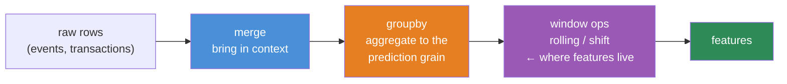
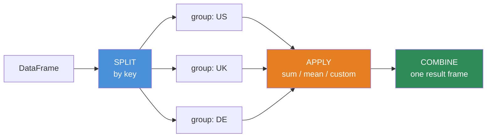
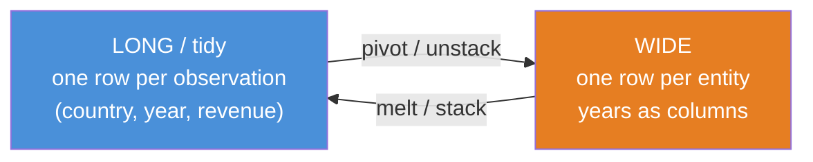
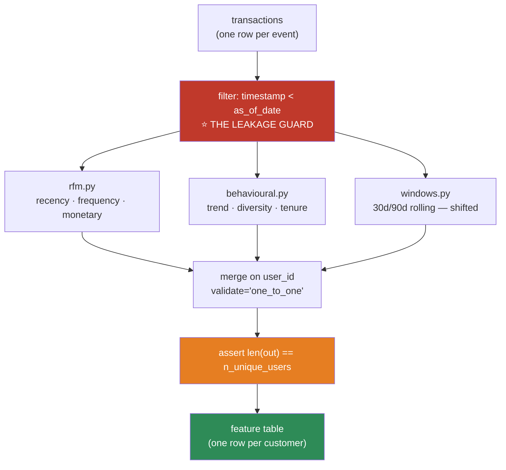

# 07.4 · Pandas II — Combining, Grouping & Time

[⬅ 07.3 Pandas I](07.3-pandas-fundamentals.md) · [🏠 Module 07](../README.md) · [➡ 07.5 Data Cleaning](07.5-data-cleaning.md)

> **The lesson in one line:** Merge, groupby, and resample are the three operations that turn raw rows into features — and each one has a specific way of silently destroying your dataset.

---

## 🎯 Learning objectives

By the end of this lesson you can:

1. Merge DataFrames correctly, and **prove** the merge did what you expected using `validate` and `indicator`.
2. Explain **row explosion** from a many-to-many join, and catch it before it eats your memory.
3. Use **split-apply-combine** fluently — and know which `groupby` idiom is fast.
4. Reshape with `pivot`, `melt`, `stack`, `unstack` without guesswork.
5. Use **window functions** (rolling, expanding, shift) to build time-aware features.
6. Handle time series correctly — including the **leakage trap** that ruins forecasting models.

---

## 🧠 Mental model

> **Three verbs do almost all analytical work: `merge` (widen), `groupby` (summarize), `resample` (retime).**

Everything in this lesson is one of those three, plus the reshaping needed to get data into the right form for them.



---

## 1 · Merging & Joining

Same semantics as SQL ([05.3](../../05-SQL/weeks/05.3-sql-fundamentals.md)), different syntax.

```python
import pandas as pd

users  = pd.DataFrame({'user_id': [1,2,3], 'name': ['Ada','Alan','Grace']})
orders = pd.DataFrame({'user_id': [1,1,2,5], 'amount': [10,20,30,40]})

pd.merge(users, orders, on='user_id', how='inner')   # only matching → 3 rows
pd.merge(users, orders, on='user_id', how='left')    # all users → Grace gets NaN
pd.merge(users, orders, on='user_id', how='outer')   # everything → user 5 appears too
```

| `how` | Keeps | Use when |
|---|---|---|
| `inner` | Only matching keys | You need both sides present |
| **`left`** | **All of the left** | ✅ **The default choice** — enrich a base table without losing rows |
| `right` | All of the right | Rare (just swap the arguments) |
| `outer` | Everything | Reconciliation, finding what's missing on each side |

### The two arguments that will save your career

```python
result = pd.merge(
    users, orders,
    on='user_id',
    how='left',
    validate='one_to_many',      # 🔒 RAISES if the assumption is violated
    indicator=True,              # 🔍 adds a _merge column: both/left_only/right_only
)
print(result['_merge'].value_counts())
# both          3
# left_only     1     ← Grace has no orders. Is that expected? NOW YOU KNOW.
```

> [!IMPORTANT]
> **`validate=` is the single most underused argument in Pandas, and it prevents the most expensive class of bug.**
>
> - `'one_to_one'` — both keys unique. Raises if not.
> - `'one_to_many'` — left key unique. **This is what you almost always mean.**
> - `'many_to_one'` — right key unique (e.g. joining a lookup table).
> - `'many_to_many'` — 💀 no guarantee. **Row explosion.**
>
> **Without `validate`, a duplicate key on both sides silently multiplies your rows.** 1,000 users × a lookup table that accidentally has 3 rows per key = 3,000 rows, every metric inflated 3×, and **no error whatsoever**. Add `validate='one_to_many'` to every merge you write. It costs nothing and it turns a silent catastrophe into a loud exception.

### Row explosion, demonstrated

```python
left  = pd.DataFrame({'k': [1, 1], 'a': ['x', 'y']})    # key 1 appears TWICE
right = pd.DataFrame({'k': [1, 1], 'b': ['p', 'q']})    # key 1 appears TWICE

print(len(pd.merge(left, right, on='k')))     # 4  ← 2 × 2 = CARTESIAN PRODUCT
```

**Two rows joined to two rows gives four.** Now imagine 100,000 duplicate keys. That's how a 2 GB merge becomes an OOM.

> [!CAUTION]
> **Always know the *grain* of your tables before you merge.** "One row per user" vs "one row per user per day" vs "one row per user per order." **A merge across mismatched grains duplicates the coarser side** — and the resulting numbers are wrong in a way that looks completely plausible. Run `df['key'].duplicated().any()` before you merge. Or just always pass `validate`.

### `merge` vs `join` vs `concat`

| | Joins on | Use for |
|---|---|---|
| `pd.merge(a, b, on='k')` | **Columns** | ✅ The general case |
| `a.join(b)` | **Indexes** | Convenience when both are indexed by the key |
| `pd.concat([a, b])` | **Nothing** — stacks | Adding **rows** (`axis=0`) or columns (`axis=1`) |

```python
pd.concat([jan, feb, mar], ignore_index=True)     # stack months. ignore_index MATTERS
```

> [!WARNING]
> **Forgetting `ignore_index=True` on concat** leaves you with duplicate index values (three rows all labelled `0`). Then `df.loc[0]` returns three rows instead of one, and downstream code that assumed a scalar breaks in a confusing place.

---

## 2 · GroupBy — split, apply, combine



```python
import pandas as pd, numpy as np

df = pd.DataFrame({
    'country': ['US','US','UK','UK','US'],
    'product': ['A','B','A','B','A'],
    'revenue': [100, 200, 80, 90, 150],
    'units':   [1, 2, 1, 1, 2],
})

df.groupby('country')['revenue'].sum()
df.groupby(['country', 'product'])['revenue'].sum()      # → MultiIndex

# ── NAMED AGGREGATION — the modern, readable way ──────────────────
summary = df.groupby('country').agg(
    total_revenue = ('revenue', 'sum'),
    avg_revenue   = ('revenue', 'mean'),
    n_orders      = ('revenue', 'size'),
    n_products    = ('product', 'nunique'),
    max_units     = ('units',   'max'),
).reset_index()
```

**Use named aggregation.** It's self-documenting, produces flat column names (no MultiIndex on the columns), and it's what you'll read in six months.

### `transform` vs `agg` vs `filter` — the three groupby modes

This distinction is what separates fluent Pandas from stumbling Pandas.

| Method | Returns | Use for |
|---|---|---|
| **`.agg()`** | **One row per group** | Summaries |
| **`.transform()`** | **Same shape as the input** ⭐ | **Broadcasting a group stat back onto every row — this is how you build features** |
| **`.filter()`** | A subset of the original **rows** | Keeping whole groups that meet a condition |

```python
# ⭐ transform — the feature-engineering workhorse
df['country_avg']   = df.groupby('country')['revenue'].transform('mean')
df['pct_of_country']= df['revenue'] / df['country_avg']
df['rank_in_country'] = df.groupby('country')['revenue'].rank(ascending=False)

# filter — keep only countries with more than 2 orders
df.groupby('country').filter(lambda g: len(g) > 2)
```

> [!IMPORTANT]
> **`transform` is the one to learn.** *"How does this row compare to its group?"* is one of the most powerful feature patterns in all of ML — customer spend vs. their segment's average, a product's price vs. its category's median, today's traffic vs. this store's baseline. **`transform` broadcasts the group statistic back to every row, in one vectorized call.** ([07.7](07.7-feature-engineering.md) is full of it.)

### GroupBy performance

```python
# ❌ SLOW — a Python function per group
df.groupby('country')['revenue'].apply(lambda g: g.sum())

# ✅ FAST — a compiled Cython aggregation
df.groupby('country')['revenue'].sum()
```

**Built-in aggregations (`sum`, `mean`, `count`, `min`, `max`, `std`, `median`, `nunique`) are implemented in Cython and are 10–100× faster than `.apply()` with an equivalent lambda.** `.apply()` should be your last resort, not your first reach.

```python
df['country'] = df['country'].astype('category')     # ← also makes groupby much faster
df.groupby('country', observed=True)['revenue'].sum()  # observed=True: skip empty categories
```

---

## 3 · Reshaping — pivot, melt, stack, unstack



```python
long = pd.DataFrame({
    'country': ['US','US','UK','UK'],
    'year':    [2023, 2024, 2023, 2024],
    'revenue': [100, 120, 80, 95],
})

# LONG → WIDE
wide = long.pivot(index='country', columns='year', values='revenue')
#          2023  2024
# country
# UK         80    95
# US        100   120

# WIDE → LONG
back = wide.reset_index().melt(id_vars='country', var_name='year', value_name='revenue')

# pivot_table — like pivot, but AGGREGATES duplicates instead of raising
pt = long.pivot_table(index='country', columns='year', values='revenue',
                      aggfunc='sum', fill_value=0, margins=True)
```

| Function | Handles duplicate index/column pairs? |
|---|---|
| **`.pivot()`** | ❌ **Raises** `ValueError` |
| **`.pivot_table()`** | ✅ Aggregates them (default `mean`) |

> [!TIP]
> **Which shape do you want?** **Long/tidy** — one row per observation — is what you want for **storage, ML, and plotting libraries** (seaborn and plotly both expect it). **Wide** is what you want for **human eyes and Excel**. Models eat long; humans read wide. **Most bugs come from being in the wrong one and not noticing.**

---

## 4 · Window Operations

**This is where time-aware features are born — and where leakage sneaks in.**

```python
import pandas as pd, numpy as np

df = pd.DataFrame({
    'date':  pd.date_range('2024-01-01', periods=10),
    'sales': [10, 12, 15, 11, 20, 22, 19, 25, 30, 28],
}).set_index('date')

df['rolling_7d']  = df['sales'].rolling(window=7).mean()       # trailing average
df['rolling_3d']  = df['sales'].rolling(3, min_periods=1).mean()
df['expanding']   = df['sales'].expanding().mean()             # all history to date
df['ewm']         = df['sales'].ewm(span=7).mean()             # exponentially weighted
df['lag_1']       = df['sales'].shift(1)                       # yesterday's value
df['change']      = df['sales'].diff()                         # today − yesterday
df['pct_change']  = df['sales'].pct_change()
```

| Operation | Meaning |
|---|---|
| `.rolling(n)` | A **fixed** trailing window of n periods |
| `.expanding()` | **All** history up to and including now |
| `.ewm(span=n)` | Exponentially decaying weights — recent matters more |
| **`.shift(k)`** | **Move values down k rows — "what was it k periods ago?"** |
| `.diff()` / `.pct_change()` | Change from the previous period |

### ⚠️ The leakage trap — read this twice

```python
# 💀 LEAKAGE — .rolling() INCLUDES the current row
df['avg_7d'] = df['sales'].rolling(7).mean()
# To predict TODAY's sales, this feature contains TODAY's sales. You cannot know it yet.

# ✅ CORRECT — shift first, so the window ends YESTERDAY
df['avg_7d'] = df['sales'].shift(1).rolling(7).mean()
```

> [!CAUTION]
> **This one line is the difference between a forecasting model that works and one that scores 0.99 in your notebook and fails completely in production.**
>
> `.rolling(7).mean()` at row *t* averages rows *t−6 … t* — **including row t itself.** If you're predicting the value at *t*, that feature contains the answer. Your model learns "the answer is roughly the average that includes the answer," gets an incredible score, and then in production the current value is *unknown by definition* and the feature is garbage.
>
> **Rule: for any time-series feature, `.shift(1)` before you window.** Then ask the [07.1](07.1-data-lifecycle.md) question — *"at prediction time, would I actually know this?"*

### Grouped windows — per-entity features

```python
# Rolling average PER USER — must group, or you'll bleed across users
df = df.sort_values(['user_id', 'date'])
df['user_avg_7d'] = (df.groupby('user_id')['sales']
                       .transform(lambda s: s.shift(1).rolling(7, min_periods=1).mean()))
```

> [!WARNING]
> **Forgetting to `groupby` before a rolling window silently mixes entities.** Row 1 of user B's window will contain the last 6 rows of user A. **No error. Completely wrong features.** And **you must `sort_values` first** — a rolling window on unsorted data is meaningless.

---

## 5 · Time Series

```python
import pandas as pd

df = pd.read_csv('sales.csv', parse_dates=['date'], index_col='date')  # ← DatetimeIndex

# ── Time slicing — only works on a DatetimeIndex ──────────────────
df['2024']                    # all of 2024
df['2024-03']                 # March
df['2024-01-15':'2024-02-01'] # a range (INCLUSIVE, it's .loc semantics)

# ── Resampling — a groupby over time ──────────────────────────────
df.resample('D').sum()        # daily
df.resample('W').mean()       # weekly
df.resample('ME').sum()       # month-end
df.resample('h').ffill()      # hourly, forward-filling gaps

# ── Extracting date parts — pure feature engineering ──────────────
df['dow']        = df.index.dayofweek         # 0=Mon
df['month']      = df.index.month
df['is_weekend'] = df.index.dayofweek >= 5
df['hour']       = df.index.hour
```

> [!IMPORTANT]
> **A `DatetimeIndex` is not cosmetic — it unlocks `.resample()`, time-based slicing, and correct handling of gaps.** If you're doing anything with time, **set the datetime as the index.** This is one of the few cases where setting an index is unambiguously worth it.

### Timezones — the thing that will bite you

```python
df.index = df.index.tz_localize('UTC')            # this naive time IS UTC
df.index = df.index.tz_convert('America/New_York') # now display it in NY time
```

> [!CAUTION]
> **Store everything in UTC. Convert only for display.** Naive datetimes (no timezone) are a bug waiting for a DST transition: **2 a.m. happens twice in the autumn and never in the spring.** A "daily aggregate" computed in local time has a 23-hour day and a 25-hour day once a year, and your model will learn a seasonal artefact that is really a clock artefact. ([03.9 Logs](../../03-Linux/weeks/03.9-logs.md) had the same lesson.)

### Filling gaps

```python
df = df.resample('D').asfreq()      # expose the gaps as NaN rows

df.ffill()                          # carry the last value forward — ✅ usually right for sensors/prices
df.bfill()                          # ⚠️ carries the FUTURE backward — LEAKAGE
df.interpolate(method='time')       # ✅ linear, respecting actual time gaps
```

> [!CAUTION]
> **`bfill()` on time-series data is leakage.** It fills a gap with a *future* value — information that did not exist at that moment. It's the exact same sin as the un-shifted rolling window, wearing a different hat. **In a time series, information may only flow forward.**

---

## ⚡ Performance considerations

| Operation | Fast way | Slow way |
|---|---|---|
| Aggregation | `.groupby().sum()` (Cython) | `.groupby().apply(lambda g: g.sum())` — **10–100×** slower |
| Group key dtype | `category` | `object` |
| Merge | Sort keys / use indexes | Repeatedly merging unsorted object keys |
| Combining frames | `pd.concat([list])` **once** | `pd.concat` in a loop — **O(n²)** |
| Rolling | Built-in `.rolling().mean()` | `.rolling().apply(lambda x: x.mean())` — 100× slower |
| Empty categories | `observed=True` | Default expands to the full cartesian product of categories 💀 |

```python
# ⚠️ A real trap: groupby on TWO categoricals without observed=True
# creates a row for EVERY combination — even ones that never occur.
# 1000 categories × 1000 categories = 1,000,000 rows from 500 real ones.
df.groupby(['cat_a', 'cat_b'], observed=True).sum()   # ← observed=True. Always.
```

---

## 🔒 Security & privacy considerations

| Concern | Note |
|---|---|
| **Aggregation is not anonymization** | A group of size 1 in a "grouped summary" **is** that person's data. `groupby('zip_code').mean()` on a rural zip reveals one household |
| **k-anonymity** | Suppress groups smaller than k (typically 5–10). `summary[summary['n'] >= 5]` |
| **Merge joins PII across systems** | A join can re-identify data that was safe in isolation (the classic: anonymized Netflix ratings + public IMDb reviews → identified users) |
| **Time series are fingerprints** | An individual's hourly activity pattern is often **uniquely identifying**, even without a user ID |
| **Rolling windows retain history** | A "7-day average" still encodes each of those 7 days' values if you have enough of them |

```python
# ✅ k-anonymity guard — refuse to publish small groups
summary = df.groupby('zip_code').agg(avg_income=('income','mean'), n=('income','size'))
safe = summary[summary['n'] >= 10]        # suppress groups < 10
```

> [!WARNING]
> **"We aggregated it, so it's anonymous" is one of the most dangerous false beliefs in data work.** If a group has one member, the aggregate *is* their record. Always enforce a minimum group size before publishing or exporting any grouped summary.

---

## ✅ Best practices

| Practice | Why |
|---|---|
| **`validate=` on every merge** | Turns a silent row explosion into a loud exception |
| **`indicator=True` when unsure** | Tells you exactly what matched and what didn't |
| **Know your grain before joining** | "One row per what?" — the question that prevents most join bugs |
| **Named aggregation** | Readable, flat column names |
| **`transform` for per-group features** | The most powerful feature pattern in ML |
| **`observed=True` on categorical groupby** | Prevents a cartesian explosion of empty categories |
| **`sort_values` before any window op** | Rolling on unsorted data is meaningless |
| **`.shift(1)` before rolling, always** | **The leakage guard** |
| **`groupby` before rolling, per entity** | Otherwise you bleed across users |
| **UTC everywhere; convert only to display** | DST will otherwise corrupt your daily aggregates |
| **Enforce a minimum group size** | Aggregation is not anonymization |

---

## 🐛 Common mistakes

| Mistake | Symptom | Fix |
|---|---|---|
| **Merge without `validate`** | Silent row explosion; every metric inflated | `validate='one_to_many'` |
| Many-to-many join | Cartesian product; OOM | Check `.duplicated()` on both keys first |
| `pd.concat` without `ignore_index=True` | Duplicate index values break `.loc` | `ignore_index=True` |
| **`.rolling()` without `.shift(1)`** | **LEAKAGE** — 0.99 offline, useless in prod | `.shift(1).rolling(n)` |
| Rolling without `groupby` | Windows bleed across entities | `groupby(...).transform(...)` |
| Window on unsorted data | Meaningless results, no error | `sort_values` first |
| **`bfill()` on a time series** | **LEAKAGE** — fills with the future | `ffill()` or `interpolate` |
| `groupby().apply(lambda)` | 10–100× slower | Use the built-in aggregation |
| Categorical groupby without `observed=True` | 1M rows from 500 real groups | `observed=True` |
| `.pivot()` with duplicate keys | `ValueError` | `.pivot_table()` |
| Naive datetimes | DST creates 23- and 25-hour days | UTC everywhere |
| Publishing groups of size 1 | **Privacy breach** | Enforce k ≥ 5–10 |

---

## 📝 Exercises

**Conceptual**
1. What is row explosion? Give a concrete example and say how `validate=` prevents it.
2. Explain the difference between `.agg()`, `.transform()`, and `.filter()` on a groupby. When do you reach for each?
3. Why is `.rolling(7).mean()` leakage in a forecasting model? Write the correct version.
4. Why is `bfill()` on time-series data leakage but `ffill()` isn't?
5. Why must you `groupby` before applying a rolling window to multi-entity data?

**Pandas exercises**
6. Build two frames with duplicate keys on both sides. Merge them. Count the rows. Now add `validate='one_to_one'` and show it raises.
7. Given orders data, compute per customer: total revenue, order count, average order value, days since last order, and **each order's percentage of that customer's total** (hint: `transform`).
8. Take a sales table (country, product, month, revenue). Produce a pivot table of revenue by country × month with row and column totals.
9. Given daily sales, engineer these features **without leakage**: 7-day trailing mean, 30-day trailing std, previous day's value, week-over-week change, and day-of-week. Prove there's no leakage by checking that every feature at row *t* uses only rows < *t*.
10. Resample hourly sensor data to daily. Handle gaps three ways (`ffill`, `interpolate`, leave as NaN) and explain when each is right.

**Data cleaning**
11. You have an events table (one row per event) and a users table (one row per user). Compute per-user features and merge them back. **Verify the row count didn't change.**
12. Given a grouped summary, write a function that enforces k-anonymity (k=10) and reports how many groups were suppressed and what fraction of the data that represents.

---

## 🛠️ Mini project — *The Customer Analytics Engine*

Build `code/07-data-analysis/customer-analytics/` — turn a raw transactions log into a per-customer feature table. **This is the single most common data task in commercial ML.**

**Requirements**
- Input: a transactions table (`user_id`, `timestamp`, `amount`, `product`, `channel`).
- Output: one row per customer, with **RFM** (Recency, Frequency, Monetary) plus behavioural features.
- **Every feature must be computed as of a specified `as_of_date`** — no future information. Ever.
- Verify the output row count equals the number of unique customers.

```
customer-analytics/
├── README.md
├── requirements.txt
├── src/
│   ├── load.py           # read + validate the transactions schema
│   ├── rfm.py            # recency, frequency, monetary
│   ├── behavioural.py    # trends, diversity, channel mix, tenure
│   ├── windows.py        # rolling/lag features — LEAKAGE-SAFE
│   └── build.py          # orchestrate → one feature table
├── tests/
│   ├── test_no_leakage.py     # ⭐ THE IMPORTANT ONE
│   └── test_grain.py          # one row per customer, exactly
└── notebooks/
    └── explore.ipynb
```

**Architecture**



**Implementation guidance**
1. **`as_of_date` is the whole design.** Every function takes it and filters `timestamp < as_of_date` **first**. This makes the leakage guard **structural** rather than something you have to remember. That's the difference between a pipeline that's safe and a pipeline that's *usually* safe.
2. **RFM** — Recency (`as_of_date − last_purchase`), Frequency (count), Monetary (sum). Forty years old, still one of the strongest feature sets in commercial ML.
3. **Behavioural** — product diversity (`nunique`), channel mix, spend trend (last 30 days vs previous 30), tenure, average inter-purchase interval.
4. **`validate='one_to_one'` on every merge**, and `assert len(features) == df['user_id'].nunique()`. **If your feature table has more rows than customers, you have a join bug** — and this assert catches it in the second you introduce it, rather than in the model review three weeks later.

**Testing strategy** — this is what makes the project worth building:
- **`test_no_leakage.py` (the important one):** construct a synthetic customer with a **huge purchase on `as_of_date + 1 day`**. Build features. **Assert that no feature value changed.** If any did, you have leakage. This single test is worth more than every other test combined, and almost nobody writes it.
- **`test_grain.py`:** assert exactly one row per customer.
- **`test_empty_customer`:** a customer with zero transactions before `as_of_date` — should produce a row of sensible nulls, not crash and not vanish.
- **Property test:** for any `as_of_date`, features must be a function only of transactions strictly before it. Run it over 20 random dates.

**Future improvements**
- Compute features at **multiple as-of dates** to build a training set with proper temporal structure (this is how you avoid the [i.i.d. violation](../../06-Mathematics/weeks/06.5-probability.md) in churn modelling).
- Add a feature-store-style interface so the **same code** serves training and inference — killing training/serving skew by construction ([07.11](07.11-pipelines.md)).
- Add drift detection between as-of dates.

---

## 📄 Cheat sheet

| Task | Code |
|---|---|
| **Merge (safely)** | `pd.merge(a, b, on='k', how='left', validate='one_to_many', indicator=True)` |
| Check the grain | `df['k'].duplicated().any()` |
| Stack rows | `pd.concat([a, b], ignore_index=True)` |
| Group + aggregate | `df.groupby('k').agg(total=('x','sum'), n=('x','size'))` |
| **Group stat onto every row** | `df.groupby('k')['x'].transform('mean')` ⭐ |
| Keep whole groups | `df.groupby('k').filter(lambda g: len(g) > 5)` |
| Categorical groupby | `.groupby('c', observed=True)` ← **always** |
| Long → wide | `df.pivot_table(index=, columns=, values=, aggfunc=)` |
| Wide → long | `df.melt(id_vars=, var_name=, value_name=)` |
| **Rolling (SAFE)** | `df['x'].shift(1).rolling(7).mean()` ⭐ |
| Rolling per entity | `df.groupby('id')['x'].transform(lambda s: s.shift(1).rolling(7).mean())` |
| Lag / change | `.shift(1)` · `.diff()` · `.pct_change()` |
| Resample | `df.resample('D').sum()` (needs a DatetimeIndex) |
| Time slice | `df['2024-03']` · `df['2024-01':'2024-06']` |
| Date parts | `df.index.dayofweek` · `.month` · `.hour` |
| Timezone | `.tz_localize('UTC').tz_convert('America/New_York')` |
| Fill gaps | `.ffill()` ✅ · `.bfill()` ⚠️ **leakage** · `.interpolate(method='time')` |

**The three leakage guards:** `.shift(1)` before rolling · `ffill` not `bfill` · filter to `< as_of_date` **first**.

---

## 🎴 Flashcards

- **Q:** What is row explosion? → **A:** A many-to-many merge produces a **cartesian product** — 2 duplicate keys × 2 duplicate keys = 4 rows. Every metric is inflated, and **no error is raised**.
- **Q:** What does `validate=` do, and why should you always use it? → **A:** It **raises** if the key uniqueness assumption is violated (`'one_to_many'`, `'one_to_one'`, …). It converts a silent row explosion into a loud exception. **The most underused argument in Pandas.**
- **Q:** `.agg()` vs `.transform()` vs `.filter()`? → **A:** `agg` → one row per group. **`transform` → same shape as the input** (broadcasts the group stat back onto every row — the feature-engineering workhorse). `filter` → keeps whole groups.
- **Q:** Why is `.rolling(7).mean()` leakage? → **A:** The window at row *t* **includes row t itself** — so a feature for predicting today contains today's value. Fix: **`.shift(1).rolling(7).mean()`**.
- **Q:** Why is `bfill()` leakage on a time series? → **A:** It fills a gap with a **future** value — information that did not exist at that moment. In a time series, information may only flow **forward**.
- **Q:** What happens if you `.rolling()` on multi-entity data without `groupby`? → **A:** The window **bleeds across entities** — user B's first rows average in user A's last rows. **Silent and completely wrong.**
- **Q:** Why `observed=True` on a categorical groupby? → **A:** Without it, Pandas produces a row for **every combination** of categories, including ones that never occur — 1000 × 1000 categories = 1M rows from 500 real groups.
- **Q:** `.pivot()` vs `.pivot_table()`? → **A:** `pivot` **raises** on duplicate index/column pairs; `pivot_table` **aggregates** them.
- **Q:** Why store datetimes in UTC? → **A:** DST means 2 a.m. happens twice in autumn and never in spring — local-time daily aggregates get 23- and 25-hour days, and the model learns a clock artefact as a seasonal signal.
- **Q:** Why is "we aggregated it, so it's anonymous" dangerous? → **A:** **A group of size 1 IS that person's record.** Enforce a minimum group size (k ≥ 5–10) before publishing any grouped summary.
- **Q:** What's the single most valuable test for a feature pipeline? → **A:** Insert a **huge transaction after `as_of_date`** and assert **no feature value changed**. That's the leakage test, and almost nobody writes it.

---

## 💼 Interview questions

1. **"You merged two tables and the row count tripled. What happened?"** — Many-to-many join on a duplicated key → cartesian product. Diagnose with `.duplicated()`; prevent with `validate=`.
2. **"Explain split-apply-combine, and when you'd use `transform` over `agg`."** — `agg` collapses to one row per group; `transform` broadcasts back to the original shape. **`transform` is how you build "this row vs. its group" features**, which are among the most predictive features in commercial ML.
3. **"You're building a demand forecasting model and it scores 0.99 offline. What's your first suspicion?"** — **Leakage**, almost certainly an un-shifted rolling window or a `bfill`. Explain the `.shift(1)` fix and the "would I know this at prediction time?" test.
4. **"How do you compute a per-customer rolling average in Pandas?"** — `df.sort_values(['id','date']).groupby('id')['x'].transform(lambda s: s.shift(1).rolling(7).mean())`. **The `sort`, the `groupby`, and the `shift` are all mandatory** — mention all three.
5. **"Your grouped report has a row with n=1. Is that a problem?"** — **Yes — it's a privacy breach.** The "aggregate" is one person's record. Enforce k-anonymity.

---

## 📚 Summary

- **Three verbs do the work: `merge` (widen), `groupby` (summarize), `resample` (retime).**
- **Always pass `validate=` to `merge`.** A many-to-many join silently produces a **cartesian product** that inflates every metric with no error. Know your **grain** — "one row per what?" — before you join.
- **`groupby` has three modes:** `agg` (one row per group), **`transform` (same shape — broadcasts a group stat onto every row)**, and `filter` (keep whole groups). **`transform` is the feature-engineering workhorse.**
- Built-in aggregations are **Cython**; `.apply(lambda)` is 10–100× slower. Use `observed=True` on categorical groupbys or you'll materialize every unused category combination.
- **Long/tidy is for models and plots; wide is for humans.** `pivot` raises on duplicates; `pivot_table` aggregates them.
- **Window operations are where features are born — and where leakage sneaks in.** `.rolling(7)` **includes the current row**, so a forecasting feature must be **`.shift(1).rolling(7)`**. And you must **`sort` and `groupby`** first, or windows bleed across entities.
- **`bfill()` on a time series is leakage** — it fills with the future. Information may only flow forward.
- **Store in UTC.** DST silently corrupts local-time daily aggregates.
- **Aggregation is not anonymization.** A group of size 1 is one person's record.

**Next:** [07.5 Data Cleaning](07.5-data-cleaning.md) — where you confront what's actually wrong with your data.

---

## 🔗 References

- McKinney — *Python for Data Analysis*, Ch. 8 (Data Wrangling) and Ch. 11 (Time Series).
- Wickham (2014) — *Tidy Data* (Journal of Statistical Software). The paper that defined long-vs-wide and why it matters. Short, and worth reading properly.
- Pandas docs — [Merge, join, concatenate](https://pandas.pydata.org/docs/user_guide/merging.html) · [GroupBy](https://pandas.pydata.org/docs/user_guide/groupby.html) · [Time series](https://pandas.pydata.org/docs/user_guide/timeseries.html).
- Narayanan & Shmatikov (2008) — *Robust De-anonymization of Large Sparse Datasets* — how the "anonymized" Netflix dataset was de-anonymized by joining it with public IMDb reviews. **Read this before you ever publish an aggregate.**
- [05.3 SQL Fundamentals](../../05-SQL/weeks/05.3-sql-fundamentals.md) — the same join semantics, in the other language you'll use for this.

---

## 🧭 Navigation

| Direction | Link |
|---|---|
| ⬅ Previous | [07.3 Pandas I](07.3-pandas-fundamentals.md) |
| ➡ Next | [07.5 Data Cleaning](07.5-data-cleaning.md) |
| 🏠 Module | [Module 07](../README.md) |
| 🗺 Roadmap | [ROADMAP.md](../../../ROADMAP.md) |
