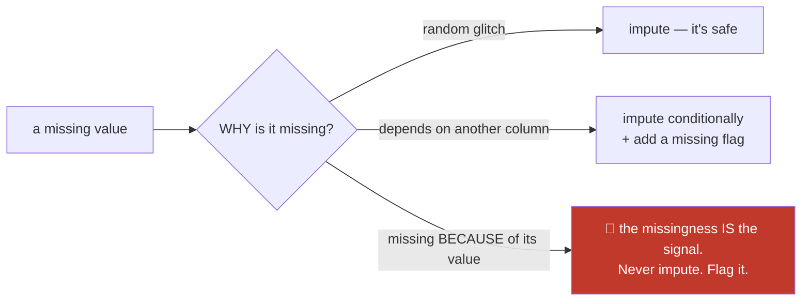
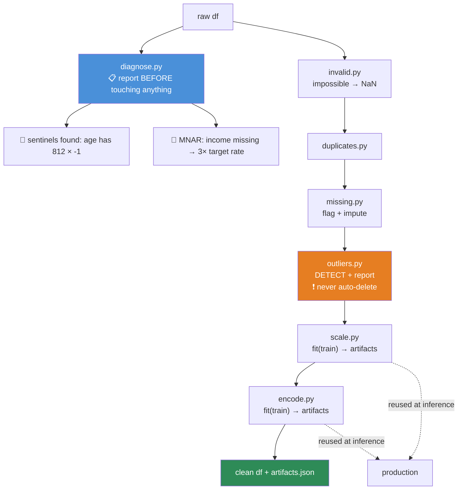

# 07.5 · Data Cleaning

[⬅ 07.4 Pandas II](07.4-pandas-advanced.md) · [🏠 Module 07](../README.md) · [➡ 07.6 EDA](07.6-eda.md)

> **The lesson in one line:** Cleaning is not "make the errors go away" — it's a series of **decisions about what the missing and the impossible actually mean**, and every one of those decisions changes what your model learns.

---

## 🎯 Learning objectives

By the end of this lesson you can:

1. Diagnose **why** data is missing (MCAR/MAR/MNAR) and choose a strategy that doesn't introduce bias.
2. Handle duplicates, invalid values, and disguised missingness (`-1`, `999`, `"N/A"`).
3. Decide whether an outlier is **an error, a rare event, or the entire point**.
4. Choose between **normalization and standardization**, and never leak the test set into either.
5. Encode categorical variables correctly — including the **high-cardinality** case.
6. Build cleaning as a **reusable, testable function**, not a pile of notebook cells.

---

## 🧠 Mental model

> **Every cleaning operation is a claim about the world. `fillna(0)` says "missing means zero." Is that true?**

Cleaning feels mechanical. It isn't. It's the stage where you encode your **assumptions** into the data — and the model will faithfully learn whatever assumption you encoded, correct or not.



---

## 1 · Missing Values

### The taxonomy that determines everything

| Type | Meaning | Example | Safe to impute? |
|---|---|---|---|
| **MCAR** — Missing Completely At Random | The missingness has no pattern | A sensor dropped a packet | ✅ Yes. Dropping is also unbiased |
| **MAR** — Missing At Random | Missingness depends on **other observed** columns | Older users skip the "income" field | 🟡 Impute **conditionally** on those columns |
| **MNAR** — Missing Not At Random | Missingness depends on **the missing value itself** | **High earners refuse to state their income** | ❌ **NO. The missingness is data.** |

> [!IMPORTANT]
> **MNAR is the one that destroys models, and it's the most common in real data.**
>
> If high earners refuse to report income, then imputing the *mean* income for them **systematically understates the rich** — and your model learns that non-response means "average," when it actually means "wealthy." You have not fixed the data; you have **encoded a lie into it**.
>
> **For MNAR, the fact that it's missing IS the signal.** Add a `income_missing` boolean feature. Very often that flag is **more predictive than the column it came from** — which tells you something profound about how much information was hiding in the gap.

### Diagnosing missingness — do this before you touch anything

```python
import pandas as pd, numpy as np

# 1 · How much, and where?
missing = pd.DataFrame({
    'n_missing': df.isna().sum(),
    'pct':       (df.isna().mean() * 100).round(1),
}).sort_values('pct', ascending=False)
print(missing[missing.n_missing > 0])

# 2 · Do columns go missing TOGETHER? (a strong hint of a systemic cause)
print(df.isna().corr())        # high correlation → they fail as a unit

# 3 · ⭐ Is the missingness related to the TARGET? (the MNAR test)
for col in df.columns[df.isna().any()]:
    rate_missing = df.loc[df[col].isna(), 'target'].mean()
    rate_present = df.loc[df[col].notna(), 'target'].mean()
    print(f"{col:20} target rate: missing={rate_missing:.3f}  present={rate_present:.3f}")
# If these differ a lot → MNAR → the missingness itself is predictive. FLAG IT.
```

> [!TIP]
> **That third check is the one that matters and the one nobody runs.** If the target rate differs sharply between rows where a column is missing and rows where it isn't, **the missingness carries signal**. Imputing destroys it. Add the flag.

### Disguised missingness — the silent killer

**Real data doesn't use `NaN`. It uses lies.**

```python
SENTINELS = [-1, -999, 999, 0, '', ' ', 'N/A', 'NA', 'null', 'NULL',
             'unknown', 'Unknown', '?', 'missing', '1900-01-01', '9999-12-31']

# Detect them: look for suspicious spikes in an otherwise smooth distribution
for col in df.select_dtypes(include='number'):
    counts = df[col].value_counts()
    top = counts.head(3)
    if top.iloc[0] > len(df) * 0.05:      # one value is >5% of the column?
        print(f"⚠️  {col}: value {top.index[0]} appears {top.iloc[0]} times "
              f"({top.iloc[0]/len(df):.1%}) — SENTINEL?")
```

> [!CAUTION]
> **A spike at exactly `-1`, `0`, or `999` in an otherwise continuous distribution is not data — it's a missing value in disguise.** And it's worse than a `NaN`, because Pandas will happily include it in `.mean()`, `.std()`, and every model you train.
>
> **This is the concrete form of the "silent data bug" from [07.1](07.1-data-lifecycle.md):** `df['age'].mean()` returns 43.7, and it's a lie, and nothing anywhere will tell you. **Always plot your distributions ([07.8](07.8-visualization.md)). The spike is visible instantly and invisible in a summary statistic.**

### Strategies

| Strategy | Code | When |
|---|---|---|
| **Drop rows** | `df.dropna(subset=['x'])` | MCAR **and** < ~5% missing. **Check you're not dropping a subgroup** |
| **Drop column** | `df.drop(columns=['x'])` | > ~60% missing and no signal in the flag |
| Mean / median | `df.x.fillna(df.x.median())` | MCAR, numeric. **Median for skewed data** |
| Mode | `df.c.fillna(df.c.mode()[0])` | Categorical |
| **Constant + flag** ⭐ | `df['x_missing'] = df.x.isna(); df.x.fillna(-1)` | ✅ **The safe default. Preserves the signal** |
| Forward fill | `df.x.ffill()` | Time series (prices, sensors). **Never `bfill`** |
| Group-wise | `df.x.fillna(df.groupby('c').x.transform('median'))` | MAR — impute conditionally |
| Model-based | `sklearn.impute.KNNImputer`, `IterativeImputer` | Complex MAR. **Fit on train only** |
| **Leave it** | — | ✅ **XGBoost/LightGBM handle NaN natively and learn the best split for it** |

```python
# ⭐ The pattern that's right more often than any other
for col in ['income', 'last_login', 'credit_score']:
    df[f'{col}_missing'] = df[col].isna().astype(int)      # 1 · preserve the signal
    df[col] = df[col].fillna(df[col].median())             # 2 · then impute
```

> [!WARNING]
> **`df.dropna()` with no arguments drops every row with a null in *any* column.** On a wide table, that can silently delete 80% of your data — and the rows it deletes are **not a random sample** (they're the rows with incomplete records, which are systematically different). **Always pass `subset=`.** This one-liner has destroyed more datasets than any other in Pandas.

---

## 2 · Duplicates

```python
print(f"exact duplicate rows: {df.duplicated().sum()}")

# Business-key duplicates — the ones that actually matter
print(f"duplicate user_ids: {df.duplicated(subset=['user_id']).sum()}")

# Keep the most recent record per key
df = df.sort_values('updated_at').drop_duplicates(subset=['user_id'], keep='last')
```

**Fuzzy duplicates** — the hard, real case:

```python
# "John Smith" / "john smith " / "JOHN SMITH" are three rows and one person
df['name_key'] = (df['name'].str.lower()
                            .str.strip()
                            .str.replace(r'[^a-z ]', '', regex=True)
                            .str.replace(r'\s+', ' ', regex=True))
print(df.duplicated(subset=['name_key']).sum())
```

> [!IMPORTANT]
> **Ask *why* the duplicates exist before you delete them.** A duplicate row might be: a **pipeline retry** (delete it), a **legitimate repeat event** — a customer really did buy twice (**keep it!**), a **join gone wrong** ([07.4](07.4-pandas-advanced.md) — fix the join, not the data), or a **slowly-changing dimension** where you should keep the latest.
>
> **`drop_duplicates()` on a table where repeats are legitimate silently deletes real revenue.** Understand the grain first.

---

## 3 · Invalid Values

**Values that are structurally impossible.** These are always errors, and they're always worth hunting.

```python
import pandas as pd, numpy as np

RULES = {
    'age':        lambda s: s.between(0, 120),
    'price':      lambda s: s >= 0,
    'pct':        lambda s: s.between(0, 100),
    'email':      lambda s: s.str.contains(r'^[^@]+@[^@]+\.[^@]+$', na=False, regex=True),
    'birth_date': lambda s: s < pd.Timestamp.now(),
}

for col, rule in RULES.items():
    if col in df.columns:
        bad = ~rule(df[col]) & df[col].notna()
        if bad.any():
            print(f"🚨 {col}: {bad.sum()} invalid values — e.g. {df.loc[bad, col].head(3).tolist()}")
```

| Category | Examples |
|---|---|
| **Impossible range** | age = −5 or 200; price < 0; percentage = 150 |
| **Impossible date** | Birth date in the future; `order_date > ship_date` |
| **Bad format** | Malformed emails, phone numbers, postcodes |
| **Broken referential integrity** | `user_id` that doesn't exist in the users table |
| **Inconsistent units** | Some rows in kg, some in lbs. **Devastating and invisible** |
| **Cross-field contradiction** | `age = 12` and `has_drivers_license = True` |

> [!CAUTION]
> **Mixed units are the most dangerous invalid-value class, because nothing is individually "invalid."** A weight column where 30% of rows are in pounds and 70% in kilograms contains **no impossible values** — every number is plausible. It will pass every range check. And your model will learn nothing but noise. The only defence is **plotting the distribution** (you'll see two humps) and knowing your data's provenance.

**What to do with invalid values:** **Convert them to `NaN`, then treat them as missing.** Never "correct" them by guessing — you don't know what a `-5` age was supposed to be.

```python
df.loc[~df['age'].between(0, 120), 'age'] = np.nan     # invalid → missing
```

---

## 4 · Outliers

> [!IMPORTANT]
> **The critical question is not "how do I remove outliers?" It is "is this an error, a rare event, or the entire point?"**
>
> - **Fraud detection:** the outliers **are the target**. Removing them removes your positive class.
> - **Sensor data:** a −40°C reading in July is a broken sensor. Remove it.
> - **Income:** a billionaire is real. Don't delete them — but don't let them dominate your loss either ([06.7](../../06-Mathematics/weeks/06.7-optimization.md): MSE squares the error, so one outlier can contribute 900× the loss).
>
> **Deleting outliers by default is one of the most common and most damaging habits in data science.**

### Detection

```python
import numpy as np

# ── IQR method — robust, no distributional assumption ✅ ───────────
q1, q3 = df['x'].quantile([0.25, 0.75])
iqr = q3 - q1
lo, hi = q1 - 1.5*iqr, q3 + 1.5*iqr
outliers_iqr = (df['x'] < lo) | (df['x'] > hi)

# ── Z-score — assumes normality ⚠️ ────────────────────────────────
z = (df['x'] - df['x'].mean()) / df['x'].std()
outliers_z = z.abs() > 3

# ── Modified Z-score (MAD) — robust ✅ ─────────────────────────────
med = df['x'].median()
mad = (df['x'] - med).abs().median()
outliers_mad = (0.6745 * (df['x'] - med) / mad).abs() > 3.5
```

| Method | Assumes | Robust? | Use |
|---|---|---|---|
| **IQR (1.5×)** | Nothing | ✅ Yes | ✅ **The default** |
| Z-score (>3σ) | **Normality** | ❌ **No** | Only for genuinely normal data |
| **MAD** | Nothing | ✅ Yes | Skewed data |
| Isolation Forest | Nothing | ✅ | Multivariate outliers |

> [!WARNING]
> **The Z-score method is self-defeating on data that has outliers**, which is exactly when you'd use it. The outlier **inflates the standard deviation it's being compared against**, so extreme values hide themselves. One value of 1,000,000 in a column of ~50s can have a z-score under 3 — because it single-handedly dragged σ up to 300,000. **Use IQR or MAD**, which are built on medians and don't move.

### Treatment

| Strategy | Code | When |
|---|---|---|
| **Investigate** ⭐ | Look at the actual rows | ✅ **Always do this first** |
| Remove | `df[~outliers]` | Confirmed data errors only |
| **Cap / winsorize** | `df.x.clip(lo, hi)` | Keep the row, limit the influence |
| **Log transform** | `np.log1p(df.x)` | ✅ Right-skewed data (income, prices, counts) |
| Bin | `pd.qcut(df.x, 10)` | Turn the magnitude into a rank |
| **Keep** | — | ✅ **Fraud, anomaly detection — they're the signal** |
| Robust model | Huber loss, tree models | Trees are naturally outlier-resistant |

```python
# ⭐ log1p — the single most useful transform for skewed data
# (log1p = log(1+x), so it handles zeros gracefully)
df['income_log'] = np.log1p(df['income'])
print(f"skew before: {df['income'].skew():.2f}")        # 4.8 — severely skewed
print(f"skew after : {df['income_log'].skew():.2f}")    # 0.3 — nearly normal ✅
```

---

## 5 · Normalization vs Standardization

**Different features live on wildly different scales.** Age (0–100), income (0–1,000,000), and a boolean (0–1) are not comparable — and any algorithm that uses **distances** or **gradients** will be dominated by the largest-scale feature.

| Method | Formula | Output range | Use when |
|---|---|---|---|
| **Standardization** (z-score) | $(x - \mu) / \sigma$ | mean 0, std 1 | ✅ **The default.** Roughly normal data; linear models, SVM, PCA, NNs |
| **Min-Max normalization** | $(x - \min)/(\max - \min)$ | [0, 1] | Bounded data; neural net inputs; images. **⚠️ Destroyed by one outlier** |
| **Robust scaling** | $(x - \text{median}) / \text{IQR}$ | ~[-1, 1] | ✅ **Data with outliers** |
| **Log** | $\log(1+x)$ | — | Right-skewed (income, counts) |
| **None** | — | — | ✅ **Tree models (RF, XGBoost) don't care about scale at all** |

```python
import numpy as np

# The formulas — implement once so you understand them (06.6)
z_score  = (X - X.mean(axis=0)) / X.std(axis=0)
min_max  = (X - X.min(axis=0)) / (X.max(axis=0) - X.min(axis=0))
robust   = (X - np.median(X, axis=0)) / (np.percentile(X,75,axis=0) - np.percentile(X,25,axis=0))
```

### 🚨 The leakage rule — the most important paragraph in this lesson

```python
# 💀 CATASTROPHIC — the test set's mean and std leak into the training data
X_scaled = (X - X.mean()) / X.std()          # computed over EVERYTHING
X_train, X_test = train_test_split(X_scaled)

# ✅ CORRECT — fit on train ONLY, then apply those parameters to test
X_train, X_test = train_test_split(X)
mu, sigma = X_train.mean(), X_train.std()    # ← learned from TRAIN only
X_train_s = (X_train - mu) / sigma
X_test_s  = (X_test  - mu) / sigma           # ← same mu, sigma. Never recomputed.
```

> [!CAUTION]
> **Fit the scaler on the training set. Only. Ever.**
>
> If you compute the mean over the full dataset, the test set's values influenced that mean — so information from your test set has entered your training data. Your evaluation is now optimistic and **you no longer know how good your model is.**
>
> **And the same parameters must be saved and shipped to production.** At inference time you have *one* row; you cannot compute a mean. If serving recomputes the scaling on live data, you have **training/serving skew** ([07.1](07.1-data-lifecycle.md)). **The fitted μ and σ are model artifacts — version them alongside the weights.** This is exactly what `sklearn`'s `fit`/`transform` split exists to enforce, and exactly why [07.11](07.11-pipelines.md) exists.

---

## 6 · Encoding Categorical Data

Models need numbers. Categories are not numbers.

| Encoding | How | Use when | Danger |
|---|---|---|---|
| **One-hot** | One binary column per category | ✅ **Nominal, low cardinality (< ~15)** | Explodes with high cardinality |
| **Ordinal / label** | Map to 0,1,2,3… | ✅ **Genuinely ordered** (S < M < L) | ❌ **Invents a false order** if nominal |
| **Target / mean** | Replace with the mean target for that category | High cardinality, tree models | 🚨 **LEAKAGE** unless done with CV |
| **Frequency** | Replace with the category's count | High cardinality, cheap | Loses identity |
| **Hashing** | Hash to N buckets | Very high cardinality, streaming | Collisions |
| **Embeddings** | Learn a dense vector | Very high cardinality, NNs | Needs a NN |
| **Leave as `category`** | — | ✅ **LightGBM/CatBoost handle it natively** | — |

```python
import pandas as pd

# One-hot — nominal, low cardinality
pd.get_dummies(df, columns=['country'], drop_first=True, dtype=int)

# Ordinal — ONLY when there's a real order
size_map = {'S': 0, 'M': 1, 'L': 2, 'XL': 3}
df['size_enc'] = df['size'].map(size_map)

# Frequency — high cardinality, no leakage
df['city_freq'] = df['city'].map(df['city'].value_counts(normalize=True))
```

> [!WARNING]
> **Label-encoding a nominal variable invents an ordering that isn't there.** `{'red': 0, 'green': 1, 'blue': 2}` tells a linear model that **green is between red and blue**, and that **blue is twice green**. It's nonsense, and the model will faithfully learn the nonsense.
>
> **Trees can partially cope** (they can split around it), **but linear models, SVMs, and neural networks cannot.** One-hot is the correct default for nominal categories.

### Target encoding — powerful and dangerous

```python
# 💀 LEAKAGE — each row's encoding includes ITS OWN target
df['city_enc'] = df.groupby('city')['target'].transform('mean')

# ✅ Out-of-fold target encoding — the row's own target is excluded
from sklearn.model_selection import KFold
df['city_enc'] = np.nan
for tr, va in KFold(5, shuffle=True, random_state=0).split(df):
    means = df.iloc[tr].groupby('city')['target'].mean()
    df.loc[df.index[va], 'city_enc'] = df.iloc[va]['city'].map(means)
df['city_enc'] = df['city_enc'].fillna(df['target'].mean())   # unseen cities
```

> [!CAUTION]
> **Naive target encoding leaks the target into the features.** For a category with one member, `groupby.transform('mean')` gives that row **its own label**. The model achieves perfect training accuracy by reading the answer out of the feature, and then fails completely on new data. **Always use out-of-fold encoding, and add smoothing for rare categories.**

### The unseen-category problem

```python
# Training data has cities: [NYC, LA, Chicago]
# Production sends: "Austin"

# ❌ get_dummies at inference → different column count → the model CRASHES
# ✅ Save the training columns; reindex at inference
TRAIN_COLS = X_train.columns.tolist()          # ← a MODEL ARTIFACT. Version it.
X_new = pd.get_dummies(new_df).reindex(columns=TRAIN_COLS, fill_value=0)
```

**This is why you use `sklearn`'s `OneHotEncoder(handle_unknown='ignore')` in a pipeline, not `pd.get_dummies`.** `get_dummies` is fine for exploration and **wrong for production** — it has no memory of what the training columns were.

---

## ⚡ Performance considerations

| Operation | Fast | Slow |
|---|---|---|
| Detect nulls | `df.isna().sum()` | Looping |
| Replace values | `.map(dict)` or `np.where` | `.apply(lambda)` — 50× slower |
| String cleaning | `.str.lower().str.strip()` | `.apply(str.lower)` |
| Clip outliers | `.clip(lo, hi)` | Boolean mask + assign |
| Cleaning a big file | **Chunked, or Polars/Dask** | Loading 50 GB into RAM |
| One-hot on high cardinality | Hashing or `category` | 10,000 dummy columns |

> [!TIP]
> **One-hot encoding a 10,000-category column creates 10,000 columns** — mostly zeros, and it will exhaust your memory. Use `scipy.sparse` matrices (which sklearn's encoder returns by default), frequency/target encoding, or a model that handles categoricals natively (LightGBM, CatBoost).

---

## 🔒 Security & privacy considerations

| Concern | Note |
|---|---|
| **Imputation can *create* PII** | Imputing a missing salary with a group mean assigns a plausible salary to a real, named person. It looks like their data, and it isn't |
| **Target encoding leaks the target** | If the target is sensitive (medical, financial), a target-encoded feature **is a proxy for it** — and it travels wherever the features travel |
| **Outlier removal can erase a minority group** | The "outliers" in your data may be an underrepresented population. **Removing them removes them from your model's world**, and the model will fail them in production |
| **Deduplication merges identities** | Fuzzy-matching "John Smith" rows can merge two *different* people |
| **Cleaning logs leak values** | `print(f"dropping invalid email {row['email']}")` writes PII into your logs, where it lives forever |
| **Sensitive attributes have proxies** | Removing `race` doesn't remove race — zip code, name, and browsing history reconstruct it |

> [!WARNING]
> **Outlier removal is a fairness issue and almost nobody treats it as one.** If your training data is 95% one demographic, members of the other 5% may look statistically "unusual" on several features — and a naive IQR filter **removes them**. The model is then trained on a world that doesn't contain them, and it performs terribly for them in production. **Always check the demographic composition of the rows you're about to delete.** That check takes one line and prevents a category of harm that's very hard to detect after the fact.

---

## ✅ Best practices

| Practice | Why |
|---|---|
| **Diagnose before you clean** | Understand *why* it's missing before deciding what to do |
| **Check missingness against the target** | The MNAR test. If it differs, the missingness is a feature |
| **Add a missing-indicator flag** | Often more predictive than the imputed column |
| **Hunt for sentinels** (`-1`, `999`, `"N/A"`) | The most common silent data bug |
| **Convert invalid → NaN**, don't guess a fix | You don't know what a `-5` age was meant to be |
| **Investigate outliers before deleting** | Error, rare event, or the entire point? |
| **IQR/MAD, not z-score** | The z-score is inflated by the very outliers you're hunting |
| **Fit scalers on TRAIN ONLY** | And save μ, σ as model artifacts |
| **One-hot for nominal, ordinal only for ordered** | Label-encoding a nominal invents a false order |
| **Out-of-fold target encoding** | Naive target encoding leaks the label |
| **Cleaning is a function, not notebook cells** | It must run identically in training and in production |
| **Log every cleaning decision** | *"Dropped 412 rows (0.4%): age out of range."* Reproducibility and auditability |

---

## 🐛 Common mistakes

| Mistake | Consequence |
|---|---|
| **`df.dropna()` with no `subset`** | Silently deletes 80% of a wide table — and not at random |
| **`fillna(0)` reflexively** | "Missing income" becomes "earns nothing." A lie the model learns |
| Imputing MNAR data | **Destroys the signal** that was hiding in the gap |
| Missing the sentinels | `-1` becomes a valid age; every statistic is wrong |
| **Deleting outliers by default** | You may have just deleted your fraud cases, or a minority group |
| **Z-score outlier detection** | Extreme values inflate σ and hide themselves |
| **Fitting the scaler on all data** | **Leakage.** Your evaluation is now meaningless |
| Not saving the scaler's μ, σ | **Training/serving skew** at inference |
| Label-encoding a nominal variable | Invents a false ordering the model dutifully learns |
| **Naive target encoding** | Leaks the target. Perfect train score, useless model |
| `pd.get_dummies` in production | Unseen categories → different column count → crash |
| Cleaning in a notebook only | Not reproducible; can't run in production |

---

## 📝 Exercises

**Conceptual**
1. Explain MCAR, MAR, and MNAR with an example each. Which one must you **never** impute, and why?
2. Why is `fillna(0)` on an income column often a serious bug?
3. Why is the z-score a poor outlier detector? Construct a numerical example where a value of 1,000,000 has |z| < 3.
4. Why must a scaler be fit on the training set only? What breaks if you don't — in evaluation, and in production?
5. Why does label-encoding a nominal variable hurt a linear model but only partly hurt a tree?

**Data cleaning tasks**
6. Load a dataset. Produce a missingness report: count, %, and the **target rate for missing vs present** for each column. Identify which columns are MNAR.
7. Write `find_sentinels(df)` that detects disguised missing values by looking for suspicious frequency spikes. Test it on data where you planted `-1` and `999`.
8. Given an income column with skew 4.8, apply `log1p`. Report the skew before and after. Plot both.
9. Implement outlier detection three ways (IQR, z-score, MAD) on a skewed column. **Explain why they disagree.**
10. Take a dataset with a `city` column (500 unique values). Encode it four ways (one-hot, frequency, out-of-fold target, hashing). Compare the resulting feature-matrix size and discuss the trade-offs.
11. Demonstrate the target-encoding leak: encode naively, train a model, and show it achieves near-perfect training accuracy. Then do it out-of-fold and show the honest score.
12. Write a `clean(df)` function that is **idempotent** — `clean(clean(df))` must equal `clean(df)`. Test it.

**Analysis**
13. You're about to remove 800 outlier rows. Before you do, group them by every demographic column you have and compare against the full dataset. **Report what you find.** (This exercise is the point.)

---

## 🛠️ Mini project — *The Data Cleaning Toolkit*

Build `code/07-data-analysis/cleaning-toolkit/` — a reusable, tested cleaning library. **Not a notebook.**

**Requirements**
- Every cleaning step is a **pure function**: `df → (df, report)`.
- Every step is **idempotent**: running it twice equals running it once.
- Every step **logs what it did** and how many rows/values it touched.
- Fitted parameters (medians, scalers, category maps) are **saved as artifacts** for reuse at inference.

```
cleaning-toolkit/
├── README.md
├── requirements.txt
├── src/
│   ├── diagnose.py       # missingness report, sentinel detection, MNAR test
│   ├── missing.py        # strategies + the flag pattern
│   ├── duplicates.py     # exact + fuzzy
│   ├── invalid.py        # rule-based validation → NaN
│   ├── outliers.py       # IQR, MAD, isolation forest — DETECT, don't auto-delete
│   ├── scale.py          # fit/transform split — LEAKAGE-SAFE
│   ├── encode.py         # one-hot, ordinal, frequency, out-of-fold target
│   ├── artifacts.py      # save/load the fitted parameters
│   └── pipeline.py       # compose steps; emit a full report
├── tests/
│   ├── test_idempotent.py     # ⭐ clean(clean(df)) == clean(df)
│   ├── test_no_leakage.py     # ⭐ scaler fit on train only
│   └── test_fairness.py       # ⭐ outlier removal doesn't erase a subgroup
└── examples/
    └── messy.csv
```

**Architecture**



**Implementation guidance**
1. **`diagnose.py` runs first and touches nothing.** It produces the report that tells you *what to do* — including the MNAR test and the sentinel hunt. **Most cleaning bugs are decided before any code runs**, so make the diagnosis a first-class artifact.
2. **`outliers.py` detects and reports; it does NOT delete by default.** Deleting must be an explicit, deliberate call. **Make the dangerous thing require typing.**
3. **`artifacts.py` is what makes this production code rather than notebook code.** Every fitted parameter — medians, μ/σ, category maps, one-hot columns — gets saved. At inference you **load** them; you never **refit**. This is the structural fix for training/serving skew.
4. **`pipeline.py` composes steps and emits a report:** *"Dropped 412 rows (0.4%) — age out of range. Imputed 1,203 income values with median 52,000 and added `income_missing`. Detected 89 outliers in `amount` (kept, flagged)."* **That report is what you show a reviewer**, and it's what saves you six months later when someone asks "why is this number different?"

**Testing strategy** — the three tests that make this worth building:
- **`test_idempotent.py`:** `assert clean(clean(df)).equals(clean(df))`. **A cleaning function that isn't idempotent will corrupt your data on a pipeline retry** ([05.10](../../05-SQL/weeks/05.10-etl-elt.md)).
- **`test_no_leakage.py`:** fit the scaler on train, then assert the transform of the test set uses the **train's** μ and σ — not its own. Concretely: change a value in the test set and assert the *scaler parameters* don't change.
- **`test_fairness.py`:** after outlier removal, assert the demographic distribution of the removed rows is not significantly different from the population. **If it is, fail the build.** This test is unusual, it is correct, and it will one day save you from shipping a discriminatory model.

**Future improvements**
- Emit a `pandera` schema from `diagnose.py` — turning the analysis into an enforceable contract ([07.9](07.9-data-quality.md)).
- Add a `--dry-run` mode that reports what *would* change without changing it.
- Track the report across runs to detect **drift in data quality** (a sudden jump in nulls is an upstream incident).

---

## 📄 Cheat sheet

| Task | Code |
|---|---|
| Missingness report | `df.isna().mean().sort_values(ascending=False)` |
| **MNAR test** | Compare `df[df.x.isna()].target.mean()` vs `df[df.x.notna()].target.mean()` |
| **The safe default** | `df['x_missing'] = df.x.isna(); df.x = df.x.fillna(df.x.median())` |
| Drop (carefully) | `df.dropna(subset=['x'])` ← **never bare `dropna()`** |
| Group-wise impute | `df.x.fillna(df.groupby('c').x.transform('median'))` |
| Time series | `.ffill()` ✅ · `.bfill()` ⚠️ **leakage** |
| Duplicates | `df.duplicated(subset=['id']).sum()` · `.drop_duplicates(subset=['id'], keep='last')` |
| Invalid → NaN | `df.loc[~df.age.between(0,120), 'age'] = np.nan` |
| **Outliers (IQR)** | `q1,q3 = df.x.quantile([.25,.75]); iqr=q3-q1; lo,hi = q1-1.5*iqr, q3+1.5*iqr` |
| Cap | `df.x.clip(lo, hi)` |
| **Skew fix** | `np.log1p(df.x)` |
| **Standardize** | `(x - μ_train) / σ_train` ← **train's params. always.** |
| Robust scale | `(x - median) / IQR` |
| One-hot | `pd.get_dummies(df, columns=['c'], drop_first=True)` (exploration only) |
| Frequency encode | `df.c.map(df.c.value_counts(normalize=True))` |
| **Target encode** | **Out-of-fold only.** Naive = leakage |

**The three rules:** **Diagnose before cleaning** · **Fit on train only** · **Investigate outliers, don't delete them**

---

## 🎴 Flashcards

- **Q:** MCAR vs MAR vs MNAR? → **A:** MCAR = no pattern (safe to impute). MAR = depends on *other observed* columns (impute conditionally). **MNAR = depends on the missing value itself** (e.g. high earners hide income) — **never impute; the missingness IS the signal**.
- **Q:** How do you test for MNAR? → **A:** Compare the **target rate** for rows where the column is missing vs present. If they differ sharply, the missingness is predictive. **Almost nobody runs this check.**
- **Q:** What's wrong with `fillna(0)` on income? → **A:** It says "missing means earns nothing" — a lie the model will faithfully learn. Use median + a **missing flag**.
- **Q:** Why is bare `df.dropna()` dangerous? → **A:** It drops every row with a null in **any** column — potentially 80% of a wide table — and the dropped rows are **not a random sample**. Always pass `subset=`.
- **Q:** What is disguised missingness? → **A:** `-1`, `999`, `"N/A"`, `""` — missing values that Pandas treats as real data, silently poisoning every statistic. **Look for a frequency spike in an otherwise smooth distribution.**
- **Q:** Why is the z-score a bad outlier detector? → **A:** The outlier **inflates the σ it's compared against**, so extreme values hide themselves. Use **IQR or MAD** (median-based, robust).
- **Q:** Should you remove outliers? → **A:** **Investigate first.** Error → remove. Rare-but-real (a billionaire) → cap, log-transform, or use a robust loss. **Fraud/anomaly detection → they ARE the target.**
- **Q:** Why is outlier removal a fairness issue? → **A:** Members of an underrepresented group may look statistically "unusual," so a naive filter **deletes them** — and the model then fails them in production.
- **Q:** Standardization vs normalization vs robust scaling? → **A:** Standardize `(x−μ)/σ` = the default. Min-max `[0,1]` = bounded data, **destroyed by one outlier**. Robust `(x−median)/IQR` = when outliers exist. **Trees need none of it.**
- **Q:** State the scaling leakage rule. → **A:** **Fit the scaler on TRAIN only**, apply those saved μ, σ to test and to production. Fitting on all data leaks the test set; refitting at inference causes training/serving skew.
- **Q:** Why is label-encoding a nominal variable wrong? → **A:** It invents an order: `{red:0, green:1, blue:2}` tells a linear model green is *between* red and blue. Use **one-hot** for nominal.
- **Q:** Why is naive target encoding catastrophic? → **A:** `groupby.transform('mean')` gives each row **its own target** (exactly, for a category of size 1). Perfect training score, useless model. **Use out-of-fold.**

---

## 💼 Interview questions

1. **"How do you handle missing data?"** — Do **not** say "fillna with the mean." Say: *"It depends on why it's missing"* — then give MCAR/MAR/MNAR, describe the **target-rate test** for MNAR, and mention the **missing-indicator flag**. This answer alone puts you in the top decile.
2. **"Should you remove outliers?"** — Another trap. *"Depends on whether it's an error, a rare event, or the target."* Mention that in fraud detection **the outliers are the positive class**, and that outlier removal can erase a demographic subgroup.
3. **"You standardized your features and your model's test score is suspiciously high. What might have happened?"** — **Leakage**: the scaler was fit on the full dataset, so the test set's statistics entered training.
4. **"How would you encode a categorical variable with 10,000 unique values?"** — Not one-hot (10,000 columns). Frequency encoding, out-of-fold target encoding, hashing, embeddings, or a model with native categorical support (LightGBM/CatBoost).
5. **"Your `age` column has a mean of 43 but you think something's wrong. Walk me through your check."** — `describe()`, **plot the distribution**, look for a spike at `-1`/`0`/`999`, check the min and max, check the dtype. **The spike is invisible in a summary statistic and obvious in a histogram.**
6. **"Why must cleaning be a function rather than notebook cells?"** — It has to run **identically** in training and in production, or you get training/serving skew. And it has to be testable and reproducible.

---

## 📚 Summary

- **Every cleaning operation is a claim about the world.** `fillna(0)` asserts "missing means zero." Usually that's a lie the model then learns.
- **Diagnose before you clean.** MCAR (impute freely), MAR (impute conditionally), **MNAR (never impute — the missingness IS the signal)**. Test for MNAR by comparing the **target rate for missing vs present** rows.
- **The safe default for missing values: add a flag, then impute.** The flag is frequently more predictive than the column.
- **Hunt for disguised missingness** — `-1`, `999`, `"N/A"`. A frequency spike in a smooth distribution is a sentinel, not data. This is the silent bug that makes `df['age'].mean()` a lie.
- **Never bare `df.dropna()`.** It deletes rows non-randomly and can wipe out most of a wide table.
- **Outliers: investigate, don't delete.** Error → remove. Real-but-extreme → cap or `log1p`. **Fraud → they're your target.** Use **IQR/MAD**, not the z-score (which is inflated by the very outliers it's hunting). And **check that you're not deleting a demographic group.**
- **Fit scalers on the TRAINING set only**, and **save μ and σ as model artifacts**. Fitting on all data is leakage; refitting at inference is training/serving skew.
- **One-hot for nominal, ordinal only for genuinely ordered.** Label-encoding a nominal variable invents a false order. **Naive target encoding leaks the label** — always go out-of-fold.
- **Cleaning is a tested, idempotent function** — not a pile of notebook cells. It must run identically in training and production.

**Next:** [07.6 Exploratory Data Analysis](07.6-eda.md) — now that the data is trustworthy, let's find out what's *in* it.

---

## 🔗 References

- Little & Rubin — *Statistical Analysis with Missing Data* — where MCAR/MAR/MNAR come from. Skim the taxonomy; skip the theory.
- van Buuren — *Flexible Imputation of Missing Data* (free online). The definitive practical treatment.
- scikit-learn docs — [Preprocessing](https://scikit-learn.org/stable/modules/preprocessing.html) and [Imputation](https://scikit-learn.org/stable/modules/impute.html). Note how the API **enforces** fit-on-train — that's not an accident.
- Micci-Barreca (2001) — *A Preprocessing Scheme for High-Cardinality Categorical Attributes* — the origin of target encoding, and the smoothing that makes it safe.
- Barocas, Hardt & Narayanan — *Fairness and Machine Learning* (free at fairmlbook.org) — on how preprocessing decisions become fairness decisions.
- [06.6 Statistics](../../06-Mathematics/weeks/06.6-statistics.md) — the mean/median/percentile reasoning behind every choice in this lesson.

---

## 🧭 Navigation

| Direction | Link |
|---|---|
| ⬅ Previous | [07.4 Pandas II](07.4-pandas-advanced.md) |
| ➡ Next | [07.6 EDA](07.6-eda.md) |
| 🏠 Module | [Module 07](../README.md) |
| 🗺 Roadmap | [ROADMAP.md](../../../ROADMAP.md) |
