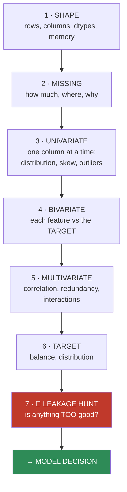
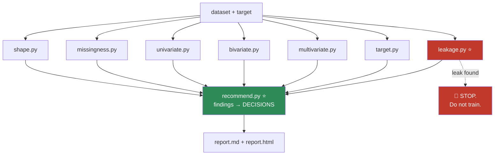

# 07.6 · Exploratory Data Analysis

[⬅ 07.5 Data Cleaning](07.5-data-cleaning.md) · [🏠 Module 07](../README.md) · [➡ 07.7 Feature Engineering](07.7-feature-engineering.md)

> **The lesson in one line:** EDA is not "making some charts" — it is the systematic interrogation of a dataset that tells you which model to reach for, which features to build, and which of your assumptions are wrong.

---

## 🎯 Learning objectives

By the end of this lesson you can:

1. Run a **systematic EDA** — not an ad-hoc one — and know what you're looking for at each step.
2. Read **skewness and kurtosis** and act on them.
3. Use **correlation** correctly, and know exactly what it cannot see.
4. Recognize **class imbalance** and understand what it does to your metrics.
5. Explain how EDA findings **determine model selection**.
6. Detect **leakage** during EDA — before you waste a week training on it.

---

## 🧠 Mental model

> **EDA answers four questions, in order: What's in here? What's broken? What predicts the target? And what's about to fool me?**



**Most people do steps 1 and 3 and stop.** Steps 4, 6, and **7** are where the value is.

---

## 1 · Descriptive Statistics

```python
import pandas as pd, numpy as np

df.info()                        # ← always first (07.3)
df.describe()                    # numeric summary
df.describe(include='object')    # categorical summary
df.describe(percentiles=[.01, .05, .25, .5, .75, .95, .99])   # ← the tails matter
```

> [!IMPORTANT]
> **`describe()` shows the mean, and the mean lies** ([06.6](../../06-Mathematics/weeks/06.6-statistics.md)).
>
> A revenue column with mean $2,400 and median $85 is not a dataset with a $2,400 typical customer — it's a dataset with one whale. **Always look at the median next to the mean.** If they diverge, the data is skewed, and every model that assumes symmetry is about to underperform.
>
> **And always print the 1st and 99th percentiles.** `describe()`'s default min/max show you the two most extreme values — which are usually errors. The 1st/99th percentiles show you the *real* range.

### The diagnostic that takes one line

```python
# The mean/median ratio — an instant skew detector
summary = df.describe().T
summary['median'] = df.median(numeric_only=True)
summary['mean_median_ratio'] = summary['mean'] / summary['median']
print(summary[['mean', 'median', 'mean_median_ratio', 'std']].sort_values(
      'mean_median_ratio', ascending=False))
# A ratio far from 1.0 → heavy skew → consider log1p
```

---

## 2 · Distribution Analysis

### Skewness — asymmetry

$$\text{skew} = \mathbb{E}\left[\left(\frac{X-\mu}{\sigma}\right)^3\right]$$

| Skew | Shape | Common in | Do |
|---|---|---|---|
| **≈ 0** | Symmetric | Heights, measurement error | Nothing |
| **> +1** | **Right/positive** — a long right tail | 💰 **Income, prices, counts, durations, "time until…"** | ✅ **`log1p`** |
| **< −1** | Left/negative — a long left tail | Exam scores, age at death | `x²` or a reflected log |

**Rule of thumb:** |skew| > 1 is substantial; > 2 is severe.

```python
import numpy as np

print(df['income'].skew())        # 4.8  → severely right-skewed
df['income_log'] = np.log1p(df['income'])
print(df['income_log'].skew())    # 0.3  → nearly symmetric ✅
```

> [!TIP]
> **Right-skew is the default state of most real-world quantities**, because they're bounded below by zero and unbounded above. Income, house prices, session durations, purchase amounts, word frequencies, city populations — all right-skewed. **`np.log1p` is the single most useful transform in applied data science**, and its `1+x` form means it handles zeros gracefully (unlike a bare `log`).

### Kurtosis — tail heaviness

| Kurtosis (excess) | Meaning |
|---|---|
| ≈ 0 | Normal-like tails |
| **> 0 (leptokurtic)** | **Heavy tails — extreme events are more common than a normal would predict** |
| < 0 (platykurtic) | Thin tails |

> [!IMPORTANT]
> **High kurtosis is a warning about your risk model.** Financial returns are famously leptokurtic: a normal distribution says a 5σ crash happens once every 7,000 years; markets deliver them every few years. **If your data has heavy tails, any model or metric that assumes normality will systematically underestimate the frequency of extreme events** — which is exactly the class of event that matters most (fraud, outages, crashes, churn cascades).

### The plots that actually inform decisions

```python
import matplotlib.pyplot as plt

fig, axes = plt.subplots(2, 2, figsize=(12, 8))
df['income'].hist(bins=50, ax=axes[0,0]);        axes[0,0].set_title('raw — skewed')
np.log1p(df['income']).hist(bins=50, ax=axes[0,1]); axes[0,1].set_title('log1p — fixed')
df.boxplot(column='income', by='segment', ax=axes[1,0])   # distribution BY group
pd.plotting.scatter_matrix(df[['a','b','c']], ax=axes[1,1])
```

> [!CAUTION]
> **Never trust a summary statistic you haven't plotted.** Anscombe's quartet and the Datasaurus Dozen ([06.6](../../06-Mathematics/weeks/06.6-statistics.md)) are datasets with **identical means, variances, and correlations** — and wildly different shapes, one of which is a dinosaur. **A histogram takes three seconds and reveals bimodality, sentinels, truncation, and mixed units — none of which appear in `describe()`.**

---

## 3 · Correlation & Covariance

$$\text{Cov}(X,Y) = \mathbb{E}[(X-\mu_X)(Y-\mu_Y)] \qquad \rho = \frac{\text{Cov}(X,Y)}{\sigma_X\sigma_Y} \in [-1,1]$$

**Correlation is normalized covariance** — the same trick as cosine similarity normalizing the dot product ([06.2](../../06-Mathematics/weeks/06.2-linear-algebra-vectors-matrices.md)). Covariance's units are meaningless; correlation's are not.

```python
corr = df.corr(numeric_only=True)                 # Pearson — LINEAR only
corr_s = df.corr(method='spearman', numeric_only=True)   # rank-based — MONOTONIC
```

| Method | Detects | Robust to outliers? |
|---|---|---|
| **Pearson** | **Linear** only | ❌ No |
| **Spearman** | Any **monotonic** relationship | ✅ Yes (rank-based) |
| Kendall | Monotonic; better for small n | ✅ Yes |
| **Mutual information** | **Any** dependence ([06.8](../../06-Mathematics/weeks/06.8-information-theory.md)) | ✅ Yes |

> [!WARNING]
> **Pearson correlation is blind to non-linear relationships.**
> ```python
> x = np.linspace(-1, 1, 100)
> y = x**2                              # PERFECTLY determined by x
> print(np.corrcoef(x, y)[0,1])         # ≈ 0.0  ← sees NOTHING
> from sklearn.feature_selection import mutual_info_regression
> print(mutual_info_regression(x.reshape(-1,1), y))   # 1.4 ← sees it perfectly
> ```
> **A correlation of 0 does not mean "no relationship."** It means "no *linear* relationship." Use Spearman for monotonic, mutual information for anything.

### The three things a correlation matrix tells you

```python
import numpy as np

# 1 · Which features predict the TARGET?
target_corr = df.corr(numeric_only=True)['target'].abs().sort_values(ascending=False)
print(target_corr.head(10))

# 2 · 🚨 LEAKAGE — a feature that correlates ~0.95+ with the target
suspicious = target_corr[(target_corr > 0.9) & (target_corr.index != 'target')]
if len(suspicious):
    print(f"🚨 SUSPICIOUSLY HIGH — investigate for LEAKAGE:\n{suspicious}")

# 3 · MULTICOLLINEARITY — features that are redundant with EACH OTHER
c = df.corr(numeric_only=True).abs()
upper = c.where(np.triu(np.ones(c.shape), k=1).astype(bool))
redundant = [(a, b, upper.loc[a,b]) for a in upper.index for b in upper.columns
             if upper.loc[a,b] > 0.95]
print(f"redundant pairs: {redundant}")
```

> [!CAUTION]
> **A feature with 0.97 correlation to your target is not a discovery. It is a bug report.**
>
> Real predictive signal is *messy*. Correlations above ~0.9 with a target almost always mean **leakage** — the feature is a proxy for, is derived from, or was computed *after* the target. Ask the [07.1](07.1-data-lifecycle.md) question: *"at prediction time, would I actually have this value?"*
>
> **This one check, run during EDA, saves you from discovering the leak after a week of training and a demo to your manager.**

### Multicollinearity — why redundant features hurt

Two features with ρ = 0.98 carry nearly the same information. Consequences:
- **Linear models become unstable.** $X^\top X$ becomes ill-conditioned ([06.3](../../06-Mathematics/weeks/06.3-linear-algebra-decomposition.md)); coefficients swing wildly and flip sign with tiny data changes. **You can no longer interpret them.**
- **Feature importances split** arbitrarily between the twins, so both look unimportant.
- **Trees don't care** much — but you're still paying to compute a redundant feature.

**Fix:** drop one, average them, or use PCA ([06.3](../../06-Mathematics/weeks/06.3-linear-algebra-decomposition.md)).

---

## 4 · Bivariate Analysis — feature vs. target

**This is the step people skip, and it's the most informative one.**

```python
# ── Numeric feature vs BINARY target ──────────────────────────────
print(df.groupby('target')['income'].describe())
df.boxplot(column='income', by='target')          # do the distributions differ?

# ── Categorical feature vs binary target ──────────────────────────
rates = df.groupby('country').agg(
    rate=('target', 'mean'),
    n=('target', 'size'),
).sort_values('rate', ascending=False)
print(rates[rates['n'] >= 30])       # ← ignore tiny groups; they're noise (06.6)

# ── Numeric feature vs numeric target ─────────────────────────────
df.plot.scatter(x='sqft', y='price', alpha=0.3)
```

> [!TIP]
> **The `n >= 30` filter is not pedantry.** A category with 3 rows and a 100% target rate is **noise**, not signal — its confidence interval spans nearly the whole range ([06.6](../../06-Mathematics/weeks/06.6-statistics.md): uncertainty ∝ 1/√n). Ranking categories by target rate **without** filtering by count will hand you a list of your smallest groups, and you will believe you've found something. **Always show `n` beside every rate.**

---

## 5 · Target Analysis

```python
# ── Classification: check the balance FIRST ───────────────────────
counts = df['target'].value_counts()
print(counts)
print(f"minority class: {counts.min() / counts.sum():.2%}")

# ── Regression: check the distribution ────────────────────────────
print(f"target skew: {df['price'].skew():.2f}")
```

> [!IMPORTANT]
> **Class imbalance changes everything downstream, and you must know about it before you write a single line of modelling code.**
>
> With a 0.5% positive rate, a model that predicts "no" for everything achieves **99.5% accuracy** and catches nothing. This is the [base-rate fallacy](../../06-Mathematics/weeks/06.5-probability.md) arriving in your codebase.
>
> **What imbalance forces you to change:**
> | Decision | Balanced | **Imbalanced** |
> |---|---|---|
> | Metric | Accuracy is fine | ❌ **Never accuracy.** Use **PR-AUC**, F1, recall@k |
> | Splitting | Random | **Stratified** |
> | Loss | Standard | Class weights, focal loss |
> | Sampling | — | Consider SMOTE / undersampling (**and be skeptical** — they often help less than class weights) |
> | Threshold | 0.5 | **Tune it.** 0.5 is almost never right |

**For a skewed regression target:** if `price` has skew 3.5, **predict `log1p(price)`** and exponentiate back. MSE on a skewed target lets the few huge values dominate the loss ([06.7](../../06-Mathematics/weeks/06.7-optimization.md)), and the model will optimize for mansions while being useless on ordinary houses.

---

## 6 · How EDA Determines Model Selection

**This is the payoff — the reason EDA isn't optional.**

| EDA finding | What it tells you to do |
|---|---|
| **Non-linear feature/target relationships** | Trees/GBMs, or engineer polynomial & interaction features ([07.7](07.7-feature-engineering.md)) |
| **Strongly skewed features** | `log1p` — mandatory for linear models, irrelevant for trees |
| **High multicollinearity** | Regularize (Ridge/Lasso), drop, or PCA. **Don't interpret linear coefficients** |
| **Heavy class imbalance** | PR-AUC not accuracy; stratify; class weights; tune the threshold |
| **Lots of missing values, MNAR** | Missing-indicator flags; **use LightGBM/XGBoost (native NaN handling)** |
| **High-cardinality categoricals** | Target/frequency encoding, or CatBoost/LightGBM |
| **Small n, many features (n < p)** | Regularization is mandatory; a deep net will just memorize |
| **Large n, tabular** | ✅ **Gradient boosting. It still beats deep learning on tabular data** |
| **Temporal structure** | ❌ **Never random-split.** Time-based split, and hunt for leakage |
| **Heavy-tailed target** | Robust loss (Huber), or predict the log |
| **Clear clusters in the data** | Consider separate models per segment, or add a cluster feature |

> [!IMPORTANT]
> **The single most consequential EDA finding is temporal structure.** If your rows have a time dimension and any autocorrelation, a **random train/test split leaks the future into the past** — you train on Friday and test on Wednesday. Your offline metrics will be excellent and completely fictional. **This violates the i.i.d. assumption** ([06.5](../../06-Mathematics/weeks/06.5-probability.md)) and it is the most common reason a model that looked great in the notebook dies in production.
>
> **Check for a date column during EDA. If there is one, split by time.**

---

## 7 · The Leakage Hunt

**Run this before you train anything.** It costs ten minutes and saves weeks.

```python
def leakage_hunt(df, target):
    print("🔍 LEAKAGE HUNT\n" + "="*50)

    # 1 · Suspiciously high correlation
    c = df.corr(numeric_only=True)[target].abs().drop(target).sort_values(ascending=False)
    for col, v in c[c > 0.85].items():
        print(f"🚨 {col}: ρ={v:.3f} with target — LEAK?")

    # 2 · Near-perfect single-feature separation (binary target)
    for col in df.select_dtypes('number').columns.drop(target):
        auc = roc_auc_score(df[target], df[col].fillna(df[col].median()))
        if max(auc, 1-auc) > 0.95:
            print(f"🚨 {col}: single-feature AUC={auc:.3f} — LEAK?")

    # 3 · Column names that scream
    RED_FLAGS = ['cancel', 'churn', 'refund', 'final', 'result', 'outcome',
                 'closed', 'resolved', 'settled', 'reason', 'total_', '_after']
    for col in df.columns:
        if any(f in col.lower() for f in RED_FLAGS) and col != target:
            print(f"⚠️  '{col}' — is this known BEFORE the event?")

    # 4 · Timestamps after the target event
    print("\n❓ For every date column: does it ever occur AFTER the prediction moment?")
```

> [!CAUTION]
> **The three questions that catch almost all leakage:**
> 1. **"At prediction time, would this value be available — with this value?"** (Not: would the *column* exist. Would *this value* be in it?)
> 2. **"Is this column a consequence of the target rather than a cause?"** (`cancellation_reason` only exists because they churned.)
> 3. **"Was this computed using data from after the prediction moment?"** (An un-shifted rolling mean, a `bfill`, a "total lifetime spend" column.)
>
> **Any feature that makes your model dramatically better should be interrogated, not celebrated.**

---

## ⚡ Performance considerations

| Task | Fast approach |
|---|---|
| EDA on a 50 GB file | **Sample it.** `df.sample(100_000)` — distributions converge fast ([06.6](../../06-Mathematics/weeks/06.6-statistics.md): 1/√n) |
| `df.corr()` on 1000 columns | O(p²) — 1M pairs. Subset first, or use `numeric_only=True` |
| `scatter_matrix` on 50 columns | 2,500 plots. **Don't.** Pick 5–8 |
| Value counts on high-cardinality | `.value_counts().head(20)` |
| Automated profiling | `ydata-profiling` — one line, a full HTML report. **Great for a first look, terrible as a substitute for thinking** |

> [!TIP]
> **You do not need the full dataset for EDA.** A 100,000-row random sample gives you distributions, correlations, and skew that are statistically indistinguishable from the full 50 million — because uncertainty falls as 1/√n and 100k is already plenty. **Sample early; it makes EDA interactive, and interactive EDA is the kind you actually do.** (Caveat: **do not sample when hunting rare events** — a 0.1% fraud rate in a 100k sample gives you 100 positives, which may not be enough to see the pattern.)

---

## 🔒 Security & privacy considerations

| Concern | Note |
|---|---|
| **EDA output is PII** | `df.head()`, `.value_counts()`, and a scatter plot of two quasi-identifiers all display **real records**. In a committed notebook, that's permanent |
| **Small groups in a groupby** | `groupby('zip').target.mean()` on a group of 1 **is** that person's label ([07.4](07.4-pandas-advanced.md)) |
| **Correlation reveals sensitive attributes** | If `zip_code` correlates 0.8 with `race`, then any model using zip code is using race. **You cannot remove a sensitive attribute by deleting the column** |
| **Outlier plots single out individuals** | The dot in the corner of your scatter plot is one identifiable person |
| **Automated profiling reports** | `ydata-profiling` embeds **sample rows** in the HTML. Don't share it externally without checking |
| **Proxy discovery is a duty, not an option** | You *should* check whether your features proxy protected attributes — and then act on what you find |

> [!WARNING]
> **The proxy check is one of the most important things you can do during EDA, and it's routinely skipped.** Correlate every feature against every protected attribute you have access to. **If a feature strongly proxies race, gender, or age, your model is using that attribute whether you intended to or not** — and "we didn't include race" is not a defence that survives contact with a regulator or a journalist.

---

## ✅ Best practices

| Practice | Why |
|---|---|
| **Follow the 7-step order** | Shape → missing → univariate → bivariate → multivariate → target → **leakage** |
| **Plot everything** | Summary statistics hide bimodality, sentinels, truncation, and dinosaurs |
| **Median beside the mean, always** | Divergence = skew = a modelling decision |
| **Print the 1st/99th percentiles** | min/max show you the errors; percentiles show you the data |
| **Show `n` beside every group rate** | A 100% rate on n=3 is noise |
| **Spearman when unsure** | Pearson only sees straight lines |
| **Check target balance before anything else** | It changes your metric, your split, and your loss |
| **Run the leakage hunt BEFORE training** | Ten minutes now; a week saved later |
| **Look for a date column** | If one exists, **you cannot random-split** |
| **Sample for speed** | 100k rows is statistically enough — except for rare events |
| **Write down what you found** | EDA that isn't recorded gets re-done by the next person |

---

## 🐛 Common mistakes

| Mistake | Consequence |
|---|---|
| Reading `describe()` and not plotting | You miss bimodality, sentinels, truncation, mixed units |
| Trusting the **mean** on skewed data | Your "typical customer" doesn't exist |
| Assuming ρ=0 means no relationship | **Pearson is blind to y = x².** Use Spearman/MI |
| **Celebrating a 0.97 correlation with the target** | It's **leakage**. Every time |
| Ranking categories by target rate without `n` | You've ranked your smallest groups |
| Not checking class balance | You report 99.5% accuracy on a model that predicts nothing |
| **Not checking for a date column** | You random-split time-series data and leak the future |
| Ignoring multicollinearity | Linear coefficients become uninterpretable and unstable |
| `scatter_matrix` on 50 columns | 2,500 unreadable plots |
| Skipping the proxy check | Your model uses race without you knowing |
| Doing EDA once, at the start | Data changes. **Redo it when the data does** |

---

## 📝 Exercises

**Conceptual**
1. Why is the mean misleading on skewed data? Give a concrete business example.
2. Why can Pearson correlation be 0 for two perfectly related variables? What do you use instead?
3. Why is a 0.97 correlation with the target a bug report rather than a discovery?
4. How does class imbalance change your choice of metric, split, and loss?
5. Why is finding a date column the most consequential EDA finding?

**Dataset analysis**
6. Take a real dataset. Run all 7 EDA steps in order. **Write a one-page findings document** with, for each finding, the modelling decision it implies.
7. Compute skewness for every numeric column. Apply `log1p` to those with |skew| > 1. Report before/after and plot both.
8. Build a correlation matrix. Identify (a) the top target correlates, (b) any suspiciously high ones, (c) redundant pairs > 0.95. **Investigate every suspicious one.**
9. For a categorical column, compute the target rate per category **with counts**. Filter to n ≥ 30. Show how the ranking changes when you don't filter.
10. Implement `leakage_hunt(df, target)` from this lesson. Run it on a Kaggle dataset. Report what it finds.

**NumPy / statistics**
11. Generate `y = x**2`, compute Pearson, Spearman, and mutual information. Explain the three results.
12. Simulate a 0.5% imbalanced target. Train a "predict the majority" model. Report accuracy, precision, recall, F1, ROC-AUC, and PR-AUC. **Explain why accuracy and ROC-AUC both mislead here** and PR-AUC doesn't.

**Visualization**
13. Plot a histogram of a column that contains `-1` sentinels. Show that the spike is instantly visible in the plot and completely invisible in `describe()`.
14. Recreate Anscombe's quartet. Show all four have identical mean, variance, and correlation. **Then plot them.**

---

## 🛠️ Mini project — *The Automated EDA Report*

Build `code/07-data-analysis/eda-report/` — point it at a dataset and target column; get back a report that a senior engineer would actually read.

**Requirements**
- Runs all 7 steps and produces a Markdown + HTML report.
- **Every finding must come with the modelling decision it implies.** A report that only reports is a worse version of `ydata-profiling`.
- **The leakage hunt is a headline section, not a footnote.**
- Flags temporal structure and refuses to recommend a random split if a date column exists.

```
eda-report/
├── README.md
├── requirements.txt          # pandas, numpy, matplotlib, scipy, sklearn
├── src/
│   ├── shape.py          # rows, dtypes, memory, duplicates
│   ├── missingness.py    # counts, patterns, MNAR test (07.5)
│   ├── univariate.py     # distributions, skew, kurtosis, outliers
│   ├── bivariate.py      # each feature vs target (with n!)
│   ├── multivariate.py   # correlation, multicollinearity
│   ├── target.py         # balance / distribution
│   ├── leakage.py        # ⭐ the headline section
│   ├── recommend.py      # ⭐ findings → MODELLING DECISIONS
│   └── report.py         # render
├── tests/
│   └── test_leakage.py   # plant a leak; assert it's found
└── examples/
```

**Architecture**



**Implementation guidance**
1. **`recommend.py` is what makes this project worth building.** Anyone can compute a skew. The value is in the mapping: *"`income` has skew 4.8 → **apply `log1p`** (mandatory for linear models, irrelevant for trees)."* *"Target is 0.7% positive → **use PR-AUC, stratify your split, tune the threshold; do not report accuracy**."* **The report should read like advice, not like statistics.**
2. **`leakage.py` runs the three checks** (correlation, single-feature AUC, suspicious column names) and — crucially — **prints the availability question for every flagged column.** It cannot decide for you; it can force you to answer.
3. **Temporal detection:** if any column parses as a date and correlates with the row order, **emit a loud warning against random splitting.** This one check prevents the most common production failure in ML.

**Testing strategy**
- **`test_leakage.py`:** construct a dataset, **plant a leaking column** (`target * 0.99 + noise`), assert the report flags it. Then plant a *subtle* leak (a column computed from a future timestamp) and see whether your checks catch it. **They probably won't — and understanding why is the lesson.**
- `test_recommendations`: given a synthetic dataset with known skew, imbalance, and multicollinearity, assert the correct recommendations appear.
- `test_no_crash`: run against 5 real Kaggle datasets with different shapes, dtypes, and missingness. **Real data breaks code in ways synthetic data doesn't.**

**Future improvements**
- Add the **proxy check**: correlate every feature against protected attributes and flag strong proxies.
- Compare two dataset versions and report **drift** in distributions ([07.9](07.9-data-quality.md)).
- Auto-generate the `pandera` schema from the observed ranges.

**Why this project:** because **you will run it on every dataset you ever receive**, and because the discipline of forcing every finding to produce a *decision* is what separates EDA from making charts.

---

## 📄 Cheat sheet

| Task | Code |
|---|---|
| **Order of operations** | shape → missing → univariate → bivariate → multivariate → target → **leakage** |
| First look | `df.info()` · `df.describe(percentiles=[.01,.5,.99])` |
| **Skew** | `df.x.skew()` — \|s\|>1 substantial. **Fix: `np.log1p(x)`** |
| Kurtosis | `df.x.kurtosis()` — >0 = heavy tails = extremes are common |
| Correlation | `df.corr()` (Pearson, **linear only**) · `method='spearman'` (monotonic) |
| Non-linear | `sklearn.feature_selection.mutual_info_regression` |
| **Target correlates** | `df.corr()[target].abs().sort_values(ascending=False)` |
| **🚨 Leakage** | Anything with \|ρ\| > 0.9 to the target |
| Multicollinearity | pairs with \|ρ\| > 0.95 **between features** |
| Feature vs target | `df.groupby(target)['x'].describe()` · `df.boxplot('x', by=target)` |
| Category rate | `df.groupby('c').agg(rate=(t,'mean'), n=(t,'size'))` ← **always show n** |
| **Class balance** | `df[target].value_counts(normalize=True)` |
| Fast EDA | `df.sample(100_000)` (but **not** for rare events) |

**The three EDA questions:** *What's in here? What's broken? What's about to fool me?*

---

## 🎴 Flashcards

- **Q:** What are the 7 steps of systematic EDA? → **A:** Shape → Missing → Univariate → Bivariate (vs target) → Multivariate → Target → **Leakage hunt**. Most people do 1 and 3 and stop.
- **Q:** Why always look at the median beside the mean? → **A:** Divergence signals **skew**. A mean of $2,400 with a median of $85 means one whale, not a typical customer.
- **Q:** What's the most useful transform in applied data science? → **A:** **`np.log1p`** — right-skew is the default state of most real quantities (income, prices, counts, durations), and `log1p` handles zeros gracefully.
- **Q:** What does high kurtosis warn you about? → **A:** **Heavy tails** — extreme events are far more common than a normal distribution predicts. Any normality-assuming model will underestimate exactly the events that matter most.
- **Q:** Why can Pearson correlation be 0 for perfectly related variables? → **A:** It detects **linear** relationships only. `y = x²` gives ρ ≈ 0. Use **Spearman** (monotonic) or **mutual information** (any dependence).
- **Q:** What does a 0.97 correlation with the target mean? → **A:** **Leakage**, almost certainly. Real signal is messy. It's a bug report, not a discovery.
- **Q:** Why filter groups by `n >= 30` when ranking target rates? → **A:** A category with 3 rows and a 100% rate is **noise** — uncertainty scales as 1/√n. Without the filter you've simply ranked your smallest groups.
- **Q:** Why is class imbalance the first thing to check? → **A:** It changes your **metric** (PR-AUC, never accuracy), your **split** (stratified), your **loss** (class weights), and your **threshold** (0.5 is wrong).
- **Q:** What's the most consequential EDA finding? → **A:** **A date column.** If there's temporal structure, a random split **leaks the future** — violating i.i.d. and producing excellent, fictional offline metrics.
- **Q:** What is multicollinearity and why does it matter? → **A:** Features correlated with **each other** (ρ > 0.95). It makes linear coefficients unstable and uninterpretable, and splits feature importances arbitrarily. Trees mostly don't care.
- **Q:** Why is the proxy check a duty? → **A:** If `zip_code` correlates 0.8 with race, your model **uses race** — deleting the race column doesn't remove it. You should find out, and act on it.

---

## 💼 Interview questions

1. **"Walk me through how you'd explore a new dataset."** — The 7 steps, in order, **ending with the leakage hunt**. Mention that you check for a date column and for class balance before writing any modelling code. Most candidates say "I'd look at `describe()` and make some plots."
2. **"Your feature has 0.96 correlation with the target. Are you excited?"** — **No — I'm suspicious.** That's leakage. Explain the availability question.
3. **"When is correlation misleading?"** — Non-linear relationships (ρ=0 for y=x²), outlier-driven correlations, Simpson's paradox, and **correlation ≠ causation** when you plan to *intervene* ([06.6](../../06-Mathematics/weeks/06.6-statistics.md)).
4. **"How does EDA change your model choice?"** — Give three concrete mappings: heavy skew → log-transform (for linear models); non-linear relationships → GBM; imbalance → PR-AUC + class weights; temporal structure → time-based split.
5. **"Your dataset is 50 GB. How do you do EDA?"** — Sample 100k rows (distributions converge as 1/√n). **But not for rare events** — for those, stratify the sample or scan the full data for the minority class.
6. **"You removed the `race` column, so your model can't be biased. Comment."** — **False.** Proxies (zip code, name, browsing history) reconstruct it. The correct action is to *measure* proxy strength and *test* the model's performance across groups.

---

## 📚 Summary

- **EDA answers four questions:** what's in here, what's broken, what predicts the target, and **what's about to fool me**.
- Follow the **7 steps in order**: shape → missing → univariate → **bivariate** → multivariate → **target** → **leakage hunt**. Most people do two of them.
- **The mean lies on skewed data.** Read the median beside it, print the 1st/99th percentiles, and **plot everything** — summary statistics hide bimodality, sentinels, truncation, mixed units, and dinosaurs.
- **Right-skew is the default state of real data.** `np.log1p` is the most useful transform you have. **High kurtosis** warns that extreme events are more common than normality predicts.
- **Pearson correlation is blind to non-linear relationships.** ρ = 0 for `y = x²`. Use Spearman or mutual information.
- **A correlation above ~0.9 with the target is a bug report, not a discovery.** Run the **leakage hunt before you train anything** — ten minutes now saves a week later.
- **Show `n` beside every group rate.** A 100% rate on n=3 is noise.
- **Check class balance first** — it changes your metric, split, loss, and threshold. And **check for a date column** — if one exists, you **cannot random-split**, and this is the most common cause of models that die in production.
- **Every EDA finding must produce a modelling decision.** EDA that produces only charts has failed.

**Next:** [07.7 Feature Engineering](07.7-feature-engineering.md) — where what you learned here becomes the features that actually determine your model's performance.

---

## 🔗 References

- Tukey (1977) — *Exploratory Data Analysis*. The book that named the field, and still the philosophy: **look at your data**.
- Wickham & Grolemund — *R for Data Science*, the EDA chapter. Language-agnostic thinking; worth reading even in Python.
- Matejka & Fitzmaurice (2017) — *Same Stats, Different Graphs* (the **Datasaurus Dozen**). Thirteen datasets, identical summary statistics, one is a dinosaur. **Look at your data.**
- Kapoor & Narayanan (2022) — *Leakage and the Reproducibility Crisis in ML-based Science* — leakage found in hundreds of published papers across 17 fields.
- Barocas, Hardt & Narayanan — *Fairness and Machine Learning* (fairmlbook.org) — on proxies for protected attributes.
- [06.6 Statistics](../../06-Mathematics/weeks/06.6-statistics.md) — the mean/median/skew/correlation reasoning this lesson applies.

---

## 🧭 Navigation

| Direction | Link |
|---|---|
| ⬅ Previous | [07.5 Data Cleaning](07.5-data-cleaning.md) |
| ➡ Next | [07.7 Feature Engineering](07.7-feature-engineering.md) |
| 🏠 Module | [Module 07](../README.md) |
| 🗺 Roadmap | [ROADMAP.md](../../../ROADMAP.md) |
