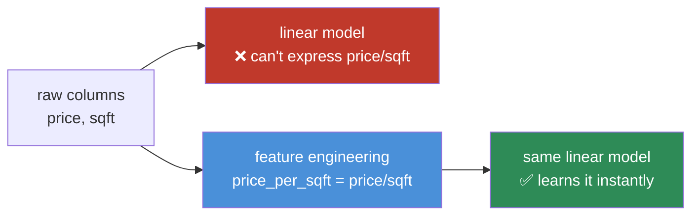
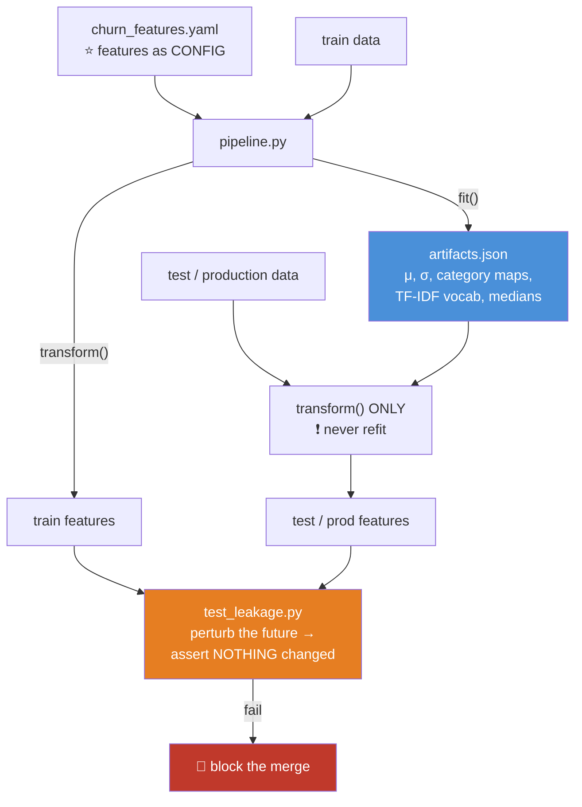

# 07.7 · Feature Engineering

[⬅ 07.6 EDA](07.6-eda.md) · [🏠 Module 07](../README.md) · [➡ 07.8 Visualization](07.8-visualization.md)

> **The lesson in one line:** Swapping your model for a better one buys you a few percent; giving it the right features can double its performance — which is why feature engineering is where senior engineers spend their time and juniors spend none of it.

---

## 🎯 Learning objectives

By the end of this lesson you can:

1. Explain **why features usually matter more than models**, and when that stops being true.
2. Engineer **domain, aggregate, ratio, interaction, and temporal** features deliberately.
3. Extract **date/time** features correctly — including cyclical encoding.
4. Build introductory **text features** (bag-of-words, TF-IDF) and know when to reach for embeddings instead.
5. Select features with methods that don't lie to you.
6. **Avoid leakage** at every step — because feature engineering is where leakage is born.

---

## 🧠 Mental model

> **A model can only learn relationships that are *representable* in the feature space you gave it. Feature engineering is the act of making the right relationship easy to see.**

A linear model cannot learn `price_per_sqft` from `price` and `sqft` — **division is not in its hypothesis space.** A tree would need dozens of splits to approximate it. **Hand it the ratio, and the pattern becomes trivially learnable.**



**You are not "helping" the model. You are changing what is *learnable*.**

---

## 📖 Why features beat models

| Change | Typical gain |
|---|---|
| Logistic regression → XGBoost | +3–8% |
| XGBoost → a deep net (on tabular) | **often negative** |
| Hyperparameter tuning | +1–3% |
| **Adding the right domain features** | **+10–40%** |
| **Fixing a data quality bug** | can be **+∞** (from broken to working) |

**Every Kaggle competition is won on features, not models.** The top 100 teams all use gradient boosting with near-identical hyperparameters. The difference between rank 1 and rank 500 is **what they fed it**.

> [!IMPORTANT]
> **When does this stop being true?** For **unstructured data** — images, audio, raw text — deep learning **learns the features for you**, and hand-engineering is obsolete (this is exactly what the deep learning revolution *was*: CNNs replaced hand-crafted SIFT/HOG features). But for **tabular data — which is most business ML — feature engineering still dominates**, and gradient boosting on good features still beats deep learning. Know which world you're in.

---

## 1 · Feature Extraction — creating new signal

### Domain features — the highest-value kind, and the least teachable

**These come from understanding the business, not from a library.**

```python
# House prices
df['price_per_sqft']   = df['price'] / df['sqft']              # ⭐ the ratio is the signal
df['age']              = df['year_sold'] - df['year_built']
df['is_renovated']     = (df['year_renovated'] > df['year_built']).astype(int)
df['rooms_per_sqft']   = df['rooms'] / df['sqft']
df['total_bathrooms']  = df['full_bath'] + 0.5 * df['half_bath']

# Customer churn
df['tickets_per_month'] = df['support_tickets'] / df['tenure_months'].clip(lower=1)
df['revenue_per_month'] = df['total_spend'] / df['tenure_months'].clip(lower=1)
df['days_since_login']  = (as_of - df['last_login']).dt.days
df['usage_trend']       = df['usage_last_30d'] / df['usage_prev_30d'].clip(lower=1)  # ⭐
```

> [!TIP]
> **Ratios and rates are almost always more predictive than their raw components** — because they *normalize away* the thing you don't care about. "Total spend" conflates a loyal 5-year customer with a whale who joined last month. **"Spend per month" separates them.** When you're stuck, ask: *"what am I accidentally measuring that I don't care about, and can I divide it out?"*
>
> And note `.clip(lower=1)` on every denominator. **Division by zero produces `inf`, which poisons everything downstream** ([06.9](../../06-Mathematics/weeks/06.9-numerical-computing.md)).

### Aggregate features — the `transform` pattern

**"How does this row compare to its group?"** — one of the most powerful patterns in ML ([07.4](07.4-pandas-advanced.md)).

```python
# Compare each row to its group's baseline
df['category_avg_price'] = df.groupby('category')['price'].transform('mean')
df['price_vs_category']  = df['price'] / df['category_avg_price']      # ⭐ the good one
df['price_rank_in_cat']  = df.groupby('category')['price'].rank(pct=True)
df['category_size']      = df.groupby('category')['price'].transform('size')
```

**`price_vs_category` is far more predictive than `price`**, because a $500 item is cheap for a laptop and outrageous for a phone case. **The raw price doesn't know that; the ratio does.**

### Interaction features

**When the effect of A depends on B.**

```python
df['income_x_age']      = df['income'] * df['age']
df['is_high_earning_young'] = ((df['income'] > 100_000) & (df['age'] < 30)).astype(int)
```

> [!NOTE]
> **Trees find interactions automatically** (that's literally what a split-then-split does), so explicit interactions help them less. **Linear models cannot** — an interaction must be handed to them explicitly. **This is the single biggest reason GBMs beat linear models on tabular data**, and it's why "just use XGBoost" is usually right.

### Polynomial features — use with care

```python
from sklearn.preprocessing import PolynomialFeatures
poly = PolynomialFeatures(degree=2, include_bias=False, interaction_only=False)
X_poly = poly.fit_transform(X)    # x1, x2 → x1, x2, x1², x1·x2, x2²
```

> [!WARNING]
> **Polynomial features explode combinatorially.** 100 features at degree 2 → **5,150 features**. At degree 3 → **176,851**. You will overfit, you will run out of memory, and you will not be able to interpret anything.
>
> **Use `interaction_only=True`** (skip the pure powers), keep the degree at 2, and apply it only to a small hand-picked subset of features you have a *reason* to suspect interact.

---

## 2 · Date/Time Features

**A raw timestamp is nearly useless to a model. Its components are gold.**

```python
import numpy as np

ts = df['created_at']

df['year']        = ts.dt.year
df['month']       = ts.dt.month
df['day']         = ts.dt.day
df['dayofweek']   = ts.dt.dayofweek          # 0=Monday
df['hour']        = ts.dt.hour
df['quarter']     = ts.dt.quarter
df['weekofyear']  = ts.dt.isocalendar().week
df['is_weekend']  = (ts.dt.dayofweek >= 5).astype(int)
df['is_month_end']= ts.dt.is_month_end.astype(int)
df['is_holiday']  = ts.dt.date.isin(HOLIDAYS).astype(int)     # ⭐ domain knowledge

# Elapsed time — often the strongest of all
df['days_since_signup'] = (as_of - df['signup_date']).dt.days
df['days_until_renewal'] = (df['renewal_date'] - as_of).dt.days
```

### ⭐ Cyclical encoding — the one everyone gets wrong

**Problem:** hour 23 and hour 0 are **one hour apart**, but numerically they're 23 apart. December (12) and January (1) are adjacent months, but the model sees a gap of 11. **The model learns a discontinuity that doesn't exist.**

**Solution: map the cycle onto a circle.**

```python
import numpy as np

df['hour_sin']  = np.sin(2 * np.pi * df['hour'] / 24)
df['hour_cos']  = np.cos(2 * np.pi * df['hour'] / 24)

df['month_sin'] = np.sin(2 * np.pi * df['month'] / 12)
df['month_cos'] = np.cos(2 * np.pi * df['month'] / 12)

df['dow_sin']   = np.sin(2 * np.pi * df['dayofweek'] / 7)
df['dow_cos']   = np.cos(2 * np.pi * df['dayofweek'] / 7)
```

> [!IMPORTANT]
> **Why two columns (sin AND cos)?** Because `sin` alone is ambiguous — `sin(2π·3/24) == sin(2π·9/24)`, so 3 a.m. and 9 a.m. would map to the same value. **The (sin, cos) pair is a unique point on the unit circle**, so 23:00 and 00:00 land right next to each other in the feature space — exactly as they should.
>
> **This is pure [06.2](../../06-Mathematics/weeks/06.2-linear-algebra-vectors-matrices.md) geometry solving a real modelling problem**, and it's the same trick that underlies sinusoidal positional encoding in Transformers ([06.11](../../06-Mathematics/weeks/06.11-transformer-math.md)). *(Caveat: trees can partially learn the wrap-around by splitting on both ends, so cyclical encoding matters most for linear models and neural networks.)*

> 🖼️ **[IMAGE PLACEHOLDER: `assets/images/07-cyclical-encoding.png`]**
> *Left: a number line 0–23 with hour 23 and hour 0 marked at opposite ends, a long double-headed arrow between them labelled "distance = 23 ❌ WRONG." Right: a unit circle with the 24 hours placed around it, hour 23 and hour 0 adjacent, a tiny arc between them labelled "distance ≈ 0.26 ✅ CORRECT," and the (sin, cos) coordinates shown for hour 3 and hour 9 to demonstrate that they're distinct points despite having the same sine. Caption: "Cyclical features live on a circle, not a line."*

### Lag & rolling features — the leakage minefield

```python
# ✅ SAFE — shift BEFORE the window (07.4)
g = df.sort_values(['user_id','date']).groupby('user_id')['sales']
df['lag_1']       = g.shift(1)
df['lag_7']       = g.shift(7)
df['roll_7_mean'] = g.transform(lambda s: s.shift(1).rolling(7, min_periods=1).mean())
df['roll_7_std']  = g.transform(lambda s: s.shift(1).rolling(7, min_periods=1).std())
df['trend']       = df['roll_7_mean'] / g.transform(
                        lambda s: s.shift(1).rolling(28, min_periods=1).mean())
```

> [!CAUTION]
> **Every one of those `.shift(1)` calls is load-bearing.** Without it, the feature at row *t* contains the value at row *t* — the thing you're trying to predict. Your model hits 0.99 and fails completely in production. **This is the most common leakage bug in all of applied ML**, and it hides in a single missing method call.

---

## 3 · Text Features (introductory)

### Bag-of-words and TF-IDF

```python
from sklearn.feature_extraction.text import CountVectorizer, TfidfVectorizer

# Bag of words — just counts
bow = CountVectorizer(max_features=5000, ngram_range=(1,2), min_df=5)
X_bow = bow.fit_transform(train_texts)          # sparse (n_docs, 5000)

# TF-IDF — counts, downweighted by how common the word is everywhere
tfidf = TfidfVectorizer(max_features=5000, ngram_range=(1,2),
                        min_df=5, max_df=0.8, stop_words='english',
                        sublinear_tf=True)
X_tfidf = tfidf.fit_transform(train_texts)      # ← fit on TRAIN only!
X_test  = tfidf.transform(test_texts)           # ← transform only
```

$$\text{TF-IDF}(t, d) = \underbrace{\text{tf}(t,d)}_{\text{how often in THIS doc}} \times \underbrace{\log\frac{N}{\text{df}(t)}}_{\text{how RARE across all docs}}$$

**The intuition:** a word that appears often in *this* document but rarely in *all* documents is **distinctive** — it tells you what this document is about. "The" appears everywhere, so its IDF crushes it to nothing. "Bankruptcy" appears in few documents, so when it appears here, it *means* something.

**That's information theory in disguise** — rare = surprising = informative ([06.8](../../06-Mathematics/weeks/06.8-information-theory.md)).

### Simple text features that are often surprisingly strong

```python
df['char_count']    = df['text'].str.len()
df['word_count']    = df['text'].str.split().str.len()
df['avg_word_len']  = df['char_count'] / df['word_count'].clip(lower=1)
df['exclamations']  = df['text'].str.count('!')
df['caps_ratio']    = df['text'].str.count(r'[A-Z]') / df['char_count'].clip(lower=1)
df['has_url']       = df['text'].str.contains(r'http', na=False).astype(int)
df['question_marks']= df['text'].str.count(r'\?')
```

> [!TIP]
> **For spam and sentiment, `caps_ratio` and `exclamations` are often more predictive than the actual words.** ALL CAPS AND EXCLAMATION MARKS!!! carry enormous signal. **Don't reach for a Transformer before you've tried counting exclamation marks** — you'd be surprised how often the simple thing wins, and it costs 3 milliseconds instead of 300.

| Method | Dimensions | Semantics? | Use when |
|---|---|---|---|
| **Simple counts** | ~10 | ❌ | ✅ **Always. Try these first** |
| Bag-of-words | 1k–50k sparse | ❌ | Baseline |
| **TF-IDF** | 1k–50k sparse | ❌ | ✅ **The strong classical baseline** |
| Word2Vec / GloVe | 100–300 dense | 🟡 Word-level | Legacy |
| **Sentence embeddings** | 384–1536 dense | ✅ **Yes** | ✅ Modern default ([Module 10](../../10-NLP/README.md)) |
| Fine-tuned Transformer | — | ✅✅ | When you have the data and the budget |

**TF-IDF + logistic regression is a shockingly strong baseline** for text classification. Beat it before you reach for a 7B model — you often can't, and you'll have spent 100× the compute finding out.

---

## 4 · Feature Selection

**More features is not better.** Beyond a point, they add noise, overfitting, latency, and maintenance burden.

| Method | How | Cost | Note |
|---|---|---|---|
| **Variance threshold** | Drop near-constant columns | Free | ✅ Always do this first |
| **Correlation filter** | Drop one of each pair with \|ρ\| > 0.95 | Cheap | Kills multicollinearity |
| **Univariate (`SelectKBest`)** | Rank by a per-feature statistic | Cheap | ⚠️ **Blind to interactions** |
| **Mutual information** | Any dependence, not just linear | Medium | Better than correlation |
| **Model importance** | GBM feature importance / SHAP | Medium | ✅ **The practical default** |
| **Permutation importance** | Shuffle a column, measure the damage | Expensive | ✅ **The most trustworthy** |
| **Recursive elimination** | Fit, drop the worst, repeat | Very expensive | Rarely worth it |
| **L1 / Lasso** | The model does it for you | Free | Elegant — regularization *is* selection |

```python
from sklearn.inspection import permutation_importance

r = permutation_importance(model, X_val, y_val, n_repeats=10, random_state=0)
for i in r.importances_mean.argsort()[::-1][:15]:
    print(f"{X_val.columns[i]:25} {r.importances_mean[i]:.4f} "
          f"± {r.importances_std[i]:.4f}")
```

> [!IMPORTANT]
> **Permutation importance is the one to trust.** It asks the question you actually care about: *"if I destroyed this feature, how much worse would the model get — measured on data it hasn't seen?"*
>
> **Built-in tree importances lie in two specific ways:** they're biased toward **high-cardinality** features (more possible splits = more chances to look useful), and when two features are correlated they **split the credit**, so both look unimportant even though the pair is essential.
>
> **And: compute permutation importance on the VALIDATION set, not train.** On train, an overfit model will happily tell you that its memorized noise features are critical.

> [!CAUTION]
> **A feature with implausibly dominant importance is a leak.** If one feature accounts for 95% of your model's importance, **you almost certainly have leakage** ([07.6](07.6-eda.md)). Feature importance is one of the best leak detectors you have — use it as one.

---

## 5 · The Leakage Rules for Feature Engineering

**Feature engineering is where leakage is born.** Six rules; each one is a real bug that has shipped.

| Rule | ❌ Wrong | ✅ Right |
|---|---|---|
| **Fit on train only** | `scaler.fit(X_all)` | `scaler.fit(X_train)` |
| **Shift before rolling** | `.rolling(7).mean()` | `.shift(1).rolling(7).mean()` |
| **Target encode out-of-fold** | `groupby.transform('mean')` | K-fold out-of-fold encoding |
| **Respect the as-of date** | Aggregate over all history | Aggregate over `t < as_of_date` |
| **Never `bfill` a time series** | `.bfill()` | `.ffill()` |
| **Fit the vectorizer on train** | `tfidf.fit(all_texts)` | `tfidf.fit(train_texts)` |

> [!CAUTION]
> **The universal test, and it takes one hour to build:**
>
> **Modify a value in the *future* (after your prediction moment). Rebuild your features. If any feature changed, you have leakage.**
>
> ```python
> def test_no_leakage(df, as_of):
>     baseline = build_features(df, as_of)
>     poisoned = df.copy()
>     poisoned.loc[poisoned.date > as_of, 'amount'] *= 1000   # absurd future value
>     result = build_features(poisoned, as_of)
>     assert baseline.equals(result), "🚨 LEAKAGE — a future value changed a feature"
> ```
>
> **This single test is worth more than every other test in your pipeline**, and almost nobody writes it. Write it. Put it in CI.

---

## ⚡ Performance considerations

| Concern | Note |
|---|---|
| **Feature count** | Every feature costs training time, inference latency, and a maintenance burden. **A 20-feature model that's 1% worse is often the better product** |
| **Inference latency** | A feature requiring a 200 ms database lookup may be unusable in a 50 ms SLA — **no matter how predictive it is** |
| One-hot on high cardinality | 10,000 columns → use sparse matrices, or frequency/target encoding |
| Polynomial degree 3 | 100 features → 176,851. Don't |
| Rolling windows on 100M rows | Expensive. Precompute in SQL ([05.4](../../05-SQL/weeks/05.4-advanced-sql.md)) or use Polars |
| **Feature computation cost** | If a feature takes 40 minutes to compute and adds 0.2%, **it is not worth it** |

> [!IMPORTANT]
> **A feature that can't be computed at inference time is not a feature — it's a fantasy.** Before you engineer anything, ask: *"can I compute this in production, within my latency budget, from data that exists at request time?"* A brilliant feature that requires a 30-day aggregation you can't compute in 50 ms is worthless. **This constraint should shape what you build, not be discovered afterwards.**

---

## 🔒 Security & privacy considerations

| Concern | Note |
|---|---|
| **Features can encode PII** | A "days since signup" + "zip code" + "birth year" triple is often **uniquely identifying**, even with no name |
| **Target encoding embeds the label** | If the target is sensitive (a medical diagnosis, a credit decision), the encoded feature **is a proxy for it** — and it travels wherever features travel |
| **Proxies for protected attributes** | Zip code → race. First name → gender. Browsing history → almost everything. **Removing the protected column does not remove the attribute** |
| **Text features leak content** | A TF-IDF vocabulary built on user messages **contains those users' words**. The vocabulary file is a data artifact |
| **Embeddings are invertible-ish** | Text embeddings can be partially inverted to recover the original text. **Treat an embedding of PII as PII** |
| **Feature stores centralize risk** | Convenient for engineers; a single high-value target for an attacker |

> [!WARNING]
> **"We removed the protected attribute" is not a fairness defence.** If `zip_code` correlates 0.8 with race, your model uses race. **The correct approach is to *measure*:** correlate every feature against each protected attribute you can access, and **evaluate model performance sliced by group** ([07.6](07.6-eda.md)). If the model is worse for one group, that's a finding you must act on — not one you get to not know about.

---

## ✅ Best practices

| Practice | Why |
|---|---|
| **Domain knowledge first** | The best features come from understanding the business, not a library |
| **Ratios and rates over raw counts** | They divide out what you don't care about |
| **`transform` for "this row vs. its group"** | The most powerful generic feature pattern in ML |
| **`.clip(lower=1)` on every denominator** | Division by zero → `inf` → poisoned model |
| **Cyclical encoding for cyclical time** | Hour 23 and hour 0 are adjacent, not 23 apart |
| **Fit every transformer on TRAIN only** | Scalers, encoders, vectorizers, imputers. All of them |
| **`.shift(1)` before every window** | The single most common leakage bug |
| **Permutation importance on validation** | Tree importances are biased and split credit |
| **Write the leakage test** | Perturb the future; assert nothing changed |
| **Check inference feasibility first** | A feature you can't compute in prod is a fantasy |
| **Version your feature definitions** | A feature that silently changes meaning is a production incident |
| **Fewer, better features** | 20 good features beat 500 mediocre ones — for latency, maintenance, and generalization |

---

## 🐛 Common mistakes

| Mistake | Consequence |
|---|---|
| **Fitting a scaler/encoder on all data** | Leakage. Your evaluation is fiction |
| **`.rolling()` without `.shift(1)`** | Leakage. 0.99 offline, useless in prod |
| **Naive target encoding** | Leaks the label directly into the feature |
| Treating hour as a linear number | The model learns a discontinuity between 23:00 and 00:00 |
| Dividing without `.clip(lower=1)` | `inf` and `NaN` propagate through everything |
| Polynomial degree 3 on 100 features | 176,851 features. Overfitting and OOM |
| **Trusting tree feature importance** | Biased to high cardinality; splits credit among correlated features |
| Computing importance on train | An overfit model tells you its memorized noise matters |
| Engineering a feature you can't serve | It works in the notebook and cannot ship |
| **Not writing the leakage test** | You will ship a leak. Everyone does, once |
| Removing `race` and declaring fairness | Proxies reconstruct it. You've only removed your ability to *measure* it |

---

## 📝 Exercises

**Conceptual**
1. Why can't a linear model learn `price / sqft` from `price` and `sqft`? What can, and how many splits does it take?
2. Why do ratios often outperform their raw components? Give three examples.
3. Why does cyclical encoding need **both** sin and cos?
4. Why is permutation importance more trustworthy than tree feature importance? Name the two biases.
5. Why is "we removed the race column" not a fairness defence?

**Feature engineering tasks**
6. Given a house-price dataset, engineer 10 domain features. For each, **write one sentence explaining why it should predict price.** (If you can't, don't build it.)
7. Given transactions, build a per-customer feature table with RFM + trend + diversity, **all as of a given date.** Then write the leakage test and run it.
8. Take a timestamp column. Engineer 12 date features including cyclical encodings for hour, day-of-week, and month. Plot `hour_sin` vs `hour_cos` and confirm you get a circle.
9. Build lag and rolling features for a time series. **Prove there's no leakage** by asserting that feature values at row *t* depend only on rows < *t*.
10. Take a text column. Build (a) simple count features, (b) TF-IDF. Train a logistic regression on each. **Compare — the simple features will do better than you expect.**

**Analysis**
11. Compute permutation importance on a model. Then compute tree feature importance. **Where do they disagree, and why?**
12. Deliberately create a leaking feature. Train a model. Observe the near-perfect score. Then run the leakage test and watch it catch the leak. **Do this once; you'll never forget it.**
13. Correlate every feature in your dataset against a protected attribute (or a proxy for one). **Report what you find.**

---

## 🛠️ Mini project — *The Feature Engineering Library*

Build `code/07-data-analysis/feature-lib/` — a reusable, leakage-safe feature engineering library.

**Requirements**
- Every transformer follows the **`fit` / `transform`** contract — fitted parameters are learned from **train only** and saved.
- Every temporal feature takes an **`as_of_date`** and is structurally incapable of seeing the future.
- The **leakage test runs in CI** and blocks the merge.
- Features are **declared in config**, not hardcoded, so they're versionable and auditable.

```
feature-lib/
├── README.md
├── requirements.txt
├── src/
│   ├── base.py           # BaseTransformer: fit(X_train) → transform(X)
│   ├── numeric.py        # ratios, log1p, binning, clipping
│   ├── aggregate.py      # groupby-transform features
│   ├── temporal.py       # ⭐ date parts, CYCLICAL, lags, rolling — as_of-aware
│   ├── categorical.py    # one-hot, frequency, OUT-OF-FOLD target encoding
│   ├── text.py           # count features, TF-IDF
│   ├── select.py         # variance, correlation, permutation importance
│   ├── registry.py       # ⭐ features declared in YAML, not code
│   └── pipeline.py       # compose; fit once; save artifacts
├── tests/
│   ├── test_leakage.py       # ⭐⭐ THE ONE THAT MATTERS
│   ├── test_fit_transform.py # transform() must never refit
│   └── test_cyclical.py      # hour 23 and hour 0 are close in feature space
└── configs/
    └── churn_features.yaml
```

**Architecture**



**Implementation guidance**
1. **`base.py` defines the contract, and the contract is the whole design.** `fit(X_train)` learns parameters; `transform(X)` applies them and **must never learn anything.** Make `transform` raise if `fit` hasn't been called. **This structurally prevents the #1 leakage bug** — you cannot accidentally fit on the test set, because `transform` has no fitting code path.
2. **`temporal.py` takes `as_of_date` and filters first.** Every lag, rolling window, and aggregate operates only on `date < as_of_date`. **Make the safety structural, not a thing you have to remember.**
3. **`registry.py` — declare features in YAML.** Why? Because a feature definition that lives in a notebook cell is not versionable, not reviewable, and not auditable. When someone asks "what does `usage_trend` mean and when did it change?", a config file in git answers it. **This is what separates a feature *library* from a pile of functions.**
4. **`categorical.py` implements out-of-fold target encoding with smoothing.** The naive version is a one-liner and a catastrophe; the correct version is 15 lines. Write the correct one.

**Testing strategy** — this is the project's real deliverable:
- **`test_leakage.py` ⭐⭐** — for each temporal feature: perturb a value *after* `as_of_date` by ×1000, rebuild, and **assert no feature changed.** Run it over 20 random as-of dates. **Put it in CI. It should block merges.**
- **`test_fit_transform.py`** — assert that calling `transform()` on new data does **not** change the fitted artifacts. Concretely: fit on train, snapshot the artifacts, transform a wildly different test set, assert the artifacts are byte-identical.
- **`test_cyclical.py`** — assert `distance(features(hour=23), features(hour=0)) < distance(features(hour=23), features(hour=12))`. **A test that encodes the actual geometric requirement.**
- **`test_no_inf.py`** — assert no feature ever produces `inf` or `NaN` on adversarial input (zeros in denominators, empty groups, single-row customers).

**Future improvements**
- Add a **feature store interface** so training and serving call the *same* code — killing training/serving skew by construction ([07.11](07.11-pipelines.md)).
- Add **automatic feature documentation**: generate a data dictionary from the YAML.
- Add **drift monitoring** on feature distributions ([07.9](07.9-data-quality.md)).
- Add the **proxy check** as a CI gate: fail if any feature correlates > 0.7 with a protected attribute without an explicit, reviewed exemption.

**Why this project:** because **this is the artifact that makes you senior.** Anyone can write `df['ratio'] = df.a / df.b` in a notebook. Very few people build a feature library where **leakage is structurally impossible**, features are **declared and versioned**, and the **same code serves training and production**. That library is the thing your team will use for years.

---

## 📄 Cheat sheet

| Feature type | Code |
|---|---|
| **Ratio** ⭐ | `df.a / df.b.clip(lower=1)` ← **clip the denominator** |
| **Group comparison** ⭐ | `df.x / df.groupby('g')['x'].transform('mean')` |
| Group rank | `df.groupby('g')['x'].rank(pct=True)` |
| Skew fix | `np.log1p(df.x)` |
| Interaction | `df.a * df.b` (trees find these; linear models can't) |
| Date parts | `ts.dt.dayofweek` · `.hour` · `.month` · `.is_month_end` |
| **Cyclical** ⭐ | `np.sin(2*np.pi*h/24)` **and** `np.cos(2*np.pi*h/24)` |
| Elapsed | `(as_of - df.signup).dt.days` |
| **Lag (safe)** | `df.groupby('id')['x'].shift(1)` |
| **Rolling (safe)** ⭐ | `.transform(lambda s: s.shift(1).rolling(7).mean())` |
| Text: simple | `.str.len()` · `.str.count('!')` · caps ratio |
| Text: TF-IDF | `TfidfVectorizer(...).fit(train_texts)` ← **train only** |
| Frequency encode | `df.c.map(df.c.value_counts(normalize=True))` |
| **Target encode** | **Out-of-fold + smoothing.** Never naive |
| **Selection** | `permutation_importance(model, X_val, y_val)` ← **val, not train** |

**The 6 leakage rules:** fit on train · shift before rolling · out-of-fold target encoding · respect `as_of_date` · never `bfill` · fit vectorizers on train.
**The test:** *perturb the future → assert nothing changed.*

---

## 🎴 Flashcards

- **Q:** Why do features matter more than models? → **A:** A better model buys +3–8%; the right features buy **+10–40%**. Every Kaggle competition is won on features — the top 100 teams all use the same GBM.
- **Q:** When does feature engineering stop mattering? → **A:** For **unstructured data** (images, audio, raw text), deep learning learns the features. For **tabular data** — most business ML — it still dominates.
- **Q:** Why can't a linear model learn `price/sqft`? → **A:** **Division isn't in its hypothesis space.** It can only take weighted sums. Hand it the ratio and the pattern becomes trivially learnable.
- **Q:** What's the most powerful generic feature pattern? → **A:** **"This row vs. its group"** — `df.x / df.groupby('g')['x'].transform('mean')`. A $500 item is cheap for a laptop and outrageous for a phone case.
- **Q:** Why does cyclical encoding need **both** sin and cos? → **A:** `sin` alone is ambiguous — 3 a.m. and 9 a.m. share a sine. The **(sin, cos) pair is a unique point on the unit circle**, so hour 23 and hour 0 land adjacent.
- **Q:** Why `.clip(lower=1)` on denominators? → **A:** Division by zero produces `inf`, which propagates through every downstream computation and poisons the model.
- **Q:** Why is permutation importance more trustworthy than tree importance? → **A:** Tree importance is **biased toward high-cardinality features** (more split opportunities) and **splits credit between correlated features** (both look unimportant). Permutation asks the real question: *how much worse is the model without this?*
- **Q:** Where must permutation importance be computed? → **A:** On the **validation** set. On train, an overfit model insists its memorized noise is critical.
- **Q:** What does a feature with 95% of the importance mean? → **A:** **Leakage**, almost certainly. Feature importance is one of your best leak detectors.
- **Q:** Name the 6 leakage rules for feature engineering. → **A:** Fit transformers on train only · `.shift(1)` before rolling · out-of-fold target encoding · respect the `as_of_date` · never `bfill` a time series · fit vectorizers on train.
- **Q:** What is the universal leakage test? → **A:** **Perturb a value in the future, rebuild the features, assert nothing changed.** Worth more than every other test in your pipeline. Almost nobody writes it.
- **Q:** What makes a feature a "fantasy"? → **A:** If you can't compute it **at inference time, within your latency budget, from data that exists at request time** — it isn't a feature, no matter how predictive.

---

## 💼 Interview questions

1. **"Would you rather have a better model or better features?"** — Better features, and quantify it (+3–8% vs +10–40%). **Then add the nuance:** it flips for unstructured data, where deep learning learns representations.
2. **"How would you encode the hour of the day?"** — **Not as an integer.** Cyclical `sin`/`cos`, because 23:00 and 00:00 are adjacent. Explain why you need both. This question separates people who've thought about it from people who haven't.
3. **"How do you avoid data leakage during feature engineering?"** — The six rules, and then **the universal test**: perturb the future, assert nothing changed. Mention you'd put it in CI.
4. **"Your top feature has 95% of the importance. Thoughts?"** — **Leakage.** Investigate before doing anything else.
5. **"How would you select features from 5,000 candidates?"** — Variance threshold → correlation filter → model-based importance → **permutation importance on validation** to confirm. Mention that fewer features is better for latency and maintenance, not just for accuracy.
6. **"You have a feature that improves AUC by 3% but requires a 200 ms lookup. Your SLA is 50 ms."** — **It's not a feature.** Either precompute it into a feature store, approximate it with something cheaper, or drop it. **A brilliant feature you cannot serve is worth zero.**

---

## 📚 Summary

- **Features determine what is *learnable*.** A linear model cannot express `price/sqft`; hand it the ratio and the pattern becomes trivial. You aren't helping the model — you're changing its hypothesis space.
- **Features beat models on tabular data** (+10–40% vs +3–8%), and every Kaggle competition proves it. **This flips for unstructured data**, where deep learning learns the representations.
- **The highest-value features come from domain knowledge**: **ratios and rates** (which divide out what you don't care about) and **"this row vs. its group"** comparisons via `transform`.
- **Cyclical time must be encoded on a circle** — `sin` **and** `cos` — or the model learns a discontinuity between 23:00 and 00:00 that doesn't exist.
- **TF-IDF + logistic regression is a shockingly strong text baseline.** And simple counts (caps ratio, exclamation marks) are often more predictive than the words. **Try the cheap thing first.**
- **Permutation importance on the validation set is the only importance you should trust.** Tree importances are biased toward high cardinality and split credit among correlated features.
- **Feature engineering is where leakage is born.** Six rules: fit on train, shift before rolling, out-of-fold target encoding, respect the as-of date, never `bfill`, fit vectorizers on train. **And write the test: perturb the future, assert nothing changed.**
- **A feature you cannot compute at inference time, within your latency budget, is not a feature.** Check feasibility *before* you build it.
- **Removing a protected attribute doesn't remove it** — proxies reconstruct it. Measure, don't assume.

**Next:** [07.8 Visualization](07.8-visualization.md) — because half of what you've learned in this module is only visible in a plot.

---

## 🔗 References

- Zheng & Casari — *Feature Engineering for Machine Learning* (O'Reilly). The best practical book on this.
- Kuhn & Johnson — *Feature Engineering and Selection* (free at bookdown.org/max/FES). Rigorous, and strong on the leakage traps.
- Micci-Barreca (2001) — *A Preprocessing Scheme for High-Cardinality Categorical Attributes* — target encoding and the smoothing that makes it safe.
- Breiman (2001) — *Random Forests* — where permutation importance comes from.
- Strobl et al. (2007) — *Bias in random forest variable importance measures* — **why you shouldn't trust the built-in importances.**
- Kaggle winning solutions (any competition) — read three. **You will notice they are 80% feature engineering and 20% modelling**, and that will teach you more than any book.

---

## 🧭 Navigation

| Direction | Link |
|---|---|
| ⬅ Previous | [07.6 EDA](07.6-eda.md) |
| ➡ Next | [07.8 Visualization](07.8-visualization.md) |
| 🏠 Module | [Module 07](../README.md) |
| 🗺 Roadmap | [ROADMAP.md](../../../ROADMAP.md) |
