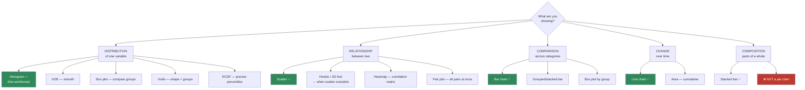
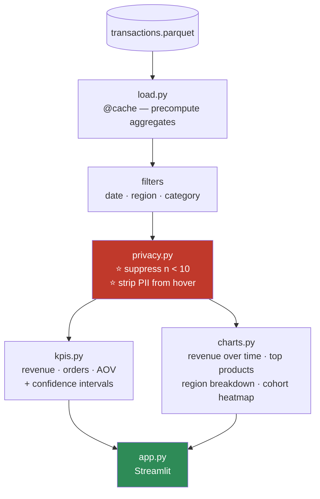

# 07.8 · Visualization

[⬅ 07.7 Feature Engineering](07.7-feature-engineering.md) · [🏠 Module 07](../README.md) · [➡ 07.9 Data Quality](07.9-data-quality.md)

> **The lesson in one line:** A plot is not decoration — it is the only instrument that shows you bimodality, sentinels, truncation, and mixed units, all of which are **completely invisible** in `describe()`.

---

## 🎯 Learning objectives

By the end of this lesson you can:

1. **Choose the right chart** from a decision procedure, not from habit.
2. Use **Matplotlib's object-oriented API** (and stop writing `plt.` everywhere).
3. Build the **six plots that actually matter** for an ML workflow.
4. Know when to reach for **Plotly** instead of Matplotlib.
5. Avoid the visual lies — truncated axes, dual axes, pie charts, rainbow colormaps.
6. Make plots that are **accessible** and that don't leak PII.

---

## 🧠 Mental model

> **You visualize for three different audiences, and they need three different things.**

| Audience | Goal | Tool | Standard |
|---|---|---|---|
| **You, exploring** | Find what's broken | Matplotlib, fast and ugly | 3 seconds. No labels. **Volume over polish** |
| **Your team, reviewing** | Convey a finding | Matplotlib/seaborn, labelled | Titles, units, context |
| **Stakeholders, deciding** | Drive a decision | Plotly, polished, interactive | One message per chart |

**Most people apply stakeholder standards to exploration and produce ten beautiful plots instead of two hundred ugly ones.** During EDA, **the number of plots you look at matters far more than how they look.** Polish later, and only for the two that survived.

---

## 📖 Choosing the right chart

**This flowchart is the lesson.** Print it.



| Question you're asking | Chart |
|---|---|
| "What's the shape of this column?" | **Histogram** |
| "Does this feature differ by target class?" | **Box plot** or overlaid histograms |
| "Are these two features related?" | **Scatter** (or hexbin if > ~10k points) |
| "Which features correlate?" | **Heatmap** |
| "How does this change over time?" | **Line** |
| "Which category is biggest?" | **Bar** (horizontal if labels are long) |
| "Where are the outliers?" | **Box plot** or scatter |
| "Is my model calibrated?" | **Reliability diagram** |

---

## ⚙️ Matplotlib — use the object-oriented API

```python
import matplotlib.pyplot as plt

# ❌ The pyplot state-machine API — fine for one throwaway plot, terrible for anything else
plt.plot(x, y)
plt.title('...')

# ✅ The object-oriented API — explicit, composable, and what you should always write
fig, ax = plt.subplots(figsize=(10, 6))
ax.plot(x, y, label='revenue', color='#4a90d9', linewidth=2)
ax.set_xlabel('Month')
ax.set_ylabel('Revenue ($)')
ax.set_title('Monthly revenue, 2024')
ax.legend()
ax.grid(alpha=0.3)
fig.tight_layout()
```

> [!IMPORTANT]
> **Learn `fig, ax = plt.subplots()` and never look back.** The `plt.` state machine has a hidden "current figure" — which breaks the moment you want subplots, want to return a figure from a function, or want to plot inside a loop. **The OO API is explicit about which axes you're drawing on**, which is the only way to build a plotting library that anyone can maintain.

### The anatomy

| Object | Is |
|---|---|
| **Figure** | The whole canvas (the page) |
| **Axes** | **One plot** (confusingly named — it's the plot, not the axis) |
| **Axis** | An actual x or y axis |
| **Artist** | Everything drawn (lines, text, patches) |

```python
fig, axes = plt.subplots(2, 2, figsize=(14, 10))   # a 2×2 grid of Axes
axes[0,0].hist(df['income'], bins=50)
axes[0,1].scatter(df['sqft'], df['price'], alpha=0.3)
axes[1,0].boxplot([df[df.target==0].age, df[df.target==1].age], labels=['no','yes'])
axes[1,1].plot(ts.index, ts.values)
fig.suptitle('EDA overview', fontsize=14)
fig.tight_layout()
```

---

## 📊 The six plots that matter for ML

### 1 · Histogram — the one you run first, always

```python
fig, axes = plt.subplots(1, 2, figsize=(12, 4))
axes[0].hist(df['income'], bins=50, edgecolor='white')
axes[0].set_title(f"income (skew={df['income'].skew():.2f})")
axes[1].hist(np.log1p(df['income']), bins=50, edgecolor='white')
axes[1].set_title(f"log1p(income) (skew={np.log1p(df['income']).skew():.2f})")
```

> [!CAUTION]
> **The bin count changes the story.** With 5 bins, everything looks unimodal. With 500, everything looks like noise. **Try several** (`bins=30`, `50`, `100`) before you conclude anything about shape — and be aware that a bimodal distribution can be *completely hidden* by a coarse binning. That bimodality is often two populations mixed together (two units, two data sources, two customer segments) and it's one of the most valuable things a plot can tell you.

**What a histogram reveals that `describe()` cannot:**
- **Bimodality** → two populations mixed. Often mixed units, or a segment you should model separately.
- **A spike at exactly −1 / 0 / 999** → a **sentinel** ([07.5](07.5-data-cleaning.md)). This is the silent bug, made visible.
- **Truncation** → a hard wall at 100 means the data was capped somewhere upstream.
- **Skew** → you need `log1p`.

### 2 · Box plot — distribution by group

```python
fig, ax = plt.subplots(figsize=(10, 5))
df.boxplot(column='income', by='segment', ax=ax)
```

Shows median, IQR, whiskers (1.5×IQR), and outliers — **the exact quantities behind IQR outlier detection** ([07.5](07.5-data-cleaning.md)). The single best chart for "does this feature separate my classes?"

> [!TIP]
> **A box plot hides bimodality** (a two-humped distribution and a flat one can have identical boxes). Use a **violin plot** when the *shape* matters, not just the quartiles.

### 3 · Scatter — relationships

```python
fig, ax = plt.subplots(figsize=(8, 6))
ax.scatter(df['sqft'], df['price'], alpha=0.2, s=10)     # ← alpha is essential
ax.set_xlabel('Square feet'); ax.set_ylabel('Price ($)')
```

> [!WARNING]
> **Overplotting destroys scatter plots.** With 100,000 points, everything becomes a solid black blob and you learn nothing. **Fixes, in order:** `alpha=0.1`, then `s=1`, then **sample** (`df.sample(5000)`), then switch to **`hexbin`** or a 2-D histogram — which show *density*, which is what you actually wanted.
> ```python
> ax.hexbin(df['sqft'], df['price'], gridsize=50, cmap='Blues')
> ```

### 4 · Correlation heatmap

```python
import numpy as np

corr = df.corr(numeric_only=True)
mask = np.triu(np.ones_like(corr, dtype=bool))    # hide the redundant upper triangle

fig, ax = plt.subplots(figsize=(10, 8))
im = ax.imshow(np.where(mask, np.nan, corr), cmap='RdBu_r', vmin=-1, vmax=1)
ax.set_xticks(range(len(corr))); ax.set_xticklabels(corr.columns, rotation=90)
ax.set_yticks(range(len(corr))); ax.set_yticklabels(corr.columns)
fig.colorbar(im, label='Pearson r')
```

> [!IMPORTANT]
> **Use a *diverging* colormap centered at zero (`RdBu_r`) with `vmin=-1, vmax=1`.** Correlation has a meaningful midpoint — zero. A sequential colormap (`viridis`, `Blues`) makes −0.9 and 0.0 look similarly "low," which is exactly backwards: **−0.9 is a strong relationship.** This is the single most common mistake in correlation heatmaps, and it hides half your findings.

### 5 · Time series line plot

```python
fig, ax = plt.subplots(figsize=(14, 5))
ax.plot(ts.index, ts.values, alpha=0.4, linewidth=0.8, label='daily')
ax.plot(ts.index, ts.rolling(30).mean(), linewidth=2, label='30-day avg')   # ⭐
ax.legend(); ax.set_ylabel('Sales')
```

**Always overlay a rolling mean.** Raw daily data is noise; the trend is the signal. *(Note: this rolling mean is for **plotting**, so including the current point is fine — the `.shift(1)` rule from [07.4](07.4-pandas-advanced.md) applies to **features**, not to charts.)*

### 6 · The ML-specific plots

```python
# Reliability diagram — is my model's confidence honest?  (06.5 calibration)
from sklearn.calibration import calibration_curve
prob_true, prob_pred = calibration_curve(y_true, y_prob, n_bins=10)
fig, ax = plt.subplots(figsize=(6,6))
ax.plot([0,1], [0,1], 'k--', label='perfect')
ax.plot(prob_pred, prob_true, 'o-', label='model')
ax.set_xlabel('Predicted probability'); ax.set_ylabel('Actual frequency')
```

| Plot | Answers |
|---|---|
| **Learning curve** (train/val loss vs epoch) | Overfitting? Underfitting? ([06.6](../../06-Mathematics/weeks/06.6-statistics.md)) |
| **Confusion matrix** | *Which* classes am I confusing? |
| **ROC / PR curve** | Threshold trade-offs. **Use PR when imbalanced** |
| **Reliability diagram** | Is 0.8 confidence actually right 80% of the time? |
| **Residual plot** | Are my regression errors structured? (They shouldn't be) |
| **Feature importance bar** | What is the model using? ([07.7](07.7-feature-engineering.md)) |

---

## 🎨 Plotly — when interactivity earns its cost

```python
import plotly.express as px

fig = px.scatter(df, x='sqft', y='price', color='neighborhood',
                 size='rooms', hover_data=['address', 'year_built'],
                 title='House prices')
fig.show()
fig.write_html('prices.html')       # standalone, shareable, no server needed
```

| | **Matplotlib** | **Plotly** |
|---|---|---|
| Speed to first plot | ✅ Instant | Slower |
| **Interactivity** | ❌ Static | ✅ **Zoom, pan, hover, filter** |
| Publication quality | ✅ Excellent (PNG/SVG/PDF) | Good |
| **Millions of points** | ✅ Handles it | ❌ Browser dies (use `scattergl`) |
| Dashboards | ❌ | ✅ Dash / Streamlit |
| Sharing with non-technical people | Static image | ✅ **Self-contained HTML** |

> [!TIP]
> **Use Matplotlib for exploration and for anything going in a document. Use Plotly when hovering matters** — when the answer to "which point is that outlier?" is the whole reason you made the chart. **Interactivity is expensive (render time, file size, browser memory); only pay for it when it buys you something.**
>
> And **`fig.write_html()` produces a single self-contained file** that anyone can open in a browser with no install. That's genuinely valuable for sharing a finding with a non-technical stakeholder.

---

## 🚫 How charts lie

**These are not style opinions. Each one systematically misleads.**

### 1 · Truncated y-axis — the classic

```python
# ❌ Starts at 95 — a 2% change looks like a cliff
ax.set_ylim(95, 100)

# ✅ Bar charts MUST start at zero. The bar's LENGTH is the encoding.
ax.set_ylim(0, 100)
```

> [!CAUTION]
> **For bar charts, a truncated y-axis is a lie**, because the bar's *length* is what encodes the value — halving the axis doubles the apparent difference. **For line charts it's more defensible** (position, not length, is the encoding, and you often genuinely need to zoom in on variation) — **but you must label it clearly.** When in doubt on a bar chart: start at zero.

### 2 · Pie charts

**Humans cannot compare angles.** You can compare lengths (bar chart) far more accurately than angles. **A pie chart with more than ~3 slices is unreadable.** Use a horizontal bar chart, sorted. Always.

### 3 · Dual y-axes

Two different scales on one chart lets you **manufacture any correlation you like** by choosing the scales. It is the single most abusable chart type. **Use two stacked subplots that share an x-axis instead.**

### 4 · Rainbow colormaps (`jet`)

`jet` has **perceptually uneven** transitions — it invents visual boundaries where the data is smooth, and hides real boundaries elsewhere. It's also unreadable for colorblind viewers and turns to mush in greyscale.

**Use `viridis` (sequential), `RdBu_r` (diverging), or `tab10` (categorical).** Matplotlib's default is `viridis` precisely because of this.

### 5 · Missing the "n"

A bar chart of "conversion rate by country" where one country has 3 users is **noise presented as a finding** ([07.6](07.6-eda.md)). **Show the sample size** — annotate it, or use bar width, or filter it out.

---

## ⚡ Performance considerations

| Problem | Fix |
|---|---|
| Scatter with 1M points | **Sample**, `hexbin`, `datashader`, or Plotly's `scattergl` |
| A plot per group in a loop | **`plt.close(fig)`** or you'll leak memory and hit the "20 figures open" warning |
| Slow notebook | `%matplotlib inline` (static) beats `%matplotlib widget` (interactive) |
| Plotly with 100k points | Use `go.Scattergl` (WebGL) — `go.Scatter` (SVG) will freeze the browser |
| Huge saved figures | `dpi=100` for the web; `dpi=300` only for print |
| Rendering the same plot 50 times | Cache the aggregation, not the figure |

```python
for name, group in df.groupby('segment'):
    fig, ax = plt.subplots()
    ax.hist(group['x'])
    fig.savefig(f'{name}.png')
    plt.close(fig)              # ⚠️ REQUIRED — otherwise every figure stays in memory
```

---

## 🔒 Security & privacy considerations

| Concern | Note |
|---|---|
| **A scatter plot is a data dump** | Every point is a real record. Two quasi-identifiers on the axes can **re-identify individuals** |
| **The outlier IS a person** | That lone dot in the corner is one identifiable human being. Publishing it publishes them |
| **Small groups in a bar chart** | A bar for a category with n=1 displays that person's value ([07.4](07.4-pandas-advanced.md)) |
| **Hover tooltips leak** | `hover_data=['email', 'address']` embeds PII **into the HTML file** you just shared |
| **Saved figures escape** | A PNG in a Slack message, a Confluence page, an email — none of them respect your data access controls |
| **Notebook outputs in git** | A committed plot is a permanent record of the underlying data |

> [!WARNING]
> **`fig.write_html()` embeds the underlying data in the file.** Plotly's HTML contains the actual data arrays — including anything in `hover_data`, and including rows you thought were "just for the tooltip." **A shared Plotly HTML is a shared dataset.** Before you send one: check what's in `hover_data`, aggregate where you can, and suppress small groups.

```python
# ✅ Safe: aggregate + suppress small groups before plotting
plot_df = (df.groupby('segment')
             .agg(rate=('target','mean'), n=('target','size'))
             .query('n >= 10'))            # k-anonymity
```

---

## ♿ Accessibility

| Practice | Why |
|---|---|
| **Never encode by color alone** | ~8% of men are colorblind. Add markers, line styles, or direct labels |
| **`viridis` / `cividis`** | Colorblind-safe and perceptually uniform |
| **Check in greyscale** | If it dies when printed, it's over-reliant on hue |
| **Label directly, not just in a legend** | A legend forces a lookup; a label on the line doesn't |
| **Sufficient contrast and font size** | 10pt on a projector is invisible |

---

## ✅ Best practices

| Practice | Why |
|---|---|
| **Plot before you conclude** | Anscombe/Datasaurus — identical statistics, wildly different data |
| **`fig, ax = plt.subplots()`** | The OO API. Always |
| **During EDA: quantity over polish** | 200 ugly plots beat 10 beautiful ones |
| **One message per chart** | If it needs a paragraph to explain, it's two charts |
| Label axes **with units** | An unlabelled axis is not a chart, it's a shape |
| **Diverging colormap for correlation**, centered at 0 | Otherwise −0.9 looks like "nothing" |
| **`alpha` on every scatter** | Overplotting hides density |
| **Overlay a rolling mean on time series** | The daily line is noise; the trend is the signal |
| **Show `n`** | A rate without a sample size is not a finding |
| **`plt.close(fig)`** in loops | Memory leak, otherwise |
| **Bar charts start at zero** | The length *is* the encoding |
| **Never a pie chart** | Humans can't compare angles |

---

## 🐛 Common mistakes

| Mistake | Consequence |
|---|---|
| **Not plotting at all** | You miss bimodality, sentinels, truncation, mixed units — the things that actually matter |
| Using `plt.` for everything | Breaks with subplots; can't be composed into functions |
| **Truncated y-axis on a bar chart** | A 2% difference looks like 200% |
| **Dual y-axes** | You can manufacture any correlation you want |
| **Pie charts** | Unreadable past 3 slices |
| **`jet` colormap** | Invents boundaries; unreadable when colorblind or greyscale |
| **Sequential colormap on correlation** | −0.9 (a strong relationship) looks like "low" |
| Scatter with no `alpha` | A black blob |
| Too few histogram bins | Bimodality is hidden entirely |
| Not closing figures in a loop | Memory leak |
| Bar chart without `n` | You've plotted noise |
| `hover_data=['email']` | You just published PII to a shared HTML file |

---

## 📝 Exercises

**Conceptual**
1. Why is a pie chart worse than a bar chart? Answer in terms of human perception.
2. Why is a truncated y-axis a lie on a bar chart but often acceptable on a line chart?
3. Why must a correlation heatmap use a diverging colormap centered at zero?
4. Name four things a histogram reveals that `describe()` cannot.

**Visualization challenges**
5. **Recreate Anscombe's quartet.** Show that all four have identical mean, variance, and correlation. Then plot them. Write one sentence about what you learned.
6. Plot a distribution that contains `-1` sentinels. Show that the spike is **obvious in the plot and invisible in `describe()`**.
7. Take a scatter plot with 100,000 points. Fix the overplotting **four ways** (alpha, size, sampling, hexbin). Compare what each reveals.
8. Build a 2×3 EDA panel for a real dataset: distribution, log-distribution, box-by-target, scatter, correlation heatmap, and time series with rolling mean. **One `fig`, six `axes`.**
9. Build a correlation heatmap. Do it once with `viridis` and once with `RdBu_r` centered at zero. **Explain what the first one hides.**
10. Make a deliberately misleading chart (truncated axis + dual y-axis + `jet`). Then make the honest version of the same data. Put them side by side.
11. Build the six ML plots: learning curve, confusion matrix, ROC, PR, reliability diagram, feature importance. Use a real model.
12. Take a Plotly chart with `hover_data=['user_id', 'email']`, write it to HTML, and **open the file in a text editor.** Find the emails. Now you'll never do it again.

---

## 🛠️ Mini project — *The Sales Dashboard*

Build `code/07-data-analysis/sales-dashboard/` — an interactive dashboard that a non-technical stakeholder could actually use to make a decision.

**Requirements**
- Load a transactions dataset; produce KPIs (revenue, orders, AOV, growth) and charts.
- **Interactive**: filter by date range, region, product category.
- **Privacy-safe**: no PII in hover data; suppress groups with n < 10.
- **Fast**: must render in < 2 seconds on 1M rows (precompute the aggregates).
- One message per chart.

```
sales-dashboard/
├── README.md
├── requirements.txt          # pandas, plotly, streamlit (or dash)
├── src/
│   ├── load.py           # read parquet; cache aggregates
│   ├── kpis.py           # revenue, orders, AOV, MoM growth — with CIs (06.6)
│   ├── charts.py         # each chart is a pure function: df → fig
│   ├── privacy.py        # ⭐ k-anonymity guard; PII whitelist for hover
│   └── app.py            # streamlit layout
├── tests/
│   ├── test_charts.py    # each returns a valid fig; handles empty input
│   └── test_privacy.py   # ⭐ no PII in any hover; no group with n < 10
└── data/
```

**Architecture**



**Implementation guidance**
1. **Precompute aggregates at load time**, cached. A dashboard that recomputes a 1M-row groupby on every filter change is unusable. **Aggregate once to the finest grain you'll ever display (e.g. day × region × category), then filter *that*** — it's ~1000× smaller and the interactions become instant.
2. **`charts.py`: every chart is a pure function `df → fig`.** No globals, no side effects. This makes them testable, reusable, and composable — and it means you can unit-test that a chart doesn't crash on an empty filter result (which *will* happen the moment a user selects a date range with no data).
3. **`privacy.py` is not optional and it is the part that makes this professional.** A `k_anonymize(df, group_col, k=10)` function that suppresses small groups, and a hover-data whitelist. **Run it before every chart, structurally** — don't rely on remembering.
4. **Show confidence intervals on the KPIs** ([06.6](../../06-Mathematics/weeks/06.6-statistics.md)). *"Revenue is up 3%"* is meaningless without knowing whether 3% is inside the noise. **A dashboard that shows a point estimate with no uncertainty is actively encouraging bad decisions**, and almost every dashboard does exactly that. Yours won't.

**Testing strategy**
- **`test_privacy.py` ⭐** — for every chart function, assert that no output contains a group with n < 10, and that no hover field is in the PII list. **Fail the build if it does.**
- `test_charts.py` — each chart returns a valid figure for: normal data, **empty data** (a filter that matches nothing), single-row data, and data with all-null values. **Empty-filter crashes are the #1 dashboard bug.**
- `test_kpis.py` — KPI math is correct against a hand-computed fixture. And AOV with zero orders must not divide by zero.
- **Performance test:** assert the dashboard renders in < 2s on 1M rows.

**Future improvements**
- Add **anomaly highlighting**: flag days where revenue is > 3 IQRs from the rolling median ([07.5](07.5-data-cleaning.md)).
- Add a **cohort retention heatmap** — the single most informative chart in SaaS analytics.
- Add **drill-down**: click a region, see its products.
- Export to PDF for the board deck.

---

## 📄 Cheat sheet

| Goal | Chart |
|---|---|
| Distribution of one variable | **Histogram** (try several bin counts) |
| Distribution by group | **Box** (or **violin** if shape matters) |
| Relationship, two numerics | **Scatter** (+ `alpha`); **hexbin** if > 10k points |
| Which features correlate | **Heatmap**, `RdBu_r`, `vmin=-1, vmax=1` |
| Change over time | **Line** + rolling mean overlay |
| Compare categories | **Bar** (horizontal if long labels; **start at zero**) |
| Parts of a whole | **Stacked bar** — ❌ **never a pie** |
| Model calibration | Reliability diagram |
| Model errors | Confusion matrix; residual plot |

| Code | |
|---|---|
| Always | `fig, ax = plt.subplots(figsize=(10,6))` |
| Grid | `fig, axes = plt.subplots(2, 2)` → `axes[0,1].plot(...)` |
| Scatter | `ax.scatter(x, y, alpha=0.2, s=10)` |
| Hexbin | `ax.hexbin(x, y, gridsize=50, cmap='Blues')` |
| Heatmap | `ax.imshow(corr, cmap='RdBu_r', vmin=-1, vmax=1)` |
| In a loop | **`plt.close(fig)`** |
| Interactive | `px.scatter(df, x=, y=, color=, hover_data=[...])` |
| Share | `fig.write_html('f.html')` ← **embeds the data. Check hover_data** |

**The lies:** truncated bar axis · dual y-axes · pie charts · `jet` · sequential colormap on correlation · no `n`.

---

## 🎴 Flashcards

- **Q:** What does a histogram reveal that `describe()` cannot? → **A:** **Bimodality** (two populations mixed), **sentinel spikes** (a bar at exactly −1 or 999), **truncation** (a hard wall), and skew shape. All invisible in summary statistics.
- **Q:** Why is a truncated y-axis a lie on a bar chart? → **A:** The bar's **length** encodes the value — truncating the axis multiplies the apparent difference. (On a line chart, *position* is the encoding, so zooming is more defensible — but label it.)
- **Q:** Why never a pie chart? → **A:** **Humans cannot compare angles accurately.** They can compare lengths. Use a sorted horizontal bar chart.
- **Q:** Why must correlation heatmaps use a diverging colormap centered at 0? → **A:** Correlation has a meaningful midpoint. With a sequential map, **−0.9 (a strong relationship) looks as "low" as 0.0** — hiding half your findings.
- **Q:** Why are dual y-axes dangerous? → **A:** You can **manufacture any apparent correlation** by choosing the two scales. Use stacked subplots sharing an x-axis.
- **Q:** How do you fix an overplotted scatter? → **A:** In order: `alpha`, smaller `s`, **sample**, then **hexbin / 2-D histogram** (which shows density — usually what you actually wanted).
- **Q:** Why `fig, ax = plt.subplots()` over `plt.plot()`? → **A:** The OO API is **explicit about which axes you're drawing on** — the `plt.` state machine breaks with subplots, functions, and loops.
- **Q:** Why is `jet` a bad colormap? → **A:** **Perceptually uneven** — it invents visual boundaries where data is smooth. Also colorblind-hostile and useless in greyscale. Use `viridis`.
- **Q:** What must you do when plotting in a loop? → **A:** **`plt.close(fig)`** — otherwise every figure stays in memory.
- **Q:** Why is `fig.write_html()` a privacy risk? → **A:** Plotly **embeds the underlying data arrays in the HTML file** — including everything in `hover_data`. **A shared Plotly HTML is a shared dataset.**
- **Q:** What's the standard for exploratory plots? → **A:** **Quantity over polish.** 200 ugly plots beat 10 beautiful ones. Polish only the two that survived.

---

## 💼 Interview questions

1. **"How do you choose a visualization?"** — Start from the *question*: distribution → histogram; relationship → scatter; comparison → bar; time → line; composition → stacked bar (**never a pie**). Say the question determines the chart, not habit.
2. **"What's wrong with this chart?"** *(they'll show you one)* — Check: truncated axis, dual y-axes, sequential colormap on diverging data, missing `n`, no units, overplotting, pie chart.
3. **"Your histogram of `age` has a spike at −1. What is it?"** — A **missing-value sentinel** ([07.5](07.5-data-cleaning.md)). It's inflating nothing and deflating your mean, and it's invisible in `describe()`.
4. **"Matplotlib or Plotly?"** — Matplotlib for exploration and documents (fast, publication-quality, handles millions of points). Plotly when **hovering is the point** or you're sharing with non-technical people. Note that Plotly HTML embeds the data.
5. **"You have 5 million points to scatter. What do you do?"** — Sample, hexbin, `datashader`, or WebGL (`scattergl`). And note that at that scale you want **density**, not individual points — so a 2-D histogram is usually the *right* answer, not a workaround.
6. **"Your dashboard shows revenue up 3%. Is that good news?"** — *"What's the confidence interval, and what's the sample size?"* ([06.6](../../06-Mathematics/weeks/06.6-statistics.md)) A point estimate with no uncertainty is an invitation to a bad decision.

---

## 📚 Summary

- **Plot before you conclude.** Anscombe's quartet and the Datasaurus Dozen have identical means, variances, and correlations — and wildly different shapes. **A histogram reveals bimodality, sentinels, truncation, and mixed units; `describe()` reveals none of them.**
- **The chart follows from the question**: distribution → histogram; distribution-by-group → box/violin; relationship → scatter (hexbin when overplotted); correlation → diverging heatmap; time → line + rolling mean; comparison → bar. **Never a pie chart** — humans can't compare angles.
- **Use the object-oriented API** — `fig, ax = plt.subplots()`. The `plt.` state machine breaks with subplots, functions, and loops.
- **During exploration, quantity beats polish.** 200 ugly plots beat 10 beautiful ones. Polish only what survives.
- **Charts lie in five reliable ways:** truncated bar axes, dual y-axes, pie charts, `jet`, and sequential colormaps on correlation. **And a rate without an `n` is noise presented as a finding.**
- **Matplotlib for exploration and documents; Plotly when hovering is the point.** But `write_html()` **embeds the underlying data** — a shared Plotly file is a shared dataset.
- **A scatter plot is a data dump.** Every point is a real person, and the outlier in the corner is an identifiable one. Aggregate, suppress small groups, and whitelist hover fields.
- **Never encode by color alone**, and use `viridis`/`RdBu_r`.

**Next:** [07.9 Data Quality](07.9-data-quality.md) — how to stop bad data at the door instead of discovering it in a plot.

---

## 🔗 References

- Tufte — *The Visual Display of Quantitative Information*. The canon. Read it for the *principles*, not the aesthetics.
- Cairo — *How Charts Lie*. Short, modern, and directly about the failure modes in this lesson.
- Wilke — *Fundamentals of Data Visualization* (free at clauswilke.com/dataviz). **The best practical reference** — chapter by chapter, "which chart and why."
- Matplotlib — [Lifecycle of a Plot](https://matplotlib.org/stable/tutorials/introductory/lifecycle.html). Read this and the OO API will click.
- Crameri et al. (2020) — *The misuse of colour in science communication* (Nature Comms) — the rigorous case against `jet`.
- [07.6 EDA](07.6-eda.md) — the plots in this lesson exist to serve that one.

---

## 🧭 Navigation

| Direction | Link |
|---|---|
| ⬅ Previous | [07.7 Feature Engineering](07.7-feature-engineering.md) |
| ➡ Next | [07.9 Data Quality](07.9-data-quality.md) |
| 🏠 Module | [Module 07](../README.md) |
| 🗺 Roadmap | [ROADMAP.md](../../../ROADMAP.md) |
