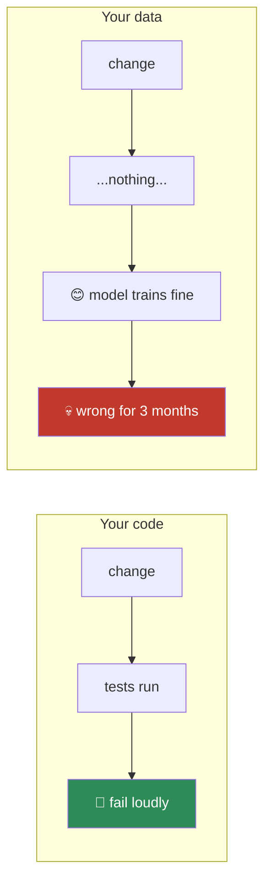
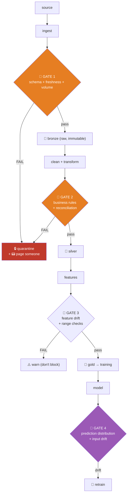
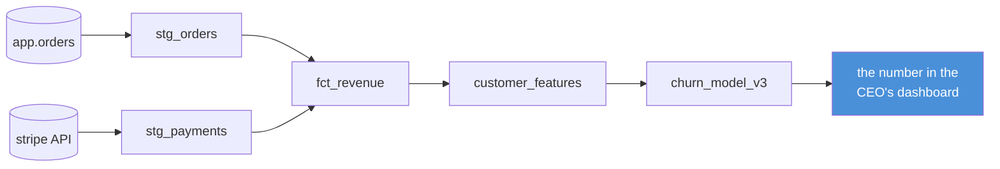
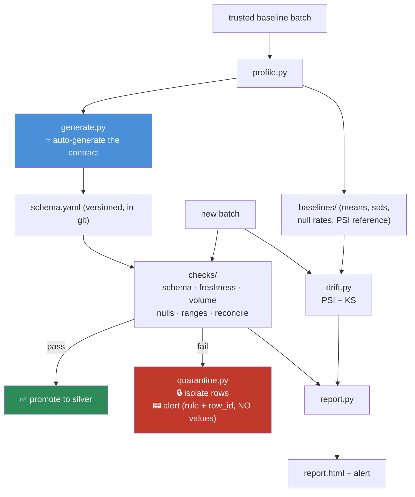

# 07.9 · Data Quality

[⬅ 07.8 Visualization](07.8-visualization.md) · [🏠 Module 07](../README.md) · [➡ 07.10 Performance](07.10-performance.md)

> **The lesson in one line:** Bad data doesn't crash anything — it produces plausible, confident, wrong answers — so the only defence is to **assert what must be true and fail loudly when it isn't.**

---

## 🎯 Learning objectives

By the end of this lesson you can:

1. Name the **six dimensions** of data quality and write a check for each.
2. Build a **schema contract** that rejects bad data at the boundary.
3. Design **freshness and volume** alerts — the two highest-value checks in existence.
4. Explain **data lineage** and why "where did this number come from?" is a question you must be able to answer in minutes.
5. Detect **drift** before it eats your model.
6. Decide what to do when a check fails: **quarantine, alert, or block**.

---

## 🧠 Mental model

> **You have unit tests for your code. You have none for your data. That asymmetry is the whole problem.**

Nobody ships code without tests. Almost everybody ships data with none. And yet **data changes far more often than code does** — an upstream team renames a column, a vendor changes their API, a bug starts writing nulls, a currency switches from cents to dollars — and **none of it raises an exception.**



**Data quality engineering is: writing the tests that don't exist yet.**

---

## 📖 The six dimensions

| Dimension | Question | Example check |
|---|---|---|
| **Completeness** | Is anything missing? | `null_rate(email) < 0.05` |
| **Validity** | Does it conform to the rules? | `age BETWEEN 0 AND 120` |
| **Accuracy** | Does it reflect reality? | Reconcile revenue against the finance ledger |
| **Consistency** | Does it agree with itself and other systems? | `order_date <= ship_date`; the DB total == the warehouse total |
| **Timeliness** | Is it fresh enough? | `max(updated_at) > now() - 6 hours` |
| **Uniqueness** | Are there duplicates? | `user_id` is unique |

> [!IMPORTANT]
> **Accuracy is the hard one, and it's the one that matters most.** The others are *internal* — you can check them by looking at the data. Accuracy requires an **external reference**: does the number match reality?
>
> Data can be 100% complete, valid, consistent, fresh, and unique — **and completely wrong**, because an upstream system started reporting prices in cents instead of dollars. Every value is a plausible integer. Every check passes. And your revenue model is now off by 100×.
>
> **The only defence against accuracy failures is reconciliation against an independent source.** Compare your warehouse's daily revenue against the finance team's ledger. If they diverge by more than a tolerance, page someone. **This check is boring, unglamorous, and it will save you.**

---

## 1 · Schema Validation — the contract

**Assert what must be true. Reject what isn't.**

```python
import pandera as pa
from pandera import Column, Check, DataFrameSchema

schema = DataFrameSchema({
    "user_id":    Column(int,   Check.greater_than(0), unique=True, nullable=False),
    "email":      Column(str,   Check.str_matches(r'^[^@]+@[^@]+\.[^@]+$'), nullable=False),
    "age":        Column(int,   Check.in_range(0, 120), nullable=True),
    "signup_date":Column("datetime64[ns]",
                         Check.less_than_or_equal_to(pd.Timestamp.now()), nullable=False),
    "country":    Column(str,   Check.isin(['US','UK','DE','FR','NL']), nullable=False),
    "revenue":    Column(float, Check.greater_than_or_equal_to(0), nullable=False),
    "plan":       Column(str,   Check.isin(['free','pro','enterprise'])),
}, strict=True)     # ⭐ strict=True → REJECT unexpected columns

try:
    validated = schema.validate(df, lazy=True)     # lazy → collect ALL errors, not just the first
except pa.errors.SchemaErrors as e:
    print(e.failure_cases)     # exactly which rows and which rules failed
    quarantine(df, e)
    alert("schema validation failed")
    raise
```

> [!IMPORTANT]
> **`strict=True` is the setting that catches the silent killers.** Without it, an upstream team can *add* a column and you won't notice — and more importantly, they can **rename** one (`user_id` → `userId`), which shows up as a missing column *and* an unexpected one. **A schema that only checks the columns it knows about will happily validate a DataFrame that's missing half your features.**
>
> **And `lazy=True`** collects every failure instead of dying on the first one — so you get *"3,412 rows failed age range; 12 rows failed email format"* rather than *"row 7 is bad."* You need the shape of the failure to decide what to do about it.

### Dataset-level checks — the ones schemas miss

Row-level rules can't catch everything. **Some failures are only visible in aggregate.**

```python
def check_dataset(df, baseline):
    issues = []

    # VOLUME — did we get roughly the number of rows we expect?
    if not 0.5 * baseline['rows'] <= len(df) <= 2.0 * baseline['rows']:
        issues.append(f"🚨 volume: {len(df):,} rows vs baseline {baseline['rows']:,}")

    # FRESHNESS — is the newest record recent?
    lag = pd.Timestamp.now() - df['updated_at'].max()
    if lag > pd.Timedelta(hours=6):
        issues.append(f"🚨 stale: newest record is {lag} old")

    # NULL RATE — a sudden jump means an upstream break
    for col, base_rate in baseline['null_rates'].items():
        rate = df[col].isna().mean()
        if rate > base_rate + 0.10:
            issues.append(f"🚨 nulls in {col}: {rate:.1%} (was {base_rate:.1%})")

    # DISTRIBUTION — did the mean move implausibly?
    for col, base_mean in baseline['means'].items():
        if abs(df[col].mean() - base_mean) > 3 * baseline['stds'][col]:
            issues.append(f"🚨 {col} mean shifted 3σ")

    return issues
```

> [!IMPORTANT]
> **If you only ever implement two data quality checks, make them FRESHNESS and VOLUME.**
>
> - **Freshness** catches: the pipeline silently stopped, the upstream job failed, the API key expired, a cron didn't fire. **A stale table looks completely healthy** — the data in it is perfectly valid; it's just from last Tuesday. Your model is now making decisions on week-old data and nothing will tell you.
> - **Volume** catches: a partial load, a broken filter, a join that exploded, a source that started returning empty pages. **Half the expected rows is a silent catastrophe.**
>
> **These two checks catch the majority of real production data incidents**, and they take about twenty lines to write. Everything else in this lesson is refinement.

---

## 2 · Where to put the checks



**Validate at the boundary, before the data enters your system.** The earlier you catch it, the fewer downstream tables you have to rebuild.

### When a check fails: three options

| Response | Use when | Example |
|---|---|---|
| **🛑 Block** | The data is unusable and proceeding causes harm | Schema violation; 0 rows; the primary key is null |
| **🔒 Quarantine + alert** | Some rows are bad, most are fine | 3% of emails are malformed — isolate them, process the rest, page someone |
| **⚠️ Warn** | Suspicious but plausible | The mean moved 2σ; nulls up 5% |

> [!CAUTION]
> **Never silently "fix" data at a quality gate.** A gate that quietly imputes a corrupted column *hides the incident* — the upstream bug goes unfixed, and you now have a pipeline that produces plausible garbage forever.
>
> **Quarantine means: move the bad rows somewhere you can look at them, and tell a human.** The bad rows are the most valuable data you have that day — they're the only evidence of what broke.

---

## 3 · Data Lineage

> **"Where did this number come from?"** — you must be able to answer this in **minutes**, not days.



**Lineage answers three questions that will be asked of you:**

| Question | Why it matters |
|---|---|
| **"Where did this come from?"** (upstream) | Someone disputes a number. You have to trace it or lose the argument |
| **"What breaks if I change this?"** (downstream) | **Blast radius.** Dropping a column can silently break six dashboards |
| **"Who owns this table?"** | When it breaks at 3 a.m., someone has to be paged |

**Column-level lineage** (which *column* feeds which) is far more useful than table-level, and much rarer. Tools: dbt (lineage graph for free), OpenLineage, Marquez, DataHub, Amundsen.

> [!TIP]
> **The cheapest possible lineage is a comment and a docstring.** Before you buy a catalog tool, just *write it down*: every table gets a `README` or a dbt `description` saying what it is, where it comes from, who owns it, and its SLA. **A team with disciplined documentation and no tooling beats a team with DataHub and no discipline.**

---

## 4 · Drift Detection

**The data was fine. The world changed.** No code broke. Nothing failed. The model just quietly got worse.

| Type | What shifted | Detect with |
|---|---|---|
| **Data drift** | P(X) — the input distribution | KS test, PSI, KL divergence |
| **Concept drift** | P(y\|X) — the *relationship* | Model performance decay (needs labels — often delayed) |
| **Label drift** | P(y) — the target rate | Monitor the positive rate |
| **Upstream drift** | A schema/semantics change | The quality gates above |

```python
import numpy as np
from scipy.stats import ks_2samp

def psi(expected, actual, bins=10):
    """Population Stability Index — the industry standard for tabular drift."""
    breakpoints = np.percentile(expected, np.linspace(0, 100, bins + 1))
    breakpoints[0], breakpoints[-1] = -np.inf, np.inf
    e = np.histogram(expected, breakpoints)[0] / len(expected)
    a = np.histogram(actual,   breakpoints)[0] / len(actual)
    e, a = np.clip(e, 1e-6, None), np.clip(a, 1e-6, None)     # avoid log(0)
    return np.sum((a - e) * np.log(a / e))

# PSI thresholds (the industry convention)
#   < 0.10  → no significant change      ✅
#   0.10–0.25 → moderate shift            ⚠️  investigate
#   > 0.25  → significant shift           🚨 retrain

for col in FEATURES:
    score = psi(train[col].dropna(), prod[col].dropna())
    ks = ks_2samp(train[col].dropna(), prod[col].dropna())
    flag = "🚨" if score > 0.25 else ("⚠️" if score > 0.10 else "✅")
    print(f"{flag} {col:22} PSI={score:.3f}  KS p={ks.pvalue:.4f}")
```

> [!NOTE]
> **PSI is just a symmetrized KL divergence** ([06.8](../../06-Mathematics/weeks/06.8-information-theory.md)) — *"how much extra surprise does the new distribution cause, relative to the old one?"* The information theory you learned in Module 06 is now a production alert. That's not a coincidence; it's what the theory was *for*.

> [!IMPORTANT]
> **Monitor the INPUTS, not just the outputs.** Model performance requires **labels**, and labels arrive late — a churn label takes 90 days, a loan default takes 2 years. **By the time your accuracy metric drops, you've been making bad decisions for a quarter.**
>
> **Input drift is observable immediately.** It's a leading indicator; performance decay is a lagging one. **Alert on the leading indicator.**

---

## ⚡ Performance considerations

| Concern | Approach |
|---|---|
| Validating 100M rows | **Sample for distribution checks** (1/√n — 100k is plenty). But **check the schema on all of it** — a single bad row can break a downstream cast |
| Validation slowing the pipeline | Run cheap checks (schema, nulls, volume) always; expensive ones (reconciliation, drift) on a schedule |
| Too many alerts | **Alert fatigue is a real failure mode.** An alert that fires daily is ignored within a week |
| Storing baselines | Snapshot the profile (means, stds, null rates, PSI reference) per run. It's tiny and it's what makes drift detection possible |

> [!WARNING]
> **Alert fatigue will destroy your data quality program faster than having no alerts at all.** If a check fires every day, everyone mutes the channel, and then the *real* incident is invisible in the noise.
>
> **Rules: every alert must be actionable, must name an owner, and must be tuned so it fires rarely.** If a check is firing constantly, either fix the underlying problem or **the check itself is wrong** — and a wrong check is worse than no check, because it teaches people to ignore alerts.

---

## 🔒 Security & privacy considerations

| Concern | Note |
|---|---|
| **Quarantined data is still PII** | The bad-rows table has the same access controls requirement as the good one — and it's the one everyone forgets to lock down |
| **Error messages leak values** | `"Invalid email: john@acme.com"` writes a real address into your logs, Slack, and PagerDuty — **all of which are more widely readable than your database** |
| **Validation reports contain samples** | Pandera's `failure_cases` includes the **actual failing values** |
| **Lineage reveals the data map** | An attacker who reads your catalog knows exactly where the sensitive tables are |
| **Drift baselines are data** | A stored profile of a sensitive column (its mean, its percentiles) is a summary of real people |

```python
# ❌ Leaks PII into logs, Slack, and your incident tracker — forever
logger.error(f"Invalid email: {row['email']}")

# ✅ Log the fact, not the value
logger.error(f"Invalid email format: row_id={row['id']}, rule=email_regex")
```

> [!WARNING]
> **Logs are the most under-protected data store in most companies.** They're shipped to a third-party service, retained for years, readable by everyone in engineering, and never audited. **A validation error that prints the offending value has just moved PII from your access-controlled database into your least-controlled system.** Log the **row ID and the rule name** — never the value.

---

## ✅ Best practices

| Practice | Why |
|---|---|
| **Freshness + volume checks first** | They catch most real incidents, and they're twenty lines |
| **Schema with `strict=True`** | Catches renamed and unexpected columns — the silent killers |
| **`lazy=True`** | Collect all failures, not just the first |
| **Validate at the boundary** | Reject before it enters, not after it's in fifty tables |
| **Quarantine, never silently fix** | Silent fixes hide the incident and leave the upstream bug in place |
| **Reconcile against an external source** | The only defence against *accuracy* failures |
| **Monitor inputs, not just performance** | Labels arrive late; drift is observable now |
| **Every alert is actionable and has an owner** | Otherwise: alert fatigue, and the channel gets muted |
| **Snapshot a profile every run** | It's what makes drift detection possible at all |
| **Log the rule and the row ID, never the value** | Logs are your least-protected data store |
| **Document ownership and SLA per table** | Cheap lineage beats no lineage |

---

## 🐛 Common mistakes

| Mistake | Consequence |
|---|---|
| **No data tests at all** | The default state of most teams. Silent, confident wrongness |
| **No freshness check** | A stale table looks perfectly healthy. You serve week-old data for a month |
| **No volume check** | A partial load halves your data and nothing complains |
| Schema without `strict=True` | An upstream rename goes undetected |
| **Silently imputing at the gate** | Hides the incident; the upstream bug is never fixed |
| Checking only row-level rules | Misses volume, freshness, and distribution failures |
| **Alerting on everything** | Alert fatigue → the channel is muted → real incidents are invisible |
| Monitoring only model performance | Labels are delayed. You find out a quarter late |
| **Logging the offending value** | PII moves from your database into your logs, permanently |
| No lineage | "Where did this number come from?" takes three days to answer |
| Quarantine table with no access controls | The bad-rows table has the same PII as the good one |

---

## 📝 Exercises

**Conceptual**
1. Name the six dimensions of data quality. **Which one cannot be checked without an external reference, and why does that make it the most dangerous?**
2. Why are freshness and volume the two highest-value checks?
3. Why must a quality gate quarantine rather than silently fix?
4. Why monitor input drift rather than model performance?
5. Why is a check that fires every day worse than no check?

**Data quality tasks**
6. Write a `pandera` schema for a users table with `strict=True` and `lazy=True`. Feed it data with (a) a renamed column, (b) an out-of-range age, (c) a duplicate ID. **Show that it catches all three and reports all three at once.**
7. Implement `check_freshness`, `check_volume`, and `check_null_rates` against a stored baseline. Simulate each failure.
8. Implement PSI. Compute it between a training distribution and a shifted one. **Verify that your implementation agrees with the 0.1 / 0.25 thresholds** by constructing distributions you know are mildly and severely shifted.
9. Write a `quarantine(df, errors)` function that isolates failing rows, writes them with the failing rule attached, and emits an alert — **without logging any field values.**
10. Build a reconciliation check: compare the row count and revenue sum of a table against an independent source. Set a tolerance. Explain how you chose it.

**Analysis**
11. Take a real dataset and write **ten** quality checks for it. Then deliberately corrupt the data ten different ways and verify each check fires. **The ones that don't fire are the gaps in your coverage — that's the exercise.**
12. Draw the lineage graph for a number in a dashboard you use. **How long did it take you to trace it?** That's your lineage maturity score.

---

## 🛠️ Mini project — *The Automated Data Quality Report*

Build `code/07-data-analysis/data-quality/` — a system that profiles a dataset, generates a contract, enforces it, and detects drift over time.

**Requirements**
- **Generate** a schema from a trusted baseline dataset (so you don't hand-write 60 rules).
- **Enforce** it on every new batch: schema, freshness, volume, null rates, distributions.
- **Quarantine** failures with the failing rule attached — and **never log a value**.
- **Detect drift** (PSI + KS) against the stored baseline.
- Emit a Markdown/HTML report and an actionable alert.

```
data-quality/
├── README.md
├── requirements.txt          # pandas, pandera, scipy, jinja2
├── src/
│   ├── profile.py        # snapshot: schema, ranges, null rates, distributions
│   ├── generate.py       # ⭐ profile → pandera schema (auto-generated contract)
│   ├── checks/
│   │   ├── schema.py     # strict=True, lazy=True
│   │   ├── freshness.py  # ⭐ the highest-value check
│   │   ├── volume.py     # ⭐ the second-highest
│   │   ├── nulls.py
│   │   ├── ranges.py
│   │   └── reconcile.py  # ⭐ vs an external source — the only accuracy check
│   ├── drift.py          # PSI, KS, per-feature
│   ├── quarantine.py     # isolate + alert, WITHOUT logging values
│   ├── baseline.py       # store/load profiles per run
│   └── report.py         # Markdown + HTML
├── tests/
│   ├── test_checks.py       # each check fires on its specific corruption
│   ├── test_no_pii_logs.py  # ⭐ assert no field VALUE ever reaches a log
│   └── corruptions.py       # ⭐ 12 ways to break a dataset
└── baselines/
```

**Architecture**



**Implementation guidance**
1. **`generate.py` is the idea that makes this usable.** Nobody hand-writes 60 validation rules for a 60-column table — **so they write zero.** Instead: profile a batch you *trust*, and **auto-generate the schema** (observed dtypes, min/max with a margin, observed categories, observed null rates). A human then reviews and edits it once. **The contract goes into git and is versioned like code.** This turns "we should have data tests" from a six-week project into a twenty-minute one, which is the difference between having them and not.
2. **`freshness.py` and `volume.py` are twenty lines each and they are the point.** Build them first; ship them first. Everything else is refinement.
3. **`reconcile.py` is what makes it *accurate*, not just *valid*.** Compare against an independent source (the finance ledger, the source database's own count, a vendor's reported total). **This is the only check that can catch "prices are now in cents."**
4. **`quarantine.py` must not log values.** Write the failing rows to a **separately access-controlled** location; emit an alert with `(rule, row_count, sample_row_ids)` and **nothing else**.
5. **`baseline.py` snapshots a profile every run.** This is what makes drift detection possible — you cannot detect a shift without a reference. Store it next to the data, version it, and keep a history so you can see *when* the shift began.

**Testing strategy** — this is what makes the project real:
- **`corruptions.py` ⭐** — write **12 functions that break a dataset** in specific ways: rename a column, drop a column, add an unexpected column, null out 40% of a field, inject `-1` sentinels, duplicate 5% of rows, shift a distribution 3σ, halve the row count, make the data stale by 3 days, change the units (×100), break referential integrity, insert an out-of-range value.
- **`test_checks.py`** — for **each** corruption, assert the corresponding check fires **and** that the others don't (no false positives). **The corruptions your checks *don't* catch are your coverage gaps — and finding them is the entire value of this exercise.**
- **`test_no_pii_logs.py` ⭐** — capture all log output during a validation run on data containing fake PII, and **assert none of the values appear in it.** This test is unusual, it takes ten minutes to write, and it prevents a category of breach that is otherwise invisible until an auditor finds it.

**Future improvements**
- Integrate with Airflow/Dagster so a failing gate **blocks the downstream DAG** rather than just complaining.
- Track quality metrics **over time** — a slow rise in the null rate is an upstream system decaying.
- Add **anomaly detection on the checks themselves** — flag when a metric that's usually stable starts wobbling.
- Publish the report to a shared location so the whole team sees the data's health, not just the person who ran it.

---

## 📄 Cheat sheet

| Dimension | Check |
|---|---|
| **Completeness** | `df[col].isna().mean() < threshold` |
| **Validity** | `df[col].between(lo, hi)` · regex · `isin(allowed)` |
| **Accuracy** ⚠️ | **Reconcile against an external source.** The only way |
| **Consistency** | `order_date <= ship_date`; totals match across systems |
| **Timeliness** ⭐ | `now() - df.updated_at.max() < SLA` |
| **Uniqueness** | `df[key].duplicated().any()` |

| Tool | For |
|---|---|
| **pandera** | Schema-as-code, `strict=True`, `lazy=True` |
| **Great Expectations** | Heavier; expectation suites, data docs |
| **dbt tests** | Warehouse-native (`unique`, `not_null`, `accepted_values`, `relationships`) |
| **PSI / KS** | Drift detection |
| dbt / OpenLineage / DataHub | Lineage |

| Drift (PSI) | Action |
|---|---|
| < 0.10 | ✅ Stable |
| 0.10–0.25 | ⚠️ Investigate |
| **> 0.25** | 🚨 **Retrain** |

**If you build only two checks: FRESHNESS and VOLUME.**
**On failure: quarantine + alert. Never silently fix.**
**Log the rule and the row ID. Never the value.**

---

## 🎴 Flashcards

- **Q:** Why is data quality harder than code quality? → **A:** Code failures are **loud** (tests, stack traces). Data failures are **silent** — the model trains fine and is confidently wrong for months. **And data changes far more often than code.**
- **Q:** Name the six dimensions of data quality. → **A:** Completeness, Validity, **Accuracy**, Consistency, Timeliness, Uniqueness.
- **Q:** Why is accuracy the hardest dimension? → **A:** It requires an **external reference**. Data can be complete, valid, consistent, fresh, and unique — **and completely wrong** (e.g. prices switched from dollars to cents). Only **reconciliation** catches it.
- **Q:** If you build only two data quality checks, which? → **A:** **Freshness** (a stale table looks perfectly healthy) and **volume** (a partial load is a silent catastrophe). They catch most real incidents and take twenty lines.
- **Q:** Why `strict=True` on a schema? → **A:** It **rejects unexpected columns** — catching upstream renames and additions. Without it, a schema will happily validate a DataFrame missing half your features.
- **Q:** Why `lazy=True`? → **A:** Collect **all** failures, not just the first — you need the *shape* of the failure to decide what to do.
- **Q:** What should a quality gate do on failure? → **A:** **Quarantine + alert.** Never silently fix — a silent fix hides the incident and leaves the upstream bug in place forever.
- **Q:** What is PSI and what are its thresholds? → **A:** Population Stability Index — a symmetrized KL divergence measuring distribution shift. **< 0.1 stable, 0.1–0.25 investigate, > 0.25 retrain.**
- **Q:** Why monitor input drift rather than model performance? → **A:** Performance needs **labels**, which arrive late (churn: 90 days; default: 2 years). **Input drift is observable immediately** — it's a leading indicator; performance decay is lagging.
- **Q:** Why is alert fatigue a failure mode? → **A:** A check that fires daily gets muted within a week — and then the **real** incident is invisible in the noise. **A wrong check is worse than no check.**
- **Q:** Why must you never log the offending value? → **A:** **Logs are the least-protected data store you have** — shipped to third parties, retained for years, readable by all of engineering. Log the **rule and the row ID**.
- **Q:** What three questions does lineage answer? → **A:** Where did this come from (upstream)? What breaks if I change it (**blast radius**)? Who owns it (who gets paged)?

---

## 💼 Interview questions

1. **"How would you ensure data quality in an ML pipeline?"** — The six dimensions, gates at the boundary, **freshness + volume first**, quarantine-don't-fix, reconciliation for accuracy, and drift monitoring on inputs. Mention that **data has no tests by default** and that's the whole problem.
2. **"Your model's accuracy dropped 15% and no code changed. What happened?"** — **Data drift** (input distribution shifted), **concept drift** (the relationship changed), an upstream schema/semantics change, or a stale/partial data load. **Say how you'd distinguish them**: check freshness and volume first (cheapest), then PSI per feature, then compare label rates.
3. **"What's the difference between data drift and concept drift?"** — Data drift = P(X) changes (inputs look different). Concept drift = P(y|X) changes (**the relationship itself** — COVID is the canonical example). Data drift you can detect immediately; concept drift needs labels.
4. **"Why is a stale table dangerous?"** — Because it looks **perfectly healthy**. Every value is valid. Every check passes. It's just from last Tuesday, and you've been making decisions on week-old data ever since.
5. **"You have 60 columns. Are you going to write 60 validation rules?"** — **No — auto-generate them** from a trusted baseline profile, then have a human review once. Version the contract in git. This is the difference between having data tests and not.
6. **"How do you avoid alert fatigue?"** — Every alert must be **actionable**, have an **owner**, and fire **rarely**. If a check fires daily, either fix the root cause or the check is wrong. **A muted channel is worse than no channel.**

---

## 📚 Summary

- **You have tests for your code and none for your data** — and data changes far more often. **Data quality engineering is writing the tests that don't exist yet.**
- **Six dimensions:** completeness, validity, **accuracy**, consistency, timeliness, uniqueness. **Accuracy is the killer** — data can pass every internal check and still be completely wrong (prices in cents), and **only reconciliation against an external source catches it**.
- **If you build only two checks, build FRESHNESS and VOLUME.** A stale table looks perfectly healthy; a partial load is silent. These two catch most real production incidents, and they're twenty lines each.
- **Validate at the boundary** with a strict, lazy schema. `strict=True` catches upstream renames — the silent killer.
- **On failure: quarantine and alert. Never silently fix.** A gate that quietly imputes corrupted data hides the incident and leaves the upstream bug in place forever. **The bad rows are the most valuable data you have that day.**
- **Auto-generate the schema from a trusted baseline**, then review it once. Nobody hand-writes 60 rules, which is why most teams write zero.
- **Monitor input drift (PSI/KS), not just model performance** — labels arrive months late, so performance is a *lagging* indicator. PSI > 0.25 means retrain.
- **Alert fatigue will kill your program.** Every alert must be actionable, owned, and rare. **A wrong check is worse than no check.**
- **Never log the offending value.** Logs are your least-protected data store.

**Next:** [07.10 Performance & Scale](07.10-performance.md) — what to do when the dataset no longer fits in memory.

---

## 🔗 References

- Sculley et al. (2015) — *Hidden Technical Debt in Machine Learning Systems*. Still the most important ML engineering paper. Read the section on data dependencies.
- Breck et al. (2019) — *Data Validation for Machine Learning* (Google, TFX) — the paper behind TensorFlow Data Validation, and the source of the schema-auto-generation idea in this lesson.
- Pandera docs — [Schema definitions](https://pandera.readthedocs.io/). Start here; it's the lightest-weight tool that actually works.
- Great Expectations docs — heavier, but the "expectations" vocabulary is worth borrowing even if you don't adopt the tool.
- Monte Carlo — *What is Data Observability?* — the vendor coined the term, and the five pillars (freshness, volume, schema, distribution, lineage) are a genuinely useful frame.
- [05.11 Data Pipelines](../../05-SQL/weeks/05.11-data-pipelines.md) — the same lessons from the database side.
- [06.8 Information Theory](../../06-Mathematics/weeks/06.8-information-theory.md) — PSI is a KL divergence. The theory became an alert.

---

## 🧭 Navigation

| Direction | Link |
|---|---|
| ⬅ Previous | [07.8 Visualization](07.8-visualization.md) |
| ➡ Next | [07.10 Performance & Scale](07.10-performance.md) |
| 🏠 Module | [Module 07](../README.md) |
| 🗺 Roadmap | [ROADMAP.md](../../../ROADMAP.md) |
