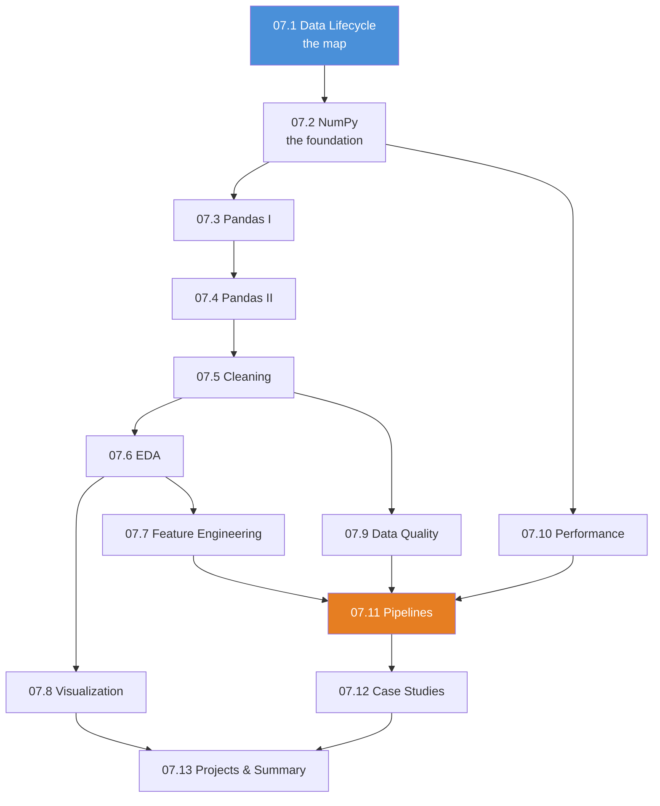

# Module 07 · Data Analysis, Scientific Computing & Visualization — Lessons

[⬅ Module home](../README.md) · [🗺 Roadmap](../../../ROADMAP.md) · [📚 Curriculum](../../../CURRICULUM.md)

> This is the map of Module 07. **Not a tour of libraries — a complete workflow.** Raw, messy, real data goes in one end; a production-ready, validated, versioned dataset comes out the other. Everything here builds toward Machine Learning.

---

## The promise of this module

> [!IMPORTANT]
> **You will spend 60–80% of your career as an AI Engineer on the work in this module, and roughly 0% of the glory.** Model architecture is what gets talked about; data quality is what determines whether the model works. A mediocre model on excellent data beats a state-of-the-art model on garbage, every single time, and it isn't close.
>
> This module is the one that makes you *employable*. Master it and you will out-perform people who know more about Transformers than you do.

**The rule that governs everything here:** *garbage in, garbage out* — except in ML it's worse, because **garbage in produces a plausible-looking model that quietly fails in production**. There's no stack trace. The loss goes down. The demo works. And six weeks later, revenue is down and nobody knows why.

---

## Lessons

| # | Lesson | Section |
|---|---|---|
| 07.1 | [The AI Data Lifecycle](07.1-data-lifecycle.md) | §1 raw → collection → validation → … → monitoring |
| 07.2 | [NumPy — Internals & Performance](07.2-numpy.md) | §2 ndarray internals, memory layout, vectorization, broadcasting, views vs copies |
| 07.3 | [Pandas I — Series, DataFrames & Indexing](07.3-pandas-fundamentals.md) | §3a Series, DataFrame, Index, MultiIndex, I/O, dtypes |
| 07.4 | [Pandas II — Combining, Grouping & Time](07.4-pandas-advanced.md) | §3b merge/join, groupby, pivot, window ops, time series |
| 07.5 | [Data Cleaning](07.5-data-cleaning.md) | §4 missing values, duplicates, invalid values, outliers, scaling, encoding |
| 07.6 | [Exploratory Data Analysis](07.6-eda.md) | §5 descriptive stats, distributions, correlation, skew, kurtosis |
| 07.7 | [Feature Engineering](07.7-feature-engineering.md) | §6 selection, extraction, scaling, encoding, interactions, date/time, text |
| 07.8 | [Visualization](07.8-visualization.md) | §7 matplotlib, plotly, chart selection, the plots that matter |
| 07.9 | [Data Quality](07.9-data-quality.md) | §8 integrity, consistency, completeness, accuracy, lineage |
| 07.10 | [Performance & Scale](07.10-performance.md) | §9 vectorization, memory, chunking, CSV vs Parquet vs Arrow |
| 07.11 | [Reusable Data Pipelines](07.11-pipelines.md) | §10 pipeline design, validation, reproducibility, dataset versioning |
| 07.12 | [Real AI Case Studies](07.12-case-studies.md) | §11 churn, house prices, sentiment, image metadata, forecasting |
| 07.13 | [Projects & Summary](07.13-projects-summary.md) | §12 seven projects + module consolidation |

### Companion artifacts
- 🏋️ [Exercises](../exercises/) — conceptual, NumPy, Pandas, cleaning, visualization, full-dataset analysis
- 🧠 [Flashcards](../flashcards/deck.md) — spaced-repetition deck
- 📝 [Quiz](../quizzes/quiz-01.md) — self-assessment with answers
- 📄 [Cheat sheet](../cheat-sheets/data-cheatsheet.md) — NumPy + Pandas + plotting quick reference

---

## How the lessons build

**Estimated time:** ~22 hours reading · ~10 hours projects · ~4 hours review.

---

## What carries over from Module 06

This module is where [Module 06's mathematics](../../06-Mathematics/README.md) stops being theory:

| From Module 06 | Where it lands here |
|---|---|
| [Vectorization & broadcasting](../../06-Mathematics/weeks/06.9-numerical-computing.md) | [07.2](07.2-numpy.md) — the 100–1000× speedup, made routine |
| [Mean, median, percentiles](../../06-Mathematics/weeks/06.6-statistics.md) | [07.6](07.6-eda.md) — and why the mean lies to you |
| [Correlation ≠ causation](../../06-Mathematics/weeks/06.6-statistics.md) | [07.6](07.6-eda.md), [07.7](07.7-feature-engineering.md) — and correlation ≈ leakage |
| [Distributions](../../06-Mathematics/weeks/06.5-probability.md) | [07.6](07.6-eda.md) — skew, kurtosis, and what to do about them |
| [Standardization $(x-\mu)/\sigma$](../../06-Mathematics/weeks/06.6-statistics.md) | [07.5](07.5-data-cleaning.md) — and the fit-on-train-only rule |
| [The i.i.d. assumption](../../06-Mathematics/weeks/06.5-probability.md) | [07.12](07.12-case-studies.md) — why random-splitting time series destroys models |
| [float32 vs float64](../../06-Mathematics/weeks/06.9-numerical-computing.md) | [07.10](07.10-performance.md) — a 2× memory decision you make every day |

> [!TIP]
> **Get a real, messy dataset before lesson 07.3.** Not the Titanic. Not Iris. Something with genuine problems — a Kaggle competition dataset, your company's export, a public government CSV. **This module is only worth doing against data that fights back.** Clean data teaches you nothing, because the entire skill is what you do when the data is wrong.
