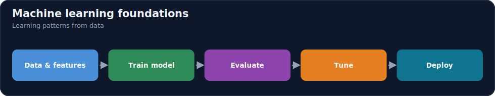
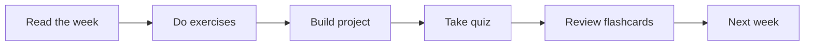

# Module 08 · Machine Learning

[⬅ 07 · Data Analysis](../07-Data-Analysis/README.md) · [🏠 docs](../README.md) · [🗺 Roadmap](../../ROADMAP.md) · [09 · Deep Learning ➡](../09-Deep-Learning/README.md)

> Classical ML from first principles: models, evaluation, and error analysis.

---

## Purpose

This module covers **Machine Learning**. Classical ML from first principles: models, evaluation, and error analysis. It fits into the overall program as described in the [Roadmap](../../ROADMAP.md) and [Curriculum](../../CURRICULUM.md).

## What you'll learn

- The end-to-end ML workflow and data leakage
- Regression, trees, and ensembles
- The bias–variance tradeoff
- Evaluation, metrics, and error analysis

## 📖 Lessons (start here)

> ✅ **This module's content is written.** Work through the lessons in order via the [lesson index](weeks/README.md).

| # | Lesson |
|---|---|
| 08.1 | [What Is Machine Learning?](weeks/08.1-what-is-ml.md) |
| 08.2 | [The ML Workflow](weeks/08.2-ml-workflow.md) |
| 08.3 | [Linear Regression](weeks/08.3-linear-regression.md) |
| 08.4 | [Logistic Regression](weeks/08.4-logistic-regression.md) |
| 08.5 | [Decision Trees](weeks/08.5-decision-trees.md) |
| 08.6 | [Ensembles — Bagging & Boosting](weeks/08.6-ensembles.md) |
| 08.7 | [Support Vector Machines](weeks/08.7-svm.md) |
| 08.8 | [Naive Bayes](weeks/08.8-naive-bayes.md) |
| 08.9 | [K-Nearest Neighbors](weeks/08.9-knn.md) |
| 08.10 | [Clustering](weeks/08.10-clustering.md) |
| 08.11 | [Dimensionality Reduction](weeks/08.11-dimensionality-reduction.md) |
| 08.12 | [Model Evaluation](weeks/08.12-evaluation.md) |
| 08.13 | [Cross-Validation & Leakage](weeks/08.13-cross-validation.md) |
| 08.14 | [Feature Engineering for ML](weeks/08.14-feature-engineering.md) |
| 08.15 | [Hyperparameter Tuning](weeks/08.15-hyperparameter-tuning.md) |
| 08.16 | [Model Interpretability](weeks/08.16-interpretability.md) |
| 08.17 | [Production ML](weeks/08.17-production-ml.md) |
| 08.18 | [Projects & Summary](weeks/08.18-projects-summary.md) |

**Companion artifacts:** [Exercises](exercises/README.md) · [Quiz](quizzes/quiz-01.md) · [Flashcards](flashcards/deck.md) · [Cheat sheet](cheat-sheets/ml-cheatsheet.md)

> [!IMPORTANT]
> **⭐ The rule of this module: from scratch first, library second.**
>
> `LinearRegression().fit(X, y)` is one line, and it teaches you **nothing**. You cannot debug what you cannot picture. So: **derive it → implement it in NumPy → verify against scikit-learn with `np.allclose` → then use the library forever.** That single assertion is the moment scikit-learn stops being magic.
>
> **And the sentence that carries the whole module: every algorithm is a bet about the shape of your data.** Linear regression bets on a straight line. KNN bets that near things are alike. Naive Bayes bets that features are independent. **The one whose bet matches reality wins — and that is the entirety of model selection.**

## How this module is organized

Content is delivered week by week. Each module uses the same subfolders:

| Folder | Contents |
|---|---|
| [`weeks/`](weeks/) | Weekly lesson content, one file per week (`week-01.md`, `week-02.md`, …). |
| [`diagrams/`](diagrams/) | Mermaid sources and exported diagram assets for this module. |
| [`exercises/`](exercises/) | Hands-on practice problems with solutions. |
| [`projects/`](projects/) | Buildable projects that apply this module's skills. |
| [`quizzes/`](quizzes/) | Self-assessment question banks with answer keys. |
| [`flashcards/`](flashcards/) | Spaced-repetition Q/A decks for active recall. |
| [`cheat-sheets/`](cheat-sheets/) | One-page quick references for this module. |
| [`references/`](references/) | Paper summaries and deep-dive notes. |

## Suggested study flow

## File & naming conventions

| Item | Convention | Example |
|---|---|---|
| Weekly lesson | `week-NN.md` | `weeks/week-01.md` |
| Exercise | `exercise-NN.md` (+ `solution-NN.*`) | `exercises/exercise-01.md` |
| Project | `project-NN/` folder with `README.md` | `projects/project-01/` |
| Quiz | `quiz-NN.md` (+ `answers-NN.md`) | `quizzes/quiz-01.md` |
| Flashcards | `deck.md` | `flashcards/deck.md` |
| Diagram | `topic.mmd` / `topic.png` | `diagrams/attention.mmd` |

## Markdown conventions

This file follows the repository Markdown standards — see [CONTRIBUTING.md](../../CONTRIBUTING.md): one H1 per file, tables over prose, GitHub callouts (`> [!NOTE]`), fenced code blocks with a language, Mermaid for diagrams, and relative internal links.

## Related modules

- [Mathematics](../06-Mathematics/README.md)
- [Deep Learning](../09-Deep-Learning/README.md)

---

## Navigation

| Direction | Link |
|---|---|
| ⬆ Parent | [docs/](../README.md) |
| ⬅ Previous | [⬅ 07 · Data Analysis](../07-Data-Analysis/README.md) |
| ➡ Next | [09 · Deep Learning ➡](../09-Deep-Learning/README.md) |
| 🗺 Roadmap | [ROADMAP.md](../../ROADMAP.md) |
| 📚 Curriculum | [CURRICULUM.md](../../CURRICULUM.md) |
| 🏠 Repo root | [README.md](../../README.md) |
