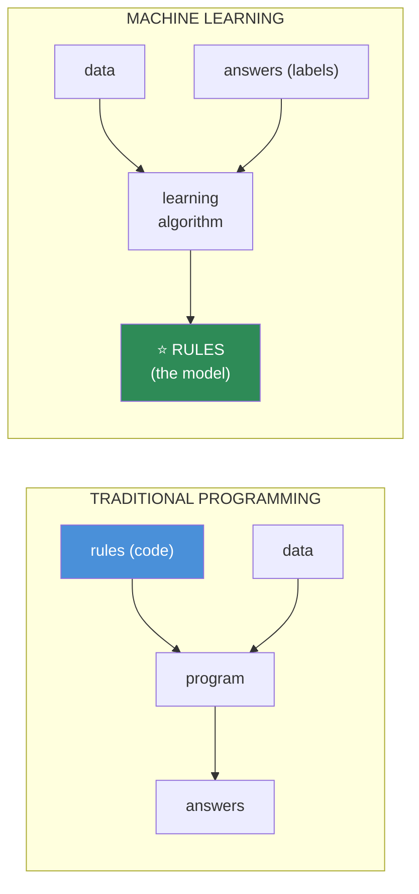
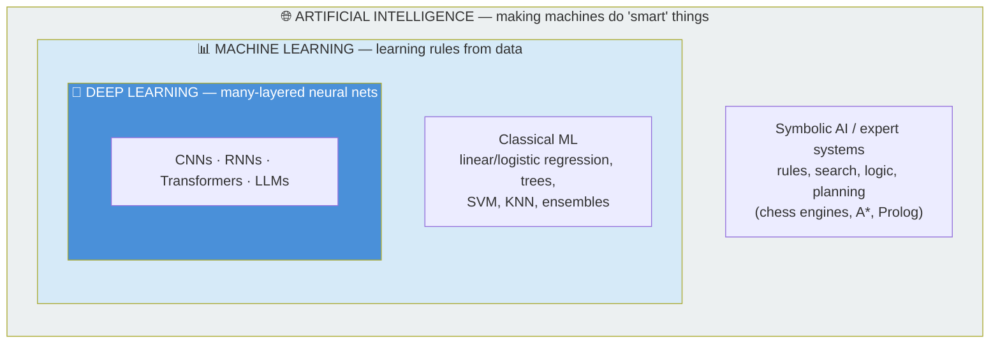
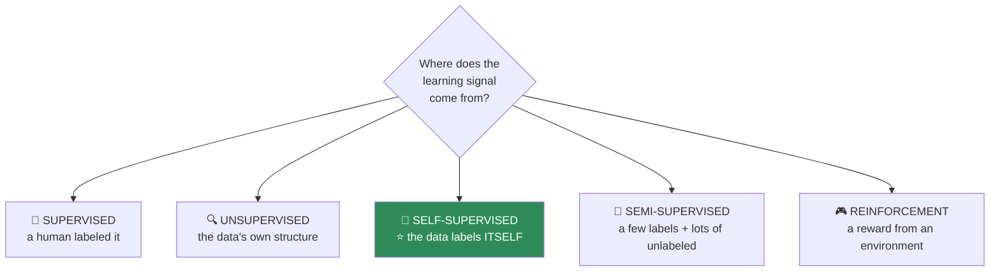
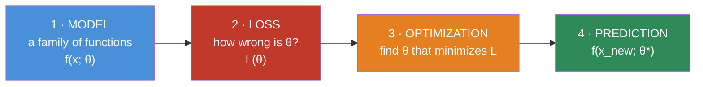
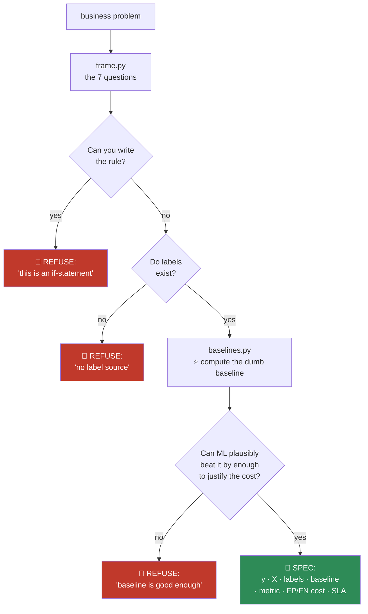

# 08.1 · What Is Machine Learning?

[⬅ Lesson index](README.md) · [🏠 Module 08](../README.md) · [➡ 08.2 The ML Workflow](08.2-ml-workflow.md)

> **The lesson in one line:** Machine learning is what you do when you can state *what* you want but cannot state *how* to get it — you show the computer examples and let it search for the rule.

---

## 🎯 Learning objectives

By the end of this lesson you can:

1. Explain the difference between **AI, ML, and Deep Learning** without hand-waving.
2. State the **one condition** under which ML is the right tool — and the many under which it isn't.
3. Distinguish **supervised, unsupervised, semi-supervised, self-supervised**, and **reinforcement** learning by what supplies the signal.
4. Explain why **self-supervised learning** is the idea that made LLMs possible.
5. Frame any business problem as an ML problem — **or correctly refuse to**.

---

## 🧠 Mental model

> **Traditional programming: you write the rules. Machine learning: you write the *examples*, and the computer finds the rules.**



**The arrows reversed.** In traditional programming, rules + data → answers. In ML, **data + answers → rules.** That inversion is the entire idea, and everything else in this module is machinery for making the search for those rules efficient.

### The one-sentence test for whether you need ML

> **Can you write down the rule?**

| Task | Can you write the rule? | Use |
|---|---|---|
| Compute sales tax | ✅ Yes, exactly | **Code.** Not ML |
| Sort a list | ✅ Yes | **Code** |
| Validate an email format | ✅ Yes (a regex) | **Code** |
| Recognize a cat in a photo | ❌ No — try. *"Fur? Ears? Whiskers?"* You'll fail | **ML** |
| Predict which customer will churn | ❌ No — the rule is a fuzzy interaction of 40 signals | **ML** |
| Translate English to French | ❌ No — 50 years of linguists tried | **ML** |

> [!IMPORTANT]
> **If you can write the rule, write the rule.** A `WHERE` clause is faster, cheaper, testable, auditable, deterministic, and won't drift. **The single most common failure in applied AI is using ML where an `if` statement would have worked** — and then spending six months maintaining a model that a five-line function could have replaced.
>
> **ML is for when the rule exists but is too complex, too fuzzy, or too changeable for a human to write down.** That's it. That's the whole criterion.

---

## 📖 AI vs ML vs Deep Learning



| | **Artificial Intelligence** | **Machine Learning** | **Deep Learning** |
|---|---|---|---|
| **Definition** | Any technique making machines act "intelligently" | Systems that **learn rules from data** | ML with **many-layered neural networks** |
| **Includes** | Search, logic, planning, rules, **and ML** | Regression, trees, SVM, **and DL** | CNNs, RNNs, Transformers |
| **Features** | Hand-coded | **Hand-engineered** (you build them) | **Learned automatically** ⭐ |
| **Data needed** | Sometimes none | 100s – 100,000s of rows | **Millions+** |
| **Interpretable** | ✅ Usually | 🟡 Often | ❌ Rarely |
| **Best for** | Well-specified rules | **Tabular data** ⭐ | Images, audio, **text** |
| **Born** | 1950s | 1980s–90s | 2012 (AlexNet) |

> [!IMPORTANT]
> **The one distinction that matters: who builds the features?**
>
> In **classical ML**, *you* build them. You decide that `price / sqft` matters, that hour-of-day should be cyclically encoded, that `days_since_last_login` predicts churn ([07.7](../../07-Data-Analysis/weeks/07.7-feature-engineering.md)). The algorithm just fits a function to the features you handed it.
>
> In **deep learning**, the network **learns the features itself**. That's what the layers *are* — successive learned representations. This is why DL crushed computer vision (nobody could hand-engineer a "cat detector") and why it left tabular data largely alone (**you can hand-engineer `price/sqft` perfectly well, and gradient boosting will use it better than a neural net**).
>
> **This single fact tells you when to use which**, and it's the reason Module 08 exists *before* Module 09.

### The unglamorous truth

> [!TIP]
> **For tabular data — which is most business ML — gradient boosting (XGBoost/LightGBM) still beats deep learning.** This has been tested repeatedly and it keeps being true. Deep learning won *images, audio, and text*. **It did not win spreadsheets.**
>
> Most of the ML that generates revenue in the world is **a gradient-boosted tree on 40 hand-built features**. It is unfashionable, it is boring, and it works. **This module teaches you that**, and it will make you more employable than another Transformer tutorial.

---

## 🗂️ The five kinds of learning

**Classified by one question: *where does the learning signal come from?***



### 1 · Supervised learning — *"here are the answers"*

You have `(X, y)` pairs. **The model learns the mapping X → y.**

| Type | y is | Examples |
|---|---|---|
| **Regression** | Continuous | House price, demand forecast, expected revenue |
| **Classification** | Discrete | Spam/not, churn/not, digit 0–9, disease/healthy |

**~90% of ML in production is supervised**, and **the entire bottleneck is labels.** They're expensive, slow, and often noisy. *"How do we get labels?"* is the real first question of most ML projects — and it's the one nobody in the meeting wants to answer.

### 2 · Unsupervised learning — *"find the structure"*

No `y`. **The signal is the geometry of the data itself.**

| Task | Algorithm | Use |
|---|---|---|
| **Clustering** | K-Means, DBSCAN ([08.10](08.10-clustering.md)) | Customer segments, topic grouping |
| **Dimensionality reduction** | PCA, UMAP ([08.11](08.11-dimensionality-reduction.md)) | Compression, visualization, denoising |
| **Anomaly detection** | Isolation Forest | Fraud, intrusion, equipment failure |

> [!WARNING]
> **Unsupervised learning is seductive and hard to validate.** You have no ground truth — so *"are these clusters real, or did K-Means just cut the data into k pieces because I told it to?"* has no clean answer. **K-Means will happily return 5 clusters from pure noise.** Always sanity-check against something external: do the segments differ on a metric you *didn't* cluster on?

### 3 · Semi-supervised — *"a few labels, lots of data"*

You have 1,000 labeled examples and 1,000,000 unlabeled ones. **Use the unlabeled data's structure to make the labels go further.**

*(Pseudo-labeling: train on the labeled set, predict on the unlabeled, keep the confident predictions as new labels, retrain. It works — and it can also confidently reinforce its own mistakes.)*

### 4 · Self-supervised — ⭐ **the one that changed everything**

**The data labels itself.** You invent a task where the answer is *already in the data*.

| Domain | The invented task | The result |
|---|---|---|
| **Text** | **"Predict the next word"** | **GPT.** The label is just… the next word. It was always there |
| Text | "Predict the masked word" | BERT |
| Images | "Are these two crops of the same photo?" | SimCLR, CLIP |
| Audio | "Predict the masked audio segment" | wav2vec |

> [!IMPORTANT]
> **Self-supervised learning is the single most important idea in modern AI, and it is embarrassingly simple: the internet is already labeled.**
>
> Every sentence ever written is a stack of free training examples — *"given these words, what comes next?"* **No human labeled anything.** The label was sitting in the data the whole time, and someone realized you could just… use it.
>
> **This is why LLMs exist.** Supervised learning is bottlenecked by human labeling (expensive, slow, finite). Self-supervision has **no such bottleneck** — you can train on the entire internet. That's the unlock. Everything about the last five years follows from it.
>
> And it connects straight to [06.5](../../06-Mathematics/weeks/06.5-probability.md): an LLM is estimating $P(w_t \mid w_{<t})$, and the training signal for that is **free**.

### 5 · Reinforcement learning — *"learn from consequences"*

An **agent** takes **actions** in an **environment** and receives **rewards**. It learns a **policy** that maximizes cumulative reward.


**Where it works:** games (AlphaGo, Atari), robotics, and — crucially — **RLHF**, which is how a raw LLM becomes a helpful assistant ([06.8](../../06-Mathematics/weeks/06.8-information-theory.md)'s KL-leash).

**Where it doesn't:** almost everywhere else. RL is **sample-inefficient** (millions of trials), needs a **simulator** or a very forgiving environment, and is notoriously unstable to train. **It is the right tool far less often than its fame suggests.**

---

## 🎯 Framing a business problem as an ML problem

**This is the skill that separates engineers who ship ML from engineers who build models nobody uses.**

| Ask | Why |
|---|---|
| **1. What decision will this change?** | If no decision changes, **don't build it**. A model nobody acts on is a very expensive dashboard |
| **2. What is `y`?** | Be brutally precise. "Churn" = *cancelled within 30 days of the prediction date*. Not "seemed unhappy" |
| **3. What is `X`, at prediction time?** | Not what's in the database — **what exists at the moment you must predict** ([07.1](../../07-Data-Analysis/weeks/07.1-data-lifecycle.md)) |
| **4. Where do labels come from?** | The question that kills most projects. And **how long until you have them?** |
| **5. What's the baseline?** | *"Predict the majority class"* / *"use last month's value."* **If you can't beat it, stop** |
| **6. What error is acceptable?** | A false positive and a false negative rarely cost the same. **Say so, in currency** |
| **7. Can it be served in the latency budget?** | A feature needing a 200 ms lookup in a 50 ms SLA is not a feature |

> [!CAUTION]
> **Always build the dumb baseline first, and always report it.** Predict the mean. Predict the majority class. Predict "same as last week." **A shocking number of production ML models do not beat these** — and nobody found out, because nobody measured.
>
> **If your fancy model beats the baseline by 1%, you have not built an ML system. You have built a maintenance burden.**

---

## ⚙️ Internal implementation — what "learning" actually is

Every supervised algorithm in this module is the **same four things**. Memorize this skeleton; the whole module is variations on it.



| Algorithm | 1 · Model | 2 · Loss | 3 · Optimizer |
|---|---|---|---|
| **Linear regression** | $w^\top x + b$ | MSE | Normal equations *or* gradient descent |
| **Logistic regression** | $\sigma(w^\top x + b)$ | Log-loss (cross-entropy) | Gradient descent |
| **Decision tree** | Nested if/else | Gini / entropy | Greedy recursive splitting |
| **SVM** | $w^\top x + b$ (max margin) | Hinge + L2 | Quadratic programming / SGD |
| **KNN** | *(none — it memorizes)* | *(none)* | *(none — lazy!)* |
| **Neural net** | Stacked matmul + nonlinearity | Cross-entropy / MSE | SGD + backprop |

> [!IMPORTANT]
> **"Learning" is just optimization** ([06.7](../../06-Mathematics/weeks/06.7-optimization.md)). There is no magic. You define a family of functions, you define what "wrong" means, and you search for the parameters that are least wrong.
>
> **The differences between algorithms are just different choices for those three boxes** — and each choice is a **bet about the shape of your data**. Linear regression bets the relationship is a straight line. KNN bets that nearby points are alike. Naive Bayes bets features are independent. **The algorithm that wins is the one whose bet matches reality**, and that is the entirety of model selection.

---

## 🏭 Production examples

| Product | Task | Type | Algorithm |
|---|---|---|---|
| Gmail spam filter | Is this spam? | Supervised classification | Naive Bayes → now neural |
| Netflix "because you watched" | What next? | Collaborative filtering | Matrix factorization ([06.3](../../06-Mathematics/weeks/06.3-linear-algebra-decomposition.md)) |
| Credit scoring | Will they default? | Supervised classification | **Gradient boosting** (+ interpretability requirements) |
| Uber ETA | How long? | Supervised regression | Gradient boosting |
| Fraud detection | Is this fraud? | Supervised, **heavily imbalanced** | GBM + anomaly detection |
| ChatGPT | Next token | **Self-supervised** ⭐ | Transformer |
| Customer segments | Who's similar? | Unsupervised | K-Means |

**Notice how much of that list is gradient boosting.** That's not an accident.

---

## ⚡ Performance considerations

| Consideration | Reality |
|---|---|
| **Data > algorithm** | 2× the data usually beats a 2× fancier model ([07.1](../../07-Data-Analysis/weeks/07.1-data-lifecycle.md): +0.7pp vs +16.9pp) |
| **Features > algorithm** | +10–40% vs +3–8% ([07.7](../../07-Data-Analysis/weeks/07.7-feature-engineering.md)) |
| **Training vs inference cost** | Train once (hours, offline); infer millions of times (milliseconds, online). **Optimize inference** |
| **Model size** | A 40-tree GBM is a few MB. A 7B LLM is 14 GB. **This determines where it can run** |
| **Latency** | Linear/tree models: microseconds. Deep nets: milliseconds. **KNN: it depends on your entire training set** 😬 |

---

## 🐛 Common mistakes

| Mistake | Consequence |
|---|---|
| **Using ML when an `if` would do** | The #1 error in applied AI. Six months of maintenance for a five-line function |
| **Not building a baseline** | You don't know whether your model is any good |
| **Starting with deep learning on tabular data** | GBM would have been better, faster, and interpretable |
| Confusing AI, ML, and DL in a meeting | You lose credibility with the people who know |
| **Building a model nobody will act on** | An expensive dashboard |
| Assuming labels exist | *"How do we get labels?"* kills more projects than any modelling failure |
| **Trusting unsupervised results without validation** | K-Means returns 5 clusters from pure noise, happily |
| Thinking RL is the answer | It's sample-inefficient, unstable, and needs a simulator |

---

## 📝 Exercises

**Conceptual**
1. Explain AI vs ML vs DL to a non-technical stakeholder in three sentences.
2. **The key distinction: who builds the features?** Explain why that answers "when should I use deep learning?"
3. Why is self-supervised learning the idea that made LLMs possible? What bottleneck did it remove?
4. Why does gradient boosting still beat deep learning on tabular data?

**Problem framing** — the most valuable exercises here
5. For each, decide **ML or not ML**, and justify: (a) compute shipping cost by weight and zone; (b) detect fraudulent transactions; (c) validate a postcode; (d) recommend a product; (e) decide whether to grant a loan; (f) route a support ticket to the right team.
6. Take *"we want to reduce customer churn"* and turn it into a precise ML problem. Define `y` (exactly — including the time window), `X` (at prediction time), the label source, the **baseline**, and the **cost of a false positive vs a false negative, in currency.**
7. Your manager wants "an AI that improves customer satisfaction." **Write the three questions you'd ask before agreeing to build anything.**

**Algorithm comparison**
8. For each of the four learning types, name a problem where it's the *right* choice and one where it is not.
9. Fill in the four-box skeleton (model / loss / optimizer / prediction) for linear regression, decision trees, and KNN. **What's strange about KNN's?**

---

## 🛠️ Mini project — *The ML Problem Framer*

Build `code/08-machine-learning/problem-framer/` — a tool (and a discipline) that stops you building the wrong thing.

**Requirements**
- Take a business problem as input; produce a **structured ML spec** — or a documented refusal.
- **Force** the seven framing questions to be answered before any modelling.
- Compute the **baseline** automatically and report whether the ML gain justifies the cost.

```
problem-framer/
├── README.md
├── src/
│   ├── frame.py          # the 7 questions → a structured spec
│   ├── baselines.py      # ⭐ majority / mean / last-value / random
│   ├── feasibility.py    # labels available? latency budget? data volume?
│   └── report.py         # a spec doc, or a REFUSAL with reasons
├── tests/
│   └── test_baselines.py
└── specs/
    ├── churn.yaml
    └── refused/
        └── satisfaction.md    # ⭐ why we did NOT build this
```

**Architecture**



**Implementation guidance**
1. **`baselines.py` is the heart of it.** Majority class, mean, median, last-value (for time series), and random-stratified. **Every model you ever build must be reported against these.** Make it one function call so there is no excuse.
2. **The `specs/refused/` directory is the point.** A framer that never refuses isn't a framer. **Document the projects you *didn't* build and why** — that folder will eventually be the most valuable thing in your repository, and the thing that gets you promoted.
3. **Force the FP/FN cost into currency.** *"A false positive costs us a $5 support contact. A false negative costs us a $2,000 customer."* **That ratio determines your decision threshold** ([08.12](08.12-evaluation.md)) — and if nobody will give you the numbers, that itself is a finding worth escalating.

**Evaluation strategy:** for each spec, the deliverable is a **decision**, not a model. *"Ship it," "don't build it," or "get labels first."*

**Testing plan:** feed it five real problems (including two that should be refused). Assert it refuses the right ones. **A framer that approves everything is a rubber stamp.**

**Future improvements:** add an expected-value calculator — `EV = P(correct) × value − P(FP) × cost_FP − P(FN) × cost_FN` — so a model's *business* value, not its AUC, drives the go/no-go.

---

## 📄 Cheat sheet

| | |
|---|---|
| **Traditional programming** | rules + data → answers |
| **Machine learning** | **data + answers → RULES** |
| **The test for ML** | **"Can you write the rule?"** If yes → **write the rule** |
| **AI ⊃ ML ⊃ DL** | AI = smart machines · ML = learns from data · DL = many-layered nets |
| **The key distinction** | **Who builds the features?** You (ML) vs the network (DL) |
| **Tabular data** | ✅ **Gradient boosting still wins.** Not deep learning |

| Learning type | Signal comes from |
|---|---|
| **Supervised** | A human labeled it. **~90% of production ML.** Bottleneck: **labels** |
| **Unsupervised** | The data's own geometry. ⚠️ Hard to validate |
| **Semi-supervised** | A few labels + lots of unlabeled data |
| **Self-supervised** ⭐ | **The data labels itself** ("predict the next word") → **LLMs** |
| **Reinforcement** | Reward from an environment. Sample-inefficient; rarer than its fame |

**Every supervised algorithm = MODEL + LOSS + OPTIMIZER + PREDICT.**
**Every algorithm is a bet about the shape of your data.**
**Always build the dumb baseline. Always report it.**

---

## 🎴 Flashcards

- **Q:** ⭐ What's the one test for whether you need ML? → **A:** **"Can you write the rule?"** If yes, **write the rule** — it's faster, cheaper, testable, deterministic, and won't drift. ML is for when the rule is too complex/fuzzy/changeable for a human to state.
- **Q:** AI vs ML vs DL? → **A:** **AI** ⊃ **ML** ⊃ **DL**. AI = any technique making machines act smart (incl. rules/search). ML = **learns rules from data**. DL = ML with many-layered neural networks.
- **Q:** ⭐ The key distinction between classical ML and deep learning? → **A:** **Who builds the features.** In ML *you* engineer them; in DL the **network learns them**. That's why DL won images/audio/text and **didn't win tabular data**.
- **Q:** What still beats deep learning on tabular data? → **A:** **Gradient boosting** (XGBoost/LightGBM). Repeatedly tested, still true. Most revenue-generating ML in the world is a GBM on 40 hand-built features.
- **Q:** ⭐ Why is self-supervised learning the idea that made LLMs possible? → **A:** **The data labels itself** — "predict the next word" needs **no human labeling**. It removes the label bottleneck entirely, so you can train on the whole internet.
- **Q:** Name the five learning types by their signal source. → **A:** **Supervised** (a human labeled it) · **Unsupervised** (the data's geometry) · **Semi-supervised** (few labels + much unlabeled) · **Self-supervised** (the data labels itself) · **Reinforcement** (reward from an environment).
- **Q:** What's the four-part skeleton of every supervised algorithm? → **A:** **Model** (a function family) + **Loss** (how wrong) + **Optimizer** (find the best θ) + **Predict**. "Learning" is just optimization.
- **Q:** Why is a baseline mandatory? → **A:** *"Predict the majority class"* / *"same as last week."* **A shocking number of production models don't beat these** — and nobody found out because nobody measured.
- **Q:** Why is unsupervised learning hard to validate? → **A:** **No ground truth.** K-Means will happily return 5 clusters from pure noise. Always check against something external you *didn't* cluster on.
- **Q:** What is every algorithm, fundamentally? → **A:** **A bet about the shape of your data.** Linear = a straight line. KNN = near things are alike. Naive Bayes = features are independent. **The one whose bet matches reality wins.**

---

## 💼 Interview questions

1. **"What's the difference between AI, ML, and deep learning?"** — Nested sets. **Then volunteer the feature distinction** (who builds them) — that's the answer that shows you actually understand it, rather than having memorized a Venn diagram.
2. **"When would you *not* use machine learning?"** — **The best question in this lesson.** When you can write the rule; when you have no labels; when you can't beat the baseline; when nobody will act on the output; when you need auditability and can't get it.
3. **"Your manager wants a deep learning model for tabular customer data. Respond."** — Push back, politely: **GBM will likely beat it**, train in seconds instead of hours, be interpretable (which credit/insurance often legally *requires*), and be easier to deploy. Offer to run both and show the numbers.
4. **"Explain self-supervised learning and why it matters."** — The data labels itself; no human annotation; removes the label bottleneck; **this is why LLMs exist**.
5. **"How would you frame 'reduce churn' as an ML problem?"** — Define `y` precisely (cancelled within 30 days of the prediction date), `X` at prediction time only, the label source and its delay, the **baseline**, the metric (**PR-AUC**, because churn is imbalanced), and **the FP/FN cost in currency** — which sets your threshold.

---

## 📚 Summary

- **Traditional programming: rules + data → answers. Machine learning: data + answers → RULES.** The arrows reversed. That's the whole idea.
- **The test for whether you need ML: "can you write the rule?"** If yes, **write the rule.** Using ML where an `if` statement would work is the most common failure in applied AI.
- **AI ⊃ ML ⊃ DL.** The distinction that matters is **who builds the features** — you (classical ML) or the network (deep learning). That single fact explains why DL won images/audio/text and **why gradient boosting still owns tabular data.**
- **Five kinds of learning, distinguished by where the signal comes from:** supervised (a human labeled it — ~90% of production ML, bottlenecked by labels), unsupervised (the data's geometry — hard to validate), semi-supervised, **self-supervised (the data labels itself — the idea that made LLMs possible)**, and reinforcement (reward from an environment — rarer than its fame).
- **Every supervised algorithm is the same four boxes:** a **model**, a **loss**, an **optimizer**, and a **prediction**. *"Learning" is just optimization.*
- **Every algorithm is a bet about the shape of your data.** The one whose bet matches reality wins — and that is the entirety of model selection.
- **Always build the dumb baseline, and always report it.** If your model beats "predict the majority class" by 1%, you have built a maintenance burden, not an ML system.

**Next:** [08.2 The ML Workflow](08.2-ml-workflow.md) — the end-to-end process that turns a framed problem into a monitored production system.

---

## 🔗 References

- Ng — *Machine Learning Yearning* (free). **On problem framing, baselines, and error analysis.** Short, and worth more than most textbooks.
- Domingos (2012) — *A Few Useful Things to Know About Machine Learning* (CACM). **The single best 9-page introduction to ML that exists.** Read it today.
- Géron — *Hands-On Machine Learning*, Ch. 1. The standard practical text for this whole module.
- Hastie, Tibshirani & Friedman — *The Elements of Statistical Learning* (free PDF). The rigorous reference. Skim now; return later.
- LeCun, Bengio & Hinton (2015) — *Deep Learning* (Nature) — the DL manifesto, and clear on the **learned-features** distinction.
- Grinsztajn et al. (2022) — *Why do tree-based models still outperform deep learning on tabular data?* — **the receipts** for the unglamorous truth in this lesson.

---

## 🧭 Navigation

| Direction | Link |
|---|---|
| ⬅ Previous | [Lesson index](README.md) |
| ➡ Next | [08.2 The ML Workflow](08.2-ml-workflow.md) |
| 🏠 Module | [Module 08](../README.md) |
| 🗺 Roadmap | [ROADMAP.md](../../../ROADMAP.md) |
