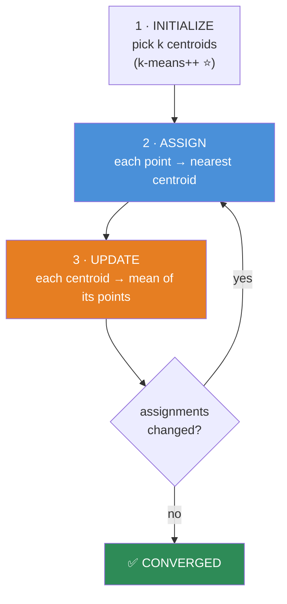
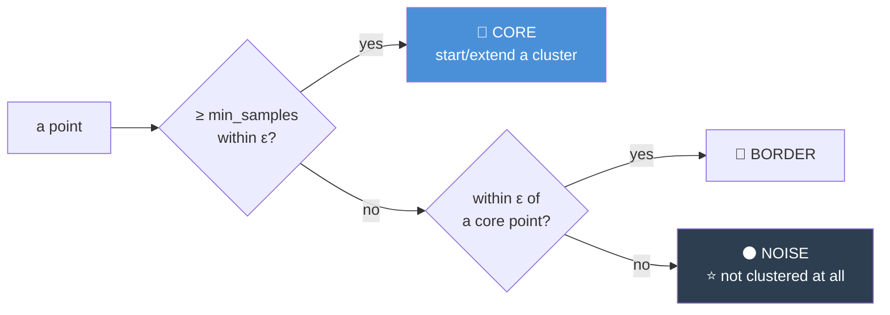
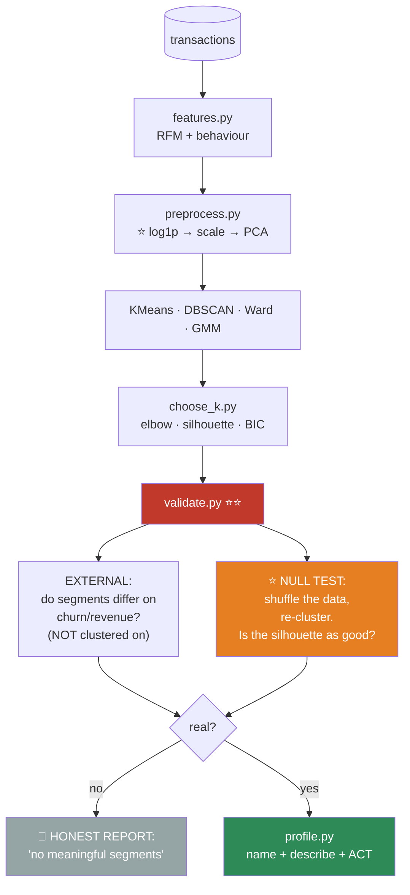

# 08.10 · Clustering

[⬅ 08.9 K-Nearest Neighbors](08.9-knn.md) · [🏠 Module 08](../README.md) · [➡ 08.11 Dimensionality Reduction](08.11-dimensionality-reduction.md)

> **The lesson in one line:** Find groups in data that has no labels — which is seductive, easy to run, and **almost impossible to validate**, because K-Means will happily hand you five beautiful clusters from pure noise.

---

## 🎯 Learning objectives

By the end of this lesson you can:

1. Implement **K-Means** from scratch and explain its convergence guarantee (and its guarantee's limits).
2. Explain what K-Means **assumes** — and see it fail spectacularly when the assumption breaks.
3. Choose **k** with the elbow method and silhouette score — and know why both are unreliable.
4. Use **DBSCAN** for arbitrary shapes and outlier detection.
5. Use **hierarchical clustering** when you don't want to pick k up front.
6. **Validate a clustering** — the hard part, and the part everyone skips.

---

## 🧠 Mental model

> **⚠️ Clustering always returns an answer. That is its most dangerous property.**


> [!CAUTION]
> **You told K-Means to find 5 clusters. It found 5 clusters. That is not evidence that 5 clusters exist.**
>
> **There is no ground truth in unsupervised learning**, so there is no test-set accuracy to save you. **The burden of proving the clusters are real falls entirely on you** — and it is the single most-skipped step in applied ML.
>
> **The validation question is: do these clusters differ on something you did NOT cluster on?** If your "customer segments" have identical churn rates, identical revenue, and identical support-ticket volume, **you have partitioned your data and learned nothing.**

---

## 1 · K-Means

### The algorithm — Lloyd's algorithm



**It minimizes within-cluster sum of squares (inertia):**

$$J = \sum_{i=1}^{n} \|x_i - \mu_{c_i}\|^2$$

> [!IMPORTANT]
> **Two facts about K-Means' optimization, and both matter:**
> 1. **It is guaranteed to converge** — each step (assign, update) can only *decrease* J, and there are finitely many assignments. **It will stop.**
> 2. **It is NOT guaranteed to find the global optimum.** The objective is **non-convex**, and Lloyd's algorithm is a local search. **Different initializations give different answers.**
>
> **This is why `n_init=10` exists** — run it 10 times from different starts and keep the best. **And it's why `k-means++` initialization matters**: instead of picking random starting centroids, it picks them **far apart from each other** (probabilistically), which dramatically improves both the result and the convergence speed. **Always use it. It's sklearn's default for good reason.**

### ⭐ What K-Means assumes — and how it breaks

| Assumption | Broken by |
|---|---|
| Clusters are **spherical** (isotropic) | Elongated, curved, or ring-shaped clusters |
| Clusters have **similar size** | One huge cluster + one tiny one |
| Clusters have **similar density** | One dense + one diffuse |
| You **know k** | You almost never do |
| Every point **belongs** to a cluster | Outliers get forced into one, dragging the centroid |

> [!CAUTION]
> **K-Means draws Voronoi cells — straight-line boundaries between centroids.** It structurally *cannot* find a crescent, a ring, or a spiral.
>
> **And it has no concept of "noise."** Every point is assigned to a cluster, including outliers — which **drag the centroids toward them** and corrupt the whole partition. **One extreme outlier can meaningfully move a centroid**, exactly as one outlier dominates MSE ([08.3](08.3-linear-regression.md)). *(Same reason. It's the same squared-error objective.)*

> 🖼️ **[IMAGE PLACEHOLDER: `assets/images/08-clustering-comparison.png`]**
> *A 3×4 grid. **Rows = datasets:** (1) three well-separated blobs, (2) two concentric circles, (3) two crescent moons. **Columns = algorithms:** K-Means (k=2 or 3), Hierarchical (Ward), DBSCAN, Gaussian Mixture. Points coloured by assigned cluster; K-Means centroids marked with X's and Voronoi boundaries drawn faintly. **Row 1: everything works** — all four find the blobs. **Row 2 (circles): K-Means fails completely** (it slices the rings in half with a straight line); **DBSCAN nails it perfectly.** **Row 3 (moons): K-Means fails; DBSCAN nails it.** DBSCAN's noise points are drawn in black. Caption: "K-Means draws straight lines between centroids. It cannot find a ring. DBSCAN follows density, so it can."*

### 🐍 From scratch

```python
import numpy as np


class KMeansScratch:
    def __init__(self, k=3, max_iters=300, tol=1e-4, n_init=10, random_state=None):
        self.k = k
        self.max_iters = max_iters
        self.tol = tol
        self.n_init = n_init                    # ⭐ non-convex → restart and keep the best
        self.rng = np.random.default_rng(random_state)
        self.centroids_ = None
        self.labels_ = None
        self.inertia_ = np.inf

    # ── ⭐ k-means++ : pick starting centroids FAR APART ───────────
    def _init_centroids(self, X):
        n = len(X)
        centroids = [X[self.rng.integers(n)]]                 # 1st: random
        for _ in range(self.k - 1):
            # distance from each point to its NEAREST existing centroid
            d2 = np.min([np.sum((X - c) ** 2, axis=1) for c in centroids], axis=0)
            probs = d2 / d2.sum()                             # ⭐ far points are more likely
            centroids.append(X[self.rng.choice(n, p=probs)])
        return np.array(centroids)

    def _fit_once(self, X):
        centroids = self._init_centroids(X)

        for it in range(self.max_iters):
            # ── 2 · ASSIGN: each point → nearest centroid ──
            #    vectorized via the matmul expansion (08.9)
            d2 = (np.sum(X**2, axis=1, keepdims=True)
                  - 2 * X @ centroids.T
                  + np.sum(centroids**2, axis=1))             # (n, k)
            labels = np.argmin(d2, axis=1)

            # ── 3 · UPDATE: each centroid → mean of its points ──
            new_centroids = np.array([
                X[labels == j].mean(axis=0) if (labels == j).any()
                else X[self.rng.integers(len(X))]             # ⚠️ empty cluster → reseed
                for j in range(self.k)
            ])

            shift = np.linalg.norm(new_centroids - centroids)
            centroids = new_centroids
            if shift < self.tol:                              # ✅ converged
                break

        inertia = np.sum((X - centroids[labels]) ** 2)
        return centroids, labels, inertia

    def fit(self, X):
        X = np.asarray(X, dtype=float)
        for _ in range(self.n_init):                          # ⭐ restart n_init times
            c, l, i = self._fit_once(X)
            if i < self.inertia_:                             # keep the best
                self.centroids_, self.labels_, self.inertia_ = c, l, i
        return self

    def predict(self, X):
        X = np.asarray(X, dtype=float)
        d2 = (np.sum(X**2, axis=1, keepdims=True)
              - 2 * X @ self.centroids_.T
              + np.sum(self.centroids_**2, axis=1))
        return np.argmin(d2, axis=1)
```

```python
from sklearn.cluster import KMeans
from sklearn.datasets import make_blobs
from sklearn.metrics import adjusted_rand_score

X, y_true = make_blobs(n_samples=1000, centers=4, cluster_std=1.0, random_state=42)

mine = KMeansScratch(k=4, random_state=42).fit(X)
sk   = KMeans(n_clusters=4, n_init=10, random_state=42).fit(X)

print(f"my inertia     : {mine.inertia_:.2f}")
print(f"sklearn inertia: {sk.inertia_:.2f}")
print(f"agreement (ARI): {adjusted_rand_score(mine.labels_, sk.labels_):.3f}")   # ~1.0 ✅
print(f"vs truth  (ARI): {adjusted_rand_score(y_true, mine.labels_):.3f}")
```

> [!TIP]
> **Cluster labels are arbitrary.** My "cluster 0" might be sklearn's "cluster 2". **You cannot compare label arrays directly** — use the **Adjusted Rand Index (ARI)**, which measures agreement on *which points are grouped together*, regardless of what the groups are called. ARI = 1.0 means identical partitions; **ARI ≈ 0 means the agreement is what you'd expect by chance.**

---

## 2 · ⭐ Choosing k — and why it's genuinely hard

### The elbow method

Plot inertia vs k. Look for the "elbow" where the improvement flattens.

```python
inertias = [KMeans(n_clusters=k, n_init=10, random_state=0).fit(X).inertia_
            for k in range(1, 11)]
plt.plot(range(1, 11), inertias, 'o-')
```

> [!CAUTION]
> **The elbow method is unreliable and everyone uses it anyway.**
>
> **Inertia ALWAYS decreases as k increases** — at k = n, every point is its own cluster and inertia is exactly 0. So there's no minimum to find; you're squinting at a smooth curve trying to see a bend.
>
> **On real data there is usually no clear elbow.** It's a judgement call dressed up as a method. **Use it as one input among several — never as the answer.**

### Silhouette score — better

$$s(i) = \frac{b(i) - a(i)}{\max(a(i), b(i))} \in [-1, 1]$$

where $a$ = mean distance to points in **my own** cluster, $b$ = mean distance to the **nearest other** cluster.

| Silhouette | Meaning |
|---|---|
| **≈ +1** | Well inside my cluster, far from others ✅ |
| **≈ 0** | On the boundary between two clusters |
| **< 0** | 🚨 **I'm closer to another cluster than my own — I'm misassigned** |

```python
from sklearn.metrics import silhouette_score, silhouette_samples

for k in range(2, 9):
    km = KMeans(n_clusters=k, n_init=10, random_state=0).fit(X)
    print(f"k={k}  silhouette={silhouette_score(X, km.labels_):.3f}  "
          f"inertia={km.inertia_:.0f}")
```

**Unlike inertia, silhouette has a genuine maximum.** Pick the k that maximizes it.

> [!IMPORTANT]
> **⭐ But the real validation is external, and this is the part everyone skips.**
>
> **Do your clusters differ on something you did NOT cluster on?**
>
> ```python
> # You clustered on behaviour. Now check something you DIDN'T use:
> df['cluster'] = km.labels_
> print(df.groupby('cluster').agg(
>     churn_rate   = ('churned',  'mean'),      # ← NOT a clustering feature
>     avg_revenue  = ('revenue',  'mean'),      # ← NOT a clustering feature
>     n            = ('churned',  'size'),
> ))
> ```
>
> **If the clusters have identical churn and revenue, you have partitioned your data and learned nothing.** If cluster 2 churns at 40% and cluster 3 at 4%, **now you have a finding** — and something a business can act on.
>
> **This is the only clustering validation that actually matters**, and it is the difference between a segmentation deck that changes strategy and one that gets politely ignored.

---

## 3 · DBSCAN — density-based

**Completely different idea: a cluster is a dense region, and everything else is noise.**

| Parameter | Meaning |
|---|---|
| **`eps` (ε)** | The neighborhood radius |
| **`min_samples`** | How many points make a "dense" neighborhood |

| Point type | Definition |
|---|---|
| **Core point** | Has ≥ `min_samples` points within ε |
| **Border point** | Within ε of a core point, but not core itself |
| **⭐ Noise** | Neither. **Not assigned to any cluster** |



| ✅ DBSCAN strengths | ❌ Weaknesses |
|---|---|
| ⭐ **Finds ARBITRARY shapes** (rings, crescents, spirals) | ⚠️ **`eps` is hard to choose** |
| ⭐ **You don't specify k** — it finds it | ❌ **Fails with varying densities** |
| ⭐ **Identifies NOISE explicitly** → outlier detection | ⚠️ Suffers the curse of dimensionality ([08.9](08.9-knn.md)) |
| Robust to outliers (it just calls them noise) | Border points can be assigned non-deterministically |

```python
from sklearn.cluster import DBSCAN
from sklearn.neighbors import NearestNeighbors

# ⭐ Choosing eps: the k-distance plot
nn = NearestNeighbors(n_neighbors=5).fit(X)
dists, _ = nn.kneighbors(X)
kdist = np.sort(dists[:, -1])
plt.plot(kdist)      # ⭐ look for the "knee" — that's your eps

db = DBSCAN(eps=0.5, min_samples=5).fit(X)
print(f"clusters: {len(set(db.labels_)) - (1 if -1 in db.labels_ else 0)}")
print(f"noise   : {(db.labels_ == -1).sum()}  ({(db.labels_==-1).mean():.1%})")   # ⭐ label -1
```

> [!TIP]
> **DBSCAN's "noise" output is a free outlier detector, and it's genuinely useful.** Points labelled `-1` are the ones that don't belong to any dense region — **which is often exactly what you're looking for** (fraud, sensor faults, intrusions). **Sometimes the noise is the finding.**
>
> **Rule of thumb for `min_samples`: ≥ d + 1** (some say 2d). And **use the k-distance plot to pick `eps`** — it's far more principled than guessing.

> [!WARNING]
> **DBSCAN's fatal flaw: a single global `eps` cannot handle clusters of different densities.** If one cluster is dense and another is diffuse, **no single ε works for both** — you'll either merge the dense ones or shatter the diffuse one into noise. **HDBSCAN** fixes this (it varies the density threshold hierarchically) and is usually the better choice in 2026.

---

## 4 · Hierarchical clustering

**Build a tree of nested clusters. Don't pick k up front — pick it *after*, by cutting the tree.**

| Approach | How |
|---|---|
| **Agglomerative** (bottom-up) ⭐ | Start: every point is its own cluster. **Repeatedly merge the two closest.** |
| Divisive (top-down) | Start with one cluster; repeatedly split |

**Linkage — how do you measure the distance between two *clusters*?**

| Linkage | Distance between clusters = | Produces |
|---|---|---|
| **Single** | The **closest** pair | Long, chain-like clusters ⚠️ |
| **Complete** | The **farthest** pair | Compact, roughly equal-sized |
| **Average** | The mean pairwise distance | A compromise |
| **⭐ Ward** | The increase in within-cluster variance | ✅ **The default.** Compact, similar-sized |

```python
from scipy.cluster.hierarchy import dendrogram, linkage, fcluster
from sklearn.cluster import AgglomerativeClustering

Z = linkage(X, method='ward')
dendrogram(Z, truncate_mode='level', p=5)       # ⭐ THE dendrogram — read it!
labels = fcluster(Z, t=4, criterion='maxclust')  # cut the tree at k=4
```

> [!TIP]
> **The dendrogram is the whole point, and it's the reason to use this algorithm.** It shows you the **entire nesting structure** — you can *see* that segment A splits into A1 and A2, and how far apart they are. **You choose k afterwards by deciding where to cut**, and you can *see* the consequence of each choice.
>
> **This is far more informative than K-Means' "here are your 5 clusters, trust me."** For **exploratory** segmentation — where the goal is *understanding*, not a production label — hierarchical clustering with a dendrogram is usually the right first tool.
>
> **The cost: O(n²) memory and O(n³) time (or O(n² log n)).** It's unusable above ~10,000 points. Cluster a sample.

---

## 5 · Gaussian Mixture Models — soft clustering

**K-Means says "you're in cluster 2." A GMM says "you're 70% cluster 2, 30% cluster 1."**

```python
from sklearn.mixture import GaussianMixture

gmm = GaussianMixture(n_components=4, covariance_type='full', random_state=0).fit(X)
probs = gmm.predict_proba(X)          # ⭐ SOFT assignments
print(f"BIC: {gmm.bic(X):.0f}")       # ⭐ a principled way to choose k!
```

| Advantage over K-Means | |
|---|---|
| **Soft assignments** | You get probabilities, not hard labels |
| **⭐ Elliptical clusters** | K-Means is stuck with spheres; GMM learns a full covariance |
| **⭐ BIC/AIC for choosing k** | A **principled** criterion, unlike the elbow's vibes |

> [!TIP]
> **K-Means is actually a special case of a GMM** — with spherical, equal-variance covariances and hard assignments. **GMM is the more general, more flexible algorithm**, and **its BIC gives you a genuinely principled way to choose k** rather than squinting at an elbow. It's underused.

---

## ⚡ Performance considerations

| Algorithm | Time | Memory | Scales? |
|---|---|---|---|
| **K-Means** | O(n · k · d · iters) | O(n·d) | ✅ **Best.** `MiniBatchKMeans` → millions |
| **DBSCAN** | O(n log n) with an index; **O(n²)** without | O(n) | 🟡 OK |
| **Hierarchical** | **O(n³)** or O(n² log n) | ⚠️ **O(n²)** | ❌ **< ~10k points** |
| **GMM** | O(n · k · d² · iters) | O(n·d) | 🟡 The d² hurts |

| | |
|---|---|
| **⭐ Scaling required?** | **YES — for all of them.** They're all distance-based ([08.9](08.9-knn.md)) |
| **Curse of dimensionality?** | **YES — for all of them.** Reduce dimensions first ([08.11](08.11-dimensionality-reduction.md)) |

> [!IMPORTANT]
> **⭐ The standard production pipeline: `StandardScaler` → `PCA` → cluster.** Reducing to ~10–50 dimensions before clustering **defeats the curse, removes noise, and makes everything faster.** Skipping the PCA step is one of the most common clustering mistakes.

---

## 🐛 Common mistakes

| Mistake | Consequence |
|---|---|
| **Not scaling** | ⭐ The largest-unit feature dominates the distance. **Broken** |
| **Not validating externally** | ⭐ **You partitioned noise and called it a segmentation** |
| **Trusting the elbow method** | Inertia always decreases. **There's often no elbow** |
| K-Means on non-spherical clusters | **It cannot find a ring.** Use DBSCAN |
| K-Means with outliers | They drag the centroids (same squared-error problem as MSE) |
| `n_init=1` | K-Means is **non-convex** — you got a bad local optimum |
| Not using **k-means++** | Slower convergence, worse results |
| **Comparing cluster labels directly** | Labels are **arbitrary.** Use **ARI** |
| DBSCAN with varying densities | **No single `eps` works.** Use **HDBSCAN** |
| Hierarchical on n = 1M | **O(n²) memory.** It will OOM |
| **Clustering in 500 dimensions** | The curse. **PCA first** |
| Naming clusters before validating | *"The Luxury Shopper segment"* — is it real, or did you name noise? |

---

## 📝 Exercises

**Mathematical**
1. Show that K-Means **converges** (each step decreases J; finitely many assignments). Then show it **doesn't** find the global optimum.
2. Explain **k-means++**. Why does picking distant starting centroids help so much?
3. Compute a **silhouette score by hand** for a 6-point, 2-cluster example.
4. Why does **inertia always decrease** with k? What is it at k=n? **What does that do to the elbow method?**
5. Show that K-Means is a **special case of a GMM.** What's constrained?

**NumPy implementation**
6. Implement `KMeansScratch` with k-means++ and `n_init`. **Verify against sklearn using ARI.**
7. ⭐ **Run K-Means with `n_init=1` twenty times.** Report the spread of inertias. **Explain the non-convexity.**
8. Implement DBSCAN from scratch. Verify against sklearn.
9. Implement the **silhouette score** from scratch. Verify against sklearn.

**Debugging & visualization**
10. ⭐ **Run K-Means (k=2) on two concentric circles and two crescent moons. Plot both. Watch it fail.** Now run DBSCAN. **Explain the difference in one sentence.**
11. ⭐ **Run K-Means on PURE RANDOM NOISE with k=5.** Plot the result. **It will look like beautiful clusters.** Compute the silhouette. *(This is the most important exercise in the lesson.)*
12. Add one extreme outlier to a well-clustered dataset. **Show how it drags a centroid.** Now use DBSCAN and show it's labelled noise.
13. Cluster the same data **with and without scaling.** Report the ARI between the two results. *(It'll be low — they're different clusterings.)*
14. Plot the **k-distance graph** and find the knee. Use it as `eps`. Compare against a guessed `eps`.

**Validation** ⭐
15. **The exercise that matters:** cluster customers on *behavioural* features. Then check whether the clusters differ on **churn rate and revenue** — variables you did **not** cluster on. **Report the result honestly.** If they don't differ, say so.
16. Compare k selection by: elbow, silhouette, and **GMM's BIC**. **Do they agree?** Which would you trust?

---

## 🛠️ Mini project — *Customer Segmentation (done honestly)*

Build `code/08-machine-learning/segmentation/` — the most commonly requested and most commonly botched analysis in business.

**Requirements**
- Segment customers from transaction data (**RFM** + behavioural features — [07.4](../../07-Data-Analysis/weeks/07.4-pandas-advanced.md)).
- Compare **K-Means, DBSCAN, hierarchical, and GMM**.
- **⭐ Validate externally** — the clusters must differ on outcomes you did *not* cluster on.
- **⭐ Include a null test**: run the same pipeline on **shuffled data**. If it produces "clusters" that look just as good, **your finding is not real.**
- Produce an **actionable** segment profile — or an honest report that no segments exist.

```
segmentation/
├── README.md              # ⭐ the honest conclusion, whatever it is
├── src/
│   ├── features.py       # RFM + behaviour (07.4)
│   ├── preprocess.py     # ⭐ scale → log1p skewed → PCA
│   ├── scratch.py        # ⭐ KMeansScratch
│   ├── models.py         # KMeans / DBSCAN / Ward / GMM
│   ├── choose_k.py       # elbow + silhouette + BIC
│   ├── validate.py       # ⭐⭐ external validation + THE NULL TEST
│   └── profile.py        # name and describe the segments
├── tests/
│   ├── test_vs_sklearn.py       # ARI ≈ 1.0
│   └── test_null.py             # ⭐ shuffled data → silhouette must be MUCH lower
└── notebooks/
```

**Architecture**



**Implementation guidance**
1. **⭐⭐ `validate.py` is the entire project.** Everything else is boilerplate. Two checks:
   - **External validation:** do the segments differ on churn, revenue, or support volume — variables you **did not cluster on**? Report the numbers with confidence intervals ([06.6](../../06-Mathematics/weeks/06.6-statistics.md)).
   - **⭐ The null test:** **shuffle each feature column independently** (destroying any real structure while preserving the marginals), re-run the identical pipeline, and compute the silhouette. **If your real data's silhouette is 0.42 and the shuffled data's is 0.38, you have found nothing.** This test is simple, devastating, and **almost nobody runs it.** It is the single most valuable thing in this project.
2. **`preprocess.py`: `log1p` the skewed features (revenue, recency), then scale, then PCA.** RFM features are heavily right-skewed ([07.6](../../07-Data-Analysis/weeks/07.6-eda.md)) — clustering on raw revenue means one whale forms his own cluster.
3. **`profile.py` must produce ACTIONS, not adjectives.** Not *"Segment 3 is the Premium Loyalist."* Instead: *"Segment 3 (n=1,204) has 3× the revenue and 0.4× the churn of average. **Action: do not discount them — they're not price-sensitive. Prioritize them for the referral program.**"* **A segmentation that doesn't change a decision is an expensive slide.**
4. **Be willing to conclude that there are no segments.** That is a legitimate, valuable, and career-enhancing finding — and it's one that almost nobody has the nerve to deliver.

**Evaluation strategy:** silhouette + **the null test** + external validation on held-out outcomes + stability (cluster two bootstrap resamples; are the assignments similar? Report ARI).

**Testing plan:** `test_vs_sklearn` (ARI ≈ 1.0), `test_null` (**assert the shuffled-data silhouette is substantially lower than the real one — and if it isn't, the test failing is the correct outcome**), and `test_stability` (bootstrap ARI > 0.7).

**Future improvements:** add **HDBSCAN** (handles varying densities); add a **stability analysis** across time periods (do the segments persist month to month, or are they noise?).

---

## 📄 Cheat sheet

| Algorithm | Finds | Need k? | Noise? | Shapes | Scales to |
|---|---|---|---|---|---|
| **K-Means** | Spherical, equal-size | ✅ Yes | ❌ No | ⚠️ **Spheres only** | ⭐ Millions |
| **DBSCAN** | Dense regions | ❌ **No** ⭐ | ⭐ **Yes** | ⭐ **Any** | ~100k |
| **Hierarchical** | A nested tree | ❌ (cut later) | ❌ | Any (by linkage) | ⚠️ **< 10k** |
| **GMM** | Elliptical, **soft** | ✅ (**but BIC helps**) | ❌ | Ellipses | Millions |

| | |
|---|---|
| **K-Means objective** | Minimize $\sum\|x_i - \mu_{c_i}\|^2$ (inertia) |
| **Guaranteed** | ✅ Converges · ❌ **NOT to the global optimum** → `n_init=10` + **k-means++** |
| **Choosing k** | Elbow (⚠️ unreliable) · **Silhouette** (better) · **GMM BIC** (principled) |
| **⭐⭐ Real validation** | **Do the clusters differ on something you did NOT cluster on?** |
| **⭐ The null test** | **Shuffle the data, re-cluster. Is the silhouette just as good?** |
| **Pipeline** | ⭐ `log1p` skewed → **scale** → **PCA** → cluster |
| **DBSCAN `eps`** | Use the **k-distance plot** (find the knee). `min_samples ≥ d+1` |
| **Varying densities** | DBSCAN fails → use **HDBSCAN** |

**⚠️ Clustering ALWAYS returns an answer. K-Means will find 5 beautiful clusters in pure noise.**

---

## 🎴 Flashcards

- **Q:** ⭐⭐ What's the most dangerous property of clustering? → **A:** **It always returns an answer.** Ask K-Means for 5 clusters in pure noise and you get 5 beautiful clusters. **There's no ground truth, so nothing catches you** — the burden of proving they're real is entirely yours.
- **Q:** ⭐⭐ How do you actually validate a clustering? → **A:** **Do the clusters differ on something you did NOT cluster on?** (Churn, revenue, support volume.) **Plus the NULL TEST: shuffle the data, re-cluster, compare silhouettes.** If shuffled noise scores nearly as well, you found nothing.
- **Q:** Is K-Means guaranteed to find the best clustering? → **A:** It's guaranteed to **converge** (each step decreases inertia) but **NOT to the global optimum** — the objective is **non-convex**. Hence `n_init=10` and **k-means++** initialization.
- **Q:** What does k-means++ do? → **A:** Picks starting centroids **far apart** (probability ∝ squared distance to the nearest existing centroid). Dramatically better results and faster convergence.
- **Q:** ⭐ What does K-Means assume, and how does it break? → **A:** **Spherical, similar-sized, similar-density clusters, and no noise.** It draws straight-line **Voronoi boundaries**, so it **cannot find a ring or a crescent.** And it **forces outliers into a cluster**, dragging the centroid.
- **Q:** ⭐ Why is the elbow method unreliable? → **A:** **Inertia always decreases with k** (at k=n it's exactly 0), so **there's no minimum to find** — you're squinting at a smooth curve. On real data there's often no elbow at all. **Use silhouette or GMM's BIC.**
- **Q:** What is the silhouette score? → **A:** $(b-a)/\max(a,b)$ — how much closer am I to my own cluster than to the nearest other one. **+1 = well-clustered · 0 = on the boundary · <0 = misassigned.** Unlike inertia, **it has a genuine maximum.**
- **Q:** ⭐ When do you use DBSCAN over K-Means? → **A:** **Arbitrary shapes** (rings, crescents), **you don't know k**, and **you want outliers identified** (label `-1` = noise → a free outlier detector). **Its flaw: a single global `eps` fails with varying densities** → use HDBSCAN.
- **Q:** Why use hierarchical clustering? → **A:** ⭐ **The dendrogram** — it shows the *entire nesting structure*, so you can choose k **afterwards** and *see* the consequence. Best for **exploratory** segmentation. **Cost: O(n²) memory — unusable above ~10k.**
- **Q:** What does a GMM give you that K-Means doesn't? → **A:** **Soft assignments** (probabilities), **elliptical clusters** (a full covariance, not just spheres), and ⭐ **BIC — a principled way to choose k.** *(K-Means is a special case of a GMM.)*
- **Q:** Why can't you compare cluster labels directly? → **A:** **Labels are arbitrary** — my cluster 0 is your cluster 2. **Use the Adjusted Rand Index (ARI)**, which measures agreement on *which points group together*.
- **Q:** What's the standard clustering pipeline? → **A:** ⭐ **`log1p` skewed features → scale → PCA → cluster.** Scaling is mandatory (distance-based); **PCA defeats the curse of dimensionality** and removes noise.

---

## 💼 Interview questions

1. **⭐⭐ "How do you know your clusters are real?"** — **The best question in this lesson, and most candidates have no answer.** External validation (do they differ on outcomes you didn't cluster on?) **plus the null test** (shuffle the data, re-cluster, compare). Silhouette as a supporting number. **Say plainly that clustering always returns an answer.**
2. **"How do you choose k?"** — Elbow (**and say why it's unreliable** — inertia always decreases), silhouette (has a real maximum), **GMM's BIC** (principled), and **domain knowledge**. Mention you'd check stability across bootstrap resamples.
3. **"When does K-Means fail?"** — **Non-spherical clusters** (rings, crescents — it draws Voronoi cells), **varying sizes/densities**, **outliers** (they drag centroids), and **you have to know k**.
4. **"K-Means vs DBSCAN?"** — K-Means: fast, scales, needs k, spheres only, no noise concept. DBSCAN: **any shape, finds k itself, identifies noise** — but `eps` is hard and it **fails with varying densities**.
5. **"Why does K-Means need multiple initializations?"** — **The objective is non-convex.** Lloyd's algorithm is a local search — different starts give different answers. `n_init=10` + k-means++.
6. **"Your segmentation has 5 clusters. What's the first thing you'd check before presenting it?"** — **Whether they differ on anything I didn't cluster on** — and whether shuffled data produces an equally good silhouette. **If not, I'd say there are no segments.** *(Being willing to deliver that conclusion is the answer they're actually testing for.)*

---

## 📚 Summary

- **⚠️ Clustering always returns an answer, and that is its most dangerous property.** K-Means will hand you five beautiful clusters from pure noise. **There is no ground truth, so nothing catches you.**
- **⭐⭐ The only validation that matters is external: do the clusters differ on something you did NOT cluster on?** Plus **the null test** — shuffle the data, re-cluster, and compare. If noise scores nearly as well, you found nothing. **Almost nobody runs this test.**
- **K-Means** minimizes within-cluster variance. It **converges** but **not to the global optimum** (non-convex) — hence `n_init=10` and **k-means++**. It assumes **spherical, equal-sized, equal-density clusters with no noise**, draws straight-line **Voronoi boundaries**, and therefore **cannot find a ring or a crescent**. Outliers **drag its centroids** (the same squared-error problem as MSE).
- **Choosing k:** the **elbow method is unreliable** (inertia always decreases, so there's no minimum). **Silhouette** has a real maximum. **GMM's BIC** is the principled option.
- **DBSCAN** finds **arbitrary shapes**, doesn't need k, and **explicitly labels noise** (a free outlier detector). **Its flaw: one global `eps` can't handle varying densities** → use **HDBSCAN**.
- **Hierarchical clustering** gives you the **dendrogram** — the whole nesting structure, with k chosen afterwards. **Best for exploration; O(n²) memory kills it above ~10k points.**
- **GMMs** give **soft assignments**, **elliptical** clusters, and **BIC for choosing k**. K-Means is a special case of one.
- **⭐ Standard pipeline: `log1p` skewed → scale → PCA → cluster.** All of these are distance-based, so **scaling is mandatory** and **the curse of dimensionality applies** ([08.9](08.9-knn.md)).
- **Be willing to conclude there are no segments.** It's a legitimate, valuable finding — and almost nobody has the nerve to deliver it.

**Next:** [08.11 Dimensionality Reduction](08.11-dimensionality-reduction.md) — the PCA step you just used, derived from first principles.

---

## 🔗 References

- Lloyd (1957/1982) — *Least squares quantization in PCM*. The K-Means algorithm.
- Arthur & Vassilvitskii (2007) — *k-means++: The Advantages of Careful Seeding*. Short and worth reading.
- Ester et al. (1996) — *A Density-Based Algorithm for Discovering Clusters* (**DBSCAN**). Still one of the most-cited papers in data mining.
- Campello et al. (2013) — **HDBSCAN** — the fix for varying densities. Use this one.
- Rousseeuw (1987) — *Silhouettes* — where the score comes from.
- **von Luxburg, Williamson & Guyon (2012)** — *Clustering: Science or Art?* — **on the validation crisis in clustering.** Read it; it's the intellectual honesty this lesson is built on.
- [06.6 Statistics](../../06-Mathematics/weeks/06.6-statistics.md) — for the confidence intervals you'll need in external validation.

---

## 🧭 Navigation

| Direction | Link |
|---|---|
| ⬅ Previous | [08.9 K-Nearest Neighbors](08.9-knn.md) |
| ➡ Next | [08.11 Dimensionality Reduction](08.11-dimensionality-reduction.md) |
| 🏠 Module | [Module 08](../README.md) |
| 🗺 Roadmap | [ROADMAP.md](../../../ROADMAP.md) |
