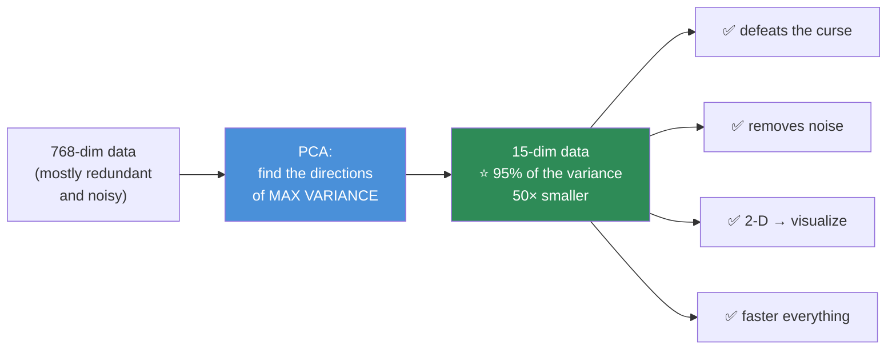
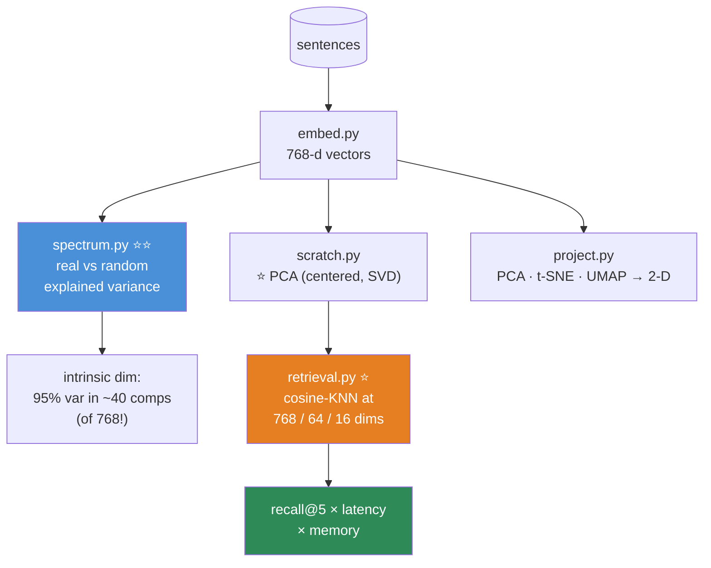

# 08.11 · Dimensionality Reduction

[⬅ 08.10 Clustering](08.10-clustering.md) · [🏠 Module 08](../README.md) · [➡ 08.12 Model Evaluation](08.12-evaluation.md)

> **The lesson in one line:** Most high-dimensional data is secretly low-dimensional — find the few directions that carry the variance, throw the rest away, and you've defeated the curse of dimensionality, compressed your data, and made it visible.

---

## 🎯 Learning objectives

By the end of this lesson you can:

1. Explain **PCA** as "find the directions of maximum variance" — and derive it from the **covariance matrix's eigenvectors**.
2. Implement PCA **from scratch with SVD**, and verify against sklearn.
3. Explain **why centering is mandatory** and why it fails silently.
4. Choose the number of components using the **explained-variance curve**.
5. Explain **t-SNE and UMAP** — and the three ways people misread their plots.
6. Know when **not** to reduce dimensions.

---

## 🧠 Mental model

> **Your data has 768 columns but only ~15 real degrees of freedom. Find them.**



> [!IMPORTANT]
> **Why does this work at all?** Because **real data is almost never full-rank** ([06.3](../../06-Mathematics/weeks/06.3-linear-algebra-decomposition.md)). Features are correlated, redundant, or pure noise. A 768-dimensional embedding doesn't use 768 independent directions — **it lives on a much lower-dimensional manifold inside that space.**
>
> **You saw the receipt in [06.3](../../06-Mathematics/weeks/06.3-linear-algebra-decomposition.md): plot the singular-value spectrum of real data versus random data. Random data's spectrum is flat. Real data's decays fast.** *That decay is the entire reason dimensionality reduction, compression, and LoRA all work.*

---

## 📐 PCA — the mathematics

### The goal

**Find an orthogonal set of directions such that projecting onto the first k captures as much variance as possible.**

**Why variance?** **Variance is information.** A direction along which all your points have the same value tells you nothing — it can't distinguish any two points. **A direction with large spread separates points, which is exactly what a model needs.**

### Derivation — two routes to the same answer

**Route 1 — Eigenvectors of the covariance matrix.**

1. **Center** the data: $X_c = X - \bar{X}$. **(Mandatory. See below.)**
2. Compute the covariance matrix: $C = \frac{1}{n-1}X_c^\top X_c$ — a `(d, d)` matrix ([07.6](../../07-Data-Analysis/weeks/07.6-eda.md)).
3. **The principal components are the eigenvectors of $C$**, and **the eigenvalues are the variance explained by each.**

$$C\mathbf{v}_i = \lambda_i \mathbf{v}_i$$

Sort by $\lambda$ descending. **$\mathbf{v}_1$ is the direction of maximum variance.**

**Route 2 — SVD of the centered data (⭐ what you actually do).**

$$X_c = U\Sigma V^\top$$

**The right singular vectors $V$ ARE the principal components**, and $\sigma_i^2/(n-1) = \lambda_i$.

> [!IMPORTANT]
> **⭐ Always use the SVD route, never form the covariance matrix.**
>
> Computing $X^\top X$ **squares the condition number** ([06.3](../../06-Mathematics/weeks/06.3-linear-algebra-decomposition.md)) — so if your data is even mildly ill-conditioned, you **double your loss of precision**, and in float32 you can lose everything.
>
> **SVD of $X_c$ gets you the same answer without ever forming $X^\top X$.** It's faster *and* numerically far safer. **This is what `sklearn.decomposition.PCA` does internally**, and it's why.

### ⭐ Centering is mandatory — and it fails silently

> [!CAUTION]
> **If you don't center, PCA's first component points at your data's MEAN — not at the direction of maximum variance.**
>
> Why? Because **variance is defined around the mean.** Without centering, the "variance" you're maximizing is really $\mathbb{E}[x^2]$ (the second moment about the *origin*), which is dominated by the mean's magnitude.
>
> **So PC1 becomes a direction that carries no information about how your data VARIES.** You have burned your most important component on a constant.
>
> **And nothing will tell you.** The code runs. You get components. The plot looks plausible. **It's just wrong.** *(sklearn centers for you. Your from-scratch implementation must not forget.)*

### Should you also SCALE?

| | |
|---|---|
| **Features on different units** (age, income, °C) | ⭐ **YES — standardize.** Otherwise the largest-variance feature dominates PC1 by virtue of its **units**, not its importance |
| **Features on the same scale** (pixel intensities, embeddings) | 🟡 Optional — centering alone is often right |

> [!WARNING]
> **PCA on unscaled mixed-unit data is meaningless.** `income` (variance ~10¹⁰) will completely dominate `age` (variance ~200), so **PC1 is just "income"** — a fact about your units, not your data. **`StandardScaler` → `PCA` should be a reflex.**

---

## 🐍 NumPy implementation — from scratch

```python
import numpy as np


class PCAScratch:
    """PCA via SVD. ~25 lines. This is sklearn's PCA."""

    def __init__(self, n_components=None):
        self.n_components = n_components
        self.mean_ = None
        self.components_ = None                 # (k, d) — the principal directions
        self.explained_variance_ = None
        self.explained_variance_ratio_ = None
        self.singular_values_ = None

    def fit(self, X):
        X = np.asarray(X, dtype=np.float64)
        n, d = X.shape

        # ── ⭐ 1 · CENTER. NOT OPTIONAL. ──
        self.mean_ = X.mean(axis=0)
        Xc = X - self.mean_

        # ── ⭐ 2 · SVD (never form XᵀX — it squares the condition number) ──
        U, S, Vt = np.linalg.svd(Xc, full_matrices=False)

        k = self.n_components or min(n, d)
        self.components_        = Vt[:k]                          # (k, d) ⭐ the PCs
        self.singular_values_   = S[:k]
        self.explained_variance_= (S ** 2 / (n - 1))[:k]          # ⭐ = the eigenvalues
        total_var               = (S ** 2 / (n - 1)).sum()
        self.explained_variance_ratio_ = self.explained_variance_ / total_var
        return self

    def transform(self, X):
        """Project onto the principal components."""
        Xc = np.asarray(X, dtype=np.float64) - self.mean_        # ⭐ use the TRAINING mean
        return Xc @ self.components_.T                            # (n, k)

    def fit_transform(self, X):
        return self.fit(X).transform(X)

    def inverse_transform(self, Z):
        """Reconstruct — this is LOSSY compression."""
        return Z @ self.components_ + self.mean_

    def reconstruction_error(self, X):
        return np.mean((np.asarray(X) - self.inverse_transform(self.transform(X))) ** 2)
```

### ⭐ Verify against sklearn

```python
import numpy as np
from sklearn.decomposition import PCA
from sklearn.preprocessing import StandardScaler
from sklearn.datasets import load_digits

X, y = load_digits(return_X_y=True)          # 64 features (8×8 images)
Xs = StandardScaler().fit_transform(X)

mine = PCAScratch(n_components=10).fit(Xs)
sk   = PCA(n_components=10).fit(Xs)

print("explained variance ratio:")
print("  mine   :", np.round(mine.explained_variance_ratio_, 4))
print("  sklearn:", np.round(sk.explained_variance_ratio_, 4))
print("  match  :", np.allclose(mine.explained_variance_ratio_,
                                sk.explained_variance_ratio_))       # True ✅

# ⚠️ Components may differ by a SIGN — eigenvectors are only defined up to ±1
print("components match (up to sign):",
      np.allclose(np.abs(mine.components_), np.abs(sk.components_)))  # True ✅

print(f"\ntotal variance in 10/64 components: {mine.explained_variance_ratio_.sum():.1%}")
```

> [!TIP]
> **⭐ Components are only defined up to a sign flip.** $v$ and $-v$ span the same direction and are equally valid eigenvectors. **So your PC1 may be sklearn's −PC1**, and your scatter plot may be mirrored. **This is not a bug** — compare with `np.abs`, and don't be alarmed when a colleague's PCA plot looks like the mirror image of yours.

---

## 📊 Choosing the number of components

```python
import matplotlib.pyplot as plt

pca_full = PCA().fit(Xs)
cumvar = np.cumsum(pca_full.explained_variance_ratio_)

k_90 = np.argmax(cumvar >= 0.90) + 1
k_95 = np.argmax(cumvar >= 0.95) + 1
print(f"90% variance: {k_90} components  (of {Xs.shape[1]})")
print(f"95% variance: {k_95} components")

fig, ax = plt.subplots(1, 2, figsize=(12, 4))
ax[0].plot(pca_full.explained_variance_ratio_, 'o-')       # ⭐ the SCREE plot
ax[0].set_title('scree — look for the elbow')
ax[1].plot(cumvar, 'o-'); ax[1].axhline(0.95, ls='--', c='r')
ax[1].set_title('cumulative explained variance')
```

| Method | How |
|---|---|
| **⭐ Cumulative variance** | Keep enough for 90–95%. **The practical default** |
| **Scree plot elbow** | Where the curve flattens |
| **`n_components=0.95`** | ⭐ sklearn: just ask for 95% variance and it picks k for you |
| **Downstream CV** | ⭐⭐ **The honest answer:** tune k as a hyperparameter of your *actual* model |
| Kaiser criterion | Keep eigenvalues > 1 (only for standardized data). Crude |

> [!TIP]
> **⭐ The single most valuable plot: the explained-variance curve of your data vs. random data.**
>
> **Random data's curve is a straight diagonal line** (every direction carries equal variance). **Real data's curve shoots up and flattens.** The gap between them is *exactly how much structure your data has*, and it is the most direct visual evidence you can produce that dimensionality reduction will help you at all. Make it once and you'll never forget what it means.

> 🖼️ **[IMAGE PLACEHOLDER: `assets/images/08-pca-explained-variance.png`]**
> *Two panels. Left: cumulative explained variance vs number of components, with **two curves**: real data (rising steeply, hitting 95% at component 15 of 64) and **random data of the same shape** (a straight diagonal line, hitting 95% only at component 61). The gap between them is shaded and annotated "⭐ THIS GAP IS YOUR DATA'S STRUCTURE. Random data has none." Right: a 2-D PCA scatter of MNIST digits, points coloured by digit class, showing partial but imperfect separation — annotated "PC1+PC2 = only 22% of the variance. PCA is LINEAR — it can't fully unfold this."*

---

## 🎯 What PCA is actually for

| Use | Note |
|---|---|
| **⭐ Defeat the curse of dimensionality** | 768 → 30 before KNN/K-Means/SVM ([08.9](08.9-knn.md), [08.10](08.10-clustering.md)) |
| **⭐ Remove noise** | Low-variance components are usually noise. **Dropping them can *improve* accuracy** |
| **⭐ Kill multicollinearity** | PCs are **orthogonal by construction** — no correlated features, ever ([08.3](08.3-linear-regression.md)) |
| **Compression** | Store 30 numbers instead of 768 |
| **Speed** | Every downstream algorithm gets faster |
| Visualization | 🟡 **PCA is mediocre at this** — it's linear. Use UMAP |

> [!IMPORTANT]
> **⭐ PCA components are orthogonal — which means PCA is a complete cure for multicollinearity.** If your linear model's coefficients are swinging wildly and flipping sign because features are correlated ([08.3](08.3-linear-regression.md)), **PCA eliminates the problem by construction.**
>
> **The price: interpretability.** "PC1" is a weighted blend of all 768 original features. **You can no longer say "income increases the prediction by X"** — you can only say "PC1 increases it," and PC1 means nothing to a human. **In credit scoring or medicine, that trade is often legally unacceptable.** ([08.16](08.16-interpretability.md))

### ⚠️ PCA leakage

```python
# 💀 LEAKAGE — the test set contributed to the components
X_pca = PCA(n_components=30).fit_transform(X_all)
X_train, X_test = train_test_split(X_pca)

# ✅ CORRECT — PCA is a fitted transformer. Put it in the pipeline.
from sklearn.pipeline import Pipeline
model = Pipeline([
    ('scale', StandardScaler()),
    ('pca',   PCA(n_components=30)),      # ⭐ fit on TRAIN only
    ('clf',   LogisticRegression()),
])
```

**PCA is a fitted transformer** — the mean and the components are **learned parameters** ([07.11](../../07-Data-Analysis/weeks/07.11-pipelines.md)). Fitting it on all your data leaks the test set's covariance structure into training. **Always put it in the pipeline.**

---

## 🌌 t-SNE — for visualization only

**A completely different goal: preserve *local neighborhoods*, not global variance.**

**How it works (intuitively):** it converts distances into probabilities ("how likely is j to be i's neighbor?") in both the high-dimensional and the 2-D space, then **moves the 2-D points around to minimize the KL divergence** between the two probability distributions ([06.8](../../06-Mathematics/weeks/06.8-information-theory.md)).

```python
from sklearn.manifold import TSNE

Z = TSNE(n_components=2, perplexity=30, init='pca', random_state=42).fit_transform(X)
```

> [!CAUTION]
> **⭐⭐ THREE WAYS PEOPLE MISREAD t-SNE PLOTS — and all three are common:**
>
> 1. **🚨 Cluster SIZES are meaningless.** t-SNE expands dense clusters and contracts sparse ones. **A big blob is not a big cluster.**
> 2. **🚨 DISTANCES BETWEEN clusters are meaningless.** Two clusters far apart in the plot are **not** necessarily far apart in reality. t-SNE only preserves *local* structure.
> 3. **🚨 It can manufacture clusters that don't exist.** Run it on pure Gaussian noise with a low perplexity and **you will see beautiful, convincing clusters.** *(Exactly the [08.10](08.10-clustering.md) problem, wearing a prettier hat.)*
>
> **t-SNE is for LOOKING at data, not for MEASURING it.** Never cluster on t-SNE output. Never feed t-SNE output to a model. Never conclude anything quantitative from the layout. **And always run it at 2–3 perplexities** — if the structure changes completely, it wasn't real.

| Parameter | Effect |
|---|---|
| **`perplexity`** | ⭐ Roughly "how many neighbors to consider." **5–50.** **Always try several** |
| `n_iter` | ≥ 1000 |
| **`init='pca'`** | ⭐ More stable and reproducible than random init |

---

## 🗺️ UMAP — better than t-SNE, usually

```python
import umap

reducer = umap.UMAP(n_neighbors=15, min_dist=0.1, n_components=2, random_state=42)
Z = reducer.fit_transform(X)
```

| | **PCA** | **t-SNE** | **UMAP** |
|---|---|---|---|
| Preserves | **Global** variance | **Local** neighborhoods | ⭐ **Local + some global** |
| Speed | ⭐⭐ Fastest | ❌ **Slow** (O(n²)-ish) | ⭐ Fast |
| **Deterministic** | ✅ **Yes** | ❌ No | 🟡 With a seed |
| **`transform()` new points** | ✅ **Yes** | ❌ **NO** ⚠️ | ✅ **Yes** |
| **Inverse transform** | ✅ Yes | ❌ No | 🟡 Approximate |
| **Use for modelling** | ⭐ **Yes** | ❌ **NEVER** | 🟡 Sometimes |
| Use for visualization | 🟡 Mediocre | ✅ Good | ⭐ **Best** |

> [!IMPORTANT]
> **⭐ The killer practical difference: t-SNE cannot transform new points.** There is no `transform()` method — it is a *visualization of one specific dataset*, not a learned mapping. **You cannot use it in a pipeline.** UMAP can, and PCA obviously can.
>
> **Practical guidance for 2026:**
> - **Modelling / preprocessing → PCA.** (Fast, deterministic, invertible, transforms new points.)
> - **Visualization → UMAP.** (Faster and better-behaved than t-SNE, and it transforms new points.)
> - **t-SNE → only if a reviewer expects it.** UMAP has largely superseded it.

---

## ⚡ Performance considerations

| | Complexity |
|---|---|
| **PCA (full SVD)** | O(min(n,d)² · max(n,d)) — **expensive on big data** |
| **⭐ Randomized/truncated SVD** | **Far cheaper** when you only want the top k — `svd_solver='randomized'` |
| **Incremental PCA** | Out-of-core, for data > RAM |
| **t-SNE** | ❌ **O(n²)** (Barnes-Hut: O(n log n)). **Sample to ~10k points** |
| **UMAP** | O(n^1.14) — ✅ handles millions |

```python
# ⭐ For large data, always use randomized SVD
PCA(n_components=50, svd_solver='randomized', random_state=0)

# For data larger than RAM
from sklearn.decomposition import IncrementalPCA
ipca = IncrementalPCA(n_components=50, batch_size=1000)
for chunk in pd.read_parquet('huge.parquet', chunksize=1000):
    ipca.partial_fit(chunk)
```

---

## 🐛 Common mistakes

| Mistake | Consequence |
|---|---|
| **Not centering** | ⭐ **PC1 points at the mean.** Silently, catastrophically wrong |
| **Not scaling mixed-unit data** | PC1 = the feature with the biggest units. Meaningless |
| **Fitting PCA on all data** | ⭐ **Leakage.** Put it in the pipeline |
| **Forming $X^\top X$** | Squares the condition number. **Use SVD** |
| **Clustering on t-SNE output** | 🚨 **The distances aren't real.** Never do this |
| **Reading t-SNE cluster sizes/distances** | 🚨 **Both are meaningless** |
| Expecting t-SNE to `transform()` new points | **It can't.** There's no such method |
| **Reducing dimensions when you don't need to** | You lost interpretability and information for nothing |
| Assuming PCA improves accuracy | **Often it doesn't.** It's for speed, noise, collinearity, and the curse |
| Alarm at a sign-flipped component | **Eigenvectors are defined up to ±1.** Not a bug |

> [!TIP]
> **⭐ When NOT to use PCA:** when you have **plenty of data relative to d** (the curse isn't biting), when you need **interpretability** (PCs are meaningless blends), when you're using **trees** (they're immune to the curse *and* to collinearity — PCA usually just makes them worse by destroying axis-aligned structure), or when your relationships are **strongly non-linear** (PCA is linear; it can't unfold a spiral).
>
> **PCA is not a free improvement. It's a trade.** Measure whether it helps.

---

## 📝 Exercises

**Mathematical**
1. **Derive PCA** as maximizing variance subject to $\|v\| = 1$. Show the solution is the **top eigenvector of the covariance matrix**.
2. **Show that the right singular vectors of the centered $X$ are the eigenvectors of $X^\top X$.** Why is SVD the better route?
3. ⭐ **Explain precisely why centering is mandatory.** What does PC1 become without it?
4. Why are the principal components **orthogonal**? Why does that cure multicollinearity?
5. Why are eigenvectors only defined **up to a sign**?

**NumPy implementation**
6. Implement `PCAScratch` with SVD. **Verify `explained_variance_ratio_` against sklearn** (and the components, up to sign).
7. ⭐ **Remove the centering.** Report `explained_variance_ratio_[0]`. Plot PC1's direction on the raw data. **Show that it points at the mean.**
8. Implement `inverse_transform`. **Reconstruct MNIST digits from k = 2, 5, 10, 30, 64 components.** Plot the grid. *(Watch the digits emerge — this is the best PCA demo there is.)*
9. Compute the reconstruction error vs k. **Confirm it matches the discarded variance** ([06.3](../../06-Mathematics/weeks/06.3-linear-algebra-decomposition.md) — Eckart–Young).

**Debugging & visualization**
10. ⭐ **Plot the cumulative explained variance for real data and for random data of the same shape.** *(The gap is your data's structure. This is the plot to remember.)*
11. Run PCA on **unscaled** mixed-unit data. **Report which original feature dominates PC1.** Now scale and repeat.
12. ⭐ **Run t-SNE on pure Gaussian noise** with perplexity=5. **Plot it.** You will see clusters. **Explain.** *(The most important exercise in this lesson.)*
13. Run t-SNE at perplexity 5, 30, and 100 on the same data. **Plot all three.** How much does the structure change? **What does that tell you about trusting any single one?**
14. Compare PCA, t-SNE, and UMAP 2-D plots of MNIST. **Which separates the digits best? Which would you use in a pipeline, and why?**

**Comparison**
15. Train KNN on 784-dim MNIST vs 30-dim PCA-reduced MNIST. **Report accuracy AND time.** *(Accuracy often goes UP — PCA removed noise.)*
16. Train a Random Forest on raw vs PCA-reduced features. **Report both.** **Explain why PCA usually HURTS trees.**

---

## 🛠️ Mini project — *The Embedding Explorer*

Build `code/08-machine-learning/embedding-explorer/` — dimensionality reduction where it actually matters in 2026: **understanding embeddings.**

**Requirements**
- Take real sentence embeddings (768-d, from `sentence-transformers`).
- **PCA from scratch**; verify against sklearn.
- Compare **PCA vs t-SNE vs UMAP** for visualization.
- **⭐ Measure the intrinsic dimensionality** — how many components carry 95% of the variance?
- **⭐ Show that PCA-reduced embeddings still work for retrieval** — and measure the speed/recall trade.

```
embedding-explorer/
├── README.md
├── src/
│   ├── embed.py          # sentence-transformers → 768-d vectors
│   ├── scratch.py        # ⭐ PCAScratch (SVD, centered)
│   ├── spectrum.py       # ⭐⭐ explained variance: REAL vs RANDOM
│   ├── project.py        # PCA / t-SNE / UMAP → 2-D
│   ├── retrieval.py      # ⭐ cosine-KNN at 768-d vs 64-d vs 16-d
│   └── evaluate.py       # recall@5 × latency × memory
├── tests/
│   ├── test_vs_sklearn.py
│   ├── test_centering.py     # ⭐ assert uncentered PCA is WRONG
│   └── test_sign_flip.py     # ⭐ components match up to sign
└── notebooks/
```

**Architecture**



**Implementation guidance**
1. **⭐⭐ `spectrum.py` is the headline.** Plot the cumulative explained variance for the real embeddings **and for random 768-d Gaussians of the same shape**. **The random curve is a straight diagonal. The real one shoots up and flattens — 95% of the variance in maybe 40 of 768 components.**
   **That plot IS the answer to the curse of dimensionality question from [08.9](08.9-knn.md).** It's the empirical proof that learned embeddings live on a low-dimensional manifold — and therefore *why RAG works at all*. **Make this plot. It's the most important artifact in the project.**
2. **⭐ `retrieval.py` is the practical payoff.** Build a cosine-KNN retriever at 768, 64, and 16 dimensions. **Measure recall@5 (against the 768-d ground truth) and query latency.** You will likely find that **64 dimensions retains ~98% recall at 12× less memory and several times the speed.** That is a *real, shippable* engineering result, and it's the kind of trade a senior engineer is expected to quantify rather than guess.
3. **`test_centering.py` asserts the failure mode.** Fit PCA without centering; assert that PC1 has a large dot product with the mean vector. **Testing that the bug reproduces is what makes the fix meaningful.**
4. **Do not cluster on the t-SNE output.** Put a comment saying why. Someone will try.

**Evaluation strategy:** recall@k of the reduced retriever vs the full-dimensional one; latency and memory at each dimensionality; and **the variance-spectrum plot** as the qualitative headline.

**Testing plan:** as above, plus `test_pipeline_no_leakage` (PCA fitted on train only) and `test_transform_new_points` (assert `PCA.transform()` works on unseen data — **and note that t-SNE cannot**).

**Future improvements:** compare against **product quantization** (what FAISS actually uses for compression); and measure whether PCA-reducing embeddings **before** building an HNSW index improves or degrades ANN recall ([08.9](08.9-knn.md), [Module 13](../../13-RAG/README.md)).

---

## 📄 Cheat sheet

| | |
|---|---|
| **PCA** | Find the orthogonal directions of **maximum variance** |
| **Math** | Eigenvectors of the covariance matrix = **right singular vectors of the centered X** |
| **⭐ Implementation** | **SVD of $X_c$.** **NEVER form $X^\top X$** (squares the condition number) |
| **⭐⭐ Centering** | **MANDATORY.** Without it, PC1 points at the **mean** — silently |
| **Scaling** | ⭐ **Required** for mixed units, or PC1 = the biggest-unit feature |
| **Choose k** | 90–95% cumulative variance · `n_components=0.95` · **or tune it by CV** |
| **Sign flips** | Components are defined **up to ±1**. Not a bug |
| **PCA is a fitted transformer** | ⭐ **Put it in the pipeline** or you leak |

| Use PCA for | Don't use PCA for |
|---|---|
| ⭐ Defeating the **curse of dimensionality** | **Interpretability** (PCs are meaningless blends) |
| ⭐ **Removing noise** (can *improve* accuracy) | **Trees** (immune to the curse; PCA usually hurts) |
| ⭐ **Killing multicollinearity** (PCs are orthogonal) | **Non-linear** structure (PCA is linear) |
| Compression + speed | Visualization (use **UMAP**) |

| | **PCA** | **t-SNE** | **UMAP** |
|---|---|---|---|
| Preserves | Global variance | Local only | Local + some global |
| Speed | ⭐⭐ Fast | ❌ Slow | ⭐ Fast |
| **`transform()` new points** | ✅ | ❌ **NO** | ✅ |
| **Use in a model** | ⭐ **Yes** | ❌ **NEVER** | 🟡 |

**🚨 t-SNE: cluster SIZES are meaningless · DISTANCES between clusters are meaningless · it invents clusters in NOISE.**

---

## 🎴 Flashcards

- **Q:** What is PCA, in one sentence? → **A:** Find the **orthogonal directions of maximum variance**, and project onto the top k. **Variance = information**; a direction with no spread can't distinguish any two points.
- **Q:** ⭐ How do you compute PCA properly? → **A:** **Center the data, then take the SVD.** The **right singular vectors are the principal components.** **Never form $X^\top X$** — it **squares the condition number** and doubles your loss of precision.
- **Q:** ⭐⭐ Why is centering mandatory? → **A:** Variance is defined **around the mean**. Without centering, PC1 **points at the mean** — a direction that carries **no information about how the data varies**. **And it fails silently.**
- **Q:** Why must you scale mixed-unit data before PCA? → **A:** Otherwise the feature with the **largest units** dominates PC1 — a fact about your units, not your data. (`income` variance ~10¹⁰ vs `age` ~200.)
- **Q:** How do you choose the number of components? → **A:** **Cumulative explained variance (90–95%)**, the scree elbow, `n_components=0.95`, or — the honest answer — **tune k as a hyperparameter of your downstream model by CV.**
- **Q:** ⭐ Why does PCA cure multicollinearity? → **A:** **The components are orthogonal by construction** — so there are no correlated features, ever. **The price is interpretability**: "PC1" is a meaningless blend of all your features.
- **Q:** Why is PCA a leakage risk? → **A:** **It's a fitted transformer** — the mean and components are **learned parameters**. Fitting on all data leaks the test set's covariance structure. **Put it in the pipeline.**
- **Q:** ⭐⭐ Name the three ways people misread t-SNE plots. → **A:** **(1) Cluster SIZES are meaningless** (it expands dense clusters). **(2) DISTANCES between clusters are meaningless** (it only preserves *local* structure). **(3) It invents clusters in pure noise.** **t-SNE is for looking, not measuring.**
- **Q:** ⭐ What's the killer practical difference between t-SNE and UMAP? → **A:** **t-SNE cannot `transform()` new points** — there's no such method. It's a visualization of *one specific dataset*, not a learned mapping. **You cannot put it in a pipeline.** UMAP can.
- **Q:** When should you NOT use PCA? → **A:** When you have **plenty of data relative to d**, when you need **interpretability**, when you're using **trees** (immune to the curse; PCA destroys their axis-aligned structure), or when the structure is **strongly non-linear**. **PCA is a trade, not a free improvement.**
- **Q:** ⭐ Why does dimensionality reduction work at all? → **A:** **Real data is almost never full-rank.** Its singular-value spectrum **decays fast** (random data's is flat). **That decay is the entire reason PCA, compression, and LoRA all work.**

---

## 💼 Interview questions

1. **"Explain PCA."** — Directions of maximum variance = eigenvectors of the covariance matrix = right singular vectors of the centered data. **Then volunteer that you'd compute it via SVD, not by forming $X^\top X$** — that's the answer that shows you know the numerics.
2. **⭐ "Why must you center before PCA?"** — Variance is measured around the mean; **without centering, PC1 points at the mean** and carries no information about variation. **And it fails silently.**
3. **"When would you use PCA?"** — Curse of dimensionality, noise removal, multicollinearity, speed, compression. **Then say when you wouldn't:** interpretability required, tree models, non-linear structure.
4. **⭐ "Can I cluster on t-SNE output?"** — **No.** The distances aren't real — cluster sizes and inter-cluster distances are both meaningless, and **t-SNE invents clusters in noise.** It's for looking, not measuring.
5. **"t-SNE or UMAP?"** — **UMAP**: faster, preserves more global structure, deterministic with a seed, and — crucially — **can `transform()` new points**, so it can live in a pipeline. **t-SNE can't.**
6. **"Your 768-d embeddings — how many dimensions do you actually need?"** — **Plot the explained-variance curve.** Typically **95% of the variance is in ~40 of 768 components.** Then quantify the retrieval trade: at 64 dims you often keep ~98% recall with 12× less memory. **That's the answer that demonstrates engineering judgement, not just knowledge.**

---

## 📚 Summary

- **PCA finds the orthogonal directions of maximum variance.** It works because **real data is almost never full-rank** — its singular-value spectrum decays fast, while random data's is flat. **That decay is why PCA, compression, and LoRA all work** ([06.3](../../06-Mathematics/weeks/06.3-linear-algebra-decomposition.md)).
- **⭐ Compute it by taking the SVD of the centered data.** **Never form $X^\top X$** — it squares the condition number.
- **⭐⭐ Centering is mandatory and it fails silently.** Without it, PC1 points at the *mean*, not at the direction of variation. **And you must scale mixed-unit data**, or PC1 is just "whichever feature has the biggest units."
- **PCA is a fitted transformer** — the mean and components are learned parameters. **Fit it inside the pipeline, or you leak.**
- **What it's really for:** **defeating the curse of dimensionality**, **removing noise** (which can *improve* accuracy), and **curing multicollinearity** (the components are orthogonal by construction). **The price is interpretability** — a PC is a meaningless blend.
- **Don't use it** when you have plenty of data, when you need interpretability, when you're using **trees** (immune to the curse; PCA usually hurts them), or when the structure is non-linear. **It's a trade, not a free win.**
- **⭐⭐ t-SNE plots are misread constantly:** cluster **sizes** are meaningless, **distances between clusters** are meaningless, and **it will invent clusters in pure noise.** **It is for looking, not measuring — never cluster on it, never feed it to a model.**
- **UMAP has largely superseded t-SNE**: faster, more global structure, and — decisively — **it can transform new points**, so it can live in a pipeline. **t-SNE cannot.**

**Next:** [08.12 Model Evaluation](08.12-evaluation.md) — you've now built nine algorithms. It's time to find out, honestly, whether any of them work.

---

## 🔗 References

- Jolliffe — *Principal Component Analysis*. The standard reference.
- Hastie et al. — *ESL*, Ch. 14.5.
- **Wattenberg, Viégas & Johnson (2016)** — ***How to Use t-SNE Effectively*** (distill.pub). **⭐ Read this before you ever show a t-SNE plot to anyone.** The interactive demos of "t-SNE finds clusters in noise" are unforgettable.
- van der Maaten & Hinton (2008) — *Visualizing Data using t-SNE*.
- McInnes, Healy & Melville (2018) — *UMAP*. Faster, better, and it has a `transform`.
- Eckart & Young (1936) — the optimality of truncated SVD ([06.3](../../06-Mathematics/weeks/06.3-linear-algebra-decomposition.md)).
- [06.3 Decomposition](../../06-Mathematics/weeks/06.3-linear-algebra-decomposition.md) — SVD, rank, and the singular-value spectrum, derived.

---

## 🧭 Navigation

| Direction | Link |
|---|---|
| ⬅ Previous | [08.10 Clustering](08.10-clustering.md) |
| ➡ Next | [08.12 Model Evaluation](08.12-evaluation.md) |
| 🏠 Module | [Module 08](../README.md) |
| 🗺 Roadmap | [ROADMAP.md](../../../ROADMAP.md) |
