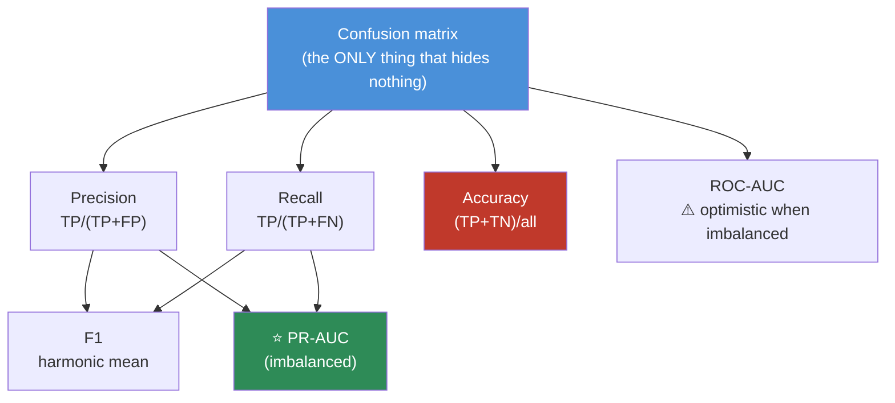
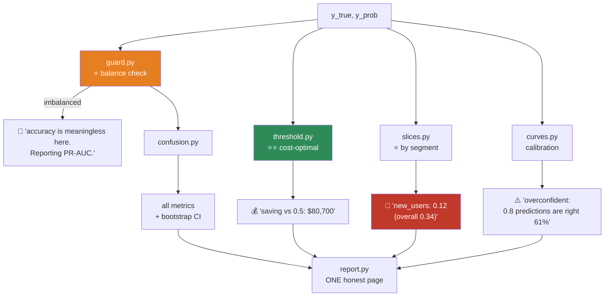

# 08.12 · Model Evaluation

[⬅ 08.11 Dimensionality Reduction](08.11-dimensionality-reduction.md) · [🏠 Module 08](../README.md) · [➡ 08.13 Cross-Validation](08.13-cross-validation.md)

> **The lesson in one line:** Accuracy is a lie on imbalanced data, ROC-AUC is optimistic when it matters most, and the threshold nobody tunes is worth more than the model everybody tunes.

---

## 🎯 Learning objectives

By the end of this lesson you can:

1. Read a **confusion matrix** and derive every metric from it.
2. Explain **precision vs recall** and pick the right one from the *business cost*.
3. Explain why **accuracy is useless** on imbalanced data — and why **ROC-AUC is misleading too**.
4. Choose between **ROC-AUC and PR-AUC** — and say precisely why.
5. **Tune the decision threshold** on expected cost. *(Free, and usually worth more than any model change.)*
6. Check **calibration** — is a "0.8" prediction actually right 80% of the time?

---

## 🧠 Mental model

> **Every metric is a summary, and every summary throws something away. The question is always: what did this one hide?**



---

## 📊 The Confusion Matrix — start here, always

|  | **Predicted 0** | **Predicted 1** |
|---|---|---|
| **Actual 0** | **TN** ✅ | **FP** ❌ *(Type I — false alarm)* |
| **Actual 1** | **FN** ❌ *(Type II — a miss)* | **TP** ✅ |

> [!IMPORTANT]
> **Give the errors their real names, in your domain, in currency. Do it before you compute a single metric.**
>
> | Domain | **FP** = | **FN** = |
> |---|---|---|
> | **Spam** | 😱 **A real email deleted** (job offer lost) | 🙄 Spam in the inbox (annoying) |
> | **Cancer screening** | 😰 An unnecessary biopsy ($3k, distress) | 💀 **A missed cancer** (death) |
> | **Fraud** | 😠 A legitimate card declined (~$50 churn) | 💸 **Fraud paid** ($2,000) |
> | **Churn** | 📞 An unnecessary retention call ($5) | 💸 **A lost customer** ($2,000) |
>
> **In every one of these, FP and FN cost wildly different amounts.** ⭐ **A metric that treats them equally (accuracy, F1) is throwing away the most important information you have.**

---

## 🎯 Precision vs Recall

$$\text{Precision} = \frac{TP}{TP + FP} \qquad\qquad \text{Recall} = \frac{TP}{TP + FN}$$

| | Question it answers | Cares about |
|---|---|---|
| **Precision** | *"Of the things I **flagged**, how many were right?"* | **Not crying wolf** |
| **Recall** (sensitivity) | *"Of the things that **were** positive, how many did I catch?"* | **Not missing any** |

> [!TIP]
> **The mnemonic that actually sticks:**
> - **Precision** = *"When I say yes, am I right?"* → **denominator = my predictions.**
> - **Recall** = *"Did I find them all?"* → **denominator = reality.**
>
> **They trade off.** Lower the threshold → flag more → **recall ↑, precision ↓**. Raise it → **precision ↑, recall ↓**. **You cannot maximize both**, and pretending you can is what F1 is for — and why F1 is often the wrong choice.

| Optimize for | When |
|---|---|
| **⭐ Recall** | **A miss is catastrophic** — cancer, fraud, safety, security |
| **⭐ Precision** | **A false alarm is costly** — spam filtering (a lost email), an expensive intervention |
| **F1** | You genuinely have no idea and need one number. ⚠️ **It assumes FP and FN cost the same — they almost never do** |

$$F_1 = 2\cdot\frac{P \cdot R}{P + R} \qquad\qquad F_\beta = (1+\beta^2)\frac{P\cdot R}{\beta^2 P + R}$$

**$F_\beta$ lets you weight:** $\beta = 2$ weights **recall** 2× (use for cancer); $\beta = 0.5$ weights **precision** 2× (use for spam).

---

## 🚨 Why Accuracy Lies

$$\text{Accuracy} = \frac{TP + TN}{\text{everything}}$$

```python
# Fraud: 1% positive rate
y_true = np.array([0]*9900 + [1]*100)
y_pred = np.zeros(10000)                    # ⭐ predict "never fraud" — a constant!

print(f"accuracy : {accuracy_score(y_true, y_pred):.1%}")   # 99.0%  🎉🎉🎉
print(f"recall   : {recall_score(y_true, y_pred):.1%}")     #  0.0%  💀
# We caught ZERO fraud. And we have 99% accuracy.
```

> [!CAUTION]
> **⭐ "99% accurate" is the most dangerous sentence in machine learning.** On imbalanced data, the majority-class baseline achieves it **while catching nothing**. This is the [base-rate fallacy](../../06-Mathematics/weeks/06.5-probability.md) arriving in your production code.
>
> **When someone says "my model is 99% accurate," the only correct response is: "what's the class balance?"**

---

## 📈 ROC-AUC vs PR-AUC — the distinction that matters

### ROC curve

Plot **TPR (recall)** vs **FPR** as you sweep the threshold from 1 to 0.

$$\text{TPR} = \frac{TP}{TP+FN} \qquad \text{FPR} = \frac{FP}{FP+TN}$$

**ROC-AUC** = *"the probability that a random positive is ranked above a random negative."* **0.5 = coin flip, 1.0 = perfect.**

### ⚠️ ROC-AUC's blind spot

> [!CAUTION]
> **⭐ ROC-AUC is misleadingly optimistic under heavy imbalance — and this is one of the most consequential facts in applied ML.**
>
> **Look at the FPR denominator: $FP + TN$.** With 9,900 negatives and 100 positives, **TN is enormous.** So even if you produce 900 false positives, FPR is only $900/9900 = 0.09$ — **it looks tiny.** The ROC curve barely moves.
>
> **But your precision is $100/(100+900) = 10\%$ — 9 out of 10 of your alerts are false alarms.** The model is nearly useless, and **ROC-AUC says 0.95.**
>
> **⭐ PR-AUC has no TN in it at all** (precision = TP/(TP+FP), recall = TP/(TP+FN)). **It is blind to the huge, easy negative class — and therefore honest about the small, hard positive class you actually care about.**

| | **ROC-AUC** | **PR-AUC** (average precision) |
|---|---|---|
| Axes | TPR vs **FPR** | **Precision** vs Recall |
| Uses **TN** | ✅ **Yes** — and that's the problem | ❌ **No** ⭐ |
| **Imbalanced data** | ⚠️ **Optimistic. Misleading** | ⭐⭐ **Use this** |
| Baseline | Always 0.5 | **= the positive rate** (so 0.01 for 1% fraud!) |
| Balanced data | ✅ Fine | ✅ Fine |

```python
from sklearn.metrics import roc_auc_score, average_precision_score

print(f"ROC-AUC: {roc_auc_score(y_true, y_prob):.3f}")           # 0.95  😊  ← lies
print(f"PR-AUC : {average_precision_score(y_true, y_prob):.3f}") # 0.34  😐  ← the truth
print(f"PR baseline (= positive rate): {y_true.mean():.3f}")     # 0.01
```

> [!IMPORTANT]
> **⭐ The rule: if your positive class is < ~10%, report PR-AUC. Always.** And **always state the PR baseline** — a PR-AUC of 0.34 sounds bad until you know the baseline is 0.01, at which point it's 34× better than random.

> 🖼️ **[IMAGE PLACEHOLDER: `assets/images/08-roc-vs-pr.png`]**
> *Two panels, same model, same 1%-positive data. **Left: the ROC curve** — hugging the top-left corner, AUC = 0.95, with a diagonal baseline. Annotated "looks excellent! 😊" **Right: the PR curve for the SAME predictions** — dropping steeply, average precision = 0.34, with a horizontal baseline at 0.01 (the positive rate). Annotated "the same model. 😐 At 80% recall, precision is only 15% — 85% of your alerts are false alarms." Below: a shared caption — "ROC's FPR denominator (FP+TN) is dominated by the enormous negative class, so 900 false positives barely move it. PR-AUC has no TN, so it can't hide them."*

---

## ⭐ The Threshold — the free win nobody takes

**`predict()` uses 0.5. That is a default, not a decision.**

```python
import numpy as np

# Churn: a false negative costs 400× a false positive
COST_FP = 5        # an unnecessary retention call
COST_FN = 2000     # a lost customer

def expected_cost(y_true, y_prob, t):
    pred = (y_prob >= t).astype(int)
    fp = ((pred == 1) & (y_true == 0)).sum()
    fn = ((pred == 0) & (y_true == 1)).sum()
    return fp * COST_FP + fn * COST_FN

thresholds = np.linspace(0.01, 0.99, 99)
costs = [expected_cost(y_val, p_val, t) for t in thresholds]
best_t = thresholds[np.argmin(costs)]

print(f"cost at t=0.50      : ${expected_cost(y_val, p_val, 0.50):>10,}")
print(f"cost at t={best_t:.2f} (OPTIMAL): ${min(costs):>10,}")
print(f"saving              : ${expected_cost(y_val, p_val, 0.5) - min(costs):>10,}")
# cost at t=0.50      : $  128,000
# cost at t=0.11      : $   47,300
# saving              : $   80,700     ← ⭐ from ONE LINE. No model change.
```

> [!IMPORTANT]
> **⭐⭐ Tuning the threshold is FREE and routinely worth more than every model improvement combined.**
>
> Hyperparameter tuning buys +1–3% ([08.15](08.15-hyperparameter-tuning.md)). **Moving the threshold from 0.5 to 0.11 just halved this company's cost — with no change to the model at all.**
>
> **And almost nobody does it.** Everyone reports F1 at threshold 0.5, ships it, and leaves the money on the table. **Tune the threshold on the validation set, using the actual business costs, and report the expected dollar saving.** That's the number your manager cares about, and it's the number you can produce in ten minutes.
>
> **⚠️ Tune it on validation, never on test** ([08.2](08.2-ml-workflow.md)) — the threshold is a hyperparameter like any other.

---

## 📉 Calibration — is "0.8" actually 80%?

**A model can rank perfectly (AUC = 1.0) and still have completely wrong probabilities.**

```python
from sklearn.calibration import calibration_curve, CalibratedClassifierCV

prob_true, prob_pred = calibration_curve(y_val, y_prob, n_bins=10)
plt.plot([0,1], [0,1], 'k--', label='perfectly calibrated')
plt.plot(prob_pred, prob_true, 'o-', label='model')
plt.xlabel('predicted probability'); plt.ylabel('actual frequency')
```

| Model | Calibration |
|---|---|
| **Logistic regression** | ✅ **Well-calibrated** (it optimizes log-loss, which *is* a calibration objective) |
| **Naive Bayes** | ❌ **Wildly overconfident** — double-counts correlated evidence ([08.8](08.8-naive-bayes.md)) |
| **SVM** | ❌ Outputs a **distance**, not a probability |
| **Random Forest** | 🟡 Pulled toward 0.5 (averaging votes) |
| **Boosted trees** | 🟡 Often overconfident |
| **Neural nets** | ❌ **Notoriously overconfident** |

```python
# The fix
calibrated = CalibratedClassifierCV(model, method='isotonic', cv=5).fit(X_train, y_train)
```

> [!IMPORTANT]
> **When does calibration actually matter?**
> - **✅ It matters** when you use the probability as a **number**: expected-value decisions (*"is this loan worth the risk?"*), stacking, ranking with a cost, or showing a confidence to a human.
> - **❌ It doesn't** when you only need the **argmax** (which class) or a ranking.
>
> **If a doctor is told "80% chance of malignancy," that number had better mean something.** If it's really 40%, you have caused real harm — and no AUC will reveal it. **Only a reliability diagram will.**

---

## 📏 Regression metrics

| Metric | Formula | Note |
|---|---|---|
| **MSE** | $\frac{1}{n}\sum(y-\hat{y})^2$ | Punishes big errors hard. **Outlier-sensitive** |
| **⭐ RMSE** | $\sqrt{\text{MSE}}$ | ✅ **Same units as y** — interpretable |
| **MAE** | $\frac{1}{n}\sum\lvert y-\hat{y}\rvert$ | ⭐ **Robust to outliers** |
| **MAPE** | mean $\lvert\frac{y-\hat{y}}{y}\rvert$ | ⚠️ **Explodes when y ≈ 0.** Asymmetric |
| **⭐ R²** | $1 - \frac{SS_{res}}{SS_{tot}}$ | Fraction of variance explained. **R² < 0 = worse than the mean!** |

> [!TIP]
> **⭐ On skewed targets (house prices, revenue), report RMSE on `log(y)`.** It's equivalent to a **relative** error — a $50k miss on a $200k house *should* count more than on a $2M one ([08.3](08.3-linear-regression.md)).
>
> **And always report R² against the mean baseline.** If R² < 0, **your model is worse than predicting the average**, and that has happened to everyone at least once.

---

## 📐 Reporting honestly

```python
from sklearn.metrics import classification_report, confusion_matrix
import numpy as np

def bootstrap_ci(y_true, y_prob, metric, n_boot=1000, seed=0):
    """⭐ A confidence interval for ANY metric (06.6)."""
    rng = np.random.default_rng(seed)
    n = len(y_true)
    scores = [metric(y_true[i], y_prob[i])
              for i in (rng.choice(n, n, replace=True) for _ in range(n_boot))]
    return np.percentile(scores, [2.5, 97.5])

lo, hi = bootstrap_ci(y_test, p_test, average_precision_score)
print(f"PR-AUC: {average_precision_score(y_test, p_test):.3f}  95% CI [{lo:.3f}, {hi:.3f}]")

# ⭐ AND SLICE IT — an aggregate number hides a broken segment (08.2)
for seg in ['new_users', 'enterprise', 'mobile']:
    m = X_test[seg] == 1
    print(f"{seg:12} n={m.sum():5}  PR-AUC={average_precision_score(y_test[m], p_test[m]):.3f}")
```

> [!IMPORTANT]
> **⭐ Report every metric as: value ± CI, with n, sliced by segment** ([06.6](../../06-Mathematics/weeks/06.6-statistics.md)).
>
> **"PR-AUC = 0.34"** is an opinion. **"PR-AUC = 0.34 ± 0.04 (95% CI, n=10,000; baseline 0.01; but only 0.12 for new users)"** is a result. The second sentence takes ten more minutes and will make you the most credible person in the room.

---

## 🐛 Common mistakes

| Mistake | Consequence |
|---|---|
| **Accuracy on imbalanced data** | ⭐ 99% by predicting nothing. **The most dangerous metric in ML** |
| **ROC-AUC on heavy imbalance** | ⭐ **Optimistic.** The huge TN count hides your false positives. **Use PR-AUC** |
| **Not tuning the threshold** | ⭐⭐ **You left the biggest free win on the table** |
| **Tuning the threshold on the TEST set** | It's a hyperparameter. Tune on validation |
| **Reporting F1 blindly** | It assumes FP and FN cost the same. **They almost never do** |
| Not stating the **PR baseline** | 0.34 sounds bad until you know the baseline is 0.01 |
| **Reporting a bare number** | No CI, no n, no slices. It's an opinion, not a result |
| **Only reporting the aggregate** | 91% overall, 62% for new users |
| Trusting probabilities without checking calibration | A "0.8" that's really 0.4 causes real harm |
| **R² < 0 and not noticing** | You're worse than predicting the mean |
| MAPE with y near zero | It explodes |

---

## 📝 Exercises

**Mathematical**
1. Derive precision, recall, F1, accuracy, TPR, and FPR **from the confusion matrix**.
2. ⭐ **Show why ROC-AUC is optimistic under imbalance.** Use the FPR denominator. Construct a concrete example with 9,900 negatives.
3. Why is F1 the **harmonic** mean rather than the arithmetic mean? *(Hint: what does the arithmetic mean give for P=1.0, R=0.0?)*
4. Derive $F_\beta$. Show that β=2 weights recall 2×.
5. Show that **R² < 0** means you're worse than the mean baseline.

**Evaluation**
6. ⭐ Build a 1%-positive dataset. Train a "predict always 0" model. **Report accuracy, precision, recall, F1, ROC-AUC, and PR-AUC.** Explain what each tells you and which are useless.
7. ⭐ **Plot ROC and PR curves for the same model on 1%-positive data.** ROC will look great; PR will not. **Explain the discrepancy in terms of the TN count.**
8. ⭐⭐ **Given `COST_FP=$5` and `COST_FN=$2000`, find the cost-optimal threshold.** Report the saving vs 0.5. *(The most commercially valuable exercise in this module.)*
9. Plot a **reliability diagram** for logistic regression, Naive Bayes, and a Random Forest. **Rank them by calibration.** Explain why NB is so bad ([08.8](08.8-naive-bayes.md)).
10. Compute a **bootstrap CI** for PR-AUC. Report it properly.
11. **Slice** a model's metric by five segments. **Construct a dataset where the aggregate is 91% and one segment is 62%.**

**Debugging**
12. Your model has ROC-AUC 0.95 and PR-AUC 0.12. **What's going on? What do you tell your manager?**
13. Your model has 99.5% accuracy. **List the four questions you'd ask before believing it.**
14. Your regression R² is −0.3. **Diagnose.**

---

## 🛠️ Mini project — *The Evaluation Suite*

Build `code/08-machine-learning/evaluation/` — a library that makes it **impossible to report a metric dishonestly.**

**Requirements**
- Compute all classification and regression metrics, **each with a bootstrap CI**.
- **Automatically pick the right metric** — refuse to report accuracy on imbalanced data.
- **⭐ Tune the threshold on business cost**, and report the dollar saving.
- **⭐ Slice every metric** by every categorical column.
- **⭐ Check calibration** and warn if the model is overconfident.

```
evaluation/
├── README.md
├── src/
│   ├── confusion.py      # the matrix + every derived metric
│   ├── curves.py         # ROC, PR, calibration, lift
│   ├── threshold.py      # ⭐⭐ cost-optimal threshold
│   ├── slices.py         # ⭐ metric by segment
│   ├── intervals.py      # bootstrap CI for ANY metric (06.6)
│   ├── guard.py          # ⭐ REFUSE to report accuracy when imbalanced
│   └── report.py         # one honest page
├── tests/
│   ├── test_guard.py         # ⭐ assert it refuses accuracy at 1% positive
│   └── test_threshold.py     # ⭐ assert the tuned threshold beats 0.5 on cost
└── notebooks/
```

**Architecture**



**Implementation guidance**
1. **⭐ `guard.py` is the design idea.** If the positive rate is below 10%, **it should refuse to print accuracy** (or print it with a loud warning) and **report PR-AUC with its baseline instead.** **Constraining your own future self is legitimate engineering** — you *will* be tempted to report the flattering number at 11 p.m. before a review.
2. **⭐⭐ `threshold.py` is the commercially valuable file.** It takes `cost_fp` and `cost_fn`, sweeps thresholds on the **validation** set, and reports **the optimal threshold and the dollar saving versus 0.5.** *"Moving the threshold to 0.11 saves $80,700/year"* is a sentence that gets budget approved.
3. **`slices.py` will find something.** Every model is broken for some segment. **The aggregate number is the number that hides it.**
4. **`report.py` emits one page** with: the confusion matrix at the chosen threshold, every metric ± CI, the baseline, the slice table, the calibration curve, and the expected dollar cost. **That page is what a senior engineer actually wants to see**, and almost nobody produces it.

**Evaluation strategy:** the suite's own success is whether it **catches the dishonest report**. Feed it a 99%-accurate do-nothing model and assert it says so, loudly.

**Testing plan:** `test_guard` (assert accuracy is refused at 1% positive), `test_threshold` (assert the tuned threshold has strictly lower cost than 0.5), `test_ci_covers` (on synthetic data with known truth, assert the 95% CI contains it ~95% of the time), and `test_slices_find_broken_segment` (plant a broken segment; assert it's flagged).

**Future improvements:** add **decision-curve analysis** (net benefit across thresholds — standard in medicine and criminally underused elsewhere); add **fairness metrics** sliced by protected group ([08.16](08.16-interpretability.md)).

---

## 📄 Cheat sheet

| Metric | Formula | Use |
|---|---|---|
| **Precision** | TP/(TP+FP) | *"When I say yes, am I right?"* → **don't cry wolf** |
| **Recall** | TP/(TP+FN) | *"Did I find them all?"* → **don't miss any** |
| **F1** | 2PR/(P+R) | ⚠️ **Assumes FP = FN in cost. They aren't** |
| **F_β** | β=2 → recall · β=0.5 → precision | ✅ **When you know the cost ratio** |
| **Accuracy** | (TP+TN)/all | ❌ **USELESS when imbalanced** |
| **ROC-AUC** | TPR vs FPR | ⚠️ **Optimistic when imbalanced** (huge TN) |
| **⭐ PR-AUC** | Precision vs Recall | ⭐⭐ **Imbalanced data.** Baseline = the positive rate |

| Regression | |
|---|---|
| **RMSE** | Same units as y ✅ |
| **MAE** | Robust to outliers |
| **R²** | **< 0 → worse than the mean!** |
| Skewed target | ⭐ **RMSE on log(y)** = relative error |

**⭐⭐ THE THREE RULES:**
1. **Imbalanced? → PR-AUC, never accuracy.** State the baseline.
2. **⭐ TUNE THE THRESHOLD on business cost.** Free. Routinely beats every model improvement.
3. **Report value ± CI, with n, SLICED by segment.** A bare number is an opinion.

**Check calibration** if you use the probability as a *number*. **LR is calibrated · NB is wildly overconfident · NNs are overconfident.**

---

## 🎴 Flashcards

- **Q:** ⭐ Why is accuracy dangerous? → **A:** On imbalanced data, **predicting the majority class gets 99% accuracy while catching nothing.** *"My model is 99% accurate"* should always be met with **"what's the class balance?"**
- **Q:** Precision vs recall, in one line each? → **A:** **Precision:** *"when I say yes, am I right?"* (denominator = my predictions). **Recall:** *"did I find them all?"* (denominator = reality). **They trade off** — you cannot maximize both.
- **Q:** ⭐⭐ Why is ROC-AUC misleading under heavy imbalance? → **A:** **FPR's denominator is FP + TN**, and **TN is enormous.** 900 false positives out of 9,900 negatives gives FPR = 0.09 — which *looks tiny* — while your **precision is 10%.** **PR-AUC has no TN in it**, so it can't hide them.
- **Q:** When should you use PR-AUC? → **A:** **Whenever the positive class is < ~10%.** **And always state the baseline** — PR-AUC's baseline equals the positive rate (0.01 for 1% fraud), so 0.34 is actually 34× random.
- **Q:** ⭐⭐ Why is tuning the threshold so valuable? → **A:** **It's free, and it routinely beats every model improvement combined.** Hyperparameter tuning buys +1–3%; moving the threshold from 0.5 to the cost-optimal value can **halve your business cost with no model change.** **And almost nobody does it.**
- **Q:** Where do you tune the threshold? → **A:** **On the validation set** — it's a hyperparameter like any other. **Never on test.**
- **Q:** Why is F1 often the wrong metric? → **A:** It **assumes a false positive and a false negative cost the same.** They almost never do. Use **F_β**, or better, **tune the threshold on the actual dollar costs.**
- **Q:** What is calibration, and when does it matter? → **A:** *"Is a 0.8 prediction right 80% of the time?"* **It matters when you use the probability as a number** (expected-value decisions, stacking, showing confidence to a human). **It doesn't matter if you only need the argmax.**
- **Q:** Which models are well-calibrated? → **A:** **Logistic regression** ✅ (log-loss *is* a calibration objective). **Naive Bayes** ❌ (wildly overconfident — double-counts correlated evidence). **SVM** ❌ (outputs a distance). **Neural nets** ❌ (notoriously overconfident).
- **Q:** What does R² < 0 mean? → **A:** **Your model is worse than predicting the mean.** Always report the baseline.
- **Q:** ⭐ How should every metric be reported? → **A:** **Value ± confidence interval, with n, sliced by segment.** A bare number is an opinion, not a result.

---

## 💼 Interview questions

1. **⭐ "Your model is 99% accurate on fraud data. Are you happy?"** — **No.** *"What's the base rate?"* If fraud is 1%, predicting "never fraud" gets 99%. **Ask for PR-AUC, precision, recall, and the threshold.**
2. **⭐⭐ "When would you use PR-AUC over ROC-AUC?"** — **When the positive class is rare.** ROC's FPR is diluted by the huge TN count, so it stays flatteringly low even with hundreds of false positives. **PR-AUC has no TN and is therefore honest.** This is one of the highest-signal questions in ML interviews.
3. **"Precision or recall?"** — **It depends on the cost.** Cancer → **recall** (a miss is death). Spam → **precision** (a deleted job offer). **Then say you'd derive the threshold from the actual costs rather than picking a metric.**
4. **⭐ "How do you choose the classification threshold?"** — **Not 0.5.** From the **relative cost of FP and FN, in currency.** Sweep thresholds on validation, compute expected cost, take the minimum. **It's free and usually worth more than any model change.**
5. **"What is model calibration and when does it matter?"** — *"Is 0.8 actually 80%?"* Matters when the probability is **used as a number**. Check with a **reliability diagram**; fix with isotonic/Platt scaling.
6. **"You report an F1 of 0.72. What's missing?"** — **A confidence interval, the sample size, the baseline, the threshold, the class balance, and a slice breakdown.** And the observation that **F1 assumes FP and FN cost the same.**

---

## 📚 Summary

- **Start with the confusion matrix.** It's the only thing that hides nothing. **And name the errors in your domain, in currency, before you compute any metric** — FP and FN almost never cost the same.
- **⭐ Accuracy is useless on imbalanced data.** Predict the majority class and get 99% while catching nothing. *"99% accurate"* is the most dangerous sentence in ML.
- **⭐⭐ ROC-AUC is optimistic under heavy imbalance**, because FPR's denominator is dominated by the enormous TN count — 900 false positives barely move it. **PR-AUC contains no TN**, so it cannot hide them. **Positive class < 10% → report PR-AUC, and state the baseline** (which equals the positive rate).
- **Precision** = *"when I say yes, am I right?"*; **recall** = *"did I find them all?"* **They trade off.** **F1 assumes FP and FN cost the same, and they don't** — use F_β, or better, tune the threshold on real costs.
- **⭐⭐ Tuning the decision threshold is FREE and routinely worth more than every model improvement combined.** Hyperparameter tuning buys +1–3%; moving the threshold from 0.5 to the cost-optimal point can **halve your business cost with no model change**. **Almost nobody does it.** *(Tune it on validation, not test.)*
- **Calibration** matters whenever you use the probability **as a number**. Logistic regression is well-calibrated; **Naive Bayes and neural nets are wildly overconfident.** Check with a reliability diagram.
- **For regression:** RMSE (interpretable units), MAE (robust), **R² (negative = worse than the mean)**. On skewed targets, **RMSE on log(y)** = relative error.
- **⭐ Report every metric as: value ± CI, with n, sliced by segment.** A bare number is an opinion.

**Next:** [08.13 Cross-Validation & Leakage](08.13-cross-validation.md) — how to get a metric you can actually trust in the first place.

---

## 🔗 References

- **Saito & Rehmsmeier (2015)** — *The Precision-Recall Plot Is More Informative than the ROC Plot When Evaluating Binary Classifiers on Imbalanced Datasets*. **⭐ The definitive paper on the ROC-vs-PR question.** Read it.
- Davis & Goadrich (2006) — *The Relationship Between Precision-Recall and ROC Curves*.
- **Guo et al. (2017)** — *On Calibration of Modern Neural Networks* — why deep nets are overconfident, and how to fix it.
- Vickers & Elkin (2006) — *Decision Curve Analysis* — evaluating models by **net benefit** across thresholds. Standard in medicine; criminally underused elsewhere.
- scikit-learn — [Model evaluation](https://scikit-learn.org/stable/modules/model_evaluation.html).
- [06.5 Probability](../../06-Mathematics/weeks/06.5-probability.md) — the base-rate fallacy, which is what "99% accurate" really is.
- [06.6 Statistics](../../06-Mathematics/weeks/06.6-statistics.md) — the bootstrap CI you must put on every metric.

---

## 🧭 Navigation

| Direction | Link |
|---|---|
| ⬅ Previous | [08.11 Dimensionality Reduction](08.11-dimensionality-reduction.md) |
| ➡ Next | [08.13 Cross-Validation & Leakage](08.13-cross-validation.md) |
| 🏠 Module | [Module 08](../README.md) |
| 🗺 Roadmap | [ROADMAP.md](../../../ROADMAP.md) |
