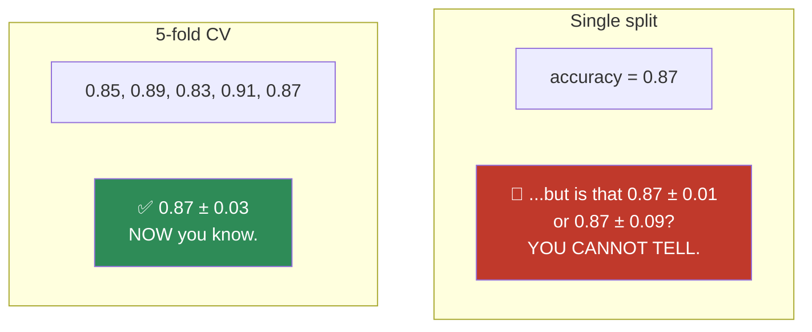
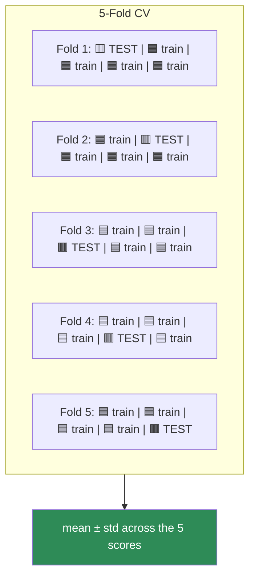
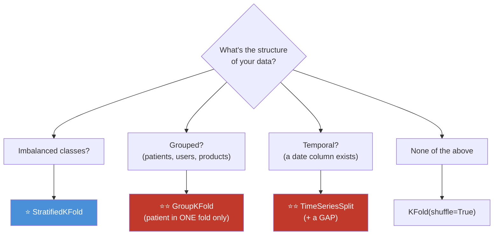
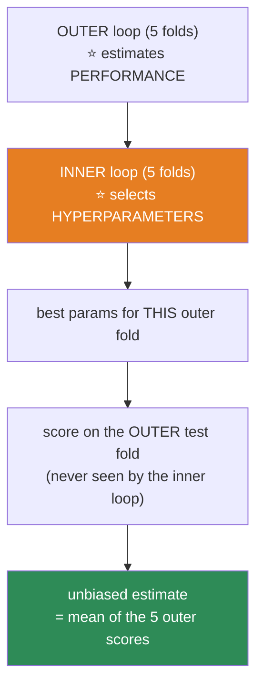
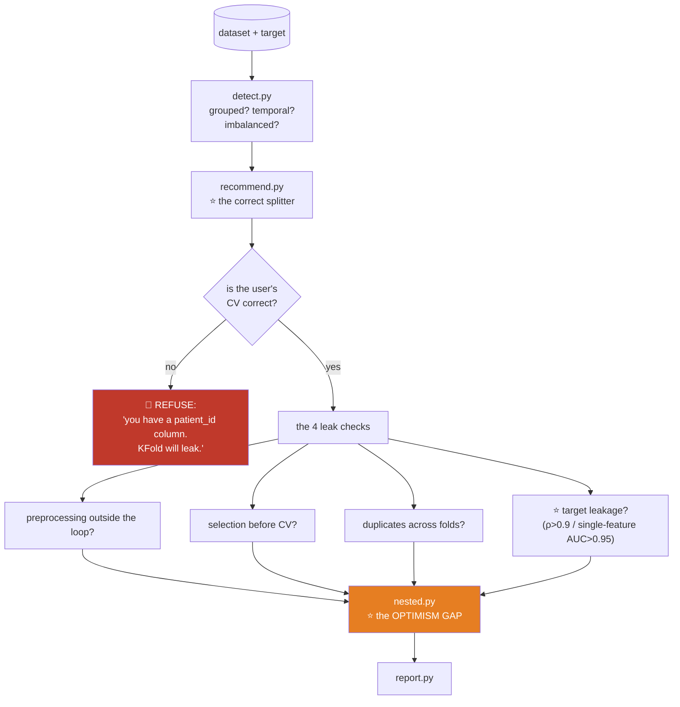

```mermaid
gantt
    title TimeSeriesSplit — train always precedes test, with a GAP
    dateFormat X
    axisFormat %s
    section Fold 1
    train  :0, 20
    gap    :crit, 20, 27
    test   :27, 37
    section Fold 2
    train  :0, 37
    gap    :crit, 37, 44
    test   :44, 54
    section Fold 3
    train  :0, 54
    gap    :crit, 54, 61
    test   :61, 71
```

# 08.13 · Cross-Validation & Leakage

[⬅ 08.12 Model Evaluation](08.12-evaluation.md) · [🏠 Module 08](../README.md) · [➡ 08.14 Feature Engineering](08.14-feature-engineering.md)

> **The lesson in one line:** A single train/test split gives you one noisy number; cross-validation gives you a number *and* its uncertainty — and both are worthless if you leaked, which you probably did.

---

## 🎯 Learning objectives

By the end of this lesson you can:

1. Explain why a **single split** is unreliable, and what K-fold buys you.
2. Choose the **right CV strategy** — stratified, grouped, or time-series — from the structure of your data.
3. Explain **nested CV** and why the usual approach is optimistically biased.
4. **Detect and prevent leakage** — including the four kinds that survive a "correct" CV.
5. Explain why **preprocessing must live inside the CV loop**.
6. Report a CV result honestly.

---

## 🧠 Mental model

> **A single train/test split is one sample from a distribution. Cross-validation samples that distribution k times — so you get the mean AND the variance.**



> [!IMPORTANT]
> **The variance across folds is not a nuisance — it is the most important output.**
>
> **Model A: 0.87 ± 0.01. Model B: 0.89 ± 0.08.** Which is better? **Almost certainly A** — B's advantage is well inside its own noise ([06.6](../../06-Mathematics/weeks/06.6-statistics.md)). **Anyone who reports a bare "0.89" has hidden the only thing that lets you compare.**

---

## 📖 K-Fold Cross-Validation



**Every point is used for testing exactly once, and for training k−1 times.** You get k estimates instead of one.

| k | Trade-off |
|---|---|
| **k = 5** | ⭐ **The default.** Good bias/variance/cost balance |
| **k = 10** | Slightly better estimate, 2× the cost |
| **k = n (LOOCV)** | Nearly unbiased, but **high variance** and **n model fits**. ⚠️ Rarely worth it |

> [!TIP]
> **Why isn't LOOCV always best?** It's *nearly unbiased* (each model trains on n−1 points, almost the full dataset) — but **the k models are trained on almost-identical data, so their errors are highly correlated**, and the *average* of highly-correlated estimates has **high variance** ([08.6](08.6-ensembles.md) — the same ρ argument!). Plus it costs n fits.
>
> **k=5 or 10 is the sweet spot, and it's not close.** The literature has settled this.

---

## 🎯 Choosing the right CV strategy — from your data's structure

**This is the section that matters. Get it wrong and every number you produce is fiction.**



| Strategy | Use when | Why |
|---|---|---|
| **`KFold(shuffle=True)`** | i.i.d. data | The default |
| **⭐ `StratifiedKFold`** | **Classification** | Preserves the class ratio in every fold. **With 1% positives, a random fold might contain ZERO** |
| **⭐⭐ `GroupKFold`** | **Grouped data** (patients, users, products, photographers) | **The same group must never straddle the split** |
| **⭐⭐ `TimeSeriesSplit`** | **Temporal data** | **Never train on the future** |
| `RepeatedStratifiedKFold` | Small data | Repeat the CV with different shuffles → a tighter estimate |
| `LeaveOneGroupOut` | Few, large groups | E.g. leave-one-hospital-out |

### ⭐ Stratified — always, for classification

```python
from sklearn.model_selection import StratifiedKFold, cross_val_score

cv = StratifiedKFold(n_splits=5, shuffle=True, random_state=42)
scores = cross_val_score(model, X, y, cv=cv, scoring='average_precision')
print(f"PR-AUC: {scores.mean():.3f} ± {scores.std():.3f}")
```

> [!TIP]
> **With a 1% positive rate and 5 folds of 200 samples each, a random split can easily give a fold with ZERO positives** — and then that fold's PR-AUC is undefined or garbage, poisoning your mean. **`StratifiedKFold` is the default for classification for a reason.** (`cross_val_score` uses it automatically when `y` is discrete — but be explicit.)

### ⭐⭐ Grouped — the one that catches everyone

```python
from sklearn.model_selection import GroupKFold, StratifiedGroupKFold

# ⚠️ 30 X-rays from the SAME patient. A random split puts some in train, some in test.
# The model learns THE PATIENT, not the disease. Accuracy: 98%. Reality: useless.
cv = StratifiedGroupKFold(n_splits=5)                 # ⭐ stratified AND grouped
scores = cross_val_score(model, X, y, groups=patient_ids, cv=cv)
```

> [!CAUTION]
> **⭐⭐ Group leakage is the #1 cause of published ML results that don't replicate.**
>
> If 30 images come from the same **patient**, 40 reviews from the same **product**, or 100 photos from the same **camera** — a random split puts some in train and some in test. **The model learns the patient's anatomy, the product's identity, the camera's sensor noise** — and reports fantastic accuracy that **evaporates entirely on a new source.**
>
> **It has invalidated an alarming number of medical imaging papers** ([07.12](../../07-Data-Analysis/weeks/07.12-case-studies.md)).
>
> **The rule: if your rows have any group structure, split by group.** Ask: *"could two rows in my dataset share a source?"* If yes — **`GroupKFold`.**

### ⭐⭐ Time series — and the gap

```python
from sklearn.model_selection import TimeSeriesSplit

tscv = TimeSeriesSplit(n_splits=5, gap=7)      # ⭐ gap = your forecast horizon!

for train_idx, test_idx in tscv.split(X):
    # train always comes BEFORE test. Never the reverse.
    ...
```



> [!CAUTION]
> **⭐⭐ The gap is the part everyone forgets, and it is not optional.**
>
> You're forecasting **7 days ahead**. If training ends on March 7th and testing starts March 8th, then a feature like `rolling_7d_mean` for the March 8th test row **uses data from March 1–7 — which is in your training set.**
>
> **Insert a gap equal to your forecast horizon.** Without it, your validation is optimistic and **you will not find out until production** ([07.12](../../07-Data-Analysis/weeks/07.12-case-studies.md)).
>
> ```python
> assert train.index.max() + pd.Timedelta(days=HORIZON) < test.index.min()
> ```
> **One assertion. Catches the most common forecasting bug there is.**

---

## 🚨 The Four Leaks That Survive a "Correct" CV

**You can use `StratifiedKFold` perfectly and still leak. Here's how.**

### ⭐ Leak 1 — Preprocessing outside the CV loop

```python
# 💀 LEAKAGE — the scaler saw ALL the data, including every fold's validation set
X_scaled = StandardScaler().fit_transform(X)
scores = cross_val_score(model, X_scaled, y, cv=5)     # ← already poisoned

# ✅ CORRECT — the pipeline is REFIT INSIDE every fold
pipe = Pipeline([('scale', StandardScaler()), ('clf', model)])
scores = cross_val_score(pipe, X, y, cv=5)
```

> [!IMPORTANT]
> **⭐ THIS IS THE MOST COMMON LEAK IN ALL OF APPLIED ML, and it is invisible.**
>
> `cross_val_score` **refits the entire pipeline inside every fold** — so the scaler's μ/σ, the imputer's medians, the PCA's components, and the vectorizer's vocabulary are all learned **only from that fold's training portion.**
>
> **If you scale (or impute, or PCA, or vectorize) *before* cross-validating, every fold's validation data contributed to those parameters — and your CV score is a lie.**
>
> **This is why sklearn's `Pipeline` exists.** It is not a convenience for tidy code; **it is a structural leakage guard** ([07.11](../../07-Data-Analysis/weeks/07.11-pipelines.md)). **Everything that learns anything must be inside the pipeline.**

**What must go inside the pipeline?** *(Anything with a `fit` method.)*

| ✅ Inside | Scaler · Imputer · Encoder · **PCA** · **TF-IDF vectorizer** · Feature selector · **Target encoder** · Resampler (SMOTE) |
|---|---|
| ❌ Fine outside | Dropping a constant column · Renaming · Type casting *(operations that learn nothing)* |

### ⭐ Leak 2 — Feature selection before CV

```python
# 💀 The selector looked at ALL the labels to pick features
X_sel = SelectKBest(k=20).fit_transform(X, y)          # ← saw every y!
cross_val_score(model, X_sel, y, cv=5)                  # wildly optimistic

# ✅ Inside the pipeline
pipe = Pipeline([('sel', SelectKBest(k=20)), ('clf', model)])
```

> [!CAUTION]
> **This one is spectacular.** Take **pure random noise** with random labels. Select the 20 features (out of 10,000) that correlate best with `y` — **using all the data**. Then cross-validate. **You will get ~90% accuracy on pure noise**, because the selection step already found the features that happened to fit the labels *including in the validation folds.* **The famous "Cross-validation done wrong" demonstration.** Do it once; you'll never forget it.

### Leak 3 — Duplicate rows across folds

Duplicate text, near-duplicate images, or the same transaction logged twice. **The model memorizes the training copy and "predicts" the test copy.** **Deduplicate before splitting** ([07.12](../../07-Data-Analysis/weeks/07.12-case-studies.md)).

### Leak 4 — Target leakage in the features themselves

`cancellation_reason`, `price_per_sqft` (contains price), an un-shifted `rolling(7).mean()`. **No CV strategy on Earth catches this** — the feature is *legitimately* in the data, it just wouldn't exist at prediction time. **Only the availability question catches it:** *"at prediction time, would I actually have this value?"* ([07.7](../../07-Data-Analysis/weeks/07.7-feature-engineering.md))

---

## 🎓 Nested CV — because the usual approach is biased

> [!IMPORTANT]
> **⭐ If you use CV to *select* a model AND to *estimate* its performance, the estimate is optimistically biased.**
>
> **Why:** you tried 100 hyperparameter configs, took the best CV score, and reported it. **That's the maximum of 100 noisy samples** — and the max of noisy samples is *systematically* an overestimate ([06.6](../../06-Mathematics/weeks/06.6-statistics.md)). **You've overfit the validation folds.**

**Nested CV separates the two jobs:**



```python
from sklearn.model_selection import GridSearchCV, cross_val_score, StratifiedKFold

inner = StratifiedKFold(5, shuffle=True, random_state=1)
outer = StratifiedKFold(5, shuffle=True, random_state=2)

search = GridSearchCV(pipe, param_grid, cv=inner, scoring='average_precision')
nested = cross_val_score(search, X, y, cv=outer, scoring='average_precision')

print(f"nested CV (UNBIASED): {nested.mean():.3f} ± {nested.std():.3f}")
# Compare to the naive number:
search.fit(X, y)
print(f"naive best CV (BIASED): {search.best_score_:.3f}")   # ← always higher
```

**The naive number is always higher. The gap is your optimism.**

> [!TIP]
> **When do you actually need nested CV?** **When you're reporting a performance estimate AND doing model selection on the same data, with no separate test set.** That's common in research papers and small datasets.
>
> **In industry, the simpler and better answer is a held-out test set touched once** ([08.2](08.2-ml-workflow.md)). **Nested CV costs k×k model fits** — 25 for 5×5. It's expensive. **Use it when you can't afford to hold out data; otherwise, just hold out.**

---

## 🐛 Common mistakes

| Mistake | Consequence |
|---|---|
| **⭐ Preprocessing outside the CV loop** | **The most common leak in ML.** Your CV score is a lie |
| **⭐ Feature selection before CV** | **90% accuracy on pure noise** |
| **⭐⭐ Random split on grouped data** | The model learns the patient/product/camera. **Invalidates entire papers** |
| **⭐⭐ Random split on temporal data** | **You trained on the future** |
| **No gap in time-series CV** | Rolling features leak the training window into test |
| Not stratifying | A fold with zero positives |
| **Reporting the best CV score after tuning** | Optimistically biased. **Nested CV or a held-out test set** |
| Reporting a bare mean, no std | You've hidden the only thing that lets people compare |
| Not deduplicating first | The model memorizes and "predicts" the copy |
| Assuming CV catches target leakage | ⭐ **It cannot.** Only the availability question does |

---

## 📝 Exercises

**Conceptual**
1. Why is a single train/test split unreliable? **What does CV give you that it can't?**
2. Why is the **std across folds** the most important output?
3. Why isn't **LOOCV** always best? *(Hint: the errors of n nearly-identical models are highly correlated — the same ρ argument as [08.6](08.6-ensembles.md).)*
4. ⭐ **Explain why preprocessing must live inside the CV loop.** What exactly leaks?
5. ⭐ **Why is the best CV score after hyperparameter tuning optimistically biased?**

**Implementation & debugging**
6. ⭐⭐ **The noise experiment.** Generate 200 samples × 10,000 random features and **random labels**. Select the top 20 features by correlation with `y` **using all the data**. Cross-validate. **Report the accuracy.** *(You'll get ~90% on pure noise.)* **Now put the selector inside the pipeline and repeat.** *(You'll get ~50%, correctly.)*
7. Cross-validate with `StandardScaler` applied (a) before CV and (b) inside a pipeline. **Report both scores.** Explain the gap.
8. ⭐ Build grouped data (30 rows per "patient"). Cross-validate with `KFold` and with `GroupKFold`. **Report both.** Explain the gap. *(This is the medical-imaging failure, reproduced.)*
9. ⭐ Build temporal data with a trend. Cross-validate with `KFold` and with `TimeSeriesSplit`. **Report both.** Then add a `gap` and report a third time.
10. Implement **nested CV**. Compare the nested estimate to the naive best-CV score. **Report the optimism gap.**
11. Implement K-fold CV **from scratch** in NumPy. Verify against `cross_val_score`.

**Analysis**
12. Model A: 0.87 ± 0.01. Model B: 0.89 ± 0.08. **Which do you ship, and why?** Run a paired test ([06.6](../../06-Mathematics/weeks/06.6-statistics.md)) to justify it.
13. Your CV score is 0.94 and your production score is 0.71. **List five hypotheses, ranked.** *(This is the module's recurring question.)*

---

## 🛠️ Mini project — *The Leakage Detector*

Build `code/08-machine-learning/leakage-detector/` — a tool that finds the leaks *before* you ship them.

**Requirements**
- **Auto-detect the data's structure** (imbalanced? grouped? temporal?) and **recommend the correct CV strategy.**
- **Refuse to run** a plain `KFold` on data with an obvious group or time column.
- Run the **four leak checks** (preprocessing, feature selection, duplicates, target leakage).
- Compute the **optimism gap**: naive CV vs nested CV vs a held-out test set.

```
leakage-detector/
├── README.md
├── src/
│   ├── detect.py         # ⭐ is it grouped? temporal? imbalanced?
│   ├── recommend.py      # ⭐ → the right CV splitter
│   ├── checks/
│   │   ├── preprocessing.py  # ⭐ is anything fitted outside the pipeline?
│   │   ├── selection.py      # ⭐ feature selection before CV?
│   │   ├── duplicates.py     # rows in both train and test?
│   │   └── target.py         # ⭐ suspiciously high correlation / single-feature AUC
│   ├── nested.py         # naive CV vs nested CV → the OPTIMISM GAP
│   └── report.py
├── tests/
│   ├── test_noise.py     # ⭐⭐ the 90%-accuracy-on-noise demo
│   └── test_group.py     # ⭐ assert KFold on grouped data is flagged
└── notebooks/
```

**Architecture**



**Implementation guidance**
1. **⭐ `detect.py` is the design idea: infer the structure, don't ask.** If any column parses as a **date**, flag temporal. If any column has **many rows per unique value** and looks like an ID (`patient_id`, `user_id`, `product_id`), flag grouped. If the positive rate is < 10%, flag imbalanced. **Then refuse to run the wrong splitter.**
2. **⭐⭐ `test_noise.py` is the demonstration that teaches.** Random features, random labels, select-top-20 outside the pipeline → **~90% CV accuracy on pure noise.** Assert the detector catches it. **Run this once and the "preprocessing inside the pipeline" rule stops being a rule you memorize and becomes one you feel.**
3. **`nested.py` reports the optimism gap** in plain English: *"Your best CV score is 0.91. Nested CV says 0.86. **You have overfit your validation folds by 5 points.**"* That sentence, delivered before a launch, is worth a very great deal.
4. **`target.py` runs the [07.6](../../07-Data-Analysis/weeks/07.6-eda.md) leakage hunt:** correlation > 0.9 with the target, single-feature AUC > 0.95, and suspicious column names (`*_reason`, `final_*`, `*_after`). **And it prints the availability question for every flag** — the tool can't decide, but it can force you to answer.

**Evaluation strategy:** feed it five datasets — one clean, one with group leakage, one temporal, one with a target leak, one with duplicates. **Assert it catches all four failures and passes the clean one.** (A detector that flags everything is as useless as one that flags nothing.)

**Testing plan:** as above, plus `test_pipeline_enforced` (assert it detects a scaler fitted outside the CV loop).

**Future improvements:** integrate it as a **pre-commit hook** or CI gate so a leaky experiment cannot be merged; add an automatic **`gap` recommendation** for time-series data based on the detected forecast horizon.

---

## 📄 Cheat sheet

| Strategy | Use when |
|---|---|
| `KFold(shuffle=True)` | i.i.d. data |
| **⭐ `StratifiedKFold`** | **Classification** — always (a fold could otherwise have 0 positives) |
| **⭐⭐ `GroupKFold`** | **Grouped** (patients, users, products, cameras) |
| **⭐⭐ `TimeSeriesSplit(gap=h)`** | **Temporal** — and **the gap = your forecast horizon** |
| `Nested CV` | Selecting **and** estimating on the same data. **Costs k² fits** |

**⭐⭐ THE FOUR LEAKS THAT SURVIVE A "CORRECT" CV:**
1. **Preprocessing outside the loop** ← **the most common leak in ML.** *Everything with a `fit` goes in the Pipeline*
2. **Feature selection before CV** ← **90% accuracy on pure noise**
3. **Duplicate rows across folds** ← dedupe first
4. **Target leakage in the features** ← ⚠️ **CV cannot catch this.** Only *"would I have this value at prediction time?"* can

**Inside the pipeline:** scaler · imputer · encoder · **PCA** · **TF-IDF** · feature selector · target encoder · SMOTE
**Report:** `mean ± std` across folds. **The std is the most important number.**
**The naive best-CV score after tuning is optimistically biased** → nested CV, **or a held-out test set touched once.**

---

## 🎴 Flashcards

- **Q:** What does CV give you that a single split doesn't? → **A:** **The variance.** A single split gives one number with unknown uncertainty. CV gives **mean ± std** — and **the std is the most important output**, because it tells you whether a difference between models is real.
- **Q:** ⭐⭐ Why must preprocessing be inside the CV loop? → **A:** `cross_val_score` **refits the pipeline inside every fold**, so the scaler/imputer/PCA/vectorizer learn **only from that fold's training portion.** **Scaling before CV means every fold's validation data contributed to μ and σ — and your score is a lie.** **This is the most common leak in applied ML, and it's invisible.**
- **Q:** ⭐ What happens if you do feature selection before CV? → **A:** **You can get ~90% CV accuracy on pure random noise**, because the selector already found the features that fit the labels — *including in the validation folds*.
- **Q:** ⭐⭐ When do you need `GroupKFold`? → **A:** Whenever rows **share a source** — 30 X-rays from one **patient**, 40 reviews of one **product**, 100 photos from one **camera**. A random split makes the model learn *the patient*, not the disease. **This has invalidated an alarming number of medical imaging papers.**
- **Q:** ⭐⭐ Why does time-series CV need a **gap**? → **A:** If you forecast 7 days ahead, a test row's `rolling_7d` feature uses the **previous 7 days — which are in your training set.** **Insert a gap equal to the forecast horizon.**
- **Q:** Why is the best CV score after tuning optimistically biased? → **A:** You tried 100 configs and took the best — **that's the maximum of 100 noisy samples**, which systematically overestimates. **You overfit the validation folds.** Fix with **nested CV** or a held-out test set.
- **Q:** How does nested CV work? → **A:** An **inner loop selects hyperparameters**; an **outer loop estimates performance** on folds the inner loop never saw. **Costs k² fits.**
- **Q:** Why isn't LOOCV the best? → **A:** Nearly unbiased, but the n models train on **nearly identical data**, so their errors are **highly correlated** — and the average of correlated estimates has **high variance** (the same ρ argument as ensembles). Plus it costs n fits. **k=5 or 10 wins.**
- **Q:** ⭐ Which leak can CV NOT catch? → **A:** **Target leakage in the features themselves** (`cancellation_reason`, `price_per_sqft`, an un-shifted rolling mean). The feature is legitimately in the data — **it just wouldn't exist at prediction time.** **Only the availability question catches it.**
- **Q:** Model A: 0.87 ± 0.01. Model B: 0.89 ± 0.08. Which? → **A:** **Probably A.** B's advantage is well inside its own noise. **Run a paired test.**

---

## 💼 Interview questions

1. **⭐⭐ "Why do you put preprocessing in a sklearn Pipeline?"** — **Not for tidiness — it's a structural leakage guard.** The pipeline is **refit inside every CV fold**, so the scaler/imputer/PCA learn only from that fold's training data. **Scaling before CV leaks every fold's validation set into the parameters.**
2. **"When would you use `GroupKFold`?"** — When rows **share a source** (patient, user, product, camera). A random split lets the model learn the *source* rather than the signal. **The #1 failure in medical imaging ML.**
3. **⭐ "How would you cross-validate a time-series model?"** — `TimeSeriesSplit` — train always precedes test — **with a gap equal to the forecast horizon.** Most candidates omit the gap entirely.
4. **"You get 90% CV accuracy on random noise. How?"** — **Feature selection performed before cross-validation.** The selector saw all the labels and picked the features that happened to fit — including in the validation folds.
5. **"Your best CV score is 0.91. Is that your expected production performance?"** — **No — it's optimistically biased**, because you selected the max over many noisy configs. **Use nested CV, or a held-out test set touched once.**
6. **"Model A: 0.87 ± 0.01. Model B: 0.89 ± 0.08. Which do you ship?"** — **A.** B's advantage is inside its noise. **The std is the point.**

---

## 📚 Summary

- **A single split gives one noisy number with unknown uncertainty. CV gives you mean ± std — and the std is the most important output**, because it's what lets you tell a real improvement from noise.
- **k = 5 or 10 is the sweet spot.** LOOCV is nearly unbiased but has **high variance** (n nearly-identical models → correlated errors) and costs n fits.
- **⭐ Choose the CV strategy from your data's structure:** **`StratifiedKFold`** for classification (a random fold can otherwise contain zero positives), **`GroupKFold`** when rows share a source, **`TimeSeriesSplit` with a gap** when there's a date column.
- **⭐⭐ Four leaks survive a "correct" CV:**
  1. **Preprocessing outside the loop** — **the most common leak in all of applied ML.** Everything with a `fit` must be **inside the Pipeline**, which sklearn refits per fold. *This is why `Pipeline` exists.*
  2. **Feature selection before CV** — will give you **90% accuracy on pure noise.**
  3. **Duplicate rows across folds** — the model memorizes and "predicts" the copy.
  4. **Target leakage in the features** — ⚠️ **no CV strategy catches this.** Only *"at prediction time, would I have this value?"*
- **⭐⭐ Group leakage** (patient, product, camera) is the **#1 cause of ML results that don't replicate**, and **the time-series gap** is the most-forgotten guard in forecasting.
- **The best CV score after hyperparameter tuning is optimistically biased** — it's the max of many noisy samples. **Use nested CV, or (better, in industry) a held-out test set touched exactly once.**

**Next:** [08.14 Feature Engineering for ML](08.14-feature-engineering.md) — the +10–40% that no amount of cross-validation can give you.

---

## 🔗 References

- **Cawley & Talbot (2010)** — *On Over-fitting in Model Selection and Subsequent Selection Bias in Performance Evaluation*. **⭐ The nested-CV paper.** This is where "your best CV score is biased" is made rigorous.
- **Hastie et al. — *ESL*, Ch. 7.10.2 — "The Wrong and Right Way to Do Cross-validation."** **⭐⭐ The famous feature-selection-on-noise demonstration is here.** Two pages. Read them today.
- Varma & Simon (2006) — *Bias in error estimation when using cross-validation for model selection*.
- **Kapoor & Narayanan (2022)** — *Leakage and the Reproducibility Crisis in ML-based Science* — **leakage found in 294 papers across 17 fields.** The taxonomy maps exactly onto the four leaks here.
- Roberts et al. (2021) — *Common pitfalls in ML for COVID-19 diagnosis* — **none of 2,212 models were clinically usable.** Group leakage was everywhere.
- scikit-learn — [Cross-validation](https://scikit-learn.org/stable/modules/cross_validation.html) — and note their explicit warning about preprocessing.
- [07.11 Pipelines](../../07-Data-Analysis/weeks/07.11-pipelines.md) and [07.12 Case Studies](../../07-Data-Analysis/weeks/07.12-case-studies.md) — the leakage groundwork this lesson builds on.

---

## 🧭 Navigation

| Direction | Link |
|---|---|
| ⬅ Previous | [08.12 Model Evaluation](08.12-evaluation.md) |
| ➡ Next | [08.14 Feature Engineering for ML](08.14-feature-engineering.md) |
| 🏠 Module | [Module 08](../README.md) |
| 🗺 Roadmap | [ROADMAP.md](../../../ROADMAP.md) |
