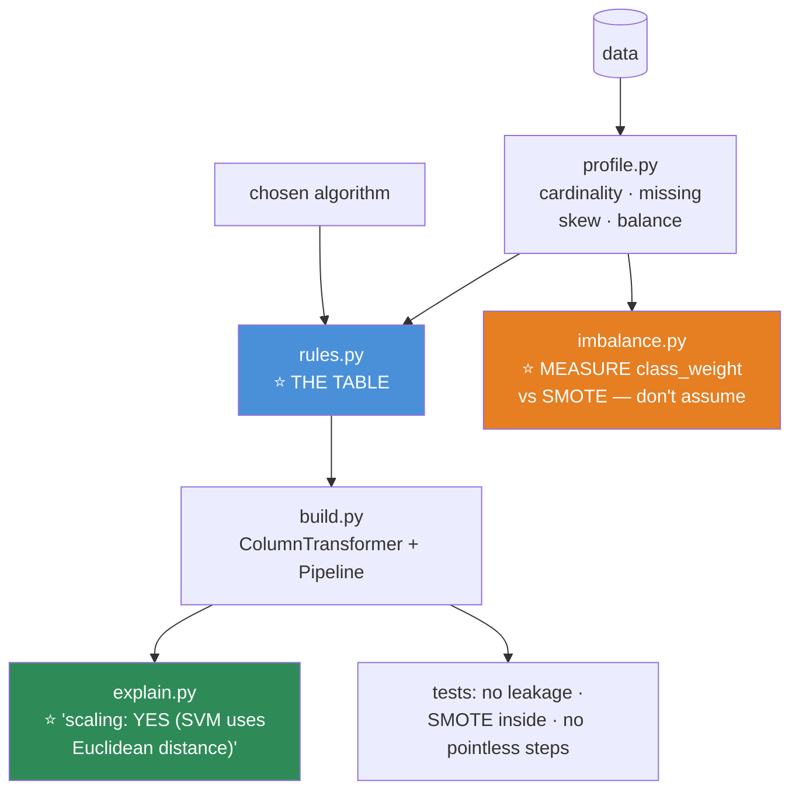

# 08.14 · Feature Engineering for ML

[⬅ 08.13 Cross-Validation](08.13-cross-validation.md) · [🏠 Module 08](../README.md) · [➡ 08.15 Hyperparameter Tuning](08.15-hyperparameter-tuning.md)

> **The lesson in one line:** Which preprocessing you need is *not* a universal recipe — it is a **function of the algorithm you chose**, and the table that maps one to the other is the most useful thing in this lesson.

---

## 🎯 Learning objectives

By the end of this lesson you can:

1. State **which algorithms need scaling** and which don't — and *why*, from first principles.
2. Choose an **encoding** based on cardinality and on the model.
3. Select features with methods that don't lie.
4. Handle **imbalanced data** — and know why `class_weight` usually beats SMOTE.
5. Put **everything** inside a pipeline so leakage is structurally impossible.

---

## 🧠 Mental model

> **Preprocessing is not a checklist. It's a function of the algorithm's inductive bias.**

**KNN needs scaling because it measures distance. Trees don't, because they only compare within one column.** Once you understand *why*, the whole table becomes derivable rather than memorized.

---

## ⭐ THE TABLE — which algorithm needs what

**This is the most useful artifact in the lesson. Learn it.**

| Algorithm | **Scale?** | Why |
|---|---|---|
| **Linear / Logistic regression** | ⭐ **YES** | Gradient descent conditioning + the regularization penalty is scale-dependent ([08.3](08.3-linear-regression.md)) |
| **⭐ SVM** | ⭐⭐ **MANDATORY** | The kernel is built on **Euclidean distance** ([08.7](08.7-svm.md)) |
| **⭐ KNN** | ⭐⭐ **MANDATORY** | It *is* a distance ([08.9](08.9-knn.md)) |
| **⭐ K-Means / PCA** | ⭐⭐ **MANDATORY** | Distance / variance ([08.10](08.10-clustering.md), [08.11](08.11-dimensionality-reduction.md)) |
| Neural networks | ⭐ **YES** | Gradient conditioning ([06.10](../../06-Mathematics/weeks/06.10-neural-network-math.md)) |
| **Decision trees** | ❌ **NO** | Splits are `x <= t` — **scale-invariant** ([08.5](08.5-decision-trees.md)) |
| **⭐ Random Forest / GBM** | ❌ **NO** | They're trees |
| **Naive Bayes** | ❌ No | It's counting / per-feature distributions |

| Algorithm | **Missing values** | **Categoricals** | **Outliers** |
|---|---|---|---|
| Linear / Logistic | ❌ Impute | One-hot | ⚠️ **Sensitive** (MSE squares them) |
| SVM | ❌ Impute | One-hot | ✅ **Robust** (ignores points far from the margin) |
| KNN | ❌ Impute | One-hot | ⚠️ Sensitive |
| Trees / RF | ❌ Impute (sklearn) | Encode | ✅ **Robust** |
| **⭐ LightGBM / XGBoost / HistGB** | ⭐ **NATIVE** ✅ | ⭐ **NATIVE** (LGBM/CatBoost) | ✅ **Robust** |

> [!IMPORTANT]
> **⭐ Look at the last row. LightGBM handles missing values natively, handles categoricals natively, needs no scaling, and is robust to outliers.**
>
> **That is why "just use LightGBM" is such good advice for tabular data**: it removes four entire categories of preprocessing decision, each of which is a chance to introduce a bug or a leak. **The best preprocessing is often the preprocessing you didn't have to do.**
>
> **And it handles NaN *better* than you can**: it learns, per split, whether missing values should go left or right — **turning the missingness into a learned feature** ([07.5](../../07-Data-Analysis/weeks/07.5-data-cleaning.md)'s MNAR insight, built into the algorithm).

---

## 1 · Scaling

| Method | Formula | Use |
|---|---|---|
| **StandardScaler** | $(x-\mu)/\sigma$ | ⭐ **The default** |
| **MinMaxScaler** | $(x-\min)/(\max-\min)$ | Bounded [0,1]. ⚠️ **Destroyed by one outlier** |
| **⭐ RobustScaler** | $(x-\text{median})/\text{IQR}$ | ⭐ **When outliers exist** |
| **PowerTransformer** | Yeo-Johnson / Box-Cox | Makes it Gaussian-ish |
| **QuantileTransformer** | → uniform or normal | Aggressive; kills outliers entirely |
| **`log1p`** | $\log(1+x)$ | ⭐ **Right-skewed** (income, prices, counts) |

> [!CAUTION]
> **⭐ Fit the scaler on TRAIN only.** Fitting on all data leaks the test set's mean and variance ([08.13](08.13-cross-validation.md)). **`Pipeline` enforces this structurally** — use it and you cannot get this wrong.

---

## 2 · Encoding categoricals

| Method | Cardinality | Note |
|---|---|---|
| **One-hot** | ⭐ **< ~15** | ✅ The default for nominal. **Use `handle_unknown='ignore'`** |
| **Ordinal** | Any | ✅ **Only if genuinely ordered** (S<M<L). ⚠️ **Invents a false order otherwise** |
| **Frequency** | High | Cheap, no leakage |
| **⭐ Target (mean) encoding** | ⭐ **High (100s–1000s)** | ⚠️ **LEAKS unless out-of-fold** |
| **Hashing** | Very high / streaming | Collisions |
| **⭐ Native (LightGBM/CatBoost)** | ⭐ **Any** | ✅ **Just use this** |

### ⭐ Target encoding — powerful and dangerous

```python
# 💀 LEAKAGE — each row's encoding contains ITS OWN target
df['city_enc'] = df.groupby('city')['target'].transform('mean')
# For a city with ONE customer, this is literally that customer's label. 100% train accuracy.

# ✅ Out-of-fold + smoothing
from sklearn.model_selection import KFold
prior = df['target'].mean()
df['city_enc'] = np.nan
for tr, va in KFold(5, shuffle=True, random_state=0).split(df):
    stats = df.iloc[tr].groupby('city')['target'].agg(['mean', 'count'])
    # ⭐ SMOOTHING: shrink rare categories toward the global prior
    m = 10
    smoothed = (stats['mean'] * stats['count'] + prior * m) / (stats['count'] + m)
    df.loc[df.index[va], 'city_enc'] = df.iloc[va]['city'].map(smoothed)
df['city_enc'] = df['city_enc'].fillna(prior)
```

> [!CAUTION]
> **⭐ Naive target encoding is the most seductive leak in ML.** Your training accuracy hits 99%, and the model is worthless — it's reading the answer out of the feature. **Always out-of-fold, always smoothed.** ([07.5](../../07-Data-Analysis/weeks/07.5-data-cleaning.md))
>
> **The smoothing term matters:** a category with 1 observation should be shrunk almost entirely toward the global prior. **`m=10` means "trust this category's mean only after ~10 observations."** It's a Bayesian prior, again ([08.8](08.8-naive-bayes.md)).

### The unseen-category problem

```python
# ❌ pd.get_dummies at inference → different columns → the model CRASHES
# ✅ sklearn's encoder REMEMBERS the training categories
OneHotEncoder(handle_unknown='ignore')     # ⭐ unseen → all zeros. Doesn't crash.
```

**`pd.get_dummies` is fine for exploration and wrong for production** — it has no memory of the training columns.

---

## 3 · Feature selection

| Method | Cost | Trust |
|---|---|---|
| **Variance threshold** | Free | ✅ Always do it first (drop constants) |
| **Correlation filter** (>0.95) | Cheap | ✅ Kills multicollinearity |
| `SelectKBest` (univariate) | Cheap | ⚠️ **Blind to interactions** |
| Mutual information | Medium | Better — catches non-linear |
| Model importance (MDI) | Medium | ⚠️ **Biased** ([08.5](08.5-decision-trees.md)) |
| **⭐ Permutation importance** | Expensive | ⭐⭐ **The one to trust** |
| **L1 / Lasso** | Free | ✅ Elegant — regularization *is* selection ([08.3](08.3-linear-regression.md)) |

> [!IMPORTANT]
> **⭐ Feature selection MUST be inside the CV pipeline.** Selecting features on the full dataset before cross-validating gives you **~90% accuracy on pure noise** ([08.13](08.13-cross-validation.md)). It is the single most spectacular leak in this module.
> ```python
> pipe = Pipeline([('sel', SelectKBest(k=20)), ('clf', model)])   # ⭐ inside
> ```

> [!TIP]
> **Do you even need feature selection?** **For GBMs — usually not.** They ignore useless features (they just never split on them), and the cost of an extra column is small. **Select features for latency, memory, and maintenance** — not usually for accuracy. **20 good features beat 500 mediocre ones** for reasons that have little to do with the model.

---

## 4 · ⭐ Imbalanced data

| Approach | Verdict |
|---|---|
| **⭐ `class_weight='balanced'`** | ⭐⭐ **Try this FIRST.** Free, one line, usually enough |
| **⭐ Tune the threshold** | ⭐⭐ **Do this ALWAYS.** Often the biggest win ([08.12](08.12-evaluation.md)) |
| **⭐ Use PR-AUC** | Not accuracy, and **not ROC-AUC** |
| Random undersampling | Throws away data |
| Random oversampling | Duplicates → overfitting |
| **SMOTE** | ⚠️ **Popular and often unhelpful.** See below |
| Collect more minority data | ✅ **The real answer, if you can** |

```python
# ⭐ The two lines that solve most imbalance problems
model = LGBMClassifier(class_weight='balanced')      # 1. weight the loss
# ... then:
best_t = tune_threshold_on_cost(y_val, p_val, cost_fp=5, cost_fn=2000)   # 2. move the threshold
```

> [!CAUTION]
> **⭐ SMOTE is far more popular than it is effective, and you should be skeptical of it.**
>
> **What it does:** creates synthetic minority points by **interpolating between a minority point and its neighbors.**
>
> **Why that's often a bad idea:**
> - **In high dimensions**, the interpolated point may land in a region where **no real example could exist** — you've invented data that isn't plausible ([08.9](08.9-knn.md): the curse).
> - **It can interpolate across the class boundary**, creating synthetic "minority" points inside the majority region — **actively harming the model.**
> - **⭐ It must be applied INSIDE the CV loop** (use `imblearn.pipeline.Pipeline`, not sklearn's). **Applying SMOTE before splitting is a catastrophic leak** — synthetic points derived from a validation row end up in training.
> - **Multiple studies find `class_weight` matches or beats it**, at a fraction of the complexity.
>
> **Try `class_weight` + threshold tuning first. Reach for SMOTE only after you've measured, and be prepared to find it doesn't help.**

```python
# ⚠️ If you DO use SMOTE, it MUST be inside the CV loop
from imblearn.pipeline import Pipeline as ImbPipeline   # ⭐ NOT sklearn's Pipeline
from imblearn.over_sampling import SMOTE

pipe = ImbPipeline([
    ('scale', StandardScaler()),
    ('smote', SMOTE(random_state=42)),      # ⭐ applied ONLY to the training fold
    ('clf',   LogisticRegression()),
])
```

---

## 🔧 Putting it all together

```python
from sklearn.compose import ColumnTransformer
from sklearn.pipeline import Pipeline
from sklearn.preprocessing import StandardScaler, OneHotEncoder
from sklearn.impute import SimpleImputer
from sklearn.ensemble import HistGradientBoostingClassifier

numeric = Pipeline([
    ('impute', SimpleImputer(strategy='median', add_indicator=True)),   # ⭐ the FLAG (07.5)
    ('scale',  StandardScaler()),
])
categorical = Pipeline([
    ('impute', SimpleImputer(strategy='constant', fill_value='MISSING')),
    ('encode', OneHotEncoder(handle_unknown='ignore', min_frequency=10)),  # ⭐ both flags
])

preprocess = ColumnTransformer([
    ('num', numeric,     NUMERIC_COLS),
    ('cat', categorical, CATEGORICAL_COLS),
])

model = Pipeline([
    ('prep', preprocess),
    ('clf',  HistGradientBoostingClassifier(class_weight='balanced')),
])
# ⭐ ONE object. Fit on train. Transform everywhere. Leakage is now IMPOSSIBLE.
```

> [!TIP]
> **`add_indicator=True` is the [07.5](../../07-Data-Analysis/weeks/07.5-data-cleaning.md) missing-flag pattern in one argument.** It appends a boolean column for "was this missing?" — and **that flag is frequently more predictive than the imputed column itself** (MNAR). One keyword; real gain.
>
> **`min_frequency=10` in `OneHotEncoder`** lumps rare categories into an "infrequent" bucket — preventing a hundred near-empty columns.

---

## 🐛 Common mistakes

| Mistake | Consequence |
|---|---|
| **Scaling before CV** | ⭐ **Leakage.** Put it in the pipeline |
| **Feature selection before CV** | ⭐ **90% accuracy on noise** |
| **Naive target encoding** | ⭐ Leaks the label. **Out-of-fold + smoothing** |
| **SMOTE before splitting** | ⭐ **Catastrophic leak** — synthetic points from validation rows |
| Scaling for a tree model | Pointless (harmless, but it shows you don't know why) |
| **Label-encoding a nominal variable** | Invents a false order — fatal for linear/NN, partly OK for trees |
| `pd.get_dummies` in production | Unseen categories → column mismatch → **crash** |
| **Reaching for SMOTE first** | **Try `class_weight` + threshold tuning first.** Usually enough |
| Not adding a missing-indicator | You threw away the MNAR signal |
| Trusting MDI feature importance | Biased to high cardinality; splits credit |

---

## 📝 Exercises

**Conceptual**
1. ⭐ **Why do KNN and SVM need scaling but trees don't?** Answer from first principles, not from the table.
2. Why is label-encoding a nominal variable fatal for a linear model but only partly harmful for a tree?
3. ⭐ Why does naive target encoding leak? **What does it give a row from a category of size 1?**
4. ⭐ Why must SMOTE be applied inside the CV loop?
5. Why is `class_weight` often better than SMOTE?

**Implementation**
6. ⭐ Build the same model **with and without** scaling for KNN, SVM, logistic regression, and Random Forest. **Report all eight numbers.** *(Only the first three should change.)*
7. Encode a 500-category column five ways (one-hot, frequency, out-of-fold target, hashing, LightGBM-native). **Compare accuracy AND feature-matrix size.**
8. ⭐ **Demonstrate the target-encoding leak**: encode naively, train, report the (near-perfect) training accuracy and the (terrible) test accuracy. Then do it out-of-fold.
9. Compare `class_weight='balanced'`, random undersampling, random oversampling, and SMOTE on 1%-positive data. **Report PR-AUC ± CI for each.** *(SMOTE will probably not win.)*
10. ⭐ Apply SMOTE **before** splitting, then **inside** an `imblearn` pipeline. **Report both CV scores.** Explain the gap.
11. Compare MDI vs permutation importance on data with a **random ID column**. **Where does the ID rank in each?**

---

## 🛠️ Mini project — *The Preprocessing Advisor*

Build `code/08-machine-learning/preprocessing-advisor/` — a tool that builds the *right* pipeline for your algorithm and data, automatically.

**Requirements**
- **Profile the data** (dtypes, cardinality, missingness, skew, class balance).
- **Given the chosen algorithm**, emit the correct `ColumnTransformer` + `Pipeline`.
- **Refuse to do pointless work** (don't scale for trees) and **refuse to do dangerous work** (no naive target encoding).
- **Prove the pipeline is leakage-free** with a test.

```
preprocessing-advisor/
├── README.md
├── src/
│   ├── profile.py        # dtypes, cardinality, missing, skew, balance
│   ├── rules.py          # ⭐ THE TABLE: algorithm → required preprocessing
│   ├── build.py          # → a fitted-on-train-only Pipeline
│   ├── encode.py         # ⭐ out-of-fold target encoding with smoothing
│   ├── imbalance.py      # ⭐ class_weight vs SMOTE — MEASURED, not assumed
│   └── explain.py        # ⭐ WHY each step was chosen
├── tests/
│   ├── test_no_leakage.py    # ⭐ fitted params don't change when test changes
│   ├── test_smote_inside.py  # ⭐ SMOTE is inside the CV loop
│   └── test_no_pointless.py  # ⭐ assert NO scaler in a tree pipeline
└── notebooks/
```

**Architecture**



**Implementation guidance**
1. **⭐ `rules.py` encodes THE TABLE**, and `explain.py` prints the *reason*: *"Scaling: YES — SVM's RBF kernel is built on Euclidean distance, so an unscaled feature with 1000× the range would dominate it."* **A tool that explains its choices teaches you every time you run it**, which is worth more than one that just works.
2. **⭐ `imbalance.py` MEASURES rather than assumes.** Run `class_weight`, undersampling, oversampling, and SMOTE, and report **PR-AUC ± CI for each** ([06.6](../../06-Mathematics/weeks/06.6-statistics.md)). **You will very likely find `class_weight` + threshold tuning wins** — and having *measured* that, rather than read it, is what makes you trust it.
3. **`test_no_pointless.py` is unusual and correct:** assert the pipeline for a tree model contains **no scaler**. Pointless steps aren't just wasted compute — they're a sign that the author is following a recipe rather than reasoning.
4. **`test_no_leakage.py`:** fit on train, snapshot the fitted parameters, transform a wildly different test set, **assert the parameters are byte-identical** ([07.11](../../07-Data-Analysis/weeks/07.11-pipelines.md)).

**Evaluation strategy:** run the advisor's pipeline vs a hand-built one on three datasets; assert equal-or-better CV scores with **fewer steps.**

**Future improvements:** add automatic **skew detection → `log1p`**; add a **cardinality-based encoder chooser** (one-hot < 15, target-encode 15–1000, hash above); add **latency profiling** of each preprocessing step (a transform that takes 200 ms per row cannot ship).

---

## 📄 Cheat sheet

### ⭐ THE TABLE

| Algorithm | Scale? | Missing | Categorical | Outliers |
|---|---|---|---|---|
| Linear / Logistic | ⭐ **YES** | Impute | One-hot | ⚠️ Sensitive |
| **SVM** | ⭐⭐ **MANDATORY** | Impute | One-hot | ✅ Robust |
| **KNN / K-Means / PCA** | ⭐⭐ **MANDATORY** | Impute | One-hot | ⚠️ Sensitive |
| Neural net | ⭐ **YES** | Impute | Embed/one-hot | ⚠️ Sensitive |
| Decision tree / RF | ❌ **NO** | Impute | Encode | ✅ Robust |
| **⭐ LightGBM / XGBoost** | ❌ **NO** | ⭐ **NATIVE** | ⭐ **NATIVE** | ✅ Robust |

| Task | Do |
|---|---|
| **Scaling** | StandardScaler (default) · **RobustScaler** (outliers) · **`log1p`** (skew) |
| **Encoding** | One-hot (<15) · Frequency · **Out-of-fold target** (high card) · **LGBM native** |
| **Missing** | ⭐ **Impute + `add_indicator=True`** (the flag is often more predictive) |
| **Selection** | Variance → correlation → ⭐ **permutation importance (on validation)** |
| **⭐ Imbalance** | ⭐ **`class_weight='balanced'` + TUNE THE THRESHOLD + PR-AUC.** SMOTE last |

**⭐⭐ EVERYTHING WITH A `fit` GOES INSIDE THE PIPELINE.** Scaler, imputer, encoder, PCA, TF-IDF, selector, target encoder, SMOTE.
**⚠️ SMOTE must be inside the CV loop** (`imblearn.pipeline`), or it's a catastrophic leak.
**⚠️ Naive target encoding leaks the label.** Out-of-fold + smoothing.

---

## 🎴 Flashcards

- **Q:** ⭐ Which algorithms need scaling, and why? → **A:** **Distance-based** (KNN, SVM, K-Means, PCA — **mandatory**) and **gradient-based** (linear, logistic, NNs — for conditioning and because the regularization penalty is scale-dependent). **Trees don't** — splits are `x <= t`, which is **scale-invariant**.
- **Q:** ⭐ Why is "just use LightGBM" such good advice for tabular data? → **A:** It needs **no scaling**, handles **missing values natively** (it learns which way NaN should go at each split), handles **categoricals natively**, and is **robust to outliers.** It removes four whole categories of preprocessing decision — **each of which is a chance to introduce a bug or a leak.**
- **Q:** ⭐ Why does naive target encoding leak catastrophically? → **A:** `groupby.transform('mean')` gives each row **its own target** — literally, for a category of size 1. **99% training accuracy, worthless model.** Use **out-of-fold + smoothing** (shrink rare categories toward the global prior).
- **Q:** ⭐ What's wrong with SMOTE? → **A:** It **interpolates** between minority points — which in high dimensions can create **implausible points**, and can **cross the class boundary.** **It must be inside the CV loop** or it's a catastrophic leak. **Multiple studies find `class_weight` matches or beats it.** Try that first.
- **Q:** ⭐ Best first moves for imbalanced data? → **A:** **`class_weight='balanced'`** + **tune the threshold on business cost** + report **PR-AUC**. Two lines, and they solve most imbalance problems.
- **Q:** Why `add_indicator=True` when imputing? → **A:** It adds a "was this missing?" flag — **and that flag is often more predictive than the imputed column** (the MNAR insight from [07.5](../../07-Data-Analysis/weeks/07.5-data-cleaning.md)).
- **Q:** Why must feature selection be inside the CV pipeline? → **A:** Selecting on the full data gives you **~90% accuracy on pure noise** — the selector already found the features that fit the labels, *including in the validation folds*.
- **Q:** Do you need feature selection with a GBM? → **A:** **Usually not for accuracy** — it just won't split on useless features. **Select for latency, memory, and maintenance.** 20 good features beat 500 mediocre ones for reasons that have nothing to do with the model.
- **Q:** Why is `pd.get_dummies` wrong for production? → **A:** **It has no memory of the training columns.** An unseen category at inference changes the column count and **crashes the model.** Use `OneHotEncoder(handle_unknown='ignore')`.

---

## 💼 Interview questions

1. **⭐ "Which models need feature scaling?"** — Distance-based (KNN, SVM, K-Means, PCA — **mandatory**) and gradient-based (linear, logistic, NNs). **Trees don't** — and **being able to say *why* (splits are scale-invariant) is what distinguishes understanding from memorization.**
2. **"How would you encode a 10,000-category feature?"** — **Not one-hot.** Frequency, **out-of-fold target encoding** (with smoothing), hashing, embeddings, or **LightGBM/CatBoost native handling**.
3. **"How do you handle imbalanced data?"** — **`class_weight='balanced'` + tune the threshold + PR-AUC.** Then mention SMOTE **and be skeptical of it** — that skepticism is a strong signal.
4. **⭐ "You applied SMOTE and your CV score jumped to 0.97. Thoughts?"** — **You probably applied it before splitting.** Synthetic points derived from validation rows are now in training. **It must be inside the CV loop.**
5. **"Why does your pipeline have no scaler?"** — **Because it ends in a gradient-boosted tree, and splits are scale-invariant.** A pointless step is a sign of a recipe being followed rather than reasoning being done.

---

## 📚 Summary

- **⭐ Preprocessing is a function of the algorithm, not a universal checklist.** **Distance-based methods (KNN, SVM, K-Means, PCA) need scaling — mandatorily. Trees don't**, because splits are scale-invariant. Once you know *why*, the table is derivable.
- **⭐ "Just use LightGBM" is good advice for tabular data** because it eliminates four whole categories of preprocessing decision: **no scaling, native missing values, native categoricals, outlier-robust.** **The best preprocessing is often the preprocessing you didn't have to do.**
- **Encode by cardinality:** one-hot below ~15; frequency or **out-of-fold target encoding** (with smoothing) above; or just let LightGBM/CatBoost do it. **Naive target encoding leaks the label** and gives you 99% training accuracy on a worthless model.
- **Impute with `add_indicator=True`** — the missingness flag is frequently more predictive than the imputed value.
- **⭐ Feature selection must be inside the CV pipeline**, or you'll get **90% accuracy on pure noise.** And with a GBM you often don't need it for accuracy at all — select for **latency, memory, and maintenance**.
- **⭐ For imbalanced data: `class_weight='balanced'` + tune the threshold + report PR-AUC.** Two lines, and they solve most of it. **Be skeptical of SMOTE** — it can invent implausible points, it must be inside the CV loop (or it's a catastrophic leak), and **`class_weight` frequently matches or beats it.**
- **⭐⭐ Everything with a `fit` method goes inside the Pipeline.** That's not tidiness; **it's the structural guarantee that makes leakage impossible.**

**Next:** [08.15 Hyperparameter Tuning](08.15-hyperparameter-tuning.md) — the +1–3% that everyone starts with and should finish with.

---

## 🔗 References

- Kuhn & Johnson — *Feature Engineering and Selection* (free at bookdown.org/max/FES). Rigorous, and strong on the leakage traps.
- Zheng & Casari — *Feature Engineering for Machine Learning* (O'Reilly).
- Micci-Barreca (2001) — target encoding **with smoothing** — the paper that got it right the first time.
- **Elor & Averbuch-Elor (2022)** — *To SMOTE, or not to SMOTE?* — **⭐ the empirical case against SMOTE.** Read it before you reach for it.
- Prokhorenkova et al. (2018) — **CatBoost**'s ordered target encoding — a genuinely elegant leakage-free scheme.
- [07.5 Data Cleaning](../../07-Data-Analysis/weeks/07.5-data-cleaning.md) and [07.7 Feature Engineering](../../07-Data-Analysis/weeks/07.7-feature-engineering.md) — the groundwork.

---

## 🧭 Navigation

| Direction | Link |
|---|---|
| ⬅ Previous | [08.13 Cross-Validation & Leakage](08.13-cross-validation.md) |
| ➡ Next | [08.15 Hyperparameter Tuning](08.15-hyperparameter-tuning.md) |
| 🏠 Module | [Module 08](../README.md) |
| 🗺 Roadmap | [ROADMAP.md](../../../ROADMAP.md) |
