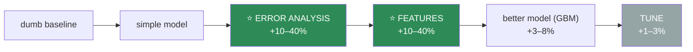
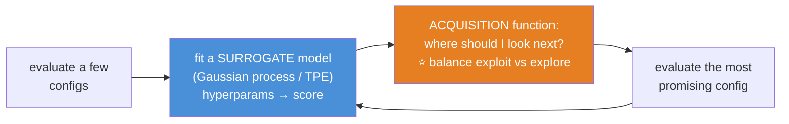
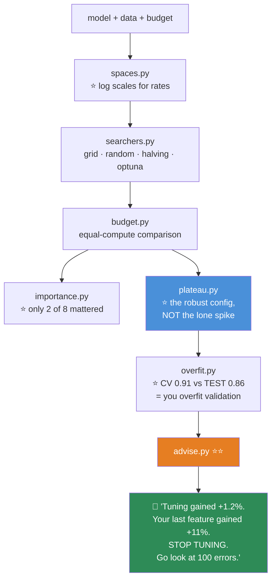

# 08.15 · Hyperparameter Tuning

[⬅ 08.14 Feature Engineering](08.14-feature-engineering.md) · [🏠 Module 08](../README.md) · [➡ 08.16 Interpretability](08.16-interpretability.md)

> **The lesson in one line:** Random search beats grid search, Bayesian search beats random search — and **all of them are worth less than one good feature**, which is why tuning belongs at the *end* of your workflow and not the beginning.

---

## 🎯 Learning objectives

By the end of this lesson you can:

1. Distinguish a **parameter** from a **hyperparameter**.
2. Explain **why random search beats grid search** — with the geometric argument.
3. Explain **Bayesian optimization** conceptually, and know when it's worth the complexity.
4. Use **early stopping** and **successive halving** to make search affordable.
5. Avoid **overfitting the validation set** during search.
6. **Know when to stop.**

---

## 🧠 Mental model

> **Tuning is the last 1–3%. Features are the first 40%. Do them in that order.**



> [!IMPORTANT]
> **⭐ Everyone starts with tuning, because it's the part you can do without thinking.** You launch a grid search, go to lunch, and feel productive.
>
> **It is the lowest-return activity in the entire workflow.** A 200-configuration grid search that runs for six hours buys you **+1.5%**. **One afternoon of error analysis** ([08.2](08.2-ml-workflow.md)) — looking at 100 wrong predictions with your eyes — routinely buys you **+15%**, because it tells you which feature is missing.
>
> **Tune last. Tune briefly. Then stop.**

| Parameter | Hyperparameter |
|---|---|
| **Learned** from data (`fit`) | **Set by you**, before fitting |
| Weights, splits, centroids | `max_depth`, `C`, `learning_rate`, `k` |
| Optimized by gradient descent | Optimized by **search** |

---

## 1 · Grid Search — and why it wastes your compute

```python
from sklearn.model_selection import GridSearchCV

grid = GridSearchCV(pipe, {
    'clf__max_depth':    [3, 5, 7, 10],       # 4
    'clf__learning_rate':[0.01, 0.05, 0.1],   # × 3
    'clf__subsample':    [0.6, 0.8, 1.0],     # × 3
}, cv=5, scoring='average_precision', n_jobs=-1)
# = 36 combos × 5 folds = 180 fits
```

**Exhaustive. Reproducible. And exponentially expensive: 5 hyperparameters × 5 values each = 3,125 combos × 5 folds = 15,625 fits.**

---

## 2 · ⭐ Random Search — and why it wins

```python
from sklearn.model_selection import RandomizedSearchCV
from scipy.stats import loguniform, randint

search = RandomizedSearchCV(pipe, {
    'clf__max_depth':     randint(3, 12),
    'clf__learning_rate': loguniform(0.01, 0.3),     # ⭐ LOG scale for rates!
    'clf__subsample':     uniform(0.5, 0.5),          # 0.5 to 1.0
    'clf__reg_lambda':    loguniform(1e-3, 10),
}, n_iter=60, cv=5, scoring='average_precision', n_jobs=-1, random_state=42)
```

> [!IMPORTANT]
> **⭐⭐ Why random search beats grid search — the argument that will surprise you.**
>
> **Most hyperparameters don't matter.** In a typical problem, **1 or 2 hyperparameters drive nearly all the performance**, and the rest are nearly irrelevant.
>
> **Now consider a 9-point grid over 2 parameters (3 × 3).** It tests only **3 distinct values** of the parameter that actually matters — the other 6 evaluations are re-testing the same 3 values with different settings of an irrelevant parameter. **You spent 9 fits to learn about 3 points.**
>
> **Random search with 9 samples tests 9 DISTINCT values** of the important parameter. **Three times the resolution, identical compute.**
>
> **And it gets exponentially better as you add dimensions.** With 5 hyperparameters of which 1 matters, a grid wastes almost everything. **Bergstra & Bengio (2012) showed random search finds better models in a fraction of the time — and it's one of the most practically useful results in applied ML.**

> 🖼️ **[IMAGE PLACEHOLDER: `assets/images/08-grid-vs-random.png`]**
> *Two square panels side by side. Both show a 2-D hyperparameter space with a "performance" heatmap behind it — the performance varies strongly along the x-axis (the **important** parameter) and barely at all along the y-axis (the **unimportant** one), shown as vertical bands of colour. **Left (Grid search, 9 points):** a regular 3×3 lattice. Marginal projections drawn on the x-axis show only **3 distinct x-values tested**. Annotated "9 fits → only 3 values of the parameter that matters." **Right (Random search, 9 points):** 9 scattered points. Marginals show **9 distinct x-values**. Annotated "9 fits → 9 values of the parameter that matters. **3× the resolution, same compute.**" Caption: "Most hyperparameters don't matter. Grids waste their budget rediscovering that."*

> [!TIP]
> **⭐ Always sample rates and regularization strengths on a LOG scale** (`loguniform`). The difference between `lr=0.001` and `lr=0.01` is enormous; the difference between `0.21` and `0.22` is nothing. **A uniform sample over [0.001, 0.3] wastes 97% of its draws in the region where nothing changes.**

---

## 3 · Bayesian Optimization — search that learns

> **Grid and random search are *memoryless*. They don't learn from the configurations they've already tried.**

**Bayesian optimization builds a probabilistic model of "hyperparameters → score", and uses it to decide what to try next.**



**The key idea: the acquisition function balances two competing goals:**
- **Exploit** — sample where the surrogate predicts a *high score*.
- **Explore** — sample where the surrogate is *uncertain* (it might be great, and we don't know).

**That trade-off is the whole algorithm**, and it's why Bayesian optimization finds good configs in **10–50 evaluations** where random search needs 100–500.

```python
import optuna

def objective(trial):
    params = {
        'max_depth':     trial.suggest_int('max_depth', 3, 12),
        'learning_rate': trial.suggest_float('learning_rate', 0.01, 0.3, log=True),  # ⭐ log
        'num_leaves':    trial.suggest_int('num_leaves', 15, 255, log=True),
        'subsample':     trial.suggest_float('subsample', 0.5, 1.0),
        'reg_lambda':    trial.suggest_float('reg_lambda', 1e-3, 10, log=True),
    }
    model = LGBMClassifier(**params, n_estimators=2000)
    return cross_val_score(model, X, y, cv=5, scoring='average_precision').mean()

study = optuna.create_study(direction='maximize',
                            pruner=optuna.pruners.MedianPruner())   # ⭐ kill bad trials early
study.optimize(objective, n_trials=100)
print(study.best_params, study.best_value)

optuna.visualization.plot_param_importances(study)    # ⭐ WHICH params actually mattered?
```

> [!TIP]
> **⭐ `plot_param_importances` is the most underrated output of any tuning run.** It tells you **which hyperparameters actually mattered** — and you'll typically find that **2 of your 8 explain 90% of the variance.** **Then narrow the search to those two and re-run.** That's a 4× efficiency gain from reading one plot.
>
> **And `MedianPruner` kills unpromising trials early** — if a config is below the median at 20% of training, stop it. **Often a 3–5× speedup for free.**

| | Grid | Random | **Bayesian** |
|---|---|---|---|
| Learns from past trials | ❌ | ❌ | ⭐ **Yes** |
| Parallel | ✅ Perfectly | ✅ Perfectly | 🟡 **Sequential-ish** |
| Reproducible | ✅ | ✅ (seed) | ✅ (seed) |
| Evaluations needed | Exponential | 50–500 | ⭐ **10–50** |
| Complexity | Trivial | Trivial | Moderate |
| **When** | Tiny spaces | ⭐ **The default** | ⭐ **Expensive models** (deep nets, big GBMs) |

> [!IMPORTANT]
> **⭐ When is Bayesian optimization actually worth it?** **When each evaluation is expensive.** If a fit takes 3 seconds, run 500 random trials and go home — the sequential overhead of Bayesian search isn't worth it, and random search parallelizes perfectly.
>
> **If a fit takes 2 hours (a deep net, a large GBM on 10M rows), Bayesian optimization can save you days.** That's when it earns its complexity. **Use Optuna; it's excellent and it's what the field has standardized on.**

---

## 4 · Making search affordable

### ⭐ Early stopping (for iterative models)

```python
# ⭐ Don't tune n_estimators. Set it high; let the data decide. (08.6)
model = LGBMClassifier(n_estimators=5000, learning_rate=0.05)
model.fit(X_tr, y_tr, eval_set=[(X_val, y_val)],
          callbacks=[lgb.early_stopping(50)])
```

**This removes an entire hyperparameter from the search — for free.** Never grid-search `n_estimators`.

### Successive halving

```python
from sklearn.experimental import enable_halving_search_cv
from sklearn.model_selection import HalvingRandomSearchCV

search = HalvingRandomSearchCV(pipe, param_dist, factor=3, resource='n_samples',
                               cv=5, random_state=42)
```

> [!TIP]
> **⭐ Successive halving (and Hyperband) is a lovely idea:** start **many** configs on a **small** budget (a fraction of the data, or a few iterations), **kill the worst half (or two-thirds)**, and give the survivors more budget. **Repeat.**
>
> **You spend most of your compute on the configs that are actually promising**, rather than giving every config the full budget. **Typically 3–10× faster than plain random search for the same result.** Wildly underused.

---

## 5 · ⭐ Overfitting the validation set

> [!CAUTION]
> **⭐⭐ Try 1,000 configurations and pick the best CV score, and you have overfit your validation folds.**
>
> **You selected the maximum of 1,000 noisy samples — and the max of noisy samples is systematically an overestimate** ([06.6](../../06-Mathematics/weeks/06.6-statistics.md)). Some config got lucky on those particular folds. **Your reported number is fiction.**
>
> **Signs you've done it:** the best CV score is far above the runner-ups (a lucky outlier, not a better model), and **your held-out test score is much lower than your CV score.**

**Defences:**

| Defence | How |
|---|---|
| **⭐ Held-out test set, touched once** | ⭐⭐ **The best defence.** It's the only honest number you have ([08.2](08.2-ml-workflow.md)) |
| **Fewer trials** | 50 well-chosen beats 5,000 desperate |
| **Nested CV** | Unbiased estimate — but k² fits ([08.13](08.13-cross-validation.md)) |
| **⭐ Prefer stability over the max** | ⭐ Pick a config in a **broad, flat region** of good scores, not a lone spike |
| **Report the ± std** | If the top 20 configs are within one std, **they're all the same model** |

> [!TIP]
> **⭐ Don't pick the config with the single best CV score. Pick one from the broad plateau of good scores.**
>
> **A lone spike is almost always luck.** A **flat region** of similarly-good configurations is a genuinely robust setting — and it will generalize better, because it isn't balanced on a knife-edge of a particular fold assignment. **Plot the score against each hyperparameter and look for the plateau, not the peak.**

---

## 6 · Where to actually spend your budget

| Model | Tune these, in order |
|---|---|
| **LightGBM/XGBoost** | ⭐ **`n_estimators` (early stopping — free)** → `learning_rate` → `num_leaves`/`max_depth` → `min_child_samples` → `subsample`/`colsample` → `reg_lambda` |
| **Random Forest** | `max_features` ⭐ → `min_samples_leaf` → `max_depth`. *(`n_estimators`: just use 500 — more never hurts)* |
| **Logistic regression** | `C` (log scale) → `penalty` |
| **SVM** | ⭐ **`C` and `gamma` — jointly, log scale** ([08.7](08.7-svm.md)) |
| **KNN** | `k` → `weights` → `metric` |
| **⭐ Neural nets** | ⭐⭐ **Learning rate. It matters more than everything else combined** ([06.7](../../06-Mathematics/weeks/06.7-optimization.md)) |

> [!IMPORTANT]
> **⭐ For any gradient-based model, the learning rate dominates everything.** If you can tune exactly one thing, tune that ([06.7](../../06-Mathematics/weeks/06.7-optimization.md)). A well-tuned LR with default everything-else beats a badly-tuned LR with a perfect grid over the rest.

---

## 🐛 Common mistakes

| Mistake | Consequence |
|---|---|
| **⭐ Tuning before feature engineering** | +1–3% instead of +10–40%. **The wrong order** |
| **Grid search over 5+ parameters** | Exponential cost; wasted on parameters that don't matter |
| **Uniform sampling of learning rates** | 97% of draws land where nothing changes. **Use `loguniform`** |
| **Grid-searching `n_estimators`** | **Use early stopping.** It's free |
| **⭐ Picking the single best CV score** | **Overfit the validation folds.** Prefer the plateau |
| **Tuning on the test set** | Your number is fiction |
| **Preprocessing outside the search's CV** | ⭐ **Leakage** ([08.13](08.13-cross-validation.md)) |
| Bayesian optimization on a 3-second model | Pointless overhead. Random search parallelizes perfectly |
| Not looking at `plot_param_importances` | You wasted budget on parameters that didn't matter |
| **Not knowing when to stop** | Diminishing returns forever |

---

## 📝 Exercises

**Conceptual**
1. Parameter vs hyperparameter. Give three of each.
2. ⭐⭐ **Explain why random search beats grid search.** Use the "most hyperparameters don't matter" argument, with the 3×3 grid example.
3. Why sample learning rates on a **log** scale?
4. Explain Bayesian optimization. **What are the surrogate and the acquisition function doing?** What's the exploit/explore trade-off?
5. ⭐ **Why does trying 1,000 configs and reporting the best CV score overfit the validation set?**
6. Why should you prefer a **plateau** over a **peak**?

**Implementation**
7. ⭐ **Run grid search and random search with the SAME compute budget (e.g. 36 fits).** Report the best score from each. **Repeat 10 times with different seeds and report the mean ± std.** *(Random should win, on average.)*
8. Run Optuna with 100 trials. **Plot `param_importances`.** Which 2 of your 8 hyperparameters mattered? **Now re-run with only those 2 and 30 trials.** Compare.
9. Compare `RandomizedSearchCV` vs `HalvingRandomSearchCV` with the same budget. **Report wall-clock time and best score.**
10. Use early stopping instead of tuning `n_estimators`. **Report the trees actually used** and the time saved.
11. ⭐ **Demonstrate validation-set overfitting**: run 500 random configs, record the best CV score, then evaluate on a held-out test set. **Report the gap.** Now do the same with 20 configs. **Which gap is bigger?**

**Analysis**
12. **Plot CV score vs each hyperparameter.** Find the plateau. **Would you pick the peak or the plateau's center? Why?**
13. ⭐ **Compare the gain from tuning against the gain from ONE new feature.** Report both. *(This exercise is the entire lesson.)*

---

## 🛠️ Mini project — *The Tuning Budget Advisor*

Build `code/08-machine-learning/tuning/` — a tool that spends your compute budget wisely and **tells you when to stop.**

**Requirements**
- Compare **grid, random, halving, and Bayesian** search on an equal budget.
- **⭐ Report which hyperparameters actually mattered.**
- **⭐ Detect validation-set overfitting** (compare the best CV score to a held-out test score).
- **⭐ Recommend the plateau, not the peak.**
- **⭐ Tell the user when the returns have diminished — and to go do error analysis instead.**

```
tuning/
├── README.md
├── src/
│   ├── spaces.py         # ⭐ sensible search spaces per algorithm (LOG scales!)
│   ├── searchers.py      # grid / random / halving / optuna
│   ├── budget.py         # equal-compute comparison
│   ├── importance.py     # ⭐ which hyperparams mattered?
│   ├── plateau.py        # ⭐ recommend a ROBUST config, not the peak
│   ├── overfit.py        # ⭐ CV score vs held-out test → the optimism gap
│   └── advise.py         # ⭐⭐ "STOP TUNING. Go do error analysis."
├── tests/
│   └── test_plateau.py   # ⭐ assert it doesn't pick a lone spike
└── notebooks/
```

**Architecture**



**Implementation guidance**
1. **⭐⭐ `advise.py` is the point of the whole project, and it's the file that will change your behaviour.** It tracks the **marginal gain per hour of compute** and, once tuning drops below a threshold, **tells you to stop and go do error analysis instead** ([08.2](08.2-ml-workflow.md)).
   **A tool that tells you to stop using it is a genuinely good tool**, and building it will do more for your judgement than any amount of reading about tuning.
2. **⭐ `plateau.py`:** instead of returning `best_params_`, cluster the top-N configs and return the **center of the largest cluster of good scores.** A lone spike is luck; a broad plateau is a robust setting. **Test that it refuses to pick an isolated peak.**
3. **⭐ `overfit.py` prints the honest sentence:** *"Best CV: 0.91. Held-out test: 0.86. **You overfit your validation folds by 5 points across 500 trials.**"* Deliver that before a launch and you will have saved someone from an embarrassing quarter.
4. **`spaces.py` bakes in the good defaults** — log scales for learning rates and regularization, integer ranges for depths, and **early stopping instead of tuning `n_estimators`.** Make the right thing the easy thing.

**Evaluation strategy:** on 3 datasets, compare the 4 searchers at equal compute (wall-clock and n_fits). Report best score ± CI. **And report the "did tuning even matter?" number** — the gap between default hyperparameters and the tuned ones. *(On a GBM, it's often smaller than people expect.)*

**Testing plan:** `test_plateau` (assert it rejects a planted lone spike), `test_log_scale` (assert learning rates are sampled log-uniformly), `test_pipeline_in_search` (assert preprocessing is inside the CV — **or the whole search is leaking**).

**Future improvements:** add **multi-objective** optimization (Optuna supports it) — maximize PR-AUC **and** minimize inference latency, and produce the **Pareto front**. That's what a real production decision actually looks like, and it's a genuinely useful thing to be able to hand someone.

---

## 📄 Cheat sheet

| Method | When |
|---|---|
| **Grid** | Tiny spaces (≤ 2–3 params) |
| **⭐ Random** | ⭐ **The default.** Beats grid at equal compute |
| **Halving / Hyperband** | ⭐ Many configs, cheap early signal. **3–10× faster** |
| **⭐ Bayesian (Optuna)** | ⭐ **Expensive models** (each fit ≫ minutes) |

| Rule | |
|---|---|
| ⭐⭐ **Tune LAST** | Features +10–40% · Tuning **+1–3%** |
| ⭐ **Random > grid** | **Most hyperparameters don't matter.** A grid wastes its budget rediscovering that |
| ⭐ **Log scale** | For learning rates, `C`, `gamma`, regularization |
| ⭐ **Early stopping** | **Never grid-search `n_estimators`** |
| ⭐ **Prefer the PLATEAU** | A lone spike is luck |
| ⭐ **Beware validation overfitting** | 1,000 trials → the max of 1,000 noisy samples. **Hold out a test set** |
| ⭐ **Check param importances** | Usually 2 of 8 matter. **Then narrow and re-run** |
| **The #1 hyperparameter** | ⭐ **The learning rate**, for anything gradient-based |

---

## 🎴 Flashcards

- **Q:** Parameter vs hyperparameter? → **A:** **Parameters are learned** from data (weights, splits, centroids). **Hyperparameters are set by you** before fitting (`max_depth`, `C`, `learning_rate`) and optimized by **search**.
- **Q:** ⭐⭐ Why does random search beat grid search? → **A:** **Most hyperparameters don't matter.** A 3×3 grid tests only **3 distinct values** of the one parameter that does — the other 6 fits re-test the same 3 values. **Random search with 9 samples tests 9 distinct values. Three times the resolution, same compute** — and it gets exponentially better with more dimensions.
- **Q:** ⭐ Why sample learning rates on a **log** scale? → **A:** The difference between 0.001 and 0.01 is **enormous**; between 0.21 and 0.22 is **nothing**. A uniform sample wastes almost all its draws where nothing changes.
- **Q:** What is Bayesian optimization? → **A:** Fit a **surrogate model** (hyperparams → score), then use an **acquisition function** to pick the next config — **balancing exploit** (where the score looks high) **and explore** (where the model is uncertain). **10–50 evaluations instead of 100–500.**
- **Q:** When is Bayesian optimization worth it? → **A:** **When each evaluation is expensive** (deep nets, big GBMs). **If a fit takes 3 seconds, just run 500 random trials** — random parallelizes perfectly and Bayesian's sequential overhead isn't worth it.
- **Q:** ⭐⭐ Why does trying 1,000 configs and reporting the best CV score overfit the validation set? → **A:** **You selected the maximum of 1,000 noisy samples**, which is systematically an overestimate. Some config got lucky on those folds. **Defence: a held-out test set, touched once.**
- **Q:** ⭐ Why prefer a plateau over a peak? → **A:** **A lone spike is almost always luck.** A broad, flat region of good scores is a **robust** setting that will generalize — it isn't balanced on a knife-edge of one particular fold assignment.
- **Q:** How do you avoid tuning `n_estimators`? → **A:** ⭐ **Early stopping.** Set it absurdly high and let the validation loss decide. **Removes an entire hyperparameter from the search, for free.**
- **Q:** What is successive halving? → **A:** Start **many** configs on a **small** budget, **kill the worst half**, give survivors more budget, repeat. **Spend your compute on the promising configs.** 3–10× faster than random search.
- **Q:** ⭐ What's the most important hyperparameter for anything gradient-based? → **A:** **The learning rate**, by a wide margin. A well-tuned LR with defaults elsewhere beats a badly-tuned LR with a perfect grid over everything else.
- **Q:** ⭐ Where does tuning belong in the workflow, and why? → **A:** **Last.** It buys **+1–3%**. **Error analysis and features buy +10–40%.** Everyone starts with tuning **because it's the part you can do without thinking.**

---

## 💼 Interview questions

1. **⭐⭐ "Grid search or random search?"** — **Random**, and give the reason: **most hyperparameters don't matter**, so a grid spends most of its budget re-testing the same few values of the parameter that does. **Bergstra & Bengio (2012).** This is a high-signal question.
2. **"What is Bayesian optimization, and when is it worth it?"** — Surrogate + acquisition function, exploit vs explore. **Worth it when each evaluation is expensive.** For a 3-second fit, random search wins on wall-clock because it parallelizes.
3. **⭐ "You ran 1,000 configs and got 0.94 CV. Is that your expected production score?"** — **No.** You **selected the maximum of 1,000 noisy samples** — you've overfit the validation folds. **Check against a held-out test set.**
4. **"How would you tune a LightGBM model?"** — **Early stopping for `n_estimators` (free)**, then `learning_rate` (log scale), then `num_leaves`, then regularization. **Random or Optuna, not grid.** And check `param_importances` to narrow the search.
5. **⭐ "You have a week and one model. How do you spend it?"** — **Not on tuning.** Day 1: **error analysis** on 100 wrong predictions. Days 2–4: **features**. Day 5: a better model. **Day 6: tune, briefly.** Day 7: honest evaluation. **The order is the answer.**

---

## 📚 Summary

- **⭐⭐ Tune LAST.** Features buy **+10–40%**; error analysis can buy more; **tuning buys +1–3%.** Everyone starts with tuning because it's the part that requires no thinking.
- **⭐ Random search beats grid search at equal compute**, because **most hyperparameters don't matter** — a grid spends its budget re-testing the same few values of the one that does. **Random search gets 3× the resolution on the important parameter for free**, and the advantage grows exponentially with dimensions.
- **⭐ Sample rates and regularization on a LOG scale.** A uniform draw over [0.001, 0.3] wastes 97% of its samples where nothing changes.
- **Bayesian optimization (Optuna)** fits a surrogate and balances **exploit vs explore** — 10–50 evaluations instead of hundreds. **Worth it only when each fit is expensive**; for cheap models, random search parallelizes better.
- **⭐ Use early stopping instead of tuning `n_estimators`** — it removes a whole hyperparameter for free. **And successive halving** spends your budget on the promising configs (3–10× faster).
- **⭐⭐ Trying 1,000 configs and reporting the best CV score OVERFITS the validation set** — you selected the max of 1,000 noisy samples. **Hold out a test set and touch it once.**
- **⭐ Prefer the plateau over the peak.** A lone spike is luck; a broad region of good scores is a robust setting.
- **Check which hyperparameters actually mattered** (`plot_param_importances`) — usually **2 of 8** — then narrow and re-run.
- **For anything gradient-based, the learning rate dominates everything else combined.**

**Next:** [08.16 Model Interpretability](08.16-interpretability.md) — you have a model that works. Now find out *why*, before someone with a lawyer asks you.

---

## 🔗 References

- **Bergstra & Bengio (2012)** — *Random Search for Hyper-Parameter Optimization*. **⭐⭐ The paper.** Short, decisive, and it will change how you tune. The "most hyperparameters don't matter" figure is worth the read alone.
- Snoek, Larochelle & Adams (2012) — *Practical Bayesian Optimization of Machine Learning Algorithms*.
- Li et al. (2018) — *Hyperband: A Novel Bandit-Based Approach to Hyperparameter Optimization* — successive halving, done properly.
- Akiba et al. (2019) — ***Optuna***. The library the field standardized on. Its pruning and importance plots are excellent.
- **Cawley & Talbot (2010)** — *On Over-fitting in Model Selection* — **the rigorous version of "your best CV score is a lie."**
- [08.2 The ML Workflow](08.2-ml-workflow.md) — error analysis, which is what you should be doing instead.

---

## 🧭 Navigation

| Direction | Link |
|---|---|
| ⬅ Previous | [08.14 Feature Engineering for ML](08.14-feature-engineering.md) |
| ➡ Next | [08.16 Model Interpretability](08.16-interpretability.md) |
| 🏠 Module | [Module 08](../README.md) |
| 🗺 Roadmap | [ROADMAP.md](../../../ROADMAP.md) |
