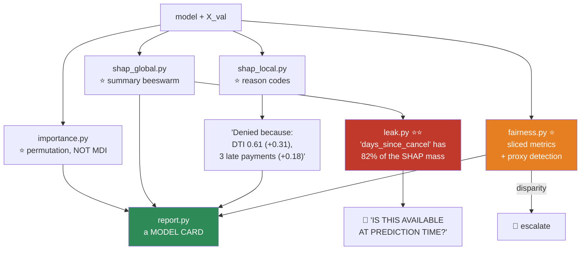

# 08.16 · Model Interpretability

[⬅ 08.15 Hyperparameter Tuning](08.15-hyperparameter-tuning.md) · [🏠 Module 08](../README.md) · [➡ 08.17 Production ML](08.17-production-ml.md)

> **The lesson in one line:** A model you cannot explain is a model you cannot debug, cannot defend to a regulator, and cannot trust — and the built-in feature importance you've been reading is lying to you.

---

## 🎯 Learning objectives

By the end of this lesson you can:

1. State the four reasons interpretability matters — **including the one that's about you, not the regulator.**
2. Explain why **built-in feature importance (MDI) is biased**, and what to use instead.
3. Use **permutation importance** correctly.
4. Explain **SHAP** — global *and* local explanations, with a real theoretical guarantee.
5. Explain **LIME** and know its weakness.
6. Use interpretability to **find bugs and leakage**, which is what it's actually best at.

---

## 🧠 Mental model

> **"Why did the model say that?" is not a philosophy question. It's a debugging question, a legal question, and a trust question — and you should be able to answer it before someone forces you to.**

| Why it matters | Because |
|---|---|
| **⭐ Debugging** | ⭐⭐ **The real reason.** A feature with 95% of the importance is a **leak** ([07.6](../../07-Data-Analysis/weeks/07.6-eda.md)), not a discovery |
| **⭐ Legal** | Credit, insurance, hiring, and housing decisions **legally require an explanation** (GDPR Art. 22, ECOA/Reg B "adverse action notices") |
| **Trust** | A doctor will not act on a number from a box |
| **Fairness** | You cannot detect discrimination in a model you cannot inspect |
| **Improvement** | The explanation tells you which feature to build next |

> [!IMPORTANT]
> **⭐ The most valuable use of interpretability is finding your own bugs, and almost nobody frames it that way.**
>
> Every leak in this module ([07.7](../../07-Data-Analysis/weeks/07.7-feature-engineering.md), [08.13](08.13-cross-validation.md)) **shows up as a feature with absurd importance.** `cancellation_reason` dominating a churn model. `price_per_sqft` dominating a price model. An un-shifted rolling mean dominating a forecast.
>
> **A SHAP plot is the fastest leak detector you own** — and unlike the legal reasons, this one applies to *every* model you will ever build.

---

## 1 · ⭐ Why built-in importance lies

```python
rf.feature_importances_       # ⚠️ Mean Decrease in Impurity (MDI). Biased.
```

> [!CAUTION]
> **⭐ MDI is biased in two specific, well-documented ways:**
>
> 1. **Biased toward HIGH-CARDINALITY features.** A continuous feature or a high-cardinality categorical has **far more candidate split points**, so it has **more chances to reduce impurity by luck.** **Add a random ID column to your data and MDI will often rank it in the top 5.** It has zero signal.
> 2. **Correlated features SPLIT the credit.** Two nearly-identical features each get ~half the importance, so **both look unimportant** — even though the pair is essential and removing both would destroy the model.
>
> **And a third, more subtle problem:** MDI is computed **on the training data**, so it reflects what the model *used to memorize*, not what actually generalizes.

**The demonstration everyone should run once:**

```python
import numpy as np
from sklearn.ensemble import RandomForestClassifier
from sklearn.inspection import permutation_importance

rng = np.random.default_rng(0)
X = pd.DataFrame({
    'signal':    rng.normal(size=1000),                 # ⭐ the ONLY real feature
    'random_id': rng.integers(0, 1000, 1000),           # ⭐ pure noise, HIGH cardinality
    'binary':    rng.integers(0, 2, 1000),              # pure noise, LOW cardinality
})
y = (X['signal'] > 0).astype(int)                       # y depends ONLY on 'signal'

rf = RandomForestClassifier(random_state=0).fit(X, y)

print("MDI (feature_importances_):")
for n, i in zip(X.columns, rf.feature_importances_):
    print(f"  {n:12} {i:.3f}")
# signal       0.62
# random_id    0.31   ← 🚨 PURE NOISE ranked 2nd, at 31%!
# binary       0.07

r = permutation_importance(rf, X, y, n_repeats=20, random_state=0)
print("\nPermutation importance (on held-out data):")
for n, i in zip(X.columns, r.importances_mean):
    print(f"  {n:12} {i:+.3f}")
# signal       +0.44
# random_id    -0.00   ← ✅ correctly ZERO
# binary       +0.00
```

**MDI ranked pure noise as 31% of the model's importance.** Permutation importance correctly ranked it at zero.

---

## 2 · ⭐ Permutation Importance — the one to trust

**Shuffle one feature's column. Measure how much worse the model gets. That's its importance.**

```python
from sklearn.inspection import permutation_importance

r = permutation_importance(model, X_val, y_val,            # ⭐ VALIDATION, not train!
                           n_repeats=20, scoring='average_precision',
                           random_state=42, n_jobs=-1)

for i in r.importances_mean.argsort()[::-1][:15]:
    print(f"{X_val.columns[i]:25} {r.importances_mean[i]:+.4f} ± {r.importances_std[i]:.4f}")
```

| ✅ Strengths | ❌ Weaknesses |
|---|---|
| **Model-agnostic** — works on anything | **Slow** (n_features × n_repeats refits of the *metric*) |
| **Asks the question you care about** | ⚠️ **Correlated features → both look unimportant** |
| Measured on **held-out** data | Can create **unrealistic** feature combinations when shuffling |

> [!IMPORTANT]
> **⭐ Compute it on VALIDATION, never on training data.** On train, an overfit model will insist that its **memorized noise features are critical** — because for the training set, they *are*.
>
> **And it's global, not local.** It tells you which features matter **on average**, not why *this* prediction was made. **For that, you need SHAP.**

> [!WARNING]
> **The correlated-features caveat still bites.** If `income` and `salary` are 0.99 correlated, shuffling one leaves the model **perfectly fine** (it just reads the other) — so **both show near-zero importance**, and you'd wrongly conclude neither matters. **Drop one, or group them and permute together.**

---

## 3 · ⭐⭐ SHAP — the one with a theorem

**SHAP (SHapley Additive exPlanations) answers: "how much did each feature contribute to *this specific prediction*, relative to the average?"**

$$\hat{y}_i = \underbrace{\mathbb{E}[\hat{y}]}_{\text{base value}} + \sum_{j=1}^{d} \phi_{ij}$$

**Every prediction decomposes EXACTLY into a base value plus one contribution per feature.**

> [!IMPORTANT]
> **⭐ Where does the guarantee come from? Cooperative game theory (Shapley, 1953).**
>
> Think of the features as **players in a game**, cooperating to produce the prediction. **How do you fairly split the payout?** Shapley's answer: **average each player's marginal contribution over all possible orderings** in which the players could join the coalition.
>
> **The Shapley value is the UNIQUE attribution satisfying four fairness axioms:**
> - **Efficiency** — the contributions sum exactly to the prediction. *(No unexplained residual.)*
> - **Symmetry** — two features that contribute identically get identical credit.
> - **Dummy** — a feature that changes nothing gets zero.
> - **Additivity** — consistent across combined models.
>
> **⭐ This is not a heuristic. It is provably the only fair attribution.** No other method in this lesson has a theorem behind it — and that is precisely why SHAP became the standard.

```python
import shap

# ⭐ TreeSHAP is EXACT and FAST for trees — use it whenever you can
explainer = shap.TreeExplainer(lgbm_model)
shap_values = explainer.shap_values(X_val)

# ── GLOBAL: which features matter overall? ──
shap.summary_plot(shap_values, X_val)          # ⭐ THE plot to know

# ── LOCAL: why THIS prediction? ──
shap.force_plot(explainer.expected_value, shap_values[0], X_val.iloc[0])

# ── How does ONE feature affect the prediction, across its range? ──
shap.dependence_plot('tenure_months', shap_values, X_val)
```

> [!TIP]
> **⭐ The SHAP summary (beeswarm) plot is the single most information-dense plot in applied ML.** In one figure it shows you:
> - **Which features matter** (sorted by mean |SHAP|).
> - **Which DIRECTION** each pushes the prediction (left = lower, right = higher).
> - **The feature's VALUE** (colour: red = high, blue = low).
> - **The full distribution** of effects across all your data.
>
> **Reading it: if `tenure` shows blue dots far to the right, that means "LOW tenure → HIGHER churn prediction."** That's a complete, directional, quantified finding — **from one plot.**
>
> **Learn to read this plot. It will be the most-used figure of your career.**

> 🖼️ **[IMAGE PLACEHOLDER: `assets/images/08-shap-summary.png`]**
> *A SHAP beeswarm summary plot for a churn model. Y-axis: features sorted by importance (top to bottom: `days_since_last_login`, `activity_trend`, `support_tickets_per_month`, `tenure_months`, `plan_tier`, …). X-axis: SHAP value (impact on the prediction), with a vertical line at 0. Each row is a swarm of dots, one per customer, coloured red (high feature value) to blue (low). **`days_since_last_login`:** red dots strongly to the RIGHT (high recency → high churn), blue to the LEFT. **`activity_trend`:** blue to the right (declining activity → churn). Annotation box: "Read it as: LOW tenure (blue) pushes churn UP (right). One plot: which features, which direction, at which values, across all customers."*

| SHAP explainer | For | Speed |
|---|---|---|
| **⭐ `TreeExplainer`** | Trees, RF, **GBM** | ⭐⭐ **Exact and fast.** Use it |
| `LinearExplainer` | Linear models | Exact, instant |
| `DeepExplainer` | Neural nets | Approximate |
| `KernelExplainer` | ⚠️ **Anything** (model-agnostic) | ❌ **Very slow** |

> [!CAUTION]
> **`KernelExplainer` is O(2^d) in principle and slow in practice.** It's the universal fallback, and it's painful. **If you can use `TreeExplainer` — and on tabular data you almost always can — do.** It's exact *and* fast, which is a rare combination.

---

## 4 · LIME — a local linear approximation

**LIME (Local Interpretable Model-agnostic Explanations): to explain one prediction, fit a simple linear model in a small neighborhood around that point.**

```python
from lime.lime_tabular import LimeTabularExplainer

explainer = LimeTabularExplainer(X_train.values, feature_names=FEATURES,
                                 class_names=['stay','churn'], mode='classification')
exp = explainer.explain_instance(X_val.iloc[0].values, model.predict_proba, num_features=10)
exp.show_in_notebook()
```

| | **SHAP** | **LIME** |
|---|---|---|
| **Theory** | ⭐⭐ **Shapley values — a uniqueness theorem** | ❌ Heuristic |
| **Consistency** | ⭐ **Guaranteed** (efficiency axiom) | ⚠️ **Can vary between runs** |
| Global + local | ⭐ **Both** | Local only |
| Speed (trees) | ⭐ **Fast (TreeSHAP)** | Slow-ish |
| Model-agnostic | ✅ (KernelSHAP, slow) | ✅ |

> [!TIP]
> **⭐ Use SHAP. LIME's main weakness is that it can give you different explanations for the same prediction on different runs** (it depends on the random neighborhood it samples), which is exactly what you don't want when you're about to tell a customer why their loan was denied.
>
> **LIME's virtue is speed and simplicity for a quick look at one prediction on a non-tree model.** But **SHAP has a theorem, and LIME doesn't** — and in a regulated setting that difference is the whole argument.

---

## 5 · Global tools

```python
from sklearn.inspection import PartialDependenceDisplay

# ⭐ PDP: how does the prediction change as ONE feature varies (averaged over everything else)?
PartialDependenceDisplay.from_estimator(model, X_val, ['tenure', 'monthly_charges'])

# ⭐ ICE: the SAME plot, but one line per individual — reveals HETEROGENEITY
PartialDependenceDisplay.from_estimator(model, X_val, ['tenure'], kind='individual')
```

> [!WARNING]
> **⭐ PDPs LIE when features are correlated.** To compute the PDP for `bedrooms`, it evaluates the model at `bedrooms=8` **while holding `sqft` at its actual value** — including for **500 sq ft apartments.** It's asking the model about **an 8-bedroom studio, which does not exist.**
>
> **The model has never seen such a point, so its prediction there is meaningless extrapolation** — and it's being averaged into your PDP.
>
> **ICE plots partially help** (they show you the spread of individual curves, so you can *see* the heterogeneity a PDP averages away). **ALE plots (Accumulated Local Effects) fix it properly** — they only use realistic feature combinations. **Use ALE when your features are correlated, which is always.**

---

## 6 · Interpretable-by-design

> [!IMPORTANT]
> **⭐ Sometimes the right answer is a model you don't have to explain post-hoc, because it explains itself.**
>
> | Model | Explanation |
> |---|---|
> | **Logistic regression** | ⭐ **The odds ratio.** *"Smoking doubles your odds"* ([08.4](08.4-logistic-regression.md)) |
> | **A shallow decision tree** | ⭐ **The rules ARE the model.** You can print it ([08.5](08.5-decision-trees.md)) |
> | **GAM / EBM** | Additive; each feature's shape function is plottable |
> | **Rule lists** | Literally IF/THEN |
>
> **Rudin (2019) argues — persuasively — that for high-stakes decisions you should use an inherently interpretable model rather than a black box plus a post-hoc explanation**, because **a post-hoc explanation is itself a model, and it can be wrong.** SHAP tells you what the black box *appears* to be doing; **an interpretable model tells you what it IS doing.**
>
> **And in credit, insurance, hiring, and healthcare, a GBM's +1% accuracy may be legally unusable** ([08.7](08.7-svm.md)'s credit-risk project). **That constraint should be discovered at problem-framing time** ([08.1](08.1-what-is-ml.md)), **not after you've built the thing.**

---

## 7 · ⭐ Fairness

```python
# Slice EVERY metric by protected group — and by their PROXIES
for group in df['protected_attr'].unique():
    m = df['protected_attr'] == group
    print(f"{group:12} n={m.sum():5}  "
          f"recall={recall_score(y[m], pred[m]):.3f}  "
          f"FPR={fpr(y[m], pred[m]):.3f}  "
          f"selection_rate={pred[m].mean():.3f}")
```

| Fairness metric | Means |
|---|---|
| **Demographic parity** | Equal **selection rates** across groups |
| **Equal opportunity** | Equal **recall** (TPR) across groups |
| **Equalized odds** | Equal **TPR and FPR** |
| **Calibration by group** | A "0.8" means 80% **for every group** |

> [!CAUTION]
> **⭐⭐ These fairness definitions are mathematically INCOMPATIBLE. You cannot satisfy them all simultaneously** (except in degenerate cases) — this is the **impossibility theorem** (Kleinberg et al., Chouldechova, 2016).
>
> **So "make the model fair" is not a well-defined instruction.** **You must choose which notion of fairness your domain requires — and that is an ethical and legal decision, not a technical one.** It belongs in a room with lawyers and domain experts, not in your notebook.
>
> **And removing the protected attribute does NOT make the model fair** ([07.6](../../07-Data-Analysis/weeks/07.6-eda.md)) — **proxies reconstruct it** (zip code → race; first name → gender; browsing history → almost anything). **It only removes your ability to MEASURE the disparity.**
>
> **⭐ Measure. Slice every metric by group. Report the worst group's number, not the average.**

---

## 🐛 Common mistakes

| Mistake | Consequence |
|---|---|
| **⭐ Trusting `feature_importances_` (MDI)** | Ranks a **random ID column** in your top 5 |
| **Permutation importance on TRAIN** | An overfit model insists its memorized noise is critical |
| **Ignoring correlated features** | Both look unimportant; you drop an essential pair |
| **PDP with correlated features** | You're asking the model about **8-bedroom studios**. Use **ALE** |
| **`KernelExplainer` on a tree model** | Absurdly slow. **`TreeExplainer` is exact AND fast** |
| **Trusting LIME's consistency** | It can give different explanations on different runs |
| **Removing the protected attribute → "it's fair now"** | ⭐ **False.** Proxies reconstruct it. You only removed your ability to measure |
| **Trying to satisfy all fairness metrics** | ⭐ **Mathematically impossible.** Choose one, deliberately |
| **Not using SHAP to hunt leaks** | ⭐ **The most valuable use, and the one people skip** |
| Post-hoc explaining a black box in a regulated domain | **Use an interpretable model instead** |

---

## 📝 Exercises

**Conceptual**
1. ⭐ **Name the two ways MDI is biased.** Why does a high-cardinality feature get inflated importance?
2. Why must permutation importance be computed on **validation** data?
3. ⭐⭐ **What are the four Shapley axioms?** Why does SHAP having a **uniqueness theorem** matter?
4. **SHAP vs LIME** — which would you use for a loan denial notice, and why?
5. ⭐ Why do PDPs lie when features are correlated? Give the 8-bedroom-studio example.
6. ⭐⭐ **Why can't you satisfy all fairness definitions at once?**

**Implementation**
7. ⭐ **Reproduce the MDI bias demo**: add a random high-cardinality ID column. **Report its MDI rank and its permutation importance rank.** *(Do this once and you'll never trust `feature_importances_` again.)*
8. Compute permutation importance on train vs validation. **Report both.** Explain the gap.
9. ⭐ **Create two perfectly correlated features.** Compute permutation importance for both. **Explain why they both look unimportant** — and what you'd do about it.
10. Generate a SHAP summary plot. **Write three sentences interpreting it**, including direction and magnitude.
11. ⭐⭐ **Deliberately add a leaking feature** (e.g. `target * 0.9 + noise`). **Look at the SHAP plot.** *(The leak will be screamingly obvious. This is the exercise that shows why SHAP is a debugging tool.)*
12. Compare SHAP and LIME on the same prediction. **Run LIME 5 times.** Do you get the same explanation?
13. Plot a PDP and an ICE plot for a correlated feature. **What does ICE reveal that PDP hides?**

**Fairness**
14. ⭐ **Slice recall, FPR, and selection rate by a protected group.** **Report the disparity.**
15. ⭐ **Remove the protected column and re-run.** **Show that the disparity persists** (via proxies). Then find the top 3 proxies by correlation.

---

## 🛠️ Mini project — *The Model Explainer*

Build `code/08-machine-learning/explainer/` — a suite that explains any model, finds its bugs, and audits its fairness.

**Requirements**
- **Global**: permutation importance (**not MDI**) + SHAP summary.
- **Local**: SHAP force plots → **human-readable reason codes**.
- **⭐ Leak detection**: flag any feature with implausibly dominant SHAP importance.
- **⭐ Fairness audit**: sliced metrics + **proxy detection**.
- **⭐ Warn** when a PDP is untrustworthy (correlated features).

```
explainer/
├── README.md
├── src/
│   ├── importance.py     # ⭐ permutation (on VAL) — and REFUSE to report MDI
│   ├── shap_global.py    # summary, dependence, interaction
│   ├── shap_local.py     # ⭐ force plot → REASON CODES in English
│   ├── leak.py           # ⭐⭐ dominant feature → "IS THIS A LEAK?"
│   ├── fairness.py       # ⭐ sliced metrics + PROXY detection
│   ├── pdp.py            # PDP/ICE/ALE — ⭐ warn on correlation
│   └── report.py         # a one-page model card
├── tests/
│   ├── test_mdi_refused.py   # ⭐ assert it won't report MDI without a warning
│   ├── test_leak_found.py    # ⭐ plant a leak; assert SHAP flags it
│   └── test_proxy_found.py   # ⭐ plant a proxy; assert it's detected
└── notebooks/
```

**Architecture**



**Implementation guidance**
1. **⭐⭐ `leak.py` is the highest-value file, and it reframes the whole project.** If one feature carries **> 50% of the total mean |SHAP|**, print a **loud warning** and the availability question: *"`days_since_cancellation` accounts for 82% of this model's predictions. **At prediction time, would this value be populated?**"* **The tool cannot decide — but it can force you to answer**, and that question has saved models from shipping.
2. **⭐ `shap_local.py` produces reason codes**, which is what regulated domains legally require: *"Denied. Top factors: debt-to-income 0.61 (+0.31 toward denial), 3 late payments in 12 months (+0.18), credit history 8 months (+0.11)."* **That is a legally-usable adverse action notice, generated automatically** — and it's the single most commercially valuable output in this module.
3. **⭐ `fairness.py` detects proxies**: correlate every feature against each protected attribute. **If `zip_code` correlates 0.8 with race, print it.** *"Your model does not use `race`. It uses `zip_code`, which is 0.8 correlated with `race`. **You are using race.**"* **That sentence is uncomfortable and correct.**
4. **`importance.py` refuses to report MDI without a warning.** Make the honest thing the default and the misleading thing require a flag.

**Evaluation strategy:** plant a leak, a proxy, and a correlated-feature pair; **assert the suite catches all three.** A tool that finds nothing on a broken model is worthless.

**Testing plan:** as above. **`test_leak_found` is the important one** — build a dataset with `leaky = target*0.9 + noise`, fit a GBM, and **assert `leak.py` flags it with > 50% SHAP mass.**

**Future improvements:** generate a full **Model Card** (Mitchell et al., 2019) — intended use, out-of-scope uses, training data, evaluation sliced by group, ethical considerations, caveats. **It's an hour of work and it's what a mature ML organization ships alongside every model.**

---

## 📄 Cheat sheet

| Method | Scope | Trust | Note |
|---|---|---|---|
| **MDI** (`feature_importances_`) | Global | ❌ **BIASED** | High-cardinality inflation; splits credit |
| **⭐ Permutation importance** | Global | ✅ **Good** | ⚠️ **On VALIDATION.** Correlated features → both look zero |
| **⭐⭐ SHAP** | ⭐ **Global + LOCAL** | ⭐⭐ **Best — a theorem** | `TreeExplainer` = exact + fast |
| **LIME** | Local | 🟡 Heuristic | ⚠️ **Can vary between runs** |
| **PDP** | Global | ⚠️ **Lies if correlated** | (8-bedroom studios) |
| **ICE** | Global | Better | Shows heterogeneity |
| **⭐ ALE** | Global | ✅ | Correct under correlation |

| | |
|---|---|
| **SHAP's guarantee** | ⭐ **Shapley values** — the **unique** attribution satisfying efficiency, symmetry, dummy, additivity |
| **⭐⭐ The best use of SHAP** | **FINDING YOUR LEAKS.** A feature with 80% of the SHAP mass is a bug report |
| **The summary plot** | Which features · **which direction** · at which **values** · across all data |
| **Interpretable by design** | ⭐ Logistic regression (**odds ratios**) · shallow tree (**the rules ARE the model**) · GAM/EBM |
| **⭐⭐ Fairness** | The definitions are **mathematically incompatible.** Choose one, deliberately |
| **Removing the protected attribute** | ⭐ **Does NOT make it fair.** Proxies reconstruct it. **It only removes your ability to measure** |

---

## 🎴 Flashcards

- **Q:** ⭐ Why is `feature_importances_` (MDI) untrustworthy? → **A:** **(1)** Biased toward **high-cardinality** features (more split points = more chances to look useful by luck — **a random ID column often ranks top-5**). **(2)** **Correlated features split the credit**, so both look unimportant. **(3)** It's computed on training data.
- **Q:** How does permutation importance work, and where must you compute it? → **A:** **Shuffle one feature, measure how much worse the model gets.** ⭐ **On VALIDATION** — on train, an overfit model insists its memorized noise is critical.
- **Q:** ⭐⭐ What makes SHAP special? → **A:** **Shapley values from cooperative game theory** — it is the **UNIQUE** attribution satisfying four fairness axioms (**efficiency, symmetry, dummy, additivity**). **It's a theorem, not a heuristic.** No other method here has one.
- **Q:** What does the SHAP efficiency axiom guarantee? → **A:** **The contributions sum EXACTLY to the prediction** (base value + Σφ = ŷ). **No unexplained residual.**
- **Q:** ⭐⭐ What is SHAP's most valuable use in practice? → **A:** **Finding your own leaks.** A feature carrying 80% of the SHAP mass is a **bug report** — every leak in this module shows up as an implausibly dominant feature.
- **Q:** How do you read a SHAP summary (beeswarm) plot? → **A:** Features sorted by importance; **x-position = impact direction**; **colour = the feature's value** (red high, blue low). *"Blue dots on the right"* = **low values push the prediction up.**
- **Q:** SHAP vs LIME? → **A:** **SHAP has a uniqueness theorem and is consistent**; LIME is a **heuristic** and **can give different explanations on different runs.** For a loan denial notice, that inconsistency is disqualifying. **Use SHAP.**
- **Q:** ⭐ Why do PDPs lie when features are correlated? → **A:** They evaluate the model at **unrealistic combinations** — asking about an **8-bedroom, 500 sq ft studio**, which doesn't exist. The model's prediction there is meaningless extrapolation. **Use ALE.**
- **Q:** ⭐⭐ Can you make a model satisfy all fairness definitions? → **A:** **No — they are mathematically incompatible** (the impossibility theorem). **You must choose which notion your domain requires** — an ethical and legal decision, not a technical one.
- **Q:** ⭐ Does removing the protected attribute make a model fair? → **A:** **No.** **Proxies reconstruct it** (zip → race, name → gender). **It only removes your ability to MEASURE the disparity.** Measure instead: slice every metric by group.
- **Q:** When should you use an inherently interpretable model? → **A:** **High-stakes, regulated decisions** (credit, insurance, hiring, healthcare). **A post-hoc explanation is itself a model, and it can be wrong** — SHAP tells you what the black box *appears* to do; a logistic regression tells you what it *does*.

---

## 💼 Interview questions

1. **⭐ "Your Random Forest ranks a random ID column as the 3rd most important feature. Explain."** — **MDI bias toward high cardinality.** More unique values = more candidate splits = more chances to reduce impurity by luck. **Use permutation importance.**
2. **⭐⭐ "What is SHAP and why is it trusted?"** — Shapley values from cooperative game theory; **the unique attribution satisfying efficiency, symmetry, dummy, and additivity.** **A theorem, not a heuristic.** Then mention TreeSHAP is exact *and* fast.
3. **"SHAP or LIME?"** — **SHAP.** LIME is a heuristic that **can give different explanations for the same prediction on different runs** — disqualifying when you have to defend a decision.
4. **⭐ "How would you use interpretability to debug a model?"** — **A feature with implausibly dominant importance is a leak.** SHAP is the fastest leak detector you own. *(This answer will surprise most interviewers, in a good way.)*
5. **⭐ "We removed race from the model, so it can't be biased."** — **False.** Proxies (zip code, name, browsing history) reconstruct it. **You've only removed your ability to measure the disparity.** The correct action is to **measure** — slice every metric by group and report the worst.
6. **⭐⭐ "How do you make a model fair?"** — **"Fair by which definition?"** Demographic parity, equal opportunity, and equalized odds are **mathematically incompatible.** The choice is ethical and legal, not technical, and it belongs in a room with lawyers and domain experts.
7. **"Why might you ship a logistic regression over a GBM that's 1% better?"** — **Legally required explainability** (adverse action notices), and **a post-hoc explanation of a black box is itself a model that can be wrong.**

---

## 📚 Summary

- **⭐⭐ The most valuable use of interpretability is finding your own bugs**, and almost nobody frames it that way. **Every leak in this module shows up as a feature with absurd importance.** A SHAP plot is the fastest leak detector you own.
- **⭐ Built-in `feature_importances_` (MDI) is biased** — toward **high-cardinality** features (a random ID column often ranks top-5) and it **splits credit among correlated features**. **Use permutation importance, computed on VALIDATION.**
- **⭐⭐ SHAP is the standard because it has a theorem**: Shapley values are the **unique** attribution satisfying **efficiency, symmetry, dummy, and additivity**. Contributions sum **exactly** to the prediction. **TreeSHAP is both exact and fast** — use it whenever you have a tree model.
- **The SHAP summary plot is the most information-dense figure in applied ML**: which features, which direction, at which values, across all your data. **Learn to read it.**
- **LIME is a heuristic and can give different explanations on different runs.** For a decision you have to defend, that's disqualifying. **Use SHAP.**
- **⭐ PDPs lie when features are correlated** — they ask the model about 8-bedroom studios. **Use ALE.**
- **⭐ Sometimes the right answer is an interpretable model**, not a black box with a post-hoc explanation — because **the explanation is itself a model, and it can be wrong.** In credit, insurance, hiring, and healthcare, a GBM's +1% may be **legally unusable**, and that constraint belongs in the problem framing, not the post-mortem.
- **⭐⭐ Fairness definitions are mathematically incompatible** — you must **choose** one deliberately. **And removing the protected attribute does not make a model fair**; proxies reconstruct it, and you've only removed your ability to *measure*. **Measure: slice every metric by group and report the worst.**

**Next:** [08.17 Production ML](08.17-production-ml.md) — the model works and you can explain it. Now ship it, and keep it alive.

---

## 🔗 References

- **Lundberg & Lee (2017)** — *A Unified Approach to Interpreting Model Predictions* (**SHAP**). ⭐ The paper. The unification of six prior methods under Shapley values is genuinely elegant.
- Lundberg et al. (2020) — *From local explanations to global understanding with explainable AI for trees* (**TreeSHAP** — exact and fast).
- Ribeiro et al. (2016) — *"Why Should I Trust You?"* (**LIME**).
- **Rudin (2019)** — *Stop Explaining Black Box Machine Learning Models for High Stakes Decisions and Use Interpretable Models Instead* (Nature MI). **⭐ Read this. It's a genuinely important argument and it will make you uncomfortable in a useful way.**
- **Strobl et al. (2007)** — *Bias in random forest variable importance measures* — **the receipts on MDI.**
- Apley & Zhu (2016) — **ALE plots** — the fix for PDPs under correlation.
- **Kleinberg, Mullainathan & Raghavan (2016)** and **Chouldechova (2016)** — the **fairness impossibility theorems.**
- **Molnar — *Interpretable Machine Learning*** (free at christophm.github.io/interpretable-ml-book). **⭐ The best single reference on everything in this lesson.**
- Mitchell et al. (2019) — *Model Cards for Model Reporting*.

---

## 🧭 Navigation

| Direction | Link |
|---|---|
| ⬅ Previous | [08.15 Hyperparameter Tuning](08.15-hyperparameter-tuning.md) |
| ➡ Next | [08.17 Production ML](08.17-production-ml.md) |
| 🏠 Module | [Module 08](../README.md) |
| 🗺 Roadmap | [ROADMAP.md](../../../ROADMAP.md) |
