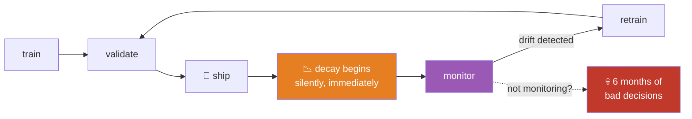
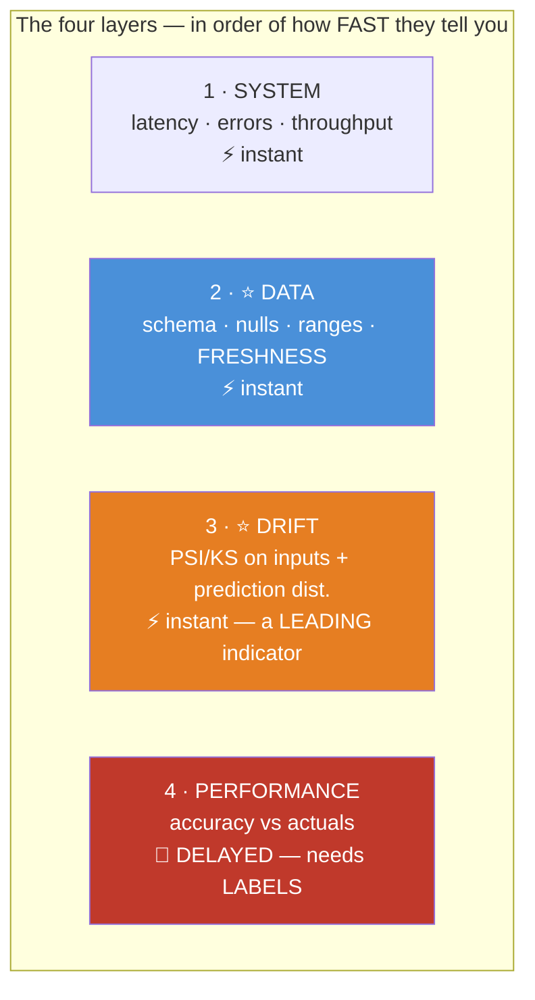
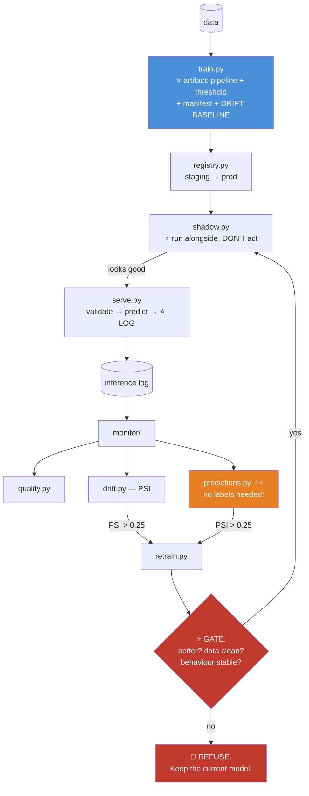

# 08.17 · Production ML

[⬅ 08.16 Interpretability](08.16-interpretability.md) · [🏠 Module 08](../README.md) · [➡ 08.18 Projects & Summary](08.18-projects-summary.md)

> **The lesson in one line:** Shipping the model is the beginning, not the end — because the world keeps changing, your model doesn't, and nothing will tell you when it stops working.

---

## 🎯 Learning objectives

By the end of this lesson you can:

1. Build a **training pipeline** that produces a reproducible, versioned model artifact.
2. **Serialize and load** models safely — and know why `pickle` is dangerous.
3. **Version** models, data, and code together — and know why all three are required.
4. Choose between **batch and real-time** serving.
5. **Monitor** for drift and decay — and know why performance monitoring arrives too late.
6. Design a **retraining strategy** that doesn't make things worse.

---

## 🧠 Mental model

> **A deployed model is a decaying asset. From the moment it ships, it starts getting worse — and no error message will tell you.**



> [!IMPORTANT]
> **The world changes. Your model doesn't.** A new marketing campaign changes your traffic mix. A competitor launches. A pandemic makes "travel spending" mean something different. **No code broke. No test failed. The model just quietly got worse.**
>
> **This is the loop from [07.1](../../07-Data-Analysis/weeks/07.1-data-lifecycle.md), and it never closes.** Deployment is the beginning of the model's life, not the end of yours.

---

## 1 · The Training Pipeline

**Everything from [07.11](../../07-Data-Analysis/weeks/07.11-pipelines.md), with a model on the end.**

```python
import joblib, json, hashlib, subprocess
from datetime import datetime, timezone

def train(config: dict, seed: int = 42):
    rng = np.random.default_rng(seed)

    X, y = load_data(config['data_path'])
    X_dev, X_test, y_dev, y_test = train_test_split(
        X, y, test_size=0.2, stratify=y, random_state=seed)      # 🔒 lock test away

    pipe = build_pipeline(config)                                # ⭐ ONE object (07.11)
    cv = cross_val_score(pipe, X_dev, y_dev, cv=5, scoring='average_precision')
    pipe.fit(X_dev, y_dev)

    threshold = tune_threshold(y_val, pipe.predict_proba(X_val)[:, 1],
                               config['cost_fp'], config['cost_fn'])   # ⭐ 08.12

    artifact = {
        'pipeline':  pipe,                    # ⭐ preprocessing + model, together
        'threshold': threshold,               # ⭐ a MODEL ARTIFACT, not a magic 0.5
        'features':  list(X.columns),         # ⭐ column order matters at inference
        'manifest': {
            'trained_at':   datetime.now(timezone.utc).isoformat(),
            'git_sha':      subprocess.check_output(['git','rev-parse','HEAD']).decode().strip(),
            'git_dirty':    bool(subprocess.check_output(['git','status','--porcelain'])),
            'data_hash':    hashlib.sha256(open(config['data_path'],'rb').read()).hexdigest()[:16],
            'config':       config,
            'seed':         seed,
            'cv_score':     f"{cv.mean():.4f} ± {cv.std():.4f}",
            'test_score':   float(average_precision_score(y_test, pipe.predict_proba(X_test)[:,1])),
            'n_train':      len(X_dev),
            'sklearn':      sklearn.__version__,
            # ⭐ THE BASELINE for drift detection:
            'train_feature_stats': X_dev.describe().to_dict(),
            'train_pred_dist':     np.histogram(pipe.predict_proba(X_dev)[:,1], bins=20)[0].tolist(),
        },
    }
    joblib.dump(artifact, f"models/model_{version}.joblib")
    return artifact
```

> [!IMPORTANT]
> **⭐ The artifact contains FIVE things, and people ship only one of them:**
> 1. **The pipeline** — preprocessing **and** model. *(Ship them separately and you get training/serving skew.)*
> 2. **The threshold** — a **tuned model artifact**, not a hardcoded 0.5 ([08.12](08.12-evaluation.md)).
> 3. **The feature list and order** — so serving can validate its input.
> 4. **The manifest** — git SHA (+ **dirty flag**), data hash, config, seed, scores ([07.11](../../07-Data-Analysis/weeks/07.11-pipelines.md)).
> 5. **⭐ The training feature distributions** — **this is your drift baseline.** Without it, you cannot detect drift later, and **you cannot go back and get it.**
>
> **Most teams ship #1 and wonder why nothing else works.**

---

## 2 · Serialization — and why pickle is dangerous

| Format | Safe? | Portable? | Note |
|---|---|---|---|
| **`joblib`** | ⚠️ **No** (it's pickle) | ❌ Python + version-locked | ✅ The sklearn default |
| **`pickle`** | ❌ **NO — RCE** | ❌ | ⚠️ Never load untrusted |
| **ONNX** | ✅ **Yes** | ⭐ **Cross-language** | ✅ Production standard |
| **Native (`booster.save_model`)** | ✅ Yes | ✅ | ⭐ For XGB/LGBM |
| **PMML** | ✅ Yes | ✅ | Enterprise, verbose |

> [!CAUTION]
> **⭐ `pickle`/`joblib` deserialization is arbitrary code execution.** A malicious `.joblib` file **runs whatever it wants** the moment you load it.
>
> **Rules:** **only load artifacts you produced, from storage you control.** Never accept a model file from a user, a partner, or the internet. **Sign your artifacts** (hash + verify) if they cross a trust boundary.
>
> **And pickle is version-fragile:** a model pickled with sklearn 1.3 may **fail to load — or worse, load *incorrectly*** — under sklearn 1.5. **Pin your versions in the artifact and validate them on load.**

```python
def load_model(path):
    art = joblib.load(path)
    # ⭐ Fail loudly on a version mismatch — don't silently mispredict
    if art['manifest']['sklearn'] != sklearn.__version__:
        raise RuntimeError(
            f"sklearn mismatch: model was trained with {art['manifest']['sklearn']}, "
            f"runtime has {sklearn.__version__}")
    return art

# ⭐ ONNX: safe, fast, and language-portable
from skl2onnx import to_onnx
onx = to_onnx(pipe, X_train[:1].astype(np.float32))
open("model.onnx", "wb").write(onx.SerializeToString())
```

---

## 3 · Versioning — all three, or nothing

> [!IMPORTANT]
> **⭐ You must version CODE, DATA, and MODEL — together.**
>
> **Why?** Because when performance drops, there is exactly one question: **"did the code change, or did the data change?"** **Without all three versioned, that question is unanswerable**, and you will spend a week finding out what a diff could have told you in ten seconds ([07.11](../../07-Data-Analysis/weeks/07.11-pipelines.md)).

| Layer | Tool |
|---|---|
| **Code** | Git SHA (**+ the dirty flag**) |
| **Data** | ⭐ **Content hash** or DVC/Delta. **Never overwrite** |
| **Model** | Semantic version + the manifest linking to the other two |
| **Registry** | MLflow / W&B / SageMaker — staging → production → archived |

```python
import mlflow

with mlflow.start_run():
    mlflow.log_params(config)
    mlflow.log_metric('cv_pr_auc',  cv.mean())
    mlflow.log_metric('test_pr_auc', test_score)
    mlflow.log_metric('threshold',   threshold)
    mlflow.sklearn.log_model(pipe, 'model')
    mlflow.set_tag('git_sha',   git_sha)
    mlflow.set_tag('data_hash', data_hash)
```

---

## 4 · Serving

| Pattern | Latency | Use |
|---|---|---|
| **⭐ Batch** | Hours | ✅ **Start here.** Score everyone nightly, write to a table |
| **Real-time (REST)** | ms | User-facing decisions (fraud, ranking) |
| **Streaming** | ms | Kafka-driven events |
| **Edge** | µs | On-device |

> [!TIP]
> **⭐ Start with batch. It's a nightly job that writes predictions to a database table, and the application just reads them.**
>
> **No latency SLA, no serving infrastructure, no scaling problem, trivial to debug, trivial to roll back.** For churn, lead scoring, recommendations, and forecasting, **batch is not a compromise — it's correct.**
>
> **Go real-time only when the prediction genuinely depends on data that arrives at request time** (fraud on this transaction, ranking for this query). **A very large fraction of real-time ML services should have been a nightly batch job.**

```python
from fastapi import FastAPI, HTTPException
import pandas as pd, numpy as np

app = FastAPI()
ART = load_model("models/model_v3.joblib")          # ⭐ load ONCE, at startup

@app.post("/predict")
def predict(payload: dict):
    df = pd.DataFrame([payload])

    # ⭐ 1 · VALIDATE THE SCHEMA — fail loudly, never silently mispredict (07.9)
    missing = set(ART['features']) - set(df.columns)
    if missing:
        raise HTTPException(400, f"missing features: {sorted(missing)}")
    df = df[ART['features']]                        # ⭐ enforce the column ORDER

    # ⭐ 2 · The SAME pipeline object as training → skew is IMPOSSIBLE (07.11)
    proba = float(ART['pipeline'].predict_proba(df)[0, 1])
    pred  = int(proba >= ART['threshold'])          # ⭐ the TUNED threshold

    # ⭐ 3 · LOG THE INPUTS — you cannot detect drift on data you didn't keep
    log_prediction(payload, proba, pred, ART['manifest']['git_sha'])

    return {"probability": proba, "prediction": pred,
            "model_version": ART['manifest']['git_sha'][:7]}
```

> [!CAUTION]
> **⭐ LOG YOUR INPUTS. All of them.**
>
> **You cannot detect drift on data you didn't keep**, and you cannot debug a bad prediction you can't reproduce. **The #1 regret of every ML team is not logging inference inputs from day one** — because by the time you realize you need them, the six months you'd most want to examine are gone forever.
>
> **Log: the features, the prediction, the model version, the timestamp.** And **later, when it arrives, the actual outcome** — that's how you compute production performance at all.

---

## 5 · ⭐ Monitoring — the four layers



| Layer | Detects | Lag |
|---|---|---|
| **System** | The service is down | Instant |
| **⭐ Data quality** | Schema change, nulls spike, **stale features** | Instant ([07.9](../../07-Data-Analysis/weeks/07.9-data-quality.md)) |
| **⭐⭐ Drift** | The world changed | ⭐ **Instant — a LEADING indicator** |
| **Performance** | The model is actually wrong | 🐌 **Weeks to months** — needs labels |

> [!IMPORTANT]
> **⭐⭐ Monitor the INPUTS, not just the performance — and this is the single most important operational lesson in the module.**
>
> **Performance monitoring requires LABELS, and labels arrive late.** Churn: **90 days.** Loan default: **2 years.** Fraud chargeback: **60 days.**
>
> **By the time your accuracy metric drops, you have been making bad decisions for a quarter.**
>
> **Input drift is observable IMMEDIATELY.** It is a **leading** indicator; performance decay is a **lagging** one. **Alert on the leading indicator.**

```python
# ⭐ PSI — the industry standard for tabular drift (07.9)
#    (It's a symmetrized KL divergence — 06.8)
def psi(expected, actual, bins=10):
    cuts = np.percentile(expected, np.linspace(0, 100, bins + 1))
    cuts[0], cuts[-1] = -np.inf, np.inf
    e = np.clip(np.histogram(expected, cuts)[0] / len(expected), 1e-6, None)
    a = np.clip(np.histogram(actual,   cuts)[0] / len(actual),   1e-6, None)
    return np.sum((a - e) * np.log(a / e))

for feat in FEATURES:
    score = psi(train_stats[feat], production_last_7d[feat])
    flag  = "🚨 RETRAIN" if score > 0.25 else ("⚠️" if score > 0.10 else "✅")
    print(f"{flag} {feat:25} PSI={score:.3f}")

# ⭐ ALSO monitor the PREDICTION distribution — the cheapest, best canary
psi_pred = psi(train_pred_dist, production_pred_dist)
if psi_pred > 0.25:
    alert("🚨 prediction distribution shifted — the model is seeing a different world")
```

> [!TIP]
> **⭐ The prediction distribution is the single cheapest and most effective drift signal you can monitor.**
>
> **It requires NO labels, NO feature engineering, and NO ground truth** — just the model's own outputs. **If your fraud model's average predicted probability jumps from 0.02 to 0.11 overnight, something is very wrong**, and you know it *today* rather than in 60 days.
>
> **If you monitor exactly one thing, monitor this.** It takes an afternoon.

| PSI | Action |
|---|---|
| < 0.10 | ✅ Stable |
| 0.10–0.25 | ⚠️ Investigate |
| **> 0.25** | 🚨 **Retrain** |

---

## 6 · Retraining

| Strategy | When |
|---|---|
| **Scheduled** (weekly/monthly) | ✅ Simple, predictable. **The right default** |
| **⭐ Triggered by drift** | PSI > 0.25 or a performance drop |
| **Continuous / online** | High-velocity data (ads, recommendations) |
| **Never** | ⚠️ Only if the world genuinely doesn't change (it does) |

> [!CAUTION]
> **⭐⭐ Automated retraining can make things WORSE — and this is the trap that catches sophisticated teams.**
>
> **Feedback loops:** your model recommends items → users click those items → you train on that click data → **the model recommends them even harder.** **You have built a system that confirms its own beliefs**, and the diversity of your catalogue collapses.
>
> **Bad data in:** if an upstream pipeline breaks and you retrain automatically, **you have just deployed a model trained on corrupted data — automatically.** ([07.9](../../07-Data-Analysis/weeks/07.9-data-quality.md))
>
> **⭐ Every automated retrain MUST pass a gate:**
> ```python
> if new_model.cv_score < current_model.cv_score - TOLERANCE:
>     reject("new model is worse — keeping the current one")
> if data_quality_checks_failed():
>     reject("training data failed validation — NOT retraining")
> if prediction_distribution_shift(new_model, current_model) > THRESHOLD:
>     require_human_approval()          # ⭐ a big behavioural change needs a human
> ```
> **Automated retraining without a gate is automated self-destruction.**

### Deployment safety

| Pattern | How |
|---|---|
| **⭐ Shadow mode** | ⭐⭐ **Run the new model alongside the old; log its predictions but DON'T act on them.** Compare. **The safest thing you can do, and it's nearly free** |
| **Canary** | 5% of traffic → monitor → ramp up |
| **A/B test** | Split traffic; measure the **business metric**, not the AUC |
| **Blue-green** | Instant switch, instant rollback |
| **⭐ Rollback plan** | ⭐ **Know how, before you need to. Practise it.** |

> [!TIP]
> **⭐ Shadow mode is the most underused deployment practice in ML.** Run the new model on real production traffic, log what it *would* have done, and **compare it to the current model — with zero risk.** You get real-world evidence before anything is at stake.
>
> **Run every new model in shadow for a week.** It costs almost nothing and it catches the training/serving skew, the schema mismatch, and the "it's 10× slower than we thought" problem — **before a customer is affected.**

---

## 🐛 Common mistakes

| Mistake | Consequence |
|---|---|
| **⭐ Not logging inference inputs** | **You cannot detect drift or debug anything.** The #1 regret |
| **Not saving the training feature distributions** | **No drift baseline. And you can't go back and get it** |
| **Shipping the model without the preprocessing** | ⭐ **Training/serving skew** |
| **Hardcoding threshold = 0.5** | It's a **tuned artifact.** Ship it |
| **Only monitoring performance** | **Labels arrive months late.** Monitor **inputs** |
| **Automated retraining with no gate** | **You deploy a model trained on corrupted data — automatically** |
| **Ignoring feedback loops** | The model confirms its own beliefs; diversity collapses |
| **No rollback plan** | You find out you need one at 3 a.m. |
| **Loading an untrusted pickle** | 💀 **RCE** |
| **No version pinning** | sklearn 1.5 silently mis-loads a 1.3 model |
| **Real-time when batch would do** | You built a serving stack for a nightly job |

---

## 📝 Exercises

**Conceptual**
1. ⭐ **Why must you monitor inputs rather than just performance?** Give the label-delay argument with real numbers.
2. Why version **code, data, AND model**? What question becomes unanswerable without all three?
3. ⭐ **Why can automated retraining make things worse?** Name two mechanisms.
4. Why is `joblib.load` a security risk?
5. When is **batch** serving the right answer? *(And why is it more often than people think?)*

**Implementation**
6. Build a training pipeline that emits a **full artifact** (pipeline + threshold + features + manifest + **drift baseline**).
7. Write a serving endpoint that **validates the schema**, uses the **tuned threshold**, and **logs the inputs.**
8. ⭐ Implement **PSI**. Simulate drift (shift a feature's mean by 1σ). **Verify PSI crosses 0.25.**
9. ⭐ **Monitor the prediction distribution.** Simulate an upstream bug (a feature becomes all-null) and **show that the prediction distribution shifts** — without any labels.
10. Implement a **retraining gate**: reject a new model if it's worse, or if the data failed validation. **Test that it rejects.**
11. Convert a sklearn pipeline to **ONNX**. Verify identical predictions. **Compare inference latency.**

**Design**
12. ⭐ Design the full production system for a churn model: training, serving, monitoring, retraining. **Draw it.** Mark where each guard lives.
13. ⭐ **Your model's accuracy dropped 15% and no code changed.** List five hypotheses, ranked by likelihood, and say **how you'd distinguish them.** *(This is the module's recurring exam question.)*

---

## 🛠️ Mini project — *The Model Serving Stack*

Build `code/08-machine-learning/serving/` — take any model from this module to production, properly.

**Requirements**
- Training pipeline → **versioned artifact** with a manifest and a **drift baseline**.
- **FastAPI** serving with schema validation, the tuned threshold, and **input logging**.
- **Monitoring**: data quality, **drift (PSI)**, and the **prediction distribution**.
- **Retraining with a gate** — it must be able to **refuse**.
- **Shadow mode** for safe deployment.

```
serving/
├── README.md
├── src/
│   ├── train.py          # ⭐ → artifact (pipeline + threshold + manifest + baseline)
│   ├── registry.py       # version, promote, rollback
│   ├── serve.py          # ⭐ FastAPI: validate → predict → LOG
│   ├── monitor/
│   │   ├── quality.py    # schema · nulls · FRESHNESS (07.9)
│   │   ├── drift.py      # ⭐ PSI on inputs
│   │   └── predictions.py# ⭐⭐ the prediction-distribution canary
│   ├── retrain.py        # ⭐ with a GATE that can REFUSE
│   └── shadow.py         # ⭐ new model alongside old, no risk
├── tests/
│   ├── test_skew.py          # ⭐ batch == single-row (07.11)
│   ├── test_gate_refuses.py  # ⭐ a worse model is REJECTED
│   └── test_schema.py        # ⭐ a missing feature → 400, not a bad prediction
└── docker-compose.yml
```

**Architecture**



**Implementation guidance**
1. **⭐⭐ `predictions.py` is the highest-value monitor in the whole project.** It watches the **distribution of the model's own outputs** — **no labels, no ground truth, no feature engineering.** If the mean predicted probability jumps overnight, **you know today, not in 60 days.** **Build this first. It's an afternoon and it's the canary that will actually save you.**
2. **⭐ `retrain.py` MUST be able to refuse**, and `test_gate_refuses.py` must prove it. Train a deliberately worse model and **assert the gate rejects it.** **Automated retraining without a gate is automated self-destruction** — and this test is what stands between you and that.
3. **⭐ `serve.py` must LOG THE INPUTS.** Everything. **You cannot detect drift on data you didn't keep, and you cannot go back and get it.** This is the #1 regret of every ML team, and it costs you nothing to avoid on day one.
4. **`test_skew.py`** — batch-transform must equal single-row transform ([07.11](../../07-Data-Analysis/weeks/07.11-pipelines.md)). **This catches the scaler-refit disaster** where a single-row prediction silently receives all-zeros.
5. **`shadow.py`** — run the candidate on real traffic, log what it *would* have done, compare. **Zero risk, real evidence.** Nearly free, and almost nobody does it.

**Evaluation strategy:** simulate three incidents — **(a)** an upstream feature becomes all-null, **(b)** a feature's distribution shifts 2σ, **(c)** the data goes stale by 3 days. **Assert each is detected, and measure how quickly.** *(A monitoring system that catches nothing is worse than none, because it creates false confidence.)*

**Testing plan:** as above, plus `test_version_mismatch` (assert loading a model trained under a different sklearn version **raises** rather than silently mispredicting).

**Future improvements:** add **A/B testing infrastructure** measuring the **business** metric, not the AUC; add **automatic rollback** on a monitoring alert; add **feedback-loop detection** (is the model's own output changing the data it later trains on?).

---

## 📄 Cheat sheet

| The artifact contains **5 things** | |
|---|---|
| 1 | The **pipeline** (preprocessing + model, **together**) |
| 2 | ⭐ The **tuned threshold** (not 0.5) |
| 3 | The **feature list and order** |
| 4 | The **manifest** (git SHA + **dirty flag**, data hash, config, seed, scores, versions) |
| 5 | ⭐⭐ The **training feature distributions** — **your drift baseline. You can't get it later** |

| Monitor — 4 layers | Lag |
|---|---|
| System (latency, errors) | Instant |
| ⭐ Data quality (schema, nulls, **freshness**) | Instant |
| ⭐⭐ **Drift** (PSI on inputs + **the prediction distribution**) | ⭐ **Instant — LEADING** |
| Performance (needs **labels**) | 🐌 **Weeks–months — LAGGING** |

**⭐⭐ MONITOR THE INPUTS. Labels arrive months late.**
**⭐ The prediction distribution is the cheapest, best canary — no labels required.**

| | |
|---|---|
| **PSI** | <0.1 ✅ · 0.1–0.25 ⚠️ · **>0.25 🚨 retrain** |
| **⭐ Retraining** | **MUST have a gate.** Worse model? Bad data? → **REFUSE** |
| **⭐ Deploy** | **Shadow → canary → ramp.** Have a rollback plan and **practise it** |
| **Serialize** | `joblib` (⚠️ **RCE**, version-fragile) · **ONNX** (safe, portable) |
| **Version** | ⭐ **code + data + model.** *"Did the code change or the data change?"* |
| **⭐ Serving** | **Start with BATCH.** Real-time only if the prediction truly needs request-time data |
| **⭐ LOG THE INPUTS** | **The #1 regret. You cannot get them retroactively** |

---

## 🎴 Flashcards

- **Q:** ⭐⭐ Why monitor inputs rather than performance? → **A:** **Performance needs LABELS, and labels arrive late** — churn 90 days, loan default 2 years, chargebacks 60 days. **By the time accuracy drops, you've made bad decisions for a quarter.** **Input drift is observable immediately — a LEADING indicator.**
- **Q:** ⭐ What's the cheapest, most effective drift signal? → **A:** **The prediction distribution.** No labels, no ground truth, no feature engineering — just the model's own outputs. **If the mean predicted probability jumps overnight, you know today.** If you monitor one thing, monitor this.
- **Q:** ⭐ What five things go in the model artifact? → **A:** **(1)** The pipeline (preprocessing **+** model). **(2)** The **tuned threshold**. **(3)** The feature list and order. **(4)** The manifest (git SHA + **dirty flag**, data hash, seed, versions). **(5)** ⭐ **The training feature distributions — your drift baseline, which you cannot obtain retroactively.**
- **Q:** ⭐ Why version code, data, AND model? → **A:** Because when performance drops, the only question is **"did the code change or the data change?"** — and **without all three, it's unanswerable.**
- **Q:** ⭐⭐ Why can automated retraining make things worse? → **A:** **(1) Feedback loops** — the model recommends items, users click them, you train on that, it recommends them harder. **It confirms its own beliefs.** **(2) Bad data** — an upstream break means you **automatically deploy a model trained on corruption.** **Every retrain needs a GATE that can refuse.**
- **Q:** What is shadow mode, and why is it underused? → **A:** ⭐ **Run the new model on real traffic, log what it WOULD have done, but don't act on it.** **Real-world evidence at zero risk.** It catches skew, schema mismatches, and latency surprises **before a customer is affected** — and it's nearly free.
- **Q:** Why is `joblib.load` dangerous? → **A:** **It's pickle — arbitrary code execution.** Only load artifacts **you** produced from storage **you** control. **It's also version-fragile** — a 1.3 model may silently mis-load under 1.5.
- **Q:** ⭐ When should you use batch serving? → **A:** **Whenever the prediction doesn't depend on data arriving at request time** — churn, lead scoring, recommendations, forecasting. **No SLA, no serving stack, trivial rollback.** **A very large fraction of real-time ML services should have been a nightly batch job.**
- **Q:** ⭐ What's the #1 regret of ML teams? → **A:** **Not logging inference inputs from day one.** You cannot detect drift on data you didn't keep, and by the time you realize you need it, **the months you'd most want to examine are gone forever.**
- **Q:** PSI thresholds? → **A:** **< 0.1** stable · **0.1–0.25** investigate · **> 0.25 retrain.**

---

## 💼 Interview questions

1. **⭐ "How would you monitor a model in production?"** — **Four layers**: system, data quality, **drift**, performance. **Emphasize that performance is a LAGGING indicator** (labels arrive months late) and that **input drift + the prediction distribution are LEADING indicators.** Most candidates only mention accuracy.
2. **⭐ "Your model's accuracy dropped 15% and no code changed. Debug it."** — Check **freshness and volume first** (cheapest, and a common answer). Then **PSI per feature** (data drift). Then **concept drift** (the relationship changed). Then upstream schema changes. **Say how you'd distinguish them.**
3. **⭐ "Would you retrain automatically?"** — **Yes, with a gate.** Reject if the new model is worse, if the training data failed validation, or if the prediction distribution shifts dramatically (**require human approval**). **Automated retraining without a gate is automated self-destruction.** Then mention feedback loops.
4. **"How do you prevent training/serving skew?"** — **One pipeline object**, serialized with the model, **imported** by serving — not reimplemented. **And write the skew test** (batch == single-row).
5. **"Batch or real-time?"** — **"What's the decision, and does it need data that only exists at request time?"** If not, **batch** — no SLA, no serving stack, trivially debuggable. **Most real-time ML should have been batch.**
6. **⭐ "What would you set up on day one of a new ML project?"** — **Log the inference inputs.** Everything else can be added later; **that one cannot be obtained retroactively.**

---

## 📚 Summary

- **A deployed model is a decaying asset.** The world changes, the model doesn't, and **no error message will tell you.**
- **⭐ The artifact contains five things**, and most teams ship one: the **pipeline** (preprocessing *and* model, or you get skew), the **tuned threshold**, the **feature list and order**, the **manifest** (git SHA + dirty flag, data hash, seed, versions), and — critically — **the training feature distributions, which are your drift baseline and cannot be obtained retroactively.**
- **`joblib`/`pickle` deserialization is arbitrary code execution** and version-fragile. **Only load artifacts you produced.** Use **ONNX** when it crosses a boundary.
- **⭐ Version code, data, and model together**, or *"did the code change or the data change?"* is unanswerable.
- **⭐ Start with batch serving.** A nightly job writing to a table has no SLA, no serving stack, and trivial rollback. **Go real-time only when the prediction genuinely needs request-time data** — which is far less often than people assume.
- **⭐⭐ Monitor the INPUTS, not just performance.** Performance needs **labels**, which arrive **months** late — by then you've been making bad decisions for a quarter. **Input drift and the prediction distribution are LEADING indicators**, and **the prediction distribution is the cheapest, best canary you can build** (no labels required).
- **⭐⭐ Automated retraining needs a GATE that can refuse** — otherwise a broken upstream pipeline means you **automatically deploy a model trained on corruption**, and **feedback loops** mean the model confirms its own beliefs.
- **⭐ Deploy in shadow mode first** — real traffic, real evidence, zero risk. It's nearly free and almost nobody does it.
- **⭐ LOG YOUR INFERENCE INPUTS FROM DAY ONE.** It's the #1 regret, and it is the one thing you cannot get retroactively.

**Next:** [08.18 Projects & Summary](08.18-projects-summary.md) — seven projects and the consolidation of everything you've built.

---

## 🔗 References

- **Sculley et al. (2015)** — *Hidden Technical Debt in Machine Learning Systems*. ⭐ Still the most important ML engineering paper. **Feedback loops, entanglement, and the "ML code is a tiny box" figure.**
- **Huyen — *Designing Machine Learning Systems*** (O'Reilly). ⭐ The best book on everything in this lesson.
- Breck et al. (2017) — *The ML Test Score: A Rubric for ML Production Readiness* (Google). **Score your own system against it — it's humbling.**
- Paleyes et al. (2022) — *Challenges in Deploying Machine Learning: a Survey of Case Studies*.
- ONNX — [onnx.ai](https://onnx.ai/) — safe, portable serialization.
- Google — *MLOps: Continuous delivery and automation pipelines in machine learning*.
- [07.9 Data Quality](../../07-Data-Analysis/weeks/07.9-data-quality.md) and [07.11 Pipelines](../../07-Data-Analysis/weeks/07.11-pipelines.md) — the foundations this lesson stands on.

---

## 🧭 Navigation

| Direction | Link |
|---|---|
| ⬅ Previous | [08.16 Model Interpretability](08.16-interpretability.md) |
| ➡ Next | [08.18 Projects & Summary](08.18-projects-summary.md) |
| 🏠 Module | [Module 08](../README.md) |
| 🗺 Roadmap | [ROADMAP.md](../../../ROADMAP.md) |
