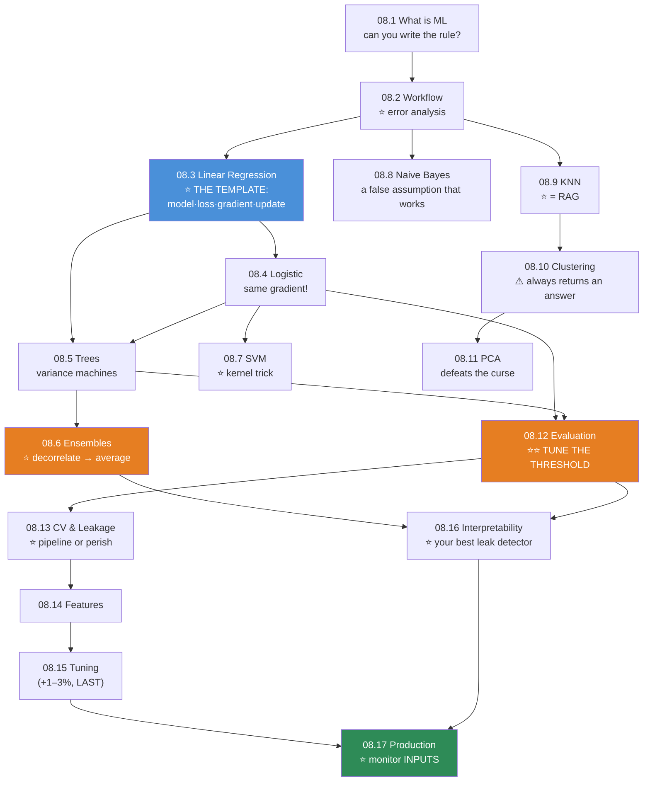

# 08.18 · Projects & Module Summary

[⬅ 08.17 Production ML](08.17-production-ml.md) · [🏠 Module 08](../README.md) · [➡ Module 09 · Deep Learning](../../09-Deep-Learning/README.md)

> **The lesson in one line:** Seven projects that take you from `y = wx + b` written by hand to a monitored production system — and the consolidation of everything the module taught.

---

## The seven projects

| # | Project | Proves you can | Lessons |
|---|---|---|---|
| 1 | **Iris Classifier from Scratch** | Implement an algorithm and *verify* it | [08.5](08.5-decision-trees.md) |
| 2 | **House Price Prediction** | Regression, regularization, residual diagnostics | [08.3](08.3-linear-regression.md) |
| 3 | **Titanic Survival** | Trees, pruning, interpretability | [08.5](08.5-decision-trees.md), [08.16](08.16-interpretability.md) |
| 4 | **Spam Detection** | Text, threshold tuning, cost asymmetry | [08.4](08.4-logistic-regression.md), [08.8](08.8-naive-bayes.md) |
| 5 | **Customer Churn** | Leakage-safe features, GBMs, business cost | [08.6](08.6-ensembles.md), [08.12](08.12-evaluation.md) |
| 6 | **Credit Risk** | Imbalance, fairness, legal explainability | [08.7](08.7-svm.md), [08.16](08.16-interpretability.md) |
| 7 | **Movie Recommendation** | Similarity, cold-start, honest evaluation | [08.9](08.9-knn.md) |

```
code/08-machine-learning/
├── README.md
├── requirements.txt      # numpy, pandas, scikit-learn, lightgbm, shap, optuna, pytest
├── iris-scratch/         # 1
├── house-prices/         # 2  (08.3)
├── titanic-tree/         # 3  (08.5)
├── spam-detector/        # 4  (08.4)
├── churn/                # 5  (08.6)
├── credit-risk/          # 6  (08.7)
├── recommender/          # 7  (08.9)
└── shared/               # ⭐ the reusable library you build along the way
    ├── scratch/          # every algorithm, from scratch
    ├── evaluation/       # (08.12)
    ├── leakage/          # (08.13)
    └── explainer/        # (08.16)
```

> [!IMPORTANT]
> **⭐ Every project must contain `test_vs_sklearn.py`.** That single assertion — `np.allclose(mine, sklearn)` — is the moment the library stops being magic. **It's the discipline of this entire module.**

---

## Project 1 — Iris Classifier from Scratch ⭐

**The smallest project, and the one that establishes the method.**

**Requirements**
- Implement **three algorithms from scratch** on Iris: logistic regression, decision tree, KNN.
- **Verify all three against sklearn** with `np.allclose` / `np.array_equal`.
- **Gradient-check** the logistic regression.
- Plot all three **decision boundaries** on the same 2-feature projection.

```
iris-scratch/
├── src/
│   ├── logistic.py       # 08.4 — stable sigmoid!
│   ├── tree.py           # 08.5 — recursive CART
│   ├── knn.py            # 08.9 — vectorized distances
│   └── boundaries.py     # ⭐ plot all three
├── tests/
│   ├── test_gradient.py      # ⭐ central differences
│   └── test_vs_sklearn.py    # ⭐ all three match
```

**Why start here:** Iris is small enough that you can debug by *printing*, and three algorithms on one dataset makes the **differences in their decision boundaries** — a line, a staircase, a jagged voting region — **visible in one figure.** That figure is the best summary of "every algorithm is a bet about the shape of your data" you will ever make.

---

## Project 2 — House Price Prediction

Full spec in [08.3](08.3-linear-regression.md#️-mini-project--house-price-prediction-from-scratch).

**The two lessons:** **`log1p(price)`** is mandatory (skew ≈ 4), and **read the data dictionary** — `pool_qc = NaN` means *"there is no pool"*, not *"unknown"* ([07.12](../../07-Data-Analysis/weeks/07.12-case-studies.md)). Getting that one distinction right is worth more than any model choice on this dataset.

**And plot the residuals.** The curve you'll see tells you to add polynomial features or switch to a tree — **the diagnostic tells you what to do next.**

---

## Project 3 — Titanic Survival

Full spec in [08.5](08.5-decision-trees.md#️-mini-project--titanic-survival-from-scratch).

**The money plot:** sweep `max_depth` 1→20 and plot train and validation accuracy. **Train climbs to 100%; validation peaks at depth 3–5 and falls.** That single figure is the clearest illustration of overfitting in this entire module.

**The lesson that transfers:** add a random ID column and watch **MDI rank it in the top 5** while permutation importance correctly ranks it at zero ([08.16](08.16-interpretability.md)).

---

## Project 4 — Spam Detection

Full spec in [08.4](08.4-logistic-regression.md#️-mini-project--spam-detection).

**Three things make it real:** **deduplicate before splitting** (5–15% duplicates is normal, and they'd straddle the split), **push the threshold HIGH** (a false positive is a deleted job offer; a false negative is mild annoyance), and **interpret the coefficients** — *"the word 'free' multiplies the odds of spam by 12×"* is exactly what a black box cannot give you.

---

## Project 5 — Customer Churn ⭐

Full spec in [08.6](08.6-ensembles.md#️-mini-project--customer-churn-prediction).

**The commercially important project.** As-of-date features, a **time-based split**, escalating models (LR → tree → RF → LightGBM), and — the part that matters — **the threshold tuned on business cost.**

> [!IMPORTANT]
> **You will likely find that logistic regression gets within 2–3 points of LightGBM.** **Write that down.** The linear model is interpretable, trains in milliseconds, and is trivially deployable. **The GBM has to earn its complexity** ([08.3](08.3-linear-regression.md)) — and often it doesn't.

---

## Project 6 — Credit Risk

Full spec in [08.7](08.7-svm.md#️-mini-project--credit-risk-classification).

**The high-stakes project.** Heavy imbalance, **FN costs 100× FP**, and **explainability is a legal requirement** (adverse action notices).

**The fairness audit must be able to fail the build.** Slice recall by protected group *and by proxies* — **removing the `race` column does not remove race** ([08.16](08.16-interpretability.md)). And note the constraint that decides the model: **an RBF SVM that scores 1% higher may be legally unusable**, because it cannot produce a reason code. **That's a framing-time discovery** ([08.1](08.1-what-is-ml.md)), not a post-mortem one.

---

## Project 7 — Movie Recommendation

Full spec in [08.9](08.9-knn.md#️-mini-project--movie-recommendation-introductory).

**Item-based collaborative filtering = cosine-KNN.** The sparse matrix, the **cold-start problem** (a new user has no neighbors — KNN *structurally* cannot help), and **precision@k, not RMSE** (nobody cares about 4.2 vs 4.5 stars; they care whether the top-5 list is good).

**The baseline to beat: "recommend the most popular items."** It is astonishingly hard, and **if your KNN doesn't beat it, that's the finding.**

---

## 📊 Module Summary — everything, connected



### ⭐ The algorithm cheat table

| Algorithm | Bet about your data | Scale? | Interpretable? | Ship it? |
|---|---|---|---|---|
| **Linear regression** | Straight-line relationship | ✅ | ⭐⭐ **Yes** (coefficients) | ✅ **Always the baseline** |
| **Logistic regression** | **Log-odds are linear** | ✅ | ⭐⭐ **Yes** (odds ratios) | ✅ **Regulated domains** |
| **Decision tree** | Axis-aligned rectangles | ❌ | ⭐⭐ **Yes** (the rules) | ⚠️ Too unstable alone |
| **⭐ Random Forest** | Many decorrelated trees | ❌ | 🟡 | ✅ Robust, easy |
| **⭐⭐ Gradient boosting** | Sequential error-fixing | ❌ | 🟡 (+SHAP) | ⭐⭐ **The tabular default** |
| **SVM** | A max-margin hyperplane (± kernel) | ⭐⭐ **MANDATORY** | ❌ | 🟡 Text; small n |
| **Naive Bayes** | Features are independent (**false!**) | ❌ | ✅ | ✅ **Fast baseline; small data** |
| **KNN** | Near things are alike | ⭐⭐ **MANDATORY** | 🟡 | ⚠️ **O(n) queries** → but **= RAG** |
| **K-Means** | Spherical clusters | ⭐⭐ **MANDATORY** | 🟡 | ⚠️ **Validate externally!** |
| **PCA** | Low intrinsic dimensionality | ⭐⭐ **MANDATORY** | ❌ | ✅ As a preprocessing step |

> [!IMPORTANT]
> **⭐ The single most useful sentence in this module: every algorithm is a bet about the shape of your data.** Linear regression bets on a straight line. KNN bets that near things are alike. Naive Bayes bets features are independent. **The algorithm that wins is the one whose bet matches reality — and that is the entirety of model selection.**

### The ideas that did the most work

| Idea | Where it reappeared |
|---|---|
| **⭐ The four boxes** (model·loss·gradient·update) | 08.3 → **every algorithm after** |
| **⭐ `predicted − actual`** | The gradient of linear reg (08.3), logistic reg (08.4), **and softmax+CE** ([06.8](../../06-Mathematics/weeks/06.8-information-theory.md)) — **the same equation, three times** |
| **⭐⭐ Leakage** | 08.2, 08.7, 08.13, 08.14, 08.16 — **and CV cannot catch the worst kind** |
| **⭐⭐ The threshold** | 08.4, 08.12, 08.17 — **free, and worth more than everything else** |
| **⭐ Scaling: distance-based YES, trees NO** | 08.3, 08.7, 08.9, 08.10, 08.11, 08.14 |
| **⭐ Bias–variance** | 08.2, 08.5 (trees), 08.6 (ensembles), 08.9 (k), 08.15 |
| **Regularization = loss + λ·complexity** | Ridge (08.3), pruning (08.5), the SVM margin (08.7), Laplace smoothing (08.8) — **the same shape, four times** |
| **⭐ MDI lies** | 08.5, 08.7, 08.14, 08.16 |
| **⭐ Error analysis > tuning** | 08.2, 08.15 |
| **⭐ Monitor inputs, not performance** | 08.17 |

> [!TIP]
> **⭐ Notice how few ideas that actually is.** The same **regularization shape** appears as Ridge, as tree pruning, as the SVM margin, and as Laplace smoothing. The same **`predicted − actual`** gradient appears in linear regression, logistic regression, and softmax. The same **bias–variance dial** appears as tree depth, as k in KNN, and as ensemble size.
>
> **You did not learn ten algorithms. You learned about four ideas, wearing ten costumes.**

---

## ✅ Self-assessment

**Foundations**
- [ ] I can state when **not** to use ML
- [ ] I **always build the dumb baseline** first
- [ ] I can diagnose overfit vs underfit in **five seconds** and know they need **opposite** fixes
- [ ] I touch the **test set exactly once**

**Algorithms**
- [ ] I can **derive the MSE gradient** and explain why it equals the log-loss gradient
- [ ] I know **why MSE is catastrophic** for logistic regression (σ′ vanishes)
- [ ] I can explain **why ensembles work** (the ρ term)
- [ ] I can explain the **kernel trick**
- [ ] I know **which algorithms need scaling, and why**
- [ ] I have implemented **at least five algorithms from scratch** and verified them against sklearn

**Evaluation & leakage**
- [ ] I **never report accuracy** on imbalanced data
- [ ] I know **why ROC-AUC is optimistic** under imbalance
- [ ] ⭐ **I tune the threshold on business cost**
- [ ] I put **everything with a `fit` inside the Pipeline**
- [ ] I use **`GroupKFold`** when rows share a source, and a **gap** in time-series CV
- [ ] I report **value ± CI, with n, sliced by segment**

**Production**
- [ ] I know **MDI lies** and use permutation importance / SHAP
- [ ] ⭐ I use **SHAP to hunt leaks**
- [ ] I **monitor inputs**, not just performance
- [ ] My retraining has a **gate that can refuse**

---

## 🎯 What this module bought you

**Before:** you called `.fit()`, got 0.94 AUC, and shipped it. It failed in production and you didn't know why.

**Now:**
- You know **0.94 was probably leakage**, and you have five ways to find it.
- You've **written the update rule by hand**, so when the loss goes to `NaN` you know exactly which quantity overflowed.
- You know **accuracy is a lie**, **ROC-AUC is optimistic**, and **the threshold nobody tunes is worth more than the model everybody tunes.**
- You know **`feature_importances_` will rank a random ID column in your top 5.**
- You know that **error analysis beats hyperparameter tuning**, and that **features beat models.**
- You can build a **monitored production system** whose retraining can refuse.

**And you know that most production ML is a gradient-boosted tree on 40 hand-built features** — which is unfashionable, boring, and works.

---

## 🧭 Where this leads

| Next | What Module 08 gives you |
|---|---|
| [**09 · Deep Learning**](../../09-Deep-Learning/README.md) | **Everything.** Loss, gradient, overfitting, evaluation, leakage — a neural net is just a bigger box 1 |
| [**10 · NLP**](../../10-NLP/README.md) | TF-IDF, Naive Bayes, and linear SVM as the baselines you must beat |
| [**13 · RAG**](../../13-RAG/README.md) | ⭐ **KNN + cosine + embeddings.** You already built it |
| [**16 · MLOps**](../../16-MLOps/README.md) | Pipelines, registries, drift, retraining gates — **you've built miniatures of all four** |
| [**19 · Production AI**](../../19-Production-AI/README.md) | Monitoring, evaluation, cost-aware thresholds |

> [!IMPORTANT]
> **⭐ Module 09 will teach you neural networks. It will NOT teach you evaluation, leakage, or deployment — because you already know them, and they don't change.**
>
> **A Transformer with a leaked test set is just as worthless as a logistic regression with a leaked test set.** The mathematics gets fancier; **the ways you fool yourself do not.**

---

## 📄 Module cheat sheet

| Lesson | The one thing |
|---|---|
| **08.1** | **"Can you write the rule?"** If yes → **write the rule** |
| **08.2** | ⭐ **Error analysis beats tuning.** Test set: **ONCE** |
| **08.3** | ⭐ **model · loss · gradient · update** — the template for everything |
| **08.4** | ⭐ **MSE is catastrophic** (σ′ vanishes). Log-loss's gradient = **`predicted − actual`** |
| **08.5** | Unpruned trees **always overfit**. **No scaling needed** |
| **08.6** | ⭐ **Ensembles work by DECORRELATION** (ρσ² + (1−ρ)σ²/M) |
| **08.7** | ⭐ **The kernel trick**: data appears only in **dot products** |
| **08.8** | ⭐ **A false assumption works, because ranking ≠ probabilities** |
| **08.9** | ⭐ **The curse of dimensionality** — and **KNN = RAG** |
| **08.10** | ⚠️ **Clustering ALWAYS returns an answer.** Validate externally |
| **08.11** | ⭐ **Center before PCA.** t-SNE distances are **meaningless** |
| **08.12** | ⭐⭐ **TUNE THE THRESHOLD.** PR-AUC when imbalanced |
| **08.13** | ⭐⭐ **Everything with a `fit` goes inside the Pipeline** |
| **08.14** | ⭐ **Distance-based → scale. Trees → don't** |
| **08.15** | **Random > grid.** Tune **LAST** (+1–3%) |
| **08.16** | ⭐ **MDI lies. SHAP is your best leak detector** |
| **08.17** | ⭐⭐ **Monitor INPUTS.** Labels arrive months late |

**⭐ The universal question:** *"At prediction time, would I actually have this value?"*
**⭐ The universal habit:** implement it from scratch, then `np.allclose(mine, sklearn)`.

---

## 📚 References — the short list

1. **Domingos (2012)** — *A Few Useful Things to Know About Machine Learning*. **⭐ The best 9 pages in ML. Read it today.**
2. **Ng — *Machine Learning Yearning*** (free). ⭐ Error analysis, baselines, dev/test design.
3. **Géron — *Hands-On Machine Learning***. The standard practical text.
4. **Hastie, Tibshirani & Friedman — *ESL*** (free PDF). The rigorous reference. **Ch. 7.10.2 — "the wrong way to do cross-validation" — is two pages that will save your career.**
5. **Molnar — *Interpretable Machine Learning*** (free). ⭐ Everything in [08.16](08.16-interpretability.md).
6. **Huyen — *Designing Machine Learning Systems***. ⭐ Everything in [08.17](08.17-production-ml.md).

---

## 🧭 Navigation

| Direction | Link |
|---|---|
| ⬅ Previous | [08.17 Production ML](08.17-production-ml.md) |
| ➡ Next module | [09 · Deep Learning](../../09-Deep-Learning/README.md) |
| 🏠 Module | [Module 08](../README.md) |
| 📖 All lessons | [Lesson index](README.md) |
| 🗺 Roadmap | [ROADMAP.md](../../../ROADMAP.md) |
