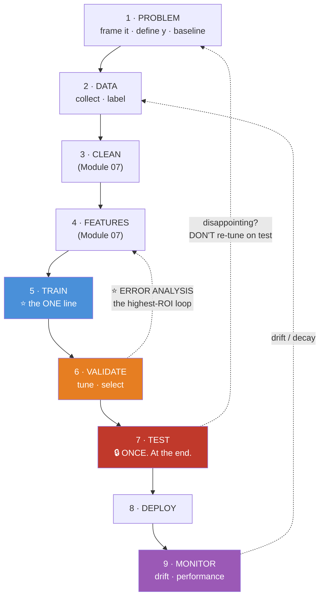
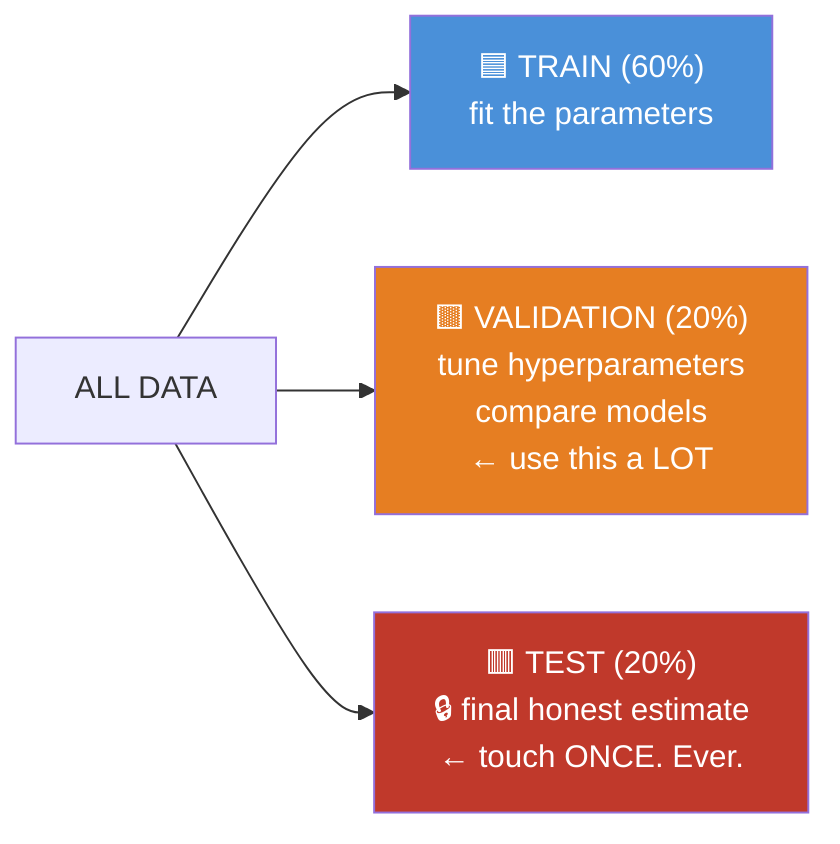
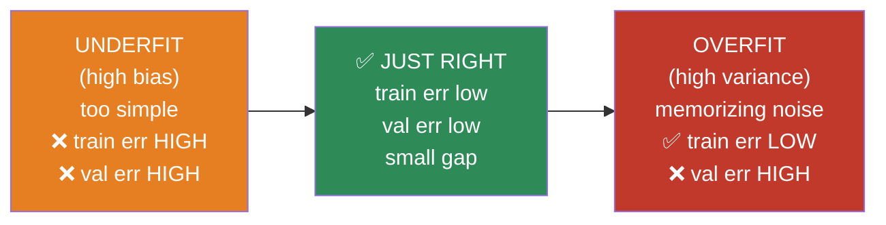
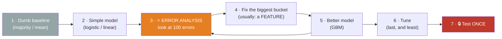
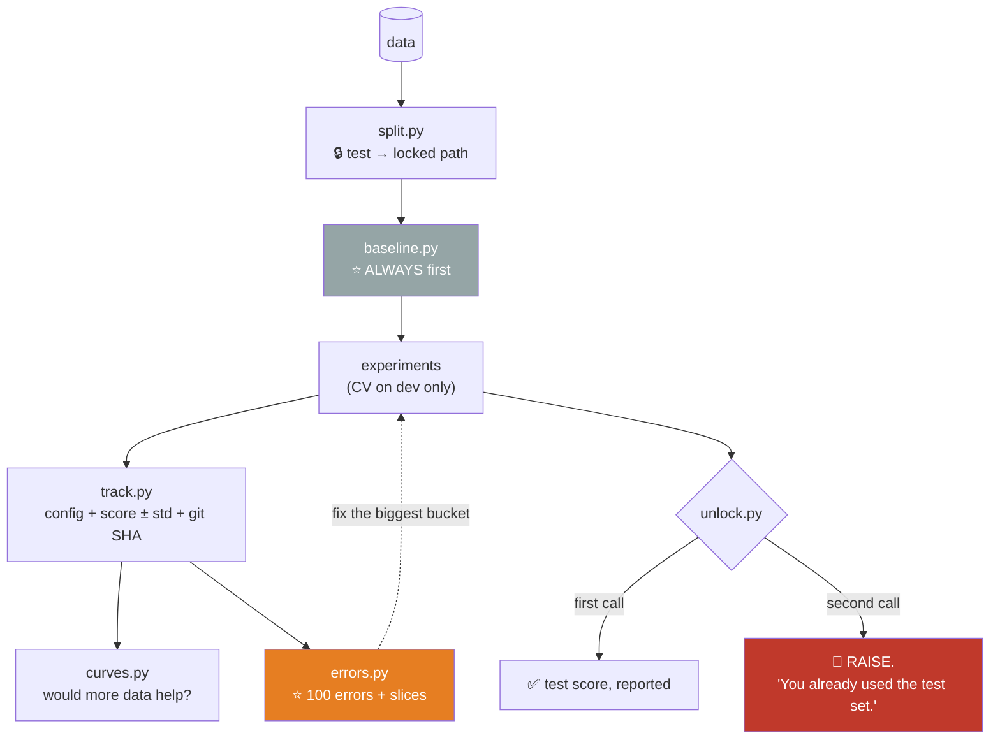

# 08.2 · The ML Workflow

[⬅ 08.1 What Is ML?](08.1-what-is-ml.md) · [🏠 Module 08](../README.md) · [➡ 08.3 Linear Regression](08.3-linear-regression.md)

> **The lesson in one line:** `model.fit()` is one line in the middle of a nine-stage process — and every stage except that one is where projects actually fail.

---

## 🎯 Learning objectives

By the end of this lesson you can:

1. Name all **nine stages** and what fails at each.
2. Explain the **three-way split** (train / validation / test) and why the test set is sacred.
3. Diagnose **underfitting vs overfitting** from a learning curve in five seconds.
4. Explain the **bias–variance tradeoff** and name the lever for each side.
5. Run **error analysis** — the highest-ROI activity in ML, and the one nobody does.
6. Build the whole loop end to end, honestly.

---

## 🧠 Mental model

> **ML is a loop, not a line. And you will go around it many more times than you expect.**



> [!IMPORTANT]
> **Look at where the time goes:** stage 5 — `model.fit(X, y)` — is **one line and about 5% of the work.** Stages 2, 3, 4 (data, cleaning, features) are **~70%**. Stages 6 and 9 (validation, monitoring) are most of the rest.
>
> **The dotted arrow from Validate back to Features is the loop you will actually spend your life in.** It's called **error analysis**, it is the highest-return activity in machine learning, and almost nobody does it — because it's unglamorous and involves reading individual wrong predictions with your own eyes.

---

## 📖 Stage by stage

| # | Stage | The failure that kills you |
|---|---|---|
| **1** | **Problem** | Building a model **nobody will act on**. Or one that can't beat "predict the majority class" |
| **2** | **Data** | **No labels.** Or labels that arrive 90 days late. Or **survivorship bias** in how you queried |
| **3** | **Clean** | Sentinels (`-1`), non-random dropping, imputing MNAR data ([07.5](../../07-Data-Analysis/weeks/07.5-data-cleaning.md)) |
| **4** | **Features** | **Leakage.** Where it's born ([07.7](../../07-Data-Analysis/weeks/07.7-feature-engineering.md)) |
| **5** | **Train** | The easy part. Genuinely |
| **6** | **Validate** | Tuning on the test set. Not stratifying. Not using CV |
| **7** | **Test** | **Touching it more than once** |
| **8** | **Deploy** | **Training/serving skew** ([07.11](../../07-Data-Analysis/weeks/07.11-pipelines.md)) |
| **9** | **Monitor** | Not doing it. Silent decay for a quarter |

---

## 1 · The Three-Way Split

**This is the most misunderstood thing in applied ML, and getting it wrong invalidates everything downstream.**



| Set | Used for | How often you touch it |
|---|---|---|
| **Train** | Fitting **parameters** (weights, splits, means) | Constantly |
| **Validation** | Choosing **hyperparameters**; comparing models; early stopping | Hundreds of times |
| **Test** | **One final, honest estimate of generalization** | **ONCE.** At the very end |

> [!CAUTION]
> **Every time you look at the test set and change something, it becomes a validation set.**
>
> Run 50 configurations, pick the one with the best *test* score, and report it — you have **selected the maximum of 50 noisy samples**, which is *guaranteed* to be an overestimate ([06.6](../../06-Mathematics/weeks/06.6-statistics.md)). Your reported number is optimistic and **you no longer have an honest estimate of anything.**
>
> **The whole field does this to ImageNet and MMLU.** Public benchmarks have been used as validation sets by thousands of researchers, which is precisely why published gains often don't replicate.
>
> **The discipline: lock the test set away. Do all your work on train + validation (or cross-validation). Unlock the test set once, report the number, and if it's disappointing — that's your answer.** Do not go back and tune. If you must, you need a *fresh* test set.

**The honest workflow:**

```python
from sklearn.model_selection import train_test_split

# 1 · Lock the test set away IMMEDIATELY. Before EDA. Before anything.
X_temp, X_test, y_temp, y_test = train_test_split(
    X, y, test_size=0.2, random_state=42, stratify=y)     # ← stratify for classification

# 2 · Split the rest into train + validation
X_train, X_val, y_train, y_val = train_test_split(
    X_temp, y_temp, test_size=0.25, random_state=42, stratify=y_temp)   # 0.25 × 0.8 = 0.2

# 3 · Do ALL your work here. Hundreds of experiments. Never touch X_test.
#     ... tune, compare, iterate ...

# 4 · ONCE, at the very end:
final_score = model.score(X_test, y_test)     # 🔒 and then STOP.
```

> [!IMPORTANT]
> **Split before you do EDA.** If you explore the full dataset — noticing outliers, spotting distributions, deciding on transformations — **your brain has now seen the test set**, and your modelling choices are subtly informed by it. This is **human leakage**, it's real, and it's why the split should be the *first* line of your script, not the last.

---

## 2 · Overfitting & Underfitting

**The central problem of machine learning.** Everything else is a technique for managing it.



### ⭐ The five-second diagnostic

| Train error | Validation error | Diagnosis | The lever |
|---|---|---|---|
| **High** | **High** | **UNDERFIT** (bias) | **Bigger model**, more features, train longer, less regularization |
| **Low** | **High** | **OVERFIT** (variance) | **More data**, regularization, simpler model, fewer features, early stopping |
| **Low** | **Low** | ✅ **Good** | Ship it |
| **High** | **Low** | 🤨 **A bug.** Or a leaky/easy validation set | Investigate — this shouldn't happen |

> [!TIP]
> **Compare two numbers and you know what to do.** That's it. That's the diagnostic. **Do this before you touch any hyperparameter**, because the two failure modes need *opposite* fixes — and half of all ML debugging time is spent applying the overfitting fix to an underfitting problem.

> 🖼️ **[IMAGE PLACEHOLDER: `assets/images/08-bias-variance.png`]**
> *Three side-by-side scatter plots of the same noisy sinusoidal data with a fitted curve. Left: a straight line through curved data, labelled "UNDERFIT (high bias) — train err 0.42, val err 0.44. The model is too simple to see the pattern." Middle: a smooth curve tracking the trend, labelled "JUST RIGHT — train 0.08, val 0.11." Right: a wildly oscillating high-degree polynomial passing exactly through every point including the noise, labelled "OVERFIT (high variance) — train 0.001, val 0.51. It memorized the noise." Below, a fourth panel: the classic U-curve of validation error vs model complexity, with train error monotonically decreasing beneath it and the optimal point marked where they diverge.*

### The bias–variance decomposition

$$\text{Expected error} = \underbrace{\text{Bias}^2}_{\text{too simple}} + \underbrace{\text{Variance}}_{\text{too sensitive}} + \underbrace{\text{Irreducible noise}}_{\text{can't fix}}$$

| | **Bias** | **Variance** |
|---|---|---|
| Means | The model **can't represent** the truth | The model is **too sensitive to the specific training sample** |
| Symptom | Underfits everything | Fits training data perfectly, generalizes terribly |
| Example | Linear model on curved data | An unpruned decision tree |
| Reduce by | Bigger/richer model, more features | **More data**, regularization, ensembling ([08.6](08.6-ensembles.md)) |

> [!IMPORTANT]
> **The irreducible noise term is why 100% accuracy is usually a red flag, not a triumph.** Some of your label variance is genuinely random — two identical customers, one churns and one doesn't. **If your model achieves near-zero error, it has almost certainly found a leak** ([07.6](../../07-Data-Analysis/weeks/07.6-eda.md)).

### Learning curves — the plot that tells you what to do

```python
from sklearn.model_selection import learning_curve
import matplotlib.pyplot as plt
import numpy as np

sizes, train_scores, val_scores = learning_curve(
    model, X, y, cv=5, train_sizes=np.linspace(0.1, 1.0, 10),
    scoring='neg_mean_squared_error')

fig, ax = plt.subplots(figsize=(8, 5))
ax.plot(sizes, -train_scores.mean(1), 'o-', label='train')
ax.plot(sizes, -val_scores.mean(1),   'o-', label='validation')
ax.fill_between(sizes, -train_scores.mean(1)-train_scores.std(1),
                       -train_scores.mean(1)+train_scores.std(1), alpha=0.15)
ax.set_xlabel('Training set size'); ax.set_ylabel('Error'); ax.legend()
```

**How to read it — this is the whole point of the plot:**

| The curves | Diagnosis | What to do |
|---|---|---|
| Both **high**, converged together | **Underfit** | ❌ **More data won't help.** Bigger model, better features |
| **Big gap**, validation still **falling** | **Overfit**, but data-hungry | ✅ **More data WILL help.** Get more |
| **Big gap**, validation **flat** | **Overfit**, saturated | ❌ More data won't help. **Regularize** or simplify |

> [!TIP]
> **This plot answers the single most expensive question in ML: "should we spend $50,000 collecting more data?"** If the validation curve has flattened, **the answer is no** — and you just saved the company $50,000 with one plot. If it's still falling, more data is the highest-return investment you can make. **Almost nobody makes this plot before making that decision.**

---

## 3 · Regularization — the primary anti-overfitting lever

**Penalize complexity.** Add a term to the loss that punishes large weights.

$$J(\theta) = \underbrace{\text{Loss}(\theta)}_{\text{fit the data}} + \lambda \underbrace{R(\theta)}_{\text{stay simple}}$$

| Type | Penalty | Effect | Use when |
|---|---|---|---|
| **L2 (Ridge)** | $\lambda\sum \theta_j^2$ | **Shrinks** weights toward 0 (never exactly 0) | ✅ The default. Handles correlated features |
| **L1 (Lasso)** | $\lambda\sum \lvert\theta_j\rvert$ | **Drives weights to exactly 0** → **feature selection** ⭐ | You want a sparse model |
| **Elastic Net** | Both | A blend | Many correlated features + want sparsity |

> [!IMPORTANT]
> **Why does L1 zero things out and L2 doesn't?** The geometry. L1's constraint region is a **diamond** (with corners **on the axes**); L2's is a **circle** (smooth everywhere). The optimum lands where the loss contours first touch the constraint region — and **a diamond's corners stick out**, so contact happens *on an axis*, where a coefficient is exactly zero. A circle has no corners, so contact happens at a generic point where all coefficients are small but nonzero.
>
> **L1 gives you feature selection for free**, as a side-effect of a geometric accident. That's a genuinely beautiful result.

> 🖼️ **[IMAGE PLACEHOLDER: `assets/images/08-l1-vs-l2.png`]**
> *Two 2-D contour plots side by side, axes β₁ and β₂. Both show elliptical loss contours centered on the unconstrained OLS solution. Left: an L1 diamond constraint region (|β₁|+|β₂| ≤ t) — the contours first touch it **at a corner on the β₂ axis**, so β₁ = 0 exactly. Annotated "L1: corners on the axes → coefficients hit exactly ZERO → feature selection." Right: an L2 circular region (β₁²+β₂² ≤ t) — the contours touch at a generic point where both coefficients are small but nonzero. Annotated "L2: no corners → shrinks toward zero, never reaches it." Caption: "A geometric accident that gives you feature selection for free."*

| Other regularizers | How |
|---|---|
| **Early stopping** | Stop when validation loss starts rising. **Free, and highly effective** |
| **More data** | The best regularizer there is |
| **Dropout** (neural nets) | Randomly zero units during training |
| **Max depth / min samples** (trees) | Structural limits ([08.5](08.5-decision-trees.md)) |
| **Ensembling** | Averaging reduces variance ([08.6](08.6-ensembles.md)) |

---

## 4 · ⭐ Error Analysis — the highest-ROI activity in ML

**Nobody does this. Everyone should. It is the difference between a practitioner and a tuner.**

```python
import pandas as pd

# 1 · Get the wrong predictions
val = X_val.copy()
val['y_true'] = y_val
val['y_pred'] = model.predict(X_val)
val['proba']  = model.predict_proba(X_val)[:, 1]
errors = val[val.y_true != val.y_pred]

# 2 · ⭐ ACTUALLY LOOK AT 100 OF THEM. With your eyes. Slowly.
print(errors.sample(100).to_string())

# 3 · Categorize them BY HAND and count
#     "23% are customers with < 30 days tenure"     → build a tenure feature
#     "18% are in a region we barely have data for" → collect more, or drop the region
#     "15% have a missing 'plan' field"             → the missingness is the signal
#     "12% are mislabeled"                          → 🚨 fix the LABELS, not the model

# 4 · Fix the biggest bucket. Retrain. Repeat.
```

> [!IMPORTANT]
> **Error analysis routinely produces a bigger improvement than any amount of hyperparameter tuning, and it costs an afternoon.**
>
> Andrew Ng's discipline: **look at 100 misclassified examples by hand.** Categorize them. Count each category. **Fix the biggest bucket.** You will typically discover that (a) 15% of your "errors" are actually **mislabeled data** — the model was right — and (b) a single missing feature explains a quarter of the rest.
>
> **This is unglamorous.** It involves reading rows in a spreadsheet. It is also the single highest-leverage thing you can do, and the reason experienced ML engineers seem to have good instincts: they've *looked* at thousands of errors, and you haven't.

### Slice-based evaluation — because one number hides everything

```python
for segment in ['new_users', 'enterprise', 'mobile', 'region_APAC']:
    mask = X_val[segment] == 1
    print(f"{segment:15} n={mask.sum():5}  acc={accuracy(y_val[mask], pred[mask]):.3f}")

# overall          n=10000  acc=0.910
# new_users        n= 1200  acc=0.620   ← 🚨 the model is BROKEN for new users
# enterprise       n=  400  acc=0.950
```

**Your aggregate accuracy is 91%. For new users it's 62%.** And new users are the segment your growth team cares about most. **A single aggregate metric hides catastrophic failure on the slice that matters.** Always slice.

---

## 5 · The Iteration Loop



> [!TIP]
> **Start embarrassingly simple.** Baseline → logistic regression → error analysis → features → GBM → tune. **In that order.**
>
> **Hyperparameter tuning is LAST and it is LEAST** (+1–3%). Features are +10–40%. Fixing bad labels can be +∞. **Yet tuning is where everyone starts, because it's the part you can do without thinking.** Resist it.

---

## 🏭 Production examples

```python
# The whole workflow, honestly, in one script
from sklearn.pipeline import Pipeline
from sklearn.compose import ColumnTransformer
from sklearn.preprocessing import StandardScaler, OneHotEncoder
from sklearn.impute import SimpleImputer
from sklearn.ensemble import HistGradientBoostingClassifier
from sklearn.model_selection import cross_val_score, train_test_split

# 1 · 🔒 LOCK THE TEST SET AWAY. FIRST LINE.
X_dev, X_test, y_dev, y_test = train_test_split(
    X, y, test_size=0.2, stratify=y, random_state=42)

# 2 · ⭐ ONE pipeline object — fit on train, transform everywhere. No leakage possible.
preprocess = ColumnTransformer([
    ('num', Pipeline([('imp', SimpleImputer(strategy='median')),
                      ('sc',  StandardScaler())]), NUMERIC),
    ('cat', OneHotEncoder(handle_unknown='ignore'), CATEGORICAL),   # ← handle_unknown!
])
model = Pipeline([('prep', preprocess),
                  ('clf',  HistGradientBoostingClassifier(random_state=42))])

# 3 · Cross-validate on the DEV set only
scores = cross_val_score(model, X_dev, y_dev, cv=5, scoring='average_precision')
print(f"CV PR-AUC: {scores.mean():.3f} ± {scores.std():.3f}")     # ← report the ±

# 4 · Fit on all of dev; evaluate ONCE on test
model.fit(X_dev, y_dev)
print(f"TEST PR-AUC: {average_precision_score(y_test, model.predict_proba(X_test)[:,1]):.3f}")
# 🔒 and STOP.
```

> [!IMPORTANT]
> **Everything is inside one `Pipeline` object.** That's not tidiness — it's the **structural leakage guard** from [07.11](../../07-Data-Analysis/weeks/07.11-pipelines.md). `cross_val_score` **refits the entire pipeline inside every fold**, so the imputer's medians and the scaler's μ/σ are learned **only from that fold's training portion**. If you scaled *before* cross-validating, every fold's validation data would have contributed to the scaling — **and your CV score would be a lie.**
>
> **This is why sklearn's API looks the way it does.** It's not a convenience; it's a safety mechanism.

---

## ⚡ Performance considerations

| Stage | Cost |
|---|---|
| **Data + cleaning + features** | **~70% of your time.** Often more compute than training, too |
| **Training** | Minutes (GBM) to days (deep nets) |
| **Cross-validation** | k× the training cost — the price of an honest estimate |
| **Hyperparameter search** | k × n_configs × training. **This is where compute budgets die** |
| **Inference** | Microseconds (linear/tree) to milliseconds (deep). **Optimize this — it runs a billion times** |
| **Monitoring** | Cheap, and universally underfunded |

---

## 🐛 Common mistakes

| Mistake | Consequence |
|---|---|
| **Tuning on the test set** | Your reported number is fiction |
| **Doing EDA before splitting** | Human leakage — your choices are informed by the test set |
| Scaling before cross-validating | Every fold's validation data leaked into the scaling |
| **No baseline** | You don't know whether the model is any good |
| **Skipping error analysis** | You tune for a week instead of adding one feature |
| Reporting one aggregate metric | Hides that the model is broken for new users |
| Applying the overfitting fix to an underfitting problem | The two need **opposite** levers. Check the two numbers first |
| Tuning hyperparameters first | +1–3%. Features are +10–40%. Wrong order |
| Not plotting the learning curve | You spend $50k on data that won't help |
| Achieving 99.9% accuracy and celebrating | **That's a leak.** Irreducible noise means perfection is suspicious |

---

## 📝 Exercises

**Conceptual**
1. Why must the test set be touched exactly once? What is it *for*?
2. Give the five-second overfit/underfit diagnostic. **Why do the two need opposite fixes?**
3. Why does L1 zero out coefficients but L2 doesn't? Give the geometric argument.
4. Your model gets 99.9% accuracy. Are you happy? Explain.

**Evaluation & debugging**
5. Train error 0.05, validation error 0.45. Diagnose it and name three fixes.
6. Train error 0.41, validation error 0.43. Diagnose it and name three fixes. **Would more data help?**
7. Plot learning curves for a model at three complexities (underfit, good, overfit). **Read each one and state whether more data would help.**
8. Your model has 91% overall accuracy. Slice it by five segments. **What do you find?** (Construct a dataset where the aggregate hides a broken segment.)

**Error analysis** — do this one for real
9. Train any classifier. Pull 100 misclassified examples. **Look at them.** Categorize them by hand. Count each bucket. **Write down what you'd fix first, and why.**
10. In that same set, estimate what fraction are **mislabeled** (the model was right). Report it. **This number is usually shocking.**

**Mathematical**
11. Write the regularized objective for Ridge and Lasso. Show what happens as λ → 0 and λ → ∞.
12. Derive why adding L2 to linear regression makes $X^\top X + \lambda I$ **always invertible** ([06.3](../../06-Mathematics/weeks/06.3-linear-algebra-decomposition.md)). **This is why Ridge exists.**

---

## 🛠️ Mini project — *The Honest Experiment Tracker*

Build `code/08-machine-learning/experiment-tracker/` — a system that makes it **impossible** to cheat on your own evaluation.

**Requirements**
- Splits data **once**, at the start, and **physically locks the test set**.
- Logs every experiment: config, CV score ± std, and the **baseline** it must beat.
- **Refuses to evaluate on test** until you explicitly unlock it — and **warns loudly** if you try twice.
- Runs error analysis and slice evaluation automatically.

```
experiment-tracker/
├── README.md
├── src/
│   ├── split.py          # ⭐ split once; write test to a separate LOCKED path
│   ├── baseline.py       # majority / mean / last-value — always computed first
│   ├── track.py          # log config + CV score ± std + git SHA
│   ├── curves.py         # learning + validation curves
│   ├── errors.py         # ⭐ sample 100 errors; slice evaluation
│   └── unlock.py         # ⭐ evaluate on test — ONCE, and it records that you did
├── tests/
│   └── test_lock.py      # ⭐ assert a second test evaluation RAISES
└── experiments/
    └── runs.jsonl
```

**Architecture**



**Implementation guidance**
1. **`split.py` writes the test set to a path your experiment code cannot read** — a different directory, ideally with a `.lock` file beside it. **Make cheating require deliberate effort.** Discipline fails under deadline; structure doesn't ([07.11](../../07-Data-Analysis/weeks/07.11-pipelines.md)).
2. **`unlock.py` records that the test set was used**, in a file, with a timestamp and the git SHA. **A second call raises.** If you genuinely need a second evaluation, you must delete the record *by hand* — which forces you to acknowledge, in writing, that you're doing it.
3. **`baseline.py` runs automatically and appears in every report.** Every experiment's score is displayed **next to the baseline**. If you can't beat it, the report says so, in red.
4. **`errors.py` is the one you'll actually use most.** Sample 100 errors, dump them to a CSV, and **slice the metric by every categorical column.** The slice table is often the most informative output of the entire project.

**Evaluation strategy:** the tracker's own success is measured by whether the **test score matches the CV score**. If test ≪ CV, you overfit the validation set — and the tracker should tell you that.

**Testing plan:**
- `test_lock.py`: assert a second `unlock()` **raises**.
- `test_baseline_beaten`: assert the report flags any model that doesn't beat the baseline.
- `test_no_test_leakage`: assert the training code path **cannot even read** the test file.

**Future improvements:** add automatic **learning curve** generation with a recommendation (*"validation curve is flat — more data will NOT help; regularize instead"*), and expected-value scoring using the FP/FN costs from [08.1](08.1-what-is-ml.md).

---

## 📄 Cheat sheet

| Stage | Guard against |
|---|---|
| 1 Problem | No baseline; nobody will act on it |
| 2 Data | No labels; survivorship bias |
| 3 Clean | Sentinels; MNAR imputation |
| 4 Features | **LEAKAGE** |
| 5 Train | *(the easy part)* |
| 6 Validate | Not stratifying; no CV |
| **7 Test** | **Touching it twice** 🔒 |
| 8 Deploy | Training/serving skew |
| 9 Monitor | Not doing it |

| The split | |
|---|---|
| **Train** (60%) | Fit **parameters**. Constantly |
| **Validation** (20%) | Tune **hyperparameters**. Hundreds of times |
| **Test** (20%) | 🔒 **ONCE. At the end.** |

| Train err | Val err | Diagnosis | Lever |
|---|---|---|---|
| **High** | **High** | **UNDERFIT** | Bigger model, more features, less regularization |
| **Low** | **High** | **OVERFIT** | **More data**, regularize, simplify, early stopping |
| Low | Low | ✅ Good | Ship |

| Regularizer | Effect |
|---|---|
| **L2 (Ridge)** | Shrinks toward 0. The default |
| **L1 (Lasso)** | **Exactly 0** → **feature selection** (the diamond's corners) |
| **Early stopping** | Free and effective |
| **More data** | The best regularizer |

**Learning curve:** gap + val still falling → **more data helps**. Gap + val flat → **regularize instead**.
**⭐ Error analysis: look at 100 errors, by hand. It beats tuning, every time.**
**Order: baseline → simple model → error analysis → features → GBM → tune (last).**

---

## 🎴 Flashcards

- **Q:** ⭐ Why must the test set be touched exactly once? → **A:** Every time you look and change something, it becomes a **validation set**. Picking the best of 50 configs by test score means **selecting the maximum of 50 noisy samples** — guaranteed to be an overestimate. You no longer have an honest generalization estimate.
- **Q:** ⭐ The five-second overfit/underfit diagnostic? → **A:** **Both errors high → UNDERFIT** (bigger model, more features). **Train low, val high → OVERFIT** (more data, regularize, simplify). **The two need opposite fixes** — check before touching anything.
- **Q:** What's the bias–variance decomposition? → **A:** Error = **Bias²** (too simple) + **Variance** (too sensitive to the sample) + **irreducible noise**. The noise term is why **99.9% accuracy is a red flag, not a triumph**.
- **Q:** ⭐ How do you read a learning curve? → **A:** Both curves high and converged → **underfit; more data won't help**. Big gap, validation still **falling** → **more data WILL help**. Big gap, validation **flat** → **regularize instead**. *This plot answers "should we spend $50k on more data?"*
- **Q:** ⭐ Why does L1 zero out coefficients but L2 doesn't? → **A:** **Geometry.** L1's constraint region is a **diamond with corners on the axes**; the loss contours first touch it *at a corner*, where a coefficient is exactly 0. L2's region is a **circle** — no corners, so contact is at a generic point. **Feature selection as a geometric accident.**
- **Q:** ⭐ What is error analysis, and why does it matter? → **A:** **Look at 100 misclassified examples by hand.** Categorize, count, fix the biggest bucket. It routinely beats any amount of hyperparameter tuning — and you'll typically find **15% of "errors" are mislabeled data** (the model was right).
- **Q:** Why is slice-based evaluation essential? → **A:** **One aggregate metric hides catastrophic failure on a subgroup.** 91% overall can be 62% for new users — the segment you most care about.
- **Q:** In what order should you improve a model? → **A:** Baseline → simple model → **error analysis** → **features** → better model (GBM) → **tune LAST**. Tuning is +1–3%; features are +10–40%. **Everyone starts with tuning because it requires no thinking.**
- **Q:** Why put everything in a sklearn `Pipeline`? → **A:** `cross_val_score` **refits the whole pipeline inside every fold**, so the imputer/scaler learn **only from that fold's training portion**. Scaling *before* CV leaks every fold's validation data into the scaling — **your CV score becomes a lie**.
- **Q:** Why split before EDA? → **A:** **Human leakage.** If you explore the full data, your brain has seen the test set and your modelling choices are informed by it.

---

## 💼 Interview questions

1. **"Walk me through your ML workflow."** — The nine stages. **Emphasize that `fit()` is ~5% of the work**, that the test set is touched once, and that **error analysis** is where the gains actually come from. Most candidates describe a straight line ending at "train the model."
2. **"How do you know if your model is overfitting?"** — Train vs validation gap. Then say what you'd *do* — and note that **underfitting needs the opposite fix**, so you check first.
3. **"Should we collect more data?"** — **"Let me show you the learning curve."** If validation error is still falling with more data, yes. If it's flat, **more data won't help — regularize or improve features instead.** This answer will impress, because it's a *measured* answer to a question people usually guess at.
4. **"What's the difference between validation and test sets?"** — Validation: tune and select, use it constantly. Test: **one honest final estimate, touched once.** If you tune on test, you've turned it into a validation set.
5. **"Your model is 91% accurate. Are you done?"** — **"What's the baseline? What's the class balance? And what does it look like sliced by segment?"** All three questions are the answer.
6. **"You have a week to improve a model. What do you do?"** — **Error analysis on day one.** Look at 100 errors, categorize, fix the biggest bucket (usually a missing feature or bad labels). **Not hyperparameter tuning** — that's the last 1–3%.

---

## 📚 Summary

- **ML is a nine-stage loop, and `model.fit()` is ~5% of it.** Data, cleaning, and features are ~70%; validation and monitoring are most of the rest.
- **The three-way split is sacred.** Train fits parameters; **validation** tunes hyperparameters (use it constantly); **test is touched exactly once**. Every look at the test set converts it into a validation set — and picking the best of 50 configs by test score is just **selecting the max of 50 noisy samples**.
- **Split before you do EDA** — otherwise your own brain leaks the test set into your modelling choices.
- **The five-second diagnostic:** both errors high → **underfit**; train low + val high → **overfit**. **They need opposite fixes**, which is why half of all debugging time is wasted applying the wrong one.
- **Learning curves answer the most expensive question in ML** — *"should we buy more data?"* Flat validation curve = no. Still falling = yes.
- **L1 zeroes coefficients and L2 doesn't, because a diamond has corners on the axes and a circle doesn't.** Feature selection as a geometric accident.
- **⭐ Error analysis is the highest-ROI activity in machine learning, and almost nobody does it.** Look at 100 errors *with your eyes*. Categorize. Count. Fix the biggest bucket. You will find that ~15% were mislabeled and the model was right.
- **Slice every metric.** 91% overall can be 62% for new users.
- **Order of operations: baseline → simple model → error analysis → features → GBM → tune (last, and least).**

**Next:** [08.3 Linear Regression](08.3-linear-regression.md) — the template. Every algorithm that follows is a variation on the four boxes you're about to build by hand.

---

## 🔗 References

- Ng — *Machine Learning Yearning* (free). **Chapters on error analysis and dev/test set design are the best writing on this topic anywhere.** Read it this week.
- Ng — *A Recipe for Training Neural Networks* / Karpathy's version of the same — the "overfit one batch first" discipline generalizes to all of ML.
- Hastie et al. — *ESL*, Ch. 7 (Model Assessment and Selection). The rigorous treatment of bias–variance.
- Recht et al. (2019) — *Do ImageNet Classifiers Generalize to ImageNet?* — **what a decade of collectively tuning on a "test" set actually cost the field.**
- scikit-learn — [Model evaluation](https://scikit-learn.org/stable/modules/model_evaluation.html) and [Pipelines](https://scikit-learn.org/stable/modules/compose.html). **Note how the API forces fit-on-train** — that's a safety mechanism, not a convenience.
- [07.11 Pipelines](../../07-Data-Analysis/weeks/07.11-pipelines.md) — the structural leakage guards this lesson depends on.

---

## 🧭 Navigation

| Direction | Link |
|---|---|
| ⬅ Previous | [08.1 What Is ML?](08.1-what-is-ml.md) |
| ➡ Next | [08.3 Linear Regression](08.3-linear-regression.md) |
| 🏠 Module | [Module 08](../README.md) |
| 🗺 Roadmap | [ROADMAP.md](../../../ROADMAP.md) |
