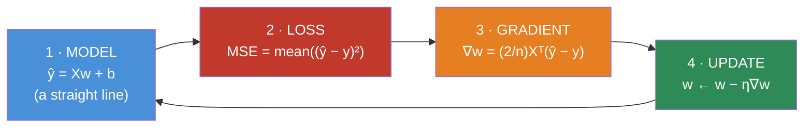
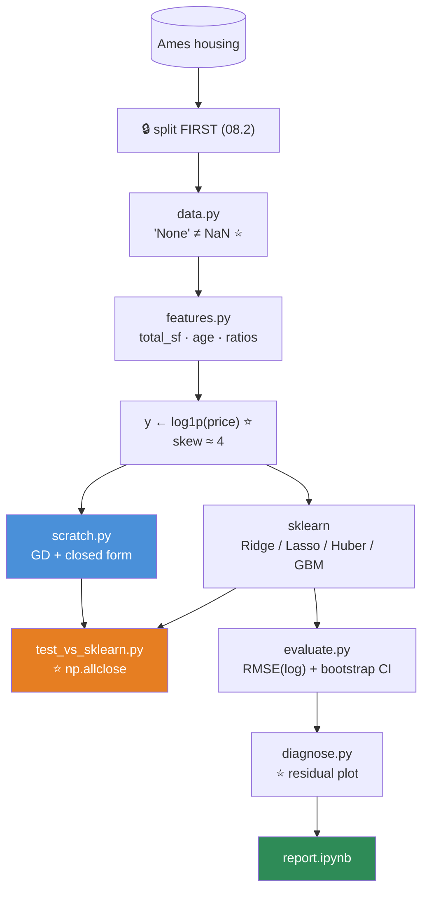

# 08.3 · Linear Regression

[⬅ 08.2 The ML Workflow](08.2-ml-workflow.md) · [🏠 Module 08](../README.md) · [➡ 08.4 Logistic Regression](08.4-logistic-regression.md)

> **The lesson in one line:** Fit a straight line by rolling downhill on the squared error — and in doing so, build the four-part template (model, loss, gradient, update) that **every** algorithm in this module reuses.

---

## 🎯 Learning objectives

By the end of this lesson you can:

1. **Derive** the MSE gradient by hand and explain every term.
2. Implement linear regression **from scratch in NumPy** — and verify it against scikit-learn.
3. Explain when to use the **normal equations** and when to use **gradient descent**.
4. Explain **Ridge** and **Lasso** — and why Ridge makes an uninvertible problem invertible.
5. State linear regression's **assumptions**, and know exactly how it breaks when they fail.
6. Debug a regression that won't converge.

---

## 🧠 Mental model

> **Draw the line that makes the total squared vertical distance to every point as small as possible.**



> [!IMPORTANT]
> **This four-box loop is the template for the entire module.** Logistic regression changes box 1 and box 2. Neural networks change box 1. SVMs change box 2. **The loop never changes.**
>
> Learn it *once*, here, deeply — by hand — and everything that follows is a variation you'll recognize on sight.

---

## 📐 Mathematical intuition

### The model

$$\hat{y} = w_1 x_1 + w_2 x_2 + \dots + w_d x_d + b = \mathbf{w}^\top \mathbf{x} + b$$

In matrix form, for the whole dataset at once ([06.2](../../06-Mathematics/weeks/06.2-linear-algebra-vectors-matrices.md)):

$$\hat{\mathbf{y}} = X\mathbf{w} + b \qquad (n,) \leftarrow (n,d)(d,) $$

**Each weight $w_j$ answers: "if feature $j$ increases by 1, how much does the prediction change — holding everything else fixed?"** That interpretability is linear regression's superpower, and it's why banks and hospitals still use it.

> [!TIP]
> **The bias trick.** Append a column of ones to `X` and the bias `b` becomes just another weight. Now `ŷ = Xw` — one clean matmul, no special case. Every implementation does this.
> ```python
> X_aug = np.hstack([np.ones((n, 1)), X])     # (n, d+1)
> ```

### The loss — Mean Squared Error

$$J(\mathbf{w}) = \frac{1}{n}\sum_{i=1}^{n}(\hat{y}_i - y_i)^2 = \frac{1}{n}\|X\mathbf{w} - \mathbf{y}\|^2$$

**Why squared?** Three reasons, and the third is the real one ([06.7](../../06-Mathematics/weeks/06.7-optimization.md)):
1. Errors become positive (so they don't cancel).
2. Large errors are punished **disproportionately**.
3. **It's differentiable everywhere** — and MAE isn't (it has a kink at zero).

> [!WARNING]
> **Reason 2 is also MSE's fatal flaw.** A single outlier with error 10 contributes **100×** the loss of an error of 1. **One bad label can dominate your entire fit** ([07.5](../../07-Data-Analysis/weeks/07.5-data-cleaning.md)). If your data has outliers or noisy labels, use **Huber loss** — quadratic near zero (smooth gradients), linear far away (outlier-resistant).

### ⭐ The gradient — derive this once, by hand

$$J(\mathbf{w}) = \frac{1}{n}(X\mathbf{w} - \mathbf{y})^\top(X\mathbf{w} - \mathbf{y})$$

Apply the chain rule ([06.4](../../06-Mathematics/weeks/06.4-calculus.md)) — outer function is $u^2$, inner is $u = X\mathbf{w} - \mathbf{y}$:

$$\boxed{\nabla_{\mathbf{w}} J = \frac{2}{n} X^\top (X\mathbf{w} - \mathbf{y}) = \frac{2}{n}X^\top(\hat{\mathbf{y}} - \mathbf{y})}$$

**Read it in plain English:** *"the gradient is the features, transposed, times the errors."*

**Verify the shape** — this is how you derive the transpose without memorizing it ([06.4](../../06-Mathematics/weeks/06.4-calculus.md)):
$$X^\top: (d,n) \quad\times\quad (\hat{y}-y): (n,) \quad\rightarrow\quad (d,) \quad\checkmark \text{ same shape as } \mathbf{w}$$

> [!IMPORTANT]
> **Look at what this equation says.** $X^\top(\hat{y} - y)$ — **each weight's gradient is the dot product of its feature column with the error vector.**
>
> If feature $j$ is **large exactly where the error is large and positive**, its gradient is large and positive → the update **decreases** $w_j$ → the prediction comes down → the error shrinks. **The gradient is literally asking: "does this feature correlate with our mistakes?"** ([06.2](../../06-Mathematics/weeks/06.2-linear-algebra-vectors-matrices.md) — a dot product measures alignment.)
>
> **That is the whole of gradient descent, in one sentence.**

### The update rule

$$\mathbf{w} \leftarrow \mathbf{w} - \eta \nabla_{\mathbf{w}} J$$

The gradient points **uphill**; we step **against** it ([06.4](../../06-Mathematics/weeks/06.4-calculus.md)). That single line is all of deep learning too.

---

## ⚙️ Internal implementation — the two ways to solve it

### Route 1 — The Normal Equations (closed form)

The loss is **convex** ([06.7](../../06-Mathematics/weeks/06.7-optimization.md)) — a perfect bowl, one global minimum. So set the gradient to zero and solve directly:

$$\frac{2}{n}X^\top(X\mathbf{w} - \mathbf{y}) = 0 \;\Longrightarrow\; X^\top X\mathbf{w} = X^\top \mathbf{y} \;\Longrightarrow\; \boxed{\mathbf{w}^* = (X^\top X)^{-1}X^\top \mathbf{y}}$$

**Exact. One shot. No learning rate, no iterations, no tuning.**

> [!CAUTION]
> **And you should still almost never implement it literally.**
>
> - **`np.linalg.inv` is slower and numerically worse than `np.linalg.solve`** ([06.3](../../06-Mathematics/weeks/06.3-linear-algebra-decomposition.md)). Never form an explicit inverse.
> - **$X^\top X$ is singular if any features are perfectly collinear** — and near-singular if they're merely *highly* correlated, which real feature matrices are all the time. The condition number gets **squared**, and in float32 you can lose all your precision.
> - **It's O(d³)** in the number of features. At d = 10,000 that's 10¹² operations — impossible.
>
> **Use `np.linalg.lstsq`** (which uses SVD and handles rank-deficiency gracefully) or gradient descent.

### Route 2 — Gradient Descent (iterative)

Start anywhere, roll downhill. **O(n·d) per step** — scales to enormous data, works when $X^\top X$ doesn't fit in memory, and generalizes to every model that isn't convex (i.e. all of deep learning).

| | **Normal equations** | **Gradient descent** |
|---|---|---|
| Exactness | ✅ **Exact** | Approximate (converges) |
| Hyperparameters | ✅ **None** | Learning rate, iterations |
| Complexity | **O(nd² + d³)** | **O(nd)** per iteration |
| Large **d** (10k+) | ❌ **Impossible** | ✅ Fine |
| Large **n** (10M+) | ❌ Memory | ✅ Fine (use SGD) |
| Collinear features | ❌ **Breaks** | 🟡 Slow but survives |
| Generalizes to other models | ❌ Linear only | ✅ **Everything** |

> [!TIP]
> **Rule of thumb: d < ~10,000 → closed form (via `lstsq`). Otherwise → gradient descent.** But **learn gradient descent properly**, because it's the *only* route that generalizes — logistic regression, neural nets, and Transformers have no closed form at all.

---

## 🐍 NumPy implementation — from scratch

**This is the reference implementation for the whole module. Read every line.**

```python
import numpy as np


class LinearRegressionScratch:
    """Linear regression: the four boxes, by hand."""

    def __init__(self, lr=0.01, n_iters=1000, method='gd', l2=0.0, verbose=False):
        self.lr, self.n_iters, self.method, self.l2, self.verbose = lr, n_iters, method, l2, verbose
        self.w = None
        self.b = None
        self.history = []

    # ── 1 · MODEL ─────────────────────────────────────────────────
    def _predict(self, X):
        return X @ self.w + self.b                     # (n,d)@(d,) + scalar → (n,)

    # ── 2 · LOSS ──────────────────────────────────────────────────
    def _loss(self, X, y):
        err = self._predict(X) - y
        mse = np.mean(err ** 2)
        return mse + self.l2 * np.sum(self.w ** 2)     # + L2 penalty

    # ── 3 & 4 · GRADIENT + UPDATE ─────────────────────────────────
    def fit(self, X, y):
        n, d = X.shape
        self.w = np.zeros(d)                           # ← zero-init is FINE here (convex, no symmetry issue)
        self.b = 0.0

        if self.method == 'closed':
            # w = (XᵀX + λI)⁻¹ Xᵀy  — but via SOLVE, never inv()   (06.3)
            Xb = np.hstack([np.ones((n, 1)), X])       # bias trick
            A = Xb.T @ Xb + self.l2 * np.eye(d + 1)
            A[0, 0] -= self.l2                          # ⭐ do NOT regularize the bias
            theta = np.linalg.solve(A, Xb.T @ y)
            self.b, self.w = theta[0], theta[1:]
            return self

        for it in range(self.n_iters):
            y_hat = self._predict(X)                   # 1 · forward
            err   = y_hat - y                          # (n,)

            dw = (2 / n) * (X.T @ err) + 2 * self.l2 * self.w   # ⭐ THE GRADIENT
            db = (2 / n) * np.sum(err)                          # bias: not regularized

            self.w -= self.lr * dw                     # 4 · update
            self.b -= self.lr * db

            if it % 50 == 0 or it == self.n_iters - 1:
                loss = self._loss(X, y)
                self.history.append((it, loss))
                if self.verbose:
                    print(f"iter {it:5}  loss {loss:10.4f}  ‖∇w‖ {np.linalg.norm(dw):8.4f}")
        return self

    def predict(self, X):
        return self._predict(X)

    def score(self, X, y):
        """R² — the fraction of variance explained."""
        ss_res = np.sum((y - self.predict(X)) ** 2)
        ss_tot = np.sum((y - y.mean()) ** 2)
        return 1 - ss_res / ss_tot
```

### ⭐ Verify it against scikit-learn — this step is non-negotiable

```python
import numpy as np
from sklearn.linear_model import LinearRegression, Ridge
from sklearn.preprocessing import StandardScaler

rng = np.random.default_rng(0)
n, d = 500, 5
X = rng.normal(size=(n, d))
true_w = np.array([3.0, -2.0, 0.5, 0.0, 1.5])
y = X @ true_w + 4.0 + rng.normal(scale=0.5, size=n)     # true bias = 4.0

# ⭐ SCALE FIRST — gradient descent requires it (see below)
X_s = StandardScaler().fit_transform(X)

mine_gd     = LinearRegressionScratch(lr=0.1, n_iters=2000).fit(X_s, y)
mine_closed = LinearRegressionScratch(method='closed').fit(X_s, y)
sk          = LinearRegression().fit(X_s, y)

print("closed form :", np.round(mine_closed.w, 3))
print("gradient desc:", np.round(mine_gd.w, 3))
print("sklearn      :", np.round(sk.coef_, 3))
print("\nGD vs sklearn match:", np.allclose(mine_gd.w, sk.coef_, atol=1e-2))     # True ✅
print("closed vs sklearn  :", np.allclose(mine_closed.w, sk.coef_, atol=1e-8))   # True ✅
print(f"\nR²: mine={mine_gd.score(X_s, y):.4f}  sklearn={sk.score(X_s, y):.4f}")
```

> [!IMPORTANT]
> **`np.allclose(mine, sklearn)` is the moment the library becomes transparent.** You now know — not believe, *know* — that `LinearRegression().fit()` is doing exactly what you just wrote. **Do this for every algorithm in this module.** It converts scikit-learn from magic into a faster version of code you understand.

### Gradient checking — the same discipline as [06.4](../../06-Mathematics/weeks/06.4-calculus.md)

```python
def gradient_check(model, X, y, eps=1e-6):
    """Verify the analytical gradient against central differences."""
    model.w = np.random.default_rng(0).normal(size=X.shape[1])
    model.b = 0.5

    err = model._predict(X) - y
    analytic = (2 / len(y)) * (X.T @ err)

    numeric = np.zeros_like(model.w)
    for j in range(len(model.w)):
        orig = model.w[j]
        model.w[j] = orig + eps; lp = np.mean((model._predict(X) - y) ** 2)
        model.w[j] = orig - eps; lm = np.mean((model._predict(X) - y) ** 2)
        model.w[j] = orig
        numeric[j] = (lp - lm) / (2 * eps)

    rel = np.abs(analytic - numeric).max() / (np.abs(analytic).max() + 1e-12)
    print(f"max relative error: {rel:.2e}")
    assert rel < 1e-5, "❌ your gradient is wrong"
    print("✅ gradient verified")

gradient_check(LinearRegressionScratch(), X.astype(np.float64), y)
```

---

## 🔧 scikit-learn implementation

```python
from sklearn.linear_model import LinearRegression, Ridge, Lasso, ElasticNet, HuberRegressor
from sklearn.pipeline import Pipeline
from sklearn.preprocessing import StandardScaler
from sklearn.model_selection import cross_val_score

# ── The production pattern: ALWAYS in a Pipeline (07.11) ──────────
model = Pipeline([
    ('scale', StandardScaler()),          # ⭐ fit on train only — the pipeline guarantees it
    ('reg',   Ridge(alpha=1.0)),
])

scores = cross_val_score(model, X_train, y_train, cv=5,
                         scoring='neg_root_mean_squared_error')
print(f"CV RMSE: {-scores.mean():.3f} ± {scores.std():.3f}")     # ← report the ±

model.fit(X_train, y_train)
print("coefficients:", dict(zip(FEATURE_NAMES, model['reg'].coef_.round(3))))
```

| Estimator | Use |
|---|---|
| `LinearRegression` | OLS. Uses SVD internally, so it survives collinearity better than the naive normal equations |
| **`Ridge(alpha=)`** | ✅ **The default.** L2 — handles collinearity, always invertible |
| **`Lasso(alpha=)`** | L1 → **feature selection** (drives coefficients to exactly 0) |
| `ElasticNet` | Both |
| **`HuberRegressor`** | ✅ **Robust to outliers.** Reach for this when MSE is being dominated |
| `SGDRegressor` | Gradient descent — for very large n |

---

## 🎚️ Regularization — Ridge and Lasso

$$\text{Ridge: } J = \|X\mathbf{w}-\mathbf{y}\|^2 + \lambda\|\mathbf{w}\|_2^2 \qquad \text{Lasso: } J = \|X\mathbf{w}-\mathbf{y}\|^2 + \lambda\|\mathbf{w}\|_1$$

**Ridge has a closed form too — and it's beautiful:**

$$\mathbf{w}^* = (X^\top X + \lambda I)^{-1}X^\top\mathbf{y}$$

> [!IMPORTANT]
> **Look at what the $\lambda I$ does. It adds λ to every diagonal entry — which adds λ to every eigenvalue.**
>
> Recall from [06.3](../../06-Mathematics/weeks/06.3-linear-algebra-decomposition.md): a matrix is singular exactly when it has a **zero eigenvalue**. So if $X^\top X$ is singular (perfectly collinear features), **$X^\top X + \lambda I$ has eigenvalues λ, λ, … — all strictly positive. It is ALWAYS invertible.**
>
> **Ridge doesn't just reduce overfitting. It makes an unsolvable problem solvable.** That is a genuinely lovely result, and it's why Ridge is the default rather than plain OLS. (It's also why Ridge is sometimes called "regularization" in the *numerical* sense, not just the statistical one — it's the same word for the same reason.)

| | **Ridge (L2)** | **Lasso (L1)** |
|---|---|---|
| Penalty | $\lambda\sum w_j^2$ | $\lambda\sum \lvert w_j\rvert$ |
| Coefficients | **Shrunk** toward 0 | **Exactly 0** ⭐ |
| Feature selection | ❌ No | ✅ **Yes, for free** |
| Correlated features | ✅ Shares weight among them | ❌ **Arbitrarily picks one** |
| Closed form | ✅ Yes | ❌ No (not differentiable at 0) |
| Use when | Default; many correlated features | You want a sparse, interpretable model |

> [!CAUTION]
> **Never regularize the bias term.** The bias is the model's baseline prediction, not a measure of complexity — shrinking it toward zero just biases every prediction downward. Note the `A[0,0] -= self.l2` line in the from-scratch code, and know that sklearn handles this for you.
>
> **And you MUST scale your features before regularizing.** The penalty $\lambda\sum w_j^2$ treats all weights equally — but a feature measured in *dollars* and one measured in *thousands of dollars* will have coefficients differing by 1000×, so **the penalty punishes them completely differently.** Unscaled Ridge is not "Ridge with a quirk"; it's a different, incoherent model.

---

## 📋 The assumptions — and exactly how each one breaks you

**Every algorithm is a bet. Here is linear regression's bet, in five parts.**

| Assumption | What it means | Violated → | Fix |
|---|---|---|---|
| **Linearity** | y is a linear function of X | **Systematically wrong** predictions; curved residuals | Polynomial features, splines, or **a tree** |
| **Independence** | Rows are independent | Wrong standard errors; **leakage** if time-series | Time-aware split ([07.12](../../07-Data-Analysis/weeks/07.12-case-studies.md)) |
| **Homoscedasticity** | Error variance is constant | Coefficients still unbiased, but **confidence intervals are wrong** | `log(y)`, or weighted least squares |
| **Normal residuals** | Errors ~ N(0, σ²) | Only affects **inference**, not prediction | Usually ignorable |
| **No multicollinearity** | Features aren't redundant | Coefficients **wildly unstable**, flip sign, **uninterpretable** | **Ridge**, drop one, or PCA |

> [!TIP]
> **The residual plot is the diagnostic that checks three assumptions at once.** Plot residuals ($y - \hat{y}$) against predictions ($\hat{y}$):
> - **Random cloud around zero** → ✅ all good.
> - **A curve or U-shape** → ❌ **non-linearity.** Your model is systematically wrong. Add polynomial features, or use a tree.
> - **A funnel/cone shape** (spreading out) → ❌ **heteroscedasticity.** Try predicting `log(y)`.
>
> **Ten seconds, one plot, three assumptions checked.** Make it a reflex.

> 🖼️ **[IMAGE PLACEHOLDER: `assets/images/08-residual-plots.png`]**
> *Three residual plots side by side (residual on y-axis, predicted value on x-axis, with a horizontal line at zero). Left: a formless random cloud centered on zero — "✅ GOOD: assumptions hold." Middle: a clear U-shaped curve — "❌ NON-LINEARITY: the model is systematically wrong at the extremes. Add polynomial features or use a tree." Right: a funnel widening to the right — "❌ HETEROSCEDASTICITY: error variance grows with the prediction. Try log(y)." Caption: "One plot. Three assumptions. Ten seconds."*

---

## 🏭 Production examples

| Where | Why linear regression, still, in 2026 |
|---|---|
| **Credit scoring** | **Legally required interpretability.** "Your loan was denied because of X" must be a real sentence |
| **Pharma / clinical trials** | Regulators demand a model you can explain, with confidence intervals |
| **A/B test analysis** | Estimating a treatment effect with error bars |
| **Baseline for everything** | ✅ **Always run it first.** If GBM only beats it by 1%, ship the linear model |
| **Feature sanity check** | The coefficient signs should match domain intuition. If `price` has a *positive* coefficient on `demand`, **you have a bug** |
| Demand forecasting | With engineered lag features, it's shockingly competitive |

> [!IMPORTANT]
> **Linear regression is your baseline, and you must always run it.** If a 500-tree gradient-boosted ensemble beats a linear model by 1%, **you should ship the linear model** — it trains in milliseconds, is interpretable, has no serving dependencies, won't drift as strangely, and can be explained to a regulator. **The complexity has to earn its place.**

---

## ⚡ Performance considerations

| | Complexity |
|---|---|
| **Training (closed form)** | O(nd² + d³) — the d³ kills you past ~10k features |
| **Training (GD)** | O(nd) **per iteration** |
| **Prediction** | **O(d)** — one dot product. Microseconds. **Nothing is faster** |
| **Memory** | O(d) — you store d+1 numbers. **A production model can be a few KB** |

**The learning rate:**

| η | Behaviour |
|---|---|
| Too small | Crawls. Wastes days of compute |
| **Just right** | Steady decrease, then plateau |
| Too large | Oscillates, or **diverges to `NaN`** |

**The stability bound is $\eta < 2/\lambda_{\max}(X^\top X)$** — exactly the eigenvalue result from [06.4](../../06-Mathematics/weeks/06.4-calculus.md). **You can compute your maximum safe learning rate before you train:**

```python
lambda_max = np.linalg.eigvalsh(X_s.T @ X_s / len(X_s)).max()
print(f"max stable lr: {2 / (2 * lambda_max):.4f}")     # the 2/n factor is in our gradient
```

> [!CAUTION]
> **Gradient descent on unscaled features is a disaster, and it's the #1 reason a from-scratch implementation "doesn't work."**
>
> If `age` ∈ [0, 100] and `income` ∈ [0, 1,000,000], then $X^\top X$ has a **condition number in the millions** — a ravine so narrow that any learning rate small enough not to diverge along `income` will take **a million steps** to move along `age` ([06.4](../../06-Mathematics/weeks/06.4-calculus.md), [06.7](../../06-Mathematics/weeks/06.7-optimization.md)).
>
> **`StandardScaler` isn't a nicety here. It's the difference between converging and not.** (The closed form doesn't care — which is one reason it's seductive.)

---

## 🐛 Common mistakes

| Mistake | Symptom | Fix |
|---|---|---|
| **Not scaling before gradient descent** | Won't converge, or takes forever | `StandardScaler` |
| Learning rate too high | Loss → `inf` / `NaN` | Lower it 10×; check $2/\lambda_{\max}$ |
| **Using `np.linalg.inv`** | Slow; numerically unstable | **`np.linalg.solve` or `lstsq`** |
| **Regularizing the bias** | Every prediction biased toward zero | Exclude it |
| **Not scaling before Ridge/Lasso** | The penalty punishes features arbitrarily | **Scale. Always** |
| Ignoring the residual plot | You miss non-linearity entirely | Plot it. Ten seconds |
| Interpreting coefficients with collinear features | They flip sign and swing wildly | Ridge, or drop one |
| Using MSE with outliers | One bad label dominates the fit | **Huber** |
| **Extrapolating** | Predicting outside the training range is a fantasy | Linear models extrapolate *confidently* and *wrongly* |
| Not comparing against the mean baseline | R² < 0 means **you're worse than predicting the mean** | Always report the baseline |

---

## 📝 Exercises

**Mathematical**
1. **Derive $\nabla_w \text{MSE}$ from scratch, on paper.** Verify the shape is `(d,)`.
2. Derive the normal equations by setting the gradient to zero.
3. **Show that $X^\top X + \lambda I$ is always invertible for λ > 0.** Use the eigenvalue argument. *(This is why Ridge exists.)*
4. Why is MSE differentiable but MAE isn't? What breaks at zero?
5. Derive the maximum stable learning rate for gradient descent on MSE.

**NumPy implementation**
6. Implement `LinearRegressionScratch` from memory. **Gradient-check it.**
7. Verify your gradient-descent solution matches your closed-form solution matches `sklearn.LinearRegression` (`np.allclose`).
8. Add L2 regularization. **Verify against `sklearn.Ridge`** for the same alpha. *(Careful: sklearn's `alpha` and your `l2` may differ by a factor — figure out which, and why.)*
9. Implement **Huber loss** and its gradient. Add an outlier to your data and show that MSE's fit is dragged toward it while Huber's isn't. **Plot both.**
10. Implement **mini-batch SGD** ([06.7](../../06-Mathematics/weeks/06.7-optimization.md)). Compare its convergence curve to full-batch GD.

**Debugging**
11. Train on **unscaled** features (`age` ∈ [0,100], `income` ∈ [0,1e6]). Watch it fail. **Compute the condition number of $X^\top X$.** Now scale, and watch it work.
12. Set lr = 10. Observe `NaN`. **Explain exactly which quantity overflowed and why** ([06.9](../../06-Mathematics/weeks/06.9-numerical-computing.md)).
13. Create perfectly collinear features (`x2 = 2 * x1`). Fit with the closed form. **What happens?** Now fit with Ridge. **What changed?**
14. Your R² is **−0.3**. What does that mean? What should you do?

**Evaluation**
15. Plot residuals vs predictions for: linear data, quadratic data, and heteroscedastic data. **Identify each pathology from the plot alone.**
16. Compare `LinearRegression`, `Ridge`, and `Lasso` on a dataset with 50 features of which only 5 matter. **Report how many coefficients Lasso zeroed.**

---

## 🛠️ Mini project — *House Price Prediction (from scratch)*

Build `code/08-machine-learning/house-prices/` — the classic, done **properly**.

**Requirements**
- Predict house prices on the **Ames** dataset (not the toy Boston one — it's deprecated for ethical reasons).
- Implement linear regression **from scratch**; verify against sklearn.
- Compare: OLS, Ridge, Lasso, Huber, and a GBM baseline.
- **Report RMSE on log(price)** with a **bootstrap confidence interval** ([06.6](../../06-Mathematics/weeks/06.6-statistics.md)).
- **Read the data dictionary** — the `"None" ≠ NaN` distinction is decisive here ([07.12](../../07-Data-Analysis/weeks/07.12-case-studies.md)).

```
house-prices/
├── README.md              # ⭐ the DECISION LOG
├── requirements.txt
├── src/
│   ├── data.py           # load + the structural-None vs truly-missing split
│   ├── features.py       # ratios, total_sf, age_at_sale, ordinal encoding
│   ├── scratch.py        # ⭐ LinearRegressionScratch (GD + closed form + Ridge)
│   ├── models.py         # sklearn: OLS / Ridge / Lasso / Huber / GBM
│   ├── evaluate.py       # RMSE(log) + bootstrap CI + residual plots
│   └── diagnose.py       # ⭐ residual plot, VIF, coefficient stability
├── tests/
│   ├── test_gradient.py      # ⭐ gradient check
│   └── test_vs_sklearn.py    # ⭐ np.allclose(mine, sklearn)
└── notebooks/
    └── report.ipynb
```

**Architecture**



**Implementation guidance**
1. **`log1p(price)` is mandatory, not optional.** Price has skew ≈ 4. MSE on raw price makes the model **optimize for mansions and ignore ordinary houses** ([06.7](../../06-Mathematics/weeks/06.7-optimization.md)). And **RMSE on the log scale is equivalent to relative error** — a $50k miss on a $200k house *should* count more than on a $2M one.
2. **`data.py`: read the data dictionary.** `pool_qc = NaN` means **there is no pool** (fill with `"None"`); `lot_frontage = NaN` means **unknown** (impute by neighborhood median). **Both look identical in `isna()`.** Getting this right is worth more than any model choice you'll make on this dataset.
3. **`test_vs_sklearn.py` is the point of the project.** Assert your from-scratch coefficients match `sklearn.Ridge` to `atol=1e-6` on the same data with the same alpha. **When that assertion passes, you own the algorithm.**
4. **`diagnose.py` — plot the residuals.** You will see a curve (non-linearity in `sqft`), which tells you to add `sqft²` or use a tree. **That's the whole point of the diagnostic: it tells you what to do next.**

**Evaluation strategy**
- **RMSE on log(price)**, reported with a **bootstrap 95% CI** — never a bare number ([06.6](../../06-Mathematics/weeks/06.6-statistics.md)).
- **Baseline: predict the mean.** Report R² against it. If R² < 0, you're worse than the mean.
- Compare all five models in one table, **with confidence intervals**. If they overlap, say so.
- **Slice the error** by neighborhood and price decile. *(The model is probably terrible on the top decile — that's worth knowing and saying.)*

**Testing plan**
- `test_gradient.py` — central-difference gradient check, in float64.
- `test_vs_sklearn.py` — `np.allclose` against sklearn for OLS and Ridge.
- `test_no_leakage.py` — the scaler and imputer are fit on train only (assert the fitted params don't change when the test set does).
- `test_log_transform.py` — assert predictions are exponentiated back before RMSE is reported in dollars.

**Future improvements**
- Add polynomial features for `sqft` and check whether the residual curve flattens.
- Add a **VIF** (variance inflation factor) report to quantify multicollinearity.
- Compare coefficient stability across bootstrap resamples — **if a coefficient flips sign across resamples, you cannot interpret it**, and that's an important thing to discover.

---

## 📄 Cheat sheet

| | |
|---|---|
| **Model** | $\hat{y} = X\mathbf{w} + b$ |
| **Loss (MSE)** | $\frac{1}{n}\|X\mathbf{w}-\mathbf{y}\|^2$ |
| **⭐ Gradient** | $\nabla_w = \frac{2}{n}X^\top(\hat{\mathbf{y}} - \mathbf{y})$ — *"features ᵀ times errors"* |
| **Update** | $\mathbf{w} \leftarrow \mathbf{w} - \eta\nabla_w$ |
| **Normal equations** | $\mathbf{w}^* = (X^\top X)^{-1}X^\top\mathbf{y}$ — **use `solve`, never `inv`** |
| **Ridge** | $+\lambda\|\mathbf{w}\|_2^2$ → $(X^\top X + \lambda I)^{-1}X^\top y$ — **always invertible** ⭐ |
| **Lasso** | $+\lambda\|\mathbf{w}\|_1$ → **exact zeros** → feature selection |
| **Huber** | Robust to outliers |

| Complexity | |
|---|---|
| Closed form | O(nd² + d³) — d < ~10k only |
| Gradient descent | O(nd) per iteration — scales |
| **Prediction** | **O(d).** One dot product |

| Assumption | Broken → |
|---|---|
| Linearity | Curved residuals → polynomial features or a tree |
| Homoscedasticity | Funnel residuals → `log(y)` |
| No multicollinearity | Unstable, sign-flipping coefficients → **Ridge** |

**⭐ Always scale before GD and before regularizing. Never regularize the bias.**
**⭐ Plot the residuals: random cloud = good · curve = non-linear · funnel = heteroscedastic.**
**⭐ Always run linear regression as your baseline. If GBM beats it by 1%, ship the linear model.**

---

## 🎴 Flashcards

- **Q:** ⭐ Write the MSE gradient and say what it means in English. → **A:** $\nabla_w = \frac{2}{n}X^\top(\hat{y} - y)$ — **"the features, transposed, times the errors."** Each weight's gradient is the **dot product of its feature column with the error vector**: *does this feature correlate with our mistakes?*
- **Q:** ⭐ What are the four boxes every supervised algorithm has? → **A:** **Model** ($Xw+b$), **Loss** (MSE), **Gradient**, **Update rule**. Every algorithm in this module changes boxes 1 and 2; the loop never changes.
- **Q:** Normal equations vs gradient descent? → **A:** Closed form is **exact, no hyperparameters, but O(d³)** and breaks on collinear features. GD is **O(nd) per step**, scales to huge data, and **generalizes to every non-convex model** (i.e. all of deep learning).
- **Q:** Why never use `np.linalg.inv`? → **A:** Slower **and** numerically worse than `solve` — it amplifies error, catastrophically when the matrix is ill-conditioned (which real feature matrices are).
- **Q:** ⭐ Why does Ridge make $X^\top X$ always invertible? → **A:** $+\lambda I$ **adds λ to every eigenvalue.** A matrix is singular iff it has a zero eigenvalue — so with λ > 0, all eigenvalues are strictly positive. **Ridge makes an unsolvable problem solvable**, not just a less-overfit one.
- **Q:** Ridge vs Lasso? → **A:** **Ridge (L2)** shrinks coefficients toward 0 and handles correlated features gracefully. **Lasso (L1)** drives them to **exactly 0** → free feature selection, but arbitrarily picks one of a correlated pair.
- **Q:** ⭐ Why must you scale before gradient descent? → **A:** Unscaled features (age 0–100 vs income 0–1e6) give $X^\top X$ a **condition number in the millions** — a ravine so narrow that any learning rate safe for one feature takes a million steps for the other. **It's the #1 reason a from-scratch implementation "doesn't work."**
- **Q:** Why must you scale before regularizing? → **A:** The penalty $\lambda\sum w_j^2$ treats all weights equally — but a feature in dollars and one in thousands of dollars have coefficients differing 1000×, so **the penalty punishes them completely differently.** Unscaled Ridge is an incoherent model.
- **Q:** Why never regularize the bias? → **A:** The bias is the model's **baseline prediction**, not a measure of complexity. Shrinking it toward zero just biases every prediction downward.
- **Q:** ⭐ What does a residual plot tell you? → **A:** **Random cloud** → assumptions hold. **A curve/U-shape** → **non-linearity** (add polynomial features or use a tree). **A funnel** → **heteroscedasticity** (try `log(y)`). *One plot, three assumptions, ten seconds.*
- **Q:** When is MSE the wrong loss? → **A:** With **outliers or noisy labels** — errors are squared, so one 10× outlier contributes **100×** the loss and dominates the fit. Use **Huber**.
- **Q:** What does R² < 0 mean? → **A:** Your model is **worse than predicting the mean**. Always report the baseline.

---

## 💼 Interview questions

1. **"Derive the gradient of MSE."** — $\frac{2}{n}X^\top(\hat{y}-y)$. **Show the shape check** ($X^\top$ is (d,n), the error is (n,), result is (d,) = same shape as w). That shape-reasoning is what makes it derivable live on a whiteboard rather than memorized.
2. **"When would you use the normal equations vs gradient descent?"** — Closed form for small d (< ~10k) — exact, no tuning. GD for large d/n, and because **it's the only route that generalizes to non-convex models.** Mention that you'd use `lstsq`, not `inv`.
3. **"Why does Ridge help with multicollinearity?"** — $+\lambda I$ adds λ to every eigenvalue, making $X^\top X + \lambda I$ **always invertible**. It stabilizes coefficients that would otherwise swing wildly. **This is the answer that shows you know the linear algebra**, not just the recipe.
4. **"Ridge or Lasso?"** — Ridge by default (handles correlated features, has a closed form). Lasso when you want **sparsity/feature selection** — but note it arbitrarily picks one of a correlated pair, which makes it unstable for interpretation.
5. **"Your gradient descent isn't converging. Debug it."** — **Scale the features first** (condition number). Then: learning rate too high (loss → NaN) or too low (crawling). Then: check the gradient with central differences. **In that order.**
6. **"Your GBM beats linear regression by 1%. What do you ship?"** — **The linear model.** Milliseconds to train, interpretable, no serving dependencies, explainable to a regulator. **The complexity has to earn its place.** (This is a judgement question, and most candidates reflexively say "the GBM.")

---

## 📚 Summary

- **Linear regression is the template**: a **model** ($Xw+b$), a **loss** (MSE), a **gradient**, and an **update rule**. Every algorithm in this module is a variation on those four boxes.
- **The gradient is $\frac{2}{n}X^\top(\hat{y}-y)$** — *"the features, transposed, times the errors."* Each weight's gradient asks: **does this feature correlate with our mistakes?**
- **Two routes to the solution:** the **normal equations** (exact, no hyperparameters, but O(d³) and fragile under collinearity — and **use `solve`, never `inv`**) and **gradient descent** (O(nd) per step, scales, and **generalizes to everything non-convex**).
- **Ridge (L2) adds λ to every eigenvalue, making $X^\top X + \lambda I$ ALWAYS invertible.** It doesn't merely reduce overfitting — **it makes an unsolvable problem solvable.** **Lasso (L1)** drives coefficients to exactly zero, giving feature selection as a geometric side-effect.
- **You must scale before gradient descent** (unscaled features make a ravine with a condition number in the millions — the #1 reason from-scratch implementations "don't work") **and before regularizing** (the penalty is scale-dependent). **Never regularize the bias.**
- **The residual plot checks three assumptions in ten seconds:** random cloud = good, curve = **non-linearity**, funnel = **heteroscedasticity**.
- **MSE is dominated by outliers** (errors are squared). Use **Huber** when labels are noisy.
- **Always run linear regression as your baseline** — and if a 500-tree ensemble beats it by 1%, **ship the linear model.**

**Next:** [08.4 Logistic Regression](08.4-logistic-regression.md) — change the model to a sigmoid and the loss to cross-entropy, and the same four boxes now do classification.

---

## 🔗 References

- Hastie, Tibshirani & Friedman — *ESL*, Ch. 3 (Linear Methods for Regression). The definitive treatment of Ridge, Lasso, and why they work.
- Géron — *Hands-On ML*, Ch. 4 (Training Models). The best practical walkthrough of GD vs closed form.
- Tibshirani (1996) — *Regression Shrinkage and Selection via the Lasso*. **The original Lasso paper**; short and readable, and the geometric argument is in it.
- Boyd & Vandenberghe — *Convex Optimization* (free) — for why the MSE loss has exactly one minimum.
- [06.4 Calculus](../../06-Mathematics/weeks/06.4-calculus.md) and [06.7 Optimization](../../06-Mathematics/weeks/06.7-optimization.md) — the gradient and the descent, derived.
- [06.3 Decomposition](../../06-Mathematics/weeks/06.3-linear-algebra-decomposition.md) — why `inv` is a trap, and why $+\lambda I$ works.

---

## 🧭 Navigation

| Direction | Link |
|---|---|
| ⬅ Previous | [08.2 The ML Workflow](08.2-ml-workflow.md) |
| ➡ Next | [08.4 Logistic Regression](08.4-logistic-regression.md) |
| 🏠 Module | [Module 08](../README.md) |
| 🗺 Roadmap | [ROADMAP.md](../../../ROADMAP.md) |
