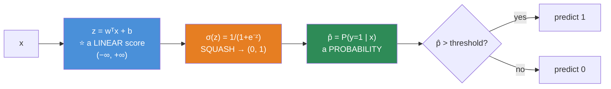
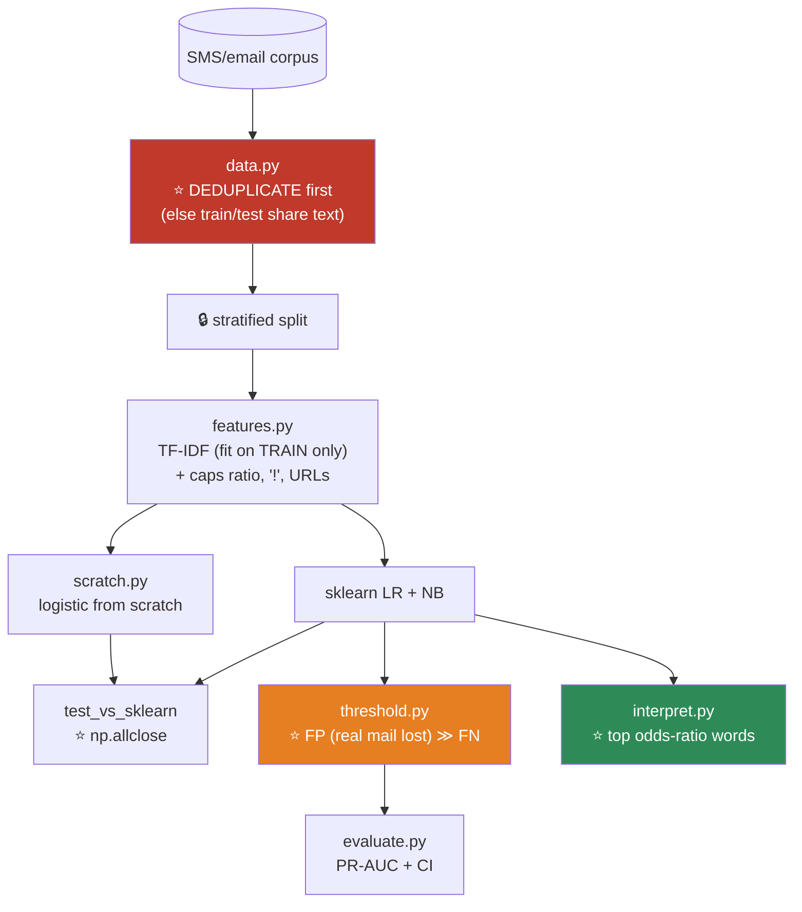

# 08.4 · Logistic Regression

[⬅ 08.3 Linear Regression](08.3-linear-regression.md) · [🏠 Module 08](../README.md) · [➡ 08.5 Decision Trees](08.5-decision-trees.md)

> **The lesson in one line:** Squash a linear score through a sigmoid, measure wrongness with cross-entropy — and the gradient comes out *identical* to linear regression's, which is not a coincidence but a deep and beautiful fact.

---

## 🎯 Learning objectives

By the end of this lesson you can:

1. Explain the **sigmoid** as a squashing function, and read its output as a **probability**.
2. Explain **why MSE is the wrong loss** for classification — and what specifically breaks.
3. **Derive** the log-loss gradient, and see why it equals linear regression's.
4. Implement logistic regression **from scratch**, verify it against sklearn, and gradient-check it.
5. Explain the **decision boundary** — and why it's *linear* despite the nonlinear sigmoid.
6. **Tune the threshold** — because 0.5 is almost never right.

---

## 🧠 Mental model

> **Logistic regression is linear regression, wrapped in a squash, scored by surprise.**



**Despite the "regression" in the name, this is a classification algorithm.** It regresses the **log-odds**, which is a linear quantity — and *then* squashes.

> [!IMPORTANT]
> **The output of logistic regression is a probability, not a class.** `predict()` throws that information away. **`predict_proba()` is the real output**, and the threshold is a *business decision*, not a modelling one ([08.12](08.12-evaluation.md)).

---

## 📐 Mathematical intuition

### The sigmoid

$$\sigma(z) = \frac{1}{1 + e^{-z}} \qquad \in (0, 1)$$

| z | σ(z) | Meaning |
|---|---|---|
| −∞ | → 0 | Certainly class 0 |
| −2 | 0.12 | Probably 0 |
| **0** | **0.5** | **Maximum uncertainty** ← the decision boundary |
| +2 | 0.88 | Probably 1 |
| +∞ | → 1 | Certainly class 1 |

**Two properties you'll use constantly:**

$$\sigma(-z) = 1 - \sigma(z) \qquad\qquad \boxed{\sigma'(z) = \sigma(z)\,(1 - \sigma(z))}$$

**The derivative is expressible in terms of the function itself** — which is a lovely piece of algebraic luck and makes backprop cheap ([06.4](../../06-Mathematics/weeks/06.4-calculus.md)).

> 🖼️ **[IMAGE PLACEHOLDER: `assets/images/08-sigmoid.png`]**
> *Two stacked panels sharing an x-axis (z from −6 to 6). Top: the sigmoid curve, S-shaped, asymptotic to 0 and 1, with the point (0, 0.5) marked and a vertical dashed line labelled "decision boundary: z = 0." Shaded regions on either side labelled "predict 0" and "predict 1." Bottom: the derivative σ′(z) = σ(1−σ), a bell shape peaking at 0.25 at z=0 and flattening to ~0 at both extremes, with a horizontal dashed line at 0.25 labelled "MAX 0.25 → this is why sigmoid causes vanishing gradients in deep nets (06.10), and why the saturated region learns nothing."*

### Why the sigmoid, and not some other squash? — **the log-odds**

Not arbitrary. Invert it:

$$z = \log\frac{p}{1-p} = \text{logit}(p) = \text{the LOG-ODDS}$$

$$\boxed{\log\frac{P(y=1)}{P(y=0)} = \mathbf{w}^\top\mathbf{x} + b}$$

> [!IMPORTANT]
> **Logistic regression assumes the LOG-ODDS are linear in the features.** *That's* the bet ([08.1](08.1-what-is-ml.md)).
>
> And it makes the coefficients beautifully interpretable: **$e^{w_j}$ is the odds ratio.** If $w_{\text{smoker}} = 0.7$, then $e^{0.7} = 2.01$ — **being a smoker roughly doubles the odds** of the outcome, holding everything else fixed.
>
> **This is why medicine, epidemiology, and credit scoring still run on logistic regression in 2026.** It's not nostalgia. *"Smoking doubles your odds"* is a sentence a doctor can say to a patient and a regulator can audit. **No gradient-boosted ensemble gives you that.**

### The loss — why NOT MSE

**This is the most important idea in the lesson.**

If we used MSE with a sigmoid: $J = \frac{1}{n}\sum(\sigma(z_i) - y_i)^2$, then by the chain rule the gradient contains a factor of $\sigma'(z)$.

**And $\sigma'(z) \to 0$ when $z$ is large in either direction.**

> [!CAUTION]
> **The catastrophe: a confidently WRONG prediction gets almost NO gradient.**
>
> Say the true label is 1, and the model outputs $\hat{p} = 0.001$ (i.e. $z \approx -7$). It is **maximally, catastrophically wrong**. But $\sigma'(-7) \approx 0.0009$ — **essentially zero**. So the gradient is essentially zero, and **the model barely updates.** It sits there being confidently wrong, learning nothing, forever.
>
> **MSE + sigmoid has a vanishing gradient exactly where you most need a large one.** That's not a minor inefficiency; it's a broken loss function.

### The loss — **log-loss** (binary cross-entropy)

$$J(\mathbf{w}) = -\frac{1}{n}\sum_{i=1}^{n}\Big[\,y_i \log \hat{p}_i + (1-y_i)\log(1-\hat{p}_i)\,\Big]$$

**Read it as: only one term is ever active.**
- If $y = 1$: the loss is $-\log \hat{p}$ → **"how much probability did you put on the truth?"**
- If $y = 0$: the loss is $-\log(1 - \hat{p})$ → same question, other class.

**This is exactly the cross-entropy from [06.8](../../06-Mathematics/weeks/06.8-information-theory.md)** — *"your average surprise when reality is p but you predicted with q"* — and $-\log(0) = \infty$ means **being confidently wrong is punished nearly infinitely.** Which is precisely the incentive you want.

| $\hat{p}$ when y=1 | Loss $-\log\hat{p}$ |
|---|---|
| 0.99 | **0.01** ✅ |
| 0.50 | 0.69 |
| 0.10 | 2.30 |
| 0.01 | **4.61** ← 460× the penalty |
| 0.00 | **∞** ☠️ |

### ⭐ The gradient — and the miracle

Derive it (chain rule through σ, and the $\sigma'$ terms **cancel exactly** — the same cancellation as [06.8](../../06-Mathematics/weeks/06.8-information-theory.md)):

$$\boxed{\nabla_{\mathbf{w}} J = \frac{1}{n}X^\top(\hat{\mathbf{p}} - \mathbf{y})}$$

> [!IMPORTANT]
> **Compare it to linear regression's gradient:**
>
> | | Gradient |
> |---|---|
> | **Linear regression (MSE)** | $\frac{2}{n}X^\top(\hat{\mathbf{y}} - \mathbf{y})$ |
> | **Logistic regression (log-loss)** | $\frac{1}{n}X^\top(\hat{\mathbf{p}} - \mathbf{y})$ |
>
> **They are the same equation.** *"Features, transposed, times the errors."* The sigmoid's derivative **cancelled out completely** — which is exactly what happened with softmax + cross-entropy in [06.8](../../06-Mathematics/weeks/06.8-information-theory.md), and it is not a coincidence.
>
> **This is not luck. It is a property of pairing an "exponential family" model with its matching loss** — the ugly terms are *designed* to cancel. It's why softmax is always paired with cross-entropy, why sigmoid is always paired with log-loss, and why frameworks fuse them into one operation.
>
> **`predicted − actual`. That's the gradient. Every time.**

---

## ⚙️ Internal implementation

**No closed form exists.** The log-loss has no analytic minimum, so you **must** iterate. (It *is* convex, though — so gradient descent will find the global optimum.)

```python
import numpy as np


class LogisticRegressionScratch:
    """Logistic regression: the SAME four boxes, with a squash and a new loss."""

    def __init__(self, lr=0.1, n_iters=2000, l2=0.0, verbose=False):
        self.lr, self.n_iters, self.l2, self.verbose = lr, n_iters, l2, verbose
        self.w = None
        self.b = None
        self.history = []

    # ── the sigmoid, NUMERICALLY STABLE (06.9) ────────────────────
    @staticmethod
    def _sigmoid(z):
        # ⚠️ naive 1/(1+np.exp(-z)) OVERFLOWS for z < -709
        out = np.empty_like(z, dtype=np.float64)
        pos = z >= 0
        out[pos]  = 1.0 / (1.0 + np.exp(-z[pos]))               # safe: exp of a negative
        ez = np.exp(z[~pos])                                     # safe: exp of a negative
        out[~pos] = ez / (1.0 + ez)                              # algebraically identical
        return out

    # ── 1 · MODEL ─────────────────────────────────────────────────
    def predict_proba(self, X):
        return self._sigmoid(X @ self.w + self.b)

    # ── 2 · LOSS ──────────────────────────────────────────────────
    def _loss(self, X, y, eps=1e-15):
        p = np.clip(self.predict_proba(X), eps, 1 - eps)         # ⭐ prevent log(0) → -inf
        ll = -np.mean(y * np.log(p) + (1 - y) * np.log(1 - p))
        return ll + self.l2 * np.sum(self.w ** 2)

    # ── 3 & 4 · GRADIENT + UPDATE ─────────────────────────────────
    def fit(self, X, y):
        n, d = X.shape
        self.w = np.zeros(d)
        self.b = 0.0

        for it in range(self.n_iters):
            p   = self.predict_proba(X)                # 1 · forward
            err = p - y                                # ⭐ predicted − actual

            dw = (X.T @ err) / n + 2 * self.l2 * self.w   # ⭐ IDENTICAL to linear regression
            db = np.mean(err)

            self.w -= self.lr * dw                     # 4 · update
            self.b -= self.lr * db

            if it % 200 == 0:
                self.history.append((it, self._loss(X, y)))
                if self.verbose:
                    print(f"iter {it:5}  log-loss {self._loss(X, y):.5f}")
        return self

    def predict(self, X, threshold=0.5):
        return (self.predict_proba(X) >= threshold).astype(int)
```

> [!CAUTION]
> **Two numerical landmines, both from [06.9](../../06-Mathematics/weeks/06.9-numerical-computing.md):**
>
> 1. **The naive sigmoid overflows.** `1/(1 + np.exp(-z))` computes `exp(709)` = `inf` for `z < -709`, giving you a `RuntimeWarning` and then `NaN`. **The branch above always exponentiates a negative number**, which cannot overflow. This is exactly why `scipy.special.expit` exists.
> 2. **`log(0)` = `-inf` → `NaN`.** If the model becomes perfectly confident (`p = 0.0` or `1.0`), the loss explodes. **Clip.** (Production code uses `log_sigmoid` / `logsumexp` to fuse the operations and never materialize a probability that could be exactly zero — same reason `nn.BCEWithLogitsLoss` takes **logits**, not probabilities.)

### ⭐ Verify against sklearn

```python
import numpy as np
from sklearn.linear_model import LogisticRegression
from sklearn.datasets import make_classification
from sklearn.preprocessing import StandardScaler

X, y = make_classification(n_samples=1000, n_features=5, n_informative=3,
                           random_state=42)
X = StandardScaler().fit_transform(X)          # ⭐ scale — GD needs it (08.3)

mine = LogisticRegressionScratch(lr=0.5, n_iters=5000).fit(X, y)

# sklearn regularizes by default! C = 1/(2·n·λ). Use a huge C to disable it.
sk = LogisticRegression(C=1e10, max_iter=5000).fit(X, y)

print("mine   :", np.round(mine.w, 3))
print("sklearn:", np.round(sk.coef_[0], 3))
print("match  :", np.allclose(mine.w, sk.coef_[0], atol=0.05))       # True ✅
print(f"\naccuracy: mine={ (mine.predict(X)==y).mean():.3f}  sk={sk.score(X,y):.3f}")
```

> [!WARNING]
> **`sklearn.LogisticRegression` applies L2 regularization BY DEFAULT (`C=1.0`).** This surprises everyone comparing against a from-scratch implementation. `C` is the **inverse** regularization strength — **set `C=1e10` to effectively turn it off.**
>
> (And note: sklearn's default is a *sensible* one. Unregularized logistic regression on separable data has coefficients that diverge to infinity — see below.)

---

## 📊 The Decision Boundary

**Where is the model exactly undecided?** Where $\hat{p} = 0.5$, which means $\sigma(z) = 0.5$, which means:

$$\boxed{\mathbf{w}^\top\mathbf{x} + b = 0}$$

> [!IMPORTANT]
> **That's the equation of a hyperplane. The decision boundary is LINEAR** — a line in 2-D, a plane in 3-D, a hyperplane in n-D.
>
> **Despite the sigmoid being nonlinear**, logistic regression can only draw **straight** boundaries. The sigmoid changes *how confident* you are as you move away from the boundary; it does not change the *shape* of the boundary itself.
>
> **This is logistic regression's bet, and its limitation.** It cannot solve XOR. It cannot draw a circle. If your classes are separated by a curve, **you must give it curved features** (polynomial, interactions) — or use a model that draws curves natively ([trees](08.5-decision-trees.md), [SVM with a kernel](08.7-svm.md), neural nets).

> 🖼️ **[IMAGE PLACEHOLDER: `assets/images/08-decision-boundary.png`]**
> *A 2×2 grid. Top-left: two linearly separable blobs with a straight decision boundary and a colour gradient (blue→white→red) showing predicted probability, with the p=0.5 line solid and p=0.25/0.75 contours dashed — "✅ logistic regression works." Top-right: two concentric rings (a circle inside an annulus), with logistic regression's straight boundary slicing uselessly through both — "❌ a straight line cannot separate these." Bottom-left: the same rings, but with x₁²+x₂² added as a feature — now a **circular** boundary correctly separates them, annotated "✅ same model, curved features." Bottom-right: the XOR pattern with a straight line failing — "❌ XOR: the problem that killed the perceptron in 1969."*

**Making it nonlinear — the cheap fix:**

```python
from sklearn.preprocessing import PolynomialFeatures
from sklearn.pipeline import Pipeline

model = Pipeline([
    ('poly',  PolynomialFeatures(degree=2, include_bias=False)),   # x₁, x₂ → x₁,x₂,x₁²,x₁x₂,x₂²
    ('scale', StandardScaler()),
    ('clf',   LogisticRegression(C=1.0)),
])
# Now the boundary can be a CONIC (circle, ellipse, hyperbola). Still "linear" — in the new feature space.
```

**This is the kernel trick in embryo** ([08.7](08.7-svm.md)): *map to a higher-dimensional space where a linear boundary suffices.*

---

## 🔧 scikit-learn implementation

```python
from sklearn.linear_model import LogisticRegression
from sklearn.pipeline import Pipeline
from sklearn.preprocessing import StandardScaler
from sklearn.metrics import classification_report, roc_auc_score, average_precision_score

model = Pipeline([
    ('scale', StandardScaler()),
    ('clf',   LogisticRegression(
        C=1.0,                      # ⭐ INVERSE regularization. Small C = MORE regularization
        penalty='l2',               # 'l1' → sparse; 'elasticnet' → both
        solver='lbfgs',             # 'liblinear' for L1/small; 'saga' for huge/elasticnet
        class_weight='balanced',    # ⭐ for imbalanced data — see below
        max_iter=1000,
    )),
])
model.fit(X_train, y_train)

proba = model.predict_proba(X_test)[:, 1]      # ⭐ THE REAL OUTPUT
print(f"ROC-AUC: {roc_auc_score(y_test, proba):.3f}")
print(f"PR-AUC : {average_precision_score(y_test, proba):.3f}")   # ⭐ use this if imbalanced
print(classification_report(y_test, model.predict(X_test)))

# Interpret: e^w = the ODDS RATIO
for name, w in zip(FEATURES, model['clf'].coef_[0]):
    print(f"{name:20} w={w:+.3f}  odds ratio={np.exp(w):.2f}×")
```

| Parameter | Note |
|---|---|
| **`C`** | **INVERSE** regularization. `C=0.01` = strong; `C=1e10` = none. **Everyone gets this backwards once** |
| `penalty` | `'l2'` (default) · `'l1'` (sparse) · `'elasticnet'` |
| `solver` | `lbfgs` (default, fast) · `liblinear` (L1, small data) · `saga` (large, elasticnet) |
| **`class_weight='balanced'`** | ⭐ Automatically upweights the minority class. **Often better than SMOTE** |
| `multi_class` | Multinomial (softmax) — the natural extension ([06.8](../../06-Mathematics/weeks/06.8-information-theory.md)) |

---

## 🎯 ⭐ The Threshold — 0.5 is almost never right

**`predict()` uses 0.5. That is a default, not a decision.**

```python
import numpy as np
from sklearn.metrics import precision_recall_curve

proba = model.predict_proba(X_val)[:, 1]

# ── Business-driven threshold ─────────────────────────────────────
COST_FP = 5        # $5   — we contact a customer who wasn't going to churn
COST_FN = 2000     # $2000 — we lose a customer we could have saved

best_t, best_cost = 0.5, np.inf
for t in np.linspace(0.01, 0.99, 99):
    pred = (proba >= t).astype(int)
    fp = ((pred == 1) & (y_val == 0)).sum()
    fn = ((pred == 0) & (y_val == 1)).sum()
    cost = fp * COST_FP + fn * COST_FN
    if cost < best_cost:
        best_t, best_cost = t, cost

print(f"optimal threshold: {best_t:.2f}  (cost ${best_cost:,})")
print(f"cost at t=0.50   : ${(((proba>=.5)&(y_val==0)).sum()*COST_FP + ((proba<.5)&(y_val==1)).sum()*COST_FN):,}")
# optimal threshold: 0.11  (cost $47,300)
# cost at t=0.50   : $128,000     ← 2.7× MORE EXPENSIVE
```

> [!IMPORTANT]
> **The threshold is a business decision, not a modelling one — and moving it is often worth more than any model improvement.**
>
> In the example above, **a false negative costs 400× a false positive.** So you should predict "churn" much more eagerly than 0.5 — you'd rather make 100 unnecessary $5 calls than lose one $2,000 customer. **The optimal threshold is 0.11, and using it halves your cost with no change to the model at all.**
>
> **Tuning the threshold is free. Tuning hyperparameters is expensive and buys 1–3%.** Yet everyone does the second and almost nobody does the first. ([08.12](08.12-evaluation.md))

---

## ⚖️ Imbalanced data

With a 1% positive rate, the model can achieve 99% accuracy by predicting "no" forever ([06.5](../../06-Mathematics/weeks/06.5-probability.md)).

| Fix | Note |
|---|---|
| **`class_weight='balanced'`** | ✅ **Try this first.** Weights the loss by inverse class frequency. Free, and usually enough |
| **Tune the threshold** | ✅ **Do this always.** Often the biggest win |
| **PR-AUC, not accuracy or ROC-AUC** | ⭐ ROC-AUC is **optimistic** on heavy imbalance ([08.12](08.12-evaluation.md)) |
| Undersample the majority | Throws away data |
| Oversample / SMOTE | ⚠️ Often **helps less than class weights**, and can create nonsense synthetic points |

> [!TIP]
> **`class_weight='balanced'` + threshold tuning solves most imbalance problems, and costs two lines.** Reach for SMOTE only after you've tried both and measured — the literature on SMOTE is far less flattering than its popularity suggests.

---

## ⚡ Performance considerations

| | |
|---|---|
| **Training** | O(nd) per iteration. Converges in ~100s of iterations with L-BFGS |
| **Prediction** | **O(d)** — one dot product + one exp. **Microseconds** |
| **Memory** | O(d). The model is a handful of KB |
| **Scaling** | ⭐ **Required** for GD convergence and for coherent regularization ([08.3](08.3-linear-regression.md)) |
| **Convexity** | ✅ Log-loss is convex → **one global optimum**. No local minima to worry about |

> [!CAUTION]
> **On perfectly separable data, unregularized logistic regression's coefficients diverge to infinity.**
>
> Why? If a hyperplane separates the classes perfectly, then **scaling `w` up by 10× makes every prediction more confident and the log-loss strictly smaller** — forever. There's no finite optimum; the optimizer just keeps pushing. You'll see it as `ConvergenceWarning` and absurd coefficients (±10⁵).
>
> **The fix is regularization** — which caps the weights and gives a finite solution. **This is why sklearn regularizes by default**, and it's a genuinely good default.

---

## 🐛 Common mistakes

| Mistake | Consequence |
|---|---|
| **Using MSE instead of log-loss** | **Vanishing gradient exactly when confidently wrong.** The model learns nothing from its worst errors |
| **Naive `1/(1+exp(-z))`** | Overflow → `NaN` for large negative z |
| `log(0)` in the loss | `-inf` → `NaN`. **Clip, or use `BCEWithLogits`** |
| **Not scaling** | GD won't converge; regularization is incoherent |
| **Forgetting sklearn's `C` is INVERSE** | You regularize *harder* when you meant to relax |
| **Using `predict()` instead of `predict_proba()`** | You threw away the probability — the model's real output |
| **Leaving the threshold at 0.5** | **Often the single most costly default in your entire pipeline** |
| Reporting **accuracy** on imbalanced data | 99% accuracy for a model that catches nothing |
| Expecting a nonlinear boundary | **It's a hyperplane.** Add polynomial features or change model |
| Interpreting coefficients on **unscaled** features | Their magnitudes aren't comparable |
| Interpreting coefficients with **collinear** features | They swing wildly and flip sign |
| Trusting the probabilities as calibrated | Logistic regression is *fairly* well-calibrated — but check with a reliability diagram ([08.12](08.12-evaluation.md)) |

---

## 📝 Exercises

**Mathematical**
1. **Derive $\sigma'(z) = \sigma(z)(1-\sigma(z))$** from the definition.
2. **Derive the log-loss gradient** and show the $\sigma'$ terms cancel. **Explain why this cancellation isn't a coincidence.**
3. Show that MSE + sigmoid gives a gradient proportional to $\sigma'(z)$, and **explain precisely why that's catastrophic** for a confidently-wrong prediction.
4. Show that the decision boundary $\hat{p} = 0.5$ is exactly $\mathbf{w}^\top\mathbf{x}+b = 0$ — a hyperplane.
5. Explain why $e^{w_j}$ is the odds ratio. If $w = 0.7$, what does that mean in a sentence a doctor could say?

**NumPy implementation**
6. Implement `LogisticRegressionScratch` from memory. **Gradient-check it.**
7. Verify against `sklearn.LogisticRegression(C=1e10)` with `np.allclose`. **Explain why you need the big `C`.**
8. **Break the naive sigmoid.** Feed it `z = -1000`. Observe the overflow warning and the `NaN`. Now use the stable version.
9. Train with **MSE** instead of log-loss. Plot both loss curves. **Show that MSE converges far more slowly**, and explain why using $\sigma'$.
10. Implement multinomial logistic regression (softmax) for 3 classes. **Verify the gradient is still `predicted − actual`** ([06.8](../../06-Mathematics/weeks/06.8-information-theory.md)).

**Debugging & visualization**
11. Generate two concentric rings. Fit logistic regression. **Plot the decision boundary and watch it fail.** Now add `x₁² + x₂²` as a feature and watch it succeed. **Explain what happened in one sentence.**
12. Generate perfectly separable data. Fit **without** regularization. **Report the coefficient magnitudes.** Explain the divergence. Now add L2.
13. Plot the decision boundary and the probability contours (0.25, 0.5, 0.75) for a 2-D problem.

**Evaluation**
14. On an imbalanced dataset (1% positive), report accuracy, precision, recall, F1, ROC-AUC, and PR-AUC. **Explain why accuracy and ROC-AUC both mislead here.**
15. ⭐ Given `COST_FP = $5` and `COST_FN = $2000`, **find the cost-optimal threshold**. Report the saving vs. 0.5. **This exercise is the most commercially valuable one in the lesson.**

---

## 🛠️ Mini project — *Spam Detection*

Build `code/08-machine-learning/spam-detector/` — the original killer app for ML, done from scratch.

**Requirements**
- Classify SMS/email as spam using **TF-IDF + logistic regression from scratch**.
- Compare against `sklearn`, and against a **Naive Bayes baseline** ([08.8](08.8-naive-bayes.md)).
- **Tune the threshold** — a false positive (a real email in the spam folder) is *far* worse than a false negative.
- **Interpret the model**: which words most increase the odds of spam?

```
spam-detector/
├── README.md
├── src/
│   ├── data.py           # load; ⭐ DEDUPLICATE (07.12 — 5–15% dupes is normal)
│   ├── features.py       # TF-IDF + cheap counts (caps ratio, '!', URLs)
│   ├── scratch.py        # ⭐ LogisticRegressionScratch (stable sigmoid!)
│   ├── models.py         # sklearn LR / Naive Bayes / linear SVM
│   ├── threshold.py      # ⭐ cost-optimal threshold
│   ├── interpret.py      # ⭐ top spam/ham words by coefficient
│   └── evaluate.py       # PR-AUC + bootstrap CI + confusion matrix
├── tests/
│   ├── test_gradient.py
│   ├── test_vs_sklearn.py
│   └── test_stable_sigmoid.py    # ⭐ assert no NaN for z = ±1000
└── notebooks/
```

**Architecture**



**Implementation guidance**
1. **Deduplicate FIRST.** Real message corpora are 5–15% duplicates, and a random split puts identical text in train *and* test — the model **memorizes** it and scores 0.98 ([07.12](../../07-Data-Analysis/weeks/07.12-case-studies.md)). **This single `drop_duplicates` is worth more than any modelling choice here.**
2. **Fit TF-IDF on the training set only.** The vocabulary is a **fitted parameter** — building it from all the text leaks the test set's word distribution.
3. **`threshold.py` is the commercially important part.** For spam, a **false positive** (a real email silently deleted) is catastrophic; a false negative (spam in the inbox) is a minor annoyance. **So the threshold should be pushed HIGH — maybe 0.9.** Gmail is far more willing to let spam through than to lose your job offer. **Quantify it, and say so in the README.**
4. **`interpret.py` is the payoff and the reason this project uses logistic regression.** Sort by coefficient; print the top 20 spam words with their **odds ratios**. You'll see `free`, `winner`, `txt`, `claim`, `prize`, `£`. **Being able to say "the word 'free' multiplies the odds of spam by 12×" is exactly what a black-box model cannot do**, and it's why banks and hospitals still use this algorithm.

**Evaluation strategy**
- **PR-AUC** (spam is imbalanced), with a **bootstrap CI**.
- **Confusion matrix at the chosen threshold**, with the **business cost** attached to each cell.
- **Baseline:** Naive Bayes ([08.8](08.8-naive-bayes.md)) — the algorithm that originally solved this problem. **If it wins, say so.**
- **Precision at high recall** — *"at 95% spam caught, what fraction of flagged mail is actually spam?"*

**Testing plan**
- `test_stable_sigmoid.py` — assert `sigmoid(-1000)` returns `0.0` and **not** `NaN`. ⭐
- `test_gradient.py` — central-difference gradient check.
- `test_vs_sklearn.py` — `np.allclose` against `LogisticRegression(C=1e10)`.
- `test_no_dupes_across_split.py` — ⭐ assert **no normalized message text appears in both train and test.** This is the leakage test for this problem type.

**Future improvements**
- Add character n-grams (catches `fr33` and `v1agra`).
- Add a **calibration check** (reliability diagram) — are the probabilities honest?
- Compare against a fine-tuned Transformer and **measure whether the 100× compute is worth the accuracy gain.** (It often isn't, and demonstrating that is a genuinely valuable finding.)

---

## 📄 Cheat sheet

| | |
|---|---|
| **Model** | $\hat{p} = \sigma(\mathbf{w}^\top\mathbf{x}+b)$, where $\sigma(z) = \frac{1}{1+e^{-z}}$ |
| **The bet** | **The LOG-ODDS are linear in the features** |
| **Interpretation** | $e^{w_j}$ = the **odds ratio** ⭐ |
| **Loss** | Log-loss = $-\frac{1}{n}\sum[y\log\hat{p} + (1-y)\log(1-\hat{p})]$ |
| **⭐ Gradient** | $\frac{1}{n}X^\top(\hat{\mathbf{p}} - \mathbf{y})$ — **identical to linear regression.** Predicted − actual |
| **Decision boundary** | $\mathbf{w}^\top\mathbf{x}+b = 0$ — **a HYPERPLANE. Always linear** |
| **Nonlinear?** | Add polynomial/interaction features (→ the kernel trick, [08.7](08.7-svm.md)) |
| **Complexity** | Train O(nd)/iter · **Predict O(d)** |

| Trap | Fix |
|---|---|
| **MSE + sigmoid** | **Vanishing gradient when confidently wrong.** Use **log-loss** |
| `1/(1+exp(-z))` overflows | Branch on the sign of z, or `scipy.special.expit` |
| `log(0)` = −inf | Clip, or use `BCEWithLogitsLoss` (fused) |
| Unscaled features | GD won't converge; regularization is incoherent |
| **sklearn's `C`** | It's **INVERSE** regularization. `C=1e10` ≈ none |
| Separable data, no regularization | **Coefficients diverge to ∞** |
| **Threshold = 0.5** | ⭐ **Almost never right.** Tune it on cost |
| Imbalanced | `class_weight='balanced'` + tune the threshold + **PR-AUC** |

---

## 🎴 Flashcards

- **Q:** ⭐ Why is MSE the wrong loss for logistic regression? → **A:** The gradient contains a factor of **σ′(z)**, which **→ 0 when z is large**. So a **confidently WRONG** prediction (p̂=0.001 when y=1) gets **almost no gradient** — the model sits there being confidently wrong and learning nothing. **Vanishing gradient exactly where you most need a big one.**
- **Q:** ⭐ What is the gradient of log-loss, and why is it remarkable? → **A:** $\frac{1}{n}X^\top(\hat{p} - y)$ — **identical to linear regression's.** The σ′ terms **cancel exactly**. Not luck: it's a property of pairing an exponential-family model with its matching loss, and it's why sigmoid+log-loss and softmax+cross-entropy are always fused.
- **Q:** What does logistic regression actually assume? → **A:** That the **log-odds are linear in the features**: $\log\frac{P(y=1)}{P(y=0)} = w^\top x + b$.
- **Q:** ⭐ How do you interpret a logistic regression coefficient? → **A:** **$e^{w_j}$ is the odds ratio.** If $w_{\text{smoker}} = 0.7$, then $e^{0.7} \approx 2$ — **being a smoker doubles the odds**. *This is why medicine and credit scoring still use it.*
- **Q:** What shape is the decision boundary? → **A:** A **hyperplane** — always **linear** ($w^\top x + b = 0$), despite the nonlinear sigmoid. It **cannot solve XOR** or draw a circle. Add polynomial features (→ the kernel trick) or change models.
- **Q:** Why does the naive sigmoid overflow? → **A:** `1/(1+np.exp(-z))` computes `exp(709+)` = `inf` for large negative z. **Branch on the sign so you only ever exponentiate a negative number.**
- **Q:** ⭐ What happens to unregularized logistic regression on perfectly separable data? → **A:** **The coefficients diverge to infinity** — scaling w up always makes the log-loss strictly smaller, forever. There's no finite optimum. **This is why sklearn regularizes by default.**
- **Q:** What is sklearn's `C` parameter? → **A:** **INVERSE** regularization strength. Small C = **strong** regularization. `C=1e10` ≈ none. **Everyone gets this backwards once.**
- **Q:** ⭐ Why is 0.5 almost never the right threshold? → **A:** Because **a false positive and a false negative rarely cost the same.** If FN costs $2000 and FP costs $5, the optimal threshold is ~0.1 — and using it can **halve your cost with no model change at all.** **The threshold is a business decision, and tuning it is free.**
- **Q:** Best first moves for imbalanced data? → **A:** **`class_weight='balanced'`** + **tune the threshold** + report **PR-AUC** (not accuracy, and not ROC-AUC, which is optimistic under heavy imbalance). Try SMOTE last, if at all.

---

## 💼 Interview questions

1. **"Why not use MSE for classification?"** — The σ′(z) factor **vanishes when the model is confidently wrong**, so it learns nothing from its worst errors. Log-loss's gradient is `p − y`, which is **large exactly when you're most wrong.** This is a favourite question and the σ′ answer is what distinguishes a real understanding.
2. **"Derive the logistic regression gradient."** — Show the σ′ cancellation. **Then point out it's identical to linear regression's** — that observation is what shows you understand *why*, not just *what*.
3. **"Is the decision boundary linear or nonlinear?"** — **Linear** (a hyperplane), despite the sigmoid. The sigmoid changes *confidence*, not the *shape* of the boundary.
4. **"How do you interpret the coefficients?"** — $e^{w}$ = odds ratio. Give a concrete sentence. **Then note it requires scaled, non-collinear features to be meaningful.**
5. **"Your classifier has 99% accuracy on fraud data. React."** — **"What's the base rate?"** If fraud is 1%, predicting "never fraud" gets 99%. Ask for **PR-AUC**, precision, recall, and **the threshold**.
6. **⭐ "How do you choose the classification threshold?"** — **Not 0.5.** From the **relative cost of FP vs FN**, in currency. Sweep thresholds, compute expected cost, pick the minimum. **This is free and often worth more than any model improvement** — and most candidates have never thought about it.
7. **"Why does sklearn regularize logistic regression by default?"** — Because on **separable data, unregularized coefficients diverge to infinity.** A good default, not an annoyance.

---

## 📚 Summary

- **Logistic regression is linear regression wrapped in a sigmoid and scored by cross-entropy.** Same four boxes; two of them changed.
- **The bet: the log-odds are linear in the features.** Which makes $e^{w_j}$ the **odds ratio** — *"smoking doubles your odds"* — and is why **medicine, epidemiology, and credit scoring still run on this algorithm.** No ensemble gives you that sentence.
- **⭐ MSE is catastrophically wrong here.** Its gradient carries a factor of $\sigma'(z)$, which **vanishes when the model is confidently wrong** — so it learns nothing from its worst errors. **Log-loss** punishes confident wrongness toward infinity, which is exactly the incentive you want.
- **⭐ The log-loss gradient is $\frac{1}{n}X^\top(\hat{p} - y)$ — identical to linear regression's.** The sigmoid's derivative **cancels exactly**. This isn't luck; it's why sigmoid+log-loss and softmax+cross-entropy are always paired and fused.
- **The decision boundary is a hyperplane — always linear.** It cannot solve XOR or draw a circle. **Add polynomial features** (the kernel trick in embryo) or change models.
- **Numerical landmines:** the naive sigmoid **overflows**, and `log(0)` gives `NaN`. Branch on the sign; clip; or use the fused `BCEWithLogits`.
- **On separable data, unregularized coefficients diverge to infinity** — which is why sklearn regularizes by default, and why its `C` (an **inverse** strength) trips everyone up once.
- **⭐ The threshold is a business decision, and 0.5 is almost never right.** Derive it from the cost of a false positive versus a false negative. **It's free, and it routinely beats any amount of hyperparameter tuning.**

**Next:** [08.5 Decision Trees](08.5-decision-trees.md) — abandon the hyperplane entirely and start asking questions instead.

---

## 🔗 References

- Hastie et al. — *ESL*, Ch. 4.4 (Logistic Regression). The rigorous treatment, including the separability divergence.
- Géron — *Hands-On ML*, Ch. 4. Excellent on decision boundaries and softmax.
- Bishop — *Pattern Recognition and Machine Learning*, Ch. 4. The best explanation of why sigmoid+cross-entropy is the *natural* pairing (exponential families).
- Agresti — *Categorical Data Analysis* — where the odds-ratio interpretation comes from, and how medicine actually uses it.
- Guo et al. (2017) — *On Calibration of Modern Neural Networks* — **logistic regression is usually well-calibrated; deep nets are not.** Worth knowing why.
- [06.8 Information Theory](../../06-Mathematics/weeks/06.8-information-theory.md) — cross-entropy derived, and the `predicted − actual` gradient in full.

---

## 🧭 Navigation

| Direction | Link |
|---|---|
| ⬅ Previous | [08.3 Linear Regression](08.3-linear-regression.md) |
| ➡ Next | [08.5 Decision Trees](08.5-decision-trees.md) |
| 🏠 Module | [Module 08](../README.md) |
| 🗺 Roadmap | [ROADMAP.md](../../../ROADMAP.md) |
