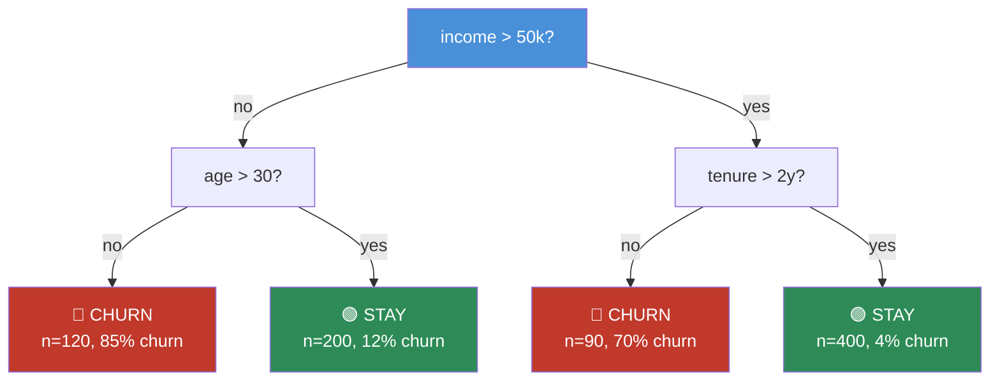
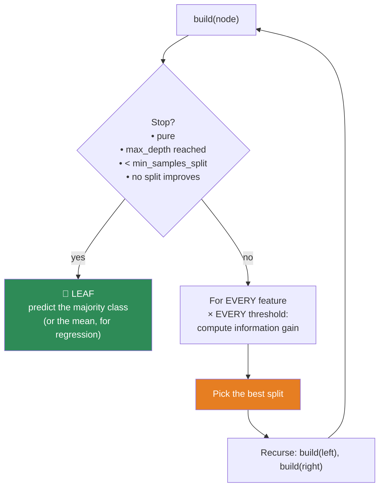
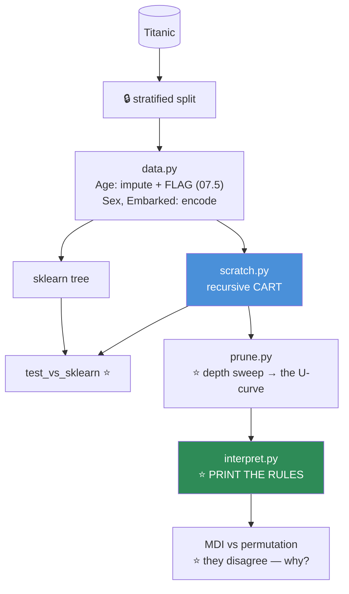

# 08.5 · Decision Trees

[⬅ 08.4 Logistic Regression](08.4-logistic-regression.md) · [🏠 Module 08](../README.md) · [➡ 08.6 Ensembles](08.6-ensembles.md)

> **The lesson in one line:** Stop drawing hyperplanes and start asking questions — greedily pick the question that most reduces your uncertainty, recurse, and you've built the most interpretable model in machine learning and the building block of the algorithm that wins most tabular competitions.

---

## 🎯 Learning objectives

By the end of this lesson you can:

1. Explain **entropy** and **Gini impurity** as measures of "how mixed is this node?"
2. Compute **information gain** by hand and use it to choose a split.
3. Build a decision tree **from scratch in NumPy**, recursively.
4. Explain **why an unpruned tree always overfits** — and the two ways to stop it.
5. Read a tree, and know why its interpretability is both real and treacherous.
6. Explain what trees **cannot** do — which motivates all of [08.6](08.6-ensembles.md).

---

## 🧠 Mental model

> **A decision tree is a game of Twenty Questions, where each question is chosen to be maximally informative.**



**Each internal node is a question. Each leaf is an answer.** To predict, you walk from the root to a leaf, answering questions. **That's it.**

The only clever part is: **which question do you ask?** And the answer is *"the one that most reduces uncertainty"* — which is [information theory](../../06-Mathematics/weeks/06.8-information-theory.md), showing up in a place you might not have expected it.

---

## 📐 Mathematical intuition — measuring "mixed-ness"

**A node is pure if all its samples share one label. It's impure if they're mixed.** We want splits that make children *purer* than their parent.

### Entropy — average surprise

$$H(S) = -\sum_{c} p_c \log_2 p_c$$

Straight from [06.8](../../06-Mathematics/weeks/06.8-information-theory.md). **How uncertain am I about the label of a random sample from this node?**

| Node contents | Entropy | Meaning |
|---|---|---|
| 100% class A | **0.00** | Pure. **No surprise possible** |
| 90/10 | 0.47 | Mostly predictable |
| 75/25 | 0.81 | |
| **50/50** | **1.00** | **Maximum uncertainty.** A coin flip |

### Gini impurity

$$G(S) = 1 - \sum_c p_c^2$$

**"What's the probability I misclassify a random sample if I label it by drawing randomly from this node's distribution?"**

| Node | Gini |
|---|---|
| 100/0 | **0.00** |
| 90/10 | 0.18 |
| 50/50 | **0.50** (max for binary) |

### Entropy vs Gini — which?

| | Entropy | Gini |
|---|---|---|
| Range (binary) | [0, 1] | [0, 0.5] |
| Cost | `log` — slower | **Just squares — faster** ⭐ |
| Behaviour | Slightly more sensitive to changes at the extremes | |
| **Practical difference** | **Almost none.** They pick the same splits ~98% of the time | |

> [!TIP]
> **Use Gini. It's sklearn's default for a reason: it's cheaper (no logarithms) and gives virtually identical trees.** The entropy-vs-Gini debate consumes a lot of interview time and almost no real-world decisions. **Know both; don't agonize.**

### ⭐ Information Gain — the splitting criterion

$$\text{IG} = H(\text{parent}) - \sum_{k \in \text{children}} \frac{n_k}{n} H(\text{child}_k)$$

**"How much uncertainty did this question remove?"** The children's entropies are **weighted by how many samples land in each** — a split that isolates 3 samples into a pure leaf isn't very useful.

**The algorithm: try every feature, every threshold. Pick the split with the highest information gain. Recurse.**

### Worked example — compute one by hand

Parent: 10 samples, 5 churn / 5 stay. $H = 1.0$ bit (maximum uncertainty).

**Split on `income > 50k`:**
- Left (income ≤ 50k): 4 samples, **4 churn / 0 stay** → $H = 0$ ✨ **pure!**
- Right (income > 50k): 6 samples, 1 churn / 5 stay → $H = -\frac{1}{6}\log_2\frac{1}{6} - \frac{5}{6}\log_2\frac{5}{6} = 0.65$

$$\text{IG} = 1.0 - \left(\tfrac{4}{10}(0) + \tfrac{6}{10}(0.65)\right) = 1.0 - 0.39 = \boxed{0.61 \text{ bits}}$$

**We removed 0.61 bits of uncertainty with one question.** Now try every other feature and threshold, and keep the best.

---

## ⚙️ Internal implementation — the algorithm (CART)



> [!IMPORTANT]
> **The split search is GREEDY, and that's a real limitation.** At each node it picks the locally-best question, never looking ahead. **A pair of questions that would be brilliant *together* may each look mediocre alone**, so the tree misses them.
>
> Finding the globally-optimal tree is **NP-complete**. Greedy is what we can afford — and it's a bet that "locally good" compounds into "globally decent." It usually does, but this is precisely the weakness that **ensembles** ([08.6](08.6-ensembles.md)) exist to paper over: build many *different* greedy trees and average them.

### The candidate thresholds

For a continuous feature, you don't try every real number. You **sort the unique values and try the midpoints** between consecutive ones — because the gain only changes when a sample crosses the boundary.

---

## 🐍 NumPy implementation — from scratch

```python
import numpy as np
from collections import Counter


class Node:
    def __init__(self, feature=None, threshold=None, left=None, right=None, *, value=None):
        self.feature   = feature      # which column to split on
        self.threshold = threshold    # the split point
        self.left      = left
        self.right     = right
        self.value     = value        # set only for leaves

    def is_leaf(self):
        return self.value is not None


class DecisionTreeScratch:
    """CART, from scratch. Classification."""

    def __init__(self, max_depth=10, min_samples_split=2, min_samples_leaf=1,
                 criterion='gini'):
        self.max_depth = max_depth
        self.min_samples_split = min_samples_split
        self.min_samples_leaf = min_samples_leaf
        self.criterion = criterion
        self.root = None

    # ── IMPURITY ──────────────────────────────────────────────────
    def _impurity(self, y):
        if len(y) == 0:
            return 0.0
        p = np.bincount(y) / len(y)
        p = p[p > 0]                                  # ⭐ 0·log0 = 0 by convention
        if self.criterion == 'entropy':
            return -np.sum(p * np.log2(p))
        return 1.0 - np.sum(p ** 2)                   # gini

    # ── INFORMATION GAIN ──────────────────────────────────────────
    def _gain(self, y, feature_col, threshold):
        left_mask = feature_col <= threshold
        n_l, n_r = left_mask.sum(), (~left_mask).sum()
        if n_l < self.min_samples_leaf or n_r < self.min_samples_leaf:
            return -1.0                               # invalid split

        parent = self._impurity(y)
        child  = (n_l / len(y)) * self._impurity(y[left_mask]) + \
                 (n_r / len(y)) * self._impurity(y[~left_mask])
        return parent - child                         # ⭐ the gain

    # ── FIND THE BEST SPLIT ───────────────────────────────────────
    def _best_split(self, X, y, feature_idxs):
        best_gain, best_feat, best_thr = -1.0, None, None

        for f in feature_idxs:                        # ⭐ feature_idxs → Random Forest hook
            col = X[:, f]
            # candidate thresholds = midpoints between consecutive unique values
            vals = np.unique(col)
            if len(vals) == 1:
                continue
            thresholds = (vals[:-1] + vals[1:]) / 2

            for thr in thresholds:
                g = self._gain(y, col, thr)
                if g > best_gain:
                    best_gain, best_feat, best_thr = g, f, thr

        return best_feat, best_thr, best_gain

    # ── RECURSIVE BUILD ───────────────────────────────────────────
    def _build(self, X, y, depth=0):
        n, d = X.shape
        n_labels = len(np.unique(y))

        # ── STOPPING CRITERIA (this is PRE-PRUNING) ──
        if (depth >= self.max_depth
                or n_labels == 1                       # pure
                or n < self.min_samples_split):
            return Node(value=Counter(y).most_common(1)[0][0])

        feat_idxs = self._feature_subset(d)            # ⭐ overridden by Random Forest
        feat, thr, gain = self._best_split(X, y, feat_idxs)

        if feat is None or gain <= 0:                  # no split helps
            return Node(value=Counter(y).most_common(1)[0][0])

        left_mask = X[:, feat] <= thr
        left  = self._build(X[left_mask],  y[left_mask],  depth + 1)
        right = self._build(X[~left_mask], y[~left_mask], depth + 1)
        return Node(feat, thr, left, right)

    def _feature_subset(self, d):
        return np.arange(d)                            # ← ALL features. RF overrides this.

    def fit(self, X, y):
        self.root = self._build(np.asarray(X), np.asarray(y))
        return self

    # ── PREDICT: walk the tree ────────────────────────────────────
    def _traverse(self, x, node):
        if node.is_leaf():
            return node.value
        if x[node.feature] <= node.threshold:
            return self._traverse(x, node.left)
        return self._traverse(x, node.right)

    def predict(self, X):
        return np.array([self._traverse(x, self.root) for x in np.asarray(X)])

    def print_tree(self, node=None, depth=0, names=None):
        node = node or self.root
        pad = "  " * depth
        if node.is_leaf():
            print(f"{pad}→ predict {node.value}")
            return
        name = names[node.feature] if names else f"x[{node.feature}]"
        print(f"{pad}if {name} <= {node.threshold:.3f}:")
        self.print_tree(node.left, depth + 1, names)
        print(f"{pad}else:")
        self.print_tree(node.right, depth + 1, names)
```

### ⭐ Verify against sklearn

```python
from sklearn.tree import DecisionTreeClassifier, export_text
from sklearn.datasets import load_iris
from sklearn.model_selection import train_test_split

X, y = load_iris(return_X_y=True)
Xtr, Xte, ytr, yte = train_test_split(X, y, test_size=0.3, stratify=y, random_state=42)

mine = DecisionTreeScratch(max_depth=3).fit(Xtr, ytr)
sk   = DecisionTreeClassifier(max_depth=3, criterion='gini',
                              random_state=42).fit(Xtr, ytr)

print(f"mine   : {(mine.predict(Xte) == yte).mean():.3f}")
print(f"sklearn: {sk.score(Xte, yte):.3f}")
print(f"predictions identical: {np.array_equal(mine.predict(Xte), sk.predict(Xte))}")

mine.print_tree(names=load_iris().feature_names)
# if petal length (cm) <= 2.450:
#   → predict 0
# else:
#   if petal width (cm) <= 1.750:
#     ...
```

> [!TIP]
> **They will usually agree exactly**, and where they differ it's tie-breaking on equal-gain splits. **`np.array_equal(mine.predict(X), sk.predict(X))` returning `True` is the moment `DecisionTreeClassifier` stops being a black box** — you just wrote it.

---

## ✂️ Pruning — because an unpruned tree ALWAYS overfits

> [!CAUTION]
> **An unconstrained decision tree will grow until every leaf is pure — which means it can achieve 100% training accuracy on ANY dataset, including pure noise.**
>
> Give it enough depth and it will memorize each training point in its own leaf. **Training error: 0. Validation error: terrible.** This is the purest example of **high variance** ([08.2](08.2-ml-workflow.md)) in all of machine learning.
>
> **Trees are variance machines. Everything about using them well is about controlling that.**

| Approach | How |
|---|---|
| **Pre-pruning** (early stopping) ⭐ | **Stop growing.** `max_depth`, `min_samples_split`, `min_samples_leaf`, `min_impurity_decrease` |
| **Post-pruning** | Grow fully, then **cut back** branches that don't help validation. sklearn: **cost-complexity pruning** (`ccp_alpha`) |

**Cost-complexity pruning** minimizes:

$$R_\alpha(T) = R(T) + \alpha \cdot |{\text{leaves}(T)}|$$

*"Error, plus a penalty per leaf."* **This is regularization** ([08.2](08.2-ml-workflow.md)) — the same $\text{loss} + \lambda \cdot \text{complexity}$ shape, with "number of leaves" as the complexity measure.

```python
from sklearn.tree import DecisionTreeClassifier
import matplotlib.pyplot as plt

# Find the pruning path
path = DecisionTreeClassifier(random_state=0).cost_complexity_pruning_path(Xtr, ytr)

scores = []
for a in path.ccp_alphas:
    t = DecisionTreeClassifier(ccp_alpha=a, random_state=0)
    scores.append(cross_val_score(t, Xtr, ytr, cv=5).mean())

best_alpha = path.ccp_alphas[np.argmax(scores)]
final = DecisionTreeClassifier(ccp_alpha=best_alpha, random_state=0).fit(Xtr, ytr)
print(f"best ccp_alpha={best_alpha:.5f}  leaves={final.get_n_leaves()}")
```

| Hyperparameter | Effect | Typical |
|---|---|---|
| **`max_depth`** | ⭐ The main lever | 3–10 |
| `min_samples_split` | Don't split tiny nodes | 2–20 |
| **`min_samples_leaf`** | ⭐ **Underrated.** No leaf smaller than this | 1–20 |
| `max_features` | Features considered per split | (all, for a single tree) |
| `ccp_alpha` | Post-pruning strength | Tune via CV |

---

## 📊 The decision boundary — axis-aligned rectangles

> 🖼️ **[IMAGE PLACEHOLDER: `assets/images/08-tree-boundary.png`]**
> *A 2×2 grid. Top-left: two interleaved half-moons with a decision tree's boundary drawn — a **staircase of axis-aligned rectangles**, blocky and jagged, annotated "trees can only cut PARALLEL to the axes." Top-right: the same moons with logistic regression's straight line, failing. Bottom-left: a diagonal linear boundary, with the tree approximating it as a **staircase of many tiny steps** — annotated "❌ trees are BAD at diagonal boundaries. A linear model gets this in one parameter; a tree needs 20 splits." Bottom-right: the same data with a tree at `max_depth=None`, showing a wildly fragmented boundary with tiny islands around individual points — annotated "❌ UNPRUNED = memorized noise. Train acc 100%, val acc 71%."*

> [!IMPORTANT]
> **Trees can only make axis-aligned cuts.** Every split is `feature_j <= threshold` — a cut **perpendicular to one axis**.
>
> **Consequences:**
> - ✅ **Scale-invariant.** `age <= 30` means the same thing whether age is in years or milliseconds. **You never need to scale features for a tree.** (This is a genuine, underrated advantage.)
> - ✅ Handles **mixed types**, **missing values** (surrogate splits / native NaN handling), and **non-linear** relationships natively.
> - ❌ **Terrible at diagonal boundaries.** A boundary at `x₁ + x₂ = 5` — trivial for a linear model, one parameter — requires the tree to build a **staircase of dozens of splits**, and it still won't generalize.
> - ❌ **Cannot extrapolate.** A regression tree's prediction is the **mean of a leaf** — so it is *constant* outside the training range. Ask it to predict a house 2× bigger than any it has seen, and it returns the same value as the biggest one it saw. **Linear models extrapolate (confidently, sometimes wrongly). Trees refuse.**

---

## 🌲 Regression trees

**Same algorithm, two changes:**
1. **Impurity → variance** (or MSE) instead of Gini/entropy.
2. **Leaf prediction → the mean** of the samples in it, not the majority class.

$$\text{Impurity}(S) = \frac{1}{|S|}\sum_{i \in S}(y_i - \bar{y}_S)^2$$

**The prediction is a step function** — piecewise constant. Which is exactly why it cannot extrapolate.

---

## 🔧 scikit-learn implementation

```python
from sklearn.tree import DecisionTreeClassifier, DecisionTreeRegressor, plot_tree, export_text
import matplotlib.pyplot as plt

clf = DecisionTreeClassifier(
    criterion='gini',           # or 'entropy' — barely matters
    max_depth=5,                # ⭐ the main lever
    min_samples_leaf=10,        # ⭐ underrated
    class_weight='balanced',    # for imbalanced data
    random_state=42,            # ⭐ ties are broken randomly — SET THIS
)
clf.fit(X_train, y_train)

# ⭐ THE KILLER FEATURE: you can READ it
print(export_text(clf, feature_names=FEATURES))
fig, ax = plt.subplots(figsize=(20, 10))
plot_tree(clf, feature_names=FEATURES, class_names=['stay','churn'],
          filled=True, rounded=True, ax=ax)

# ⚠️ Feature importance — read the warning below
for name, imp in sorted(zip(FEATURES, clf.feature_importances_),
                        key=lambda t: -t[1])[:10]:
    print(f"{name:20} {imp:.3f}")
```

> [!WARNING]
> **`feature_importances_` (mean decrease in impurity) LIES in two specific ways** ([07.7](../../07-Data-Analysis/weeks/07.7-feature-engineering.md)):
> 1. **Biased toward high-cardinality features** — a continuous feature or a high-cardinality categorical has **more possible split points**, so more chances to look useful by luck.
> 2. **Correlated features split the credit** — two nearly-identical features each get half, so **both look unimportant** even though the pair is essential.
>
> **Use permutation importance on the validation set instead** ([08.16](08.16-interpretability.md)). It asks the question you actually care about: *"how much worse is the model without this?"*

---

## 🏭 Production examples

| Where | Why |
|---|---|
| **Credit / insurance underwriting** | ⭐ **Legally required explainability.** A tree *is* a set of business rules |
| **Medical triage protocols** | A doctor can read it, sanity-check it, and follow it without a computer |
| **Fraud rules** | Extracted directly as `IF x AND y THEN flag` |
| **As a component** | ⭐ **The real use.** A single tree is rarely shipped alone — it's the building block of **Random Forest and gradient boosting** ([08.6](08.6-ensembles.md)) |
| Feature discovery | The top splits tell you which features carry signal |

> [!IMPORTANT]
> **A single decision tree is rarely the right production model.** It's too high-variance — retrain on a slightly different sample and you get a **completely different tree** with the same accuracy. That instability is fatal for interpretability: *"the model says X because income > 50k"* is worthless if a 1% data change makes it say *"because tenure > 3y."*
>
> **The single tree's real value is (a) as a fully-transparent baseline you can print and read, and (b) as the atom that ensembles are built from.** Both matter enormously. Neither means you should ship one.

---

## ⚡ Performance considerations

| | Complexity |
|---|---|
| **Training** | **O(n · d · log n)** — for each of d features, sort (n log n) and scan |
| **Prediction** | **O(depth)** ≈ O(log n) — **blazing fast**. A few comparisons |
| **Memory** | O(number of nodes) |

| Property | |
|---|---|
| **Scaling needed?** | ❌ **NO.** Splits are scale-invariant. *(One of the few algorithms where this is true)* |
| Handles missing? | ✅ Natively (sklearn's `HistGradientBoosting`; surrogate splits elsewhere) |
| Handles categoricals? | 🟡 sklearn needs encoding; LightGBM/CatBoost handle them natively |
| Parallelizable? | 🟡 Split search yes; the recursion is sequential |
| **Deterministic?** | ⚠️ **No** — ties are broken randomly. **Set `random_state`** |

---

## 🐛 Common mistakes

| Mistake | Consequence |
|---|---|
| **No depth limit** | **100% train accuracy, terrible validation.** The tree memorized every point |
| Scaling the features | **Pointless** (harmless, but it reveals you don't understand the algorithm) |
| **Trusting `feature_importances_`** | Biased to high-cardinality; splits credit among correlated features |
| **Shipping a single tree** | **High variance** — retrain and you get a totally different tree |
| Expecting extrapolation | A regression tree is **constant outside the training range** |
| Using a tree for a diagonal boundary | It builds a staircase of 20 splits where a line needs 1 parameter |
| Not setting `random_state` | Non-reproducible (ties break randomly) |
| Agonizing over Gini vs entropy | **They pick the same splits ~98% of the time.** Use Gini |
| Interpreting an unstable tree | A 1% data change gives you a different explanation |

---

## 📝 Exercises

**Mathematical**
1. Compute the **entropy** of a node with 8 positives and 2 negatives. Then its **Gini**.
2. **Compute the information gain by hand** for the worked example above. Then do it for a split that puts 5/5 in each child — **what's the gain, and why?**
3. Prove that entropy is maximized by a uniform distribution ([06.8](../../06-Mathematics/weeks/06.8-information-theory.md)).
4. For a binary node, plot Gini and entropy as functions of p. **Where do they peak? Why are they so similar?**
5. Show that a tree can achieve **zero training error on any dataset with no duplicate feature vectors**. What does that tell you about its variance?

**NumPy implementation**
6. Implement `DecisionTreeScratch` from memory. **Verify `np.array_equal(mine.predict(X), sklearn.predict(X))`** on Iris.
7. Add **regression** support (variance impurity, mean prediction). Verify against `DecisionTreeRegressor`.
8. Add `min_impurity_decrease` as a stopping criterion. Show it reduces tree size.
9. Implement **cost-complexity pruning** from scratch. Compare the pruned tree's size and validation score to the unpruned one.

**Debugging & visualization**
10. Train an unpruned tree. **Report train and validation accuracy.** Now sweep `max_depth` from 1 to 20 and **plot both curves.** Identify the overfitting point. *(This is the clearest bias–variance plot you will ever make.)*
11. Generate a **diagonal** boundary (`y = 1 if x₁ + x₂ > 5`). Fit a tree and a logistic regression. **Plot both boundaries.** Explain why the tree needs 20 splits and the line needs 1 parameter.
12. Train a regression tree on `y = 2x` for `x ∈ [0, 10]`. **Predict at x = 20.** Explain the result.
13. Train two trees on **bootstrap resamples** of the same data. **Print both.** How different are they? *(This instability is the entire motivation for [08.6](08.6-ensembles.md).)*

**Comparison**
14. Add a **random ID column** (high cardinality, zero signal). Report `feature_importances_`. **Where does the ID column rank?** Now compute permutation importance. **Explain the difference.**

---

## 🛠️ Mini project — *Titanic Survival, from Scratch*

Build `code/08-machine-learning/titanic-tree/` — the classic, done as an *interpretability* exercise.

**Requirements**
- Predict survival with a **from-scratch decision tree**; verify against sklearn.
- **Print the tree as human-readable rules.** The deliverable is the *explanation*, not the accuracy.
- Sweep `max_depth` and produce the **bias–variance curve**.
- Compare `feature_importances_` against **permutation importance** and explain the disagreement.

```
titanic-tree/
├── README.md
├── src/
│   ├── data.py           # load; handle missing Age (07.5), encode Sex/Embarked
│   ├── scratch.py        # ⭐ DecisionTreeScratch
│   ├── prune.py          # depth sweep + cost-complexity pruning
│   ├── interpret.py      # ⭐ print rules; MDI vs permutation importance
│   └── evaluate.py       # accuracy + CI; confusion matrix
├── tests/
│   ├── test_impurity.py      # gini/entropy against hand-computed values
│   └── test_vs_sklearn.py    # ⭐ identical predictions
└── notebooks/
```

**Architecture**



**Implementation guidance**
1. **The depth sweep is the money plot.** Plot train and validation accuracy against `max_depth` 1→20. **You will see train accuracy climb to 100% while validation peaks around depth 3–5 and then falls.** That single figure is the most legible illustration of overfitting in this entire module — print it and pin it up.
2. **`interpret.py` is the deliverable.** Print the depth-3 tree as rules. You'll get something like *"if sex == female and pclass <= 2 → survive (93%)"* — which is **historically accurate** (women and children first, first class first). **A model whose rules match known history is a model you can trust**, and that verification is only possible because the model is readable.
3. **The `feature_importances_` vs permutation comparison is the lesson that transfers.** Add a random ID column. **MDI will rank it surprisingly high** (high cardinality = many split points = many chances to look useful). **Permutation importance will correctly rank it at zero.** Reproduce this, and you will never trust an MDI plot again.

**Evaluation strategy:** accuracy with a bootstrap CI, plus the confusion matrix. **Baseline: "predict everyone died"** (62% accuracy — and your tree must beat it convincingly).

**Testing plan:** hand-compute Gini for a small node and assert your function matches; assert your predictions equal sklearn's; assert an unpruned tree hits 100% training accuracy (**a test that asserts the failure mode**).

**Future improvements:** extract the rules as executable Python (`if sex == 'female' and pclass <= 2: return 1`) and ship *that* — a tree is the only model you can compile into readable source code, and that's worth demonstrating once.

---

## 📄 Cheat sheet

| | |
|---|---|
| **Model** | Nested if/else — a hierarchy of questions |
| **The bet** | The boundary is **axis-aligned rectangles** |
| **Entropy** | $-\sum p_c\log_2 p_c$ · 0 = pure · 1 = 50/50 |
| **Gini** | $1-\sum p_c^2$ · 0 = pure · 0.5 = 50/50 · ⭐ **faster, use it** |
| **⭐ Information gain** | $H(\text{parent}) - \sum \frac{n_k}{n}H(\text{child}_k)$ |
| **Algorithm** | Try every feature × threshold → pick max gain → **recurse** (greedy) |
| **Leaf prediction** | Majority class (classification) · **mean** (regression) |
| **Complexity** | Train **O(n·d·log n)** · Predict **O(depth)** ⚡ |

| ✅ Strengths | ❌ Weaknesses |
|---|---|
| **Interpretable** (you can read it) | **HIGH VARIANCE** — always overfits unpruned |
| **No scaling needed** ⭐ | Bad at **diagonal** boundaries (staircase) |
| Handles mixed types, missing, non-linear | **Cannot extrapolate** (constant outside range) |
| Fast prediction | **Unstable** — 1% data change = different tree |
| Captures interactions automatically | Greedy = misses jointly-good split pairs |

**Pruning:** `max_depth` (main lever) · `min_samples_leaf` (underrated) · `ccp_alpha` (post-pruning)
**⚠️ `feature_importances_` is biased.** Use **permutation importance**.
**⭐ A single tree is a baseline and a building block — not a production model.**

---

## 🎴 Flashcards

- **Q:** ⭐ How does a decision tree choose a split? → **A:** **Greedily** — try every feature × every threshold, compute **information gain** ($H_{\text{parent}} - \sum\frac{n_k}{n}H_{\text{child}}$), pick the maximum, recurse. Finding the *optimal* tree is NP-complete, so greedy is what we can afford.
- **Q:** Entropy vs Gini? → **A:** Entropy $=-\sum p\log p$ (from information theory); Gini $=1-\sum p^2$. **They pick the same splits ~98% of the time. Gini is faster (no logs) — use it.**
- **Q:** ⭐ Why does an unpruned tree always overfit? → **A:** It grows until every leaf is pure — so it can hit **100% training accuracy on any data, including pure noise**, by giving each point its own leaf. **Trees are variance machines.**
- **Q:** Two ways to prune? → **A:** **Pre-pruning** (stop early: `max_depth`, `min_samples_leaf`) and **post-pruning** (grow fully, cut back: **cost-complexity**, $R(T) + \alpha|\text{leaves}|$ — which is just regularization with "number of leaves" as the complexity term).
- **Q:** ⭐ Why don't you need to scale features for a tree? → **A:** Splits are `feature <= threshold` — **scale-invariant**. `age <= 30` means the same in years or milliseconds. *(One of the few algorithms where this is true.)*
- **Q:** ⭐ What can't trees do? → **A:** **Diagonal boundaries** (they can only cut axis-aligned, so `x₁+x₂=5` becomes a staircase of 20 splits) and **extrapolation** (a regression tree predicts the **mean of a leaf** — constant outside the training range).
- **Q:** ⭐ Why is `feature_importances_` untrustworthy? → **A:** It's **biased toward high-cardinality features** (more split points = more chances to look useful) and **splits credit between correlated features** (both look unimportant). **Use permutation importance on validation.**
- **Q:** Why is a single tree rarely a production model? → **A:** **Instability.** Retrain on a slightly different sample and you get a **completely different tree** — which destroys the interpretability that was its whole selling point. Its real value is as a **baseline** and as the **atom of ensembles**.
- **Q:** Complexity of training and prediction? → **A:** Train **O(n·d·log n)**. Predict **O(depth) ≈ O(log n)** — just a few comparisons. **Extremely fast at inference.**
- **Q:** How does a regression tree differ? → **A:** Impurity becomes **variance** instead of Gini, and the leaf predicts the **mean** instead of the majority class. The prediction is a **step function**.

---

## 💼 Interview questions

1. **"How does a decision tree decide where to split?"** — Greedy search over all (feature, threshold) pairs, maximizing **information gain**. **Mention it's greedy and that optimal-tree-finding is NP-complete** — that's the detail that shows depth.
2. **"Entropy or Gini?"** — Both measure impurity; **Gini is cheaper and gives nearly identical trees**. Don't let the interviewer draw you into a long debate — the honest answer is *"it barely matters, and I use Gini."*
3. **"Why does a tree overfit, and how do you stop it?"** — It grows until every leaf is pure → 100% train accuracy on noise. Stop with **pre-pruning** (`max_depth`, `min_samples_leaf`) or **post-pruning** (`ccp_alpha`).
4. **"Do you need to scale features for a tree?"** — **No.** Splits are scale-invariant. *(A surprising number of candidates say yes.)*
5. **"What can't a tree do?"** — Diagonal boundaries (axis-aligned cuts → staircases) and **extrapolation** (constant outside the training range). Both are worth naming.
6. **"Would you ship a single decision tree?"** — Usually **no** — too high-variance and *unstable* (a 1% data change gives a different tree, destroying its interpretability). **But it's an excellent readable baseline and the building block of the ensembles you *will* ship.**
7. **"Your tree ranks a random ID column as the 3rd most important feature. Explain."** — **MDI bias toward high cardinality.** More unique values = more candidate splits = more chances to reduce impurity by luck. **Use permutation importance.**

---

## 📚 Summary

- **A decision tree is Twenty Questions, played greedily.** Each node asks the question that most reduces uncertainty (**information gain**); recurse until you stop.
- **Impurity** is measured by **entropy** (from [information theory](../../06-Mathematics/weeks/06.8-information-theory.md)) or **Gini** — they pick nearly identical splits, and **Gini is faster.**
- **The split search is greedy and the optimal tree is NP-complete** — which is exactly the weakness that ensembles exist to paper over.
- **⭐ An unpruned tree always overfits**: it grows until every leaf is pure, achieving 100% training accuracy on *any* data, including noise. **Trees are variance machines.** Control them with `max_depth` (the main lever), `min_samples_leaf` (underrated), and `ccp_alpha` (post-pruning — which is just $\text{loss} + \lambda\cdot\text{complexity}$ again).
- **Trees cut only axis-aligned rectangles.** So: **no scaling needed** (a genuine advantage), mixed types and missing values handled natively — but **terrible at diagonal boundaries** (a staircase of 20 splits where a line needs 1 parameter) and **cannot extrapolate** (a regression leaf predicts a constant).
- **`feature_importances_` (MDI) lies** — biased toward high-cardinality features, and it splits credit among correlated ones. **Use permutation importance.**
- **A single tree is rarely a production model** — it's too **unstable** (retrain and get a different tree, destroying the interpretability that was its selling point). **Its real value is as a transparent baseline and as the atom of ensembles.**

**Next:** [08.6 Ensembles](08.6-ensembles.md) — take this high-variance, unstable algorithm, build hundreds of them, and average. The result wins most tabular competitions on Earth.

---

## 🔗 References

- Breiman, Friedman, Olshen & Stone (1984) — *Classification and Regression Trees* (**CART**). The original. The cost-complexity pruning in this lesson is theirs.
- Quinlan (1986) — *Induction of Decision Trees* (**ID3**), and C4.5 — the entropy/information-gain lineage.
- Hastie et al. — *ESL*, Ch. 9.2. The rigorous treatment.
- Strobl et al. (2007) — *Bias in random forest variable importance measures* — **the receipts on why MDI is untrustworthy.**
- scikit-learn — [Decision Trees](https://scikit-learn.org/stable/modules/tree.html) and the [minimal cost-complexity pruning](https://scikit-learn.org/stable/auto_examples/tree/plot_cost_complexity_pruning.html) example.
- [06.8 Information Theory](../../06-Mathematics/weeks/06.8-information-theory.md) — entropy, derived from "information is surprise."

---

## 🧭 Navigation

| Direction | Link |
|---|---|
| ⬅ Previous | [08.4 Logistic Regression](08.4-logistic-regression.md) |
| ➡ Next | [08.6 Ensembles](08.6-ensembles.md) |
| 🏠 Module | [Module 08](../README.md) |
| 🗺 Roadmap | [ROADMAP.md](../../../ROADMAP.md) |
