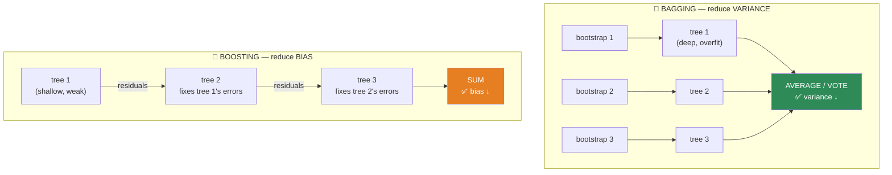
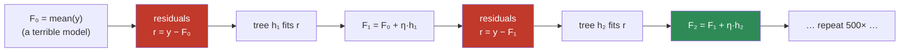
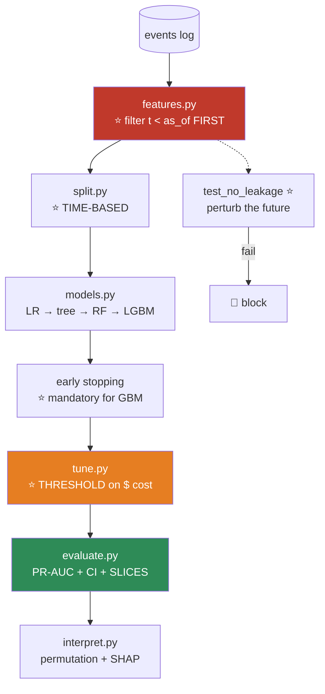

# 08.6 · Ensembles — Bagging & Boosting

[⬅ 08.5 Decision Trees](08.5-decision-trees.md) · [🏠 Module 08](../README.md) · [➡ 08.7 Support Vector Machines](08.7-svm.md)

> **The lesson in one line:** Take the worst-behaved algorithm you know — the high-variance, unstable decision tree — build hundreds of them, and combine. The result wins most tabular ML competitions on Earth, and it is the model you will actually ship.

---

## 🎯 Learning objectives

By the end of this lesson you can:

1. Explain **why averaging reduces variance** — with the actual formula, not a hand-wave.
2. Implement **bagging** and **Random Forest** from scratch.
3. Explain why Random Forest adds **feature sampling**, and what it buys.
4. Explain **boosting** as fitting the *residuals*, and implement gradient boosting from scratch.
5. State the **fundamental difference** between bagging and boosting — and when each wins.
6. Tune XGBoost/LightGBM without flailing.

---

## 🧠 Mental model

> **Bagging: many independent experts, voting. Boosting: a relay team, each runner fixing the last one's mistakes.**



| | **Bagging** | **Boosting** |
|---|---|---|
| Trees are built | **In parallel, independently** | **Sequentially, each fixing the last** |
| Base learner | **Deep** (low bias, high variance) | **Shallow** (high bias, low variance) — a "weak learner" |
| Reduces | **VARIANCE** ⭐ | **BIAS** ⭐ |
| Combines by | Averaging / voting | **Summing** (weighted) |
| Overfits? | 🟡 **Resistant** — more trees never hurts | ⚠️ **Yes** — more trees eventually hurts |
| Parallelizable | ✅ **Embarrassingly** | ❌ Sequential by nature |
| Typical accuracy | Very good | ⭐ **Usually better** |
| Tuning | Easy (few knobs) | Fiddly (many knobs) |

---

## 📐 Why does averaging work? — the actual math

**This is the whole justification, and it's four lines.**

You have $M$ models, each with variance $\sigma^2$, and their errors have pairwise correlation $\rho$. Average them. The variance of the average is:

$$\text{Var}\!\left(\frac{1}{M}\sum_{m=1}^{M} f_m\right) = \underbrace{\rho\sigma^2}_{\text{doesn't shrink}} + \underbrace{\frac{1-\rho}{M}\sigma^2}_{\text{shrinks with M}}$$

> [!IMPORTANT]
> **Read the two terms. They are the entire theory of ensembling.**
>
> - **The second term vanishes as M → ∞.** Add more models, this part of the variance disappears. Free lunch.
> - **The first term, $\rho\sigma^2$, does NOT shrink.** It's the floor. **If your models are perfectly correlated (ρ = 1), averaging does absolutely nothing** — you've just built the same model 500 times.
>
> **⭐ So the entire game is: make the models LESS CORRELATED.** That single sentence explains every design decision in Random Forest:
> - **Bootstrap sampling** → each tree sees different data → decorrelated. ✅
> - **Random feature subsets at each split** → each tree is *forced* to use different features → **decorrelated much more.** ✅✅
>
> **The bias stays the same** (the average of unbiased models is unbiased), **but the variance drops.** You get accuracy for free, and the only price is compute.
>
> **This is why ensembling works, and it is one of the few genuinely free lunches in machine learning.**

---

## 🎒 Bagging — Bootstrap Aggregating

**Bootstrap** ([06.6](../../06-Mathematics/weeks/06.6-statistics.md)): sample n examples **with replacement** from your n examples.

```python
idx = rng.choice(n, size=n, replace=True)     # some rows appear twice; some, not at all
```

> [!TIP]
> **~63.2% of the original rows appear in each bootstrap sample.**
>
> Why? The probability a given row is *never* picked in n draws is $(1 - 1/n)^n \to e^{-1} \approx 0.368$. So **36.8% are left out** — and those are called the **out-of-bag (OOB)** samples.
>
> **The OOB samples are a free validation set.** Each tree can be evaluated on the ~37% of rows it never saw. **Random Forest gives you a cross-validation estimate for free**, with no extra fitting — `oob_score=True`. **Almost nobody uses this, and it's excellent.**

---

## 🌲 Random Forest — from scratch

**Bagging + random feature subsets at each split.**

```python
import numpy as np
from collections import Counter
from scratch_tree import DecisionTreeScratch      # from 08.5


class RandomForestScratch:
    """Bagging + feature subsampling. The whole point: DECORRELATE the trees."""

    def __init__(self, n_trees=100, max_depth=None, min_samples_split=2,
                 max_features='sqrt', random_state=None):
        self.n_trees = n_trees
        self.max_depth = max_depth
        self.min_samples_split = min_samples_split
        self.max_features = max_features
        self.rng = np.random.default_rng(random_state)
        self.trees = []
        self.oob_score_ = None

    def _n_features(self, d):
        if self.max_features == 'sqrt':  return max(1, int(np.sqrt(d)))     # ⭐ classification default
        if self.max_features == 'log2':  return max(1, int(np.log2(d)))
        if isinstance(self.max_features, float): return max(1, int(self.max_features * d))
        return d

    def fit(self, X, y):
        X, y = np.asarray(X), np.asarray(y)
        n, d = X.shape
        k = self._n_features(d)
        self.trees = []
        oob_votes = [[] for _ in range(n)]                # ⭐ for the free validation set

        for t in range(self.n_trees):
            # ── 1 · BOOTSTRAP (decorrelation source #1) ──
            idx = self.rng.choice(n, size=n, replace=True)
            oob = np.setdiff1d(np.arange(n), idx)          # the ~36.8% left out

            tree = DecisionTreeScratch(max_depth=self.max_depth,
                                       min_samples_split=self.min_samples_split)

            # ── 2 · FEATURE SUBSAMPLING (decorrelation source #2 — the BIG one) ──
            #    Override the hook from 08.5: each SPLIT sees only k random features.
            rng_local = np.random.default_rng(self.rng.integers(1 << 32))
            tree._feature_subset = lambda dd, _k=k, _r=rng_local: \
                _r.choice(dd, size=min(_k, dd), replace=False)

            tree.fit(X[idx], y[idx])
            self.trees.append(tree)

            # ── 3 · OOB predictions (free validation) ──
            if len(oob):
                for i, p in zip(oob, tree.predict(X[oob])):
                    oob_votes[i].append(p)

        # OOB score: majority vote among trees that never saw each row
        preds = [Counter(v).most_common(1)[0][0] for v in oob_votes if v]
        truth = [y[i] for i, v in enumerate(oob_votes) if v]
        self.oob_score_ = np.mean(np.array(preds) == np.array(truth))
        return self

    def predict_proba(self, X):
        votes = np.array([t.predict(X) for t in self.trees])       # (n_trees, n)
        classes = np.unique(votes)
        return np.array([[np.mean(votes[:, i] == c) for c in classes]
                         for i in range(len(X))])

    def predict(self, X):
        votes = np.array([t.predict(X) for t in self.trees])       # (n_trees, n)
        return np.array([Counter(votes[:, i]).most_common(1)[0][0]
                         for i in range(votes.shape[1])])          # ⭐ MAJORITY VOTE
```

### ⭐ Verify — and see the variance reduction

```python
from sklearn.ensemble import RandomForestClassifier
from sklearn.tree import DecisionTreeClassifier
from sklearn.datasets import make_classification
from sklearn.model_selection import train_test_split

X, y = make_classification(n_samples=2000, n_features=20, n_informative=10,
                           n_redundant=5, random_state=42)
Xtr, Xte, ytr, yte = train_test_split(X, y, test_size=0.3, random_state=42)

single = DecisionTreeClassifier(random_state=42).fit(Xtr, ytr)
mine   = RandomForestScratch(n_trees=100, random_state=42).fit(Xtr, ytr)
sk     = RandomForestClassifier(n_estimators=100, oob_score=True,
                                random_state=42).fit(Xtr, ytr)

print(f"single tree : train={single.score(Xtr,ytr):.3f}  test={single.score(Xte,yte):.3f}")
print(f"my forest   :                    test={(mine.predict(Xte)==yte).mean():.3f}  oob={mine.oob_score_:.3f}")
print(f"sklearn RF  : train={sk.score(Xtr,ytr):.3f}  test={sk.score(Xte,yte):.3f}  oob={sk.oob_score_:.3f}")

# single tree : train=1.000  test=0.827      ← memorized, high variance
# my forest   :               test=0.912  oob=0.906
# sklearn RF  : train=1.000  test=0.915  oob=0.911    ← +9 points. Same base learner.
```

> [!IMPORTANT]
> **The single tree gets 100% training accuracy (memorized) and 82.7% test.** The forest of 100 *equally overfit* trees gets **91.5%**.
>
> **Nothing about the base learner changed. Each individual tree is still garbage.** The only difference is that they're **decorrelated** and averaged — and the $\frac{1-\rho}{M}\sigma^2$ term collapsed.
>
> **Also notice: `oob_score` ≈ `test score`.** You got an honest generalization estimate **for free**, without a validation set.

### Why `max_features='sqrt'`?

> [!TIP]
> **This is the single most important hyperparameter in Random Forest, and the reason it beats plain bagging.**
>
> Without feature subsampling, if one feature is **very** predictive, **every tree splits on it first** — and all your trees look nearly identical (ρ → 1), so averaging buys almost nothing.
>
> **Forcing each split to consider only √d random features means some trees are FORBIDDEN from using the dominant feature** and must find other signal. **The trees become genuinely different — ρ drops — and the variance term collapses.**
>
> **Deliberately handicapping each tree makes the forest better.** That is a genuinely counterintuitive and beautiful result, and it's Breiman's core contribution.
>
> Defaults: **`sqrt(d)` for classification, `d/3` for regression.**

---

## 🚀 Boosting — fit the residuals

**Completely different idea.** Instead of averaging independent models, **build models sequentially, each one fixing the previous ensemble's mistakes.**

### Gradient Boosting — the intuition



**Each new tree is trained on what the ensemble got *wrong* so far.**

$$F_m(x) = F_{m-1}(x) + \eta \cdot h_m(x) \qquad \text{where } h_m \text{ fits the residuals } r = y - F_{m-1}(x)$$

### ⭐ Why is it called *gradient* boosting?

**Because the residual IS the negative gradient of the squared-error loss.**

$$L = \tfrac{1}{2}(y - F(x))^2 \quad\Longrightarrow\quad -\frac{\partial L}{\partial F} = y - F(x) = \boxed{\text{the residual}}$$

> [!IMPORTANT]
> **Gradient boosting is gradient descent — in *function space* instead of parameter space.**
>
> In [08.3](08.3-linear-regression.md), you took steps in **parameter space**: $w \leftarrow w - \eta\nabla_w L$. Here you take steps in **function space**: $F \leftarrow F - \eta\nabla_F L$, and **each "step" is a whole decision tree** that approximates the negative gradient.
>
> **That reframing is the entire insight of Friedman's 2001 paper**, and it's what generalizes the algorithm: swap in **any differentiable loss** — log-loss for classification, Huber for robust regression, ranking losses for search — and just fit the trees to *that* loss's negative gradient. **Everything else is unchanged.** That's why "gradient boosting" is a *framework*, not an algorithm.

### From scratch

```python
import numpy as np
from sklearn.tree import DecisionTreeRegressor


class GradientBoostingScratch:
    """Gradient boosting for regression. ~25 lines. This is XGBoost's core."""

    def __init__(self, n_estimators=100, learning_rate=0.1, max_depth=3,
                 subsample=1.0, random_state=None):
        self.n_estimators = n_estimators
        self.lr = learning_rate
        self.max_depth = max_depth        # ⭐ SHALLOW — a "weak learner"
        self.subsample = subsample
        self.rng = np.random.default_rng(random_state)
        self.trees = []
        self.F0 = None

    def fit(self, X, y):
        X, y = np.asarray(X), np.asarray(y, dtype=float)
        n = len(y)

        self.F0 = y.mean()                            # ⭐ start with the dumbest model
        F = np.full(n, self.F0)
        self.trees = []

        for m in range(self.n_estimators):
            residuals = y - F                         # ⭐ = the NEGATIVE GRADIENT of ½(y−F)²

            # stochastic gradient boosting: fit on a random subsample
            if self.subsample < 1.0:
                idx = self.rng.choice(n, int(self.subsample * n), replace=False)
            else:
                idx = np.arange(n)

            tree = DecisionTreeRegressor(max_depth=self.max_depth)
            tree.fit(X[idx], residuals[idx])          # ⭐ fit the tree to the ERRORS

            F += self.lr * tree.predict(X)            # ⭐ take a SMALL step (shrinkage)
            self.trees.append(tree)
        return self

    def predict(self, X):
        F = np.full(len(X), self.F0)
        for tree in self.trees:
            F += self.lr * tree.predict(X)
        return F

    def staged_predict(self, X):
        """Prediction after each tree — for finding the optimal n_estimators."""
        F = np.full(len(X), self.F0)
        for tree in self.trees:
            F += self.lr * tree.predict(X)
            yield F.copy()
```

```python
from sklearn.ensemble import GradientBoostingRegressor
from sklearn.metrics import mean_squared_error

mine = GradientBoostingScratch(n_estimators=100, learning_rate=0.1, max_depth=3,
                               random_state=0).fit(Xtr, ytr)
sk   = GradientBoostingRegressor(n_estimators=100, learning_rate=0.1, max_depth=3,
                                 random_state=0).fit(Xtr, ytr)

print(f"mine   RMSE: {mean_squared_error(yte, mine.predict(Xte))**0.5:.4f}")
print(f"sklearn RMSE: {mean_squared_error(yte, sk.predict(Xte))**0.5:.4f}")
# Nearly identical. ⭐ You just wrote XGBoost's core in 25 lines.
```

### ⭐ Learning rate and n_estimators are coupled

$$\boxed{\text{learning\_rate} \times \text{n\_estimators} \approx \text{constant}}$$

| lr | n_estimators | Result |
|---|---|---|
| 0.3 | 100 | Fast, but **more overfitting** |
| **0.1** | **500** | ✅ **The standard trade** |
| 0.01 | 5000 | Best accuracy, **slow** |

> [!IMPORTANT]
> **The learning rate is called "shrinkage" here, and it's the primary regularizer.** A small lr means each tree contributes only a *little*, so the ensemble approaches the answer cautiously — and **cautious models generalize better.**
>
> **The right way to tune this: fix a small lr (0.05), set n_estimators absurdly high, and use EARLY STOPPING on a validation set.** Let the data tell you how many trees you need. This is far better than grid-searching both.

---

## ⚠️ Boosting overfits — bagging (mostly) doesn't

> [!CAUTION]
> **This is the fundamental difference, and it dictates how you tune each.**
>
> - **Random Forest:** more trees **never hurts.** The variance term $\frac{1-\rho}{M}\sigma^2$ just keeps shrinking toward the floor. **`n_estimators=500` is a safe default and you barely need to tune it.**
> - **Gradient Boosting:** more trees **eventually hurts.** Each tree is fitting the *residuals* — and once the real signal is exhausted, **it starts fitting the noise.** The validation loss makes a U-shape.
>
> **Consequence: you MUST use early stopping with boosting.** It is not optional.

```python
import lightgbm as lgb

model = lgb.LGBMClassifier(
    n_estimators=5000,          # ⭐ absurdly high — early stopping will decide
    learning_rate=0.05,
    num_leaves=31,
    subsample=0.8, colsample_bytree=0.8,
    reg_lambda=1.0,
)
model.fit(X_train, y_train,
          eval_set=[(X_val, y_val)],
          eval_metric='auc',
          callbacks=[lgb.early_stopping(50), lgb.log_evaluation(100)])   # ⭐ MANDATORY

print(f"stopped at {model.best_iteration_} trees (not 5000)")
```

---

## 🏆 The modern boosting libraries

| | **XGBoost** | **LightGBM** | **CatBoost** |
|---|---|---|---|
| Tree growth | Level-wise | ⭐ **Leaf-wise** (faster, can overfit more) | Symmetric |
| **Speed** | Fast | ⭐⭐ **Fastest** | Fast |
| **Categoricals** | ❌ Encode first | ✅ Native | ⭐⭐ **Best-in-class** |
| Missing values | ✅ Native | ✅ Native | ✅ Native |
| Overfitting | Good regularization | Needs care (`num_leaves`) | ⭐ **Most robust defaults** |
| Best for | The battle-tested default | ⭐ **Large data, speed** | ⭐ **Many categorical features** |

> [!TIP]
> **Practical advice: start with LightGBM.** It's the fastest, handles categoricals natively, and its defaults are sane. **Use CatBoost if you have lots of high-cardinality categoricals** (it has a genuinely clever ordered-target-encoding scheme that avoids the leakage from [07.5](../../07-Data-Analysis/weeks/07.5-data-cleaning.md)). **Use XGBoost if your team already does.**
>
> **The differences between them are far smaller than the difference between "tuned GBM" and "untuned anything else."** Don't agonize.

### Tuning, in priority order

| Priority | Parameter | Note |
|---|---|---|
| **1** ⭐ | **`n_estimators` via early stopping** | Not a grid search. Let the data decide |
| **2** | `learning_rate` | 0.05–0.1. Lower = better + slower |
| **3** | **`num_leaves` / `max_depth`** | ⭐ The main capacity knob. LightGBM: 31 default |
| **4** | `min_child_samples` | Prevents tiny, noisy leaves |
| **5** | `subsample`, `colsample_bytree` | 0.8 both — **stochasticity is regularization** |
| **6** | `reg_lambda`, `reg_alpha` | L2/L1 on leaf weights |

---

## 🔧 scikit-learn implementation

```python
from sklearn.ensemble import (RandomForestClassifier, ExtraTreesClassifier,
                              HistGradientBoostingClassifier, VotingClassifier,
                              StackingClassifier)

# ── Random Forest: easy, robust, hard to break ────────────────────
rf = RandomForestClassifier(
    n_estimators=500,           # ⭐ more never hurts
    max_features='sqrt',        # ⭐ THE decorrelation knob
    min_samples_leaf=1,
    oob_score=True,             # ⭐ free validation
    class_weight='balanced',
    n_jobs=-1,                  # ⭐ embarrassingly parallel
    random_state=42,
)

# ── sklearn's LightGBM-alike: fast, native NaN + categoricals ─────
gb = HistGradientBoostingClassifier(
    max_iter=1000,
    learning_rate=0.05,
    early_stopping=True,        # ⭐ MANDATORY for boosting
    validation_fraction=0.1,
    random_state=42,
)

# ── Stacking: a meta-model learns HOW to combine the base models ──
stack = StackingClassifier(
    estimators=[('rf', rf), ('gb', gb), ('lr', LogisticRegression())],
    final_estimator=LogisticRegression(),
    cv=5,                       # ⭐ out-of-fold predictions — or you LEAK
)
```

> [!WARNING]
> **Stacking leaks unless the base models' predictions are out-of-fold.** If you train a base model on all the data and then feed its predictions to the meta-model, **the meta-model sees predictions the base model made on data it memorized** — hopelessly optimistic. `cv=5` in `StackingClassifier` handles this. **If you hand-roll stacking, this is the bug you will ship.**

---

## ⚡ Performance considerations

| | Random Forest | Gradient Boosting |
|---|---|---|
| **Training** | O(M · n · d · log n), **fully parallel** ⭐ | O(M · n · d · log n), **sequential** |
| **Prediction** | O(M · depth), parallel | O(M · depth), sequential |
| **Memory** | M full trees (deep = big) | M shallow trees (**much smaller**) |
| **Model size** | 500 deep trees can be **100s of MB** ⚠️ | Usually MBs |
| **Scaling needed?** | ❌ No (it's trees) | ❌ No |
| **Tuning effort** | ✅ Low | ⚠️ High |
| **Typical accuracy** | Very good | ⭐ **Usually better** |

> [!CAUTION]
> **A 500-tree Random Forest with unlimited depth can be hundreds of megabytes.** That's a real deployment problem — it has to be loaded into every serving replica. **Boosted models are typically far smaller** (shallow trees), which is one of several quiet reasons they win in production.

---

## 🐛 Common mistakes

| Mistake | Consequence |
|---|---|
| **No early stopping with boosting** | Overfits. **The validation loss makes a U** |
| Using early stopping with RF | Pointless — more trees never hurts |
| **`max_features=None` in RF** | You've built plain bagging. **Trees are correlated; you lost most of the benefit** |
| **Shallow trees in RF** | RF wants **deep, overfit** trees (it kills variance by averaging). Boosting wants **shallow** ones |
| Deep trees in boosting | Each learner is too strong → overfits fast |
| **Tuning `n_estimators` by grid search (boosting)** | Use **early stopping**. It's free and better |
| Scaling features | **Pointless for trees** |
| Trusting `feature_importances_` | Same MDI bias as [08.5](08.5-decision-trees.md). **Use permutation/SHAP** |
| **Hand-rolling stacking without out-of-fold predictions** | **Leakage.** Wildly optimistic |
| Ignoring model size | 500 deep trees = 100s of MB in every replica |
| Not setting `n_jobs=-1` on RF | It's embarrassingly parallel and you left it on one core |

---

## 📝 Exercises

**Mathematical**
1. **Derive the variance-of-the-average formula.** Explain both terms. **What happens when ρ = 1?** *(This is the entire theory of ensembling.)*
2. Show that a bootstrap sample contains ~63.2% of the unique original rows. Where does $e^{-1}$ come from?
3. **Show that the residual $y - F(x)$ is the negative gradient of $\frac{1}{2}(y-F)^2$.** Explain why this makes gradient boosting "gradient descent in function space."
4. Why does bagging reduce variance but not bias? Why does boosting reduce bias?

**NumPy implementation**
5. Implement `RandomForestScratch`. **Verify it beats a single tree by a meaningful margin.**
6. Add **OOB scoring**. Verify `oob_score_ ≈ test score` — **you got free cross-validation.**
7. Implement `GradientBoostingScratch` for regression. **Verify against `GradientBoostingRegressor`.**
8. Extend it to **classification** using log-loss. *(Hint: the "residual" becomes $y - \sigma(F)$ — which is `predicted − actual` again, [08.4](08.4-logistic-regression.md).)*
9. Implement **stochastic** gradient boosting (`subsample=0.8`). Does it help? Why would randomness *improve* a model?

**Debugging & comparison**
10. ⭐ **Plot ensemble error vs. number of trees** for RF and GBM on the same data. **RF's curve flattens and stays flat. GBM's makes a U.** Explain both, and state what each implies for tuning.
11. ⭐ **Sweep `max_features` in RF from 1 to d.** Plot test accuracy. **Find the sweet spot.** Explain, using the ρ term, why using *all* features is *worse*.
12. Compare on the same dataset: single tree, bagging (max_features=None), Random Forest, GBM, and tuned LightGBM. **Report all five with confidence intervals.**
13. Train a GBM with `n_estimators=5000` and no early stopping. **Plot train and validation loss.** Find where validation starts rising. **That's the tree count you needed.**

---

## 🛠️ Mini project — *Customer Churn Prediction*

Build `code/08-machine-learning/churn/` — the most common commercial ML problem, done end to end.

**Requirements**
- Predict churn from a transactions log using the **as-of-date feature pipeline** from [07.4](../../07-Data-Analysis/weeks/07.4-pandas-advanced.md).
- Compare: logistic regression → single tree → Random Forest → LightGBM.
- **Time-based split** (churn is temporal — a random split leaks the future).
- **Tune the threshold on business cost**, not on F1.
- **Report PR-AUC with a bootstrap CI**, sliced by segment.

```
churn/
├── README.md              # ⭐ decision log + the FP/FN costs in currency
├── src/
│   ├── features.py       # ⭐ as_of-aware RFM + trend (07.4)
│   ├── split.py          # ⭐ TIME-BASED, not random
│   ├── models.py         # LR / tree / RF-from-scratch / LightGBM
│   ├── tune.py           # early stopping; then the THRESHOLD
│   ├── interpret.py      # permutation importance + SHAP (08.16)
│   └── evaluate.py       # PR-AUC + CI + slices + expected cost
├── tests/
│   ├── test_no_leakage.py    # ⭐ perturb the future → nothing changes
│   └── test_time_split.py    # ⭐ assert train.max_date < test.min_date
└── notebooks/
```

**Architecture**



**Implementation guidance**
1. **The leakage test is the deliverable.** Perturb a transaction *after* `as_of_date` by ×1000, rebuild features, **assert nothing changed** ([07.7](../../07-Data-Analysis/weeks/07.7-feature-engineering.md)). Put it in CI.
2. **Build the models in escalating order and report each.** You will very likely find **logistic regression gets within 2–3 points of LightGBM** — and *that's a finding worth writing down*, because the linear model is interpretable, trains in milliseconds, and is far easier to deploy ([08.3](08.3-linear-regression.md)).
3. **The threshold matters more than the model.** A false negative (a lost customer) costs ~$2,000; a false positive (an unnecessary retention call) costs ~$5. **The optimal threshold is nowhere near 0.5**, and moving it will improve business outcomes more than any model swap ([08.4](08.4-logistic-regression.md)).
4. **`interpret.py` closes the loop.** The top features will be `days_since_last_activity`, `activity_trend`, and `support_tickets_per_month` — all of which are *actionable*. **A churn model that says "call these people" is worth 100× one that just scores well.**

**Evaluation strategy:** PR-AUC with bootstrap CI (churn is imbalanced). **Sliced by tenure bucket and plan tier** — the model is probably terrible for new customers, and that's exactly the segment the growth team cares about. **Baseline: predict the base rate.** And report **expected dollar cost** at the chosen threshold, not just AUC.

**Testing plan:** `test_no_leakage` (perturb the future), `test_time_split` (assert `train.max_date < test.min_date`), `test_vs_sklearn` (your RF vs sklearn's), and `test_threshold_beats_default` (assert the tuned threshold has lower expected cost than 0.5).

**Future improvements:** add **uplift modelling** — don't predict *who will churn*, predict *who will be saved by an intervention*. Those are different people, and the difference is worth real money. (Someone who'll churn no matter what is a wasted call.)

---

## 📄 Cheat sheet

| | **Bagging / Random Forest** | **Boosting / GBM** |
|---|---|---|
| Builds trees | **Parallel, independent** | **Sequential, on residuals** |
| Base learner | **DEEP** (overfit) | **SHALLOW** (weak) |
| Reduces | **VARIANCE** | **BIAS** |
| Combine | Vote / average | **Sum** (with shrinkage η) |
| More trees | ✅ **Never hurts** | ⚠️ **Eventually overfits** |
| **Early stopping** | Unnecessary | ⭐ **MANDATORY** |
| Parallel | ✅ Embarrassingly | ❌ Sequential |
| Tuning | Easy | Fiddly |
| Free validation | ⭐ **OOB score** | — |

| Key formula | |
|---|---|
| **⭐ Variance of average** | $\rho\sigma^2 + \frac{1-\rho}{M}\sigma^2$ — **the whole game is lowering ρ** |
| **Bootstrap** | ~63.2% of rows in-bag; **36.8% OOB = free validation** |
| **Gradient boosting** | $F_m = F_{m-1} + \eta\,h_m$, where $h_m$ fits the **residuals = the negative gradient** |
| **lr × n_estimators** | ≈ constant. **Small lr + early stopping** |

**⭐ RF's key knob: `max_features='sqrt'`** — deliberately handicapping each tree **decorrelates** them and makes the forest better.
**⭐ Boosting's key discipline: `n_estimators=5000` + early stopping.** Never grid-search it.
**Libraries: LightGBM (fast, native categoricals) · CatBoost (many categoricals) · XGBoost (battle-tested).**
**Trees need no scaling. `feature_importances_` still lies — use permutation/SHAP.**

---

## 🎴 Flashcards

- **Q:** ⭐ Why does averaging models reduce variance? → **A:** $\text{Var}(\bar{f}) = \rho\sigma^2 + \frac{1-\rho}{M}\sigma^2$. **The second term vanishes as M grows; the first doesn't.** So **the entire game is making the models less correlated (lowering ρ)** — if ρ=1, averaging does nothing.
- **Q:** ⭐ How does Random Forest decorrelate its trees? → **A:** Two ways: **bootstrap sampling** (different data) and — the big one — **random feature subsets at every split** (`max_features='sqrt'`), which *forbids* some trees from using the dominant feature and forces them to find other signal.
- **Q:** ⭐ What's counterintuitive about `max_features`? → **A:** **Deliberately handicapping each individual tree makes the forest better** — because it decorrelates them, and ρ is what limits the variance reduction.
- **Q:** What is out-of-bag (OOB) scoring? → **A:** Each bootstrap leaves out **~36.8%** of rows; evaluate each tree on the rows it never saw. **A free cross-validation estimate, with no extra fitting.** `oob_score=True`. Almost nobody uses it.
- **Q:** ⭐ Why is it called *gradient* boosting? → **A:** **The residual $y - F(x)$ IS the negative gradient of $\frac{1}{2}(y-F)^2$.** So boosting is **gradient descent in function space** — each "step" is a whole tree. Swap in any differentiable loss and it still works. *That's why it's a framework, not an algorithm.*
- **Q:** ⭐ Bagging vs boosting, fundamentally? → **A:** Bagging: **parallel, independent, DEEP** trees, **averaged** → reduces **variance**. Boosting: **sequential, SHALLOW** trees fitting the previous ensemble's **residuals**, **summed** → reduces **bias**.
- **Q:** ⭐ Why is early stopping mandatory for boosting but not for RF? → **A:** **More trees never hurts RF** (the variance term just keeps shrinking). **Boosting eventually fits noise** — once the real signal is exhausted, each new tree fits the residual *noise*, and validation loss makes a **U**.
- **Q:** How do you tune `n_estimators` for a GBM? → **A:** **Don't grid-search it.** Set it absurdly high (5000), use a small learning rate, and **let early stopping decide.**
- **Q:** Relationship between learning rate and n_estimators? → **A:** **lr × n_estimators ≈ constant.** Small lr = better generalization, more trees, slower. The lr is the **primary regularizer** ("shrinkage").
- **Q:** LightGBM vs XGBoost vs CatBoost? → **A:** **LightGBM** = fastest, leaf-wise growth, native categoricals. **CatBoost** = best for many categoricals (ordered target encoding, no leakage), most robust defaults. **XGBoost** = battle-tested. **The differences are far smaller than tuned-vs-untuned.**
- **Q:** Why does hand-rolled stacking leak? → **A:** If base models are trained on all the data, the meta-model sees **predictions made on data the base models memorized** — hopelessly optimistic. **Use out-of-fold predictions** (`cv=5`).

---

## 💼 Interview questions

1. **⭐ "Why do ensembles work?"** — Give the **formula**: $\rho\sigma^2 + \frac{1-\rho}{M}\sigma^2$. Explain that the second term vanishes and the first doesn't, so **the game is decorrelation**. This is the answer that separates people who understand ensembles from people who've used them.
2. **"Bagging vs boosting?"** — Parallel/independent/deep/variance vs sequential/residuals/shallow/bias. **Then add the practical consequence: boosting needs early stopping; RF doesn't.**
3. **"How does Random Forest differ from plain bagging?"** — **Random feature subsets at each split.** Without them, one dominant feature makes every tree nearly identical (ρ→1) and averaging buys little.
4. **"Why is it called gradient boosting?"** — The **residual is the negative gradient** of squared error. It's **gradient descent in function space**, with a tree as each step. **This generalizes to any differentiable loss.**
5. **"Your GBM's validation loss is going back up. What's happening?"** — **Overfitting.** Once the signal is exhausted, new trees fit noise. **Early stopping.** (And this is a good moment to say you'd never grid-search `n_estimators`.)
6. **"Random Forest or XGBoost?"** — **XGBoost/LightGBM usually wins on accuracy**, but RF is easier to tune, parallel, gives free OOB validation, and is harder to break. **Start with LightGBM; keep RF as a robust baseline.**
7. **"Would deep learning beat gradient boosting on this tabular data?"** — **Probably not** ([08.1](08.1-what-is-ml.md)). And the GBM trains in seconds, needs no GPU, and handles missing values natively.

---

## 📚 Summary

- **⭐ Ensembles work because $\text{Var}(\bar{f}) = \rho\sigma^2 + \frac{1-\rho}{M}\sigma^2$.** The second term vanishes with more models; the first doesn't. **So the entire game is decorrelating the models.** It is one of the few genuinely free lunches in ML.
- **Bagging** trains **deep, overfit** trees **in parallel** on **bootstrap samples** and **averages** them → **reduces variance.** ~36.8% of rows are left out of each sample → **OOB = free cross-validation.**
- **⭐ Random Forest = bagging + random feature subsets at each split.** That second ingredient is the important one: **deliberately handicapping each tree decorrelates the forest and makes it better.** Without it, one dominant feature makes all your trees identical and averaging buys nothing.
- **Boosting** trains **shallow, weak** trees **sequentially**, each fitting the previous ensemble's **residuals** → **reduces bias.**
- **⭐ The residual IS the negative gradient of squared error** — so gradient boosting is **gradient descent in function space**, with a whole tree as each step. Swap the loss, and everything else still works. *That's why it's a framework.*
- **⭐ Boosting overfits; bagging doesn't.** More trees never hurts a forest; more trees eventually hurts a GBM. **Early stopping is mandatory for boosting** — set `n_estimators=5000` and let the data decide. **Never grid-search it.**
- **lr × n_estimators ≈ constant.** The learning rate is the primary regularizer ("shrinkage").
- **LightGBM is the sensible default** (fastest, native categoricals); CatBoost for many categoricals; XGBoost if your team already uses it. **The differences between them are far smaller than tuned-vs-untuned.**
- **Trees need no scaling, and `feature_importances_` still lies** — use permutation importance or SHAP ([08.16](08.16-interpretability.md)).

**Next:** [08.7 Support Vector Machines](08.7-svm.md) — back to hyperplanes, but this time we pick the *best possible one*, and then use a trick to make it curve.

---

## 🔗 References

- Breiman (1996) — *Bagging Predictors*. And Breiman (2001) — ***Random Forests***. Both short, both foundational. **The ρ argument in this lesson is Breiman's.**
- Friedman (2001) — *Greedy Function Approximation: A Gradient Boosting Machine*. **The paper that reframed boosting as gradient descent in function space.** A genuine landmark.
- Chen & Guestrin (2016) — *XGBoost: A Scalable Tree Boosting System*. The engineering that made it dominate Kaggle.
- Ke et al. (2017) — *LightGBM* — leaf-wise growth and histogram binning.
- Prokhorenkova et al. (2018) — *CatBoost* — **ordered target encoding**, which fixes the leakage from [07.5](../../07-Data-Analysis/weeks/07.5-data-cleaning.md).
- Grinsztajn et al. (2022) — *Why do tree-based models still outperform deep learning on tabular data?* — the receipts.
- [06.6 Statistics](../../06-Mathematics/weeks/06.6-statistics.md) — the bootstrap, which bagging is built on.

---

## 🧭 Navigation

| Direction | Link |
|---|---|
| ⬅ Previous | [08.5 Decision Trees](08.5-decision-trees.md) |
| ➡ Next | [08.7 Support Vector Machines](08.7-svm.md) |
| 🏠 Module | [Module 08](../README.md) |
| 🗺 Roadmap | [ROADMAP.md](../../../ROADMAP.md) |
