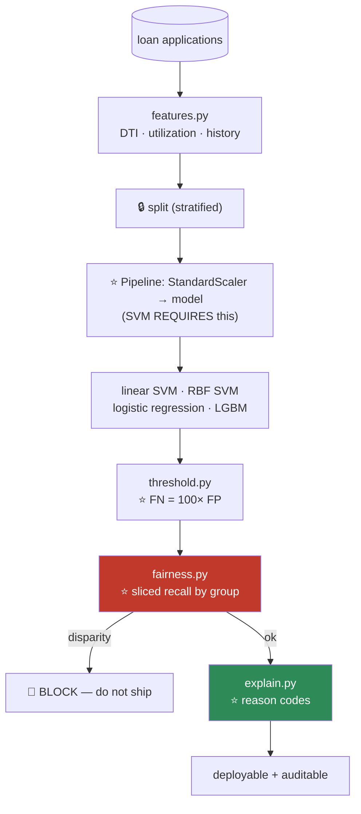

# 08.7 · Support Vector Machines

[⬅ 08.6 Ensembles](08.6-ensembles.md) · [🏠 Module 08](../README.md) · [➡ 08.8 Naive Bayes](08.8-naive-bayes.md)

> **The lesson in one line:** Of all the lines that separate your classes, pick the one with the widest safety gap — then use a trick that lets you draw curves in infinite dimensions **without ever going there**.

---

## 🎯 Learning objectives

By the end of this lesson you can:

1. Explain the **maximum margin** principle and why the widest gap generalizes best.
2. Explain what a **support vector** is — and why the other 99% of your data is irrelevant.
3. Explain **soft margins** and what `C` actually controls.
4. Explain the **kernel trick** — and why it's genuinely one of the cleverest ideas in ML.
5. Implement a linear SVM from scratch with hinge loss + SGD.
6. Know when SVMs are the right tool — and honestly, when they aren't.

---

## 🧠 Mental model

> **Don't just separate the classes. Separate them with the biggest possible safety buffer.**


Logistic regression finds *a* separating hyperplane (whichever one minimizes log-loss). **SVM finds *the* hyperplane that is as far as possible from both classes.** That's a different — and often better — objective.

> [!IMPORTANT]
> **Why does the widest margin generalize best?** **Intuition:** a boundary jammed right up against your training points is fragile — nudge the data slightly and it misclassifies. **A boundary with a wide buffer can absorb noise.** The margin is *slack for the data you haven't seen yet*.
>
> There's real theory behind this (VC dimension, structural risk minimization), but the intuition is the part you need: **maximizing the margin is a form of regularization** — it's choosing the *simplest*, most robust boundary among all the ones that work.

> 🖼️ **[IMAGE PLACEHOLDER: `assets/images/08-svm-margin.png`]**
> *A 2-D scatter of two linearly separable classes (blue circles, red squares). Panel A: three different separating lines drawn, all valid, one hugging the blue class, one hugging the red, one in the middle — annotated "all separate the data. Which is best?" Panel B: the maximum-margin hyperplane, drawn as a solid line with two parallel dashed lines forming a shaded "street" between them. The 3 points touching the dashed lines are circled and labelled **"SUPPORT VECTORS — the only points that matter."** The width of the street is annotated "margin = 2/‖w‖." Every other point is greyed out with the caption "delete these 997 points and the boundary doesn't move."*

---

## 📐 Mathematical intuition

### The hyperplane

$$\mathbf{w}^\top\mathbf{x} + b = 0$$

Same object as logistic regression's decision boundary ([08.4](08.4-logistic-regression.md)). But now we choose $\mathbf{w}$ differently.

### The margin

Label classes as $y \in \{-1, +1\}$ (not 0/1 — this makes the math beautiful). Require:

$$y_i(\mathbf{w}^\top\mathbf{x}_i + b) \geq 1 \quad \forall i$$

**Points on the boundary of that constraint** (where it equals exactly 1) are the **support vectors**. The **margin width** turns out to be:

$$\text{margin} = \frac{2}{\|\mathbf{w}\|}$$

**So maximizing the margin = minimizing $\|\mathbf{w}\|$.** The optimization becomes:

$$\boxed{\min_{\mathbf{w},b} \tfrac{1}{2}\|\mathbf{w}\|^2 \quad \text{subject to} \quad y_i(\mathbf{w}^\top\mathbf{x}_i + b) \geq 1}$$

**A convex quadratic program.** One global optimum, guaranteed.

### ⭐ Support vectors — the beautiful part

> [!IMPORTANT]
> **Only the points ON the margin determine the hyperplane. Every other point is completely irrelevant.**
>
> **Delete 997 of your 1000 training points — the ones far from the boundary — and the SVM produces the exact same model.** The solution depends *only* on the handful of support vectors.
>
> **This is genuinely remarkable, and it's the SVM's defining property.** It means the model is **sparse** (defined by a few points), **memory-efficient at inference** (you only store the SVs), and **robust to far-away outliers** — a wild point deep inside its own class has zero influence.
>
> **Contrast with logistic regression**, where *every* point contributes to the loss, so a distant point still tugs on the boundary. **Contrast with KNN** ([08.9](08.9-knn.md)), which must keep *everything*.

### Soft margin — because real data isn't separable

Perfect separation is usually impossible (and if it *is* possible, you probably have leakage). Allow violations with **slack variables** $\xi_i$:

$$\min_{\mathbf{w},b,\xi} \; \tfrac{1}{2}\|\mathbf{w}\|^2 + C\sum_{i}\xi_i \quad\text{s.t.}\quad y_i(\mathbf{w}^\top\mathbf{x}_i+b) \geq 1 - \xi_i, \;\; \xi_i \geq 0$$

**Read the trade-off:** *"make the margin wide (small ‖w‖) **and** don't violate it too much (small Σξ)."* **C sets the exchange rate.**

| `C` | Effect |
|---|---|
| **Small C** (e.g. 0.01) | ⭐ **Wide margin**, many violations tolerated → **more regularized**, may underfit |
| **Large C** (e.g. 1000) | **Narrow margin**, few violations → **fits training data hard**, may overfit |

> [!TIP]
> **`C` is an INVERSE regularization strength** — just like in [logistic regression](08.4-logistic-regression.md). **Small C = strong regularization.** Everyone gets this backwards once. **`C` is the single most important SVM hyperparameter**, and it should be tuned on a log scale: `[0.01, 0.1, 1, 10, 100]`.

### The hinge loss — the same problem, rewritten

The constrained problem is **exactly equivalent** to this unconstrained one:

$$\boxed{J = \underbrace{\frac{1}{n}\sum_i \max(0,\; 1 - y_i(\mathbf{w}^\top\mathbf{x}_i + b))}_{\text{HINGE LOSS}} + \underbrace{\lambda\|\mathbf{w}\|^2}_{\text{L2 (the margin)}}}$$

**And now it's just "a loss + a regularizer" — the same four-box template as everything else** ([08.3](08.3-linear-regression.md)). You can train it with gradient descent.

| The hinge loss | |
|---|---|
| Correctly classified **beyond** the margin ($y\cdot z \ge 1$) | **Loss = 0.** ⭐ **Zero gradient. This point contributes NOTHING** |
| Inside the margin or misclassified | Loss grows **linearly** |

> [!IMPORTANT]
> **The hinge loss's flat region IS the support-vector property.** Points comfortably on the right side get **exactly zero loss and exactly zero gradient** — so they don't move `w` at all. **The sparsity isn't a separate trick; it falls straight out of the loss function.**
>
> **Compare to log-loss** ([08.4](08.4-logistic-regression.md)), which is **never** exactly zero — a point 50 standard deviations on the correct side still contributes a tiny gradient. **That's the whole difference between SVM and logistic regression in one sentence.**

> 🖼️ **[IMAGE PLACEHOLDER: `assets/images/08-hinge-vs-logloss.png`]**
> *A single plot: the margin quantity y·z on the x-axis (−3 to +3), loss on the y-axis. Three curves: **Hinge loss** — a hockey stick, linear until y·z=1, then **exactly flat at 0** (shaded region annotated "ZERO gradient → these points are ignored → SPARSITY"). **Log-loss** — a smooth curve that decays toward 0 but **never reaches it** (annotated "always a small gradient → every point matters"). **0-1 loss** — a step function, annotated "what we actually want, but non-differentiable and NP-hard." Caption: "Hinge and log-loss are both convex surrogates for the 0-1 loss. The hinge's flat region is where support vectors come from."*

---

## 🪄 The Kernel Trick

**This is one of the cleverest ideas in machine learning, and it's worth slowing down for.**

### The problem

Your data isn't linearly separable. Concentric circles, XOR, a spiral. **A hyperplane can't do it.**

### The obvious fix (and why it's too expensive)

**Map to a higher-dimensional space where it *is* separable.** For concentric circles:

$$\phi(x_1, x_2) = (x_1,\; x_2,\; x_1^2 + x_2^2)$$

**In 3-D, the inner circle lifts up and a flat plane separates them perfectly.** (This is exactly the polynomial-features trick from [08.4](08.4-logistic-regression.md).)

**But:** a degree-3 polynomial map on 100 features gives **~176,000 dimensions**. Degree 10? Astronomically many. **You cannot compute $\phi(x)$.**

### ⭐ The trick

**Look at the SVM's dual formulation.** It turns out that **the data only ever appears inside a dot product**:

$$\text{maximize}\; \sum_i \alpha_i - \tfrac{1}{2}\sum_{i,j}\alpha_i\alpha_j y_i y_j \,\underbrace{\mathbf{x}_i^\top\mathbf{x}_j}_{\text{ONLY as a dot product!}}$$

And predictions too: $f(x) = \sum_i \alpha_i y_i \,(\mathbf{x}_i^\top\mathbf{x}) + b$.

> [!IMPORTANT]
> **⭐ THE KERNEL TRICK: you never need $\phi(x)$. You only need $\phi(x_i)^\top\phi(x_j)$ — a single NUMBER.**
>
> And for many useful $\phi$, **that number has a closed form you can compute directly in the original space, in O(d) time**, without ever constructing the high-dimensional vectors.
>
> $$K(\mathbf{x}_i, \mathbf{x}_j) = \phi(\mathbf{x}_i)^\top\phi(\mathbf{x}_j)$$
>
> **So you get all the power of an enormously high-dimensional feature space for the cost of a dot product in the original one.** For the **RBF kernel, $\phi$ maps into an INFINITE-dimensional space** — and you compute the inner product with one exponential.
>
> **You are working in infinite dimensions and it costs you almost nothing.** That is a genuinely astonishing piece of mathematics, and it made SVMs the dominant algorithm of the 2000s.

### The kernels

| Kernel | $K(x, x')$ | Feature space | Use |
|---|---|---|---|
| **Linear** | $x^\top x'$ | The original | ✅ **High-dim data (text!), n large.** Start here |
| **Polynomial** | $(\gamma x^\top x' + r)^d$ | Degree-d monomials | Interaction effects |
| **⭐ RBF (Gaussian)** | $\exp(-\gamma\|x - x'\|^2)$ | **INFINITE** | ✅ **The default.** Smooth, flexible |
| Sigmoid | $\tanh(\gamma x^\top x' + r)$ | — | Rarely; not always a valid kernel |

**The RBF kernel's intuition:** $K(x,x')$ is a **similarity score that decays with distance**. It's ~1 when the points are close and ~0 when far apart. **The SVM's prediction becomes a weighted vote of the support vectors, weighted by how similar the test point is to each.** That's why it can carve arbitrary shapes.

| `gamma` (RBF) | Effect |
|---|---|
| **Small γ** | Wide influence → **smooth**, simple boundary → may underfit |
| **Large γ** | Narrow influence → **wiggly** boundary that wraps each point → **overfits** |

> [!CAUTION]
> **`gamma` and `C` interact, and you must tune them together.** Large γ + large C = a boundary that wraps individually around every training point (a perfect memorizer). **Always grid-search them jointly on a log scale:**
> ```python
> param_grid = {'svc__C': [0.1, 1, 10, 100], 'svc__gamma': [0.001, 0.01, 0.1, 1]}
> ```

> 🖼️ **[IMAGE PLACEHOLDER: `assets/images/08-svm-kernels.png`]**
> *A 2×3 grid on the same "two concentric rings" dataset. Top row (kernels): **Linear** — a straight line slicing uselessly through both rings, "❌ impossible." **Polynomial (d=3)** — a curved boundary, mostly working. **RBF** — a clean circular boundary, "✅ perfect." Bottom row (RBF gamma sweep on the same data): **γ=0.01** — an almost-straight, underfit boundary. **γ=1** — a clean circle, "✅ just right." **γ=100** — a boundary with tiny islands wrapped around each individual training point, "❌ MEMORIZED. Train acc 100%, test acc 61%." Support vectors circled in each panel.*

---

## 🐍 NumPy implementation — linear SVM from scratch

**We implement the hinge-loss + SGD form** (this is what `LinearSVC`/`SGDClassifier` do). *(The full dual QP with kernels is a substantial solver — SMO — and is beyond scope; the hinge form is what teaches you the idea.)*

```python
import numpy as np


class LinearSVMScratch:
    """Linear SVM via hinge loss + L2, trained with SGD.
       Same four boxes as always — only the LOSS changed."""

    def __init__(self, lr=0.001, lambda_=0.01, n_iters=1000, random_state=None):
        self.lr = lr
        self.lambda_ = lambda_          # ⭐ λ ≈ 1/(C·n)
        self.n_iters = n_iters
        self.rng = np.random.default_rng(random_state)
        self.w = None
        self.b = 0.0

    def fit(self, X, y):
        X = np.asarray(X, dtype=float)
        y_ = np.where(np.asarray(y) <= 0, -1, 1)      # ⭐ labels must be {-1, +1}
        n, d = X.shape
        self.w = np.zeros(d)
        self.b = 0.0

        for it in range(self.n_iters):
            for i in self.rng.permutation(n):          # SGD: one sample at a time
                margin = y_[i] * (X[i] @ self.w + self.b)

                if margin >= 1:
                    # ⭐ CORRECTLY classified beyond the margin.
                    #    Hinge loss = 0 → NO gradient from this point.
                    #    Only the regularizer pulls.  ← THIS IS THE SUPPORT-VECTOR PROPERTY
                    self.w -= self.lr * (2 * self.lambda_ * self.w)
                else:
                    # Inside the margin or misclassified → it IS a support vector
                    self.w -= self.lr * (2 * self.lambda_ * self.w - y_[i] * X[i])
                    self.b -= self.lr * (-y_[i])
        return self

    def decision_function(self, X):
        return np.asarray(X) @ self.w + self.b

    def predict(self, X):
        return np.where(self.decision_function(X) >= 0, 1, 0)

    def support_vector_mask(self, X, y):
        """Which points actually determine the boundary?"""
        y_ = np.where(np.asarray(y) <= 0, -1, 1)
        return y_ * self.decision_function(X) < 1 + 1e-6
```

### ⭐ Verify — and see the sparsity

```python
from sklearn.svm import LinearSVC, SVC
from sklearn.datasets import make_blobs
from sklearn.preprocessing import StandardScaler

X, y = make_blobs(n_samples=500, centers=2, cluster_std=1.5, random_state=42)
X = StandardScaler().fit_transform(X)        # ⭐ SVM REQUIRES scaling — see below

mine = LinearSVMScratch(lr=0.01, lambda_=0.01, n_iters=200, random_state=0).fit(X, y)
sk   = LinearSVC(C=1.0, dual='auto', max_iter=10000).fit(X, y)
svc  = SVC(kernel='linear', C=1.0).fit(X, y)

print(f"mine    accuracy: {(mine.predict(X) == y).mean():.3f}")
print(f"LinearSVC       : {sk.score(X, y):.3f}")

# ⭐ THE SPARSITY — the whole point of SVMs
print(f"\ntraining points   : {len(X)}")
print(f"support vectors   : {svc.n_support_.sum()}   ({svc.n_support_.sum()/len(X):.1%})")
print(f"my SV estimate    : {mine.support_vector_mask(X, y).sum()}")
# training points   : 500
# support vectors   : 6     (1.2%)   ← 494 points are IRRELEVANT
```

> [!IMPORTANT]
> **6 support vectors out of 500.** Delete the other 494 and retrain — **you get the identical boundary.** That's the SVM's defining property, and seeing it in a print statement is when it becomes real.

---

## 🔧 scikit-learn implementation

```python
from sklearn.svm import SVC, LinearSVC, SVR
from sklearn.pipeline import Pipeline
from sklearn.preprocessing import StandardScaler
from sklearn.model_selection import GridSearchCV

# ⭐ SCALING IS MANDATORY — not optional. See below.
pipe = Pipeline([
    ('scale', StandardScaler()),
    ('svc',   SVC(kernel='rbf', C=1.0, gamma='scale', probability=False)),
])

# ⭐ C and gamma MUST be tuned jointly, on a LOG scale
grid = GridSearchCV(pipe,
    {'svc__C':     [0.1, 1, 10, 100],
     'svc__gamma': [0.001, 0.01, 0.1, 1]},
    cv=5, scoring='f1', n_jobs=-1)
grid.fit(X_train, y_train)
print(grid.best_params_)

print(f"support vectors: {grid.best_estimator_['svc'].n_support_}")
```

| Estimator | Use |
|---|---|
| **`SVC(kernel='rbf')`** | ⭐ The classic. **O(n²)–O(n³) — dies above ~50k samples** |
| **`LinearSVC`** | ⭐ **Linear kernel, but O(n)-ish.** Scales to large n |
| `SGDClassifier(loss='hinge')` | Linear SVM via SGD — **for huge n** |
| `SVR` | Regression (ε-insensitive tube) |
| **`NuSVC`** | `nu` = an upper bound on the *fraction* of margin errors — sometimes more intuitive than C |

> [!CAUTION]
> **`SVC(probability=True)` is expensive and often poorly calibrated.** It runs an internal 5-fold cross-validation to fit a Platt-scaling sigmoid — so **your training time multiplies by 5**. **SVMs don't produce probabilities natively** (they output a signed distance, not a probability). If you need calibrated probabilities, **use logistic regression** — or wrap the SVM in `CalibratedClassifierCV`, but ask yourself why you're doing this.

---

## ⚠️ SCALING IS NOT OPTIONAL

> [!CAUTION]
> **An unscaled SVM is not "an SVM with a quirk." It is a broken model.**
>
> The RBF kernel is $\exp(-\gamma\|x - x'\|^2)$ — it's built on **Euclidean distance**. If `income` ∈ [0, 1e6] and `age` ∈ [0, 100], then **income dominates the distance completely** and the model is effectively blind to age.
>
> The margin $2/\|w\|$ and the L2 penalty are likewise scale-dependent.
>
> **This is the #1 reason people conclude "SVMs don't work."** They do. You just fed them unscaled data. **Always put a `StandardScaler` in the pipeline.**

---

## ⚡ Performance considerations

| | Complexity |
|---|---|
| **Training (`SVC`, kernel)** | **O(n²)–O(n³)** ⚠️ — the kernel matrix is n×n |
| **Training (`LinearSVC`/SGD)** | O(n·d) — **scales** |
| **Prediction (kernel)** | **O(n_SV · d)** — proportional to the number of **support vectors** |
| **Memory (kernel)** | O(n²) for the kernel matrix ⚠️ |
| **Scaling required?** | ⭐ **YES. Mandatory** |

> [!WARNING]
> **The n² kernel matrix is the SVM's death sentence at scale.** At n = 100,000, the kernel matrix is **10¹⁰ entries = 80 GB**. It does not fit. **Kernel SVMs are effectively unusable above ~50,000 samples**, and that single fact is why they lost their crown to gradient boosting and deep learning.
>
> **In 2026: for n > 50k, use `LinearSVC`, `SGDClassifier(loss='hinge')`, or just use a GBM.**

---

## 🎯 SVM vs Logistic Regression — the honest comparison

| | **SVM** | **Logistic Regression** |
|---|---|---|
| Loss | **Hinge** (flat past the margin) | **Log-loss** (never flat) |
| Uses | ⭐ **Only support vectors** | **All** points |
| Output | Signed distance | ⭐ **A calibrated probability** |
| Nonlinear | ⭐ **Kernel trick** (elegant, free) | Manual polynomial features |
| Scales to large n | ❌ (kernel) | ✅ |
| Interpretable | 🟡 (linear only) | ⭐ **Odds ratios** |
| Robust to outliers far from the boundary | ✅ **Ignores them entirely** | 🟡 They still tug |

> [!TIP]
> **When is an SVM actually the right choice in 2026?**
>
> ✅ **Small-to-medium n (< 50k) with a clear margin.** ✅ **High-dimensional data where d > n** — **text classification is the classic case**, and a **linear SVM on TF-IDF is still a genuinely strong baseline** ([08.8](08.8-naive-bayes.md)). ✅ When you need a **non-linear boundary and n is small** — the kernel trick is more elegant than hand-building polynomial features.
>
> ❌ **Large n** (the n² wall). ❌ **When you need probabilities.** ❌ **When you need interpretability.** ❌ **Most tabular problems** — where **gradient boosting simply beats it**, trains faster, handles missing values, and needs no scaling.
>
> **Honest summary: SVMs were the king of the 2000s and are now a specialist tool.** Learn them for the **kernel trick** (which is genuinely beautiful and reappears in Gaussian processes and kernel methods generally), for **text**, and because they come up in interviews. **Don't reach for them by default.**

---

## 🐛 Common mistakes

| Mistake | Consequence |
|---|---|
| **Not scaling** | ⭐ **The model is broken.** The largest-scale feature dominates the distance |
| **Forgetting `C` is INVERSE** | You regularize harder when you meant to relax |
| Tuning C and gamma separately | **They interact.** Grid them jointly, on a log scale |
| Kernel SVM on n=500,000 | **O(n²) memory.** It will never finish |
| `probability=True` | **5× training time**, and poorly calibrated. Use logistic regression |
| Expecting probabilities natively | It outputs a **signed distance**, not a probability |
| Using RBF when linear would do | On high-dim text, **linear is usually better AND faster** |
| Not checking `n_support_` | If nearly all points are SVs, **your C is too small** (or the data is hopeless) |

---

## 📝 Exercises

**Mathematical**
1. Show that the margin width is $2/\|\mathbf{w}\|$. **Therefore maximizing the margin = minimizing $\|\mathbf{w}\|$.**
2. Write the hinge loss. **Show that it's exactly zero for correctly-classified points beyond the margin** — and explain how that produces the support-vector property.
3. Show that the SVM objective is **convex**. What does that guarantee?
4. **Explain the kernel trick in your own words.** Why is $\phi(x)$ never needed? Why can the RBF kernel work in infinite dimensions?
5. Verify that the polynomial kernel $(x^\top x' + 1)^2$ on 2-D input corresponds to an explicit 6-dimensional feature map. **Write $\phi$ out.**

**NumPy implementation**
6. Implement `LinearSVMScratch`. **Verify against `LinearSVC`.**
7. ⭐ **Print the support vectors.** Confirm they're a small fraction of the data. **Then delete all non-support-vectors, retrain, and verify the boundary is identical.** *(This is the exercise that makes SVMs click.)*
8. Implement the RBF kernel and compute the kernel matrix for 100 points. **Check its memory footprint.** Now extrapolate to n = 100,000. **How many GB?**
9. Implement a kernelized SVM prediction (given the α's from sklearn) using only kernel evaluations. Verify it matches `decision_function`.

**Debugging & visualization**
10. ⭐ **Train on UNSCALED data** where one feature is 1000× larger. Report accuracy. Now scale. **Report the difference.** *(This is the #1 SVM failure mode.)*
11. Plot the decision boundary and margin for a linear SVM on 2-D blobs. **Circle the support vectors.**
12. ⭐ **Sweep `gamma`** for RBF on concentric circles: 0.001, 0.1, 1, 10, 100. **Plot all five boundaries.** Identify underfitting and the memorization regime.
13. Sweep `C` from 0.001 to 1000. Plot train and test accuracy, **and the number of support vectors.** Explain the relationship. *(Small C → wide margin → MORE support vectors.)*

**Comparison**
14. On text (TF-IDF, d ≫ n): compare **linear SVM, RBF SVM, logistic regression, and LightGBM.** Report accuracy **and training time.** **Explain why linear wins.**
15. Time `SVC(kernel='rbf')` on n = 1k, 5k, 20k, 50k. **Plot time vs n on a log-log axis.** Confirm the slope is ~2.

---

## 🛠️ Mini project — *Credit Risk Classification*

Build `code/08-machine-learning/credit-risk/` — a high-stakes, imbalanced, **explainability-mandated** problem.

**Requirements**
- Predict loan default. **Heavily imbalanced** (~5–10% default).
- Compare: **linear SVM, RBF SVM, logistic regression, LightGBM.**
- **Interpretability is a legal requirement** — you must be able to state *why* a loan was denied.
- **Cost-sensitive**: a false negative (a bad loan approved) costs **~100×** a false positive.
- **Fairness check**: evaluate performance sliced by protected attributes and their **proxies**.

```
credit-risk/
├── README.md              # ⭐ decision log + the FAIRNESS AUDIT
├── src/
│   ├── data.py           # load; PII handling (07.1)
│   ├── features.py       # DTI ratio, utilization, credit history length
│   ├── scratch.py        # ⭐ LinearSVMScratch
│   ├── models.py         # linear SVM / RBF SVM / LR / LGBM
│   ├── threshold.py      # ⭐ FN costs 100× FP
│   ├── fairness.py       # ⭐ sliced metrics; proxy detection
│   └── explain.py        # ⭐ per-decision reason codes
├── tests/
│   ├── test_scaling.py       # ⭐ assert SVM pipeline scales
│   └── test_fairness.py      # ⭐ assert no group's recall is < 80% of the best
└── notebooks/
```

**Architecture**



**Implementation guidance**
1. **The `StandardScaler` must be inside the pipeline**, or the SVM is broken *and* you leak ([07.11](../../07-Data-Analysis/weeks/07.11-pipelines.md)). Write `test_scaling.py` to assert it's there.
2. **⭐ `fairness.py` is the most important file, and it is not optional in this domain.** Slice recall and false-positive rate by every protected attribute you can access — **and by their proxies** (zip code strongly proxies race; [07.6](../../07-Data-Analysis/weeks/07.6-eda.md)). **Removing the race column does not remove race from your model.** If one group's recall is dramatically worse, **that is a finding you must act on**, and shipping anyway is a decision with legal and moral consequences. **Make the test fail the build.**
3. **`explain.py` — this is where the model choice gets decided.** Credit decisions legally require an explanation ("adverse action notice"). **A linear model gives you one for free** (the coefficients × the feature values are literally the reason codes). **An RBF SVM gives you nothing.** So: even if the RBF SVM scores 1% higher, **you may be legally unable to ship it** — and discovering that constraint *before* you build is exactly what [08.1](08.1-what-is-ml.md)'s framing questions are for.
4. **The threshold dominates.** FN = 100× FP means you should reject loans far more eagerly than 0.5 suggests. **Compute the expected-dollar-cost-optimal threshold and report the saving.**

**Evaluation strategy:** **PR-AUC** with bootstrap CI (imbalanced). **Expected dollar cost** at the chosen threshold. **Recall at fixed precision.** **Sliced by every demographic group** — and report the *worst* group's number, not just the average.

**Testing plan:** `test_scaling.py`, `test_fairness.py` (**fails the build on disparity**), `test_vs_sklearn.py`, and `test_explanation_exists` (assert every prediction can produce reason codes).

**Future improvements:** add **reject inference** (you never observe the outcome for rejected applicants — a genuine survivorship-bias problem, and a beautiful example of [07.12](../../07-Data-Analysis/weeks/07.12-case-studies.md)'s traps).

---

## 📄 Cheat sheet

| | |
|---|---|
| **Objective** | Maximize the **margin** = minimize $\frac{1}{2}\|w\|^2$ s.t. $y_i(w^\top x_i + b) \ge 1$ |
| **Margin width** | $2/\|w\|$ |
| **⭐ Support vectors** | The **only** points that matter. Delete the rest → **same model** |
| **Hinge loss** | $\max(0, 1 - y\cdot z)$ — **exactly ZERO past the margin** ⭐ (→ sparsity) |
| **Soft margin** | $+ C\sum\xi_i$ — allow violations |
| **`C`** | ⭐ **INVERSE regularization.** Small C = wide margin, more regularized |
| **⭐ Kernel trick** | Data appears **only in dot products** → replace $x^\top x'$ with $K(x,x')$ → **infinite dimensions, O(d) cost** |
| **RBF** | $\exp(-\gamma\|x-x'\|^2)$ — infinite-dim, **the default** |
| **`gamma`** | Small = smooth/underfit · **Large = wiggly/memorize** |

| Complexity | |
|---|---|
| Kernel SVM training | **O(n²)–O(n³)** ⚠️ **Dies above ~50k** |
| LinearSVC / SGD | O(n·d) ✅ |
| Prediction | O(n_SV · d) |

**⭐⭐ SCALING IS MANDATORY.** The RBF kernel is built on Euclidean distance.
**Tune `C` and `gamma` JOINTLY, on a log scale.**
**No native probabilities.** `probability=True` costs 5× and is poorly calibrated.
**In 2026: use for text (d≫n) and small-n non-linear problems. Otherwise, GBM.**

---

## 🎴 Flashcards

- **Q:** ⭐ What does an SVM optimize? → **A:** The **maximum margin** — the widest possible buffer between the classes. Formally: minimize $\frac{1}{2}\|w\|^2$ subject to $y_i(w^\top x_i + b) \ge 1$. **Maximizing the margin is a form of regularization** — it picks the most robust boundary.
- **Q:** ⭐ What is a support vector, and why does it matter? → **A:** A point **on or inside the margin**. **They are the ONLY points that determine the hyperplane** — delete all the others and you get the identical model. The SVM is **sparse**, memory-efficient at inference, and **ignores outliers far from the boundary**.
- **Q:** ⭐ Where does the sparsity come from? → **A:** **The hinge loss is exactly ZERO** for points correctly classified beyond the margin → **zero gradient** → they don't move `w` at all. **Compare log-loss, which is never exactly zero, so every point tugs on the boundary.** *That one difference is the whole distinction between SVM and logistic regression.*
- **Q:** ⭐⭐ Explain the kernel trick. → **A:** In the dual, **the data appears only inside dot products**. So replace $x_i^\top x_j$ with $K(x_i,x_j) = \phi(x_i)^\top\phi(x_j)$ — **a single number you can compute in O(d) without ever constructing $\phi(x)$.** For RBF, $\phi$ maps into **infinite dimensions** and you compute the inner product with one exponential. **Infinite-dimensional power at the cost of a dot product.**
- **Q:** What does `C` control? → **A:** **INVERSE regularization.** Small C = **wide margin**, tolerate violations, more regularized. Large C = narrow margin, fit hard, overfit.
- **Q:** What does `gamma` control (RBF)? → **A:** The **width of each point's influence.** Small γ = smooth boundary (underfit). **Large γ = the boundary wraps around individual points (memorization).** Tune it **jointly with C**, on a log scale.
- **Q:** ⭐ Why is scaling mandatory for SVMs? → **A:** The RBF kernel is $\exp(-\gamma\|x-x'\|^2)$ — **built on Euclidean distance.** An unscaled feature with a 1000× larger range **dominates the distance completely**, and the model is blind to everything else. **This is the #1 reason people think "SVMs don't work."**
- **Q:** Why can't kernel SVMs scale? → **A:** The **kernel matrix is n×n** — O(n²)–O(n³). At n=100,000 that's **80 GB**. **Effectively unusable above ~50k samples**, which is why they lost to GBMs and deep learning.
- **Q:** Do SVMs output probabilities? → **A:** **No** — a **signed distance**. `probability=True` runs an internal 5-fold CV to fit Platt scaling: **5× the training time, and poorly calibrated.** Use logistic regression if you need probabilities.
- **Q:** When is an SVM still the right choice? → **A:** **Text/high-dimensional data (d ≫ n)** — a **linear SVM on TF-IDF is still a strong baseline** — and small-n non-linear problems. **Not for large n, not when you need probabilities or interpretability, and not for most tabular data** (GBM wins).

---

## 💼 Interview questions

1. **⭐ "Explain the kernel trick."** — The data appears **only in dot products**, so you can replace the dot product with a kernel function that **implicitly computes an inner product in a high- (or infinite-) dimensional space**, without ever constructing the mapping. **This is a favourite question and the "only in dot products" observation is the key.**
2. **"What's a support vector?"** — The points on/inside the margin — **the only ones that determine the boundary.** Delete the rest, get the same model. **Then explain that this falls out of the hinge loss being exactly zero elsewhere.**
3. **"SVM vs logistic regression?"** — Hinge (sparse, only SVs matter) vs log-loss (every point contributes, gives **calibrated probabilities**). SVM has the kernel trick; LR gives odds ratios and scales. **SVM ignores far-away outliers; LR doesn't.**
4. **"What do C and gamma do?"** — C: inverse regularization (small = wide margin). Gamma: influence width (large = wiggly/memorize). **They interact — tune jointly on a log scale.**
5. **"Why do SVMs need feature scaling?"** — The kernel is built on **Euclidean distance**; the largest-scale feature dominates it. **An unscaled SVM is a broken model, not a suboptimal one.**
6. **"Would you use an SVM on 1 million rows?"** — **No** — the kernel matrix is O(n²). Use `LinearSVC`, `SGDClassifier(loss='hinge')`, or **just use a GBM.**
7. **"When would you still choose an SVM in 2026?"** — **Text (d ≫ n)** and small-n non-linear problems. Being able to say *"honestly, rarely — GBM usually wins"* is a sign of judgement, not ignorance.

---

## 📚 Summary

- **An SVM finds the maximum-margin hyperplane** — the widest possible safety buffer between the classes. **Maximizing the margin is regularization**: it picks the most robust boundary among all the ones that work.
- **⭐ Only the support vectors matter.** Delete the other 99% of your training data and the model is identical. **This sparsity falls straight out of the hinge loss**, which is **exactly zero** for points comfortably on the correct side (log-loss is *never* zero — that's the whole difference between the two algorithms).
- **`C` is an inverse regularization strength**: small C = wide margin, more violations tolerated, more regularized.
- **⭐⭐ The kernel trick:** the data appears **only inside dot products**, so you can swap $x^\top x'$ for $K(x, x')$ and **implicitly work in a high- or infinite-dimensional space at the cost of an O(d) computation.** The **RBF kernel operates in infinite dimensions and costs one exponential.** It is one of the most elegant ideas in machine learning.
- **`gamma` controls influence width** — large gamma wraps the boundary around individual points (memorization). **Tune `C` and `gamma` jointly, on a log scale.**
- **⭐ Scaling is mandatory, not optional.** The kernel is built on Euclidean distance; an unscaled feature dominates it. **This is the #1 reason people conclude "SVMs don't work."**
- **Kernel SVMs are O(n²) and die above ~50k samples.** That single fact is why they lost their 2000s crown to gradient boosting and deep learning.
- **In 2026, use SVMs for text (d ≫ n) — where a linear SVM on TF-IDF remains a strong baseline — and for small-n non-linear problems.** For most tabular work, **use a GBM.** Learn the kernel trick anyway: it's beautiful, it reappears everywhere, and it comes up in interviews.

**Next:** [08.8 Naive Bayes](08.8-naive-bayes.md) — an algorithm built on an assumption that is *obviously false*, which works anyway, and whose reason for working teaches you something profound.

---

## 🔗 References

- Cortes & Vapnik (1995) — *Support-Vector Networks*. The paper. Remarkably readable.
- Hastie et al. — *ESL*, Ch. 12. The rigorous treatment of the margin, the dual, and kernels.
- Burges (1998) — *A Tutorial on Support Vector Machines for Pattern Recognition* — **still the best SVM tutorial ever written.**
- Platt (1998) — *Sequential Minimal Optimization* (**SMO**) — the algorithm inside `libsvm`, and how the dual QP is actually solved.
- Schölkopf & Smola — *Learning with Kernels* — for when you want to go deep on kernel methods generally.
- scikit-learn — [SVM docs](https://scikit-learn.org/stable/modules/svm.html), and note their **prominent warning about scaling.**

---

## 🧭 Navigation

| Direction | Link |
|---|---|
| ⬅ Previous | [08.6 Ensembles](08.6-ensembles.md) |
| ➡ Next | [08.8 Naive Bayes](08.8-naive-bayes.md) |
| 🏠 Module | [Module 08](../README.md) |
| 🗺 Roadmap | [ROADMAP.md](../../../ROADMAP.md) |
