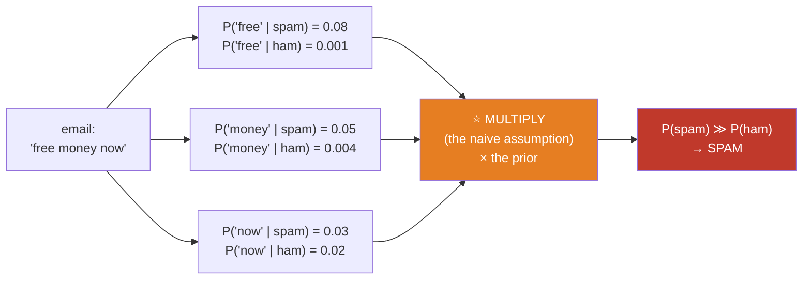
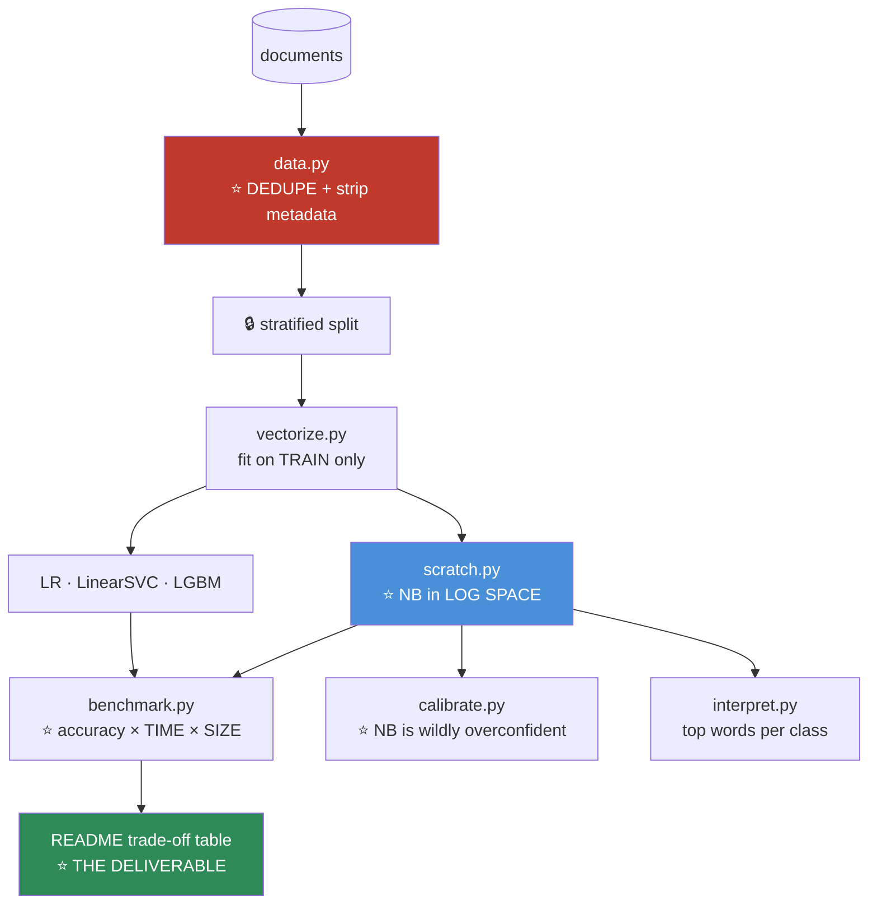

# 08.8 · Naive Bayes

[⬅ 08.7 Support Vector Machines](08.7-svm.md) · [🏠 Module 08](../README.md) · [➡ 08.9 K-Nearest Neighbors](08.9-knn.md)

> **The lesson in one line:** Assume every feature is independent — which is *obviously, laughably false* — and yet you get a classifier that trains in one pass, needs almost no data, and dominated spam filtering for a decade. **Understanding *why* a false assumption produces a good model is the real lesson.**

---

## 🎯 Learning objectives

By the end of this lesson you can:

1. Derive Naive Bayes from **Bayes' theorem** and the **naive assumption**.
2. Explain **why the false independence assumption doesn't ruin classification** — a deep and transferable insight.
3. Implement **Multinomial Naive Bayes** from scratch for text.
4. Explain **Laplace smoothing** and why without it a single unseen word gives you probability zero.
5. Explain why you **must work in log space** — and connect it to [06.9](../../06-Mathematics/weeks/06.9-numerical-computing.md).
6. Know when Naive Bayes is still the right call.

---

## 🧠 Mental model

> **"How likely is this email to be spam? Well — how surprising would each of its words be, if it *were* spam?"**



**Count words. Multiply probabilities. Compare. Done.** It is the simplest algorithm in this module and it is genuinely useful.

---

## 📐 Mathematical intuition

### Start with Bayes' theorem ([06.5](../../06-Mathematics/weeks/06.5-probability.md))

$$P(y \mid \mathbf{x}) = \frac{P(\mathbf{x} \mid y)\,P(y)}{P(\mathbf{x})}$$

$$\underbrace{P(y\mid\mathbf{x})}_{\text{posterior}} \propto \underbrace{P(\mathbf{x}\mid y)}_{\text{likelihood}} \cdot \underbrace{P(y)}_{\text{prior}}$$

**We can drop $P(\mathbf{x})$** — it's the same for every class, so it doesn't affect which class wins the argmax.

### The problem

$P(\mathbf{x} \mid y) = P(x_1, x_2, \dots, x_d \mid y)$ is a **joint distribution over all d features**. For 1,000 binary features, that's $2^{1000}$ parameters. **You will never have enough data to estimate it.**

### ⭐ The naive assumption

**Assume the features are conditionally independent given the class:**

$$P(x_1,\dots,x_d \mid y) \approx \prod_{j=1}^{d} P(x_j \mid y)$$

**And the whole thing collapses to something you can actually compute:**

$$\boxed{\hat{y} = \arg\max_y \; P(y) \prod_{j=1}^{d} P(x_j \mid y)}$$

**$2^{1000}$ parameters became $2 \times 1000$.** You can estimate each $P(x_j \mid y)$ by **just counting**.

### ⭐ The assumption is false — spectacularly so

**"New" and "York" are not independent.** "Free" and "money" co-occur. "Machine" and "learning". The assumption is violated in **every document ever written**.

> [!IMPORTANT]
> **So why does it work?**
>
> **Because for classification, you only need the RANKING of the classes to be correct — not the probabilities themselves.**
>
> Naive Bayes produces **wildly miscalibrated** probabilities. It will confidently tell you a document is spam with probability **0.99999999**, because it multiplied 200 correlated word-probabilities as if they were independent, **double-counting the same evidence over and over.** The number is nonsense.
>
> **But the correct class is still on top.** And `argmax` doesn't care by how much.
>
> **⭐ This is one of the deepest and most transferable lessons in machine learning: a model can be badly wrong about the world and still be useful for the decision you actually need to make.** Hold onto it. It applies far beyond Naive Bayes — it's why "all models are wrong, some are useful" is more than a slogan.

> [!CAUTION]
> **The corollary: never use Naive Bayes' `predict_proba()` as a probability.** It is not calibrated and it is not close. Use it for ranking, use `predict()` for the class — but if you need an honest probability, **use logistic regression** ([08.4](08.4-logistic-regression.md)) or wrap it in `CalibratedClassifierCV`.

---

## 🔢 The three variants

| Variant | For | $P(x_j \mid y)$ modelled as |
|---|---|---|
| **Multinomial** ⭐ | **Counts** (word frequencies) | A multinomial — *"how often does word j appear in class y?"* |
| **Bernoulli** | Binary (word present/absent) | Bernoulli — also models **absence** as evidence |
| **Gaussian** | Continuous features | A Gaussian per (feature, class): $\mathcal{N}(\mu_{jy}, \sigma^2_{jy})$ |

**Multinomial is the one you'll use.** It's what made spam filtering work.

---

## ⚠️ Two things that will break your implementation

### 1 · Zero probabilities — and Laplace smoothing

> [!CAUTION]
> **The zero-frequency catastrophe.** Suppose the word `"cryptocurrency"` never appeared in your spam training set. Then $P(\text{cryptocurrency} \mid \text{spam}) = 0$.
>
> Now a spam email contains it. **The entire product becomes ZERO:**
> $$P(\text{spam}) \times 0.08 \times 0.05 \times \mathbf{0} \times 0.03 \times \dots = \mathbf{0}$$
>
> **One unseen word vetoes all the other evidence.** The email could contain "free money viagra winner claim prize" — **it doesn't matter. The product is zero.**

**The fix: Laplace (add-α) smoothing.** Pretend you saw every word α extra times:

$$P(x_j \mid y) = \frac{\text{count}(x_j, y) + \alpha}{\text{count}(y) + \alpha \cdot |V|}$$

with $\alpha = 1$ typically ("add-one smoothing"), and $|V|$ the vocabulary size.

> [!TIP]
> **Laplace smoothing is a prior in disguise** ([06.5](../../06-Mathematics/weeks/06.5-probability.md)). You're saying *"before seeing any data, I believe every word has a small chance of appearing in every class."* **It's a Bayesian prior, and α controls its strength.** That's a lovely example of the same idea (regularization) wearing a different hat again — and it's the same shape as Ridge adding $\lambda I$ ([08.3](08.3-linear-regression.md)).

### 2 · ⭐ Underflow — you MUST work in log space

> [!CAUTION]
> **Multiply 200 word-probabilities, each ~0.001, and you get $10^{-600}$ — which underflows to EXACTLY ZERO in float64** ([06.9](../../06-Mathematics/weeks/06.9-numerical-computing.md)).
>
> **Every class gets probability 0. The argmax is meaningless.**

**The fix — take logs.** Products become sums:

$$\log P(y \mid \mathbf{x}) \propto \log P(y) + \sum_{j=1}^{d} \log P(x_j \mid y)$$

> [!IMPORTANT]
> **This is exactly the lesson from [06.9](../../06-Mathematics/weeks/06.9-numerical-computing.md): `log(∏p) = Σ log(p)`.** Products of many probabilities underflow; sums of logs don't.
>
> **Every NLP system, every language model, every HMM, and every graphical model does this.** It isn't an optimization — **it's the difference between a working implementation and one that returns zeros.** If you take one implementation habit from this lesson, take this one.

---

## 🐍 NumPy implementation — Multinomial Naive Bayes from scratch

```python
import numpy as np


class MultinomialNBScratch:
    """Multinomial Naive Bayes. Trains in ONE PASS. ~30 lines."""

    def __init__(self, alpha=1.0):
        self.alpha = alpha                 # ⭐ Laplace smoothing
        self.classes_ = None
        self.log_prior_ = None             # log P(y)
        self.log_likelihood_ = None        # log P(word_j | y)   shape (n_classes, n_features)

    def fit(self, X, y):
        """X: (n, vocab) count matrix. y: (n,) class labels."""
        X = np.asarray(X, dtype=np.float64)
        y = np.asarray(y)
        self.classes_ = np.unique(y)
        n, d = X.shape
        n_classes = len(self.classes_)

        self.log_prior_      = np.zeros(n_classes)
        self.log_likelihood_ = np.zeros((n_classes, d))

        for i, c in enumerate(self.classes_):
            X_c = X[y == c]                                  # all docs of this class

            # ── PRIOR: how common is this class? ──
            self.log_prior_[i] = np.log(len(X_c) / n)        # ⭐ log space from the start

            # ── LIKELIHOOD: word counts, with Laplace smoothing ──
            word_counts  = X_c.sum(axis=0) + self.alpha      # ⭐ +α  → never zero
            total_counts = word_counts.sum()                 # includes the α·|V| mass
            self.log_likelihood_[i] = np.log(word_counts / total_counts)

        return self                                          # ⭐ ONE PASS. No iteration. Done.

    def predict_log_proba(self, X):
        """⭐ log P(y) + Σ_j count_j · log P(word_j | y)  — a single matmul!"""
        X = np.asarray(X, dtype=np.float64)
        return X @ self.log_likelihood_.T + self.log_prior_   # (n, n_classes)

    def predict(self, X):
        return self.classes_[np.argmax(self.predict_log_proba(X), axis=1)]

    def predict_proba(self, X):
        """⚠️ These are NOT calibrated. Use for ranking only."""
        log_p = self.predict_log_proba(X)
        log_p -= log_p.max(axis=1, keepdims=True)             # ⭐ stability (06.9)
        p = np.exp(log_p)
        return p / p.sum(axis=1, keepdims=True)
```

> [!IMPORTANT]
> **Look at `predict_log_proba`. The entire prediction is `X @ log_likelihood.T + log_prior` — ONE MATRIX MULTIPLICATION.**
>
> Because we're in log space, "multiply the probabilities of the words that appear" becomes "**sum the log-probabilities, weighted by the counts**" — which is exactly a dot product ([06.2](../../06-Mathematics/weeks/06.2-linear-algebra-vectors-matrices.md)).
>
> **Naive Bayes is a linear classifier in log space.** That's a genuinely nice realization, and it explains why it's so fast: prediction is a single matmul, and training is a single `sum(axis=0)`.

### ⭐ Verify against sklearn

```python
import numpy as np
from sklearn.naive_bayes import MultinomialNB
from sklearn.feature_extraction.text import CountVectorizer
from sklearn.datasets import fetch_20newsgroups
from sklearn.model_selection import train_test_split

cats = ['sci.space', 'rec.sport.hockey', 'talk.politics.guns']
data = fetch_20newsgroups(subset='train', categories=cats,
                          remove=('headers', 'footers', 'quotes'))   # ⭐ remove the leaks!

vec = CountVectorizer(min_df=2, stop_words='english')
X = vec.fit_transform(data.data).toarray()
y = data.target
Xtr, Xte, ytr, yte = train_test_split(X, y, test_size=0.3, random_state=42)

mine = MultinomialNBScratch(alpha=1.0).fit(Xtr, ytr)
sk   = MultinomialNB(alpha=1.0).fit(Xtr, ytr)

print(f"mine   : {(mine.predict(Xte) == yte).mean():.4f}")
print(f"sklearn: {sk.score(Xte, yte):.4f}")
print(f"identical predictions: {np.array_equal(mine.predict(Xte), sk.predict(Xte))}")   # True ✅
print(f"log-probs match: {np.allclose(mine.predict_log_proba(Xte), sk.predict_log_proba(Xte) + np.log(sk.predict_proba(Xte).sum(1, keepdims=True)), atol=1e-6)}")
```

> [!CAUTION]
> **`remove=('headers','footers','quotes')` is not cosmetic — it's a leakage fix.** The 20-newsgroups headers contain the **newsgroup name itself**. Without removing them, a classifier achieves ~99% accuracy by reading the answer out of the metadata — the exact **metadata leakage** from [07.12](../../07-Data-Analysis/weeks/07.12-case-studies.md). **This dataset is a famous trap, and countless tutorials fall into it.**

---

## 🔧 scikit-learn implementation

```python
from sklearn.naive_bayes import MultinomialNB, BernoulliNB, GaussianNB, ComplementNB
from sklearn.feature_extraction.text import TfidfVectorizer
from sklearn.pipeline import Pipeline
from sklearn.model_selection import GridSearchCV

pipe = Pipeline([
    ('tfidf', TfidfVectorizer(ngram_range=(1,2), min_df=2,
                              sublinear_tf=True, stop_words='english')),
    ('nb',    MultinomialNB(alpha=1.0)),          # ⭐ alpha is the ONLY real knob
])

grid = GridSearchCV(pipe, {'nb__alpha': [0.01, 0.1, 0.5, 1.0, 2.0]},
                    cv=5, scoring='f1_macro')
grid.fit(texts_train, y_train)
print(f"best alpha: {grid.best_params_}")

# ⭐ Interpretability: which words most indicate each class?
nb  = grid.best_estimator_['nb']
vec = grid.best_estimator_['tfidf']
names = np.array(vec.get_feature_names_out())
for i, c in enumerate(nb.classes_):
    top = np.argsort(nb.feature_log_prob_[i])[-15:][::-1]
    print(f"\n{c}: {', '.join(names[top])}")
```

| Variant | Use |
|---|---|
| **`MultinomialNB`** | ⭐ **Text, counts.** The default |
| `BernoulliNB` | Binary features. **Also uses word *absence* as evidence** — sometimes better on short texts |
| `GaussianNB` | Continuous features. ⚠️ Assumes each feature is normally distributed *within each class* |
| **`ComplementNB`** | ⭐ **Better for imbalanced text.** An underrated fix |

> [!TIP]
> **TF-IDF + MultinomialNB is technically a bit incoherent** (multinomial assumes integer counts; TF-IDF gives floats), **but it works better in practice than raw counts** and everyone does it. **This is a case where the theory quietly loses to the empirics** — worth knowing, and worth not being precious about.

---

## ⚡ Performance considerations

| | Complexity |
|---|---|
| **Training** | ⭐ **O(n · d) — ONE PASS.** No iteration, no optimization, no convergence |
| **Prediction** | **O(d · n_classes)** — one matmul |
| **Memory** | O(d · n_classes) — a table of log-probabilities |
| **Online learning** | ✅ **`partial_fit`** — just update the counts. **Genuinely streaming** |
| Scaling needed? | ❌ No |

> [!IMPORTANT]
> **Naive Bayes is absurdly fast — and it is the only algorithm in this module that trains in a single pass with no optimization at all.** No gradients, no iterations, no learning rate, no convergence criterion. **Just count things.**
>
> This makes it the ideal **baseline**: it trains on a million documents in seconds, so **you can always afford to run it**, and it gives you a number to beat before you spend an hour on anything else.

---

## 🎯 Strengths & weaknesses

| ✅ Strengths | ❌ Weaknesses |
|---|---|
| **Blazingly fast** — one pass, no iteration | **Independence assumption is false** |
| **Works with very little data** ⭐ | **Probabilities are badly miscalibrated** |
| Naturally handles **many classes** | Can't learn **feature interactions** at all |
| Handles **high dimensions** (d ≫ n) well | Beaten by LR/SVM/GBM when you have enough data |
| **Online/streaming** (`partial_fit`) | **GaussianNB's normality assumption** is usually wrong |
| Interpretable (top words per class) | Correlated features → **double-counted evidence** |
| **No hyperparameters** except α | |

> [!TIP]
> **Naive Bayes' real superpower is performance in the low-data regime.** With 100 labeled examples, Naive Bayes will often beat logistic regression, an SVM, and a GBM — because it makes a **strong assumption** (high bias, low variance), and **when data is scarce, a strong assumption beats a flexible model that overfits** ([08.2](08.2-ml-workflow.md)).
>
> **This is the bias–variance tradeoff being useful rather than being a problem.** As data grows, the flexible models overtake it — because their variance falls and NB's *bias* (the false assumption) doesn't go anywhere.
>
> **Learning curve intuition:** NB starts high and flattens fast. LR starts lower and keeps climbing. **They cross.** Where they cross depends on your problem — and plotting it is a genuinely useful thing to do ([08.2](08.2-ml-workflow.md)).

---

## 🐛 Common mistakes

| Mistake | Consequence |
|---|---|
| **No smoothing** | ⭐ **One unseen word → probability ZERO.** All other evidence vetoed |
| **Not working in log space** | ⭐ **Underflow to zero.** Every class gets P=0; argmax is meaningless |
| **Trusting `predict_proba()`** | **Badly miscalibrated** (0.99999999 is meaningless). Use for ranking only |
| Using `GaussianNB` on skewed features | The normality assumption is violated. Try `log1p` first |
| **Fitting the vectorizer on all data** | **Leakage** — the vocabulary is a fitted parameter ([07.7](../../07-Data-Analysis/weeks/07.7-feature-engineering.md)) |
| **Not removing 20-newsgroups headers** | **Metadata leakage.** The newsgroup name is in the header |
| Not deduplicating text | Duplicates straddling the split → memorization ([07.12](../../07-Data-Analysis/weeks/07.12-case-studies.md)) |
| Expecting it to learn interactions | **It structurally cannot.** That's the naive assumption |
| Dismissing it as "too simple" | **It's your fastest baseline and often wins on small data** |

---

## 📝 Exercises

**Mathematical**
1. **Derive Naive Bayes from Bayes' theorem.** State precisely where the naive assumption enters and what it buys you (count the parameters before and after).
2. Why can you drop $P(\mathbf{x})$ from the denominator?
3. **Compute a spam classification by hand.** Given priors P(spam)=0.4 and word likelihoods, classify "free money now". **Do it once in probability space and once in log space** — and note which one you'd trust for a 200-word email.
4. Show that a single zero likelihood makes the entire product zero. **Then show how Laplace smoothing fixes it.**
5. **Show that Naive Bayes is a linear classifier in log space.** (Hint: look at `X @ log_likelihood.T + log_prior`.)
6. Explain why the false independence assumption **doesn't** ruin classification. **What does it ruin?**

**NumPy implementation**
7. Implement `MultinomialNBScratch`. **Verify `np.array_equal(mine.predict(X), sklearn.predict(X))`.**
8. **Remove the smoothing** (α=0). Find a test document containing a word not in the training vocabulary. **Observe the zero.** Explain.
9. **Remove the log space** (multiply raw probabilities). Classify a 200-word document. **Observe the underflow to 0.** Print the intermediate product to see it die.
10. Implement `GaussianNB` from scratch. Verify against sklearn.
11. Implement `partial_fit` (online learning) — update the counts incrementally. **Verify the result equals a full batch fit.**

**Comparison & debugging**
12. ⭐ **Plot a learning curve** for Naive Bayes vs logistic regression on text, from 50 to 5,000 training documents. **Find where they cross.** Explain using bias–variance.
13. **Test the calibration.** Plot a reliability diagram for NB's `predict_proba` vs logistic regression's. **NB will be wildly overconfident.** Explain why (hint: correlated words = double-counted evidence).
14. On 20-newsgroups, train **with and without** `remove=('headers','footers','quotes')`. **Report both accuracies.** Explain the gap.
15. Compare NB, logistic regression, linear SVM, and LightGBM on text. **Report accuracy AND training time.** Discuss.

---

## 🛠️ Mini project — *Text Classification Baseline Suite*

Build `code/08-machine-learning/text-baseline/` — the suite you'll reach for every time someone hands you a text classification problem.

**Requirements**
- Classify documents (news topics, sentiment, or support tickets).
- **Naive Bayes from scratch**, verified against sklearn.
- Escalating baselines: **NB → logistic regression → linear SVM → LightGBM → (optionally) a Transformer**.
- **Report accuracy AND training time AND model size** for each. Make the trade-off explicit.
- **Deduplicate before splitting.** **Fit vectorizers on train only.**

```
text-baseline/
├── README.md              # ⭐ the trade-off table is the deliverable
├── src/
│   ├── data.py           # ⭐ DEDUPLICATE (07.12); strip metadata leaks
│   ├── vectorize.py      # counts / TF-IDF — fit on TRAIN only
│   ├── scratch.py        # ⭐ MultinomialNBScratch (log space!)
│   ├── models.py         # NB / LR / LinearSVC / LGBM
│   ├── calibrate.py      # ⭐ reliability diagrams — show NB is overconfident
│   ├── interpret.py      # top words per class
│   └── benchmark.py      # ⭐ accuracy × time × model size
├── tests/
│   ├── test_vs_sklearn.py
│   ├── test_smoothing.py     # ⭐ assert α=0 produces a zero probability
│   ├── test_log_space.py     # ⭐ assert the naive product underflows
│   └── test_no_dupes.py      # ⭐ no text in both train and test
└── notebooks/
```

**Architecture**



**Implementation guidance**
1. **The trade-off table is the deliverable, not the accuracy.** Something like: *"NB: 0.87 accuracy, 0.3s training, 2 MB. LightGBM: 0.91, 240s, 45 MB. A fine-tuned Transformer: 0.93, 40 min on a GPU, 440 MB."* **Then ask: is +6 points worth 8,000× the training time and a GPU dependency?** **Frequently the answer is no**, and being the person who *measures* that rather than assuming it is worth a great deal.
2. **`test_smoothing.py` and `test_log_space.py` are tests that assert the FAILURE modes.** Set α=0 and assert some test document gets probability exactly 0. Multiply raw probabilities for a 200-word doc and assert it underflows. **Testing that your bug reproduces is what makes the fix meaningful rather than superstitious.**
3. **`calibrate.py` makes the miscalibration visible.** Plot a reliability diagram: NB's "0.99 confident" predictions will be right maybe 85% of the time. **Seeing that gap is what stops you ever trusting `predict_proba` from a Naive Bayes model.**
4. **Deduplicate first.** Real text corpora are 5–15% duplicates, and a random split puts identical text in train and test ([07.12](../../07-Data-Analysis/weeks/07.12-case-studies.md)).

**Evaluation strategy:** macro-F1 (fair across classes) with a bootstrap CI; per-class confusion matrix; and **the benchmark table (accuracy × time × size)** — which is what a senior engineer would actually want to see.

**Testing plan:** as above, plus `test_vectorizer_fit_on_train_only` (assert the vocabulary doesn't change when the test set changes).

**Future improvements:** add **ComplementNB** for imbalanced classes; add **character n-grams** (catches `fr33`); and add the **learning-curve crossover plot** showing exactly how much data you need before logistic regression overtakes Naive Bayes.

---

## 📄 Cheat sheet

| | |
|---|---|
| **Bayes** | $P(y\mid x) \propto P(x\mid y)P(y)$ |
| **⭐ The naive assumption** | $P(x_1..x_d\mid y) \approx \prod_j P(x_j\mid y)$ — **obviously false, works anyway** |
| **Prediction** | $\hat{y} = \arg\max_y \;\log P(y) + \sum_j \log P(x_j\mid y)$ |
| **⭐ LOG SPACE** | **Mandatory.** Products of 200 probabilities **underflow to 0** |
| **⭐ Laplace smoothing** | $\frac{\text{count} + \alpha}{\text{total} + \alpha\lvert V\rvert}$ — **without it, one unseen word → P = 0** |
| **It's a linear classifier** | Prediction = `X @ log_likelihood.T + log_prior` — one matmul |
| **Training** | ⭐ **ONE PASS. O(nd). No optimization at all** |
| **Prediction** | O(d · n_classes) |

| Variant | For |
|---|---|
| **MultinomialNB** ⭐ | Text / counts |
| BernoulliNB | Binary (also uses *absence* as evidence) |
| GaussianNB | Continuous (assumes normality — usually wrong) |
| **ComplementNB** | ⭐ Imbalanced text |

**⭐ Why the false assumption works: classification only needs the correct RANKING, not calibrated probabilities.**
**⚠️ `predict_proba()` is badly miscalibrated. Ranking only.**
**✅ Best in the LOW-DATA regime** — a strong assumption (high bias, low variance) beats a flexible model that overfits.
**✅ Your fastest baseline. Always run it.**

---

## 🎴 Flashcards

- **Q:** ⭐ What is the "naive" assumption, and what does it buy? → **A:** Features are **conditionally independent given the class**, so $P(x_1..x_d|y) = \prod_j P(x_j|y)$. It reduces $2^{1000}$ parameters to $2\times1000$ — **estimable by just counting**.
- **Q:** ⭐⭐ The assumption is obviously false. Why does it still work? → **A:** **Classification only needs the correct RANKING of classes, not calibrated probabilities.** NB's probabilities are wildly wrong (it double-counts correlated evidence), but **the right class is still on top, and `argmax` doesn't care by how much.** *A model can be badly wrong about the world and still useful for the decision you need.*
- **Q:** What does the false assumption ruin? → **A:** **The probabilities.** They're badly miscalibrated (0.99999999 means nothing). **Never use NB's `predict_proba` as a probability** — use it for ranking only.
- **Q:** ⭐ Why is Laplace smoothing essential? → **A:** Without it, a **single word unseen in training gives P = 0**, which **zeroes the entire product** — vetoing all the other evidence. Add α to every count. *(It's a Bayesian prior in disguise.)*
- **Q:** ⭐ Why must Naive Bayes work in log space? → **A:** Multiplying 200 probabilities of ~0.001 gives $10^{-600}$, which **underflows to exactly zero** in float64. **`log(∏p) = Σ log(p)`** — products become sums, and underflow becomes impossible.
- **Q:** What kind of classifier is Naive Bayes, structurally? → **A:** **A linear classifier in log space.** Prediction is `X @ log_likelihood.T + log_prior` — **one matrix multiplication.**
- **Q:** How fast is training? → **A:** ⭐ **One pass, O(nd), no optimization at all.** No gradients, no iterations, no learning rate, no convergence. **Just count things.** That's why it's the ideal baseline.
- **Q:** ⭐ When does Naive Bayes beat more sophisticated models? → **A:** **In the low-data regime.** Its strong assumption = **high bias, low variance** — and when data is scarce, a strong assumption beats a flexible model that overfits. As data grows, LR/SVM/GBM overtake it, because their variance falls while **NB's bias doesn't go anywhere.**
- **Q:** Which NB variant for text? → **A:** **MultinomialNB** (counts). `BernoulliNB` for binary presence/absence (also uses *absence* as evidence). **`ComplementNB` for imbalanced text.**
- **Q:** What's the famous leak in 20-newsgroups? → **A:** The **headers contain the newsgroup name.** Without `remove=('headers','footers','quotes')` you get ~99% accuracy by reading the answer from the metadata. **Classic metadata leakage.**

---

## 💼 Interview questions

1. **⭐ "Naive Bayes assumes independence, which is obviously false. Why does it work?"** — **The best question in this lesson.** Classification needs the correct **ranking**, not calibrated probabilities. NB's probabilities are garbage; the argmax is still right. **Then say what it *does* ruin: the probabilities.**
2. **"What is Laplace smoothing and why do you need it?"** — Without it, **one unseen word gives P=0 and zeroes the whole product**, vetoing all other evidence. It's also **a Bayesian prior**.
3. **"Why work in log space?"** — Products of hundreds of small probabilities **underflow to zero**. `log(∏p) = Σlog(p)`. **Every NLP system does this.**
4. **"When would you use Naive Bayes over logistic regression?"** — **Very little labeled data** (its high bias / low variance wins), **very high dimensions**, **when you need a baseline in 3 seconds**, or **when you need online/streaming updates**.
5. **"Can you trust Naive Bayes' probabilities?"** — **No.** Badly miscalibrated — correlated features mean the same evidence is counted repeatedly. Use logistic regression, or calibrate.
6. **"How would you build a spam filter today?"** — Start with **NB as a baseline** (3 seconds), then TF-IDF + logistic regression (interpretable, gives odds ratios per word). **Then measure whether a Transformer's extra points justify 1000× the compute** — and be willing to say no.

---

## 📚 Summary

- **Naive Bayes = Bayes' theorem + the assumption that features are conditionally independent given the class.** That assumption collapses an impossible joint distribution into a product you can estimate **by counting**.
- **⭐ The assumption is spectacularly false — and it works anyway, because classification only needs the correct RANKING, not calibrated probabilities.** The right class stays on top even though the numbers are nonsense. **This is one of the most transferable lessons in ML: a model can be badly wrong about the world and still be useful for the decision you actually need.**
- **The corollary: never trust NB's `predict_proba`.** It double-counts correlated evidence and is wildly overconfident.
- **⭐ Two things will break your implementation:** **no smoothing** (one unseen word → P=0 → the entire product is vetoed) and **not working in log space** (200 multiplied probabilities → underflow to exactly zero). **Laplace smoothing and `Σ log p` are both mandatory.**
- **Naive Bayes is a linear classifier in log space** — prediction is a single matmul.
- **It trains in ONE PASS with no optimization at all** — no gradients, no iterations, no learning rate. **Just count.** That makes it the baseline you can always afford to run.
- **⭐ Its real superpower is the low-data regime**: a strong assumption means high bias and *low variance*, and **when data is scarce, that beats a flexible model that overfits.** As data grows, the flexible models overtake it — because their variance falls and NB's bias doesn't.

**Next:** [08.9 K-Nearest Neighbors](08.9-knn.md) — an algorithm with *no* training phase at all, which is both its charm and its downfall.

---

## 🔗 References

- Manning, Raghavan & Schütze — *Introduction to Information Retrieval*, Ch. 13 (free online). **The definitive treatment of Naive Bayes for text**, including smoothing and the log-space argument.
- Domingos & Pazzani (1997) — *On the Optimality of the Simple Bayesian Classifier under Zero-One Loss*. **The paper that explains why the false assumption doesn't ruin classification.** Read it — it's the rigorous version of this lesson's central point.
- Rennie et al. (2003) — *Tackling the Poor Assumptions of Naive Bayes Text Classifiers* — where **ComplementNB** comes from.
- Zhang (2004) — *The Optimality of Naive Bayes* — more theory on the same puzzle.
- scikit-learn — [Naive Bayes docs](https://scikit-learn.org/stable/modules/naive_bayes.html), which are refreshingly honest about the calibration problem.
- [06.5 Probability](../../06-Mathematics/weeks/06.5-probability.md) — Bayes' theorem, priors, and the base-rate lesson.
- [06.9 Numerical Computing](../../06-Mathematics/weeks/06.9-numerical-computing.md) — why products of probabilities underflow.

---

## 🧭 Navigation

| Direction | Link |
|---|---|
| ⬅ Previous | [08.7 Support Vector Machines](08.7-svm.md) |
| ➡ Next | [08.9 K-Nearest Neighbors](08.9-knn.md) |
| 🏠 Module | [Module 08](../README.md) |
| 🗺 Roadmap | [ROADMAP.md](../../../ROADMAP.md) |
