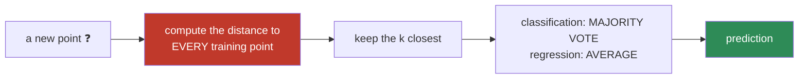
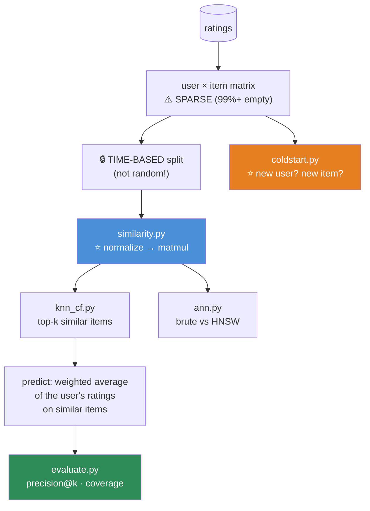

# 08.9 · K-Nearest Neighbors

[⬅ 08.8 Naive Bayes](08.8-naive-bayes.md) · [🏠 Module 08](../README.md) · [➡ 08.10 Clustering](08.10-clustering.md)

> **The lesson in one line:** Don't learn anything — just remember everything, and when asked, look up the most similar examples and copy their answer. It's the laziest algorithm in machine learning, and it's the algorithm underneath every RAG system you will ever build.

---

## 🎯 Learning objectives

By the end of this lesson you can:

1. Explain KNN as a **lazy learner** — and why "no training" has a brutal price at inference.
2. Choose a **distance metric**, and know when Euclidean is wrong.
3. Explain **why scaling is mandatory** — and see it break without it.
4. Explain the **curse of dimensionality** — and why it should terrify you.
5. Implement KNN from scratch, brute-force and with a KD-tree.
6. **Connect KNN to vector search and RAG** — because they are the same algorithm.

---

## 🧠 Mental model

> **"Show me your five nearest neighbors and I'll tell you who you are."**



**There is no model.** No weights, no tree, no boundary. **The training data *is* the model.**

| | KNN | Everything else in this module |
|---|---|---|
| **Training** | ⭐ **O(1) — just store the data** | Fit parameters (slow) |
| **Prediction** | ⚠️ **O(n · d) — scan EVERYTHING** | O(d) or O(depth) (fast) |
| Called | **Lazy** / instance-based / non-parametric | Eager |

> [!IMPORTANT]
> **KNN inverts the usual cost structure, and that's the whole story of the algorithm.** Every other model does expensive work *once* (training) so that prediction is cheap. **KNN does nothing up front and pays for it on every single query.**
>
> **That is a catastrophic trade for production**, where you train once and predict a billion times ([08.1](08.1-what-is-ml.md)). **It's why KNN is rarely shipped as a classifier — and yet the exact same computation, under a different name, powers every vector database on Earth.**

---

## 📐 Distance metrics

**KNN is nothing but a distance function plus a vote. So the distance function IS the model.**

| Metric | Formula | Use |
|---|---|---|
| **Euclidean (L2)** | $\sqrt{\sum(x_i - y_i)^2}$ | ✅ The default. Continuous, similar scales |
| **Manhattan (L1)** | $\sum\lvert x_i - y_i\rvert$ | ⭐ **More robust in high dimensions**; grid-like data |
| **Minkowski** | $(\sum\lvert x_i-y_i\rvert^p)^{1/p}$ | Generalizes both (p=2 → L2, p=1 → L1) |
| **⭐ Cosine** | $1 - \frac{x\cdot y}{\|x\|\|y\|}$ | ⭐⭐ **Text, embeddings, RAG.** Ignores magnitude ([06.2](../../06-Mathematics/weeks/06.2-linear-algebra-vectors-matrices.md)) |
| **Hamming** | # of differing positions | Binary / categorical |
| Mahalanobis | Accounts for feature covariance | Correlated features |

> [!IMPORTANT]
> **Cosine distance is the one that matters for your career.** In [06.2](../../06-Mathematics/weeks/06.2-linear-algebra-vectors-matrices.md) you learned the dot product measures **alignment**, and cosine divides out magnitude. **For text embeddings, magnitude tracks document length, not meaning** — so Euclidean distance would rank a long document as "different" from a short one saying the same thing.
>
> **Every RAG retriever, every semantic search engine, every recommender is doing cosine-KNN over embeddings.** ([08.11](08.11-dimensionality-reduction.md), [Module 13](../../13-RAG/README.md))
>
> **And the production trick from [06.2](../../06-Mathematics/weeks/06.2-linear-algebra-vectors-matrices.md):** normalize the vectors once, offline — then **cosine similarity IS the dot product**, and the whole search collapses into a single matmul.

---

## ⚠️ SCALING IS MANDATORY

> [!CAUTION]
> **KNN without scaling is not a suboptimal model. It is a broken one.**
>
> ```
> age:    25 vs 30      → difference = 5
> income: 50,000 vs 55,000 → difference = 5,000
>
> Euclidean distance = √(5² + 5000²) = 5000.0025
> ```
>
> **The income term contributes 99.9999% of the distance.** The model is **completely blind to age.** You have, in effect, a 1-feature model, and you didn't choose which feature.
>
> **Any feature measured in larger units silently becomes the only feature that matters.** This is the #1 KNN failure mode, and it produces a model that runs, returns predictions, and is quietly garbage — the classic **silent bug** from [07.1](../../07-Data-Analysis/weeks/07.1-data-lifecycle.md).
>
> **`StandardScaler` (or `MinMaxScaler`). In the pipeline. Always.**

---

## 🌀 The Curse of Dimensionality

**This is the deepest idea in the lesson, and it's genuinely unsettling.**

> [!CAUTION]
> **In high dimensions, EVERYTHING is far away from everything else — and all distances become nearly equal.**
>
> As $d \to \infty$:
> $$\frac{\text{dist}_{\max} - \text{dist}_{\min}}{\text{dist}_{\min}} \to 0$$
>
> **The nearest neighbor and the farthest neighbor become indistinguishable.** And when "nearest" is meaningless, **KNN is meaningless** — it's voting among points that aren't actually similar to your query in any useful sense.

```python
import numpy as np
rng = np.random.default_rng(0)

print(f"{'dim':>6} {'min dist':>10} {'max dist':>10} {'ratio':>8}")
for d in [2, 10, 100, 1000, 10000]:
    X = rng.normal(size=(1000, d))
    q = rng.normal(size=d)
    dists = np.linalg.norm(X - q, axis=1)
    print(f"{d:>6} {dists.min():>10.2f} {dists.max():>10.2f} "
          f"{dists.max()/dists.min():>8.2f}")

#    dim   min dist   max dist    ratio
#      2       0.05       4.31    86.20   ← "near" and "far" are VERY different
#     10       1.55       7.02     4.53
#    100      10.83      17.24     1.59
#   1000      39.23      48.19     1.23
#  10000     134.66     146.15     1.09   ← ⚠️ everything is basically EQUIDISTANT
```

**Look at the ratio column collapse toward 1.** At d=10,000, the closest point is only 9% closer than the farthest one. **"Nearest neighbor" has stopped meaning anything.**

> [!IMPORTANT]
> **Why does this happen?** Intuition: in high dimensions, **almost all of the volume of a hypercube is in its corners**, and points are overwhelmingly likely to be far apart along *at least a few* dimensions. Distance is a sum over d terms, and by the law of large numbers that sum **concentrates** — every pair of random points ends up with nearly the same total.
>
> **This curse afflicts every distance-based method** — KNN, K-Means ([08.10](08.10-clustering.md)), RBF SVMs ([08.7](08.7-svm.md)), and vector search.

**What to do about it:**

| Fix | Note |
|---|---|
| **Dimensionality reduction** (PCA/UMAP) | ⭐ [08.11](08.11-dimensionality-reduction.md) |
| **Feature selection** | Drop the noise dimensions |
| **Manhattan (L1) over Euclidean** | Degrades **more slowly** in high d |
| **Learned embeddings** | ⭐ **The real answer** — see below |
| Use a different algorithm | Trees and linear models don't care about distance |

> [!TIP]
> **⭐ So why does RAG work at all, if embeddings are 768- or 1536-dimensional?**
>
> **Because learned embeddings are not random points in 768-D.** They live on a **low-dimensional manifold** inside that space — the model was *trained* to put semantically similar things close together and dissimilar things far apart. **The intrinsic dimensionality is far lower than 768.**
>
> **The curse applies to random high-dimensional data, not to structured, learned representations.** That is precisely what makes embeddings valuable — and it's a beautiful example of the curse being **defeated by learning the right space to measure distance in.** ([08.11](08.11-dimensionality-reduction.md), [Module 13](../../13-RAG/README.md))

---

## 🐍 NumPy implementation — from scratch

```python
import numpy as np
from collections import Counter


class KNNScratch:
    """K-Nearest Neighbors. There is no training. The data IS the model."""

    def __init__(self, k=5, metric='euclidean', weights='uniform'):
        self.k = k
        self.metric = metric
        self.weights = weights          # 'uniform' or 'distance'
        self.X_train = None
        self.y_train = None

    def fit(self, X, y):
        # ⭐ "TRAINING": just remember everything. O(1).
        self.X_train = np.asarray(X, dtype=float)
        self.y_train = np.asarray(y)
        return self

    def _distances(self, X):
        """(n_test, n_train) matrix of distances."""
        X = np.asarray(X, dtype=float)

        if self.metric == 'euclidean':
            # ⭐ VECTORIZED via the expansion ‖a−b‖² = ‖a‖² − 2a·b + ‖b‖²
            #    (a single matmul — never loop!)  (06.2, 07.2)
            a2 = np.sum(X**2, axis=1, keepdims=True)              # (n_test, 1)
            b2 = np.sum(self.X_train**2, axis=1)                  # (n_train,)
            d2 = a2 - 2 * (X @ self.X_train.T) + b2               # broadcast → (n_test, n_train)
            return np.sqrt(np.maximum(d2, 0))                     # ⭐ clamp: float error → tiny negatives

        if self.metric == 'manhattan':
            return np.abs(X[:, None, :] - self.X_train[None, :, :]).sum(-1)   # ⚠️ memory bomb!

        if self.metric == 'cosine':
            Xn = X / np.linalg.norm(X, axis=1, keepdims=True)                 # ⭐ normalize once
            Tn = self.X_train / np.linalg.norm(self.X_train, axis=1, keepdims=True)
            return 1.0 - (Xn @ Tn.T)                              # ⭐ cosine = a single matmul

        raise ValueError(self.metric)

    def predict(self, X):
        D = self._distances(X)                                    # (n_test, n_train)

        # ⭐ argpartition: O(n) to find the k smallest. argsort would be O(n log n)
        idx = np.argpartition(D, self.k, axis=1)[:, :self.k]

        preds = []
        for i, neigh in enumerate(idx):
            labels = self.y_train[neigh]
            if self.weights == 'distance':
                w = 1.0 / (D[i, neigh] + 1e-9)                    # closer = louder vote
                votes = {}
                for lab, wt in zip(labels, w):
                    votes[lab] = votes.get(lab, 0) + wt
                preds.append(max(votes, key=votes.get))
            else:
                preds.append(Counter(labels).most_common(1)[0][0])
        return np.array(preds)

    def predict_regression(self, X):
        D = self._distances(X)
        idx = np.argpartition(D, self.k, axis=1)[:, :self.k]
        return np.array([self.y_train[n].mean() for n in idx])    # ⭐ AVERAGE, not vote
```

> [!TIP]
> **The Euclidean expansion trick is the important line.** $\|a-b\|^2 = \|a\|^2 - 2a\cdot b + \|b\|^2$ turns the whole distance matrix into **one matmul**, which BLAS makes 100× faster than any loop ([07.2](../../07-Data-Analysis/weeks/07.2-numpy.md)). **Every vector database computes distances this way.**
>
> Note the `np.maximum(d2, 0)` — floating-point error can make $d^2$ very slightly negative, and `sqrt` of that gives `NaN` ([06.9](../../06-Mathematics/weeks/06.9-numerical-computing.md)). **This is a real bug that has shipped.**

### ⭐ Verify against sklearn

```python
from sklearn.neighbors import KNeighborsClassifier
from sklearn.datasets import load_wine
from sklearn.preprocessing import StandardScaler
from sklearn.model_selection import train_test_split

X, y = load_wine(return_X_y=True)
Xtr, Xte, ytr, yte = train_test_split(X, y, test_size=0.3, stratify=y, random_state=42)

# ⚠️ WITHOUT scaling
mine_raw = KNNScratch(k=5).fit(Xtr, ytr)
print(f"unscaled : {(mine_raw.predict(Xte) == yte).mean():.3f}")     # ~0.72  ← broken

# ✅ WITH scaling
sc = StandardScaler().fit(Xtr)
mine = KNNScratch(k=5).fit(sc.transform(Xtr), ytr)
sk   = KNeighborsClassifier(n_neighbors=5).fit(sc.transform(Xtr), ytr)

print(f"scaled   : {(mine.predict(sc.transform(Xte)) == yte).mean():.3f}")   # ~0.96 ✅
print(f"sklearn  : {sk.score(sc.transform(Xte), yte):.3f}")
print(f"identical: {np.array_equal(mine.predict(sc.transform(Xte)), sk.predict(sc.transform(Xte)))}")
```

**0.72 → 0.96 from one line of scaling.** That's a 24-point swing, and it's the single most dramatic demonstration of preprocessing in this module.

---

## 🔍 Choosing k

| k | Effect |
|---|---|
| **k = 1** | ⚠️ **Zero training error** (each point is its own neighbor). **Maximum variance.** Fits every noise point |
| **Small k** | Wiggly boundary, **high variance** |
| **Large k** | Smooth boundary, **high bias** (approaches "predict the majority class") |
| **k = n** | You always predict the global majority. **Maximum bias** |

> [!IMPORTANT]
> **k is a pure bias–variance dial** ([08.2](08.2-ml-workflow.md)) — one of the cleanest examples in all of ML. **Small k = high variance. Large k = high bias.** Tune it by cross-validation.
>
> **Rules of thumb:** start with $k \approx \sqrt{n}$. **Use an odd k for binary classification** (to avoid ties). And `weights='distance'` (closer neighbors vote louder) is usually a small free win.

> 🖼️ **[IMAGE PLACEHOLDER: `assets/images/08-knn-k-sweep.png`]**
> *A 1×4 row of decision-boundary plots on the same noisy two-class 2-D data. **k=1**: an extremely jagged boundary with tiny islands wrapped around individual noise points — "train acc 100%, test 78% — MAXIMUM VARIANCE." **k=5**: a moderately smooth boundary — "test 89%." **k=25**: a smooth boundary — "test 91% ✅ just right." **k=200**: an almost-flat boundary ignoring the structure entirely — "test 74% — MAXIMUM BIAS (approaching 'predict the majority')." Below, a fifth panel: test accuracy plotted against k, showing the classic inverted-U with the peak marked. Caption: "k is a pure bias–variance dial."*

---

## ⚡ Performance — the brutal truth

| | Complexity |
|---|---|
| **Training** | ⭐ **O(1)** — just store it |
| **Prediction (brute force)** | ⚠️ **O(n · d)** — **PER QUERY** |
| **Memory** | ⚠️ **O(n · d)** — **you store the entire dataset, forever** |

**With n = 1,000,000 and d = 100: every single prediction costs 100 million operations.** At 1,000 queries per second, that's **10¹¹ ops/second**. **It does not work.**

### Speeding it up

| Structure | Build | Query | Works up to |
|---|---|---|---|
| **Brute force** | O(1) | O(n·d) | Small n |
| **KD-tree** | O(n log n) | O(log n) ✅ | ⚠️ **d < ~20** — then it degrades to brute force |
| **Ball tree** | O(n log n) | O(log n) | Better in higher d, still degrades |
| **⭐ ANN (HNSW, IVF)** | O(n log n) | **O(log n)** ✅✅ | ⭐ **ANY d** — this is what actually works |

> [!CAUTION]
> **KD-trees die in high dimensions — the curse strikes again.** A KD-tree prunes branches by proving *"nothing in this box can be closer than what I've already found."* **In high dimensions, that proof almost always fails** (because everything is roughly equidistant), so the tree ends up visiting nearly every node. **Above d ≈ 20, a KD-tree is slower than brute force**, because you pay the traversal overhead *and* scan everything anyway.

### ⭐ ANN — how RAG actually works

**Approximate Nearest Neighbor** search: **accept ~99% recall in exchange for a ~1000× speedup.**

```python
# The production reality (05.15, Module 13)
import faiss                    # or hnswlib, or pgvector, or Pinecone/Weaviate/Qdrant

index = faiss.IndexHNSWFlat(768, 32)          # 768-dim embeddings, HNSW graph
index.add(normalized_embeddings)              # ⭐ normalize → cosine becomes dot product
distances, indices = index.search(query_vec, k=5)      # ~microseconds over MILLIONS
```

> [!IMPORTANT]
> **⭐ Every RAG system is KNN.** You embed your documents, you embed the query, you find the k nearest by **cosine distance**, and you stuff them into the prompt.
>
> **The only difference between "KNN, the algorithm nobody ships" and "vector search, the foundation of the AI industry" is:**
> 1. **Learned embeddings** instead of raw features (which defeats the curse of dimensionality by putting the data on a meaningful low-dimensional manifold).
> 2. **ANN indexes** instead of brute force (which defeats the O(n) query cost).
>
> **Fix those two problems and the laziest algorithm in machine learning becomes the retrieval layer of every modern AI product.** That is a genuinely satisfying arc, and it's why this lesson matters far more than its reputation suggests. ([05.15](../../05-SQL/weeks/05.15-vector-databases.md), [Module 13](../../13-RAG/README.md))

---

## 🔧 scikit-learn implementation

```python
from sklearn.neighbors import KNeighborsClassifier, KNeighborsRegressor, NearestNeighbors
from sklearn.pipeline import Pipeline
from sklearn.preprocessing import StandardScaler
from sklearn.model_selection import GridSearchCV

pipe = Pipeline([
    ('scale', StandardScaler()),          # ⭐ MANDATORY
    ('knn',   KNeighborsClassifier(
        n_neighbors=5,
        weights='distance',               # ⭐ closer neighbors vote louder — usually helps
        metric='minkowski', p=2,          # p=2 Euclidean, p=1 Manhattan
        algorithm='auto',                 # picks kd_tree / ball_tree / brute
        n_jobs=-1,
    )),
])

grid = GridSearchCV(pipe, {
    'knn__n_neighbors': [1, 3, 5, 11, 21, 51],
    'knn__weights':     ['uniform', 'distance'],
    'knn__p':           [1, 2],
}, cv=5, scoring='f1_macro', n_jobs=-1)
grid.fit(X_train, y_train)
```

---

## 🐛 Common mistakes

| Mistake | Consequence |
|---|---|
| **Not scaling** | ⭐ **The model is broken.** The largest-unit feature becomes the *only* feature |
| **k = 1** | Maximum variance. Fits every noise point |
| Even k in binary classification | Ties |
| **Using KNN with n = 1M in production** | O(n) per query. **It will not scale** |
| **KD-tree in d = 500** | **Slower than brute force.** The curse |
| Euclidean on text embeddings | **Use cosine** — magnitude is document length, not meaning |
| Ignoring the curse | Your "nearest" neighbors aren't near |
| **`sqrt` of a slightly-negative `d²`** | `NaN` from floating-point error. **Clamp with `np.maximum(d2, 0)`** |
| Looping to compute distances | **100× slower.** Use the matmul expansion |
| Storing the whole training set in the model | 🔒 **A privacy risk** — the model literally *is* your data |

> [!WARNING]
> **KNN has a unique privacy problem: the model IS the training data.** Shipping a KNN model means shipping every training example. **A membership-inference attack against KNN is trivial** — and if your training data contains PII, **you have just deployed a database of it to every serving replica.** No other algorithm in this module has this property so starkly.

---

## 📝 Exercises

**Mathematical**
1. Why is KNN called a **lazy** learner? What's the cost structure, and why is it bad for production?
2. **Explain the curse of dimensionality.** Why do distances concentrate? What does it do to the *meaning* of "nearest"?
3. Show that cosine distance ignores magnitude. **Why does that matter for text?** ([06.2](../../06-Mathematics/weeks/06.2-linear-algebra-vectors-matrices.md))
4. Derive the expansion $\|a-b\|^2 = \|a\|^2 - 2a^\top b + \|b\|^2$. **Why does it make the distance matrix a single matmul?**
5. Explain why k is a pure bias–variance dial. What happens at k=1 and at k=n?

**NumPy implementation**
6. Implement `KNNScratch` (Euclidean, Manhattan, cosine). **Verify against sklearn.**
7. ⭐ **Run it on unscaled Wine data, then scaled.** Report both accuracies. *(You should see a ~24-point swing — the most dramatic preprocessing demo in this module.)*
8. Implement the **vectorized** Euclidean distance via the matmul expansion. **Time it against a nested loop.** Report the speedup.
9. Implement `weights='distance'`. Show it helps on noisy data.
10. Implement a KD-tree from scratch (2-D). Verify it returns the same neighbors as brute force.

**Debugging & visualization**
11. ⭐ **Reproduce the curse of dimensionality table.** Plot `max_dist / min_dist` vs d on a log axis. **Explain what it means for KNN.**
12. ⭐ **Sweep k** from 1 to 200. Plot train and test accuracy. **Find the bias–variance sweet spot.** Plot the decision boundary at k=1, 5, 25, 200.
13. Time KNN prediction at n = 1k, 10k, 100k, 1M. **Confirm it's linear in n.** Extrapolate to n = 100M. **Is it usable?**
14. Compare brute force vs KD-tree vs Ball tree at d = 2, 10, 50, 200. **Find where the KD-tree stops helping.** Explain.

**RAG connection** ⭐
15. Take 1,000 sentence embeddings (768-d). Build a **cosine-KNN retriever** from scratch (normalize → matmul → argpartition). Query it. **You have just built a RAG retriever.**
16. Compare your brute-force retriever against **`faiss` HNSW** on 100,000 vectors. **Report recall@5 and query latency for both.** *(This is the exact accuracy/speed trade every vector database makes.)*

---

## 🛠️ Mini project — *Movie Recommendation (introductory)*

Build `code/08-machine-learning/recommender/` — collaborative filtering via KNN, which is *the* classic application.

**Requirements**
- Recommend movies using **item-based collaborative filtering** (KNN over item vectors).
- Implement the similarity search **from scratch** (cosine, normalized → matmul).
- Handle the **cold-start** problem explicitly.
- Compare brute force against an **ANN index** — measure recall and latency.
- **Evaluate honestly**: a time-based split, and precision@k / recall@k (not RMSE).

```
recommender/
├── README.md
├── src/
│   ├── data.py           # MovieLens; user-item matrix (SPARSE!)
│   ├── similarity.py     # ⭐ normalize → matmul → top-k (06.2)
│   ├── knn_cf.py         # item-based & user-based CF
│   ├── coldstart.py      # ⭐ what do you do for a NEW user/item?
│   ├── ann.py            # faiss/hnswlib comparison
│   └── evaluate.py       # precision@k, recall@k, coverage, novelty
├── tests/
│   ├── test_similarity.py    # vs sklearn cosine_similarity
│   └── test_no_leakage.py    # ⭐ time-based split: no future ratings
└── notebooks/
```

**Architecture**



**Implementation guidance**
1. **The user-item matrix is >99% empty.** Use `scipy.sparse` or you will OOM instantly. **And note: "unrated" ≠ "rated zero"** — this is the [07.5](../../07-Data-Analysis/weeks/07.5-data-cleaning.md) missing-value lesson in a new costume, and treating unrated as 0 will destroy the model.
2. **Item-based beats user-based in practice** (items are more stable than people, and there are usually fewer of them). Amazon's famous 2003 paper is exactly this.
3. **⭐ `coldstart.py` is the part that separates a real recommender from a toy.** A brand-new user has **no neighbors**. A brand-new movie has **no ratings**. **KNN structurally cannot help either.** The fixes — popularity fallback, content-based features, asking the user to rate 5 things — are engineering, not ML, and **acknowledging that is the mark of someone who has actually shipped a recommender.**
4. **Evaluate with precision@k, not RMSE.** Nobody cares whether you predicted 4.2 vs 4.5 stars. **They care whether the top-5 list is good.** RMSE is the metric of academic papers; precision@k is the metric of products. And **report coverage** too — a recommender that only ever recommends the 20 most popular movies has great precision and is useless.
5. **Time-based split.** A random split lets you use *future* ratings to predict the past ([07.12](../../07-Data-Analysis/weeks/07.12-case-studies.md)).

**Evaluation strategy:** precision@k, recall@k, **coverage** (what fraction of the catalogue ever gets recommended?), and **novelty** (are you just recommending blockbusters?). **Baseline: recommend the most popular items.** *(It is astonishingly hard to beat, and if your KNN doesn't, that's the finding.)*

**Testing plan:** `test_similarity` (vs sklearn), `test_no_leakage` (time-based split assertion), `test_coldstart` (a new user returns *something*, not a crash), and `test_beats_popularity` (assert the recommender beats the popularity baseline — **and if it doesn't, the test failing is the correct outcome**).

**Future improvements:** matrix factorization (SVD — [06.3](../../06-Mathematics/weeks/06.3-linear-algebra-decomposition.md)), which is what actually won the Netflix Prize and which fixes both sparsity *and* the curse of dimensionality by learning low-rank latent factors.

---

## 📄 Cheat sheet

| | |
|---|---|
| **Algorithm** | Find the k nearest points → **vote** (classification) / **average** (regression) |
| **Training** | ⭐ **O(1)** — just store the data. **The data IS the model** |
| **Prediction** | ⚠️ **O(n·d) PER QUERY** — the fatal flaw |
| **Memory** | O(n·d) — the whole dataset, forever 🔒 **(a privacy risk)** |
| **⭐ Scaling** | **MANDATORY.** Otherwise the largest-unit feature is the *only* feature |
| **k** | ⭐ A pure **bias–variance dial**. Small = variance · Large = bias. Try √n, **odd** |
| **Distance** | Euclidean (default) · Manhattan (better in high d) · ⭐ **Cosine (text/embeddings)** |
| **Fast distances** | $\|a-b\|^2 = \|a\|^2 - 2a^\top b + \|b\|^2$ → **one matmul** |

| **⭐ The curse of dimensionality** | |
|---|---|
| As d grows | **All distances become equal** — max/min → 1 |
| Consequence | **"Nearest" stops meaning anything.** KNN, K-Means, RBF-SVM all break |
| **KD-trees die** above d≈20 | Pruning fails; slower than brute force |
| **Why RAG works anyway** | ⭐ **Learned embeddings live on a low-dim manifold.** The curse applies to *random* high-d data, not structured representations |

| Structure | Query | d |
|---|---|---|
| Brute force | O(n·d) | any |
| KD-tree | O(log n) | ⚠️ **< 20** |
| **⭐ ANN (HNSW)** | **O(log n)** | ⭐ **any** — this is what vector DBs use |

**⭐ Every RAG system is cosine-KNN over embeddings, with an ANN index.**

---

## 🎴 Flashcards

- **Q:** Why is KNN "lazy"? → **A:** **Training is O(1)** (just store the data), but **prediction is O(n·d) per query** — it scans everything. **It inverts the normal cost structure**, which is catastrophic in production where you predict a billion times.
- **Q:** ⭐ Why is scaling mandatory for KNN? → **A:** Distance is dominated by the largest-scale feature. `age` differing by 5 vs `income` differing by 5,000 → **income contributes 99.9999% of the distance** and the model is **blind to age.** It runs, returns predictions, and is silently garbage.
- **Q:** ⭐⭐ What is the curse of dimensionality? → **A:** As d grows, **all pairwise distances converge to the same value** — max/min → 1. **"Nearest neighbor" becomes meaningless.** At d=10,000 the closest point is only 9% closer than the farthest. **It breaks every distance-based method** (KNN, K-Means, RBF-SVM).
- **Q:** ⭐ Then why does RAG work with 768-dim embeddings? → **A:** **Learned embeddings aren't random points in 768-D** — they live on a **low-dimensional manifold**, because the model was *trained* to place similar things close together. **The curse applies to random high-d data, not to structured, learned representations.**
- **Q:** How does k control bias and variance? → **A:** **A pure dial.** **k=1** → zero training error, **maximum variance** (fits every noise point). **k=n** → always predict the majority, **maximum bias**. Try k ≈ √n, **odd** for binary.
- **Q:** Which distance metric for text embeddings? → **A:** ⭐ **Cosine** — magnitude tracks **document length**, not meaning. **Normalize once, and cosine becomes a plain dot product** → the whole search is one matmul.
- **Q:** Why do KD-trees fail in high dimensions? → **A:** They prune by proving *"nothing in this box can be closer."* **In high d, that proof almost always fails** (everything is equidistant), so the tree visits nearly every node — **slower than brute force above d ≈ 20.**
- **Q:** ⭐ How do you make KNN work at scale? → **A:** **ANN (approximate nearest neighbor)** — HNSW/IVF. **Accept ~99% recall for a ~1000× speedup.** This is what every vector database does.
- **Q:** ⭐ What's the connection between KNN and RAG? → **A:** **They are the same algorithm.** RAG = **cosine-KNN over learned embeddings with an ANN index.** Fix KNN's two flaws (the curse → learned embeddings; O(n) queries → ANN) and the laziest algorithm in ML becomes the retrieval layer of the entire AI industry.
- **Q:** What's KNN's unique privacy problem? → **A:** **The model IS the training data.** Shipping a KNN model ships every training example — a trivial membership-inference attack, and a PII database in every serving replica.

---

## 💼 Interview questions

1. **⭐ "Explain the curse of dimensionality."** — Distances concentrate; max/min → 1; **"nearest" loses meaning.** It breaks KNN, K-Means, and RBF-SVMs. **Then volunteer why embeddings escape it** (low-dimensional manifold) — that's the answer that shows real understanding.
2. **"Why does KNN need feature scaling?"** — The largest-unit feature dominates the Euclidean distance, making the model **effectively blind to everything else**. Give the age-vs-income arithmetic.
3. **"How do you choose k?"** — Cross-validation. **It's a bias–variance dial**: small k = high variance (k=1 has zero training error), large k = high bias. √n as a start; **odd** for binary.
4. **"KNN has O(1) training. Is that good?"** — **No** — it's a trap. Prediction is **O(n) per query**, which is exactly backwards for production. **You train once and predict a billion times.**
5. **"How would you use KNN on 100 million documents?"** — **You wouldn't use brute force.** Embed them, normalize, and use an **ANN index** (HNSW/FAISS). **Accept ~99% recall for a 1000× speedup.** *This is the RAG answer, and it's the one they're fishing for.*
6. **"Would you ship a KNN model?"** — Rarely as a classifier — O(n) queries and the model *is* your data (**a privacy problem**). **But as vector search with learned embeddings and an ANN index? That's the foundation of modern retrieval.**

---

## 📚 Summary

- **KNN is a lazy learner: training is O(1) (just store the data), prediction is O(n·d) per query.** It inverts the normal cost structure, which is **catastrophic for production** — and the reason it's rarely shipped as a classifier.
- **⭐ Scaling is mandatory.** Without it, the feature with the largest units contributes ~100% of the distance and **the model is blind to everything else.** It runs, returns predictions, and is silently garbage. *(On the Wine dataset: 0.72 → 0.96 from one line.)*
- **The distance metric IS the model.** Euclidean by default; **Manhattan degrades more slowly in high dimensions**; **cosine for text and embeddings** (magnitude = document length, not meaning).
- **⭐⭐ The curse of dimensionality**: as d grows, **all distances converge to the same value** and "nearest" stops meaning anything. It afflicts **every distance-based method**. KD-trees die above d ≈ 20 for the same reason.
- **⭐ But learned embeddings escape the curse**, because they live on a **low-dimensional manifold** — the model was trained to put similar things close. **The curse applies to random high-d data, not to structured representations.** That's precisely what makes embeddings valuable.
- **k is the cleanest bias–variance dial in machine learning.** k=1 = maximum variance; k=n = maximum bias.
- **⭐ Every RAG system is cosine-KNN over embeddings with an ANN index.** Fix KNN's two flaws — the curse (with learned embeddings) and the O(n) query (with HNSW) — and **the laziest algorithm in machine learning becomes the retrieval layer of the entire AI industry.**
- **Unique privacy problem: the model *is* the training data.** Shipping it ships every example.

**Next:** [08.10 Clustering](08.10-clustering.md) — the same distance-based thinking, but now with no labels at all.

---

## 🔗 References

- Cover & Hart (1967) — *Nearest Neighbor Pattern Classification*. The original, and it contains a lovely theoretical result: **1-NN's error is at most 2× the Bayes-optimal error**, asymptotically.
- Beyer et al. (1999) — *When Is "Nearest Neighbor" Meaningful?* — **the curse of dimensionality paper.** The concentration result in this lesson is theirs.
- Malkov & Yashunin (2018) — *Efficient and robust approximate nearest neighbor search using HNSW graphs*. **The algorithm inside every vector database.**
- Sarwar et al. (2001) / Linden et al. (2003) — item-based collaborative filtering (**Amazon's recommender**).
- Johnson et al. (2017) — *Billion-scale similarity search with GPUs* (**FAISS**).
- [05.15 Vector Databases](../../05-SQL/weeks/05.15-vector-databases.md) and [Module 13 · RAG](../../13-RAG/README.md) — where this algorithm actually earns its living.

---

## 🧭 Navigation

| Direction | Link |
|---|---|
| ⬅ Previous | [08.8 Naive Bayes](08.8-naive-bayes.md) |
| ➡ Next | [08.10 Clustering](08.10-clustering.md) |
| 🏠 Module | [Module 08](../README.md) |
| 🗺 Roadmap | [ROADMAP.md](../../../ROADMAP.md) |
