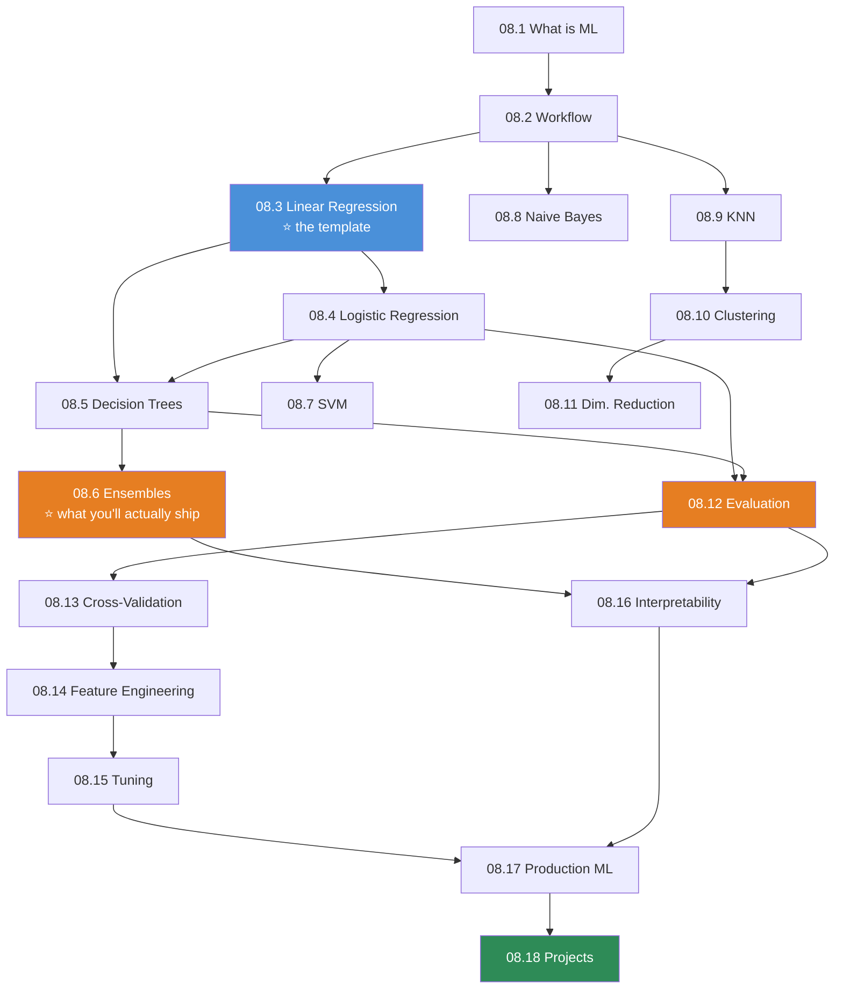

# Module 08 · Machine Learning Foundations — Lessons

[⬅ Module home](../README.md) · [🗺 Roadmap](../../../ROADMAP.md) · [📚 Curriculum](../../../CURRICULUM.md)

> This is the map of Module 08. **Every algorithm is built from scratch in NumPy before scikit-learn is allowed in the room.** The objective is to *understand* machine learning, not to call it.

---

## The rule of this module

> [!IMPORTANT]
> **From scratch first. Library second. Always.**
>
> `LinearRegression().fit(X, y)` is one line, and it teaches you **nothing**. You cannot debug what you cannot picture. When your model won't converge, when the loss goes to `NaN`, when the coefficients are absurd, when it works offline and dies in production — **the people who can fix it are the people who once wrote the update rule by hand.**
>
> So: **derive it → implement it in NumPy → verify it against scikit-learn with `np.allclose` → then use the library forever.** The from-scratch version is not a toy. It is the thing that makes the library transparent.

This module cashes in everything so far: the [gradients](../../06-Mathematics/weeks/06.4-calculus.md) and [optimizers](../../06-Mathematics/weeks/06.7-optimization.md) from Module 06, the [clean, honest datasets](../../07-Data-Analysis/README.md) from Module 07. **Module 08 is where `model.fit(X, y)` finally happens — and you already know why every part of it works.**

---

## Lessons

| # | Lesson | Section |
|---|---|---|
| 08.1 | [What Is Machine Learning?](08.1-what-is-ml.md) | §1 AI vs ML vs DL; supervised, unsupervised, self-supervised, RL |
| 08.2 | [The ML Workflow](08.2-ml-workflow.md) | §2 problem → data → features → train → validate → deploy → monitor |
| 08.3 | [Linear Regression](08.3-linear-regression.md) | §3 intuition, MSE, normal equations, gradient descent |
| 08.4 | [Logistic Regression](08.4-logistic-regression.md) | §4 sigmoid, log-loss, decision boundary |
| 08.5 | [Decision Trees](08.5-decision-trees.md) | §5 entropy, information gain, Gini, pruning |
| 08.6 | [Ensembles — Bagging & Boosting](08.6-ensembles.md) | §6 bootstrapping, Random Forest, gradient boosting, XGBoost |
| 08.7 | [Support Vector Machines](08.7-svm.md) | §7 hyperplanes, margins, the kernel trick |
| 08.8 | [Naive Bayes](08.8-naive-bayes.md) | §8 Bayes' theorem, the naive assumption, text classification |
| 08.9 | [K-Nearest Neighbors](08.9-knn.md) | §9 distance metrics, voting, KD-trees, the curse of dimensionality |
| 08.10 | [Clustering](08.10-clustering.md) | §10 K-Means, hierarchical, DBSCAN |
| 08.11 | [Dimensionality Reduction](08.11-dimensionality-reduction.md) | §11 PCA from scratch, t-SNE, UMAP |
| 08.12 | [Model Evaluation](08.12-evaluation.md) | §12 confusion matrix, precision, recall, F1, ROC-AUC, PR-AUC |
| 08.13 | [Cross-Validation & Leakage](08.13-cross-validation.md) | §13 K-fold, stratified, grouped, time-series; **leakage** |
| 08.14 | [Feature Engineering for ML](08.14-feature-engineering.md) | §14 scaling, encoding, selection, imbalanced data |
| 08.15 | [Hyperparameter Tuning](08.15-hyperparameter-tuning.md) | §15 grid, random, Bayesian optimization |
| 08.16 | [Model Interpretability](08.16-interpretability.md) | §16 feature importance, SHAP, LIME |
| 08.17 | [Production ML](08.17-production-ml.md) | §17 pipelines, serialization, versioning, drift, retraining |
| 08.18 | [Projects & Summary](08.18-projects-summary.md) | §18 seven projects + module consolidation |

### Companion artifacts
- 🏋️ [Exercises](../exercises/) — math, NumPy implementation, debugging, evaluation, algorithm comparison
- 🧠 [Flashcards](../flashcards/deck.md) — spaced-repetition deck
- 📝 [Quiz](../quizzes/quiz-01.md) — self-assessment with answers
- 📄 [Cheat sheet](../cheat-sheets/ml-cheatsheet.md) — algorithms, metrics, complexity, and when to use what

---

## How the lessons build

**08.3 Linear Regression is the template.** Every subsequent algorithm reuses the same four-part skeleton: *a model, a loss, a gradient, an update rule.* Learn it once, deeply, and the rest of the module is variations.

**Estimated time:** ~28 hours reading · ~14 hours projects · ~6 hours review.

---

## What carries over

| From | Where it lands |
|---|---|
| [06.4 Gradients & chain rule](../../06-Mathematics/weeks/06.4-calculus.md) | Every `fit()` in this module |
| [06.7 Optimization](../../06-Mathematics/weeks/06.7-optimization.md) | Gradient descent, SGD, convergence |
| [06.8 Cross-entropy](../../06-Mathematics/weeks/06.8-information-theory.md) | Logistic regression's loss; decision-tree entropy |
| [06.3 SVD & eigenvectors](../../06-Mathematics/weeks/06.3-linear-algebra-decomposition.md) | PCA, from first principles |
| [06.5 Bayes & base rates](../../06-Mathematics/weeks/06.5-probability.md) | Naive Bayes; why accuracy lies |
| [06.6 Bootstrap & CIs](../../06-Mathematics/weeks/06.6-statistics.md) | Bagging; honest metric reporting |
| [07.5–07.7 Cleaning, EDA, features](../../07-Data-Analysis/README.md) | The `X` and `y` you're about to fit |
| [07.11 Pipelines & leakage](../../07-Data-Analysis/weeks/07.11-pipelines.md) | The `fit`/`transform` contract, now with a model attached |

> [!TIP]
> **Before every algorithm, ask three questions:** *What does it assume? What is it optimizing? Where does it break?* Every algorithm is a **bet about the shape of your data** — linear regression bets on a straight line, KNN bets that near things are alike, Naive Bayes bets that features are independent. **The algorithm that wins is the one whose bet matches your data.** That's the whole of model selection, and it's why you have to know what each one assumes.
